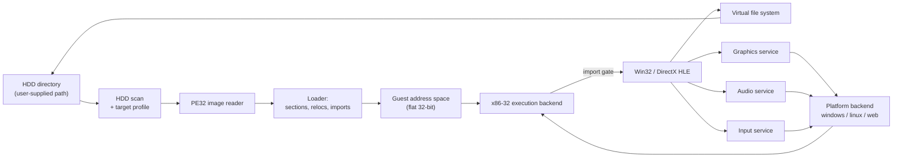
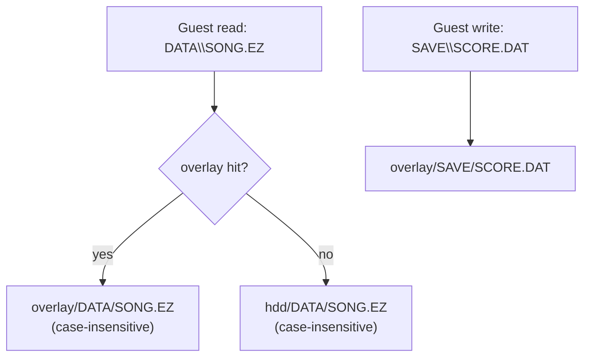
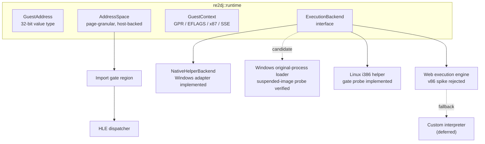

# 아키텍처 / Architecture

이 문서는 현재 저장소에 구현된 구조와, 그 구조가 향후 확장될 방향을 기술한다. 구현이 바뀌면 같은 작업에서 이 문서를 갱신한다.

*This document describes the structure currently implemented in the repository and how it is intended to grow. Update it in the same task whenever the implementation changes.*

> [!NOTE]
> 아래 표기 규칙을 따른다. **[구현됨]** 은 저장소에 코드가 있고 빌드·테스트로 확인된 것, **[설계됨]** 은 인터페이스만 정해진 것, **[계획]** 은 아직 설계 문서만 있는 것이다.
>
> *Sections are marked **[Implemented]** when code exists and is verified by a build or test, **[Designed]** when only the interface is fixed, and **[Planned]** when only a design note exists.*

---

## 1. 실행 모델 / Execution model

게스트는 32비트 x86 Win32 PE 실행 파일이다. Windows 1차 host는 Win32 제품 CLI, shared `WindowsOriginalProcessBackend`와 original-child process로 구성된다. 진단 launcher도 같은 backend engine을 사용한다. Linux는 x86-64 제품 CLI와 별도 i386 helper를 `ExecutionBackend` 뒤에 연결해 원본 entry의 첫 통제 경계까지 실행하며 WebAssembly 실행 엔진은 후속 대상이다.

*The guest is a 32-bit x86 Win32 PE executable. The primary Windows host consists of the Win32 product CLI, a shared `WindowsOriginalProcessBackend`, and the original child process; the diagnostic launcher uses the same backend engine. Linux connects the x86-64 product CLI to a separate i386 helper behind `ExecutionBackend` and runs the original entry to its first controlled boundary. The WebAssembly execution engine remains later work.*

HLE 경계는 **Win32 import thunk**다. 로더가 게스트의 import table을 해석할 때, 각 API를 실제 DLL이 아니라 합성 gate 주소로 바인딩한다. 실행 backend가 gate 주소로 제어를 넘기면 C++ 구현이 호출된다.

*The HLE boundary is the **Win32 import thunk**. When the loader parses the guest import table, it binds each API to a synthetic gate address instead of a real DLL. Control transferred to a gate address dispatches into the C++ implementation.*



---

## 2. 계층과 디렉터리 / Layers and directories

| 계층 / Layer | 경로 / Path | 책임 / Responsibility | 상태 |
| --- | --- | --- | --- |
| HDD 입력 | `include/re2dj/hdd/`, `src/hdd/` | 사용자가 준 디렉터리 검증, 대소문자 무시 경로 해석, 실행 파일 스캔 | **[구현됨]** |
| MAME CHD 입력 | `include/re2dj/storage/mame_chd.h`, `src/storage/mame_chd.cpp` | libchdr 기반 CHD header·metadata·hunk·sector read-only adapter | **[구현됨]** |
| FAT32 CHD 파일시스템 | `include/re2dj/storage/fat32_chd.h`, `src/storage/fat32_chd.cpp` | MBR/BPB/FAT chain/LFN/file-range read-only view와 실행 파일 staging | **[구현됨]** |
| 게스트 경로 | `include/re2dj/storage/`, `src/storage/` | Win32 경로 파싱·정규화, 드라이브 문자 매핑, overlay 정책과 파일 테이블 | **[구현됨]** |
| 실행 파일 분석 | `include/re2dj/exe/`, `src/exe/` | PE32 헤더·섹션·디렉터리 판독 | **[구현됨]** (헤더·섹션), **[계획]** (import/reloc) |
| 타깃 프로파일 | `include/re2dj/target/`, `src/target/` | 버전별 실행 파일 경로, 작업 디렉터리, HLE 프로파일 ID | **[구현됨]** (자료구조·감지), **[계획]** (버전별 항목) |
| 런타임 | `include/re2dj/runtime/`, `src/runtime/` | 게스트 주소 공간, 레지스터 컨텍스트, 실행 backend 인터페이스 | **[계획]** |
| HLE | `include/re2dj/hle/`, `src/hle/` | kernel32/user32/gdi32/ddraw/dsound/dinput 모듈 테이블과 구현 | **[계획]** |
| 설정 | `include/re2dj/config/`, `src/config/` | INI 파싱, 키 바인딩, 실행 옵션 | **[계획]** |
| 플랫폼 | `src/platform/{windows,linux,web}/` | 창·렌더·오디오·입력·시간의 호스트 구현 | **[계획]** |
| 호스트 | `src/host/cli/` | 명령행 진입점 | **[구현됨]** |
| 도구 | `src/tools/{hdd_probe,chd_probe,pe_analyzer}/` | 비실행 HDD·CHD·PE 분석 도구 | **[구현됨]** |

*The table above maps each layer to its directory, responsibility, and current status.*

설정 계층의 Hardlock 비밀 설정 경계는 **[구현됨]** 상태입니다. `HardlockSecretMaterial`은 선택 프로파일의 module address와 세 seed를 프로세스 memory 안에서만 보유합니다. ez2dj4th는 명시적 옵션이 없으면 Git-ignore된 `cfg/hardlock.ini`의 해당 profile section을 읽으며, 저장소 내부 경로는 `cfg/` 아래만 허용합니다. 명시적인 저장소 외부 경로도 지원합니다. launcher는 값을 명령행이나 로그에 넣지 않고 Windows x86 injected runtime export에 직접 쓰며, 다른 프로파일은 이 설정을 거부합니다.

*The Hardlock secret-configuration boundary in the configuration layer is **[Implemented]**. `HardlockSecretMaterial` retains the selected profile's module address and three seeds only in process memory. Without an explicit option, ez2dj4th reads its profile section from Git-ignored `cfg/hardlock.ini`; repository-internal paths are allowed only below `cfg/`, while explicit external paths remain supported. The launcher writes values directly to Windows x86 injected-runtime exports without placing them on the command line or in logs, and other profiles reject this configuration.*

플랫폼 중립 `HardlockProtocolTracker`도 **[구현됨]** 상태입니다. 확인된 `0x468 → 0x450 → 0x44c → 0x458` 순서와 exact buffer shape를 추적하고 descriptor의 Function, block count 및 configured module-address 일치 여부를 값 비노출 boolean으로 판정합니다. 이 경계는 응답을 합성하지 않습니다. Function `0x0e` bit-level transform과 유효한 `0x450` driver response는 허용 가능한 독립 근거가 없어 아직 **[계획]** 상태입니다.

*The platform-neutral `HardlockProtocolTracker` is also **[Implemented]**. It tracks the confirmed `0x468 → 0x450 → 0x44c → 0x458` order and exact buffer shapes, then validates descriptor function, block count, and configured module-address matching using value-free Booleans. It does not synthesize responses. The Function `0x0e` bit-level transform and a valid `0x450` driver response remain **[Planned]** because no policy-compatible independent basis is available yet.*

---

## 3. HDD 디렉터리 입력 / HDD directory input **[구현됨]**

원본 HDD 내용은 **디렉터리 경로**로 입력받는다. 이미지 파일(`.img`, `.vhd`)을 직접 마운트하지 않는다. 사용자가 이미지를 풀어 놓은 디렉터리를 그대로 가리키면 된다.

*Original HDD contents arrive as a **directory path**. Image files are not mounted directly; the user points at a directory into which the image was already extracted.*

CHD-backed target은 이 디렉터리 경계와 병렬인 `MameChdImage` read-only block boundary를 사용한다. `Fat32Volume`은 CHD logical sector에서 MBR/BPB/FAT/LFN을 읽고 `EZ2DJ/EZ2DJ.EXE`를 확인한다. Windows x86 launcher는 PE와 profile sibling만 staging하고 CHD 경로를 injected runtime에 전달해 guest read를 pseudo handle로 서비스한다. CHD 실행에서는 부모 CLI가 확인한 staging 기준 executable 상대 경로도 `--target-executable`로 전달하여 launcher의 directory scan이 CHD 전용 프로파일을 잃지 않게 한다.

*CHD-backed targets use a read-only `MameChdImage` block boundary parallel to the directory boundary above. `Fat32Volume` reads MBR/BPB/FAT/LFN data directly from CHD sectors and confirms `EZ2DJ/EZ2DJ.EXE`. The Windows x86 launcher stages the PE and profile siblings, passes the CHD path to the injected runtime, and serves guest reads through pseudo handles. For CHD launches, the parent CLI also forwards the staging-relative executable path as `--target-executable`, so a launcher directory scan cannot lose a CHD-only profile.*

```
re2dj --hdd /path/to/ez2dj_hdd
```

`re2dj::hdd::HddRoot`가 그 경로를 소유하며 다음을 책임진다.

* 경로 존재와 디렉터리 여부 검증
* 게스트 상대 경로를 호스트 실제 경로로 해석. **대소문자를 무시한다.**
* 해석 결과 캐시

*`re2dj::hdd::HddRoot` owns the path and is responsible for validating it, resolving guest-relative paths to real host paths **case-insensitively**, and caching the result.*

### 왜 대소문자 무시 해석이 필요한가 / Why case-insensitive resolution is required

원본은 Windows에서 동작했으므로 게임 코드가 `DATA\Song01.EZ`처럼 실제 파일명과 대소문자가 다른 문자열로 파일을 열어도 동작했다. Linux와 Web 호스트의 파일 시스템은 대소문자를 구분하므로, 그대로 넘기면 열리지 않는다. `HddRoot`는 각 경로 구성 요소를 디렉터리 항목과 대소문자 무시로 대조해 실제 이름을 찾는다.

*The original ran on Windows, so game code could open `DATA\Song01.EZ` with a case that does not match the real file name. Linux and Web host file systems are case-sensitive, so the open would fail. `HddRoot` matches each path component against directory entries case-insensitively to find the real name.*

대조는 항상 디렉터리 나열 결과를 기준으로 한다. 정확히 일치하는 항목이 있으면 그것을 쓰고, 없으면 대소문자 무시로 처음 일치한 항목을 쓴다. 요청된 철자를 먼저 시도하면 Windows에서는 성공하고 Linux에서는 실패해, 같은 덤프가 호스트마다 다른 경로를 내놓는다. 나열 결과는 디렉터리 단위로 캐시한다.

*Matching always goes through the directory listing: an exact match wins, otherwise the first case-insensitive match does. Probing the requested spelling first would succeed on Windows and fail on Linux, so one dump would yield different paths per host. Listings are cached per directory.*

### 쓰기 정책 / Write policy **[구현됨]**

게스트의 파일 쓰기는 원본 디렉터리를 변경하지 않는다. 쓰기는 별도 overlay 디렉터리로 향하며, 읽기는 overlay를 먼저 조회한 뒤 원본으로 내려간다. overlay 우선 조회도 Win32 의미를 보존하기 위해 구성요소별 정확한 이름을 우선하고 없으면 ASCII 대소문자를 무시해 찾는다. `--hdd`는 전체 dump root이고 Windows x86 launcher는 선택된 target profile의 `working_directory_relative_path`를 안전하게 해석해 guest `D:\ez2dj`와 상대 경로의 source mount로 주입한다. 빈 working directory만 dump root 자체를 뜻한다.

*Guest file writes never modify the original directory. Writes go to a separate overlay directory, and reads consult the overlay before falling through to the original. Overlay lookup preserves Win32 semantics by preferring an exact component match and otherwise using an ASCII case-insensitive fallback. `--hdd` denotes the complete dump root; the Windows x86 launcher safely resolves the selected target profile's `working_directory_relative_path` and injects it as the source mount for guest `D:\ez2dj` and relative paths. Only an empty working directory maps directly to the dump root. The runtime clones an existing original file to the overlay before an `OPEN_EXISTING` write, so the original stays unchanged.*



### Windows x86 이미지 로더 경계 / Windows x86 image-loader boundary **[구현됨]**

원본은 자산 이름을 검색 경로 테이블로 해석한 뒤 `CreateFileA`로 존재를 확인하고, 실제 비트맵은 `USER32!LoadImageA(NULL, path, IMAGE_BITMAP, 0, 0, LR_LOADFROMFILE | LR_CREATEDIBSECTION)`로 읽는다. 따라서 VFS는 `KERNEL32!CreateFileA`만으로는 완결되지 않는다. `Re2djVfsLoadImageA`는 문자열 상대경로 + `IMAGE_BITMAP` + `LR_LOADFROMFILE` 조합에만 읽기 전용 HDD/overlay 매핑을 적용하고, resource ID·다른 image type·다른 flag는 원래 `LoadImageA`로 그대로 넘긴다. launcher는 이 패치 준비 상태를 다른 VFS 패치와 분리해 추적하므로, 실패해도 뒤따르는 device 패치를 조용히 건너뛰지 않고 `vfs_image_loader` 진단 이벤트로 드러난다.

원본 `.str` 장면 스크립트 로더는 `FILE_FLAG_NO_BUFFERING`으로 열고 sector 배수가 아닌 파일 크기 전체를 정렬되지 않은 pool 버퍼로 읽는다. Windows 9x는 이 정렬 요구를 강제하지 않았지만 NT 커널은 강제하므로 `ReadFile`이 `ERROR_INVALID_PARAMETER`로 실패한다. VFS `CreateFileA` 경계는 게스트가 기대한 OS 의미를 복원하기 위해 `FILE_FLAG_NO_BUFFERING`만 제거하고 나머지 flag는 그대로 전달한다. 캐싱 정책만 달라지고 게스트가 받는 바이트는 동일하다.

*The original `.str` scene-script loader opens with `FILE_FLAG_NO_BUFFERING` and then reads a whole non-sector-multiple file into an unaligned pool buffer. Windows 9x did not enforce those alignment rules but the NT kernel does, so `ReadFile` fails with `ERROR_INVALID_PARAMETER`. To restore the OS semantics the guest expects, the VFS `CreateFileA` boundary strips `FILE_FLAG_NO_BUFFERING` alone and forwards every other flag; only the caching policy changes while the bytes the guest receives stay identical.*

자산 경계 진단은 `.bmp`와 `.str` 요청에 대해 호출 API, 게스트 요청 경로, 매핑된 호스트 경로, 성공 여부와 Win32 오류를 별도 bounded 로그에 남긴다. 확장자마다 상한을 따로 두어 대량 비트맵 스윕이 드문 script 요청을 가리지 못하게 한다. 파일 내용은 기록하지 않는다. 경로 해석은 게스트 안에서 일어나므로 존재하지 않는 후보에 `ERROR_FILE_NOT_FOUND`를 그대로 돌려주는 것이 계약이며, 진단 자체의 파일 I/O가 게스트가 읽을 last error를 덮지 않도록 보고 뒤에 오류를 확정한다. 확인된 호출 지점과 인자는 [자산 로딩 경로 분석](docs/analysis/ez2dj-asset-loading-path.md)에 있다.

*The original resolves an asset name through a search-path table, probes existence with `CreateFileA`, and then reads the actual bitmap with `USER32!LoadImageA(NULL, path, IMAGE_BITMAP, 0, 0, LR_LOADFROMFILE | LR_CREATEDIBSECTION)`, so a `KERNEL32!CreateFileA`-only VFS is incomplete. `Re2djVfsLoadImageA` applies the read-only HDD/overlay mapping solely to the string-relative-path + `IMAGE_BITMAP` + `LR_LOADFROMFILE` combination and forwards resource IDs, other image types, and other flags unchanged. The launcher tracks this patch's readiness separately from the other VFS patches, so a failure surfaces as a `vfs_image_loader` diagnostic event instead of silently skipping the device patches that follow.*

*The asset-boundary diagnostic records the calling API, guest request path, mapped host path, success status, and Win32 error for `.bmp` and `.str` requests in a separate bounded log, with a per-extension bound so a large bitmap sweep cannot hide the rarer script requests. It never records file contents. Because path resolution happens inside the guest, returning `ERROR_FILE_NOT_FOUND` for absent candidates is the contract, and the error is committed after reporting so the diagnostic's own file I/O cannot overwrite what the guest reads back. Confirmed call sites and arguments are in the [asset loading path analysis](docs/analysis/ez2dj-asset-loading-path.md).*

### Windows x86 가상 디바이스 경계 / Windows x86 virtual-device boundary **[구현됨]**

주입 runtime은 launcher의 `--device-mock-lptdi` 정책이 켜졌을 때 `CreateFileA("\\.\LPTDI*")`를 import thunk에서 가로채 예약 범위 `0xFEED0001..0xFEED00FF`의 synthetic handle을 반환한다. 파일 wrapper는 이 핸들에 EOF형 read, 쓰기 거부, seek/size 미지원, `FILE_TYPE_CHAR`, 성공 close 계약을 제공한다. 정책이 꺼져 있거나 다른 경로이면 기존 VFS/host 경로로 내려간다. 기본 `--device-mock-lptdi`는 `DeviceIoControl`을 host에 전달해 실패 baseline을 보존한다. 실험 옵션은 canonical IAT를 runtime wrapper로 바꾼다. zero/full-success mode 외에 `--device-mock-lptdi-response-profile`은 공용 parser가 검증한 code별 exact-size bytes를 주입한다. `--device-mock-lptdi-target-state`는 공용 `lptdi_challenge_response` 변환으로 실행별 두 번째 input seed에 적응하는 response offset 4~11을 만들며, guest XOR 뒤 선택한 8바이트 상태가 남게 한다. 각 IOCTL 정책은 상호 배타적이고 synthetic handle·확인된 code에만 적용된다. `--lptdi-post-ioctl-trace`는 합성 래퍼도 API watch에 등록하고 guest 복귀 후 같은 allocation의 명령을 bounded single-step으로 기록하며, 외부 call은 one-shot return breakpoint로 건너뛴다. syscall resume breakpoint와 trace breakpoint가 같은 주소를 공유하면 원래 바이트 소유권을 trace에 넘기고, trace가 이미 복귀 대기 중일 때 외부 single-step을 중복 처리하지 않는다. launcher는 원본 entry의 첫 `GetVersion` caller에서 `.data` initializer 8 DWORD를 한 번 기록해 복원 여부를 검증한다. API trace는 USER32도 해석해 창·display 초기화의 파일 접근 전 실패를 귀속한다. 다른 handle은 항상 host로 전달한다.

*When launcher policy `--device-mock-lptdi` is enabled, the injected runtime intercepts `CreateFileA("\\.\LPTDI*")` at the import thunk and returns a synthetic handle in reserved range `0xFEED0001..0xFEED00FF`. File wrappers give that handle EOF-style reads, denied writes, unsupported seek/size, `FILE_TYPE_CHAR`, and successful close semantics. Disabled policy and all other paths fall through to the existing VFS/host path. The base option forwards DeviceIoControl to preserve the host-failure baseline, while experimental options replace the canonical IAT slot. Besides zero/full-success modes, `--device-mock-lptdi-response-profile` injects code-specific exact-size bytes validated by the shared parser. `--device-mock-lptdi-target-state` uses the shared `lptdi_challenge_response` transform to adapt response offsets 4 through 11 to each second-input seed, leaving the selected eight-byte state after the guest XOR. IOCTL policies are mutually exclusive and apply only to synthetic handles and confirmed codes. `--lptdi-post-ioctl-trace` also registers the synthetic wrapper as an API watch and records bounded same-allocation guest instructions after return, skipping external calls with one-shot return breakpoints. When a syscall-resume and trace breakpoint share an address, original-byte ownership transfers to the trace, and an external single-step is not reprocessed while that trace already awaits resume. The launcher records the eight-DWORD `.data` initializer once at the original entry's first `GetVersion` caller to verify restoration. API tracing also resolves USER32 and observes window/display startup calls so pre-file initialization failures remain attributable. Other handles always forward to the host.*

### Windows x86 논리 display mode 경계 / Windows x86 logical display-mode boundary **[구현됨]**

launcher의 `--hle-display-mode`는 원본 USER32 import thunk의 `ChangeDisplaySettingsExA`만 주입 runtime wrapper로 바꾼다. wrapper는 관찰된 null-device, 640×480×16, `CDS_UPDATEREGISTRY`, null-reserved 요청만 `DISP_CHANGE_SUCCESSFUL`로 처리하고 host desktop은 변경하지 않는다. 다른 mode 변경과 restore 요청은 host USER32로 전달한다. 이 정책은 guest가 기대하는 표시 mode 계약만 보존하며 실제 surface 출력과 scaling은 후속 그래픽 backend의 책임으로 남긴다.

*Launcher option `--hle-display-mode` replaces only the original USER32 `ChangeDisplaySettingsExA` import thunk with an injected-runtime wrapper. The wrapper returns `DISP_CHANGE_SUCCESSFUL` without changing the host desktop only for the observed null-device 640×480×16 `CDS_UPDATEREGISTRY` request with a null reserved argument. Other mode changes and restore requests forward to host USER32. This preserves the guest-visible mode contract while leaving real surface output and scaling to a later graphics backend.*

`--d3d-init-trace`는 1st SE 원본 초기화 coordinator의 다섯 return site에 일회성 breakpoint를 두고 반환값, DirectDraw/Direct3D COM 전역, phase marker를 기록한 뒤 원본 바이트를 복원한다. 이 진단은 guest 결과를 바꾸지 않는다. 현재 증거는 import-thunk display HLE 다음 경계가 `IDirect3D3::FindDevice` 같은 COM method임을 보여 준다. 후속 graphics HLE는 host COM vtable을 직접 수정하지 않고 `DirectDrawCreate` import에서 시작하는 교체 가능한 proxy interface 계층으로 설계해야 한다.

*`--d3d-init-trace` places one-shot breakpoints at the five return sites of the 1st SE initialization coordinator, records results, DirectDraw/Direct3D COM globals, and phase markers, then restores the original bytes. It does not change guest results. Current evidence places the next boundary after import-thunk display HLE at a COM method such as `IDirect3D3::FindDevice`; the later graphics HLE should therefore use replaceable proxy interfaces rooted at the `DirectDrawCreate` import rather than patching a host COM vtable in place.*

### Direct3D 3 OpenGL HLE / Direct3D 3 OpenGL HLE **[부분 구현 / Partially implemented]**

`IDirect3DTexture2::Load`는 같은 DirectDraw root에 속한 동일 크기 RGB565 texture surface 사이에서 pixel row와 `DDCKEY_SRCBLT`를 destination으로 복사하고 content revision을 증가시킨다. 따라서 GDI로 채운 source texture와 draw에 사용하는 destination texture가 분리된 원본 경로도 surface identity/cache 계약을 유지한다. 크기나 format 변환은 지원하지 않으며 명시적 실패를 반환한다. 상세 계약은 [Direct3D 3 texture Load 복사 설계](docs/design/20260829-088-direct3d-texture-load.md)에 둔다.

*`IDirect3DTexture2::Load` copies pixel rows and `DDCKEY_SRCBLT` between equal-sized RGB565 texture surfaces owned by the same DirectDraw root, then increments the destination content revision. This preserves the surface-identity/cache contract when the original populates one source texture through GDI but draws a separate destination texture. Format conversion and scaling are unsupported and return an explicit failure. See the [Direct3D 3 texture Load copy design](docs/design/20260829-088-direct3d-texture-load.md).*

`DrawPrimitive`의 플랫폼 중립 정점 경로는 기존 screen-space `D3DFVF_TLVERTEX(0x1c4)`뿐 아니라 원본에서 관찰된 32바이트 `D3DVERTEX(0x112)`와 `D3DLVERTEX(0x1e2)`를 지원한다. 변환 전 XYZ는 저장된 Direct3D row-vector world → view → projection matrix와 `D3DVIEWPORT2`를 거쳐 기존 `TransformedLitVertex` 명령으로 정규화된다. `0x112`의 normal은 lighting 증거가 확보될 때까지 건너뛰고 diffuse white를 사용하며, `0x1e2`의 `RESERVED1` 4바이트를 실제 stride와 field offset에 포함한다. 상세 계약은 [변환 전 Direct3D 3 정점 draw 설계](docs/design/20260829-089-untransformed-direct3d-draw.md)에 둔다.

*The platform-neutral `DrawPrimitive` vertex path supports not only the existing screen-space `D3DFVF_TLVERTEX(0x1c4)` but also the observed 32-byte `D3DVERTEX(0x112)` and `D3DLVERTEX(0x1e2)` layouts. Pre-transform XYZ passes through retained Direct3D row-vector world, view, and projection matrices plus `D3DVIEWPORT2`, producing the existing `TransformedLitVertex` command. The `0x112` normal is skipped with white diffuse until lighting evidence is available, while the four-byte `RESERVED1` field in `0x1e2` participates in the actual stride and offsets. See the [untransformed Direct3D 3 vertex draw design](docs/design/20260829-089-untransformed-direct3d-draw.md).*

`IDirect3DDevice3::DrawIndexedPrimitiveVB`는 facade가 소유한 `LegacyVertexBuffer`와 16-bit index array를 받는다. 공용 `ExpandIndexedVertices`가 모든 index를 descriptor의 vertex count에 대해 범위 검사하고 stride 단위 stream으로 전개한 뒤 기존 transformed/untransformed decoder에 전달한다. draw 중 lock된 buffer, 다른 DirectDraw root의 facade, 잘못된 guest pointer와 범위 밖 index는 명시적으로 실패한다. `D3DPT_TRIANGLELIST`는 공용 `PrimitiveTopology::kTriangleList`로 유지되어 SDL/OpenGL backend의 `GL_TRIANGLES`에 대응한다. 상세 근거는 [작업 095 설계](docs/design/20260829-095-execute-zero-crash.md)에 둔다.

*`IDirect3DDevice3::DrawIndexedPrimitiveVB` consumes a facade-owned `LegacyVertexBuffer` and a 16-bit index array. Shared `ExpandIndexedVertices` bounds-checks every index against the descriptor vertex count, expands a stride-sized stream, and passes it through the existing transformed or untransformed decoder. Locked buffers, facades from another DirectDraw root, invalid guest pointers, and out-of-range indices fail explicitly. `D3DPT_TRIANGLELIST` remains `PrimitiveTopology::kTriangleList` through the common command and maps to `GL_TRIANGLES` in the SDL/OpenGL backend. See the [Task 095 design](docs/design/20260829-095-execute-zero-crash.md).*

그래픽 HLE는 `DirectDrawCreate` import gate, guest 소유 32비트 COM facade, 플랫폼 중립 legacy graphics core, 교체 가능한 `RenderBackend`의 네 계층으로 구성한다. COM facade는 `IDirectDraw`/`IDirectDraw4`/`IDirect3D3`/`IDirect3DDevice3` identity와 vtable, reference count를 보존한다. legacy core는 guest surface의 16비트 layout·pitch·lock 상태와 정규화된 fixed-function state를 소유하며 OpenGL type이나 platform context API를 포함하지 않는다.

첫 backend는 desktop OpenGL이고 Web은 같은 `RenderBackend` 계약을 WebGL 2로 구현한다. deprecated OpenGL fixed-function state에 직접 의존하지 않고 내부 shader로 관찰된 Direct3D 3 상태를 재현한다. `FindDevice`는 host HAL 열거를 전달하지 않고 구현된 capability만 선언하는 가상 hardware device를 노출한다. primary/back/depth/texture surface는 논리 객체로 유지하며, 기존 640×480×16 display-mode HLE와 결합해 host desktop mode를 바꾸지 않고 present한다. 상세 단계와 미확정 항목은 [Direct3D 3 OpenGL HLE 설계](docs/design/20260825-061-direct3d3-opengl-hle.md)에 둔다.

Windows x86 COM 연결은 `src/platform/windows/direct3d3_com_facade.*`에만 남고, 실제 렌더러는 `include/re2dj/graphics/sdl3_opengl_backend.h`와 `src/graphics/sdl3_opengl_backend.cpp`의 공용 SDL3/OpenGL backend다. Windows에서는 SDL3가 원본이 만든 HWND를 external window로 감싸고, Linux와 Web에서는 같은 backend가 SDL window/canvas를 소유할 수 있다. SDL3가 video subsystem, OpenGL context, 함수 해석, drawable 크기와 swap을 제공하므로 WGL과 `opengl32` 직접 의존성은 없다. desktop은 OpenGL 2.1/GLSL 1.20, Web은 OpenGL ES 2.0/WebGL 호환 GLSL ES 1.00 분기를 사용한다. `LegacyDrawCommand`와 `LegacyFixedFunctionState`는 확인된 XYZRHW, stage-zero modulate, linear filter, alpha test와 blend factor를 전달한다. `LegacyTextureView`는 RGB565 backing, stable identity/revision과 inclusive source color-key 범위를 보존하고 backend는 surface별 texture cache에서 변경 revision만 upload한다. `LegacyVertexBuffer`와 Windows `IDirect3DVertexBuffer` facade는 XYZ/NORMAL/TEX1 121개 정점을 3,872바이트 storage로 보존한다. 상세 변경은 [SDL3/OpenGL 공용 backend 설계](docs/design/20260827-076-sdl3-opengl-shared-backend.md)에 둔다.

Win32 창 정책은 `src/platform/windows/window_mode.*`와 `host_window_shell.*`에 분리한다. 표준 top-level host shell은 DWM, `re2DJ v<version> - Build <date> - SDL3 OpenGL - FPS : <value>` 상태 제목, icon, resize/fullscreen과 close를 소유하고, 원본 HWND는 `WS_CHILD`로 host client를 채우며 SDL3/OpenGL external rendering 대상에 그대로 남는다. 성공한 DirectDraw `Flip`은 약 1초마다 소수점 한 자리 FPS를 갱신한다. SDL 초기화 전에는 96-DPI frame으로 1차 배치하고, SDL video가 per-monitor DPI context를 확정한 뒤 `GetDpiForWindow`와 `AdjustWindowRectExForDpi`로 window mode를 다시 적용한다. 144-DPI 검증에서 outer `1302×1016`, host/guest client 1280×960과 DWM 기본 caption을 확인했다. 외부 `--fullscreen`은 같은 host shell을 monitor bounds `WS_POPUP`으로 바꾸며 host display mode는 변경하지 않는다. host close는 guest/SDL teardown을 먼저 호출할 때 확인된 termination 정체를 피하기 위해 current process 자신에게만 `TerminateProcess(..., 0)`을 즉시 사용한다. lifetime worker는 host HWND의 파괴·숨김을 감시하고 최소화는 종료로 오인하지 않는다. 상세 창 정책은 [Win32 창 모드와 메시지 pump 설계](docs/design/20260828-084-window-mode-message-pump.md), 종료 전달은 [Win32 창 닫기와 원본 프로세스 종료 설계](docs/design/20260829-090-window-close-process-exit.md), 제목과 기본 확대는 [설계 091](docs/design/20260829-091-window-title-default-scale.md), DWM/DPI 보정은 [설계 092](docs/design/20260829-092-dwm-caption-preservation.md)에 둔다.

SDL3/OpenGL backend는 guest의 논리 640x480 좌표를 유지하고, 매 draw에서 native window의 pixel 크기를 확인한다. WM_SIZE 또는 DPI 변경으로 크기가 달라지면 stale `glViewport`를 다시 적용하여 논리 좌표와 host pixel 매핑을 분리한다.

컬러키는 alpha 값이 아니라 **discard 조건**으로 구현한다. Direct3D는 `D3DRENDERSTATE_COLORKEYENABLE`이 켜진 동안 키에 일치하는 texel을 blend factor와 무관하게 버린다. texel alpha만으로 표현하면 `srcblend=ONE`, `dstblend=ZERO`인 복사 blend에서 keyed texel이 키 색 그대로 기록된다. backend는 upload 때 일치 texel의 alpha를 0으로 두고, 게스트 `COLORKEYENABLE` 상태로만 gate되는 shader 분기에서 그 texel을 버린다. 게스트 alpha test 분기는 원래 의미대로 별도로 남으며, 컬러키가 꺼진 draw는 영향을 받지 않는다. 특히 `srcblend=ZERO`, `dstblend=SRCCOLOR`인 곱셈 mask pass는 keyed texel을 버리면 mask가 무의미해지므로 반드시 게스트 상태로만 판단한다.

*Color keying is implemented as a **discard condition**, not as an alpha value. While `D3DRENDERSTATE_COLORKEYENABLE` is set, Direct3D drops key-matching texels regardless of the blend factors; expressing that through texel alpha alone writes them out in the key color under a copy blend of `ONE` and `ZERO`. The backend leaves matching texels at zero alpha during upload and drops them in a shader branch gated solely on the guest's `COLORKEYENABLE`. The guest alpha-test branch keeps its own meaning separately, and draws with keying disabled are unaffected — in particular the multiplicative mask passes using `srcblend=ZERO` and `dstblend=SRCCOLOR`, which would become meaningless if their keyed texels were dropped.*

DirectDraw 2D 경로는 texture뿐 아니라 `DDSCAPS_OFFSCREENPLAIN` surface에도 같은 RGB565 GDI backing과 stable identity/revision을 부여한다. 공용 `CopyRgb565Rectangle` 계약이 동일 크기 사각형과 inclusive source color key를 처리하며, facade의 `Blt`/`BltFast`는 CPU backing을 갱신하고 primary/back destination이면 같은 source 사각형을 OpenGL frame에 합성한다. stretch, ROP과 destination color key처럼 아직 관찰되지 않은 조합은 명시적으로 거절한다.

직접 x86 `IN`/`OUT`에는 교체 가능한 Win32 import가 없으므로 `Ez2DjIoBoard`의 플랫폼 중립 button/turntable/coin/light 상태를 `LegacyIoPortBus`가 raw byte 계약으로 변환하여 `ExecutionBackend` 경계에 둔다. Windows x86 진단 모드는 1st SE에서 확인된 helper RVA와 opcode, port만 debugger의 `EXCEPTION_PRIV_INSTRUCTION`으로 처리한다. 실제 실행용 `--run-detached`는 원본 entry 복원, runtime 주입과 IAT 검증 뒤 debugger를 분리하고, injected runtime의 vectored handler가 같은 제한 계약을 process 안에서 처리한다. 원본 instruction byte는 수정하지 않는다. 기본 idle bytes는 `ff ff 80 80 00 ff`다. port `0x105`는 keyboard coin false→true마다 1 증가하고 read로 소비되지 않는 modulo-256 counter다. 제품의 선택적 `--io-config`는 host INI의 absolute path를 runtime에 주입해 Windows keyboard adapter를 활성화한다. 외부 공개 구현에서 교차 확인한 물리 의미는 [I/O 분석](docs/analysis/ez2dj-io-map.md)처럼 원본 확인 사실과 구분한다.

*Direct x86 `IN`/`OUT` has no replaceable Win32 import. `LegacyIoPortBus` therefore adapts platform-neutral button, turntable, coin, and light state owned by `Ez2DjIoBoard` to the raw-byte contract at the `ExecutionBackend` boundary. The Windows x86 diagnostic path accepts only the helper RVAs, opcodes, and ports confirmed for 1st SE; detached product execution uses the equivalent injected vectored handler without modifying original instruction bytes. Idle bytes are `ff ff 80 80 00 ff`. Port `0x105` is a modulo-256 counter incremented on each keyboard coin false-to-true edge and is not consumed by reads. Optional product `--io-config` injects an absolute host INI path for the Windows keyboard adapter. Meanings cross-checked against a public implementation remain distinct from facts confirmed in the original executable.*

*The graphics HLE is split into a `DirectDrawCreate` import gate, guest-owned 32-bit COM facades, a platform-neutral legacy graphics core, and a replaceable `RenderBackend`. The COM layer preserves interface identity, vtables, and reference counts; the common core owns guest-visible surface layouts and normalized fixed-function state without OpenGL or platform context types. Desktop OpenGL is the first backend and WebGL 2 implements the same contract for Web. Internal shaders reproduce observed Direct3D 3 behavior, while a conservative virtual hardware device replaces host HAL enumeration. Logical primary, back, depth, and texture surfaces present through the existing 640×480×16 display contract without changing the host desktop mode.*

*Only the Windows x86 COM bridge remains platform-specific. The shared SDL3/OpenGL backend wraps the original HWND as an external SDL window on Windows and can own an SDL window or canvas on Linux and the Web. SDL3 supplies video initialization, context management, GL symbol resolution, drawable sizing, and swapping, removing direct WGL and `opengl32` dependencies. Desktop builds use OpenGL 2.1 with GLSL 1.20; Web uses an OpenGL ES 2.0/WebGL-compatible GLSL ES 1.00 branch. Stable texture identity/revision, inclusive RGB565 source keys, and the observed fixed-function state feed the same per-surface texture cache on all three builds. See the [shared SDL3/OpenGL backend design](docs/design/20260827-076-sdl3-opengl-shared-backend.md).*

*Win32 window policy is split between `src/platform/windows/window_mode.*` and `host_window_shell.*`. A standard top-level host shell owns DWM, the `re2DJ v<version> - Build <date> - SDL3 OpenGL - FPS : <value>` status title, icon, resize/fullscreen, and close; the original HWND remains the SDL3/OpenGL external rendering target as a `WS_CHILD` filling the host client. Successful DirectDraw `Flip` calls update one-decimal FPS about once per second. The first placement uses the pre-SDL 96-DPI frame, then window mode is reapplied with `GetDpiForWindow` and `AdjustWindowRectExForDpi` after SDL video establishes the per-monitor DPI context. Validation at 144 DPI confirms a `1302x1016` outer window, 1280x960 host/guest clients, and the native DWM caption. External `--fullscreen` changes the same host shell to monitor-bounds `WS_POPUP` without changing the host display mode. Because guest/SDL teardown before termination reproduced the confirmed stall, host close immediately uses `TerminateProcess(..., 0)` only on the current process. A lifetime worker monitors host-HWND destruction/hiding without treating minimization as close. See the [window-mode design](docs/design/20260828-084-window-mode-message-pump.md), [close design](docs/design/20260829-090-window-close-process-exit.md), [title/default-scale design](docs/design/20260829-091-window-title-default-scale.md), and [DWM/DPI design](docs/design/20260829-092-dwm-caption-preservation.md).*

*The SDL3/OpenGL backend keeps the guest's logical 640x480 coordinates and queries the native window's pixel size for each draw. When WM_SIZE or DPI changes alter that size, it reapplies the `glViewport` so stale host mapping cannot displace otherwise-correct logical coordinates.*

*The DirectDraw 2D path also gives `DDSCAPS_OFFSCREENPLAIN` surfaces RGB565 GDI backing and stable identity/revision. A common `CopyRgb565Rectangle` contract handles equal-sized rectangles and inclusive source color keys; facade `Blt`/`BltFast` update CPU backing and composite the same source rectangle into the OpenGL frame for primary/back destinations. Unobserved stretch, ROP, and destination-key combinations remain explicit failures.*

*Direct x86 `IN`/`OUT` has no Win32 import to replace, so a platform-neutral raw byte bus under `include/re2dj/input/` forms an execution-backend boundary. Debugger mode handles only confirmed 1st SE helper RVAs, opcodes, and ports. For real execution, `--run-detached` restores and verifies the guest first, detaches the debugger, and lets an injected vectored handler enforce the same narrow contract in-process without changing original instruction bytes.*

---

## 4. 게스트 경로 변환 / Guest path translation **[구현됨]**

게스트가 넘기는 경로는 Win32 문법이다. `re2dj::storage::GuestPath`가 이를 파싱해 다음을 구분한다.

* 드라이브 문자 (`C:\...`)
* 드라이브 상대 (`C:FOO`)
* 루트 상대 (`\FOO`)
* 순수 상대 (`FOO\BAR`)
* UNC (`\\server\share`) — 현재는 거부한다

*Guest paths use Win32 syntax. `re2dj::storage::GuestPath` parses them and distinguishes drive-absolute, drive-relative, root-relative, plain relative, and UNC forms. UNC is rejected for now.*

정규화 단계에서 `.`을 제거하고 `..`을 접으며, 구분자로 `/`와 `\`를 모두 받아들인다. 루트를 벗어나는 `..`은 실패로 처리해 HDD 디렉터리 바깥을 참조하지 못하게 한다.

*Normalization drops `.`, folds `..`, and accepts both `/` and `\` as separators. A `..` that would escape the root fails, so nothing outside the HDD directory is reachable.*

---

## 5. PE32 이미지 판독 / PE32 image reading **[구현됨]**

`re2dj::exe::PeImageInfo`는 원본 실행 파일에서 다음을 읽는다.

* DOS 헤더와 `e_lfanew`
* COFF 파일 헤더: machine, section 수, characteristics
* Optional header: magic(PE32 / PE32+), image base, entry point RVA, section/file alignment, subsystem, DLL characteristics
* Section 테이블: 이름, VA, 가상/원시 크기, 원시 오프셋, 특성
* Data directory: import, relocation, resource, TLS 위치

*`re2dj::exe::PeImageInfo` reads the DOS header, COFF file header, optional header, section table, and data directories from an original executable.*

이 판독기 자체는 **적재하지 않는다.** 파일을 읽어 구조만 보고한다. 실제 적재(섹션 매핑, 재배치, import 바인딩)는 구현된 런타임 계층의 `LoadPe32Image()`가 수행한다.

*This reader does **not** load anything; it reports structure only. The implemented runtime `LoadPe32Image()` performs section mapping, relocation, and import binding.*

HDD 스캔은 이 판독기를 사용해 각 실행 파일을 분류한다. `machine`이 x86(0x014C)이고 magic이 PE32(0x10B)이며 subsystem이 GUI인 항목이 게임 실행 파일 후보다.

*The HDD scan uses this reader to classify each executable. An entry with x86 machine (0x014C), PE32 magic (0x10B), and the GUI subsystem is a game-executable candidate.*

---

## 6. 타깃 프로파일 / Target profiles **[구현됨: 자료구조·실행 기본값]**

버전별 차이는 `re2dj::target::TargetProfile`로 분리한다.

| 필드 | 의미 |
| --- | --- |
| `id` | 명령행에서 고르는 짧은 식별자 |
| `display_name` | 사람이 읽는 이름 |
| `executable_relative_path` | HDD 루트 기준 실행 파일 경로. 지문이 맞을 때 채워진다 |
| `working_directory_relative_path` | 호스트 쪽 작업 디렉터리 |
| `guest_drive_letter` | 게스트가 자신이 실행된다고 믿는 드라이브. 근거가 없으면 `\0` |
| `guest_directory` | 같은 근거의 Win32 디렉터리. 근거가 없으면 빈 문자열 |
| `hle_profile_id` | 적용할 HLE 서비스 집합 |
| `run_defaults` | 프로파일 shortcut의 기본 HDD 경로와 Windows 실행 정책. 명령행 값이 덮어쓴다 |
| `detected` | 내장 표가 아니라 스캔에서 나온 것인지 |
| `bring_up_target` | 캐비닛이 실행한 것이 아니라 개발용인지 |
| `note` | 사람이 읽는 단서와 한계 |

*Version-specific differences live in `re2dj::target::TargetProfile`.*

프로파일의 `run_defaults`는 shortcut 기본 HDD 경로와 해당 원본 빌드에 대해 확인된 Windows HLE·detached 실행 정책을 소유한다. 감지 전용 프로파일은 이 값을 비워 검증되지 않은 실행 정책을 상속하지 않는다. CLI의 `--hdd`, `--target`, `--fullscreen`/`--windowed`, 오디오 값과 I/O 설정은 프로파일 기본값을 덮어쓴다.

*`run_defaults` owns the shortcut HDD path and the Windows HLE/detached execution policy confirmed for that original build. Detection-only profiles keep it empty, so they cannot inherit an unverified execution policy. CLI `--hdd`, `--target`, `--fullscreen`/`--windowed`, audio values, and I/O settings override the profile defaults.*

`run_defaults.hdd_input_kind`는 추출 디렉터리와 MAME CHD를 구분하고, CHD profile은 `default_hdd_image_relative_path`에 `roms/ez2dj4th`를 저장한다. 실제 4th CHD의 FAT32 경로와 PE32를 `re2dj_chd_probe`와 `Fat32Volume`으로 확인하며, `re2dj ez2dj4th --run`은 Windows x86에서 executable staging과 CHD-backed VFS 경계를 사용한다.

*`run_defaults.hdd_input_kind` distinguishes extracted directories from MAME CHDs, and the CHD profile stores `roms/ez2dj4th` in `default_hdd_image_relative_path`. The real 4th CHD FAT32 path and PE32 are confirmed by `re2dj_chd_probe` and `Fat32Volume`; `re2dj ez2dj4th --run` uses executable staging and the CHD-backed VFS boundary on Windows x86.*

### 지문으로 덤프를 식별한다 / Dumps are identified by fingerprint

내장 프로파일은 **실행 파일 이름 + 그 옆에 반드시 있어야 하는 항목 목록**으로 덤프를 식별한다. 파일 크기나 해시는 리비전마다 달라져 정상 덤프를 거부하므로 쓰지 않는다.

*A built-in profile identifies a dump by an **executable name plus the entries that must sit beside it**. File size and hashes are rejected as keys because they vary per revision and would reject a legitimate dump.*

| 프로파일 | 실행 파일 | 필수 형제 항목 |
| --- | --- | --- |
| `ez2dj1stse` | `ez2dj.exe` | `ez2dj1.exe`, `ez2dj.ini`, `System.ini`, `Songs`, `System` |
| `ez2dj1stse_unpacked` | `ez2dj1.exe` | `ez2dj.exe`, `ez2dj.ini`, `Songs`, `System` |
| `ez2dj3rd` | `EZ2DJ.EXE` | `EZ2DJ.INI`, `FONTKR.DAT`, `BG`, `Sound`, `system` |
| `ez2dj4th` | `EZ2DJ/EZ2DJ.EXE` inside FAT32 CHD | `EZ2DJ.INI`, `FONTKR.DAT`, `FONTEN.DAT`, `BG`, `SOUND`, `SYSTEM` |

형제 항목이 필요한 이유는 경로 해석이 대소문자를 무시하기 때문이다. 3rd의 `EZ2DJ.EXE`라는 이름만으로는 1st SE의 `ez2dj.exe`와 구별되지 않는다. 두 지문은 서로소라서 오인이 일어나지 않는다.

*The siblings are required because path resolution is case-insensitive, so the name `EZ2DJ.EXE` alone does not distinguish 3rd from 1st SE. The two fingerprints are disjoint, so neither dump matches the other.*

실행 파일을 스캔 결과에서 찾으므로 사용자가 상위 디렉터리를 지정해도 걸린다. 형제 항목은 그 실행 파일의 디렉터리를 기준으로 확인한다.

*Matching searches the scan, so pointing at a parent directory still works; siblings are checked relative to the matched executable's own directory.*

### 순서와 감지 / Ordering and detection

`BuildTargetProfiles()`는 내장 프로파일 중 지문이 맞는 것을 먼저 놓고, 내장이 가져가지 않은 실행 파일에 대해서만 `DetectTargetProfiles()`를 돌린다. 목록의 첫 항목이 기본 타깃이다.

내장 프로파일이 없는 버전의 덤프도 감지만으로 계속 동작한다. 내장 항목은 **실제로 확인한 덤프에 대해서만** 추가한다.

*`BuildTargetProfiles()` puts fingerprint matches first and runs detection only over the executables no built-in claimed; the first entry is the default target. A dump of a version with no built-in profile still works through detection alone. Built-in entries are added **only for dumps that were actually inspected**.*

---

## 7. 런타임 계층 / Runtime layer **[부분 구현됨]**



* `GuestAddress`는 host pointer로 변환되지 않는 32비트 값 타입이다.
* `AddressSpace`는 게스트의 평탄한 4 GiB 주소 공간 중 실제로 커밋된 페이지만 호스트 메모리에 둔다. 게스트 주소를 호스트 포인터로 노출하지 않고 `Read8/16/32`, `Write8/16/32` 접근자를 통해서만 다룬다.
* `LoadPe32Image()`는 헤더와 섹션을 매핑하고 zero-fill한 뒤, `IMAGE_REL_BASED_HIGHLOW` 재배치를 적용하고 이름/ordinal import를 합성 gate에 바인딩한다. 실패 시 호출자가 제공한 주소 공간과 gate 표는 바뀌지 않는다.
* `ImportGateTable`은 기본적으로 `0xF0000000`부터 16바이트 간격의 주소를 배정한다. 이 범위에는 실제 명령어가 없으며 Stage 3 backend가 HLE dispatcher로 전달한다.
* `ExecutionBackend` event/reply 인터페이스는 이미지 준비, 실행 시작, event 대기, import 완료 응답, 중단 요청을 분리한다. event에는 backend-local thread ID, guest EIP/ESP와 gate 주소만 담고 host pointer를 넣지 않는다. import 응답은 EAX/EDX, stack 정리 byte 수, 계속/중단 action을 전달한다.
* Windows `NativeHelperBackend`는 x86 helper process와 anonymous pipe protocol v3를 `ExecutionBackend` 뒤에 캡슐화한다. PImpl 공개 header에는 Windows type이 없고, adapter가 packet 순서, 상태 검증과 child 종료를 소유한다. `native_pe_image`는 requested base mapping, `HIGHLOW` relocation, section protection과 process-attach TLS callback을 담당한다. helper는 PE32의 이름/ordinal import를 순회해 `ImportGateTable`의 synthetic gate마다 실행 가능한 x86 thunk를 만들고 실제 thunk 주소를 IAT에 쓴다. load 뒤 module/name/ordinal/gate metadata를 adapter에 보내 `LoadedPeImage.imports`를 채운다. gate가 멈춘 동안 adapter는 guest memory를 읽고 쓴 뒤 EDX:EAX와 동적 stack 정리 크기를 응답한다. protocol은 event 하나를 직렬 처리하며 TLS storage/index와 병렬 guest thread는 후속 확장이다.
* Win32 original-process engine은 `re2dj_windows_original_process_backend` static library에 있으며 제품 `re2dj --run`과 진단 `re2dj_windows_x86_launcher_probe`가 공유한다. 제품 facade는 선택된 built-in profile의 `run_defaults`를 기반으로 command line·Windows directory·VFS/overlay·Direct3D 3·DirectSound·legacy I/O·LPTDI target-state와 detached runtime policy를 구성한다. 현재 실제 실행 정책이 확인된 프로파일은 1st SE와 3rd이며, 미검증 target은 process 생성 전에 거절한다. 3rd는 실제 import에 맞춰 VFS·DirectSound만 기본 활성화하고, command-line/Windows-directory/DirectDraw·display 및 legacy I/O hook은 추정하지 않는다. 진단 executable은 기존 세부 option parser와 trace 기능을 그대로 노출한다.

*The Win32 original-process engine lives in the `re2dj_windows_original_process_backend` static library shared by product `re2dj --run` and the diagnostic `re2dj_windows_x86_launcher_probe`. The product facade builds command-line, Windows-directory, VFS/overlay, Direct3D 3, DirectSound, legacy-I/O, LPTDI target-state, and detached-runtime policy from the selected built-in profile's `run_defaults`. The currently verified execution policies are 1st SE and 3rd; unverified targets are rejected before process creation. The 3rd profile enables only VFS and DirectSound by default to match its observed imports, and does not guess command-line/Windows-directory, DirectDraw/display, or legacy-I/O hooks. The diagnostic executable continues to expose its detailed option parser and trace features.*

프로파일의 `run_defaults.lptdi`는 1st SE와 3rd의 장치 경계를 분리한다. 두 프로파일은 공용 LPTDI challenge-response 변환을 재사용하지만, synthetic device path prefix와 post-XOR target state는 각각 보유한다. 1st SE는 `\\.\\LPTDI`와 확인된 `0900000000000000`을 사용하고, 3rd는 `\\.\\Hardlock`과 별도의 `0000000000000000` target-state probe 값을 사용한다. 3rd 값은 1st SE에서 자동 복사되지 않으며 실제 Hardlock 동글 응답으로 확정된 값도 아니다. launcher는 선택된 프로파일의 path와 state를 injected runtime에 전달하고, Hardlock처럼 정적 IAT에 없는 API는 동적 `GetProcAddress` wrapper로 연결한다. `--hle-io-ports`와 `--device-mock-lptdi*`는 프로파일 정책이 허용할 때만 준비하므로, 3rd의 `UseIOCard=1`을 근거 없이 1st raw I/O HLE로 연결하지 않는다.

*The profile's `run_defaults.lptdi` keeps the 1st SE and 3rd device boundaries separate. Both profiles reuse the shared LPTDI challenge-response transform, but each carries its own synthetic device path prefix and post-XOR target state. 1st SE uses `\\.\\LPTDI` with the confirmed `0900000000000000`; 3rd uses `\\.\\Hardlock` with a separate `0000000000000000` target-state probe value. The 3rd value is not copied from 1st SE and is not confirmed as a physical Hardlock response. The launcher passes the selected path and state to the injected runtime, and dynamically resolved APIs such as Hardlock's device calls use the runtime wrappers. `--hle-io-ports` and `--device-mock-lptdi*` are prepared only when the profile policy allows them, so 3rd's `UseIOCard=1` is not guessed to mean the 1st raw-I/O HLE contract.*

3rd 프로파일의 최신 실제 실행(`20260831-000859-972.jsonl`)은 선택된 `\\.\\FEnteDev` mock 정책과 zero target-state probe를 준비한 뒤 원본 `EZ2DJ.EXE`를 runtime 주입·detached 상태로 유지했다. VFS trace에는 동적 `GetProcAddress` resolver 슬롯 2개와 `\\.\\NTICE`, `\\.\\FEnteDev` 장치 open이 기록되었다. 이후 256바이트 Hardlock descriptor와 264바이트 Function `0x0e` 요청까지는 별도 계측 실행에서 확인했지만, 유효한 암호 응답은 아직 미확정이다.

*The latest 3rd profile run (`20260831-000859-972.jsonl`) prepared the selected `\\.\\FEnteDev` mock policy and zero target-state probe, injected the runtime, detached the original `EZ2DJ.EXE`, and left the process responsive. The VFS trace recorded two dynamic `GetProcAddress` resolver slots and device opens for `\\.\\NTICE` and `\\.\\FEnteDev`. The later 256-byte Hardlock descriptor and 264-byte Function `0x0e` request are confirmed by a separate instrumentation run, but the valid encrypted response remains unresolved.*

플랫폼 중립 `hardlock_api_descriptor` parser는 packed 32-bit `HL_API`의 52바이트 고정 prefix를 raw byte view에서 복사하며 guest `Data` pointer를 역참조하지 않는다. Windows injected runtime은 synthetic `0x9c40244c`/`0x9c402458`에 한해서만 기존 bounded device trace budget 안에 scalar와 `ID_Ref[8]`/`ID_Verify[8]`를 기록한 뒤 기존 response policy를 그대로 실행한다. reserved bytes, block payload와 전체 descriptor는 기록하지 않는다. 두 번의 독립 원본 실행으로 nonzero 3rd ID 필드가 안정적으로 일치함을 확인했으며, 이 값은 식별된 seed나 유효 Function `0x0e` 응답이 아니라 solver 입력으로 유지한다.

*The platform-neutral `hardlock_api_descriptor` parser copies the 52-byte fixed prefix of the packed 32-bit `HL_API` from a raw byte view without dereferencing the guest `Data` pointer. For synthetic `0x9c40244c` and `0x9c402458` only, the Windows injected runtime records scalars plus `ID_Ref[8]` and `ID_Verify[8]` within the existing bounded device-trace budget, then runs the existing response policy unchanged. It records no reserved bytes, block payload, or complete descriptor. Two independent original runs now confirm stable nonzero 3rd ID fields; they remain solver inputs rather than identified seeds or valid Function `0x0e` responses.*

Task 107의 오프라인 SMT 분석은 두 ID 사이의 유일한 5-byte 중간 control 값을 확인했지만, 세 16-bit seed 제약에는 최소 11개의 서로 다른 검증 해가 존재했습니다. 따라서 runtime profile에는 seed 후보를 넣지 않으며, 두 번째 독립 challenge/response 또는 원본 Function `0x0e` 판별 oracle이 확보될 때까지 synthetic response policy를 실제 Hardlock emulation으로 승격하지 않습니다.

*Task 107's offline SMT analysis confirmed a unique five-byte intermediate control value between the two IDs, but the three 16-bit seed constraints admit at least eleven distinct verified models. No seed candidate is therefore added to the runtime profile, and the synthetic response policy is not promoted to physical Hardlock emulation until a second independent challenge/response or an original Function `0x0e` distinguishing oracle is available.*

ez2dj4th는 `\\.\FEnteDev` 장치 경계와 저장소 밖 프로파일 section을 사용합니다. 설정값은 target table, 명령행, 진단 JSONL 및 descriptor trace에 기록하지 않습니다. 외부 설정 mode의 descriptor 진단은 module address와 ID field를 redaction합니다. 현재 구현은 안전한 설정 수명주기와 runtime 주입까지이며, 미문서화 E-Y-E Function `0x0e` 변환은 허용 가능한 근거가 확보될 때까지 미구현입니다.

*ez2dj4th uses the `\\.\FEnteDev` device boundary and an out-of-repository profile section. Configuration values are never written to the target table, command line, diagnostic JSONL, or descriptor trace. Descriptor diagnostics redact the module address and ID fields while external configuration is active. The current implementation completes the secure configuration lifecycle and runtime injection; the undocumented E-Y-E Function `0x0e` transform remains unimplemented until a policy-compatible basis is available.*

3rd 보호 초기화는 동적으로 resolve한 `WTSQuerySessionInformationA`로 현재 session의 `WTSConnectState`를 검사합니다. Windows injected runtime은 기본적으로 원래 결과를 그대로 전달하고 bounded scalar 진단만 기록합니다. 명시적 `--device-mock-wts-console-session` 분석 옵션에서만 `WTS_CURRENT_SESSION`, class 4, 성공한 정확히 4바이트 결과를 active 상태 `0`으로 바꾸며 다른 query와 실패 결과는 보존합니다. 이 HLE로 `0x9c402468` 뒤 `0x9c402450`까지 진행함을 확인했지만, 6바이트 `0x450` 응답과 이후 `0x44c/0x458`은 아직 별도 미확정 Hardlock 경계입니다.

*The 3rd protection initialization checks the current session's `WTSConnectState` through dynamically resolved `WTSQuerySessionInformationA`. The Windows injected runtime forwards the original result by default and records only bounded scalar diagnostics. Only the explicit `--device-mock-wts-console-session` analysis option changes a successful, exactly four-byte `WTS_CURRENT_SESSION` class-4 result to active state `0`; all other queries and failures are preserved. This HLE is confirmed to advance execution from `0x9c402468` to `0x9c402450`, while the six-byte `0x450` response and later `0x44c/0x458` calls remain separate unresolved Hardlock boundaries.*

`hardlock_450_response` 모듈은 정확히 12자리 hex만 6바이트로 parsing합니다. launcher의 기본 비활성 `--device-mock-hardlock-450-response` 분석 옵션은 이 값을 runtime export에 전달하고, injected runtime은 synthetic device의 exact-size `0x9c402450`에만 복사해 6바이트 성공을 반환합니다. 기본 실행과 다른 control code는 변경하지 않습니다. 과거 synthetic oracle `0100fafa0010` replay는 `0x9c40244c` 도달을 재현했지만 실제 driver payload나 제품 기본값으로 간주하지 않습니다.

*The `hardlock_450_response` module parses exactly twelve hex digits into six bytes. The launcher's default-off `--device-mock-hardlock-450-response` analysis option passes those bytes through runtime exports, and the injected runtime copies them only for an exact-size synthetic-device `0x9c402450` call and reports six-byte success. Default execution and other control codes are unchanged. Replaying historical synthetic oracle `0100fafa0010` reproduces reachability of `0x9c40244c`, but the bytes are neither a physical-driver payload nor a product default.*

`hardlock_api_descriptor`는 정확히 256바이트 descriptor의 마지막 word도 bounded scalar로 읽습니다. runtime marker는 전체 reserved 영역 대신 이 `tail_word`만 기존 고정 field 뒤에 기록합니다. launcher의 기본 비활성 `--device-mock-hardlock-44c-tail` 분석 옵션은 user-supplied 16-bit 값을 synthetic device의 exact-size Function 0 `0x9c40244c` output offset `0xfe`에만 쓰고 나머지 254바이트를 보존합니다. synthetic `tail=0x0001`로 원본의 handle-retention 분기를 선택하자 Function 6 `0x44c`와 Function `0x0e` `0x458`에 도달했지만, 이 값은 실제 driver 응답이나 제품 기본값이 아니며 Function `0x0e`의 암호 출력은 여전히 별도 경계입니다.

*`hardlock_api_descriptor` also reads the final word of an exact 256-byte descriptor as a bounded scalar. The runtime marker records only this `tail_word` after the existing fixed fields, not the complete reserved region. The launcher's default-off `--device-mock-hardlock-44c-tail` analysis option writes a user-supplied 16-bit value only at output offset `0xfe` for an exact-size Function-0 `0x9c40244c` on the synthetic device, preserving the other 254 bytes. Synthetic `tail=0x0001` selects the original's handle-retention branch and reaches Function-6 `0x44c` and Function-`0x0e` `0x458`; the value is neither a physical-driver response nor a product default, and the Function-`0x0e` cryptographic output remains a separate boundary.*
* `re2dj_windows_x86_launcher_probe`는 기본 Win32 host에서 원본 `ez2dj1.exe`를 `DEBUG_ONLY_THIS_PROCESS`로 만들고 entry `0x0043a640` 직전에 멈춘다. 이 입력에서는 DR0 hardware stop이 전달되지 않아 child memory의 entry 첫 바이트를 일시적으로 `INT3`로 바꾸고 즉시 원복하는 diagnostic fallback으로 정지했다. 이때 Windows loader가 main image를 `0x00400000`에 배치하고 7 DLL·144 IAT slot을 해석했음을 실제 HDD로 확인했다. 정지 상태에서 primary thread를 suspend하고 minimal x86 runtime DLL을 remote `LoadLibraryW` thread로 적재해 module base도 확인했다. `--probe-handoff`는 PE table에서 `GetCommandLineA` IAT slot을 찾아 runtime log-and-forward thunk로 교체하고, `--hle-command-line`은 runtime의 process-lifetime buffer에 original basename을 기록해 실제 HLE thunk가 반환하도록 한다. 두 경로 모두 entry 재개 후 debugger output event로 확인했다. x64 `re2dj_windows_original_process_probe`는 보류된 비교 근거로 남긴다.
* `re2dj_windows_x86_launcher_probe`는 target과 원본 EXE를 해석한 뒤 실행별 JSONL 진단 로그를 `logs/windows_x86_launcher_probe/<target-id>/`에 만든다. debug event와 예외 관찰은 `--trace` 여부와 관계없이 즉시 flush되며, `--trace`는 stderr 실시간 표시만 제어한다. 최종 성공 또는 실패 JSON은 생성된 로그 경로를 포함한다. 이 생성 디렉터리는 HDD 및 guest overlay 밖이고 Git ignore 대상이다.
* `re2dj_windows_x86_launcher_probe`의 `--instruction-trace <max-steps>`는 software entry stop에서 EIP와 TF를 설정하고 primary-thread debugger event 뒤 TF를 다시 설정한다. 최대 32개 instruction address와 바이트를 ring buffer에 유지한 뒤 illegal instruction 또는 step limit에서만 JSONL에 기록한다. 이는 protected post-entry control flow의 관찰 도구이며, branch operand나 보호 실패 원인을 자체적으로 해석하지 않는다.
* `re2dj_windows_x86_launcher_probe --scan-fault-references`는 first-chance illegal-instruction event에서 child를 계속하기 전에 committed private/image memory를 bounded scan한다. fault address와 page base의 32-bit reference, 해당 region 속성 및 match summary를 JSONL에 기록한다. 이 결과는 target storage 후보일 뿐 indirect branch caller의 증명은 아니다.
* `re2dj_windows_x86_launcher_probe --api-trace`는 child memory에서 `kernel32.dll`/`kernelbase.dll` export를 해석해 watched API에 software breakpoint를 설치하고, hit마다 caller·args·ANSI 문자열을 JSONL에 남긴 뒤 원래 byte 복원과 TF 1 step으로 삼키고 재무장한다. `DeviceIoControl`은 guest-origin 호출에 한해 8개 인자와 bounded input/output snapshot을 기록하고 thread별 one-shot return breakpoint에서 EAX, bytes-returned, buffer 변화 여부를 기록한다. first-chance illegal-instruction에서는 full register와 segment, 64 dword stack과 main image section 분류, fault page dump, allocation region walk, entry VA 참조 탐색을 기록한다. first-chance access violation에서는 접근 종류·주소와 full register, main-image register pointer 주변 dword, stack return 주소 주변 code bytes를 기록한다. entry 이후 동적으로 적재된 모듈의 unload event에서는 종반 구간을 single-step 수집하며 매 샘플에 GP register trail과 nearest-export 심볼 주석을 붙인다. 수집 중 표준 syscall 스탠자(`mov edx,&thunk; call edx`) 꼬리마다 복귀 주소에 1회용 software breakpoint를 심어(예산 상한 내 재무장) WOW64 게이트 너머의 32비트 복귀를 포착하고 TF를 재무장하며, 복귀 시점 stack 64 word에 심볼 주석을 남긴다. 이 도구는 관찰이며 보호 실패 원인을 자체적으로 판정하지 않는다.
* OS type을 포함하지 않는 desktop helper protocol v3 header는 `src/platform/native_helper_protocol.h`에 공유한다. Linux x86-64 `NativeHelperBackend`와 i386 helper는 requested-base PE32 mapping, `HIGHLOW` relocation, TLS process-attach callback, named/ordinal import thunk와 event/memory/completion packet을 합성 image로 검증했고 제품 CLI에 연결했다. `native_process_bootstrap`은 guard page가 있는 1 MiB guest stack, 최소 x86 TEB/PEB와 FS descriptor를 만들며 TLS callback과 entry를 이 환경에서 실행한다. alternate signal stack의 handler는 guest `SIGSEGV`·`SIGBUS`·`SIGILL`·`SIGFPE`·`SIGTRAP` EIP/ESP를 저장한 뒤 control stack에서 `kFault` event를 보낸다. 현재 protocol은 단일 pending event와 4 KiB import-stack window만 지원하며 Win32 HLE dispatcher는 후속 단계다.
* Linux 제품 실행 경로는 i386 helper가 PE32 mapping, guest ABI process/thread state와 native x86 실행을 소유하고, x86-64 host가 공용 Win32 HLE dispatcher, HDD/VFS/overlay와 SDL graphics/audio/input service를 소유하는 구조로 확장한다. guest address는 `ExecutionBackend` memory API로만 전달한다. USER32와 DirectX guest object는 32비트 token/vtable로 표현하고 host-side state에 연결한다. unprotected `ez2dj1.exe`로 entry·import·callback·thread·DirectX 경계를 먼저 완성한 뒤 protected `ez2dj.exe`의 self-modifying/LPTDI/raw-I/O 경계를 추가한다. 상세 단계는 [Linux 원본 실행 경로 설계](docs/design/20260827-077-linux-original-execution.md)에 둔다.
* BSD-2-Clause v86 CPU 분리성 spike는 부적합으로 끝났다. 공식 소스에는 CPU-only build 경계가 없고 CPU memory·run loop가 PC 장치, MMIO, browser timer/IRQ에 결합되어 있다. 기본 synthetic gate `0xF0000000`도 v86에서 실행 불가능한 mapped/MMIO 범위다. interpreter와 JIT 양쪽에 gate stop/resume을 새로 넣고 대규모 fork를 유지해야 하므로 채택하지 않는다. TinyEMU 계열은 Web x86 소스 공개 범위를 확인할 때만 재검토하며, 직접 인터프리터는 계속 후순위 fallback이다.

*`GuestAddress` is a 32-bit value type that cannot become a host pointer. `AddressSpace` keeps only committed pages of the flat 4 GiB guest space in host memory and exposes accessors rather than pointers. `LoadPe32Image()` maps and zero-fills headers and sections, applies `IMAGE_REL_BASED_HIGHLOW` relocations, and binds named or ordinal imports to synthetic gates transactionally. `ImportGateTable` assigns addresses at 16-byte intervals from `0xF0000000`. The implemented `ExecutionBackend` interface separates image preparation, start, event waiting, guest-memory reads/writes, import completion, and stop requests using backend-local thread IDs and guest values only. Windows `NativeHelperBackend` encapsulates the x86 helper process and anonymous-pipe protocol v3 behind that interface; `native_pe_image` owns requested-base mapping, relocations, protection, and process-attach TLS callbacks, while import thunks restore EDX:EAX and dynamic stack cleanup. The primary `re2dj_windows_x86_launcher_probe` creates the original as a loader-owned child main image, confirms a pre-entry fully resolved IAT stop through a temporary child-memory `INT3` fallback, and loads a minimal same-bitness runtime DLL while the primary thread remains suspended; x64 observation remains deferred evidence. The OS-independent protocol-v3 header is shared under `src/platform/`. The Linux x86-64 backend and production i386 helper validate requested-base PE32 mapping, relocation, process-attach TLS, named and ordinal native import thunks, and event/memory/completion IPC and are connected to the product CLI. Linux guest TLS callbacks and entry run with a guarded 1 MiB stack, minimal x86 TEB/PEB, and FS selector. Fault handlers capture guest EIP/ESP on an alternate signal stack and send a structured event from the control stack. The x86-64 host owns shared Win32 HLE, HDD/VFS/overlay, and SDL services. Guest USER32 and DirectX objects use 32-bit tokens and vtables backed by host state. The unprotected build brings up imports, callbacks, threads, and DirectX before the protected executable adds self-modification, LPTDI, and raw I/O. Protocol v3 still serializes one event; TLS raw storage/index and parallel guest threads remain later extensions. See the [Linux original-executable design](docs/design/20260827-077-linux-original-execution.md) and [guest process bootstrap design](docs/design/20260827-078-linux-guest-process-bootstrap.md). The v86 separability spike rejected adoption: its published source lacks a CPU-only build boundary, couples CPU memory/run control to PC devices and browser services, and treats the default synthetic-gate range as non-executable MMIO. TinyEMU remains conditional on confirming published Web-x86 source scope, while a custom interpreter remains deferred.*

*After resolving a target and original executable, `re2dj_windows_x86_launcher_probe` creates a per-run JSONL diagnostic log under `logs/windows_x86_launcher_probe/<target-id>/`. Debug events and exception observations flush to that file whether or not `--trace` is set; `--trace` controls only live stderr output. Final success and error JSON identify the log path. The generated directory is outside the HDD and guest overlay and is Git-ignored.*

Win32 `--audio-volume-trace`는 injected runtime의 별도 bounded writer를 사용한다. DirectSound COM facade는 buffer 형식, `SetVolume`, 최초 재생과 재생 중 `Unlock`의 PCM 통계만 기록하고, WINMM import thunk는 호스트 mixer API로 pass-through하면서 control 구조와 scalar 값을 기록한다. 원본 샘플 바이트와 HDD 자산은 로그에 포함하지 않는다.

DirectSound secondary voice는 descriptor에 따라 정적 `MIX_Audio` snapshot과 streaming `SDL_AudioStream`으로 분리된다. 현재 확인된 `DSBCAPS_LOCHARDWARE` streaming buffer는 Play 시 current cursor부터 ring 한 바퀴를 큐잉하고 committed PCM snapshot을 남긴다. 원본이 `DSBLOCK_ENTIREBUFFER`로 전체를 Lock하더라도 Unlock 뒤 frame별 변경을 비교해 가장 큰 unchanged circular gap을 제외한 최소 dirty 구간만 추가한다. SDL stream이 PCM을 복사하므로 guest write와 mixer read가 같은 storage를 동시에 사용하지 않는다. voice별 cursor, control, Stop/restart와 duplicate의 독립 재생 상태는 기존 neutral buffer 계약을 유지한다.

SDL mixer backend singleton은 injected DLL의 process-lifetime allocation이다. Windows `ExitProcess`는 다른 thread를 제거한 뒤 DLL detach를 수행하므로 atexit 소멸자에서 `SDL_QuitAudio`를 호출하면 WASAPI management thread 응답을 영구 대기한다. backend를 C++ atexit에 등록하지 않고 process가 mixer·stream·device·heap 자원을 회수하게 하며, 원본 `ExitProcess` import와 exit code는 변경하지 않는다. WASAPI exit child와 실제 제품 실행에서 기존 종료 교착 제거를 확인했다. 상세 근거는 [작업 094 설계](docs/design/20260829-094-audio-process-lifetime.md)에 둔다.

Win32 제품의 `src/platform/windows/ini_profile_hle.*`는 원본 main image의 `GetPrivateProfileIntA` import thunk 경계에서 `GAMEASSIGNMENTS/DemoVolume`만 외부 `--demo-volume 0..3` 값으로 재정의한다. 다른 section/key는 호스트 API로 그대로 전달하며 원본 EXE와 HDD INI는 수정하지 않는다. 확인된 원본 profile table은 `[-10000, -2222, -1111, 0]`이고 제품 기본은 profile 3, SDL master gain 기본은 0 dB다. 상세 계약은 [DirectSound 데모 음량 설정 HLE 설계](docs/design/20260829-086-directsound-volume-transition.md)에 둔다.

*Win32 `--audio-volume-trace` uses a separate bounded writer in the injected runtime. The DirectSound COM facade records only buffer formats, `SetVolume`, and PCM statistics at first playback and streaming `Unlock`; WINMM import thunks pass through to host mixer APIs while recording control structures and scalar values. Original sample bytes and HDD assets are never included in the log.*

*DirectSound secondary voices select either a static `MIX_Audio` snapshot or a streaming `SDL_AudioStream` from the observed descriptor. A confirmed `DSBCAPS_LOCHARDWARE` stream queues one ring revolution from the current cursor at Play and retains a committed PCM snapshot. Even when the original locks the complete buffer with `DSBLOCK_ENTIREBUFFER`, frame comparison after Unlock appends only the smallest dirty circular interval outside the largest unchanged gap. The SDL stream copies PCM, so guest writes and mixer reads do not concurrently use the same storage. Per-voice cursors, controls, Stop/restart, and independent duplicate playback state retain the neutral-buffer contract.*

*The SDL mixer-backend singleton is a process-lifetime allocation inside the injected DLL. Windows `ExitProcess` removes other threads before DLL detach, so calling `SDL_QuitAudio` from an atexit destructor can wait forever for the WASAPI management thread. The backend is not registered with C++ atexit; process teardown reclaims mixer, stream, device, and heap resources while the original `ExitProcess` import and exit code remain unchanged. A WASAPI exit child and a live product run confirm removal of the prior shutdown deadlock. See the [Task 094 design](docs/design/20260829-094-audio-process-lifetime.md).*

*The Win32 product's `src/platform/windows/ini_profile_hle.*` overrides only `GAMEASSIGNMENTS/DemoVolume` at the original main image's `GetPrivateProfileIntA` import-thunk boundary with external `--demo-volume 0..3`. Other section/key requests pass through to the host API, and neither the original EXE nor HDD INI is modified. The confirmed original profile table is `[-10000, -2222, -1111, 0]`; product defaults are profile 3 and 0 dB SDL master gain. See the [DirectSound demo-volume HLE design](docs/design/20260829-086-directsound-volume-transition.md).*

*`re2dj_windows_x86_launcher_probe --instruction-trace <max-steps>` sets EIP and TF at the software-entry stop and rearms TF after primary-thread debugger events. It retains up to 32 instruction addresses and bytes in a ring buffer, writing them to JSONL only on an illegal instruction or step limit. This observes protected post-entry control flow; it does not independently decode branch operands or determine a protection-failure cause.*

*`re2dj_windows_x86_launcher_probe --scan-fault-references` bounded-scans committed private/image memory before continuing a first-chance illegal-instruction event. It records 32-bit references to the fault address and page base, their region properties, and a match summary in JSONL. The result is a target-storage candidate only, not proof of an indirect-branch caller.*

*`re2dj_windows_x86_launcher_probe --api-trace` resolves `kernel32.dll`/`kernelbase.dll` exports from child memory, arms software breakpoints on watched APIs, records caller, arguments, and ANSI strings per hit to JSONL, then swallows and rearms each hit by restoring the original byte and trap-flagging one instruction. For guest-origin DeviceIoControl calls it captures all eight arguments and bounded input/output snapshots, then uses a per-thread one-shot return breakpoint to record EAX, bytes-returned, and buffer changes. On a first-chance illegal instruction it records full registers with segments, a 64-dword stack with main-image section classification, the fault page bytes, an allocation region walk, and an entry-VA reference scan. On a first-chance access violation it records access kind/address, full registers, bounded dword windows around main-image register pointers, and code bytes around stack return addresses. On an unload event of a module loaded after entry it single-steps the unload tail, attaching a GP-register trail and nearest-export symbol annotation to every sample. Each standard syscall stanza tail (`mov edx,&thunk; call edx`) plants a one-shot software breakpoint on its return address — rearmable within a fire budget — catching the 32-bit resume past WOW64 gates and re-arming tracing, with a symbol-annotated 64-word stack dump at each resume. The tool observes only and does not itself adjudicate the protection-failure cause.*

---

## 8. 계획된 HLE 계층 / Planned HLE layer **[계획]**

이 표는 추측이 아니라 `ez2dj1.exe`의 import 테이블에서 나왔다. 근거와 전체 목록은 [EZ2DJ import 표면](docs/analysis/ez2dj-import-surface.md)에 있다.

*This table comes from the import table of `ez2dj1.exe` rather than from guesswork. The evidence and full list are in [EZ2DJ Import Surface](docs/analysis/ez2dj-import-surface.md).*

| 모듈 | 대체 대상 | 함수 수 | 우선순위 |
| --- | --- | --- | --- |
| `kernel32` | 파일 I/O, 메모리, INI, 모듈 | 약 40 | 1 |
| `user32` | 창, 메시지 루프, 디스플레이 모드 | 약 12 | 1 |
| `ddraw` | DirectDraw 1~6 표면과 블릿 | COM | 2 |
| `gdi32` | DIB 섹션과 블릿 | 14 | 2 |
| `dsound` | ordinal `#1` = `DirectSoundCreate` | COM | 3 |
| `winmm` | 믹서 볼륨, `timeGetTime` | 8 | 3 |
| `user32` | `GetAsyncKeyState` — 입력 전부 | 1 | 4 |
| `advapi32` | `RegFlushKey` stub | 1 | 4 |
| `kernel32` | 스레드, 이벤트, 임계 구역 | 약 20 | 5 |

`ez2dj1.exe`의 import는 **7개 DLL, 144개 함수**가 전부다. **Direct3D도 DirectInput도 없다.** 3rd는 DirectInput과 AVI 재생을 추가로 쓰므로 버전별 HLE 프로파일이 필요하다.

*`ez2dj1.exe` imports **144 functions from 7 DLLs** in total, with **no Direct3D and no DirectInput**. The 3rd build adds DirectInput and AVI playback, which is why per-version HLE profiles are needed.*

가장 큰 작업은 함수 개수가 아니라 DirectDraw와 DirectSound의 **COM 인터페이스**다. 게스트 메모리 안에 vtable을 만들어 각 슬롯에 gate 주소를 채워야 한다.

*The largest piece is not the function count but the **COM interfaces** of DirectDraw and DirectSound, which need vtables built inside guest memory with a gate address in each slot.*

각 모듈은 `{이름, ordinal, 인자 개수, 호출 규약, 구현 함수}` 항목의 테이블로 표현한다. 로더는 import 이름을 이 테이블에서 찾아 gate 주소를 배정한다. 구현되지 않은 항목은 gate에 남되 호출되면 이름과 함께 실패를 기록한다. 이렇게 하면 **실제로 필요한 API만** 점진적으로 구현할 수 있다.

*Each module is a table of `{name, ordinal, argument count, calling convention, implementation}` entries. The loader looks up an import name and assigns a gate address. Unimplemented entries still get a gate, and a call logs the name and fails, so only APIs the game actually calls need implementing.*

---

## 9. rePIU와의 구조적 차이 / Structural differences from rePIU

| 항목 | rePIU | re2DJ |
| --- | --- | --- |
| 게스트 실행 형식 | DOS/4GW LE | Win32 PE32 |
| 환경 경계 | DOS/DPMI interrupt, port I/O | Win32 import thunk |
| 실행 방식 | 32비트 Win32 호스트에서 네이티브 실행 + VEH 트랩 | 교체 가능한 backend: 데스크톱 native helper 우선, Web 실행 엔진 별도 |
| 호스트 | Win32 x86 전용 | Windows x64 / Linux x64 / Web |
| 그래픽 경계 | Glide (`glide2x`) | DirectDraw / Direct3D |
| 자산 입력 | MAME ROM ZIP + CHD | HDD 디렉터리 경로 + MAME CHD |
| 플랫폼 디렉터리 | `src/platform/win32/` | `src/platform/{windows,linux,web}/` |

공통으로 유지하는 것: 설계 우선 워크플로, 한국어 우선 이중 언어 문서, 영어 전용 소스 주석, `VERSION` 기반 버전 관리, BSD 3-Clause 라이선스 정책, 원본 자산 비포함 원칙.

*Shared with rePIU: design-first workflow, Korean-first bilingual documents, English-only source comments, `VERSION`-based versioning, the BSD 3-Clause license policy, and the rule that original assets never enter the repository.*

---

## 10. 빌드 구성 / Build configuration **[구현됨]**

`CMakeLists.txt`는 플랫폼 중립 legacy graphics, 공용 코어, SDL3/OpenGL backend와 host·분석·검증 실행 파일을 만든다. Windows 제품 build는 Win32 runtime만 구성하며 64비트 Windows host에서는 WOW64로 실행한다. 별도 Windows x64 preset·CI target은 제거했다. Linux와 Web 기본 구성은 같은 SDL3/OpenGL backend source를 항상 컴파일하고, Linux i386 helper 전용 구성만 SDL3를 제외한다.

| 타깃 | 내용 |
| --- | --- |
| `re2dj_legacy_graphics` | draw command, texture와 vertex-buffer 공용 정적 라이브러리 |
| `re2dj_storage_common` | Win32 게스트 경로 파싱·정규화·ASCII 대소문자 절첩을 공유하는 정적 라이브러리 |
| `re2dj_chd_storage` | libchdr 기반 MAME CHD와 FAT32 read-only 저장소 계층 |
| `re2dj_core` | 공용 코어 정적 라이브러리 |
| `re2dj_windows_original_process_backend` | Win32 제품 CLI와 진단 launcher가 공유하는 원본-process 실행 engine |
| `re2dj_sdl3_opengl_backend` | Win32·Linux·Web 공용 SDL3/OpenGL 렌더 backend |
| `re2dj` | 명령행 호스트 |
| `re2dj_hdd_probe` | HDD 디렉터리 스캔 도구 |
| `re2dj_chd_probe` | MAME CHD header·metadata·sector와 FAT32/PE 판독 도구 |
| `re2dj_pe_analyzer` | PE32 헤더 분석 도구 |
| `re2dj_pe_loader` | PE32 매핑·재배치·import gate 보고 도구 |
| `re2dj_unit_tests` | CTest에 등록된 단위 테스트 |
| `re2dj_native_helper_probe` | Win32 x86 / WOW64 네이티브 gate 호출 probe, 선택 target |
| `re2dj_native_ipc_helper` | Win32 x86 mapper·gate·IPC helper, 선택 target |
| `re2dj_windows_x86_launcher_probe` | Win32 x86 원본 EXE entry·IAT 정지점 검증 도구 |
| `re2dj_windows_product_loader_probe` | Win32 canonical 제품 policy와 미지원 target asset-free 검증 도구 |
| `re2dj_linux_native_ipc_helper` | Linux i386 PE32 mapper·native import gate production helper, 선택 target |
| `re2dj_linux_native_ipc_host_probe` | Linux x86-64/i386 helper synthetic integration 검증 도구 |

외부 의존성은 graphics build에서 FetchContent로 고정하는 zlib 라이선스 SDL 3.4.14와 Windows x86 audio build의 SDL_mixer 3.2.4다. SDL3 video/OpenGL은 Win32·Linux·Web 공용 backend를 제공한다. 추가 mixer codec dependency는 활성화하지 않는다.

*The graphics build fetches pinned zlib-licensed SDL 3.4.14 for the shared Win32/Linux/Web video and OpenGL backend. The Windows x86 audio build additionally fetches SDL_mixer 3.2.4. No optional mixer codec dependencies are enabled. The shared core also links the vendored BSD-3-Clause libchdr reader and its permissively licensed codec dependencies; `re2dj_chd_probe` validates a user-supplied image without storing it. Windows product builds target Win32 and run on 64-bit Windows through WOW64; separate Windows x64 presets and CI targets are removed. Linux uses separate x86-64 product/host-probe and i386 helper build presets.*

`re2dj_storage_common`은 게스트 경로 의미를 한 번만 컴파일하며 `re2dj_chd_storage`를 통해 제품 core와 Win32 injected runtime 양쪽에 제공됩니다. 따라서 FAT32 directory lookup이 사용하는 ASCII 대소문자 절첩 심볼이 original-process DLL 링크에서 빠지지 않습니다.

*`re2dj_storage_common` compiles guest-path semantics once and reaches both the product core and the Win32 injected runtime through `re2dj_chd_storage`. This keeps the ASCII case-folding symbol used by FAT32 directory lookup available when the original-process DLL is linked.*

4th Trax 분석 경계에서는 <code>--api-trace</code>가 static <code>ExitProcess</code>
import가 없는 protected target을 bounded event pump으로 관찰할 수 있다. 실제 4th
trace에서 확인된 첫 동적 resolver 대상은 <code>GetVersion</code>과
<code>CreateFileA</code>이며, 이를 4th 전용 CHD VFS wrapper로 연결하는 것은 별도
검증 작업이다. 진단 boundary는 API 순서와 fault를 기록할 뿐 보호 성공을 판정하지
않는다.

*The 4th Trax diagnostic boundary lets <code>--api-trace</code> observe a protected
target without a static <code>ExitProcess</code> import through a bounded event
pump. The first dynamic resolver targets confirmed in the real 4th trace are
<code>GetVersion</code> and <code>CreateFileA</code>; routing them through a 4th-specific
CHD VFS wrapper is a separate verification task. The diagnostic boundary records
API order and faults but does not adjudicate protection success.*

4th profile의 <code>hle_dynamic_vfs</code> capability는 원본
<code>GetProcAddress</code> IAT를 injected runtime thunk로 연결한다. 실제 CHD
trace에서 <code>GetVersion</code>은 native <code>win32</code>,
<code>CreateFileA</code>는 기존 VFS wrapper의 <code>hle</code> 경로로
확인됐다. asset-open과 보호 응답은 아직 미확정이며, bounded diagnostic의
성공 상태를 게임 실행 성공으로 해석하지 않는다.

*The 4th profile's <code>hle_dynamic_vfs</code> capability routes the original
<code>GetProcAddress</code> IAT through the injected runtime thunk. In the real
CHD trace, <code>GetVersion</code> was confirmed on the native
<code>win32</code> route while <code>CreateFileA</code> reached the existing VFS
wrapper's <code>hle</code> route. Asset opening and the protection response remain
unresolved, and a bounded diagnostic success status is not game-execution
success.*

121번 resolver trace는 동적 결과의 주소와 원본 caller를 함께 기록한다. 실제
4th run에서 <code>CreateFileA</code> 반환 주소는 runtime module 범위에 있고
caller는 <code>0x00af09f6</code>였지만, VFS wrapper request는 발생하지
않았다. 따라서 주소 선택은 확인됐고 pointer 호출·ABI 호환·보호 후속 분기는
미확정으로 남는다.

*Task 121's resolver trace records both the dynamic result address and the
original caller. In the real 4th run, the <code>CreateFileA</code> result lay
within the runtime module and its caller was <code>0x00af09f6</code>, but no VFS
wrapper request occurred. Address selection is confirmed; pointer invocation,
ABI compatibility, and protected continuation remain unresolved.*

120번 bounded VFS open trace는 resolver 내부의
<code>CreateFileA:route=hle</code>와 실제
<code>Re2djVfsCreateFileA</code> 진입을 분리한다. 실제 4th CHD trace에는
<code>create-file:stage=request</code>가 없었으므로 현재 HLE 경계는 반환
주소 선택까지 확인됐고 wrapper 호출·파일 open은 미확정이다.

*Task 120's bounded VFS-open trace separates the resolver-internal
<code>CreateFileA:route=hle</code> record from entry into
<code>Re2djVfsCreateFileA</code>. The real 4th CHD trace had no
<code>create-file:stage=request</code> event, so the current HLE boundary is
confirmed only through returned-address selection; wrapper invocation and file
opening remain unresolved.*

122번은 resolver caller의 실행 중 memory window를 읽어
<code>CreateFileA</code> 반환 직후 <code>89 45 dc</code>가 EAX를
<code>[EBP-0x24]</code>에 저장하는 것을 확인했다. 이는 반환값 저장 경계이며,
저장된 pointer의 후속 consumer와 indirect call은 아직 미확정이다.

*Task 122 reads the live resolver-caller memory window and confirms that
<code>89 45 dc</code> immediately after the <code>CreateFileA</code> resolver
return stores EAX at <code>[EBP-0x24]</code>. This is a return-value storage
boundary; the stored-pointer consumer and any indirect call remain unresolved.*

작업 123은 bounded first-chance AV diagnostic에서 fault stack return address
직전의 x86 call encoding과 absolute memory-indirect call의 pointer slot을
읽는다. 실제 4th trace에서 <code>0x00aef7fe</code> 직전
<code>FF 15 F4 0C AF 00</code>와 slot <code>0x00AF0CF4</code>를 확인했고,
slot 값은 <code>0x00000000</code>였다. 이 계층은 zero-pointer indirect call과
<code>EIP=0</code> fault를 귀속할 뿐이며, 값을 채우거나 반환 ABI를 보정하지
않는다. slot의 생성 원인과 그 이전 protected continuation은 아직
미확정이다.

*Task 123 extends the bounded first-chance AV diagnostic to read the x86 call
encoding immediately before a fault-stack return address and the pointer slot
used by an absolute memory-indirect call. The real 4th trace confirmed
<code>FF 15 F4 0C AF 00</code> before <code>0x00aef7fe</code> and a current slot
value of <code>0x00000000</code> at <code>0x00AF0CF4</code>. This layer only
attributes the zero-pointer indirect call and the <code>EIP=0</code> fault; it
does not fill the slot or repair the returned-function ABI. The slot's origin
and the earlier protected continuation remain unresolved.*

작업 124는 fault attribution이 찾은 absolute pointer slot을 main image의
committed readable memory에서만 제한적으로 검색한다. 64 KiB block 경계에는
3-byte overlap을 두며, 최대 64개의 일치 위치에 section과 24-byte runtime
window를 기록한다. child context와 memory는 변경하지 않는다. 실제 4th
trace에서는 <code>0x00AF0CF4</code> 참조 12개와
<code>MOV [0x00AF0CF4], EAX</code> writer 3개를 확인했다. native
baseline에도 동일한 zero slot과 fault가 있으므로 현재 HLE가 직접 만든
결과는 아니다. writer의 실제 실행 여부와 EAX 값은 후속 trace 범위다.

*Task 124 performs a bounded search for an absolute pointer slot identified by
fault attribution, limited to committed readable memory in the main image. It
uses a three-byte overlap across 64 KiB blocks and records the section and a
24-byte runtime window for at most 64 matches. Child context and memory remain
unchanged. The real 4th trace found 12 references to
<code>0x00AF0CF4</code>, including three
<code>MOV [0x00AF0CF4], EAX</code> writers. The same zero slot and fault occur
in the native baseline, so the current HLE did not directly create them.
Writer execution and EAX values are follow-up trace scope.*

작업 125의 <code>--slot-writer-trace</code>는 4th 전용 writer RVA 세 곳을
x86 DR0–DR2 local execution breakpoint로 관찰한다. primary thread와 debug
event로 생성된 새 thread에 breakpoint를 적용하며, hit에서 실행 직전 EAX,
slot 이전 값, instruction bytes와 DR6를 기록한다. hit 처리 시 DR6를 지우고
resume flag만 설정하므로 원본 code, general register, slot data는 변경하지
않는다.

실제 trace는 <code>0x00AEFE62</code> writer가 EAX
<code>0x00B17B00</code>을 zero slot에 기록하고, 이후 VFS wrapper가
<code>\\.\NTICE</code>와 <code>\\.\FEnteDev</code> open을 받는 것을
확인했다. broad API software watch 40개를 함께 설치하면 writer가 실행되지
않고 기존 zero-slot fault가 재현되므로, broad API trace는 4th protected
continuation의 투명한 판정 근거로 사용하지 않는다. 다음 HLE 경계는 두 device
path를 VFS file로 처리하는 것이 아니라 별도 device backend로 분리하는 것이다.

*Task 125 adds <code>--slot-writer-trace</code>, using x86 DR0–DR2 local
execution breakpoints for the three 4th-specific writer RVAs. It arms the
primary thread and threads reported by debug events, recording pre-instruction
EAX, the previous slot value, instruction bytes, and DR6. Hit handling clears
DR6 and sets only the resume flag, leaving original code, general registers,
and slot data unchanged.

The real trace confirms that writer <code>0x00AEFE62</code> stores EAX
<code>0x00B17B00</code> into the zero slot, after which the VFS wrapper receives
opens for <code>\\.\NTICE</code> and <code>\\.\FEnteDev</code>. Installing all
40 broad API software watches prevents the writer from running and reproduces
the zero-slot fault, so broad API tracing is not used as transparent evidence
for the 4th protected continuation. The next HLE boundary is a separate device
backend for these paths rather than treating them as VFS files.*
