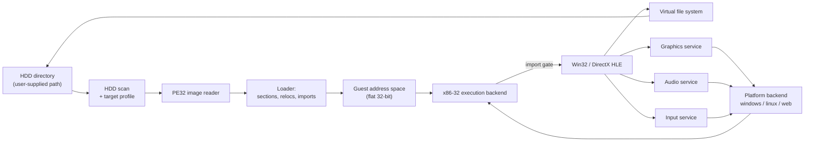
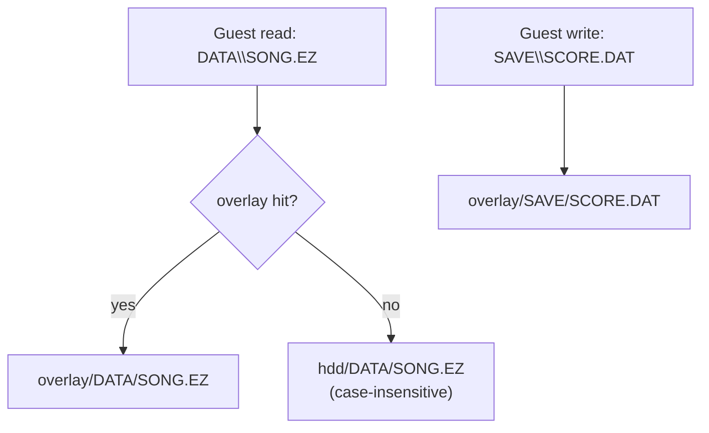
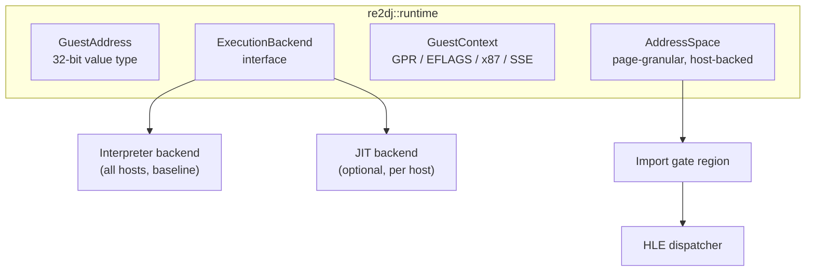

# 아키텍처 / Architecture

이 문서는 현재 저장소에 구현된 구조와, 그 구조가 향후 확장될 방향을 기술한다. 구현이 바뀌면 같은 작업에서 이 문서를 갱신한다.

*This document describes the structure currently implemented in the repository and how it is intended to grow. Update it in the same task whenever the implementation changes.*

> [!NOTE]
> 아래 표기 규칙을 따른다. **[구현됨]** 은 저장소에 코드가 있고 빌드·테스트로 확인된 것, **[설계됨]** 은 인터페이스만 정해진 것, **[계획]** 은 아직 설계 문서만 있는 것이다.
>
> *Sections are marked **[Implemented]** when code exists and is verified by a build or test, **[Designed]** when only the interface is fixed, and **[Planned]** when only a design note exists.*

---

## 1. 실행 모델 / Execution model

게스트는 32비트 x86 Win32 PE 실행 파일이다. 호스트는 64비트 Windows, Linux x86-64, WebAssembly 세 가지다. 세 호스트 어디에서도 게스트 코드를 호스트 CPU가 직접 실행할 수 없으므로, 실행 backend는 **이식 가능한 x86-32 실행 계층**이 기본 경로다.

*The guest is a 32-bit x86 Win32 PE executable. The hosts are 64-bit Windows, Linux x86-64, and WebAssembly. None of them can execute guest code directly on the host CPU, so the baseline execution backend is a **portable x86-32 execution layer**.*

HLE 경계는 **Win32 import thunk**다. 로더가 게스트의 import table을 해석할 때, 각 API를 실제 DLL이 아니라 합성 gate 주소로 바인딩한다. 실행 backend가 gate 주소로 제어를 넘기면 C++ 구현이 호출된다.

*The HLE boundary is the **Win32 import thunk**. When the loader parses the guest import table, it binds each API to a synthetic gate address instead of a real DLL. Control transferred to a gate address dispatches into the C++ implementation.*



---

## 2. 계층과 디렉터리 / Layers and directories

| 계층 / Layer | 경로 / Path | 책임 / Responsibility | 상태 |
| --- | --- | --- | --- |
| HDD 입력 | `include/re2dj/hdd/`, `src/hdd/` | 사용자가 준 디렉터리 검증, 대소문자 무시 경로 해석, 실행 파일 스캔 | **[구현됨]** |
| 게스트 경로 | `include/re2dj/storage/`, `src/storage/` | Win32 경로 파싱·정규화, 드라이브 문자 매핑, overlay 정책 | **[구현됨]** (파싱·정규화), **[설계됨]** (overlay) |
| 실행 파일 분석 | `include/re2dj/exe/`, `src/exe/` | PE32 헤더·섹션·디렉터리 판독 | **[구현됨]** (헤더·섹션), **[계획]** (import/reloc) |
| 타깃 프로파일 | `include/re2dj/target/`, `src/target/` | 버전별 실행 파일 경로, 작업 디렉터리, HLE 프로파일 ID | **[구현됨]** (자료구조·감지), **[계획]** (버전별 항목) |
| 런타임 | `include/re2dj/runtime/`, `src/runtime/` | 게스트 주소 공간, 레지스터 컨텍스트, 실행 backend 인터페이스 | **[계획]** |
| HLE | `include/re2dj/hle/`, `src/hle/` | kernel32/user32/gdi32/ddraw/dsound/dinput 모듈 테이블과 구현 | **[계획]** |
| 설정 | `include/re2dj/config/`, `src/config/` | INI 파싱, 키 바인딩, 실행 옵션 | **[계획]** |
| 플랫폼 | `src/platform/{windows,linux,web}/` | 창·렌더·오디오·입력·시간의 호스트 구현 | **[계획]** |
| 호스트 | `src/host/cli/` | 명령행 진입점 | **[구현됨]** |
| 도구 | `src/tools/{hdd_probe,pe_analyzer}/` | 비실행 분석 도구 | **[구현됨]** |

*The table above maps each layer to its directory, responsibility, and current status.*

---

## 3. HDD 디렉터리 입력 / HDD directory input **[구현됨]**

원본 HDD 내용은 **디렉터리 경로**로 입력받는다. 이미지 파일(`.img`, `.vhd`)을 직접 마운트하지 않는다. 사용자가 이미지를 풀어 놓은 디렉터리를 그대로 가리키면 된다.

*Original HDD contents arrive as a **directory path**. Image files are not mounted directly; the user points at a directory into which the image was already extracted.*

```
re2dj --hdd /path/to/ez2dj_hdd
```

`re2dj::hdd::HddRoot`가 그 경로를 소유하며 다음을 책임진다.

* 경로 존재와 디렉터리 여부 검증
* 게스트 상대 경로를 호스트 실제 경로로 해석. **대소문자를 무시한다.**
* 해석 결과 캐시

*`re2dj::hdd::HddRoot` owns the path and is responsible for validating it, resolving guest-relative paths to real host paths **case-insensitively**, and caching the result.*

### 왜 대소문자 무시 해석이 필요한가 / Why case-insensitive resolution is required

원본은 Windows에서 동작했으므로 게임 코드가 `DATA\Song01.EZ`처럼 실제 파일명과 대소문자가 다른 문자열로 파일을 열어도 동작했다. Linux와 Web 호스트의 파일 시스템은 대소문자를 구분하므로, 그대로 넘기면 열리지 않는다. `HddRoot`는 각 경로 구성 요소를 디렉터리 항목과 대소문자 무시로 대조해 실제 이름을 찾는다.

*The original ran on Windows, so game code could open `DATA\Song01.EZ` with a case that does not match the real file name. Linux and Web host file systems are case-sensitive, so the open would fail. `HddRoot` matches each path component against directory entries case-insensitively to find the real name.*

대조는 항상 디렉터리 나열 결과를 기준으로 한다. 정확히 일치하는 항목이 있으면 그것을 쓰고, 없으면 대소문자 무시로 처음 일치한 항목을 쓴다. 요청된 철자를 먼저 시도하면 Windows에서는 성공하고 Linux에서는 실패해, 같은 덤프가 호스트마다 다른 경로를 내놓는다. 나열 결과는 디렉터리 단위로 캐시한다.

*Matching always goes through the directory listing: an exact match wins, otherwise the first case-insensitive match does. Probing the requested spelling first would succeed on Windows and fail on Linux, so one dump would yield different paths per host. Listings are cached per directory.*

### 쓰기 정책 / Write policy **[설계됨]**

게스트의 파일 쓰기는 원본 디렉터리를 변경하지 않는다. 쓰기는 별도 overlay 디렉터리로 향하며, 읽기는 overlay를 먼저 조회한 뒤 원본으로 내려간다.

*Guest file writes never modify the original directory. Writes go to a separate overlay directory, and reads consult the overlay before falling through to the original.*



---

## 4. 게스트 경로 변환 / Guest path translation **[구현됨]**

게스트가 넘기는 경로는 Win32 문법이다. `re2dj::storage::GuestPath`가 이를 파싱해 다음을 구분한다.

* 드라이브 문자 (`C:\...`)
* 드라이브 상대 (`C:FOO`)
* 루트 상대 (`\FOO`)
* 순수 상대 (`FOO\BAR`)
* UNC (`\\server\share`) — 현재는 거부한다

*Guest paths use Win32 syntax. `re2dj::storage::GuestPath` parses them and distinguishes drive-absolute, drive-relative, root-relative, plain relative, and UNC forms. UNC is rejected for now.*

정규화 단계에서 `.`을 제거하고 `..`을 접으며, 구분자로 `/`와 `\`를 모두 받아들인다. 루트를 벗어나는 `..`은 실패로 처리해 HDD 디렉터리 바깥을 참조하지 못하게 한다.

*Normalization drops `.`, folds `..`, and accepts both `/` and `\` as separators. A `..` that would escape the root fails, so nothing outside the HDD directory is reachable.*

---

## 5. PE32 이미지 판독 / PE32 image reading **[구현됨]**

`re2dj::exe::PeImageInfo`는 원본 실행 파일에서 다음을 읽는다.

* DOS 헤더와 `e_lfanew`
* COFF 파일 헤더: machine, section 수, characteristics
* Optional header: magic(PE32 / PE32+), image base, entry point RVA, section/file alignment, subsystem, DLL characteristics
* Section 테이블: 이름, VA, 가상/원시 크기, 원시 오프셋, 특성
* Data directory: import, relocation, resource, TLS 위치

*`re2dj::exe::PeImageInfo` reads the DOS header, COFF file header, optional header, section table, and data directories from an original executable.*

이 단계는 **적재하지 않는다.** 파일을 읽어 구조만 보고한다. 실제 적재(섹션 매핑, 재배치, import 바인딩)는 런타임 계층에서 수행하며 아직 구현되지 않았다.

*This stage does **not** load anything; it reports structure only. Actual loading — section mapping, relocation, import binding — belongs to the runtime layer and is not implemented yet.*

HDD 스캔은 이 판독기를 사용해 각 실행 파일을 분류한다. `machine`이 x86(0x014C)이고 magic이 PE32(0x10B)이며 subsystem이 GUI인 항목이 게임 실행 파일 후보다.

*The HDD scan uses this reader to classify each executable. An entry with x86 machine (0x014C), PE32 magic (0x10B), and the GUI subsystem is a game-executable candidate.*

---

## 6. 타깃 프로파일 / Target profiles **[구현됨: 자료구조]**

버전별 차이는 `re2dj::target::TargetProfile`로 분리한다.

| 필드 | 의미 |
| --- | --- |
| `id` | 명령행에서 고르는 짧은 식별자 |
| `display_name` | 사람이 읽는 이름 |
| `executable_relative_path` | HDD 루트 기준 실행 파일 경로 |
| `working_directory_relative_path` | 게스트 현재 디렉터리 |
| `hle_profile_id` | 적용할 HLE 서비스 집합 |

*Version-specific differences live in `re2dj::target::TargetProfile`, which names the executable path, working directory, and HLE profile relative to the HDD root.*

현재 내장 프로파일 목록은 비어 있다. 실제 HDD 덤프를 확인하기 전에 버전별 경로를 추측해 넣지 않는다는 `AGENTS.md`의 원칙을 따른 것이다. 대신 `DetectTargetProfiles()`가 스캔 결과에서 프로파일을 **동적으로 구성한다.** 실제 덤프로 경로가 확인되면 내장 프로파일을 추가한다.

*The built-in profile list is intentionally empty: `AGENTS.md` forbids inventing per-version paths before a real dump is inspected. `DetectTargetProfiles()` builds profiles dynamically from the scan instead. Built-in entries will be added once real dumps confirm the paths.*

---

## 7. 계획된 런타임 계층 / Planned runtime layer **[계획]**



* `AddressSpace`는 게스트의 평탄한 4 GiB 주소 공간 중 실제로 커밋된 영역만 호스트 메모리에 둔다. 게스트 주소를 호스트 포인터로 노출하지 않고 `Read8/16/32`, `Write8/16/32` 접근자를 통해서만 다룬다.
* `ExecutionBackend`는 인터프리터를 기본 구현으로 두고, 호스트별 JIT을 나중에 같은 인터페이스로 붙인다.
* import gate 영역은 실제 코드가 없는 예약 주소 범위다. 그 주소로의 호출은 backend가 곧바로 HLE dispatcher로 넘긴다.

*`AddressSpace` keeps only committed regions of the guest's flat 4 GiB space in host memory and exposes accessors rather than host pointers. `ExecutionBackend` starts as an interpreter and gains per-host JITs behind the same interface. The import gate region is a reserved address range with no real code; a call into it is routed straight to the HLE dispatcher.*

---

## 8. 계획된 HLE 계층 / Planned HLE layer **[계획]**

이 표는 추측이 아니라 `ez2dj1.exe`의 import 테이블에서 나왔다. 근거와 전체 목록은 [EZ2DJ import 표면](docs/analysis/ez2dj-import-surface.md)에 있다.

*This table comes from the import table of `ez2dj1.exe` rather than from guesswork. The evidence and full list are in [EZ2DJ Import Surface](docs/analysis/ez2dj-import-surface.md).*

| 모듈 | 대체 대상 | 함수 수 | 우선순위 |
| --- | --- | --- | --- |
| `kernel32` | 파일 I/O, 메모리, INI, 모듈 | 약 40 | 1 |
| `user32` | 창, 메시지 루프, 디스플레이 모드 | 약 12 | 1 |
| `ddraw` | DirectDraw 1~6 표면과 블릿 | COM | 2 |
| `gdi32` | DIB 섹션과 블릿 | 14 | 2 |
| `dsound` | ordinal `#1` = `DirectSoundCreate` | COM | 3 |
| `winmm` | 믹서 볼륨, `timeGetTime` | 8 | 3 |
| `user32` | `GetAsyncKeyState` — 입력 전부 | 1 | 4 |
| `advapi32` | `RegFlushKey` stub | 1 | 4 |
| `kernel32` | 스레드, 이벤트, 임계 구역 | 약 20 | 5 |

`ez2dj1.exe`의 import는 **7개 DLL, 144개 함수**가 전부다. **Direct3D도 DirectInput도 없다.** 3rd는 DirectInput과 AVI 재생을 추가로 쓰므로 버전별 HLE 프로파일이 필요하다.

*`ez2dj1.exe` imports **144 functions from 7 DLLs** in total, with **no Direct3D and no DirectInput**. The 3rd build adds DirectInput and AVI playback, which is why per-version HLE profiles are needed.*

가장 큰 작업은 함수 개수가 아니라 DirectDraw와 DirectSound의 **COM 인터페이스**다. 게스트 메모리 안에 vtable을 만들어 각 슬롯에 gate 주소를 채워야 한다.

*The largest piece is not the function count but the **COM interfaces** of DirectDraw and DirectSound, which need vtables built inside guest memory with a gate address in each slot.*

각 모듈은 `{이름, ordinal, 인자 개수, 호출 규약, 구현 함수}` 항목의 테이블로 표현한다. 로더는 import 이름을 이 테이블에서 찾아 gate 주소를 배정한다. 구현되지 않은 항목은 gate에 남되 호출되면 이름과 함께 실패를 기록한다. 이렇게 하면 **실제로 필요한 API만** 점진적으로 구현할 수 있다.

*Each module is a table of `{name, ordinal, argument count, calling convention, implementation}` entries. The loader looks up an import name and assigns a gate address. Unimplemented entries still get a gate, and a call logs the name and fails, so only APIs the game actually calls need implementing.*

---

## 9. rePIU와의 구조적 차이 / Structural differences from rePIU

| 항목 | rePIU | re2DJ |
| --- | --- | --- |
| 게스트 실행 형식 | DOS/4GW LE | Win32 PE32 |
| 환경 경계 | DOS/DPMI interrupt, port I/O | Win32 import thunk |
| 실행 방식 | 32비트 Win32 호스트에서 네이티브 실행 + VEH 트랩 | 이식 가능한 x86-32 실행 backend |
| 호스트 | Win32 x86 전용 | Windows x64 / Linux x64 / Web |
| 그래픽 경계 | Glide (`glide2x`) | DirectDraw / Direct3D |
| 자산 입력 | MAME ROM ZIP + CHD | HDD 디렉터리 경로 |
| 플랫폼 디렉터리 | `src/platform/win32/` | `src/platform/{windows,linux,web}/` |

공통으로 유지하는 것: 설계 우선 워크플로, 한국어 우선 이중 언어 문서, 영어 전용 소스 주석, `VERSION` 기반 버전 관리, BSD 3-Clause 라이선스 정책, 원본 자산 비포함 원칙.

*Shared with rePIU: design-first workflow, Korean-first bilingual documents, English-only source comments, `VERSION`-based versioning, the BSD 3-Clause license policy, and the rule that original assets never enter the repository.*

---

## 10. 빌드 구성 / Build configuration **[구현됨]**

`CMakeLists.txt`는 하나의 코어 라이브러리 `re2dj_core`와 세 개의 실행 파일을 만든다.

| 타깃 | 내용 |
| --- | --- |
| `re2dj_core` | 공용 코어 정적 라이브러리 |
| `re2dj` | 명령행 호스트 |
| `re2dj_hdd_probe` | HDD 디렉터리 스캔 도구 |
| `re2dj_pe_analyzer` | PE32 헤더 분석 도구 |
| `re2dj_unit_tests` | CTest에 등록된 단위 테스트 |

외부 의존성은 아직 없다. 그래픽·오디오 backend를 붙일 때 SDL3 같은 zlib/BSD 계열 라이선스 라이브러리를 검토한다.

*There are no external dependencies yet. When graphics and audio backends land, zlib/BSD-licensed libraries such as SDL3 will be evaluated.*
