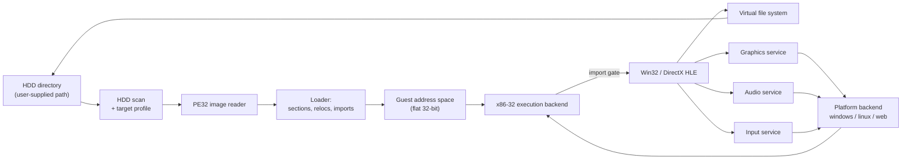
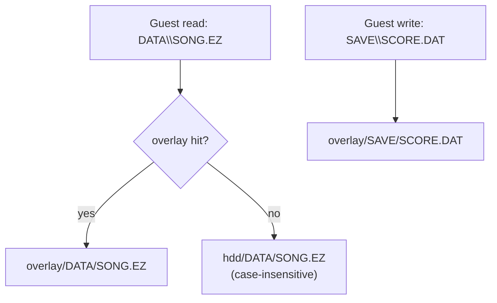
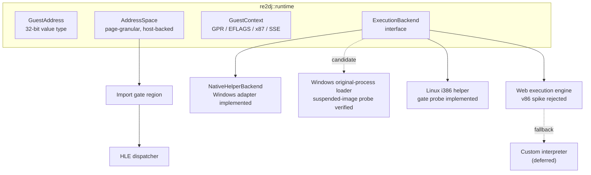

# 아키텍처 / Architecture

이 문서는 현재 저장소에 구현된 구조와, 그 구조가 향후 확장될 방향을 기술한다. 구현이 바뀌면 같은 작업에서 이 문서를 갱신한다.

*This document describes the structure currently implemented in the repository and how it is intended to grow. Update it in the same task whenever the implementation changes.*

> [!NOTE]
> 아래 표기 규칙을 따른다. **[구현됨]** 은 저장소에 코드가 있고 빌드·테스트로 확인된 것, **[설계됨]** 은 인터페이스만 정해진 것, **[계획]** 은 아직 설계 문서만 있는 것이다.
>
> *Sections are marked **[Implemented]** when code exists and is verified by a build or test, **[Designed]** when only the interface is fixed, and **[Planned]** when only a design note exists.*

---

## 1. 실행 모델 / Execution model

게스트는 32비트 x86 Win32 PE 실행 파일이다. 현재 Windows 1차 host는 같은 x86 bitness의 launcher와 original-child process로 구성되며, runtime DLL은 후속 작업에서 child에 적재한다. Linux x86-64와 WebAssembly는 후속 대상이고 Windows x64 helper 경로는 보류한다.

*The guest is a 32-bit x86 Win32 PE executable. The current primary Windows host consists of same-bitness x86 launcher and original-child processes; a later task loads the runtime DLL into the child. Linux x86-64 and WebAssembly are later targets, and the Windows x64 helper path is deferred.*

HLE 경계는 **Win32 import thunk**다. 로더가 게스트의 import table을 해석할 때, 각 API를 실제 DLL이 아니라 합성 gate 주소로 바인딩한다. 실행 backend가 gate 주소로 제어를 넘기면 C++ 구현이 호출된다.

*The HLE boundary is the **Win32 import thunk**. When the loader parses the guest import table, it binds each API to a synthetic gate address instead of a real DLL. Control transferred to a gate address dispatches into the C++ implementation.*



---

## 2. 계층과 디렉터리 / Layers and directories

| 계층 / Layer | 경로 / Path | 책임 / Responsibility | 상태 |
| --- | --- | --- | --- |
| HDD 입력 | `include/re2dj/hdd/`, `src/hdd/` | 사용자가 준 디렉터리 검증, 대소문자 무시 경로 해석, 실행 파일 스캔 | **[구현됨]** |
| 게스트 경로 | `include/re2dj/storage/`, `src/storage/` | Win32 경로 파싱·정규화, 드라이브 문자 매핑, overlay 정책과 파일 테이블 | **[구현됨]** |
| 실행 파일 분석 | `include/re2dj/exe/`, `src/exe/` | PE32 헤더·섹션·디렉터리 판독 | **[구현됨]** (헤더·섹션), **[계획]** (import/reloc) |
| 타깃 프로파일 | `include/re2dj/target/`, `src/target/` | 버전별 실행 파일 경로, 작업 디렉터리, HLE 프로파일 ID | **[구현됨]** (자료구조·감지), **[계획]** (버전별 항목) |
| 런타임 | `include/re2dj/runtime/`, `src/runtime/` | 게스트 주소 공간, 레지스터 컨텍스트, 실행 backend 인터페이스 | **[계획]** |
| HLE | `include/re2dj/hle/`, `src/hle/` | kernel32/user32/gdi32/ddraw/dsound/dinput 모듈 테이블과 구현 | **[계획]** |
| 설정 | `include/re2dj/config/`, `src/config/` | INI 파싱, 키 바인딩, 실행 옵션 | **[계획]** |
| 플랫폼 | `src/platform/{windows,linux,web}/` | 창·렌더·오디오·입력·시간의 호스트 구현 | **[계획]** |
| 호스트 | `src/host/cli/` | 명령행 진입점 | **[구현됨]** |
| 도구 | `src/tools/{hdd_probe,pe_analyzer}/` | 비실행 분석 도구 | **[구현됨]** |

*The table above maps each layer to its directory, responsibility, and current status.*

---

## 3. HDD 디렉터리 입력 / HDD directory input **[구현됨]**

원본 HDD 내용은 **디렉터리 경로**로 입력받는다. 이미지 파일(`.img`, `.vhd`)을 직접 마운트하지 않는다. 사용자가 이미지를 풀어 놓은 디렉터리를 그대로 가리키면 된다.

*Original HDD contents arrive as a **directory path**. Image files are not mounted directly; the user points at a directory into which the image was already extracted.*

```
re2dj --hdd /path/to/ez2dj_hdd
```

`re2dj::hdd::HddRoot`가 그 경로를 소유하며 다음을 책임진다.

* 경로 존재와 디렉터리 여부 검증
* 게스트 상대 경로를 호스트 실제 경로로 해석. **대소문자를 무시한다.**
* 해석 결과 캐시

*`re2dj::hdd::HddRoot` owns the path and is responsible for validating it, resolving guest-relative paths to real host paths **case-insensitively**, and caching the result.*

### 왜 대소문자 무시 해석이 필요한가 / Why case-insensitive resolution is required

원본은 Windows에서 동작했으므로 게임 코드가 `DATA\Song01.EZ`처럼 실제 파일명과 대소문자가 다른 문자열로 파일을 열어도 동작했다. Linux와 Web 호스트의 파일 시스템은 대소문자를 구분하므로, 그대로 넘기면 열리지 않는다. `HddRoot`는 각 경로 구성 요소를 디렉터리 항목과 대소문자 무시로 대조해 실제 이름을 찾는다.

*The original ran on Windows, so game code could open `DATA\Song01.EZ` with a case that does not match the real file name. Linux and Web host file systems are case-sensitive, so the open would fail. `HddRoot` matches each path component against directory entries case-insensitively to find the real name.*

대조는 항상 디렉터리 나열 결과를 기준으로 한다. 정확히 일치하는 항목이 있으면 그것을 쓰고, 없으면 대소문자 무시로 처음 일치한 항목을 쓴다. 요청된 철자를 먼저 시도하면 Windows에서는 성공하고 Linux에서는 실패해, 같은 덤프가 호스트마다 다른 경로를 내놓는다. 나열 결과는 디렉터리 단위로 캐시한다.

*Matching always goes through the directory listing: an exact match wins, otherwise the first case-insensitive match does. Probing the requested spelling first would succeed on Windows and fail on Linux, so one dump would yield different paths per host. Listings are cached per directory.*

### 쓰기 정책 / Write policy **[구현됨]**

게스트의 파일 쓰기는 원본 디렉터리를 변경하지 않는다. 쓰기는 별도 overlay 디렉터리로 향하며, 읽기는 overlay를 먼저 조회한 뒤 원본으로 내려간다.

*Guest file writes never modify the original directory. Writes go to a separate overlay directory, and reads consult the overlay before falling through to the original. The Windows x86 runtime clones an existing original file to the overlay before an `OPEN_EXISTING` write, so the original stays unchanged.*



---

## 4. 게스트 경로 변환 / Guest path translation **[구현됨]**

게스트가 넘기는 경로는 Win32 문법이다. `re2dj::storage::GuestPath`가 이를 파싱해 다음을 구분한다.

* 드라이브 문자 (`C:\...`)
* 드라이브 상대 (`C:FOO`)
* 루트 상대 (`\FOO`)
* 순수 상대 (`FOO\BAR`)
* UNC (`\\server\share`) — 현재는 거부한다

*Guest paths use Win32 syntax. `re2dj::storage::GuestPath` parses them and distinguishes drive-absolute, drive-relative, root-relative, plain relative, and UNC forms. UNC is rejected for now.*

정규화 단계에서 `.`을 제거하고 `..`을 접으며, 구분자로 `/`와 `\`를 모두 받아들인다. 루트를 벗어나는 `..`은 실패로 처리해 HDD 디렉터리 바깥을 참조하지 못하게 한다.

*Normalization drops `.`, folds `..`, and accepts both `/` and `\` as separators. A `..` that would escape the root fails, so nothing outside the HDD directory is reachable.*

---

## 5. PE32 이미지 판독 / PE32 image reading **[구현됨]**

`re2dj::exe::PeImageInfo`는 원본 실행 파일에서 다음을 읽는다.

* DOS 헤더와 `e_lfanew`
* COFF 파일 헤더: machine, section 수, characteristics
* Optional header: magic(PE32 / PE32+), image base, entry point RVA, section/file alignment, subsystem, DLL characteristics
* Section 테이블: 이름, VA, 가상/원시 크기, 원시 오프셋, 특성
* Data directory: import, relocation, resource, TLS 위치

*`re2dj::exe::PeImageInfo` reads the DOS header, COFF file header, optional header, section table, and data directories from an original executable.*

이 판독기 자체는 **적재하지 않는다.** 파일을 읽어 구조만 보고한다. 실제 적재(섹션 매핑, 재배치, import 바인딩)는 구현된 런타임 계층의 `LoadPe32Image()`가 수행한다.

*This reader does **not** load anything; it reports structure only. The implemented runtime `LoadPe32Image()` performs section mapping, relocation, and import binding.*

HDD 스캔은 이 판독기를 사용해 각 실행 파일을 분류한다. `machine`이 x86(0x014C)이고 magic이 PE32(0x10B)이며 subsystem이 GUI인 항목이 게임 실행 파일 후보다.

*The HDD scan uses this reader to classify each executable. An entry with x86 machine (0x014C), PE32 magic (0x10B), and the GUI subsystem is a game-executable candidate.*

---

## 6. 타깃 프로파일 / Target profiles **[구현됨: 자료구조]**

버전별 차이는 `re2dj::target::TargetProfile`로 분리한다.

| 필드 | 의미 |
| --- | --- |
| `id` | 명령행에서 고르는 짧은 식별자 |
| `display_name` | 사람이 읽는 이름 |
| `executable_relative_path` | HDD 루트 기준 실행 파일 경로. 지문이 맞을 때 채워진다 |
| `working_directory_relative_path` | 호스트 쪽 작업 디렉터리 |
| `guest_drive_letter` | 게스트가 자신이 실행된다고 믿는 드라이브. 근거가 없으면 `\0` |
| `guest_directory` | 같은 근거의 Win32 디렉터리. 근거가 없으면 빈 문자열 |
| `hle_profile_id` | 적용할 HLE 서비스 집합 |
| `detected` | 내장 표가 아니라 스캔에서 나온 것인지 |
| `bring_up_target` | 캐비닛이 실행한 것이 아니라 개발용인지 |
| `note` | 사람이 읽는 단서와 한계 |

*Version-specific differences live in `re2dj::target::TargetProfile`.*

### 지문으로 덤프를 식별한다 / Dumps are identified by fingerprint

내장 프로파일은 **실행 파일 이름 + 그 옆에 반드시 있어야 하는 항목 목록**으로 덤프를 식별한다. 파일 크기나 해시는 리비전마다 달라져 정상 덤프를 거부하므로 쓰지 않는다.

*A built-in profile identifies a dump by an **executable name plus the entries that must sit beside it**. File size and hashes are rejected as keys because they vary per revision and would reject a legitimate dump.*

| 프로파일 | 실행 파일 | 필수 형제 항목 |
| --- | --- | --- |
| `ez2dj1stse` | `ez2dj.exe` | `ez2dj1.exe`, `ez2dj.ini`, `System.ini`, `Songs`, `System` |
| `ez2dj1stse_unpacked` | `ez2dj1.exe` | `ez2dj.exe`, `ez2dj.ini`, `Songs`, `System` |
| `ez2dj3rd` | `EZ2DJ.EXE` | `EZ2DJ.INI`, `FONTKR.DAT`, `BG`, `Sound`, `system` |

형제 항목이 필요한 이유는 경로 해석이 대소문자를 무시하기 때문이다. 3rd의 `EZ2DJ.EXE`라는 이름만으로는 1st SE의 `ez2dj.exe`와 구별되지 않는다. 두 지문은 서로소라서 오인이 일어나지 않는다.

*The siblings are required because path resolution is case-insensitive, so the name `EZ2DJ.EXE` alone does not distinguish 3rd from 1st SE. The two fingerprints are disjoint, so neither dump matches the other.*

실행 파일을 스캔 결과에서 찾으므로 사용자가 상위 디렉터리를 지정해도 걸린다. 형제 항목은 그 실행 파일의 디렉터리를 기준으로 확인한다.

*Matching searches the scan, so pointing at a parent directory still works; siblings are checked relative to the matched executable's own directory.*

### 순서와 감지 / Ordering and detection

`BuildTargetProfiles()`는 내장 프로파일 중 지문이 맞는 것을 먼저 놓고, 내장이 가져가지 않은 실행 파일에 대해서만 `DetectTargetProfiles()`를 돌린다. 목록의 첫 항목이 기본 타깃이다.

내장 프로파일이 없는 버전의 덤프도 감지만으로 계속 동작한다. 내장 항목은 **실제로 확인한 덤프에 대해서만** 추가한다.

*`BuildTargetProfiles()` puts fingerprint matches first and runs detection only over the executables no built-in claimed; the first entry is the default target. A dump of a version with no built-in profile still works through detection alone. Built-in entries are added **only for dumps that were actually inspected**.*

---

## 7. 런타임 계층 / Runtime layer **[부분 구현됨]**



* `GuestAddress`는 host pointer로 변환되지 않는 32비트 값 타입이다.
* `AddressSpace`는 게스트의 평탄한 4 GiB 주소 공간 중 실제로 커밋된 페이지만 호스트 메모리에 둔다. 게스트 주소를 호스트 포인터로 노출하지 않고 `Read8/16/32`, `Write8/16/32` 접근자를 통해서만 다룬다.
* `LoadPe32Image()`는 헤더와 섹션을 매핑하고 zero-fill한 뒤, `IMAGE_REL_BASED_HIGHLOW` 재배치를 적용하고 이름/ordinal import를 합성 gate에 바인딩한다. 실패 시 호출자가 제공한 주소 공간과 gate 표는 바뀌지 않는다.
* `ImportGateTable`은 기본적으로 `0xF0000000`부터 16바이트 간격의 주소를 배정한다. 이 범위에는 실제 명령어가 없으며 Stage 3 backend가 HLE dispatcher로 전달한다.
* `ExecutionBackend` event/reply 인터페이스는 이미지 준비, 실행 시작, event 대기, import 완료 응답, 중단 요청을 분리한다. event에는 backend-local thread ID, guest EIP/ESP와 gate 주소만 담고 host pointer를 넣지 않는다. import 응답은 EAX/EDX, stack 정리 byte 수, 계속/중단 action을 전달한다.
* Windows `NativeHelperBackend`는 x86 helper process와 anonymous pipe protocol v3를 `ExecutionBackend` 뒤에 캡슐화한다. PImpl 공개 header에는 Windows type이 없고, adapter가 packet 순서, 상태 검증과 child 종료를 소유한다. `native_pe_image`는 requested base mapping, `HIGHLOW` relocation, section protection과 process-attach TLS callback을 담당한다. helper는 PE32의 이름/ordinal import를 순회해 `ImportGateTable`의 synthetic gate마다 실행 가능한 x86 thunk를 만들고 실제 thunk 주소를 IAT에 쓴다. load 뒤 module/name/ordinal/gate metadata를 adapter에 보내 `LoadedPeImage.imports`를 채운다. gate가 멈춘 동안 adapter는 guest memory를 읽고 쓴 뒤 EDX:EAX와 동적 stack 정리 크기를 응답한다. protocol은 event 하나를 직렬 처리하며 TLS storage/index와 병렬 guest thread는 후속 확장이다.
* `re2dj_windows_x86_launcher_probe`는 기본 Win32 host에서 원본 `ez2dj1.exe`를 `DEBUG_ONLY_THIS_PROCESS`로 만들고 entry `0x0043a640` 직전에 멈춘다. 이 입력에서는 DR0 hardware stop이 전달되지 않아 child memory의 entry 첫 바이트를 일시적으로 `INT3`로 바꾸고 즉시 원복하는 diagnostic fallback으로 정지했다. 이때 Windows loader가 main image를 `0x00400000`에 배치하고 7 DLL·144 IAT slot을 해석했음을 실제 HDD로 확인했다. 정지 상태에서 primary thread를 suspend하고 minimal x86 runtime DLL을 remote `LoadLibraryW` thread로 적재해 module base도 확인했다. `--probe-handoff`는 PE table에서 `GetCommandLineA` IAT slot을 찾아 runtime log-and-forward thunk로 교체하고, entry 재개 후 실제 debugger output event를 확인했다. x64 `re2dj_windows_original_process_probe`는 보류된 비교 근거로 남긴다.
* `re2dj_windows_x86_launcher_probe`는 기본 Win32 host에서 원본 `ez2dj1.exe`를 `DEBUG_ONLY_THIS_PROCESS`로 만들고 entry `0x0043a640` 직전에 멈춘다. 이 입력에서는 DR0 hardware stop이 전달되지 않아 child memory의 entry 첫 바이트를 일시적으로 `INT3`로 바꾸고 즉시 원복하는 diagnostic fallback으로 정지했다. 이때 Windows loader가 main image를 `0x00400000`에 배치하고 7 DLL·144 IAT slot을 해석했음을 실제 HDD로 확인했다. 정지 상태에서 primary thread를 suspend하고 minimal x86 runtime DLL을 remote `LoadLibraryW` thread로 적재해 module base도 확인했다. `--probe-handoff`는 PE table에서 `GetCommandLineA` IAT slot을 찾아 runtime log-and-forward thunk로 교체하고, `--hle-command-line`은 runtime의 process-lifetime buffer에 original basename을 기록해 실제 HLE thunk가 반환하도록 한다. 두 경로 모두 entry 재개 후 debugger output event로 확인했다. x64 `re2dj_windows_original_process_probe`는 보류된 비교 근거로 남긴다.
* `re2dj_windows_x86_launcher_probe`는 target과 원본 EXE를 해석한 뒤 실행별 JSONL 진단 로그를 `logs/windows_x86_launcher_probe/<target-id>/`에 만든다. debug event와 예외 관찰은 `--trace` 여부와 관계없이 즉시 flush되며, `--trace`는 stderr 실시간 표시만 제어한다. 최종 성공 또는 실패 JSON은 생성된 로그 경로를 포함한다. 이 생성 디렉터리는 HDD 및 guest overlay 밖이고 Git ignore 대상이다.
* `re2dj_windows_x86_launcher_probe`의 `--instruction-trace <max-steps>`는 software entry stop에서 EIP와 TF를 설정하고 primary-thread debugger event 뒤 TF를 다시 설정한다. 최대 32개 instruction address와 바이트를 ring buffer에 유지한 뒤 illegal instruction 또는 step limit에서만 JSONL에 기록한다. 이는 protected post-entry control flow의 관찰 도구이며, branch operand나 보호 실패 원인을 자체적으로 해석하지 않는다.
* `re2dj_windows_x86_launcher_probe --scan-fault-references`는 first-chance illegal-instruction event에서 child를 계속하기 전에 committed private/image memory를 bounded scan한다. fault address와 page base의 32-bit reference, 해당 region 속성 및 match summary를 JSONL에 기록한다. 이 결과는 target storage 후보일 뿐 indirect branch caller의 증명은 아니다.
* `re2dj_windows_x86_launcher_probe --api-trace`는 child memory에서 `kernel32.dll`/`kernelbase.dll` export를 해석해 watched API에 software breakpoint를 설치하고, hit마다 caller·args·ANSI 문자열을 JSONL에 남긴 뒤 원래 byte 복원과 TF 1 step으로 삼키고 재무장한다. first-chance illegal-instruction에서는 full register와 segment, 64 dword stack과 main image section 분류, fault page dump, allocation region walk를 기록하고, entry 이후 동적으로 적재된 모듈의 unload event에서 언로드 종반 구간을 single-step 수집하며 매 샘플에 GP register trail과 nearest-export 심볼 주석을 붙인다. 수집 중 표준 syscall 스탠자(`mov edx,&thunk; call edx`) 꼬리가 보이면 복귀 주소에 1회용 software breakpoint를 심어 WOW64 게이트 너머의 32비트 복귀을 포착하고 TF를 재무장한다. 이 도구는 관찰이며 보호 실패 원인을 자체적으로 판정하지 않는다.
* OS type을 포함하지 않는 desktop helper protocol v3 header는 `src/platform/native_helper_protocol.h`에 공유한다. Linux 최소 prototype은 x86-64 host가 `fork`/`exec`한 i386 helper의 실제 `__stdcall` gate에서 같은 event/memory/completion packet을 왕복한다. 현재 Linux 경로는 제한된 stack memory와 컴파일된 gate만 검증했으며 PE32 mapping 및 backend adapter는 후속 작업이다.
* BSD-2-Clause v86 CPU 분리성 spike는 부적합으로 끝났다. 공식 소스에는 CPU-only build 경계가 없고 CPU memory·run loop가 PC 장치, MMIO, browser timer/IRQ에 결합되어 있다. 기본 synthetic gate `0xF0000000`도 v86에서 실행 불가능한 mapped/MMIO 범위다. interpreter와 JIT 양쪽에 gate stop/resume을 새로 넣고 대규모 fork를 유지해야 하므로 채택하지 않는다. TinyEMU 계열은 Web x86 소스 공개 범위를 확인할 때만 재검토하며, 직접 인터프리터는 계속 후순위 fallback이다.

*`GuestAddress` is a 32-bit value type that cannot become a host pointer. `AddressSpace` keeps only committed pages of the flat 4 GiB guest space in host memory and exposes accessors rather than pointers. `LoadPe32Image()` maps and zero-fills headers and sections, applies `IMAGE_REL_BASED_HIGHLOW` relocations, and binds named or ordinal imports to synthetic gates transactionally. `ImportGateTable` assigns addresses at 16-byte intervals from `0xF0000000`. The implemented `ExecutionBackend` interface separates image preparation, start, event waiting, guest-memory reads/writes, import completion, and stop requests using backend-local thread IDs and guest values only. Windows `NativeHelperBackend` encapsulates the x86 helper process and anonymous-pipe protocol v3 behind that interface; `native_pe_image` owns requested-base mapping, relocations, protection, and process-attach TLS callbacks, while import thunks restore EDX:EAX and dynamic stack cleanup. The primary `re2dj_windows_x86_launcher_probe` creates the original as a loader-owned child main image, confirms a pre-entry fully resolved IAT stop through a temporary child-memory `INT3` fallback, and loads a minimal same-bitness runtime DLL while the primary thread remains suspended; x64 observation remains deferred evidence. The OS-independent protocol-v3 header is shared under `src/platform/`. A Linux x86-64 host/i386 helper probe uses the same event/memory/completion packets for a real `__stdcall` gate, but Linux PE32 mapping and its backend adapter remain later work. Protocol v3 serializes one event; TLS storage/index and parallel guest threads remain later extensions. The v86 separability spike rejected adoption: its published source lacks a CPU-only build boundary, couples CPU memory/run control to PC devices and browser services, and treats the default synthetic-gate range as non-executable MMIO. TinyEMU remains conditional on confirming published Web-x86 source scope, while a custom interpreter remains deferred.*

*After resolving a target and original executable, `re2dj_windows_x86_launcher_probe` creates a per-run JSONL diagnostic log under `logs/windows_x86_launcher_probe/<target-id>/`. Debug events and exception observations flush to that file whether or not `--trace` is set; `--trace` controls only live stderr output. Final success and error JSON identify the log path. The generated directory is outside the HDD and guest overlay and is Git-ignored.*

*`re2dj_windows_x86_launcher_probe --instruction-trace <max-steps>` sets EIP and TF at the software-entry stop and rearms TF after primary-thread debugger events. It retains up to 32 instruction addresses and bytes in a ring buffer, writing them to JSONL only on an illegal instruction or step limit. This observes protected post-entry control flow; it does not independently decode branch operands or determine a protection-failure cause.*

*`re2dj_windows_x86_launcher_probe --scan-fault-references` bounded-scans committed private/image memory before continuing a first-chance illegal-instruction event. It records 32-bit references to the fault address and page base, their region properties, and a match summary in JSONL. The result is a target-storage candidate only, not proof of an indirect-branch caller.*

*`re2dj_windows_x86_launcher_probe --api-trace` resolves `kernel32.dll`/`kernelbase.dll` exports from child memory, arms software breakpoints on watched APIs, records caller, arguments, and ANSI strings per hit to JSONL, then swallows and rearms each hit by restoring the original byte and trap-flagging one instruction. On a first-chance illegal instruction it records full registers with segments, a 64-dword stack with main-image section classification, the fault page bytes, and an allocation region walk; on an unload event of a module loaded after entry it single-steps the unload tail, attaching a GP-register trail and nearest-export symbol annotation to every sample. When the standard syscall stanza tail (`mov edx,&thunk; call edx`) appears during collection, a one-shot software breakpoint on the stub's return address catches the 32-bit resume past the WOW64 gate and re-arms the trap flag. The tool observes only and does not itself adjudicate the protection-failure cause.*

---

## 8. 계획된 HLE 계층 / Planned HLE layer **[계획]**

이 표는 추측이 아니라 `ez2dj1.exe`의 import 테이블에서 나왔다. 근거와 전체 목록은 [EZ2DJ import 표면](docs/analysis/ez2dj-import-surface.md)에 있다.

*This table comes from the import table of `ez2dj1.exe` rather than from guesswork. The evidence and full list are in [EZ2DJ Import Surface](docs/analysis/ez2dj-import-surface.md).*

| 모듈 | 대체 대상 | 함수 수 | 우선순위 |
| --- | --- | --- | --- |
| `kernel32` | 파일 I/O, 메모리, INI, 모듈 | 약 40 | 1 |
| `user32` | 창, 메시지 루프, 디스플레이 모드 | 약 12 | 1 |
| `ddraw` | DirectDraw 1~6 표면과 블릿 | COM | 2 |
| `gdi32` | DIB 섹션과 블릿 | 14 | 2 |
| `dsound` | ordinal `#1` = `DirectSoundCreate` | COM | 3 |
| `winmm` | 믹서 볼륨, `timeGetTime` | 8 | 3 |
| `user32` | `GetAsyncKeyState` — 입력 전부 | 1 | 4 |
| `advapi32` | `RegFlushKey` stub | 1 | 4 |
| `kernel32` | 스레드, 이벤트, 임계 구역 | 약 20 | 5 |

`ez2dj1.exe`의 import는 **7개 DLL, 144개 함수**가 전부다. **Direct3D도 DirectInput도 없다.** 3rd는 DirectInput과 AVI 재생을 추가로 쓰므로 버전별 HLE 프로파일이 필요하다.

*`ez2dj1.exe` imports **144 functions from 7 DLLs** in total, with **no Direct3D and no DirectInput**. The 3rd build adds DirectInput and AVI playback, which is why per-version HLE profiles are needed.*

가장 큰 작업은 함수 개수가 아니라 DirectDraw와 DirectSound의 **COM 인터페이스**다. 게스트 메모리 안에 vtable을 만들어 각 슬롯에 gate 주소를 채워야 한다.

*The largest piece is not the function count but the **COM interfaces** of DirectDraw and DirectSound, which need vtables built inside guest memory with a gate address in each slot.*

각 모듈은 `{이름, ordinal, 인자 개수, 호출 규약, 구현 함수}` 항목의 테이블로 표현한다. 로더는 import 이름을 이 테이블에서 찾아 gate 주소를 배정한다. 구현되지 않은 항목은 gate에 남되 호출되면 이름과 함께 실패를 기록한다. 이렇게 하면 **실제로 필요한 API만** 점진적으로 구현할 수 있다.

*Each module is a table of `{name, ordinal, argument count, calling convention, implementation}` entries. The loader looks up an import name and assigns a gate address. Unimplemented entries still get a gate, and a call logs the name and fails, so only APIs the game actually calls need implementing.*

---

## 9. rePIU와의 구조적 차이 / Structural differences from rePIU

| 항목 | rePIU | re2DJ |
| --- | --- | --- |
| 게스트 실행 형식 | DOS/4GW LE | Win32 PE32 |
| 환경 경계 | DOS/DPMI interrupt, port I/O | Win32 import thunk |
| 실행 방식 | 32비트 Win32 호스트에서 네이티브 실행 + VEH 트랩 | 교체 가능한 backend: 데스크톱 native helper 우선, Web 실행 엔진 별도 |
| 호스트 | Win32 x86 전용 | Windows x64 / Linux x64 / Web |
| 그래픽 경계 | Glide (`glide2x`) | DirectDraw / Direct3D |
| 자산 입력 | MAME ROM ZIP + CHD | HDD 디렉터리 경로 |
| 플랫폼 디렉터리 | `src/platform/win32/` | `src/platform/{windows,linux,web}/` |

공통으로 유지하는 것: 설계 우선 워크플로, 한국어 우선 이중 언어 문서, 영어 전용 소스 주석, `VERSION` 기반 버전 관리, BSD 3-Clause 라이선스 정책, 원본 자산 비포함 원칙.

*Shared with rePIU: design-first workflow, Korean-first bilingual documents, English-only source comments, `VERSION`-based versioning, the BSD 3-Clause license policy, and the rule that original assets never enter the repository.*

---

## 10. 빌드 구성 / Build configuration **[구현됨]**

`CMakeLists.txt`는 공용 코어와 host·분석·검증 실행 파일을 만들며, Win32 전용 preset에서는 native helper probe만 별도 검증할 수 있다.

| 타깃 | 내용 |
| --- | --- |
| `re2dj_core` | 공용 코어 정적 라이브러리 |
| `re2dj` | 명령행 호스트 |
| `re2dj_hdd_probe` | HDD 디렉터리 스캔 도구 |
| `re2dj_pe_analyzer` | PE32 헤더 분석 도구 |
| `re2dj_pe_loader` | PE32 매핑·재배치·import gate 보고 도구 |
| `re2dj_unit_tests` | CTest에 등록된 단위 테스트 |
| `re2dj_native_helper_probe` | Win32 x86 / WOW64 네이티브 gate 호출 probe, 선택 target |
| `re2dj_native_ipc_host_probe` | x64 host 쪽 synthetic PE32 IPC 통합 probe |
| `re2dj_native_ipc_helper` | Win32 x86 mapper·gate·IPC helper, 선택 target |
| `re2dj_windows_x86_launcher_probe` | Win32 x86 원본 EXE entry·IAT 정지점 검증 도구 |
| `re2dj_windows_original_process_probe` | 원본 EXE의 suspended Windows process 주 이미지 주소 검증 도구 |

외부 의존성은 아직 없다. 그래픽·오디오 backend를 붙일 때 SDL3 같은 zlib/BSD 계열 라이선스 라이브러리를 검토한다.

*There are no external dependencies yet. When graphics and audio backends land, zlib/BSD-licensed libraries such as SDL3 will be evaluated.*
