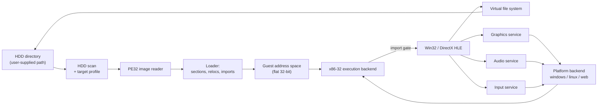
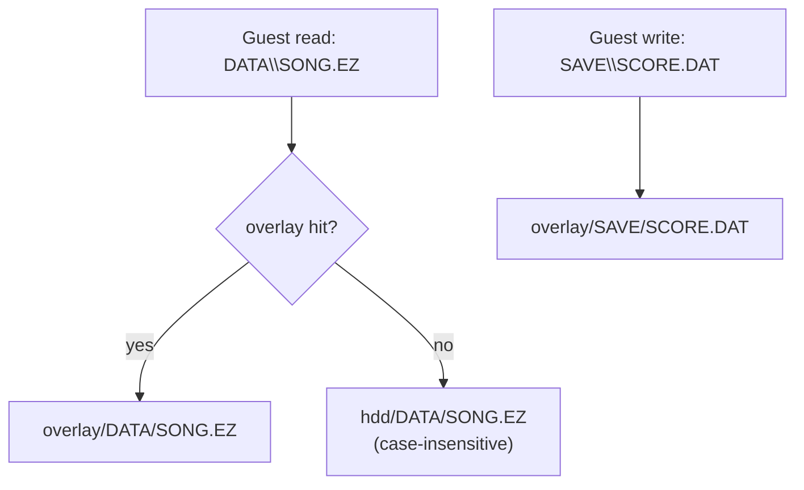
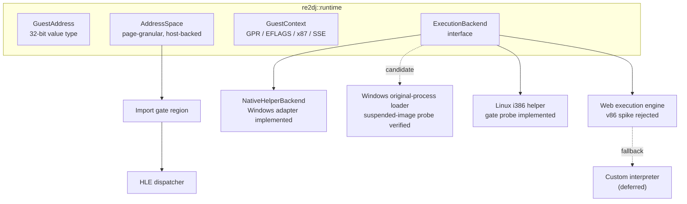

# 아키텍처 / Architecture

이 문서는 현재 저장소에 구현된 구조와, 그 구조가 향후 확장될 방향을 기술한다. 구현이 바뀌면 같은 작업에서 이 문서를 갱신한다.

*This document describes the structure currently implemented in the repository and how it is intended to grow. Update it in the same task whenever the implementation changes.*

> [!NOTE]
> 아래 표기 규칙을 따른다. **[구현됨]** 은 저장소에 코드가 있고 빌드·테스트로 확인된 것, **[설계됨]** 은 인터페이스만 정해진 것, **[계획]** 은 아직 설계 문서만 있는 것이다.
>
> *Sections are marked **[Implemented]** when code exists and is verified by a build or test, **[Designed]** when only the interface is fixed, and **[Planned]** when only a design note exists.*

---

## 1. 실행 모델 / Execution model

게스트는 32비트 x86 Win32 PE 실행 파일이다. 현재 Windows 1차 host는 같은 x86 bitness의 launcher와 original-child process로 구성되며, runtime DLL은 후속 작업에서 child에 적재한다. Linux x86-64와 WebAssembly는 후속 대상이고 Windows x64 helper 경로는 보류한다.

*The guest is a 32-bit x86 Win32 PE executable. The current primary Windows host consists of same-bitness x86 launcher and original-child processes; a later task loads the runtime DLL into the child. Linux x86-64 and WebAssembly are later targets, and the Windows x64 helper path is deferred.*

HLE 경계는 **Win32 import thunk**다. 로더가 게스트의 import table을 해석할 때, 각 API를 실제 DLL이 아니라 합성 gate 주소로 바인딩한다. 실행 backend가 gate 주소로 제어를 넘기면 C++ 구현이 호출된다.

*The HLE boundary is the **Win32 import thunk**. When the loader parses the guest import table, it binds each API to a synthetic gate address instead of a real DLL. Control transferred to a gate address dispatches into the C++ implementation.*



---

## 2. 계층과 디렉터리 / Layers and directories

| 계층 / Layer | 경로 / Path | 책임 / Responsibility | 상태 |
| --- | --- | --- | --- |
| HDD 입력 | `include/re2dj/hdd/`, `src/hdd/` | 사용자가 준 디렉터리 검증, 대소문자 무시 경로 해석, 실행 파일 스캔 | **[구현됨]** |
| 게스트 경로 | `include/re2dj/storage/`, `src/storage/` | Win32 경로 파싱·정규화, 드라이브 문자 매핑, overlay 정책과 파일 테이블 | **[구현됨]** |
| 실행 파일 분석 | `include/re2dj/exe/`, `src/exe/` | PE32 헤더·섹션·디렉터리 판독 | **[구현됨]** (헤더·섹션), **[계획]** (import/reloc) |
| 타깃 프로파일 | `include/re2dj/target/`, `src/target/` | 버전별 실행 파일 경로, 작업 디렉터리, HLE 프로파일 ID | **[구현됨]** (자료구조·감지), **[계획]** (버전별 항목) |
| 런타임 | `include/re2dj/runtime/`, `src/runtime/` | 게스트 주소 공간, 레지스터 컨텍스트, 실행 backend 인터페이스 | **[계획]** |
| HLE | `include/re2dj/hle/`, `src/hle/` | kernel32/user32/gdi32/ddraw/dsound/dinput 모듈 테이블과 구현 | **[계획]** |
| 설정 | `include/re2dj/config/`, `src/config/` | INI 파싱, 키 바인딩, 실행 옵션 | **[계획]** |
| 플랫폼 | `src/platform/{windows,linux,web}/` | 창·렌더·오디오·입력·시간의 호스트 구현 | **[계획]** |
| 호스트 | `src/host/cli/` | 명령행 진입점 | **[구현됨]** |
| 도구 | `src/tools/{hdd_probe,pe_analyzer}/` | 비실행 분석 도구 | **[구현됨]** |

*The table above maps each layer to its directory, responsibility, and current status.*

---

## 3. HDD 디렉터리 입력 / HDD directory input **[구현됨]**

원본 HDD 내용은 **디렉터리 경로**로 입력받는다. 이미지 파일(`.img`, `.vhd`)을 직접 마운트하지 않는다. 사용자가 이미지를 풀어 놓은 디렉터리를 그대로 가리키면 된다.

*Original HDD contents arrive as a **directory path**. Image files are not mounted directly; the user points at a directory into which the image was already extracted.*

```
re2dj --hdd /path/to/ez2dj_hdd
```

`re2dj::hdd::HddRoot`가 그 경로를 소유하며 다음을 책임진다.

* 경로 존재와 디렉터리 여부 검증
* 게스트 상대 경로를 호스트 실제 경로로 해석. **대소문자를 무시한다.**
* 해석 결과 캐시

*`re2dj::hdd::HddRoot` owns the path and is responsible for validating it, resolving guest-relative paths to real host paths **case-insensitively**, and caching the result.*

### 왜 대소문자 무시 해석이 필요한가 / Why case-insensitive resolution is required

원본은 Windows에서 동작했으므로 게임 코드가 `DATA\Song01.EZ`처럼 실제 파일명과 대소문자가 다른 문자열로 파일을 열어도 동작했다. Linux와 Web 호스트의 파일 시스템은 대소문자를 구분하므로, 그대로 넘기면 열리지 않는다. `HddRoot`는 각 경로 구성 요소를 디렉터리 항목과 대소문자 무시로 대조해 실제 이름을 찾는다.

*The original ran on Windows, so game code could open `DATA\Song01.EZ` with a case that does not match the real file name. Linux and Web host file systems are case-sensitive, so the open would fail. `HddRoot` matches each path component against directory entries case-insensitively to find the real name.*

대조는 항상 디렉터리 나열 결과를 기준으로 한다. 정확히 일치하는 항목이 있으면 그것을 쓰고, 없으면 대소문자 무시로 처음 일치한 항목을 쓴다. 요청된 철자를 먼저 시도하면 Windows에서는 성공하고 Linux에서는 실패해, 같은 덤프가 호스트마다 다른 경로를 내놓는다. 나열 결과는 디렉터리 단위로 캐시한다.

*Matching always goes through the directory listing: an exact match wins, otherwise the first case-insensitive match does. Probing the requested spelling first would succeed on Windows and fail on Linux, so one dump would yield different paths per host. Listings are cached per directory.*

### 쓰기 정책 / Write policy **[구현됨]**

게스트의 파일 쓰기는 원본 디렉터리를 변경하지 않는다. 쓰기는 별도 overlay 디렉터리로 향하며, 읽기는 overlay를 먼저 조회한 뒤 원본으로 내려간다. `--hdd`는 전체 dump root이고 Windows x86 launcher는 선택된 target profile의 `working_directory_relative_path`를 안전하게 해석해 guest `D:\ez2dj`와 상대 경로의 source mount로 주입한다. 빈 working directory만 dump root 자체를 뜻한다.

*Guest file writes never modify the original directory. Writes go to a separate overlay directory, and reads consult the overlay before falling through to the original. `--hdd` denotes the complete dump root; the Windows x86 launcher safely resolves the selected target profile's `working_directory_relative_path` and injects it as the source mount for guest `D:\ez2dj` and relative paths. Only an empty working directory maps directly to the dump root. The runtime clones an existing original file to the overlay before an `OPEN_EXISTING` write, so the original stays unchanged.*



### Windows x86 이미지 로더 경계 / Windows x86 image-loader boundary **[구현됨]**

원본은 자산 이름을 검색 경로 테이블로 해석한 뒤 `CreateFileA`로 존재를 확인하고, 실제 비트맵은 `USER32!LoadImageA(NULL, path, IMAGE_BITMAP, 0, 0, LR_LOADFROMFILE | LR_CREATEDIBSECTION)`로 읽는다. 따라서 VFS는 `KERNEL32!CreateFileA`만으로는 완결되지 않는다. `Re2djVfsLoadImageA`는 문자열 상대경로 + `IMAGE_BITMAP` + `LR_LOADFROMFILE` 조합에만 읽기 전용 HDD/overlay 매핑을 적용하고, resource ID·다른 image type·다른 flag는 원래 `LoadImageA`로 그대로 넘긴다. launcher는 이 패치 준비 상태를 다른 VFS 패치와 분리해 추적하므로, 실패해도 뒤따르는 device 패치를 조용히 건너뛰지 않고 `vfs_image_loader` 진단 이벤트로 드러난다.

원본 `.str` 장면 스크립트 로더는 `FILE_FLAG_NO_BUFFERING`으로 열고 sector 배수가 아닌 파일 크기 전체를 정렬되지 않은 pool 버퍼로 읽는다. Windows 9x는 이 정렬 요구를 강제하지 않았지만 NT 커널은 강제하므로 `ReadFile`이 `ERROR_INVALID_PARAMETER`로 실패한다. VFS `CreateFileA` 경계는 게스트가 기대한 OS 의미를 복원하기 위해 `FILE_FLAG_NO_BUFFERING`만 제거하고 나머지 flag는 그대로 전달한다. 캐싱 정책만 달라지고 게스트가 받는 바이트는 동일하다.

*The original `.str` scene-script loader opens with `FILE_FLAG_NO_BUFFERING` and then reads a whole non-sector-multiple file into an unaligned pool buffer. Windows 9x did not enforce those alignment rules but the NT kernel does, so `ReadFile` fails with `ERROR_INVALID_PARAMETER`. To restore the OS semantics the guest expects, the VFS `CreateFileA` boundary strips `FILE_FLAG_NO_BUFFERING` alone and forwards every other flag; only the caching policy changes while the bytes the guest receives stay identical.*

자산 경계 진단은 `.bmp`와 `.str` 요청에 대해 호출 API, 게스트 요청 경로, 매핑된 호스트 경로, 성공 여부와 Win32 오류를 별도 bounded 로그에 남긴다. 확장자마다 상한을 따로 두어 대량 비트맵 스윕이 드문 script 요청을 가리지 못하게 한다. 파일 내용은 기록하지 않는다. 경로 해석은 게스트 안에서 일어나므로 존재하지 않는 후보에 `ERROR_FILE_NOT_FOUND`를 그대로 돌려주는 것이 계약이며, 진단 자체의 파일 I/O가 게스트가 읽을 last error를 덮지 않도록 보고 뒤에 오류를 확정한다. 확인된 호출 지점과 인자는 [자산 로딩 경로 분석](docs/analysis/ez2dj-asset-loading-path.md)에 있다.

*The original resolves an asset name through a search-path table, probes existence with `CreateFileA`, and then reads the actual bitmap with `USER32!LoadImageA(NULL, path, IMAGE_BITMAP, 0, 0, LR_LOADFROMFILE | LR_CREATEDIBSECTION)`, so a `KERNEL32!CreateFileA`-only VFS is incomplete. `Re2djVfsLoadImageA` applies the read-only HDD/overlay mapping solely to the string-relative-path + `IMAGE_BITMAP` + `LR_LOADFROMFILE` combination and forwards resource IDs, other image types, and other flags unchanged. The launcher tracks this patch's readiness separately from the other VFS patches, so a failure surfaces as a `vfs_image_loader` diagnostic event instead of silently skipping the device patches that follow.*

*The asset-boundary diagnostic records the calling API, guest request path, mapped host path, success status, and Win32 error for `.bmp` and `.str` requests in a separate bounded log, with a per-extension bound so a large bitmap sweep cannot hide the rarer script requests. It never records file contents. Because path resolution happens inside the guest, returning `ERROR_FILE_NOT_FOUND` for absent candidates is the contract, and the error is committed after reporting so the diagnostic's own file I/O cannot overwrite what the guest reads back. Confirmed call sites and arguments are in the [asset loading path analysis](docs/analysis/ez2dj-asset-loading-path.md).*

### Windows x86 가상 디바이스 경계 / Windows x86 virtual-device boundary **[구현됨]**

주입 runtime은 launcher의 `--device-mock-lptdi` 정책이 켜졌을 때 `CreateFileA("\\.\LPTDI*")`를 import thunk에서 가로채 예약 범위 `0xFEED0001..0xFEED00FF`의 synthetic handle을 반환한다. 파일 wrapper는 이 핸들에 EOF형 read, 쓰기 거부, seek/size 미지원, `FILE_TYPE_CHAR`, 성공 close 계약을 제공한다. 정책이 꺼져 있거나 다른 경로이면 기존 VFS/host 경로로 내려간다. 기본 `--device-mock-lptdi`는 `DeviceIoControl`을 host에 전달해 실패 baseline을 보존한다. 실험 옵션은 canonical IAT를 runtime wrapper로 바꾼다. zero/full-success mode 외에 `--device-mock-lptdi-response-profile`은 공용 parser가 검증한 code별 exact-size bytes를 주입한다. `--device-mock-lptdi-target-state`는 공용 `lptdi_challenge_response` 변환으로 실행별 두 번째 input seed에 적응하는 response offset 4~11을 만들며, guest XOR 뒤 선택한 8바이트 상태가 남게 한다. 각 IOCTL 정책은 상호 배타적이고 synthetic handle·확인된 code에만 적용된다. `--lptdi-post-ioctl-trace`는 합성 래퍼도 API watch에 등록하고 guest 복귀 후 같은 allocation의 명령을 bounded single-step으로 기록하며, 외부 call은 one-shot return breakpoint로 건너뛴다. syscall resume breakpoint와 trace breakpoint가 같은 주소를 공유하면 원래 바이트 소유권을 trace에 넘기고, trace가 이미 복귀 대기 중일 때 외부 single-step을 중복 처리하지 않는다. launcher는 원본 entry의 첫 `GetVersion` caller에서 `.data` initializer 8 DWORD를 한 번 기록해 복원 여부를 검증한다. API trace는 USER32도 해석해 창·display 초기화의 파일 접근 전 실패를 귀속한다. 다른 handle은 항상 host로 전달한다.

*When launcher policy `--device-mock-lptdi` is enabled, the injected runtime intercepts `CreateFileA("\\.\LPTDI*")` at the import thunk and returns a synthetic handle in reserved range `0xFEED0001..0xFEED00FF`. File wrappers give that handle EOF-style reads, denied writes, unsupported seek/size, `FILE_TYPE_CHAR`, and successful close semantics. Disabled policy and all other paths fall through to the existing VFS/host path. The base option forwards DeviceIoControl to preserve the host-failure baseline, while experimental options replace the canonical IAT slot. Besides zero/full-success modes, `--device-mock-lptdi-response-profile` injects code-specific exact-size bytes validated by the shared parser. `--device-mock-lptdi-target-state` uses the shared `lptdi_challenge_response` transform to adapt response offsets 4 through 11 to each second-input seed, leaving the selected eight-byte state after the guest XOR. IOCTL policies are mutually exclusive and apply only to synthetic handles and confirmed codes. `--lptdi-post-ioctl-trace` also registers the synthetic wrapper as an API watch and records bounded same-allocation guest instructions after return, skipping external calls with one-shot return breakpoints. When a syscall-resume and trace breakpoint share an address, original-byte ownership transfers to the trace, and an external single-step is not reprocessed while that trace already awaits resume. The launcher records the eight-DWORD `.data` initializer once at the original entry's first `GetVersion` caller to verify restoration. API tracing also resolves USER32 and observes window/display startup calls so pre-file initialization failures remain attributable. Other handles always forward to the host.*

### Windows x86 논리 display mode 경계 / Windows x86 logical display-mode boundary **[구현됨]**

launcher의 `--hle-display-mode`는 원본 USER32 import thunk의 `ChangeDisplaySettingsExA`만 주입 runtime wrapper로 바꾼다. wrapper는 관찰된 null-device, 640×480×16, `CDS_UPDATEREGISTRY`, null-reserved 요청만 `DISP_CHANGE_SUCCESSFUL`로 처리하고 host desktop은 변경하지 않는다. 다른 mode 변경과 restore 요청은 host USER32로 전달한다. 이 정책은 guest가 기대하는 표시 mode 계약만 보존하며 실제 surface 출력과 scaling은 후속 그래픽 backend의 책임으로 남긴다.

*Launcher option `--hle-display-mode` replaces only the original USER32 `ChangeDisplaySettingsExA` import thunk with an injected-runtime wrapper. The wrapper returns `DISP_CHANGE_SUCCESSFUL` without changing the host desktop only for the observed null-device 640×480×16 `CDS_UPDATEREGISTRY` request with a null reserved argument. Other mode changes and restore requests forward to host USER32. This preserves the guest-visible mode contract while leaving real surface output and scaling to a later graphics backend.*

`--d3d-init-trace`는 1st SE 원본 초기화 coordinator의 다섯 return site에 일회성 breakpoint를 두고 반환값, DirectDraw/Direct3D COM 전역, phase marker를 기록한 뒤 원본 바이트를 복원한다. 이 진단은 guest 결과를 바꾸지 않는다. 현재 증거는 import-thunk display HLE 다음 경계가 `IDirect3D3::FindDevice` 같은 COM method임을 보여 준다. 후속 graphics HLE는 host COM vtable을 직접 수정하지 않고 `DirectDrawCreate` import에서 시작하는 교체 가능한 proxy interface 계층으로 설계해야 한다.

*`--d3d-init-trace` places one-shot breakpoints at the five return sites of the 1st SE initialization coordinator, records results, DirectDraw/Direct3D COM globals, and phase markers, then restores the original bytes. It does not change guest results. Current evidence places the next boundary after import-thunk display HLE at a COM method such as `IDirect3D3::FindDevice`; the later graphics HLE should therefore use replaceable proxy interfaces rooted at the `DirectDrawCreate` import rather than patching a host COM vtable in place.*

### Direct3D 3 OpenGL HLE / Direct3D 3 OpenGL HLE **[부분 구현 / Partially implemented]**

그래픽 HLE는 `DirectDrawCreate` import gate, guest 소유 32비트 COM facade, 플랫폼 중립 legacy graphics core, 교체 가능한 `RenderBackend`의 네 계층으로 구성한다. COM facade는 `IDirectDraw`/`IDirectDraw4`/`IDirect3D3`/`IDirect3DDevice3` identity와 vtable, reference count를 보존한다. legacy core는 guest surface의 16비트 layout·pitch·lock 상태와 정규화된 fixed-function state를 소유하며 OpenGL type이나 platform context API를 포함하지 않는다.

첫 backend는 desktop OpenGL이고 Web은 같은 `RenderBackend` 계약을 WebGL 2로 구현한다. deprecated OpenGL fixed-function state에 직접 의존하지 않고 내부 shader로 관찰된 Direct3D 3 상태를 재현한다. `FindDevice`는 host HAL 열거를 전달하지 않고 구현된 capability만 선언하는 가상 hardware device를 노출한다. primary/back/depth/texture surface는 논리 객체로 유지하며, 기존 640×480×16 display-mode HLE와 결합해 host desktop mode를 바꾸지 않고 present한다. 상세 단계와 미확정 항목은 [Direct3D 3 OpenGL HLE 설계](docs/design/20260825-061-direct3d3-opengl-hle.md)에 둔다.

Windows x86 구현은 `src/platform/windows/direct3d3_com_facade.*`와 전용 `direct3d3_opengl_backend.*`에 있다. 공용 `LegacyDrawCommand`와 `LegacyFixedFunctionState`는 확인된 XYZRHW, stage-zero modulate, linear filter, alpha test와 blend factor를 WGL/GLSL backend로 전달한다. `LegacyTextureView`는 RGB565 backing, stable identity/revision과 inclusive source color-key 범위를 보존한다. backend는 surface별 OpenGL texture를 cache하고 key texel을 alpha로 변환해 변경 revision만 upload한다. `LegacyVertexBuffer`와 `IDirect3DVertexBuffer` facade는 XYZ/NORMAL/TEX1 121개 정점을 3,872바이트 storage로 보존한다. DirectSound HLE는 별도 공용 core와 Windows facade에 유지한다.

컬러키는 alpha 값이 아니라 **discard 조건**으로 구현한다. Direct3D는 `D3DRENDERSTATE_COLORKEYENABLE`이 켜진 동안 키에 일치하는 texel을 blend factor와 무관하게 버린다. texel alpha만으로 표현하면 `srcblend=ONE`, `dstblend=ZERO`인 복사 blend에서 keyed texel이 키 색 그대로 기록된다. backend는 upload 때 일치 texel의 alpha를 0으로 두고, 게스트 `COLORKEYENABLE` 상태로만 gate되는 shader 분기에서 그 texel을 버린다. 게스트 alpha test 분기는 원래 의미대로 별도로 남으며, 컬러키가 꺼진 draw는 영향을 받지 않는다. 특히 `srcblend=ZERO`, `dstblend=SRCCOLOR`인 곱셈 mask pass는 keyed texel을 버리면 mask가 무의미해지므로 반드시 게스트 상태로만 판단한다.

*Color keying is implemented as a **discard condition**, not as an alpha value. While `D3DRENDERSTATE_COLORKEYENABLE` is set, Direct3D drops key-matching texels regardless of the blend factors; expressing that through texel alpha alone writes them out in the key color under a copy blend of `ONE` and `ZERO`. The backend leaves matching texels at zero alpha during upload and drops them in a shader branch gated solely on the guest's `COLORKEYENABLE`. The guest alpha-test branch keeps its own meaning separately, and draws with keying disabled are unaffected — in particular the multiplicative mask passes using `srcblend=ZERO` and `dstblend=SRCCOLOR`, which would become meaningless if their keyed texels were dropped.*

DirectDraw 2D 경로는 texture뿐 아니라 `DDSCAPS_OFFSCREENPLAIN` surface에도 같은 RGB565 GDI backing과 stable identity/revision을 부여한다. 공용 `CopyRgb565Rectangle` 계약이 동일 크기 사각형과 inclusive source color key를 처리하며, facade의 `Blt`/`BltFast`는 CPU backing을 갱신하고 primary/back destination이면 같은 source 사각형을 OpenGL frame에 합성한다. stretch, ROP과 destination color key처럼 아직 관찰되지 않은 조합은 명시적으로 거절한다.

직접 x86 `IN`/`OUT`에는 교체 가능한 Win32 import가 없으므로 `include/re2dj/input/legacy_io_port_bus.h`의 플랫폼 중립 raw byte 계약을 `ExecutionBackend` 경계에 둔다. Windows x86 진단 모드는 1st SE에서 확인된 helper RVA와 opcode, port만 debugger의 `EXCEPTION_PRIV_INSTRUCTION`으로 처리한다. 실제 실행용 `--run-detached`는 원본 entry 복원, runtime 주입과 IAT 검증 뒤 debugger를 분리하고, injected runtime의 vectored handler가 같은 제한 계약을 process 안에서 처리한다. 원본 instruction byte는 수정하지 않는다. 현재 idle state는 active-low `0x101`, `0x102`, `0x106`에 `0xff`, 변화량 계열 `0x103`~`0x105`에 `0x00`이며 물리 버튼 의미는 아직 선언하지 않는다.

*The graphics HLE is split into a `DirectDrawCreate` import gate, guest-owned 32-bit COM facades, a platform-neutral legacy graphics core, and a replaceable `RenderBackend`. The COM layer preserves interface identity, vtables, and reference counts; the common core owns guest-visible surface layouts and normalized fixed-function state without OpenGL or platform context types. Desktop OpenGL is the first backend and WebGL 2 implements the same contract for Web. Internal shaders reproduce observed Direct3D 3 behavior, while a conservative virtual hardware device replaces host HAL enumeration. Logical primary, back, depth, and texture surfaces present through the existing 640×480×16 display contract without changing the host desktop mode.*

*The Windows x86 graphics path carries stable texture identity/revision, inclusive RGB565 source color keys, and the observed modulate, linear-filter, alpha-test, and blend-factor state into a per-surface cached WGL/GLSL backend. The vertex-buffer and DirectSound contracts remain separated in their neutral cores and Windows facades.*

*The DirectDraw 2D path also gives `DDSCAPS_OFFSCREENPLAIN` surfaces RGB565 GDI backing and stable identity/revision. A common `CopyRgb565Rectangle` contract handles equal-sized rectangles and inclusive source color keys; facade `Blt`/`BltFast` update CPU backing and composite the same source rectangle into the OpenGL frame for primary/back destinations. Unobserved stretch, ROP, and destination-key combinations remain explicit failures.*

*Direct x86 `IN`/`OUT` has no Win32 import to replace, so a platform-neutral raw byte bus under `include/re2dj/input/` forms an execution-backend boundary. Debugger mode handles only confirmed 1st SE helper RVAs, opcodes, and ports. For real execution, `--run-detached` restores and verifies the guest first, detaches the debugger, and lets an injected vectored handler enforce the same narrow contract in-process without changing original instruction bytes.*

---

## 4. 게스트 경로 변환 / Guest path translation **[구현됨]**

게스트가 넘기는 경로는 Win32 문법이다. `re2dj::storage::GuestPath`가 이를 파싱해 다음을 구분한다.

* 드라이브 문자 (`C:\...`)
* 드라이브 상대 (`C:FOO`)
* 루트 상대 (`\FOO`)
* 순수 상대 (`FOO\BAR`)
* UNC (`\\server\share`) — 현재는 거부한다

*Guest paths use Win32 syntax. `re2dj::storage::GuestPath` parses them and distinguishes drive-absolute, drive-relative, root-relative, plain relative, and UNC forms. UNC is rejected for now.*

정규화 단계에서 `.`을 제거하고 `..`을 접으며, 구분자로 `/`와 `\`를 모두 받아들인다. 루트를 벗어나는 `..`은 실패로 처리해 HDD 디렉터리 바깥을 참조하지 못하게 한다.

*Normalization drops `.`, folds `..`, and accepts both `/` and `\` as separators. A `..` that would escape the root fails, so nothing outside the HDD directory is reachable.*

---

## 5. PE32 이미지 판독 / PE32 image reading **[구현됨]**

`re2dj::exe::PeImageInfo`는 원본 실행 파일에서 다음을 읽는다.

* DOS 헤더와 `e_lfanew`
* COFF 파일 헤더: machine, section 수, characteristics
* Optional header: magic(PE32 / PE32+), image base, entry point RVA, section/file alignment, subsystem, DLL characteristics
* Section 테이블: 이름, VA, 가상/원시 크기, 원시 오프셋, 특성
* Data directory: import, relocation, resource, TLS 위치

*`re2dj::exe::PeImageInfo` reads the DOS header, COFF file header, optional header, section table, and data directories from an original executable.*

이 판독기 자체는 **적재하지 않는다.** 파일을 읽어 구조만 보고한다. 실제 적재(섹션 매핑, 재배치, import 바인딩)는 구현된 런타임 계층의 `LoadPe32Image()`가 수행한다.

*This reader does **not** load anything; it reports structure only. The implemented runtime `LoadPe32Image()` performs section mapping, relocation, and import binding.*

HDD 스캔은 이 판독기를 사용해 각 실행 파일을 분류한다. `machine`이 x86(0x014C)이고 magic이 PE32(0x10B)이며 subsystem이 GUI인 항목이 게임 실행 파일 후보다.

*The HDD scan uses this reader to classify each executable. An entry with x86 machine (0x014C), PE32 magic (0x10B), and the GUI subsystem is a game-executable candidate.*

---

## 6. 타깃 프로파일 / Target profiles **[구현됨: 자료구조]**

버전별 차이는 `re2dj::target::TargetProfile`로 분리한다.

| 필드 | 의미 |
| --- | --- |
| `id` | 명령행에서 고르는 짧은 식별자 |
| `display_name` | 사람이 읽는 이름 |
| `executable_relative_path` | HDD 루트 기준 실행 파일 경로. 지문이 맞을 때 채워진다 |
| `working_directory_relative_path` | 호스트 쪽 작업 디렉터리 |
| `guest_drive_letter` | 게스트가 자신이 실행된다고 믿는 드라이브. 근거가 없으면 `\0` |
| `guest_directory` | 같은 근거의 Win32 디렉터리. 근거가 없으면 빈 문자열 |
| `hle_profile_id` | 적용할 HLE 서비스 집합 |
| `detected` | 내장 표가 아니라 스캔에서 나온 것인지 |
| `bring_up_target` | 캐비닛이 실행한 것이 아니라 개발용인지 |
| `note` | 사람이 읽는 단서와 한계 |

*Version-specific differences live in `re2dj::target::TargetProfile`.*

### 지문으로 덤프를 식별한다 / Dumps are identified by fingerprint

내장 프로파일은 **실행 파일 이름 + 그 옆에 반드시 있어야 하는 항목 목록**으로 덤프를 식별한다. 파일 크기나 해시는 리비전마다 달라져 정상 덤프를 거부하므로 쓰지 않는다.

*A built-in profile identifies a dump by an **executable name plus the entries that must sit beside it**. File size and hashes are rejected as keys because they vary per revision and would reject a legitimate dump.*

| 프로파일 | 실행 파일 | 필수 형제 항목 |
| --- | --- | --- |
| `ez2dj1stse` | `ez2dj.exe` | `ez2dj1.exe`, `ez2dj.ini`, `System.ini`, `Songs`, `System` |
| `ez2dj1stse_unpacked` | `ez2dj1.exe` | `ez2dj.exe`, `ez2dj.ini`, `Songs`, `System` |
| `ez2dj3rd` | `EZ2DJ.EXE` | `EZ2DJ.INI`, `FONTKR.DAT`, `BG`, `Sound`, `system` |

형제 항목이 필요한 이유는 경로 해석이 대소문자를 무시하기 때문이다. 3rd의 `EZ2DJ.EXE`라는 이름만으로는 1st SE의 `ez2dj.exe`와 구별되지 않는다. 두 지문은 서로소라서 오인이 일어나지 않는다.

*The siblings are required because path resolution is case-insensitive, so the name `EZ2DJ.EXE` alone does not distinguish 3rd from 1st SE. The two fingerprints are disjoint, so neither dump matches the other.*

실행 파일을 스캔 결과에서 찾으므로 사용자가 상위 디렉터리를 지정해도 걸린다. 형제 항목은 그 실행 파일의 디렉터리를 기준으로 확인한다.

*Matching searches the scan, so pointing at a parent directory still works; siblings are checked relative to the matched executable's own directory.*

### 순서와 감지 / Ordering and detection

`BuildTargetProfiles()`는 내장 프로파일 중 지문이 맞는 것을 먼저 놓고, 내장이 가져가지 않은 실행 파일에 대해서만 `DetectTargetProfiles()`를 돌린다. 목록의 첫 항목이 기본 타깃이다.

내장 프로파일이 없는 버전의 덤프도 감지만으로 계속 동작한다. 내장 항목은 **실제로 확인한 덤프에 대해서만** 추가한다.

*`BuildTargetProfiles()` puts fingerprint matches first and runs detection only over the executables no built-in claimed; the first entry is the default target. A dump of a version with no built-in profile still works through detection alone. Built-in entries are added **only for dumps that were actually inspected**.*

---

## 7. 런타임 계층 / Runtime layer **[부분 구현됨]**



* `GuestAddress`는 host pointer로 변환되지 않는 32비트 값 타입이다.
* `AddressSpace`는 게스트의 평탄한 4 GiB 주소 공간 중 실제로 커밋된 페이지만 호스트 메모리에 둔다. 게스트 주소를 호스트 포인터로 노출하지 않고 `Read8/16/32`, `Write8/16/32` 접근자를 통해서만 다룬다.
* `LoadPe32Image()`는 헤더와 섹션을 매핑하고 zero-fill한 뒤, `IMAGE_REL_BASED_HIGHLOW` 재배치를 적용하고 이름/ordinal import를 합성 gate에 바인딩한다. 실패 시 호출자가 제공한 주소 공간과 gate 표는 바뀌지 않는다.
* `ImportGateTable`은 기본적으로 `0xF0000000`부터 16바이트 간격의 주소를 배정한다. 이 범위에는 실제 명령어가 없으며 Stage 3 backend가 HLE dispatcher로 전달한다.
* `ExecutionBackend` event/reply 인터페이스는 이미지 준비, 실행 시작, event 대기, import 완료 응답, 중단 요청을 분리한다. event에는 backend-local thread ID, guest EIP/ESP와 gate 주소만 담고 host pointer를 넣지 않는다. import 응답은 EAX/EDX, stack 정리 byte 수, 계속/중단 action을 전달한다.
* Windows `NativeHelperBackend`는 x86 helper process와 anonymous pipe protocol v3를 `ExecutionBackend` 뒤에 캡슐화한다. PImpl 공개 header에는 Windows type이 없고, adapter가 packet 순서, 상태 검증과 child 종료를 소유한다. `native_pe_image`는 requested base mapping, `HIGHLOW` relocation, section protection과 process-attach TLS callback을 담당한다. helper는 PE32의 이름/ordinal import를 순회해 `ImportGateTable`의 synthetic gate마다 실행 가능한 x86 thunk를 만들고 실제 thunk 주소를 IAT에 쓴다. load 뒤 module/name/ordinal/gate metadata를 adapter에 보내 `LoadedPeImage.imports`를 채운다. gate가 멈춘 동안 adapter는 guest memory를 읽고 쓴 뒤 EDX:EAX와 동적 stack 정리 크기를 응답한다. protocol은 event 하나를 직렬 처리하며 TLS storage/index와 병렬 guest thread는 후속 확장이다.
* `re2dj_windows_x86_launcher_probe`는 기본 Win32 host에서 원본 `ez2dj1.exe`를 `DEBUG_ONLY_THIS_PROCESS`로 만들고 entry `0x0043a640` 직전에 멈춘다. 이 입력에서는 DR0 hardware stop이 전달되지 않아 child memory의 entry 첫 바이트를 일시적으로 `INT3`로 바꾸고 즉시 원복하는 diagnostic fallback으로 정지했다. 이때 Windows loader가 main image를 `0x00400000`에 배치하고 7 DLL·144 IAT slot을 해석했음을 실제 HDD로 확인했다. 정지 상태에서 primary thread를 suspend하고 minimal x86 runtime DLL을 remote `LoadLibraryW` thread로 적재해 module base도 확인했다. `--probe-handoff`는 PE table에서 `GetCommandLineA` IAT slot을 찾아 runtime log-and-forward thunk로 교체하고, entry 재개 후 실제 debugger output event를 확인했다. x64 `re2dj_windows_original_process_probe`는 보류된 비교 근거로 남긴다.
* `re2dj_windows_x86_launcher_probe`는 기본 Win32 host에서 원본 `ez2dj1.exe`를 `DEBUG_ONLY_THIS_PROCESS`로 만들고 entry `0x0043a640` 직전에 멈춘다. 이 입력에서는 DR0 hardware stop이 전달되지 않아 child memory의 entry 첫 바이트를 일시적으로 `INT3`로 바꾸고 즉시 원복하는 diagnostic fallback으로 정지했다. 이때 Windows loader가 main image를 `0x00400000`에 배치하고 7 DLL·144 IAT slot을 해석했음을 실제 HDD로 확인했다. 정지 상태에서 primary thread를 suspend하고 minimal x86 runtime DLL을 remote `LoadLibraryW` thread로 적재해 module base도 확인했다. `--probe-handoff`는 PE table에서 `GetCommandLineA` IAT slot을 찾아 runtime log-and-forward thunk로 교체하고, `--hle-command-line`은 runtime의 process-lifetime buffer에 original basename을 기록해 실제 HLE thunk가 반환하도록 한다. 두 경로 모두 entry 재개 후 debugger output event로 확인했다. x64 `re2dj_windows_original_process_probe`는 보류된 비교 근거로 남긴다.
* `re2dj_windows_x86_launcher_probe`는 target과 원본 EXE를 해석한 뒤 실행별 JSONL 진단 로그를 `logs/windows_x86_launcher_probe/<target-id>/`에 만든다. debug event와 예외 관찰은 `--trace` 여부와 관계없이 즉시 flush되며, `--trace`는 stderr 실시간 표시만 제어한다. 최종 성공 또는 실패 JSON은 생성된 로그 경로를 포함한다. 이 생성 디렉터리는 HDD 및 guest overlay 밖이고 Git ignore 대상이다.
* `re2dj_windows_x86_launcher_probe`의 `--instruction-trace <max-steps>`는 software entry stop에서 EIP와 TF를 설정하고 primary-thread debugger event 뒤 TF를 다시 설정한다. 최대 32개 instruction address와 바이트를 ring buffer에 유지한 뒤 illegal instruction 또는 step limit에서만 JSONL에 기록한다. 이는 protected post-entry control flow의 관찰 도구이며, branch operand나 보호 실패 원인을 자체적으로 해석하지 않는다.
* `re2dj_windows_x86_launcher_probe --scan-fault-references`는 first-chance illegal-instruction event에서 child를 계속하기 전에 committed private/image memory를 bounded scan한다. fault address와 page base의 32-bit reference, 해당 region 속성 및 match summary를 JSONL에 기록한다. 이 결과는 target storage 후보일 뿐 indirect branch caller의 증명은 아니다.
* `re2dj_windows_x86_launcher_probe --api-trace`는 child memory에서 `kernel32.dll`/`kernelbase.dll` export를 해석해 watched API에 software breakpoint를 설치하고, hit마다 caller·args·ANSI 문자열을 JSONL에 남긴 뒤 원래 byte 복원과 TF 1 step으로 삼키고 재무장한다. `DeviceIoControl`은 guest-origin 호출에 한해 8개 인자와 bounded input/output snapshot을 기록하고 thread별 one-shot return breakpoint에서 EAX, bytes-returned, buffer 변화 여부를 기록한다. first-chance illegal-instruction에서는 full register와 segment, 64 dword stack과 main image section 분류, fault page dump, allocation region walk, entry VA 참조 탐색을 기록한다. first-chance access violation에서는 접근 종류·주소와 full register, main-image register pointer 주변 dword, stack return 주소 주변 code bytes를 기록한다. entry 이후 동적으로 적재된 모듈의 unload event에서는 종반 구간을 single-step 수집하며 매 샘플에 GP register trail과 nearest-export 심볼 주석을 붙인다. 수집 중 표준 syscall 스탠자(`mov edx,&thunk; call edx`) 꼬리마다 복귀 주소에 1회용 software breakpoint를 심어(예산 상한 내 재무장) WOW64 게이트 너머의 32비트 복귀를 포착하고 TF를 재무장하며, 복귀 시점 stack 64 word에 심볼 주석을 남긴다. 이 도구는 관찰이며 보호 실패 원인을 자체적으로 판정하지 않는다.
* OS type을 포함하지 않는 desktop helper protocol v3 header는 `src/platform/native_helper_protocol.h`에 공유한다. Linux 최소 prototype은 x86-64 host가 `fork`/`exec`한 i386 helper의 실제 `__stdcall` gate에서 같은 event/memory/completion packet을 왕복한다. 현재 Linux 경로는 제한된 stack memory와 컴파일된 gate만 검증했으며 PE32 mapping 및 backend adapter는 후속 작업이다.
* BSD-2-Clause v86 CPU 분리성 spike는 부적합으로 끝났다. 공식 소스에는 CPU-only build 경계가 없고 CPU memory·run loop가 PC 장치, MMIO, browser timer/IRQ에 결합되어 있다. 기본 synthetic gate `0xF0000000`도 v86에서 실행 불가능한 mapped/MMIO 범위다. interpreter와 JIT 양쪽에 gate stop/resume을 새로 넣고 대규모 fork를 유지해야 하므로 채택하지 않는다. TinyEMU 계열은 Web x86 소스 공개 범위를 확인할 때만 재검토하며, 직접 인터프리터는 계속 후순위 fallback이다.

*`GuestAddress` is a 32-bit value type that cannot become a host pointer. `AddressSpace` keeps only committed pages of the flat 4 GiB guest space in host memory and exposes accessors rather than pointers. `LoadPe32Image()` maps and zero-fills headers and sections, applies `IMAGE_REL_BASED_HIGHLOW` relocations, and binds named or ordinal imports to synthetic gates transactionally. `ImportGateTable` assigns addresses at 16-byte intervals from `0xF0000000`. The implemented `ExecutionBackend` interface separates image preparation, start, event waiting, guest-memory reads/writes, import completion, and stop requests using backend-local thread IDs and guest values only. Windows `NativeHelperBackend` encapsulates the x86 helper process and anonymous-pipe protocol v3 behind that interface; `native_pe_image` owns requested-base mapping, relocations, protection, and process-attach TLS callbacks, while import thunks restore EDX:EAX and dynamic stack cleanup. The primary `re2dj_windows_x86_launcher_probe` creates the original as a loader-owned child main image, confirms a pre-entry fully resolved IAT stop through a temporary child-memory `INT3` fallback, and loads a minimal same-bitness runtime DLL while the primary thread remains suspended; x64 observation remains deferred evidence. The OS-independent protocol-v3 header is shared under `src/platform/`. A Linux x86-64 host/i386 helper probe uses the same event/memory/completion packets for a real `__stdcall` gate, but Linux PE32 mapping and its backend adapter remain later work. Protocol v3 serializes one event; TLS storage/index and parallel guest threads remain later extensions. The v86 separability spike rejected adoption: its published source lacks a CPU-only build boundary, couples CPU memory/run control to PC devices and browser services, and treats the default synthetic-gate range as non-executable MMIO. TinyEMU remains conditional on confirming published Web-x86 source scope, while a custom interpreter remains deferred.*

*After resolving a target and original executable, `re2dj_windows_x86_launcher_probe` creates a per-run JSONL diagnostic log under `logs/windows_x86_launcher_probe/<target-id>/`. Debug events and exception observations flush to that file whether or not `--trace` is set; `--trace` controls only live stderr output. Final success and error JSON identify the log path. The generated directory is outside the HDD and guest overlay and is Git-ignored.*

*`re2dj_windows_x86_launcher_probe --instruction-trace <max-steps>` sets EIP and TF at the software-entry stop and rearms TF after primary-thread debugger events. It retains up to 32 instruction addresses and bytes in a ring buffer, writing them to JSONL only on an illegal instruction or step limit. This observes protected post-entry control flow; it does not independently decode branch operands or determine a protection-failure cause.*

*`re2dj_windows_x86_launcher_probe --scan-fault-references` bounded-scans committed private/image memory before continuing a first-chance illegal-instruction event. It records 32-bit references to the fault address and page base, their region properties, and a match summary in JSONL. The result is a target-storage candidate only, not proof of an indirect-branch caller.*

*`re2dj_windows_x86_launcher_probe --api-trace` resolves `kernel32.dll`/`kernelbase.dll` exports from child memory, arms software breakpoints on watched APIs, records caller, arguments, and ANSI strings per hit to JSONL, then swallows and rearms each hit by restoring the original byte and trap-flagging one instruction. For guest-origin DeviceIoControl calls it captures all eight arguments and bounded input/output snapshots, then uses a per-thread one-shot return breakpoint to record EAX, bytes-returned, and buffer changes. On a first-chance illegal instruction it records full registers with segments, a 64-dword stack with main-image section classification, the fault page bytes, an allocation region walk, and an entry-VA reference scan. On a first-chance access violation it records access kind/address, full registers, bounded dword windows around main-image register pointers, and code bytes around stack return addresses. On an unload event of a module loaded after entry it single-steps the unload tail, attaching a GP-register trail and nearest-export symbol annotation to every sample. Each standard syscall stanza tail (`mov edx,&thunk; call edx`) plants a one-shot software breakpoint on its return address — rearmable within a fire budget — catching the 32-bit resume past WOW64 gates and re-arming tracing, with a symbol-annotated 64-word stack dump at each resume. The tool observes only and does not itself adjudicate the protection-failure cause.*

---

## 8. 계획된 HLE 계층 / Planned HLE layer **[계획]**

이 표는 추측이 아니라 `ez2dj1.exe`의 import 테이블에서 나왔다. 근거와 전체 목록은 [EZ2DJ import 표면](docs/analysis/ez2dj-import-surface.md)에 있다.

*This table comes from the import table of `ez2dj1.exe` rather than from guesswork. The evidence and full list are in [EZ2DJ Import Surface](docs/analysis/ez2dj-import-surface.md).*

| 모듈 | 대체 대상 | 함수 수 | 우선순위 |
| --- | --- | --- | --- |
| `kernel32` | 파일 I/O, 메모리, INI, 모듈 | 약 40 | 1 |
| `user32` | 창, 메시지 루프, 디스플레이 모드 | 약 12 | 1 |
| `ddraw` | DirectDraw 1~6 표면과 블릿 | COM | 2 |
| `gdi32` | DIB 섹션과 블릿 | 14 | 2 |
| `dsound` | ordinal `#1` = `DirectSoundCreate` | COM | 3 |
| `winmm` | 믹서 볼륨, `timeGetTime` | 8 | 3 |
| `user32` | `GetAsyncKeyState` — 입력 전부 | 1 | 4 |
| `advapi32` | `RegFlushKey` stub | 1 | 4 |
| `kernel32` | 스레드, 이벤트, 임계 구역 | 약 20 | 5 |

`ez2dj1.exe`의 import는 **7개 DLL, 144개 함수**가 전부다. **Direct3D도 DirectInput도 없다.** 3rd는 DirectInput과 AVI 재생을 추가로 쓰므로 버전별 HLE 프로파일이 필요하다.

*`ez2dj1.exe` imports **144 functions from 7 DLLs** in total, with **no Direct3D and no DirectInput**. The 3rd build adds DirectInput and AVI playback, which is why per-version HLE profiles are needed.*

가장 큰 작업은 함수 개수가 아니라 DirectDraw와 DirectSound의 **COM 인터페이스**다. 게스트 메모리 안에 vtable을 만들어 각 슬롯에 gate 주소를 채워야 한다.

*The largest piece is not the function count but the **COM interfaces** of DirectDraw and DirectSound, which need vtables built inside guest memory with a gate address in each slot.*

각 모듈은 `{이름, ordinal, 인자 개수, 호출 규약, 구현 함수}` 항목의 테이블로 표현한다. 로더는 import 이름을 이 테이블에서 찾아 gate 주소를 배정한다. 구현되지 않은 항목은 gate에 남되 호출되면 이름과 함께 실패를 기록한다. 이렇게 하면 **실제로 필요한 API만** 점진적으로 구현할 수 있다.

*Each module is a table of `{name, ordinal, argument count, calling convention, implementation}` entries. The loader looks up an import name and assigns a gate address. Unimplemented entries still get a gate, and a call logs the name and fails, so only APIs the game actually calls need implementing.*

---

## 9. rePIU와의 구조적 차이 / Structural differences from rePIU

| 항목 | rePIU | re2DJ |
| --- | --- | --- |
| 게스트 실행 형식 | DOS/4GW LE | Win32 PE32 |
| 환경 경계 | DOS/DPMI interrupt, port I/O | Win32 import thunk |
| 실행 방식 | 32비트 Win32 호스트에서 네이티브 실행 + VEH 트랩 | 교체 가능한 backend: 데스크톱 native helper 우선, Web 실행 엔진 별도 |
| 호스트 | Win32 x86 전용 | Windows x64 / Linux x64 / Web |
| 그래픽 경계 | Glide (`glide2x`) | DirectDraw / Direct3D |
| 자산 입력 | MAME ROM ZIP + CHD | HDD 디렉터리 경로 |
| 플랫폼 디렉터리 | `src/platform/win32/` | `src/platform/{windows,linux,web}/` |

공통으로 유지하는 것: 설계 우선 워크플로, 한국어 우선 이중 언어 문서, 영어 전용 소스 주석, `VERSION` 기반 버전 관리, BSD 3-Clause 라이선스 정책, 원본 자산 비포함 원칙.

*Shared with rePIU: design-first workflow, Korean-first bilingual documents, English-only source comments, `VERSION`-based versioning, the BSD 3-Clause license policy, and the rule that original assets never enter the repository.*

---

## 10. 빌드 구성 / Build configuration **[구현됨]**

`CMakeLists.txt`는 공용 코어와 host·분석·검증 실행 파일을 만들며, Win32 전용 preset에서는 native helper probe만 별도 검증할 수 있다.

| 타깃 | 내용 |
| --- | --- |
| `re2dj_core` | 공용 코어 정적 라이브러리 |
| `re2dj` | 명령행 호스트 |
| `re2dj_hdd_probe` | HDD 디렉터리 스캔 도구 |
| `re2dj_pe_analyzer` | PE32 헤더 분석 도구 |
| `re2dj_pe_loader` | PE32 매핑·재배치·import gate 보고 도구 |
| `re2dj_unit_tests` | CTest에 등록된 단위 테스트 |
| `re2dj_native_helper_probe` | Win32 x86 / WOW64 네이티브 gate 호출 probe, 선택 target |
| `re2dj_native_ipc_host_probe` | x64 host 쪽 synthetic PE32 IPC 통합 probe |
| `re2dj_native_ipc_helper` | Win32 x86 mapper·gate·IPC helper, 선택 target |
| `re2dj_windows_x86_launcher_probe` | Win32 x86 원본 EXE entry·IAT 정지점 검증 도구 |
| `re2dj_windows_original_process_probe` | 원본 EXE의 suspended Windows process 주 이미지 주소 검증 도구 |

외부 의존성은 Windows x86 audio build에서 FetchContent로 고정하는 zlib 라이선스 SDL 3.4.14와 SDL_mixer 3.2.4다. 추가 codec dependency는 활성화하지 않는다.

*The Windows x86 audio build fetches pinned zlib-licensed SDL 3.4.14 and SDL_mixer 3.2.4 sources. No optional codec dependencies are enabled.*
