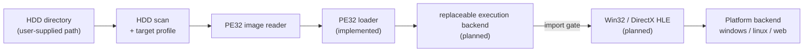

# re2DJ


re2DJ는 에뮬레이터나 가상 머신을 동원하지 않고, EZ2DJ의 원본 32비트 x86 실행 파일을 Linux, 64비트 Windows, Web에서 실행하기 위한 실험적 런타임입니다. 게임 로직은 원본 코드에 그대로 남겨 두고, 그 주변의 Win32 API·DirectX·하드웨어 경계만 High Level Emulation(HLE)으로 제공합니다.

현재 버전은 [VERSION](VERSION)에서 확인할 수 있습니다.

*re2DJ is an experimental runtime for executing the original 32-bit x86 EZ2DJ executable on Linux, 64-bit Windows, and the Web without an emulator or a virtual machine. Original game logic stays authoritative; only the surrounding Win32 API, DirectX, and hardware boundaries are replaced with High Level Emulation (HLE). See [VERSION](VERSION) for the current version.*

> [!WARNING]
> 현재는 초기 연구·개발 단계입니다. 지금 저장소가 하는 일은 **원본 HDD 디렉터리를 읽어 실행 대상 바이너리를 식별하고 PE 헤더를 분석하는 것까지**이며, 로더·실행 backend·HLE 계층은 아직 설계 단계입니다. 게임은 실행되지 않습니다.
>
> *This is early research-stage software. What the repository does today is **read a user-supplied HDD directory, identify which binary is the game, and analyze its PE headers**. The loader, execution backend, and HLE layer are still design-only, so nothing runs yet.*

> [!IMPORTANT]
> 이 저장소는 원본 게임 바이너리나 데이터를 포함하지 않으며 배포하지도 않습니다. 합법적으로 보유한 자산에 대해서만 사용하십시오.
>
> *This repository neither contains nor distributes original game binaries or data. Use it only with assets you legally own.*

---

## 주요 특징 / Why re2DJ

* **원본 로직 보존:** 게임플레이를 C++로 재작성하지 않고 원본 x86 코드를 주 실행 경로로 유지합니다.
* **선별적 HLE:** 경계는 Win32 import thunk입니다. 게임이 실제로 호출하는 API만 좁은 범위로 구현합니다.
* **처음부터 멀티플랫폼:** 공용 코어는 호스트 OS 헤더를 포함하지 않으며, Windows/Linux/Web 세부 구현은 플랫폼 계층에 분리합니다.
* **HDD 디렉터리 입력:** 원본 자산은 디스크 이미지가 아니라 사용자가 지정한 디렉터리 경로로 받습니다. 저장소는 그 내용을 절대 포함하지 않습니다.
* **원본 무변경 보장:** 게스트의 파일 쓰기는 overlay 디렉터리로 향하므로 원본 덤프는 그대로 유지됩니다.
* **재현 가능한 진척 기록:** 설계, 작업 지시, 분석과 기술 지식을 저장소 문서로 누적합니다.

*The project preserves original x86 game logic, applies narrowly scoped HLE at the Win32 import boundary, keeps the shared core free of host OS headers, takes original assets as a directory path rather than a disk image, routes guest writes to an overlay so the dump stays untouched, and keeps reproducible design and analysis records.*

---

## 동작 방식 / How it works



x86-64 Windows에서는 Win32 `re2dj --run`이 원본 `ez2dj.exe`를 Windows main image로 시작하고 injected runtime의 선택적 HLE 경계를 연결합니다. Linux에서는 x86-64 제품 CLI가 별도 i386 helper를 통해 원본 PE32 entry의 첫 import·exit·fault 경계까지 실행합니다. Linux는 아직 Win32 import를 처리하지 않으므로 게임 창까지 진행되지는 않습니다. WebAssembly에는 별도 x86 실행 엔진이 필요합니다. 자세한 내용은 [ARCHITECTURE.md](ARCHITECTURE.md)를 참고하십시오.

*On x86-64 Windows, Win32 `re2dj --run` starts the original `ez2dj.exe` as the Windows main image and connects selected HLE boundaries through the injected runtime. On Linux, the x86-64 product CLI uses a separate i386 helper to execute the original PE32 entry up to its first import, exit, or fault boundary; it does not reach a game window yet because Win32 imports are not handled. WebAssembly needs a separate x86 execution engine. See [ARCHITECTURE.md](ARCHITECTURE.md) for details.*

---

## 요구 사항 / Prerequisites

| 호스트 | 필요한 것 |
| --- | --- |
| 64-bit Windows | Visual Studio 2019 이상 또는 Build Tools의 **Desktop development with C++**, CMake 3.20 이상 |
| Linux x86-64 | GCC 11 이상 또는 Clang 14 이상, CMake 3.20 이상, Ninja, SDL3용 X11/Wayland/OpenGL 개발 패키지 |
| Web | Emscripten SDK (`EMSDK` 환경 변수 설정), CMake 3.20 이상, Ninja |

SDL3와 SDL_mixer는 CMake가 고정된 zlib 라이선스 버전에서 가져옵니다. 원본 자산 없이도 빌드되고 단위 테스트가 통과합니다.
Ubuntu/WSL의 정확한 패키지 설치 명령은 [Linux SDL3/OpenGL 빌드 가이드](docs/guides/linux-sdl3-build.md)를 참고하세요.

*CMake fetches SDL3 and SDL_mixer from pinned zlib-licensed revisions. The repository builds and passes its unit tests without any original assets. See the [Linux SDL3/OpenGL build guide](docs/guides/linux-sdl3-build.md) for the exact Ubuntu/WSL package command.*

---

## 시작하기 / Getting started

### 1. 저장소 복제 / Clone

```bash
git clone https://github.com/nworkers/re2DJ.git
cd re2DJ
```

### 2. 빌드 / Build

```bash
# 64-bit Windows host (Win32 runtime under WOW64)
cmake --preset windows-x86-debug
cmake --build --preset windows-x86-debug
ctest --preset windows-x86-debug

# Linux x86-64
cmake --preset linux-x64-debug
cmake --build --preset linux-x64-debug
ctest --preset linux-x64-debug

# Windows x86 native-helper feasibility probe under WOW64
cmake --preset windows-x86-native-probe -DRE2DJ_WARNINGS_AS_ERRORS=ON
cmake --build --preset windows-x86-native-probe
ctest --preset windows-x86-native-probe

```

빌드 산출물은 `build/<preset>/bin/`에 생성됩니다.

*Build output lands in `build/<preset>/bin/`.*

### 3. 원본 자산 준비 / Supply original assets

원본 HDD 내용은 **디렉터리 경로**로 입력받습니다. 디스크 이미지를 직접 마운트하지 않으므로, 이미지를 먼저 풀어 놓은 디렉터리를 그대로 가리키면 됩니다. 경로는 저장소 밖이어도 되고, 어디에 두든 상관없습니다.

*Original HDD contents arrive as a **directory path**. Disk images are not mounted directly, so extract the image first and point at the resulting directory. It may live anywhere, including outside the repository.*

EZ2DJ 1st Trax Special Edition 덤프의 실제 구성은 다음과 같습니다.

*A real EZ2DJ 1st Trax Special Edition dump looks like this.*

```text
/path/to/ez2dj_hdd/
├── ez2dj.exe          게임 (보호됨) / the game, protected
├── ez2dj1.exe         같은 게임 (보호되지 않음) / same game, unprotected
├── Test.exe           서비스 도구 / service tool
├── ez2dj.ini          난이도·모드·곡 목록 / difficulty, modes, song lists
├── Songs/             68개 곡 디렉터리 / 68 song directories
└── System/            화면별 자산 / per-screen assets
```

> [!NOTE]
> 이 디렉터리는 읽기 전용으로 취급됩니다. 게스트가 파일을 쓰기 시작하면 원본이 아니라 별도 overlay 디렉터리에 기록됩니다.
>
> *The directory is treated as read-only. Once the guest starts writing files, they go to a separate overlay directory rather than to the original.*

### 4. 덤프 확인 / Inspect the dump

```bash
build/linux-x64-debug/bin/re2dj_hdd_probe /path/to/ez2dj_hdd
```

디렉터리를 훑어 모든 `.exe`의 PE 헤더를 읽고, 어떤 파일이 게스트 형식(32비트 x86 PE32)인지 보고합니다.

*It walks the directory, reads the PE headers of every `.exe`, and reports which files are in the guest format — 32-bit x86 PE32.*

### 5. 타깃 확인 / Check the target

```bash
build/linux-x64-debug/bin/re2dj --hdd /path/to/ez2dj_hdd
```

스캔 결과에서 실행 대상을 고르고 그 요약을 출력합니다. `--target <id>`로 다른 후보를 고르고, `--list-targets`로 후보만 나열할 수 있습니다.

*It selects a launch target from the scan and prints a summary. Use `--target <id>` to choose a different candidate and `--list-targets` to list candidates only.*

확인된 덤프는 내장 프로파일이 자동으로 잡습니다. 현재 내장된 것은 EZ2DJ 1st Trax Special Edition과 3rd Trax이며, 그 밖의 덤프도 스캔으로 감지됩니다.

*A recognised dump is matched by a built-in profile. EZ2DJ 1st Trax Special Edition and 3rd Trax are built in today; anything else is still found by scanning.*

```text
targets:
  * ez2dj1stse             ez2dj.exe                built-in
    ez2dj1stse_unpacked    ez2dj1.exe               built-in, bring-up only
    test                   Test.exe                 detected
    plzpoweroff            PlzPowerOff.exe          detected
```

`bring-up only`는 캐비닛이 실행한 것이 아니라 보호되지 않아 로더 개발에 쓰는 빌드라는 뜻입니다. 그것으로 관찰한 동작을 원본 동작으로 인용하면 안 됩니다.

*`bring-up only` marks a build the cabinet never ran — it is unprotected and therefore useful for loader development, so behavior observed through it is not original behavior.*

### 6. 경로 해석 확인 / Check path resolution

```bash
build/linux-x64-debug/bin/re2dj --hdd /path/to/ez2dj_hdd --resolve "C:\EZ2DJ\data\song01.ez"
```

원본은 Windows에서 동작했으므로 게임 코드가 실제 파일명과 다른 대소문자로 파일을 엽니다. 이 옵션은 게스트 경로 하나를 실제 호스트 경로로 해석해 보여 줍니다. 결과는 요청한 철자가 아니라 **디스크에 있는 철자**로 나오므로 호스트가 달라도 같은 값이 나옵니다.

*The original ran on Windows, so game code opens files with a case that need not match the real name. This option resolves one guest path to its real host path. The result carries the **on-disk** spelling rather than the requested one, so it is identical across hosts.*

### 7. 실행 파일 분석 / Analyze the executable

```bash
build/linux-x64-debug/bin/re2dj_pe_analyzer /path/to/ez2dj_hdd/EZ2DJ/Ez2dj.exe
build/linux-x64-debug/bin/re2dj_pe_analyzer --hdd /path/to/ez2dj_hdd "EZ2DJ/Ez2dj.exe"
```

PE 헤더, 섹션 테이블, data directory를 출력합니다. 이미지를 적재하지 않으므로 실행 위험이 없습니다.

*It prints the PE headers, section table, and data directories. The image is never loaded, so nothing is executed.*

### 8. 이미지 적재 확인 / Verify image loading

```bash
build/linux-x64-debug/bin/re2dj_pe_loader --hdd /path/to/ez2dj_hdd "EZ2DJ/ez2dj1.exe"
```

PE32 이미지를 게스트 주소 공간에 적재하고 진입점, TLS directory, import별 합성 gate 주소를 보고합니다. 원본 코드는 실행하지 않습니다. 마지막 인자로 `0x10000000` 같은 load base를 주면 재배치 가능 여부와 재배치 경로를 확인할 수 있습니다.

*It maps the PE32 image into guest memory and reports the entry point, TLS directory, and synthetic gate address for every import. Original code is not executed. An optional final load base such as `0x10000000` exercises relocation or reports that the image cannot be rebased.*

---

## 명령행 / Command line

```text
re2dj --hdd <directory> [options]

  --hdd <directory>   추출한 원본 HDD 내용. 필수.
  --target <id>       사용할 타깃 프로파일. 기본값은 첫 번째 후보.
  --list-targets      후보 타깃 프로파일을 나열하고 종료.
  --resolve <path>    게스트 경로 하나를 해석하고 종료.
  --run               게스트 실행. Windows 제품 경로는 ez2dj1stse 지원.
  --linux-helper      Linux --run에서 사용하는 i386 helper 경로.
  --audio-gain-db     Windows 출력 보정(-24..+18 dB, 기본값 +6).
  --version           버전 출력.
  --help              도움말 출력.
```

Windows 제품 실행 예:

```powershell
.\build\windows-x86\bin\Debug\re2dj.exe --hdd D:\EZ2DJ\1stSE --target ez2dj1stse --run
```

기본 `+6 dB`보다 더 큰 출력이 필요하면 `--audio-gain-db 12`를 추가한다. 왜곡이나 clipping이 들리면 `6`, `3`, `0` 순서로 낮춘다. 이 값은 DirectSound buffer별 상대 음량을 바꾸지 않고 최종 SDL mix에만 적용된다.

*Add `--audio-gain-db 12` when more output than the default `+6 dB` is required. Reduce it to `6`, `3`, or `0` if distortion or clipping is audible. The value affects only the final SDL mix and preserves relative DirectSound buffer levels.*

종료 코드: `0` 성공, `1` 잘못된 사용, `2` HDD 디렉터리 오류, `3` 지원되지 않는 실행 경로.

*Exit codes: `0` success, `1` usage error, `2` HDD directory error, and `3` unsupported execution path.*

---

## 프로젝트 구조 / Repository layout

| 경로 | 내용 |
| --- | --- |
| `include/re2dj/`, `src/` | C++20 공용 코어: HDD 입력, 게스트 경로, PE 판독, 타깃 프로파일 |
| `src/platform/{windows,linux,web}/` | 플랫폼별 backend (예정) |
| `src/host/cli/` | 명령행 진입점 |
| `src/tools/` | 비실행 분석 도구 |
| `tests/unit/` | 단위 테스트 |
| `docs/analysis/` | 원본 바이너리와 HDD 자산에서 확인한 분석 |
| `docs/kb/` | PE, Win32, x86 배경 지식 |
| `docs/design/`, `docs/work-orders/`, `docs/work-logs/` | 설계와 작업 이력 |

자세한 구성은 [ARCHITECTURE.md](ARCHITECTURE.md)를 참고하십시오.

---

## 문서와 지원 / Documentation and support

* [프로젝트 헌장](docs/PROJECT_CHARTER.md) — 목표와 비목표
* [아키텍처](ARCHITECTURE.md) — 현재 subsystem과 실행 구조
* [포팅 계획](docs/WIN32_HLE_PORTING_PLAN.md) — 장기 구현 단계
* [바이너리 분석 색인](docs/analysis/README.md) — 확인된 사실과 미확정 질문
* [EZ2DJ import 표면](docs/analysis/ez2dj-import-surface.md) — 원본이 실제로 호출하는 API 144개
* [기술 지식 기반](docs/kb/README.md) — PE, Win32, DirectX, x86 배경
* [코딩 스타일](docs/CODING_STYLE.md) — C++20 스타일과 디렉터리 정책
* [작업 규칙](AGENTS.md) — 설계 우선 개발, 문서화와 Git workflow

질문과 재현 가능한 결함 보고는 [GitHub Issues](https://github.com/nworkers/re2DJ/issues)에 남겨 주십시오.

---

## 기여 / Contributing

1. 기존 issue와 [현재 분석 상태](docs/analysis/README.md)를 확인합니다.
2. 동작 변경 전에 `docs/design/`에 설계를, `docs/work-orders/`에 구현 계획을 작성합니다.
3. 원본 실행 코드를 주 경로로 유지하고 게임 로직 재구현을 피합니다.
4. 코드 변경에는 범위에 맞는 테스트와 `docs/work-logs/` 작업 로그를 포함합니다.
5. [코딩 스타일](docs/CODING_STYLE.md)과 [AGENTS.md](AGENTS.md)의 전체 규칙을 확인한 뒤 pull request를 제출합니다.

*Review existing issues and the analysis index, document design and work order before behavioral changes, preserve original executable logic, include appropriate tests and a work log, and follow the coding and repository rules before opening a pull request.*

---

## 관련 프로젝트 / Related project

[rePIU](https://github.com/nworkers/rePIU)는 같은 접근을 DOS/4G 기반 Pump It Up 실행 파일에 적용한 프로젝트입니다. re2DJ는 rePIU의 작업 규칙, 문서 구조, 코딩 스타일을 그대로 이어받되, 게스트 형식(Win32 PE32)과 호스트 범위(멀티플랫폼)가 달라 실행 구조는 다르게 설계했습니다. 차이는 [ARCHITECTURE.md](ARCHITECTURE.md) 9절에 정리했습니다.

*[rePIU](https://github.com/nworkers/rePIU) applies the same approach to DOS/4G-based Pump It Up binaries. re2DJ inherits its workflow rules, documentation structure, and coding style, but its guest format (Win32 PE32) and host scope (multiplatform) lead to a different execution design. Section 9 of [ARCHITECTURE.md](ARCHITECTURE.md) lists the differences.*

---

## 라이선스 / License

프로젝트 코드는 [BSD 3-Clause License](LICENSE)를 따릅니다. 서드파티 의존성은 [THIRD_PARTY_NOTICES.md](THIRD_PARTY_NOTICES.md)에 기록합니다.

원본 EZ2DJ 실행 파일과 자산은 re2DJ에 포함되지 않으며 각 권리자의 조건을 따릅니다.

*Project code is under the [BSD 3-Clause License](LICENSE). Original EZ2DJ binaries and assets are not part of re2DJ and remain subject to their owners' terms.*
