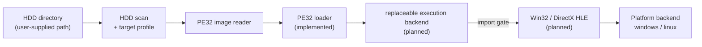

# re2DJ


re2DJ는 에뮬레이터나 가상 머신을 동원하지 않고, EZ2DJ의 원본 32비트 x86 실행 파일을 Linux와 64비트 Windows에서 실행하기 위한 실험적 런타임입니다. 게임 로직은 원본 코드에 그대로 남겨 두고, 그 주변의 Win32 API·DirectX·하드웨어 경계만 High Level Emulation(HLE)으로 제공합니다.

현재 버전은 [VERSION](VERSION)에서 확인할 수 있습니다.

*re2DJ is an experimental runtime for executing the original 32-bit x86 EZ2DJ executable on Linux and 64-bit Windows without an emulator or a virtual machine. Original game logic stays authoritative; only the surrounding Win32 API, DirectX, and hardware boundaries are replaced with High Level Emulation (HLE). See [VERSION](VERSION) for the current version.*

> [!WARNING]
> 현재는 초기 연구·개발 단계입니다. 지금 저장소가 하는 일은 **원본 HDD 디렉터리를 읽어 실행 대상 바이너리를 식별하고 PE 헤더를 분석하는 것까지**이며, 로더·실행 backend·HLE 계층은 아직 설계 단계입니다. 게임은 실행되지 않습니다.
>
> *This is early research-stage software. What the repository does today is **read a user-supplied HDD directory, identify which binary is the game, and analyze its PE headers**. The loader, execution backend, and HLE layer are still design-only, so nothing runs yet.*

> [!IMPORTANT]
> 이 저장소는 원본 게임 바이너리나 데이터를 포함하지 않으며 배포하지도 않습니다. 합법적으로 보유한 자산에 대해서만 사용하십시오.
>
> *This repository neither contains nor distributes original game binaries or data. Use it only with assets you legally own.*

---

## 주요 특징 / Why re2DJ

* **원본 로직 보존:** 게임플레이를 C++로 재작성하지 않고 원본 x86 코드를 주 실행 경로로 유지합니다.
* **선별적 HLE:** 경계는 Win32 import thunk입니다. 게임이 실제로 호출하는 API만 좁은 범위로 구현합니다.
* **처음부터 멀티플랫폼:** 공용 코어는 호스트 OS 헤더를 포함하지 않으며, Windows/Linux 세부 구현은 플랫폼 계층에 분리합니다.
* **HDD·CHD 입력 경계:** 추출 HDD는 사용자가 지정한 디렉터리로 받고, MAME CHD는 `libchdr` 기반 FAT32 read-only 계층으로 읽습니다. 원본 자산은 저장소에 포함하지 않습니다.
* **원본 무변경 보장:** 게스트의 파일 쓰기는 overlay 디렉터리로 향하므로 원본 덤프는 그대로 유지됩니다.
* **재현 가능한 진척 기록:** 설계, 작업 지시, 분석과 기술 지식을 저장소 문서로 누적합니다.

*The project preserves original x86 game logic, applies narrowly scoped HLE at the Win32 import boundary, keeps the shared core free of host OS headers, accepts extracted HDD contents as a directory and reads MAME CHDs through a libchdr-backed read-only FAT32 layer, routes guest writes to an overlay so the dump stays untouched, and keeps reproducible design and analysis records.*

---

## 동작 방식 / How it works


```mermaid
flowchart LR
    HDD["HDD directory<br/>(user-supplied path)"] --> SCAN["HDD scan<br/>+ target profile"]
    SCAN --> PE["PE32 image reader"]
    PE --> LOAD["PE32 loader<br/>(implemented)"]
    LOAD --> EXEC["replaceable execution backend<br/>(planned)"]
    EXEC -->|import gate| HLE["Win32 / DirectX HLE<br/>(planned)"]
    HLE --> PLAT["Platform backend<br/>windows / linux"]
```

x86-64 Windows에서는 Win32 `re2dj --run`이 선택된 프로파일의 원본 PE32를 Windows main image로 시작하고 injected runtime의 프로파일별 HLE 경계를 연결합니다. 예를 들어 `re2dj ez2dj3rd`는 `roms/ez2dj3rd/ez2dj/EZ2DJ.EXE`를 선택합니다. Linux에서는 x86·x86-64 제품 CLI의 `re2dj --run`이 별도 helper 없이 같은 프로세스 안에서 원본 PE32를 실행합니다. x86-64는 CPU compatibility mode를 씁니다. 실행은 `kernel32`·`user32`·`gdi32`·DirectX facade와 게스트 SEH를 거칩니다. 4th, 1st SE, 5th, EZ2Dancer 2nd MOVE CHD는 창을 닫을 때까지 실행됩니다. 다른 타깃은 아직 모형이 없는 첫 import·lookup·fault에서 멈출 수 있습니다. 자세한 내용은 [ARCHITECTURE.md](ARCHITECTURE.md)를 참고하십시오.

*On x86-64 Windows, Win32 `re2dj --run` starts the selected profile's original PE32 as the Windows main image and connects profile-specific HLE boundaries through the injected runtime. For example, `re2dj ez2dj3rd` selects `roms/ez2dj3rd/ez2dj/EZ2DJ.EXE`. On Linux, `re2dj --run` in the x86 and x86-64 product CLIs executes the original PE32 in the same process without a separate helper (x86-64 uses CPU compatibility mode), through the `kernel32`, `user32`, `gdi32`, and DirectX facades and guest SEH. the 4th, 1st SE, 5th, and EZ2Dancer 2nd MOVE CHDs run until their window is closed; other targets may still stop at the first import, lookup, or fault not yet modelled. See [ARCHITECTURE.md](ARCHITECTURE.md) for details.*

---

## 요구 사항 / Prerequisites

| 호스트 | 필요한 것 |
| --- | --- |
| 64-bit Windows | Visual Studio 2019 이상 또는 Build Tools의 **Desktop development with C++**, CMake 3.20 이상 |
| Linux x86 / x86-64 | GCC 11 이상 또는 Clang 14 이상, CMake 3.20 이상, Ninja, 해당 폭의 SDL3용 X11/Wayland/OpenGL 개발 패키지. x86은 `g++-multilib libc6-dev-i386` 추가 |

SDL3와 SDL_mixer는 CMake가 고정된 zlib 라이선스 버전에서 가져옵니다. 원본 자산 없이도 빌드되고 단위 테스트가 통과합니다.
Ubuntu/WSL의 정확한 패키지 설치 명령은 [Linux SDL3/OpenGL 빌드 가이드](docs/guides/linux-sdl3-build.md)를 참고하세요.

*CMake fetches SDL3 and SDL_mixer from pinned zlib-licensed revisions. The repository builds and passes its unit tests without any original assets. See the [Linux SDL3/OpenGL build guide](docs/guides/linux-sdl3-build.md) for the exact Ubuntu/WSL package command.*

---

## 시작하기 / Getting started

### 1. 저장소 복제 / Clone

```bash
git clone https://github.com/nworkers/re2DJ.git
cd re2DJ
```

### 2. 빌드 / Build

```bash
# 64-bit Windows host (Win32 runtime under WOW64)
cmake --preset windows-x86-debug
cmake --build --preset windows-x86-debug
ctest --preset windows-x86-debug

# Linux x86-64
cmake --preset linux-x64-debug
cmake --build --preset linux-x64-debug
ctest --preset linux-x64-debug

# Linux x86
cmake --preset linux-x86-debug
cmake --build --preset linux-x86-debug
ctest --preset linux-x86-debug

```

빌드 산출물은 `build/<preset>/bin/`에 생성됩니다.

*Build output lands in `build/<preset>/bin/`.*

### 3. 원본 자산 준비 / Supply original assets

원본 HDD 내용은 **디렉터리 경로**로 입력받습니다. 디스크 이미지를 직접 마운트하지 않으므로, 이미지를 먼저 풀어 놓은 디렉터리를 그대로 가리키면 됩니다. 경로는 저장소 밖이어도 되고, 어디에 두든 상관없습니다.

*Original HDD contents arrive as a **directory path**. Disk images are not mounted directly, so extract the image first and point at the resulting directory. It may live anywhere, including outside the repository.*

EZ2DJ The 1st Tracks Special Edition 덤프의 실제 구성은 다음과 같습니다.

*A real EZ2DJ The 1st Tracks Special Edition dump looks like this.*

```text
/path/to/ez2dj_hdd/
├── Test.exe           서비스 도구 / service tool
├── ez2dj.ini          난이도·모드·곡 목록 / difficulty, modes, song lists
├── Songs/             68개 곡 디렉터리 / 68 song directories
└── System/            화면별 자산 / per-screen assets
```

> [!NOTE]
> 이 디렉터리는 읽기 전용으로 취급됩니다. 게스트가 파일을 쓰기 시작하면 원본이 아니라 별도 overlay 디렉터리에 기록됩니다.
>
> *The directory is treated as read-only. Once the guest starts writing files, they go to a separate overlay directory rather than to the original.*

### 4. 덤프 확인 / Inspect the dump

```bash
build/linux-x64-debug/bin/re2dj_hdd_probe /path/to/ez2dj_hdd
```

디렉터리를 훑어 모든 `.exe`의 PE 헤더를 읽고, 어떤 파일이 게스트 형식(32비트 x86 PE32)인지 보고합니다.

*It walks the directory, reads the PE headers of every `.exe`, and reports which files are in the guest format — 32-bit x86 PE32.*

### 5. 타깃 확인 / Check the target

```bash
build/linux-x64-debug/bin/re2dj --hdd /path/to/ez2dj_hdd
```

스캔 결과에서 실행 대상을 고르고 그 요약을 출력합니다. `--target <id>`로 다른 후보를 고르고, `--list-targets`로 후보만 나열할 수 있습니다.

*It selects a launch target from the scan and prints a summary. Use `--target <id>` to choose a different candidate and `--list-targets` to list candidates only.*

확인된 덤프는 내장 프로파일이 자동으로 잡습니다. 현재 내장된 디렉터리 프로파일은 EZ2DJ The 1st Tracks와 2nd Trax이고, CHD shortcut은 1st Trax Special Edition, 3rd Trax, 4th, 5th, 6th, 그리고 EZ2DJ가 아닌 EZ2Dancer 2nd MOVE(`ez2d2m`)입니다. 그 밖의 덤프도 스캔으로 감지됩니다.

*A recognised dump is matched by a built-in profile. EZ2DJ The 1st Tracks and 2nd Trax are built in as directory profiles; the 1st Tracks Special Edition, 3rd Trax, 4th, 5th and 6th are built in as CHD shortcuts, along with EZ2Dancer 2nd MOVE (`ez2d2m`), which is a different product rather than an EZ2DJ release. Anything else is still found by scanning.*

```text
targets:
  * ez2dj2nd               ez2dj/EZ2DJ.exe          built-in
```

1st SE는 CHD shortcut이므로 추출 디렉터리 스캔에서는 built-in으로 잡히지 않고 detected 항목으로만 나열됩니다.

*The 1st SE profile is a CHD shortcut, so an extracted-directory scan lists its executables as detected entries rather than claiming the built-in profile.*

```text
targets:
  * ez2dj                  ez2dj.exe                detected
    test                   Test.exe                 detected
    plzpoweroff            PlzPowerOff.exe          detected
```

### 6. 경로 해석 확인 / Check path resolution

```bash
build/linux-x64-debug/bin/re2dj --hdd /path/to/ez2dj_hdd --resolve "C:\EZ2DJ\data\song01.ez"
```

원본은 Windows에서 동작했으므로 게임 코드가 실제 파일명과 다른 대소문자로 파일을 엽니다. 이 옵션은 게스트 경로 하나를 실제 호스트 경로로 해석해 보여 줍니다. 결과는 요청한 철자가 아니라 **디스크에 있는 철자**로 나오므로 호스트가 달라도 같은 값이 나옵니다.

*The original ran on Windows, so game code opens files with a case that need not match the real name. This option resolves one guest path to its real host path. The result carries the **on-disk** spelling rather than the requested one, so it is identical across hosts.*

### 7. 실행 파일 분석 / Analyze the executable

```bash
build/linux-x64-debug/bin/re2dj_pe_analyzer /path/to/ez2dj_hdd/EZ2DJ/Ez2dj.exe
build/linux-x64-debug/bin/re2dj_pe_analyzer --hdd /path/to/ez2dj_hdd "EZ2DJ/Ez2dj.exe"
```

PE 헤더, 섹션 테이블, data directory를 출력합니다. 이미지를 적재하지 않으므로 실행 위험이 없습니다.

*It prints the PE headers, section table, and data directories. The image is never loaded, so nothing is executed.*

### 8. 이미지 적재 확인 / Verify image loading

```bash
build/linux-x64-debug/bin/re2dj_pe_loader --hdd /path/to/ez2dj_hdd "EZ2DJ/Ez2dj.exe"
```

PE32 이미지를 게스트 주소 공간에 적재하고 진입점, TLS directory, import별 합성 gate 주소를 보고합니다. 원본 코드는 실행하지 않습니다. 마지막 인자로 `0x10000000` 같은 load base를 주면 재배치 가능 여부와 재배치 경로를 확인할 수 있습니다.

*It maps the PE32 image into guest memory and reports the entry point, TLS directory, and synthetic gate address for every import. Original code is not executed. An optional final load base such as `0x10000000` exercises relocation or reports that the image cannot be rebased.*

### 9. legacy I/O helper 위치 확인 / Locate the legacy port-I/O helpers

```bash
build/windows-x86/bin/Debug/re2dj_port_helper_scan /path/to/ez2dj_hdd/ez2dj.exe
build/windows-x86/bin/Debug/re2dj_port_helper_scan dump.image.bin 0x00400000
```

게스트가 트랩되지 않은 `in`/`out`으로 privileged fault를 낼 때 런타임이 쓰는 helper 주소를 시그니처로 찾습니다. 입력은 `.text`가 평문인 디스크 파일이거나 `--image-dump`가 만든 복호화 덤프이며, 둘 다 파일 오프셋이 곧 RVA입니다. 두 번째 인자로 image base를 주면 RVA 대신 VA를 출력합니다. 탐색은 구문적이므로 결과는 후보이며, 아무것도 찾지 못하는 것은 보호 빌드를 디스크에서 읽었을 때의 정상 결과입니다.

*It finds, by signature, the helper addresses the runtime uses when the guest raises a privileged fault on an untrapped `in`/`out`. The input is either a disk file whose `.text` is plaintext or a decrypted dump from `--image-dump`; a file offset is the RVA in both. A second argument supplies an image base to print VAs instead of RVAs. The search is syntactic, so each hit is a candidate, and finding nothing is the correct result for a protected build read off disk.*

---

## 명령행 / Command line

```text
re2dj <profile-id> [options]
re2dj --hdd <directory> [options]

  --hdd <directory>   추출한 원본 HDD 내용. 프로파일 shortcut 경로보다 우선.
                      CHD 프로파일에서는 .chd 하나가 있는 디렉터리도 허용.
  --target <id>       사용할 타깃 프로파일. 기본값은 첫 번째 후보.
  --list-targets      후보 타깃 프로파일을 나열하고 종료.
  --resolve <path>    게스트 경로 하나를 해석하고 종료.
  --run               게스트 실행. positional 프로파일은 자동으로 --run을 선택.
  --hold-window       Linux: 실행이 멈춘 뒤에도 게임 창을 닫을 때까지 유지.
  --audio-gain-db     Windows 출력 보정(-24..+18 dB, 기본값 0).
  --demo-volume       Windows title/demo 프로필(0..3, 기본값 3=0 dB).
  --audio-volume-trace
                      DirectSound/WINMM 음량 증거를 별도 로그에 기록.
  --fullscreen        Windows에서 monitor 크기 borderless fullscreen 사용.
  --windowed          프로파일의 fullscreen 기본값을 끄기.
  --vsync <on|off|adaptive>
                      present가 언제 반환할지 고릅니다. on은 디스플레이 refresh를
                      기다리고(기본값), off는 기다리지 않아 tearing을 허용하며,
                      adaptive는 마감을 지킨 프레임만 기다립니다. 드라이버가
                      adaptive를 거부하면 on으로 내려갑니다.
  --io-config <path>  선택한 타깃용 Windows 키보드 I/O mapping INI. 적힌 항목만
                      내장 기본 매핑을 덮어씁니다.
  --version           버전 출력.
  --help              도움말 출력.
```

CHD 자체의 header, metadata와 논리 sector를 확인하려면 다음 비실행 도구를 사용합니다.

```bash
re2dj_chd_probe /path/to/ez2dj4th.chd
```

*Use the following tool to inspect a CHD's header, metadata, logical sectors, FAT32 layout, and the 4th PE32 header. On Windows x86 the same FAT32 boundary is used by `re2dj ez2dj4th --run`.*

```bash
re2dj_chd_probe /path/to/ez2dj4th.chd
```

같은 도구로 이미지 안의 디렉터리를 나열하거나, 파일 하나를 꺼내거나, 하위 트리 전체를 호스트로 펼칠 수 있습니다. 추출은 자산 배치를 사람이 보기 위한 진단 경로이며 실행 입력이 아닙니다. 런타임은 계속 CHD를 직접 읽습니다. 빈 내부 경로는 볼륨 루트를 뜻하고, 읽지 못한 항목이 있으면 경로를 경고로 남긴 뒤 계속 진행하며 0이 아닌 종료 코드로 알립니다.

*The same tool lists a directory inside the image, dumps a single file, or lays a whole subtree onto the host. Extraction is a diagnostic path for reading an asset layout by hand, not an execution input — the runtime keeps reading the CHD directly. An empty inner path means the volume root; entries that cannot be read are reported as warnings, the walk continues, and the exit code is non-zero.*

```bash
re2dj_chd_probe /path/to/ez2d2m.chd --list ez2dancer
re2dj_chd_probe /path/to/ez2d2m.chd --dump ez2dancer/EZ2Dancer.exe ./EZ2Dancer.exe
re2dj_chd_probe /path/to/ez2d2m.chd --extract "" roms/ez2d2m/extracted
```

Windows 제품 실행 예:

```powershell
.\build\windows-x86\bin\Debug\re2dj.exe ez2dj1stse
.\build\windows-x86\bin\Debug\re2dj.exe ez2dj1stse --hdd D:\EZ2DJ\1stSE --list-targets
.\build\windows-x86\bin\Debug\re2dj.exe ez2dj3rd
.\build\windows-x86\bin\Debug\re2dj.exe ez2dj3rd --hdd D:\EZ2DJ\3rd --audio-gain-db 3
.\build\windows-x86\bin\Debug\re2dj.exe ez2dj4th --run
```

`ez2dj3rd` shortcut은 저장소 root 기준 `roms/ez2dj3rd`를 HDD 기본 경로로 사용하고, 첫 번째 positional profile ID만으로 실행을 선택한다. `--hdd`가 있으면 shortcut 경로를 덮어쓰며, 프로파일이 지원하는 오디오·fullscreen·I/O 관련 명령행 값은 프로파일 기본값보다 우선한다. 3rd의 `EZ2DJ.INI`에는 `FullScreen=1`이 있지만, 이 빌드는 `DirectDrawCreateEx`를 import하므로 현재 3rd 기본값은 확인된 VFS·DirectSound hook만 활성화한다.

*The `ez2dj3rd` shortcut uses `roms/ez2dj3rd` relative to the repository root and selects execution from the first positional profile ID. `--hdd` overrides that convenience path, and supported command-line audio, fullscreen, and I/O values take precedence over profile defaults. The 3rd `EZ2DJ.INI` contains `FullScreen=1`, but this build imports `DirectDrawCreateEx`, so the current 3rd baseline enables only the confirmed VFS and DirectSound hooks.*

`ez2dj1stse` shortcut도 같은 형태로 `roms/ez2dj1stse` 아래의 CHD를 사용하며, `--hdd`로 다른 CHD 디렉터리를 지정할 수 있다. 이 CHD의 실행 파일은 기존 추출 덤프의 `.gtide` 빌드가 아니라 `.protect` 빌드다. 프로파일 기본값은 이 빌드에서 관측한 경계를 따라 `\\.\FEnteDev` 장치와 dynamic VFS를 쓰고, packed import directory에 없는 Windows directory·DirectDraw·demo volume 경계는 끈다. 로컬 Hardlock 자료(`cfg/hardlock.ini`의 `[ez2dj1stse]` section과 `cfg/hardlock-ez2dj1stse.map`)가 없으면 Hardlock initialize 요청에서 멈춘다. 자료가 있으면 transform loop를 통과해 복호화된 게임 코드가 `System\CompanyLogo` 자산까지 읽는다. 관측 내용은 [ez2dj1stse CHD 파일시스템 분석](docs/analysis/ez2dj1stse-chd-filesystem.md)에 있다. 그 자료는 저장소에 포함하지 않으며 사용자가 직접 확보한다.

*The `ez2dj1stse` shortcut works the same way against the CHD under `roms/ez2dj1stse`, and `--hdd` can point at a different CHD directory. Its executable is the `.protect` build rather than the extracted dump's `.gtide` build. The profile defaults follow the boundary observed on that build: it uses the `\\.\FEnteDev` device and the dynamic VFS, and disables the Windows-directory, DirectDraw, and demo-volume boundaries whose imports are missing from the packed import directory. Without local Hardlock material — the `[ez2dj1stse]` section of `cfg/hardlock.ini` plus `cfg/hardlock-ez2dj1stse.map` — a run stops at the Hardlock initialize request; with it, the run passes the transform loop and decrypted game code reads as far as the `System\CompanyLogo` assets. The observations are recorded in the [ez2dj1stse CHD filesystem analysis](docs/analysis/ez2dj1stse-chd-filesystem.md). That material is not part of the repository; users supply it themselves.*

The `ez2dj4th` target uses a MAME CHD HDD shortcut at `roms/ez2dj4th`.
`re2dj_chd_probe <path-to-chd>` now reads the real CHD through libchdr, validates
its FAT32 layout, and reports the `EZ2DJ/EZ2DJ.EXE` PE32 header. On Windows x86,
`re2dj ez2dj4th --run` stages the executable and profile siblings into a
temporary directory while the injected runtime serves guest `D:\ez2dj` reads
directly from the CHD; writes remain in the overlay. The first protected 4th
HLE/Hardlock boundary remains a runtime observation item.

*The `ez2dj4th` target uses the `roms/ez2dj4th` MAME CHD shortcut. `re2dj_chd_probe <path-to-chd>` reads the real image through libchdr, validates FAT32, and reports the `EZ2DJ/EZ2DJ.EXE` PE32 header. On Windows x86, `re2dj ez2dj4th --run` stages the executable and profile siblings while injected-runtime pseudo handles serve guest `D:\ez2dj` reads directly from CHD; writes stay in the overlay. The first protected 4th HLE/Hardlock boundary remains an observation item.*

실제 `re2dj ez2dj3rd` 최신 실행(`20260831-000859-972.jsonl`)은 프로파일별 `\\.\\FEnteDev` mock 경로와 별도 zero target-state probe를 전달한 뒤 원본 프로세스의 runtime 주입·detached 실행까지 확인했다. VFS trace에는 `GetProcAddress` resolver 슬롯 2개와 `\\.\\NTICE`, `\\.\\FEnteDev` 장치 open이 기록되었다. 이후 256바이트 Hardlock descriptor와 Function `0x0e` 요청까지는 별도 계측으로 확인했지만 유효한 암호 응답과 게임 화면 도달은 아직 확인되지 않았다. zero state도 실제 동글 seed로 확정하지 않는다.

*The latest `re2dj ez2dj3rd` run (`20260831-000859-972.jsonl`) passed the profile-specific `\\.\\FEnteDev` mock path and separate zero target-state probe, then confirmed runtime injection and detached execution of the original process. Its VFS trace recorded two `GetProcAddress` resolver slots and device opens for `\\.\\NTICE` and `\\.\\FEnteDev`. The later 256-byte Hardlock descriptor and Function `0x0e` request are confirmed by a separate instrumentation run, but the valid encrypted response and game-screen reach remain unconfirmed. Zero is not identified as the physical dongle seed.*

기본값은 version, build date, SDL3 OpenGL renderer와 FPS를 표시하는 제목 및 1280×960 client 영역을 가진 resize 가능한 일반 창이다. 원본의 640×480 논리 표시는 기본 가로·세로 정확히 2배로 확대된다. 원본 INI를 바꾸지 않고 fullscreen을 선택하려면 `--fullscreen`을 추가한다.

*The default is a normal resizable 1280x960 client-area window whose title shows the version, build date, SDL3 OpenGL renderer, and FPS. The original 640x480 logical display starts at exactly 2x in both dimensions. Add `--fullscreen` to select fullscreen without changing the original INI.*

키보드 입력은 옵션 없이도 동작한다. 기본 매핑이 실행 파일에 내장되어 있으며 EZ2DJ는 `config/ez2dj-io.example.ini`, EZ2Dancer 2nd MOVE는 `config/ez2dancer-io.example.ini`와 같은 값이다. 바꾸고 싶은 항목만 INI에 적어 `--io-config <path>`로 주면 그 항목만 덮어쓰고, 나머지는 기본값을 유지한다. 키를 끄려면 그 항목에 `NONE`을 적는다. EZ2Dancer의 `coin=F5`는 원본 배선이 확정되지 않은 호환 입력이며, 키를 누를 때마다 `0x304` counter를 1 증가시킨다.

*Keyboard input works with no option: the default mapping is built into the executable and matches `config/ez2dj-io.example.ini` for EZ2DJ and `config/ez2dancer-io.example.ini` for EZ2Dancer 2nd MOVE. Passing `--io-config <path>` overrides only the entries the file lists and leaves the rest at their defaults; write `NONE` for an entry to unbind that key. EZ2Dancer's `coin=F5` is a compatibility mapping because the original cabinet wiring is not confirmed; each press increments the `0x304` counter.*

```powershell
.\build\windows-x86\bin\Debug\re2dj.exe ez2d2m --io-config .\config\ez2dancer-io.example.ini
```

제품은 원본 HDD의 `DemoVolume=0`을 수정하지 않고 title/demo 프로필을 기본 3(0 dB)으로 재정의한다. 원본 프로필을 선택하려면 `--demo-volume 0..3`을 사용한다. 대응 DirectSound 값은 각각 `-10000`, `-2222`, `-1111`, `0`이다. 최종 출력 보정이 별도로 필요할 때만 `--audio-gain-db`를 사용하며 기본값은 0 dB다.

*Without modifying the original HDD's `DemoVolume=0`, the product overrides the title/demo profile to 3 (0 dB) by default. Use `--demo-volume 0..3` to select the original profiles, which map to DirectSound values `-10000`, `-2222`, `-1111`, and `0`. Use `--audio-gain-db` only for separate final-output adjustment; its default is 0 dB.*

`--audio-volume-trace`는 launcher 진단 로그 옆의 `.audio.log`에 buffer별 dB, PCM peak/RMS, WINMM mixer 값을 제한적으로 기록한다. 원본 WAV 샘플 자체는 기록하지 않는다.

*`--audio-volume-trace` writes bounded per-buffer dB, PCM peak/RMS, and WINMM mixer values to an `.audio.log` beside the launcher diagnostic log. It does not record original WAV samples.*

제품 CLI의 host 진단은 시작과 동시에 stderr에 출력되고 같은 내용이 실행별 `logs/re2dj-YYYYMMDD-HHMMSS-mmm.log`에 기록됩니다. 모든 메시지는 즉시 flush됩니다. 미구현 HLE와 지원되지 않는 실행 경계는 `[critical]` 레벨과 `FATAL <분류>` marker로 남습니다. 구조화된 launcher·VFS·graphics·audio 분석 trace와 stdout 명령 결과는 기존 파일 및 채널을 유지합니다.

*Product-CLI host diagnostics appear on stderr from startup and are mirrored to a per-run `logs/re2dj-YYYYMMDD-HHMMSS-mmm.log`. Every message is flushed immediately. Unimplemented HLE and unsupported execution boundaries carry `[critical]` severity plus a `FATAL <classification>` marker. Structured launcher, VFS, graphics, and audio analysis traces and stdout command results keep their existing files and channels.*

종료 코드: `0` 성공, `1` 잘못된 사용, `2` HDD 디렉터리 오류, `3` 지원되지 않는 실행 경로, `4` 로깅 초기화 실패.

*Exit codes: `0` success, `1` usage error, `2` HDD directory error, `3` unsupported execution path, and `4` logging-initialization failure.*

---

## 프로젝트 구조 / Repository layout

| 경로 | 내용 |
| --- | --- |
| `include/re2dj/`, `src/` | C++20 공용 코어: HDD·CHD 입력, 게스트 경로, PE 판독, 타깃 프로파일 |
| `src/platform/{windows,linux}/` | OS별 backend. 루트는 host 비트 폭 중립/공용, 전용 구현은 `x86/`·`x64/` |
| `src/host/cli/` | 명령행 진입점 |
| `src/tools/` | 비실행 분석 도구 |
| `tests/unit/` | 단위 테스트 |
| `roms/`, `overlays/` | 사용자 제공 ROM과 guest overlay 위치. 각 디렉터리의 0바이트 `dir.txt`만 추적하고 나머지는 Git ignore |
| `logs/` | 실행·분석 로그 출력. 전체 Git ignore |
| `docs/analysis/` | 원본 바이너리와 HDD 자산에서 확인한 분석 |
| `docs/kb/` | PE, Win32, x86 배경 지식 |
| `docs/design/`, `docs/work-orders/`, `docs/work-logs/` | 설계와 작업 이력 |

*The separate `roms/` and `overlays/` directories retain only a tracked zero-byte `dir.txt` placeholder in each; all runtime contents are ignored. The entire `logs/` directory is also ignored.*

자세한 구성은 [ARCHITECTURE.md](ARCHITECTURE.md)를 참고하십시오.

---

## 문서와 지원 / Documentation and support

* [프로젝트 헌장](docs/PROJECT_CHARTER.md) — 목표와 비목표
* [아키텍처](ARCHITECTURE.md) — 현재 subsystem과 실행 구조
* [포팅 계획](docs/WIN32_HLE_PORTING_PLAN.md) — 장기 구현 단계
* [바이너리 분석 색인](docs/analysis/README.md) — 확인된 사실과 미확정 질문
* [EZ2DJ import 표면](docs/analysis/ez2dj-import-surface.md) — 정식 빌드가 실제로 호출하는 Win32 API 집합
* [기술 지식 기반](docs/kb/README.md) — PE, Win32, DirectX, x86 배경
* [코딩 스타일](docs/CODING_STYLE.md) — C++20 스타일과 디렉터리 정책
* [작업 규칙](AGENTS.md) — 설계 우선 개발, 문서화와 Git workflow

질문과 재현 가능한 결함 보고는 [GitHub Issues](https://github.com/nworkers/re2DJ/issues)에 남겨 주십시오.

---

## 기여 / Contributing

1. 기존 issue와 [현재 분석 상태](docs/analysis/README.md)를 확인합니다.
2. 동작 변경 전에 `docs/design/`에 설계를, `docs/work-orders/`에 구현 계획을 작성합니다.
3. 원본 실행 코드를 주 경로로 유지하고 게임 로직 재구현을 피합니다.
4. 코드 변경에는 범위에 맞는 테스트와 `docs/work-logs/` 작업 로그를 포함합니다.
5. [코딩 스타일](docs/CODING_STYLE.md)과 [AGENTS.md](AGENTS.md)의 전체 규칙을 확인한 뒤 pull request를 제출합니다.

*Review existing issues and the analysis index, document design and work order before behavioral changes, preserve original executable logic, include appropriate tests and a work log, and follow the coding and repository rules before opening a pull request.*

---

## 관련 프로젝트 / Related project

[rePIU](https://github.com/nworkers/rePIU)는 같은 접근을 DOS/4G 기반 Pump It Up 실행 파일에 적용한 프로젝트입니다. re2DJ는 rePIU의 작업 규칙, 문서 구조, 코딩 스타일을 그대로 이어받되, 게스트 형식(Win32 PE32)과 호스트 범위(멀티플랫폼)가 달라 실행 구조는 다르게 설계했습니다. 차이는 [ARCHITECTURE.md](ARCHITECTURE.md) 9절에 정리했습니다.

*[rePIU](https://github.com/nworkers/rePIU) applies the same approach to DOS/4G-based Pump It Up binaries. re2DJ inherits its workflow rules, documentation structure, and coding style, but its guest format (Win32 PE32) and host scope (multiplatform) lead to a different execution design. Section 9 of [ARCHITECTURE.md](ARCHITECTURE.md) lists the differences.*

---

## 라이선스 / License

프로젝트 코드는 [BSD 3-Clause License](LICENSE)를 따릅니다. 서드파티 의존성은 [THIRD_PARTY_NOTICES.md](THIRD_PARTY_NOTICES.md)에 기록합니다.

원본 EZ2DJ 실행 파일과 자산은 re2DJ에 포함되지 않으며 각 권리자의 조건을 따릅니다.

*Project code is under the [BSD 3-Clause License](LICENSE). Original EZ2DJ binaries and assets are not part of re2DJ and remain subject to their owners' terms.*
