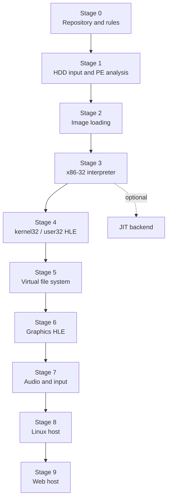

# Win32 HLE 포팅 계획 / Win32 HLE Porting Plan

이 문서는 원본 EZ2DJ 실행 파일을 Linux / 64-bit Windows / Web에서 실행하기까지의 장기 구현 단계를 정리한다. 각 단계는 그 자체로 검증 가능한 결과물을 남긴다.

*This document lays out the long-term implementation stages needed to run the original EZ2DJ executable on Linux, 64-bit Windows, and the Web. Each stage leaves a result that can be verified on its own.*

---

## 단계 개요 / Stage overview

---

## Stage 0 — 저장소와 규칙 / Repository and rules **[완료]**

작업 규칙, 문서 구조, 코딩 스타일, 라이선스 정책, 빌드 구성을 세운다.

**완료 기준:** 원본 자산 없이 빌드되고 단위 테스트가 통과한다.

*Establish workflow rules, documentation structure, coding style, license policy, and the build configuration. Done when the repository builds and passes unit tests with no original assets present.*

---

## Stage 1 — HDD 입력과 PE 분석 / HDD input and PE analysis **[완료]**

사용자가 제공한 HDD 디렉터리를 검증하고, 대소문자 무시로 경로를 해석하고, 실행 파일을 찾아 PE32 헤더를 읽는다.

**완료 기준:** `re2dj_hdd_probe`가 덤프에서 게스트 형식 실행 파일을 식별하고, `re2dj_pe_analyzer` 출력이 `dumpbin` 또는 `objdump`와 일치한다.

*Validate the user-supplied HDD directory, resolve paths case-insensitively, find executables, and read their PE32 headers. Done when `re2dj_hdd_probe` identifies the guest-format executable in a dump and `re2dj_pe_analyzer` output matches `dumpbin` or `objdump`.*

---

## Stage 2 — 이미지 적재 / Image loading

PE32 이미지를 게스트 주소 공간에 매핑한다.

* 게스트 주소 공간(`AddressSpace`): 평탄한 32비트 공간, 페이지 단위 커밋, 호스트 포인터 비노출
* 섹션 매핑: `raw_offset`/`raw_size`에서 `virtual_address`/`virtual_size`로, 남는 부분은 0으로
* 기준 재배치: `image_base`와 다른 주소에 놓일 때 `.reloc` 적용
* import 해석: 각 import 이름에 gate 주소를 배정하고 IAT에 기록
* TLS 디렉터리 확인

**완료 기준:** 원본 실행 파일의 import 목록 전체를 나열하고, 모든 재배치를 적용한 뒤 진입점 주소를 계산해 보고한다. 아직 실행하지 않는다.

*Map the PE32 image into the guest address space: commit pages, copy sections, apply base relocations, bind imports to gate addresses, and note the TLS directory. Done when the full import list is enumerated, every relocation applies, and the entry-point address is computed and reported. Nothing executes yet.*

> import 목록이 나오는 순간 **어떤 API를 구현해야 하는지가 확정된다.** Stage 4 이후의 범위는 추측이 아니라 이 목록에서 나온다.
>
> *The import list is what fixes **which APIs must be implemented.** The scope of Stage 4 onward comes from that list rather than from guesswork.*

> [!NOTE]
> 이 목록은 **이미 확보되었다.** 원본 덤프의 import 테이블을 정적으로 해석해 얻었으므로, 로더가 완성되기 전에 Stage 4 이후의 범위가 확정된 상태다. `ez2dj1.exe` 기준 7개 DLL, 144개 함수다. 전체 목록은 [EZ2DJ import 표면](analysis/ez2dj-import-surface.md)에 있다.
>
> Stage 2가 여전히 필요한 이유는 범위 확정이 아니라 **적재 자체** 때문이다. 섹션 매핑, 재배치, gate 주소 배정은 코드로 해야 한다.
>
> *This list is **already in hand**, obtained by statically parsing the original's import table, so the Stage 4 scope is fixed before the loader exists: 7 DLLs and 144 functions for `ez2dj1.exe`, listed in [EZ2DJ Import Surface](analysis/ez2dj-import-surface.md). Stage 2 is still required not for scoping but for **loading itself** — section mapping, relocation, and gate assignment have to be built.*

> [!IMPORTANT]
> 첫 적재 대상은 **`ez2dj1.exe`**다. 1st SE 덤프에서 유일하게 보호되지 않은 빌드이므로 언패킹 스텁을 실행하지 않고 진짜 게임 코드에 도달한다. 보호된 `ez2dj.exe`와 3rd의 `EZ2DJ.EXE`는 자기 수정 코드를 실행할 수 있는 backend가 필요하므로 Stage 3 이후로 미룬다.
>
> *The first load target is **`ez2dj1.exe`**, the only unprotected build in the 1st SE dump, which reaches real game code without running an unpacking stub. The protected builds need a backend that tolerates self-modifying code and wait until after Stage 3.*

---

## Stage 3 — x86-32 인터프리터 / x86-32 interpreter

이식 가능한 x86-32 실행 계층을 만든다. 호스트가 64비트이거나 WebAssembly이므로 이 계층 없이는 어떤 호스트에서도 원본 코드가 돌지 않는다.

* `GuestContext`: 범용 레지스터, EFLAGS, 세그먼트 셀렉터, x87, MMX/SSE
* 명령어 디코더와 실행 루프
* gate 주소 진입 시 HLE dispatcher로 전달
* 단일 스레드 우선. 게스트가 스레드를 만들면 Stage 4에서 다룬다.

**완료 기준:** 직접 작성한 최소 PE32 테스트 프로그램이 정확한 종료 코드로 끝난다. 원본 실행 파일이 아니라 통제된 입력으로 먼저 검증한다.

*Build the portable x86-32 execution layer: guest context, decoder, execution loop, and gate dispatch. Done when a hand-written minimal PE32 test program runs to the correct exit code. Verification uses controlled input before the original executable.*

**선택 사항:** 호스트별 JIT backend. 같은 `ExecutionBackend` 인터페이스 뒤에 붙이며, 인터프리터가 정확성 기준선으로 남는다.

*Optional: per-host JIT backends behind the same `ExecutionBackend` interface, with the interpreter remaining the correctness baseline.*

---

## Stage 4 — kernel32 / user32 HLE

창이 뜰 때까지 필요한 최소 API를 구현한다. 범위는 Stage 2의 import 목록이 정한다.

* `kernel32`: 모듈 핸들, 힙, 가상 메모리, 파일 핸들, 시간, TLS, 스레드
* `user32`: 창 생성, 메시지 큐, `PeekMessage`/`DispatchMessage`, 키보드 상태
* 미구현 항목: gate에 남되 호출되면 이름과 함께 실패를 기록

**완료 기준:** 원본 실행 파일이 창 생성 지점까지 도달하고, 그 사이 호출된 API 목록이 로그로 남는다.

*Implement the minimum API set needed to reach a window, scoped by the Stage 2 import list. Unimplemented entries keep a gate and log their name on call. Done when the original executable reaches window creation and the calls it made are logged.*

---

## Stage 5 — 가상 파일 시스템 / Virtual file system

게스트의 파일 I/O를 HDD 디렉터리와 overlay에 연결한다.

* 게스트 경로 → HDD 상대 경로 → 호스트 경로 (Stage 1의 해석기 재사용)
* overlay 우선 읽기, overlay 전용 쓰기
* 핸들 테이블, 탐색, 디렉터리 열거, 파일 속성

**완료 기준:** 게스트가 자산을 읽고 설정 파일을 쓰며, 원본 디렉터리의 내용과 수정 시각이 실행 전후로 동일하다.

*Wire guest file I/O to the HDD directory and the overlay: overlay-first reads, overlay-only writes, handle table, seek, directory enumeration, attributes. Done when the guest reads assets and writes settings while the original directory's contents and timestamps are unchanged.*

---

## Stage 6 — 그래픽 HLE / Graphics HLE

원본이 쓰는 그래픽 API를 플랫폼 backend로 연결한다.

* 사용 API 확인은 Stage 2의 import 목록과 COM 인터페이스 사용 흔적에서 나온다
* 표면 생성, 잠금/해제, 블릿, 페이지 플립
* 텍스처 업로드와 픽셀 포맷 변환
* 플랫폼 backend: OpenGL(Windows/Linux), WebGL(Web)

**완료 기준:** 첫 프레임이 화면에 나오고, 참조 스크린샷과 픽셀 단위로 비교 가능한 캡처를 남긴다.

*Connect the graphics API the original uses to the platform backend: surfaces, lock/unlock, blit, page flip, texture upload, and format conversion, over OpenGL and WebGL. Done when the first frame reaches the screen and a capture exists for pixel comparison.*

---

## Stage 7 — 오디오와 입력 / Audio and input

* 스트리밍 오디오 버퍼와 믹싱, 호스트 오디오 출력
* 키보드·조이스틱 입력, 아케이드 캐비닛 버튼 매핑
* 타이머와 프레임 페이싱

**완료 기준:** 곡 하나를 소리와 함께 끝까지 재생하고, 입력이 판정에 반영된다.

*Streaming audio buffers and mixing to the host output, keyboard and joystick input with cabinet button mapping, and timer and frame pacing. Done when one song plays through with sound and input reaches the judgement logic.*

---

## Stage 8 — Linux 호스트 / Linux host

Windows에서 검증한 것과 같은 코드가 Linux에서도 같은 결과를 내는지 확인한다.

* 대소문자 구분 파일 시스템에서 경로 해석 검증
* 플랫폼 backend의 Linux 구현
* 두 호스트에서 같은 자산으로 같은 로그와 같은 프레임이 나오는지 대조

**완료 기준:** 같은 덤프로 Windows와 Linux가 같은 진행 지점에 도달한다.

*Confirm the same code produces the same result on Linux: path resolution on a case-sensitive file system, the Linux platform backend, and a cross-host comparison of logs and frames. Done when the same dump reaches the same point on both hosts.*

---

## Stage 9 — Web 호스트 / Web host

브라우저는 동기 파일 I/O도, 블로킹 메인 루프도 허용하지 않는다. 이 제약은 실행 backend와 파일 시스템 계층에 구조적 영향을 주므로, 별도 설계 문서를 먼저 쓴다.

* 자산 전달 방식: 사용자가 브라우저에서 디렉터리를 선택하거나 패키징된 자산을 사용
* 메인 루프를 `requestAnimationFrame` 콜백으로 분해
* 파일 I/O를 비동기 또는 사전 적재 모델로 전환

**완료 기준:** 브라우저에서 Stage 6과 같은 첫 프레임이 나온다.

*Browsers allow neither synchronous file I/O nor a blocking main loop, and that constrains the execution backend and the file-system layer structurally, so this stage starts with its own design note. Done when a browser reaches the same first frame as Stage 6.*

---

## 검증 원칙 / Verification principles

* 각 단계는 원본 실행 파일이 아니라 **통제된 입력**으로 먼저 검증한다.
* 원본에서 확인한 사실은 `docs/analysis/`에 확인됨/추정/미확정을 구분해 기록한다.
* 성능 측정은 Release 빌드에서만 한다. Debug 수치는 최적화 근거로 쓰지 않는다.
* 단계가 끝날 때마다 `ARCHITECTURE.md`의 상태 표기를 갱신한다.

*Verify each stage against controlled input before the original executable. Record findings in `docs/analysis/` with confirmed, inferred, and unresolved distinguished. Measure performance only on Release builds. Update the status markers in `ARCHITECTURE.md` at the end of each stage.*
