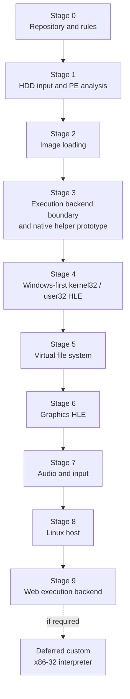

# Win32 HLE 포팅 계획 / Win32 HLE Porting Plan

이 문서는 원본 EZ2DJ 실행 파일을 Linux / 64-bit Windows / Web에서 실행하기까지의 장기 구현 단계를 정리한다. 각 단계는 그 자체로 검증 가능한 결과물을 남긴다.

*This document lays out the long-term implementation stages needed to run the original EZ2DJ executable on Linux, 64-bit Windows, and the Web. Each stage leaves a result that can be verified on its own.*

---

## 단계 개요 / Stage overview

---

## Stage 0 — 저장소와 규칙 / Repository and rules **[완료]**

작업 규칙, 문서 구조, 코딩 스타일, 라이선스 정책, 빌드 구성을 세운다.

**완료 기준:** 원본 자산 없이 빌드되고 단위 테스트가 통과한다.

*Establish workflow rules, documentation structure, coding style, license policy, and the build configuration. Done when the repository builds and passes unit tests with no original assets present.*

---

## Stage 1 — HDD 입력과 PE 분석 / HDD input and PE analysis **[완료]**

사용자가 제공한 HDD 디렉터리를 검증하고, 대소문자 무시로 경로를 해석하고, 실행 파일을 찾아 PE32 헤더를 읽는다.

**완료 기준:** `re2dj_hdd_probe`가 덤프에서 게스트 형식 실행 파일을 식별하고, `re2dj_pe_analyzer` 출력이 `dumpbin` 또는 `objdump`와 일치한다.

*Validate the user-supplied HDD directory, resolve paths case-insensitively, find executables, and read their PE32 headers. Done when `re2dj_hdd_probe` identifies the guest-format executable in a dump and `re2dj_pe_analyzer` output matches `dumpbin` or `objdump`.*

---

## Stage 2 — 이미지 적재 / Image loading

**완료 / Complete — 2026-08-22**

PE32 이미지를 게스트 주소 공간에 매핑한다.

* 게스트 주소 공간(`AddressSpace`): 평탄한 32비트 공간, 페이지 단위 커밋, 호스트 포인터 비노출
* 섹션 매핑: `raw_offset`/`raw_size`에서 `virtual_address`/`virtual_size`로, 남는 부분은 0으로
* 기준 재배치: `image_base`와 다른 주소에 놓일 때 `.reloc` 적용
* import 해석: 각 import 이름에 gate 주소를 배정하고 IAT에 기록
* TLS 디렉터리 확인

**완료 기준:** 원본 실행 파일의 import 목록 전체를 나열하고, 모든 재배치를 적용한 뒤 진입점 주소를 계산해 보고한다. 아직 실행하지 않는다.

*Map the PE32 image into the guest address space: commit pages, copy sections, apply base relocations, bind imports to gate addresses, and note the TLS directory. Done when the full import list is enumerated, every relocation applies, and the entry-point address is computed and reported. Nothing executes yet.*

구현 결과 `re2dj_pe_loader`가 `ez2dj1.exe`를 선호 주소 `0x00400000`에 적재하고 진입점 `0x0043a640`, TLS directory 없음, 7개 DLL의 import 144개와 gate 주소를 보고한다. 이 파일은 `.reloc` 섹션 이름은 갖지만 base relocation data directory가 비어 있어 다른 주소로 재배치할 수 없다. 로더의 `HIGHLOW` 재배치 경로는 synthetic PE32 테스트로 검증한다.

*The implemented `re2dj_pe_loader` maps `ez2dj1.exe` at its preferred `0x00400000` base and reports entry point `0x0043a640`, no TLS directory, and 144 gated imports from seven DLLs. The file has a section named `.reloc` but an empty base-relocation data directory, so it cannot be rebased. The loader's `HIGHLOW` relocation path is verified with a synthetic PE32 test.*

> import 목록이 나오는 순간 **어떤 API를 구현해야 하는지가 확정된다.** Stage 4 이후의 범위는 추측이 아니라 이 목록에서 나온다.
>
> *The import list is what fixes **which APIs must be implemented.** The scope of Stage 4 onward comes from that list rather than from guesswork.*

> [!NOTE]
> 이 목록은 **이미 확보되었다.** 원본 덤프의 import 테이블을 정적으로 해석해 얻었으므로, 로더가 완성되기 전에 Stage 4 이후의 범위가 확정된 상태다. `ez2dj1.exe` 기준 7개 DLL, 144개 함수다. 전체 목록은 [EZ2DJ import 표면](analysis/ez2dj-import-surface.md)에 있다.
>
> Stage 2가 여전히 필요한 이유는 범위 확정이 아니라 **적재 자체** 때문이다. 섹션 매핑, 재배치, gate 주소 배정은 코드로 해야 한다.
>
> *This list is **already in hand**, obtained by statically parsing the original's import table, so the Stage 4 scope is fixed before the loader exists: 7 DLLs and 144 functions for `ez2dj1.exe`, listed in [EZ2DJ Import Surface](analysis/ez2dj-import-surface.md). Stage 2 is still required not for scoping but for **loading itself** — section mapping, relocation, and gate assignment have to be built.*

> [!IMPORTANT]
> 첫 적재 대상은 **`ez2dj1.exe`**다. 1st SE 덤프에서 유일하게 보호되지 않은 빌드이므로 언패킹 스텁을 실행하지 않고 진짜 게임 코드에 도달한다. 보호된 `ez2dj.exe`와 3rd의 `EZ2DJ.EXE`는 자기 수정 코드를 안전하게 처리하는 backend가 확인된 뒤로 미룬다.
>
> *The first load target is **`ez2dj1.exe`**, the only unprotected build in the 1st SE dump, which reaches real game code without running an unpacking stub. The protected builds wait until a backend that safely handles self-modifying code has been validated.*

---

## Stage 3 — 실행 backend 경계와 네이티브 helper 검증 / Execution backend boundary and native-helper validation

**완료 / Complete**

직접 인터프리터를 구현하기 전에 교체 가능한 `ExecutionBackend` 경계를 정의한다. Windows의 현재 1차 경로는 x86 host process에서 원본 x86 코드를 직접 실행하고 import gate를 HLE dispatcher에 연결하는 것이다. Linux x86-64 helper는 검증 근거로 유지하며 Windows x64는 보류한다.

* `GuestContext`: 범용 레지스터, EFLAGS, 세그먼트 셀렉터, x87, MMX/SSE
* backend 생명주기, 메모리 접근, 실행/중단, gate dispatch 인터페이스
* 32비트 helper와 64비트 host service 사이의 IPC 또는 thunk 경계
* gate 주소 진입 시 HLE dispatcher로 전달하는 최소 prototype
* 처음부터 멀티스레드 게스트 context를 분리할 수 있는 구조

**완료 기준:** synthetic PE32가 데스크톱 네이티브 helper에서 gate 하나를 호출하고 정확한 종료 코드로 끝나며, Web 실행 엔진 후보와 라이선스 검토 결과가 문서화된다.

*Define the replaceable `ExecutionBackend` boundary before building a custom interpreter. The primary Windows route is now a same-bitness Win32 launcher and original child; the separate 32-bit helper remains validation evidence for Linux x86-64, while Windows x64 is deferred. Done when a synthetic PE32 calls one gate and exits correctly through the native helper, and Web execution-engine candidates and their licenses are documented.*

**후순위:** Web에서는 x86 코드를 직접 실행할 수 없으므로 재사용 가능한 허용 라이선스 실행 엔진을 우선 검토한다. 적합한 엔진이 없을 때 직접 인터프리터를 같은 `ExecutionBackend` 인터페이스 뒤에 구현한다.

*Deferred: Web cannot execute x86 code directly, so a reusable execution engine with a permitted license is evaluated first. A custom interpreter is implemented behind the same `ExecutionBackend` interface only if no suitable engine exists.*

현재 `ExecutionBackend` event/reply·memory 경계와 Windows `NativeHelperBackend` adapter가 구현되었다. protocol v3에서 helper는 요청된 non-preferred base에 PE32를 mapping하고 `HIGHLOW` relocation을 적용한 뒤 이름/ordinal native import thunk와 metadata를 구성한다. `Start` 뒤 process-attach TLS callback을 entry point 전에 실행한다. synthetic probe는 preferred `0x10000000` image를 `0x11000000`에 적재하고, 두 import 결과 44에 callback state 7을 더한 result 51과 child 정상 종료를 확인한다. TLS raw storage/index와 thread callback은 멀티스레드 backend 단계에 남아 있다.

*The `ExecutionBackend` event/reply/memory boundary and Windows `NativeHelperBackend` adapter are implemented. Under protocol v3, the helper maps PE32 at a requested non-preferred base, applies `HIGHLOW` relocations, then constructs named/ordinal native import thunks and metadata. After `Start`, process-attach TLS callbacks run before the entry point. The synthetic probe maps a preferred-`0x10000000` image at `0x11000000` and observes result 51 by adding callback state 7 to the two-import result 44, plus clean child exit. TLS raw storage/index and thread callbacks remain coupled to multithreaded backend work.*

Linux에서도 x86-64 host가 별도 i386 helper를 `fork`/`exec`하고 공용 protocol v3로 실제 `__stdcall` gate event를 처리하는 최소 prototype이 구현되었다. host가 helper stack의 인자 41을 읽고 쓴 뒤 EAX 42를 응답하고 process result 42 및 child exit 0을 확인했다. 다음 Linux 작업은 PE32 mapping과 `ExecutionBackend` adapter다.

*Linux now also has a minimal prototype in which an x86-64 host launches a separate i386 helper with `fork`/`exec` and handles a real `__stdcall` gate event over shared protocol v3. The host reads and writes argument 41 on the helper stack, replies with EAX 42, and observes process result 42 plus child exit zero. PE32 mapping and an `ExecutionBackend` adapter are the next Linux tasks.*

Web 실행 엔진과 라이선스 조사를 완료했고 v86 CPU 분리성 spike도 끝냈다. v86은 BSD-2-Clause와 필요한 명령 범위를 갖지만 CPU-only build 경계가 없고 PC 장치·MMIO·browser timer/IRQ에 결합되어 있다. 또한 기본 synthetic gate `0xF0000000`은 실행 불가 mapped/MMIO 범위다. 따라서 대규모 fork 없이 `ExecutionBackend`에 연결할 수 없어 채택하지 않는다. TinyEMU 계열은 현재 Web x86 소스의 공개 경계가 확인될 때만 재평가하며, GPL/LGPL 후보는 제외했다. 직접 인터프리터는 후순위로 유지한다.

*The Web execution-engine and license survey is complete, including the v86 CPU-separability spike. v86 is BSD-2-Clause and has the needed instruction coverage, but lacks a CPU-only build boundary and couples CPU operation to PC devices, MMIO, and browser timer/IRQ services. Its default synthetic gate, `0xF0000000`, is also non-executable mapped/MMIO. It therefore cannot connect to `ExecutionBackend` without a substantial fork and will not be adopted. A TinyEMU-family engine is reconsidered only if the publication boundary of its current Web x86 source is confirmed; GPL/LGPL candidates are excluded. A custom interpreter remains deferred.*

Windows x86 launcher는 `DEBUG_ONLY_THIS_PROCESS` child의 entry `0x0043a640`에서 temporary `INT3` breakpoint로 멈춰 `0x00400000` main image와 loader-resolved IAT 7 DLL·144 slot을 확인했다. 이 입력에서 DR0 hardware breakpoint는 context에 남았지만 event가 전달되지 않아 별도 조사 대상으로 남긴다. 다음 Windows 작업은 같은 x86 child에 runtime DLL을 적재하고 IAT handoff를 검증하는 것이다.

*The Windows x86 launcher stopped a `DEBUG_ONLY_THIS_PROCESS` child at entry `0x0043a640` with a temporary `INT3` breakpoint and confirmed the `0x00400000` main image plus seven DLLs and 144 loader-resolved IAT slots. For this input, the DR0 hardware breakpoint remained in context but delivered no event, so it remains a separate investigation. The next Windows task loads the runtime DLL into the same x86 child and verifies IAT handoff.*

같은 정지점에서 primary thread를 suspend한 뒤 remote `LoadLibraryW` thread로 최소 x86 runtime DLL을 적재했고 module base `0x7c130000`을 확인했다. 이제 runtime이 원본 IAT를 HLE thunk로 교체하고 첫 import 호출을 host와 교환하는 handoff를 검증한다.

*At the same stop, the launcher suspended the primary thread, loaded the minimal x86 runtime DLL through a remote `LoadLibraryW` thread, and observed module base `0x7c130000`. The next step verifies handoff in which the runtime replaces original IAT entries with HLE thunks and exchanges the first import call with the host.*

`GetCommandLineA` IAT slot을 runtime log-and-forward thunk로 교체한 뒤 entry를 제한적으로 재개했고, debugger output event를 실제로 수신했다. thunk는 original target으로 tail-jump하므로 관찰 단계에서 API 결과와 caller stack cleanup을 바꾸지 않는다. 이제 다음 작업은 단순 forwarding 대신 첫 최소 HLE API 구현을 선택하고 원본 동작을 계속 관찰하는 것이다.

*After replacing the `GetCommandLineA` IAT slot with a runtime log-and-forward thunk, entry was resumed in a limited run and the expected debugger output event was received. The thunk tail-jumps to the original target, so this observation step does not alter API results or caller stack cleanup. The next task selects the first minimal HLE API instead of simple forwarding and continues observing original behavior.*

사용자 결정으로 첫 실제 HLE API는 `GetCommandLineA`로 정했다. launcher는 target basename `ez2dj1.exe`를 runtime의 process-lifetime ANSI buffer에 쓰고 IAT를 HLE thunk로 교체했다. 제한 실행에서 HLE output event를 수신했으므로, 원본 import가 host 정책의 값을 반환하는 runtime 경로까지 확인됐다.

*By user decision, `GetCommandLineA` is the first real HLE API. The launcher writes target basename `ez2dj1.exe` into the runtime's process-lifetime ANSI buffer and replaces the IAT with the HLE thunk. The limited run received the HLE output event, confirming the runtime path through which an original import returns a host-policy value.*

---

## Stage 4 — kernel32 / user32 HLE

창이 뜰 때까지 필요한 최소 API를 구현한다. 범위는 Stage 2의 import 목록이 정한다.

* `kernel32`: 모듈 핸들, 힙, 가상 메모리, 파일 핸들, 시간, TLS, 스레드
* `user32`: 창 생성, 메시지 큐, `PeekMessage`/`DispatchMessage`, 키보드 상태
* 미구현 항목: gate에 남되 호출되면 이름과 함께 실패를 기록

**완료 기준:** 원본 실행 파일이 창 생성 지점까지 도달하고, 그 사이 호출된 API 목록이 로그로 남는다.

*Implement the minimum API set needed to reach a window, scoped by the Stage 2 import list. Unimplemented entries keep a gate and log their name on call. Done when the original executable reaches window creation and the calls it made are logged.*

---

## Stage 5 — 가상 파일 시스템 / Virtual file system

게스트의 파일 I/O를 HDD 디렉터리와 overlay에 연결한다.

* 게스트 경로 → HDD 상대 경로 → 호스트 경로 (Stage 1의 해석기 재사용)
* overlay 우선 읽기, overlay 전용 쓰기
* 핸들 테이블, 탐색, 디렉터리 열거, 파일 속성

**완료 기준:** 게스트가 자산을 읽고 설정 파일을 쓰며, 원본 디렉터리의 내용과 수정 시각이 실행 전후로 동일하다.

*Wire guest file I/O to the HDD directory and the overlay: overlay-first reads, overlay-only writes, handle table, seek, directory enumeration, attributes. Done when the guest reads assets and writes settings while the original directory's contents and timestamps are unchanged.*

현재 공용 경로 resolver와 `VfsFileTable`, Windows x86 runtime의 seven-file-API IAT wrapper가 구현되었다. runtime은 existing-file write 전에 overlay copy를 만들며, synthetic probe가 원본 read와 original-preserving write를 확인한다. directory enumeration, INI HLE, 그리고 원본 entry에서의 first-file-call 관찰은 아직 남아 있다.

*The shared path resolver and `VfsFileTable`, plus the Windows x86 runtime's seven-file-API IAT wrappers, are now implemented. The runtime creates an overlay copy before an existing-file write, and a synthetic probe confirms an original read and an original-preserving write. Directory enumeration, INI HLE, and observation of the first file call from an original entry remain.*

---

## Stage 6 — 그래픽 HLE / Graphics HLE

원본이 쓰는 그래픽 API를 플랫폼 backend로 연결한다.

* 사용 API 확인은 Stage 2의 import 목록과 COM 인터페이스 사용 흔적에서 나온다
* 표면 생성, 잠금/해제, 블릿, 페이지 플립
* 텍스처 업로드와 픽셀 포맷 변환
* 플랫폼 backend: OpenGL(Windows/Linux), WebGL(Web)

**완료 기준:** 첫 프레임이 화면에 나오고, 참조 스크린샷과 픽셀 단위로 비교 가능한 캡처를 남긴다.

*Connect the graphics API the original uses to the platform backend: surfaces, lock/unlock, blit, page flip, texture upload, and format conversion, over OpenGL and WebGL. Done when the first frame reaches the screen and a capture exists for pixel comparison.*

---

## Stage 7 — 오디오와 입력 / Audio and input

* 스트리밍 오디오 버퍼와 믹싱, 호스트 오디오 출력
* 키보드·조이스틱 입력, 아케이드 캐비닛 버튼 매핑
* 타이머와 프레임 페이싱

**완료 기준:** 곡 하나를 소리와 함께 끝까지 재생하고, 입력이 판정에 반영된다.

*Streaming audio buffers and mixing to the host output, keyboard and joystick input with cabinet button mapping, and timer and frame pacing. Done when one song plays through with sound and input reaches the judgement logic.*

---

## Stage 8 — Linux 호스트 / Linux host

Windows에서 검증한 것과 같은 코드가 Linux에서도 같은 결과를 내는지 확인한다.

* 대소문자 구분 파일 시스템에서 경로 해석 검증
* 플랫폼 backend의 Linux 구현
* 두 호스트에서 같은 자산으로 같은 로그와 같은 프레임이 나오는지 대조

**완료 기준:** 같은 덤프로 Windows와 Linux가 같은 진행 지점에 도달한다.

*Confirm the same code produces the same result on Linux: path resolution on a case-sensitive file system, the Linux platform backend, and a cross-host comparison of logs and frames. Done when the same dump reaches the same point on both hosts.*

---

## Stage 9 — Web 호스트 / Web host

브라우저는 동기 파일 I/O도, 블로킹 메인 루프도 허용하지 않는다. 이 제약은 실행 backend와 파일 시스템 계층에 구조적 영향을 주므로, 별도 설계 문서를 먼저 쓴다.

* 자산 전달 방식: 사용자가 브라우저에서 디렉터리를 선택하거나 패키징된 자산을 사용
* 메인 루프를 `requestAnimationFrame` 콜백으로 분해
* 파일 I/O를 비동기 또는 사전 적재 모델로 전환

**완료 기준:** 브라우저에서 Stage 6과 같은 첫 프레임이 나온다.

*Browsers allow neither synchronous file I/O nor a blocking main loop, and that constrains the execution backend and the file-system layer structurally, so this stage starts with its own design note. Done when a browser reaches the same first frame as Stage 6.*

---

## 검증 원칙 / Verification principles

* 각 단계는 원본 실행 파일이 아니라 **통제된 입력**으로 먼저 검증한다.
* 원본에서 확인한 사실은 `docs/analysis/`에 확인됨/추정/미확정을 구분해 기록한다.
* 성능 측정은 Release 빌드에서만 한다. Debug 수치는 최적화 근거로 쓰지 않는다.
* 단계가 끝날 때마다 `ARCHITECTURE.md`의 상태 표기를 갱신한다.

*Verify each stage against controlled input before the original executable. Record findings in `docs/analysis/` with confirmed, inferred, and unresolved distinguished. Measure performance only on Release builds. Update the status markers in `ARCHITECTURE.md` at the end of each stage.*
