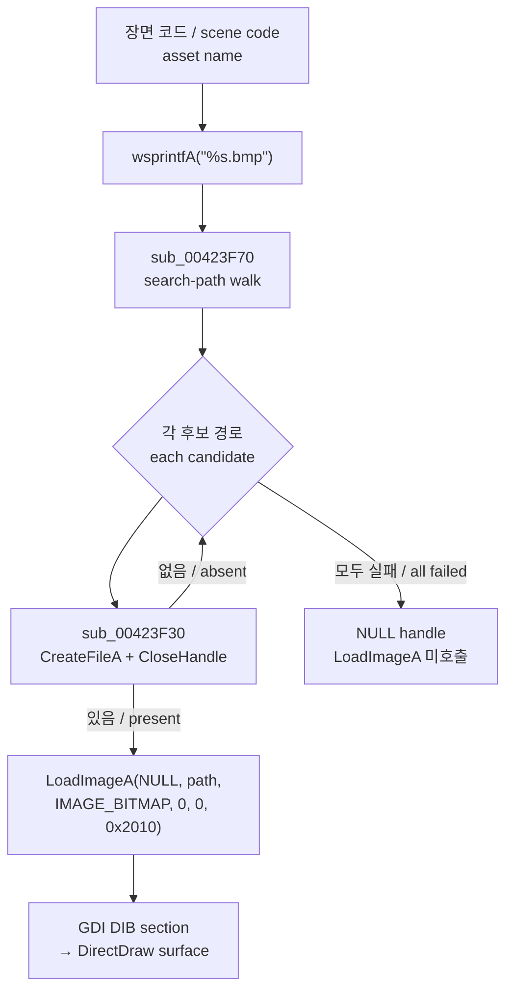

# EZ2DJ 자산 로딩 경로 / EZ2DJ Asset Loading Path

주제: 원본 `ez2dj.exe`가 화면 자산(BMP, STR 스크립트)을 여는 경로 — 검색 경로 테이블, 존재 확인 API, 실제 이미지 로딩 API, 그리고 HLE 경계가 어디에 걸리는지.

*Topic: how the original `ez2dj.exe` opens screen assets (BMP images and STR scripts) — the search-path table, the existence-check API, the actual image-loading API, and where the HLE boundary attaches.*

측정 대상: 1st SE 덤프의 `ez2dj.exe` (561,152 B, 보호됨).

측정 방법: PE import/섹션 파싱과 절대 주소 참조 스캔(일회성 스크립트), 그리고 `re2dj_windows_x86_launcher_probe` detached 실행이 남긴 VFS·DirectDraw 로그 대조.

*Measured on `ez2dj.exe` from the 1st SE dump (561,152 B, protected), using one-off PE import/section parsing plus absolute-address reference scans, cross-checked against VFS and DirectDraw logs from detached `re2dj_windows_x86_launcher_probe` runs.*

---

## 1. 확인됨: 자산 이름 해석은 검색 경로 테이블을 순회한다 / Confirmed: name resolution walks a search-path table

`sub_00423F70(name, out)`이 자산 이름을 실제 상대 경로로 바꾼다.

*`sub_00423F70(name, out)` turns an asset name into a concrete relative path.*

| 요소 | 값 |
| --- | --- |
| 검색 경로 테이블 base | VA `0x01c4c0a0` (`.data`) |
| 항목 크기 | `0x104` B = `MAX_PATH` |
| 항목 수 변수 | VA `0x01c4d0e0` (`.data`) |
| 테이블 용량 | 16 항목 (`0x01c4d0e0 - 0x01c4c0a0 = 0x1040`) |
| 결합 문자열 | `"\"` (VA `0x004570a8`) |
| 반환값 | `0` = 찾음(`out`에 경로 기록), `1` = 못 찾음 |

각 항목에 대해 `<dir>` + `"\"` + `<name>`을 만들고 `sub_00423F30`으로 존재를 확인한 뒤, 처음 성공한 경로를 `out`에 복사하고 종료한다.

*For each entry it builds `<dir>` + `"\"` + `<name>`, tests existence with `sub_00423F30`, then copies the first hit into `out` and stops.*

`sub_00423F30(path)`은 `CreateFileA(path, GENERIC_READ, FILE_SHARE_READ, NULL, OPEN_EXISTING, FILE_ATTRIBUTE_NORMAL, NULL)` 후 `CloseHandle`만 수행한다. 반환은 `1` = 존재, `0` = 없음이다. **파일 내용을 읽지 않는 순수 존재 확인이다.**

*`sub_00423F30(path)` performs only `CreateFileA(..., OPEN_EXISTING, ...)` followed by `CloseHandle`, returning `1` when present and `0` when absent — a pure existence probe that never reads content.*

테이블 내용은 장면마다 다시 채워진다. 관찰된 조합:

*The table is refilled per scene. Observed combinations:*

| 장면 | 검색 순서 |
| --- | --- |
| Title | `System\Title` → `System\Common` |
| ClubMix 플레이 | `Songs\<song>\ez` → `System\ClubMix\Disc` → `System\ClubMix` → `System\ClubMix\visual_1` → `System\Panel` |
| Ranking | `System\Ranking` → `System\Ranking\Disc` → `System\Common` |

---

## 2. 확인됨: BMP는 반드시 `USER32!LoadImageA`를 지난다 / Confirmed: every BMP goes through `USER32!LoadImageA`

`%s.bmp` 포맷 문자열(VA `0x00454e6c`)의 참조처는 정확히 두 곳이고, 두 곳 모두 곧바로 `LoadImageA` 호출로 이어진다.

*The `%s.bmp` format string (VA `0x00454e6c`) has exactly two references, and both flow straight into a `LoadImageA` call.*

| `%s.bmp` push | `sub_00423F70` 호출 | `LoadImageA` 호출 |
| --- | --- | --- |
| `0x0041ff72` | `0x0041ff99` | `0x0041ffc0` |
| `0x00422bbb` | `0x00422be5` | `0x00422c0c` |

두 호출 지점의 인자는 동일하다.

*Both call sites use identical arguments.*

```text
LoadImageA(NULL, <resolved path>, IMAGE_BITMAP, 0, 0, 0x2010)
                                                        └─ LR_LOADFROMFILE | LR_CREATEDIBSECTION
```

`sub_00423F70`이 `1`(못 찾음)을 반환하면 핸들 슬롯에 `NULL`을 넣고 `LoadImageA`를 건너뛴다. 그래서 **존재하지 않는 경로는 존재 확인 단계에서만 관찰되고, 존재하는 경로만 `LoadImageA`까지 도달한다.**

*When `sub_00423F70` returns `1` the handle slot is set to `NULL` and `LoadImageA` is skipped, so missing paths appear only at the existence probe while present paths reach `LoadImageA`.*



### 런타임 대조 / Runtime cross-check

`Re2djVfsLoadImageA` 도입 전후의 detached 실행 로그를 비교하면 후킹 여부가 그대로 드러난다.

*Comparing detached run logs from before and after `Re2djVfsLoadImageA` shows the hook taking effect.*

| 실행 | 후킹된 API | 성공 BMP 1건당 로그 줄 |
| --- | --- | --- |
| `20260827-005523`, `-010020`, `-010643` | `CreateFileA`만 | 1 |
| `20260827-011204` | `CreateFileA` + `LoadImageA` | 2 |

실패 항목(`System\Title\a_Insert.bmp`, `error=2`)은 양쪽 모두 1줄로 남는다. 위 제어 흐름과 정확히 일치하므로 **IAT 패치가 실제로 원본 호출을 가로챈다는 것이 확인됐다.**

*Failed entries stay at one line in both runs, matching the control flow above, which confirms the IAT patch really intercepts the original call.*

---

## 3. 확인됨: 보호 빌드는 IAT가 두 벌이다 / Confirmed: the protected build carries two import tables

| 테이블 | 위치 | PE import directory가 가리킴 | 원본 `.text`가 읽음 |
| --- | --- | --- | --- |
| `.gidata` | RVA `0x01ad8000` | 예 | 아니오 |
| `.idata` (레거시) | RVA `0x01aba000` | 아니오 | 예 |

`.text`의 절대 주소 참조는 전부 레거시 `.idata` 슬롯을 향한다.

*Every absolute-address reference in `.text` targets the legacy `.idata` slots.*

| 함수 | 레거시 슬롯 VA | `.text` 참조 수 |
| --- | --- | --- |
| `KERNEL32!CreateFileA` | `0x01eba36c` | 7 |
| `USER32!LoadImageA` | `0x01eba50c` | 3 |
| `GDI32!CreateDIBSection` | `0x01eba34c` | 4 |
| `DDRAW!DirectDrawCreate` | `0x01eba304` | 1 |

`.gidata` 슬롯을 직접 참조하는 코드는 보호 계층 `.gtide`가 자기 파일 I/O에 쓰는 `CreateFileA` 7건뿐이고, `LoadImageA`·`GDI32`·`DDRAW` 슬롯에는 정적 참조가 없다.

*The only code that references `.gidata` slots directly is the `.gtide` protection layer's own seven `CreateFileA` uses; the `LoadImageA`, `GDI32`, and `DDRAW` slots have no static references.*

**확인됨:** 그럼에도 `re2dj_windows_x86_launcher_probe`가 PE import directory(`.gidata`) 슬롯에 쓴 패치는 원본 호출에 반영된다. `DirectDrawCreate`, `ChangeDisplaySettingsExA`, `CreateFileA`, `LoadImageA` 모두 이 방식으로 후킹돼 런타임 로그가 남는다.

*Confirmed: patches written by `re2dj_windows_x86_launcher_probe` into the PE import directory (`.gidata`) slots nevertheless reach the original calls — `DirectDrawCreate`, `ChangeDisplaySettingsExA`, `CreateFileA`, and `LoadImageA` all produce runtime evidence when hooked this way.*

**추정:** 보호 계층이 진입점 실행 중 `.gidata`의 해석된 주소를 이름 기준으로 레거시 `.idata` 슬롯에 복사한다. 런처가 진입점 breakpoint에서 먼저 패치하므로 우리가 쓴 주소가 그대로 전파된다. `.gidata`의 함수 집합이 레거시보다 넓다는 점(`KERNEL32` 113 대 97, `USER32` 22 대 21)이 이 방향과 맞는다.

*Inferred: the protection layer copies resolved `.gidata` addresses into the legacy `.idata` slots by name during entry-point execution, after the launcher has already patched at the entry breakpoint, so our addresses propagate. The wider `.gidata` function set (113 vs 97 for `KERNEL32`, 22 vs 21 for `USER32`) is consistent with this.*

**미확정:** 복사 루틴의 실제 위치와 매칭 방식. 확인하려면 `.gtide` 진입 구간을 instruction trace로 따라가 레거시 슬롯 쓰기를 관찰해야 한다.

*Unresolved: the exact location and matching rule of that copy routine. Confirming it requires an instruction trace through the `.gtide` entry path to observe the legacy-slot writes.*

---

## 4. 확인됨: `.str`은 장면 그래픽을 이름으로 참조하는 스크립트다 / Confirmed: `.str` is a script that references scene graphics by name

`System\CompanyLogo\logo.str` (52,892 B) 구조:

*Structure of `System\CompanyLogo\logo.str` (52,892 B):*

```text
+0x00  u32   keyframe/record count (관찰값 10)
+0x0c  u32   1
+0x10  char  오브젝트 이름, NUL 패딩 / object name, NUL-padded
...          176 B 단위 float 키프레임 레코드 / 176 B float keyframe records
```

파일 안에 나타나는 오브젝트 이름은 `AMUSEWORLD_BG`, `AMUSEWORLD_BG-UP`, `AMUSEWORLD_BG-Overlap`, `AMUSEWORLD_OBJ-Shadow`, `AMUSEWORLD_OBJ256`, `AMUSEWORLD_OBJ-R-S`, `AMUSEWORLD_OBJ-R`, `LIGHT`이고, 같은 디렉터리에 동일 이름의 `.bmp`가 모두 존재한다. **`.str`은 비트맵을 품고 있지 않고 이름으로 참조한다.**

*The object names inside are `AMUSEWORLD_BG`, `AMUSEWORLD_BG-UP`, `AMUSEWORLD_BG-Overlap`, `AMUSEWORLD_OBJ-Shadow`, `AMUSEWORLD_OBJ256`, `AMUSEWORLD_OBJ-R-S`, `AMUSEWORLD_OBJ-R`, and `LIGHT`, each matching a `.bmp` in the same directory — the `.str` references bitmaps by name rather than embedding them.*

`AMUSEWORLD_OBJ256.bmp`는 24bpp 256×256(`biBitCount=24`, `biWidth=biHeight=0x100`)이다. 이름의 `256`은 색 수가 아니라 변 길이다.

*`AMUSEWORLD_OBJ256.bmp` is a 24bpp 256×256 image; the `256` in the name is the edge length, not a palette size.*

`.str` 로더는 별도 경로를 쓴다.

*The `.str` loader uses its own path.*

```text
0x0041edd6  push offset "%s.str"      (VA 0x00454e04)
0x0041edf9  call sub_00423F70          ; 같은 검색 경로 해석 / same resolver
0x0041ee0f  push offset "EZ2V:'%s' file not found"   (VA 0x00454de8)
0x0041ee3a  call [CreateFileA]         ; 실제 읽기 / actual read
```

즉 `.str`은 존재 확인 후 `CreateFileA`로 직접 읽고, BMP처럼 `LoadImageA`를 쓰지 않는다.

*So a `.str` is read directly through `CreateFileA` after the existence probe, never through `LoadImageA`.*

---

## 5. 확인됨: `.str` 기반 장면 그래픽이 전혀 로드되지 않는다 / Confirmed: no `.str`-driven scene graphic is loaded

detached 실행 `20260827-011204`(`LoadImageA` 후킹 포함, BMP 요청 1,024건 · 고유 경로 776개)에서 관찰된 사실이다.

*Observed in detached run `20260827-011204`, which had the `LoadImageA` hook active and recorded 1,024 BMP requests across 776 distinct paths.*

* `System\CompanyLogo\` 요청 **0건**. `AMUSEWORLD_OBJ256.bmp`를 포함해 로고 자산이 한 번도 요청되지 않았다.
* `System\Title\logo.bmp`, `bg.bmp`, `amuse.bmp` 등 `title.str`이 참조할 자산도 **0건**.
* 실제로 로드된 것은 `.str`과 무관한 공용 패널 오버레이(`a_Insert`, `a_Coins`, `A_credits*`, `1P_STARTBUTTON`, `WAIT_CLUB`)와 ClubMix 플레이 자산뿐이다.
* 같은 실행의 DirectDraw 로그에는 256×256이나 500×500 surface가 없다. 존재하는 크기는 64×64, 640×480, 23×32 등뿐이다.
* `.str`이 없는 단일 BMP 그룹인 `System\WarningMsg\WarningMsg.bmp`는 정상적으로 로드된다.

*No `System\CompanyLogo\` request at all; none of the assets `title.str` would reference either; only `.str`-independent common panel overlays and ClubMix play assets load; the DirectDraw log for the same run contains no 256×256 or 500×500 surface; and `System\WarningMsg\WarningMsg.bmp`, the one screen group with no `.str`, loads normally.*

**확인됨:** 누락 원인은 이미지 로더가 아니라 그 앞단의 `.str` 읽기 경계에 있다. 상세는 아래 6절이다.

*Confirmed: the missing imagery originates upstream of the image loader, at the `.str` read boundary; section 6 has the detail.*

---

## 6. 확인됨: `.str` 읽기가 `FILE_FLAG_NO_BUFFERING`으로 실패한다 / Confirmed: the `.str` read fails on `FILE_FLAG_NO_BUFFERING`

`.str` 로더는 이름 해석 뒤 다음 순서로 파일을 통째로 읽는다.

*After name resolution the `.str` loader reads the whole file in this sequence.*

| VA | 호출 | 인자 |
| --- | --- | --- |
| `0x0041ee3a` | `CreateFileA` | `GENERIC_READ`, share `0`, `OPEN_EXISTING`, flags **`0x20000080`** |
| `0x0041ee47` | `GetFileSize` | 위 handle |
| `0x0041ef07` | `ReadFile` | pool 버퍼 `base + 0x1300c`, 길이 = 파일 크기 전체 |
| `0x0041ef15` | `CloseHandle` | 위 handle |

flags `0x20000080`은 `FILE_ATTRIBUTE_NORMAL | FILE_FLAG_NO_BUFFERING`이다. BMP 존재 확인 `sub_00423F30`이 쓰는 `0x00000080`과 달리 `.str` 경로에만 `FILE_FLAG_NO_BUFFERING`(`0x20000000`)이 붙는다.

*The flags are `FILE_ATTRIBUTE_NORMAL | FILE_FLAG_NO_BUFFERING`; only the `.str` path sets `FILE_FLAG_NO_BUFFERING` (`0x20000000`), unlike the `0x00000080` used by the BMP existence probe `sub_00423F30`.*

`FILE_FLAG_NO_BUFFERING`은 NT 커널에서 버퍼 주소, 파일 오프셋, 전송 길이를 모두 볼륨 sector 크기의 배수로 요구한다. 원본은 sector 배수가 아닌 파일 크기 전체를 pool 버퍼로 읽으므로 이 요구를 만족하지 못한다.

*The NT kernel requires the buffer address, file offset, and transfer length to be multiples of the volume sector size under `FILE_FLAG_NO_BUFFERING`. The original reads a whole non-sector-multiple file into a pool buffer, satisfying none of them.*

호스트에서 같은 인자를 재현한 결과다. 대상은 실제 `System\CompanyLogo\logo.str`(52,892 B)이다.

*Reproduced on the host against the actual `System\CompanyLogo\logo.str` (52,892 B).*

| flags | open | `ReadFile` | 전송 | `GetLastError` |
| --- | --- | --- | --- | --- |
| `0x20000080` (원본) | 성공 | **실패** | 0 B | `87` (`ERROR_INVALID_PARAMETER`) |
| `0x00000080` (마스킹) | 성공 | 성공 | 52,892 B | `0` |

open은 성공하고 read만 실패하므로, VFS open 로그에는 `success=1`이 남으면서도 스크립트 내용은 한 바이트도 채워지지 않는다. 파싱이 빈 버퍼를 보고 오브젝트를 하나도 만들지 않으므로 그 이름들이 `%s.bmp`로 이어지지 않고, 결과적으로 `LoadImageA`도 호출되지 않는다. 5절의 모든 관찰이 이것으로 설명된다.

*The open succeeds and only the read fails, so the VFS log shows `success=1` while not one byte of script content arrives. Parsing an empty buffer produces no objects, none of their names reach `%s.bmp`, and `LoadImageA` is never called — which accounts for every observation in section 5.*

**추정:** 원본은 Windows 9x를 대상으로 작성됐고, VFAT은 `FILE_FLAG_NO_BUFFERING` 정렬 요구를 강제하지 않았다. NT 커널이 이를 강제하면서 같은 코드가 실패한다.

*Inferred: the original targets Windows 9x, whose VFAT did not enforce the `FILE_FLAG_NO_BUFFERING` alignment rules that the NT kernel enforces, so identical code now fails.*

**HLE 계약:** 이 정렬 규칙은 게스트가 기대한 OS 의미가 아니므로 VFS `CreateFileA` 경계에서 `FILE_FLAG_NO_BUFFERING`만 제거한다. 캐싱 정책만 달라지고 읽히는 데이터는 같다. 다른 flag는 그대로 전달한다.

*HLE contract: because that alignment rule is not the OS semantics the guest was written against, the VFS `CreateFileA` boundary strips `FILE_FLAG_NO_BUFFERING` alone. Only the caching policy changes while the data read stays identical, and every other flag passes through unchanged.*

---

## 7. HLE 경계 요약 / HLE boundary summary

| 게스트 호출 | 목적 | 현재 HLE 대체 |
| --- | --- | --- |
| `KERNEL32!CreateFileA` (`sub_00423F30`) | 자산 존재 확인 | `Re2djVfsCreateFileA` |
| `KERNEL32!CreateFileA` (`0x0041ee3a`) | `.str` 읽기 | `Re2djVfsCreateFileA` (`FILE_FLAG_NO_BUFFERING` 제거) |
| `USER32!LoadImageA` | BMP → DIB section | `Re2djVfsLoadImageA` |
| `GDI32!CreateDIBSection` 외 | DIB → surface 전송 | 미대체(호스트 GDI 사용) |

검색 경로 해석이 게스트 안에서 일어나므로, VFS는 **해석 이전의 후보 경로 각각**을 그대로 받는다. 존재하지 않는 후보에 대해 `ERROR_FILE_NOT_FOUND`를 정직하게 돌려주는 것이 정상 동작이며, 이를 성공으로 바꾸면 검색 순서가 무너진다.

*Because search-path resolution happens inside the guest, the VFS receives every pre-resolution candidate path. Returning an honest `ERROR_FILE_NOT_FOUND` for absent candidates is the correct behavior; turning those into successes would break the search order.*
