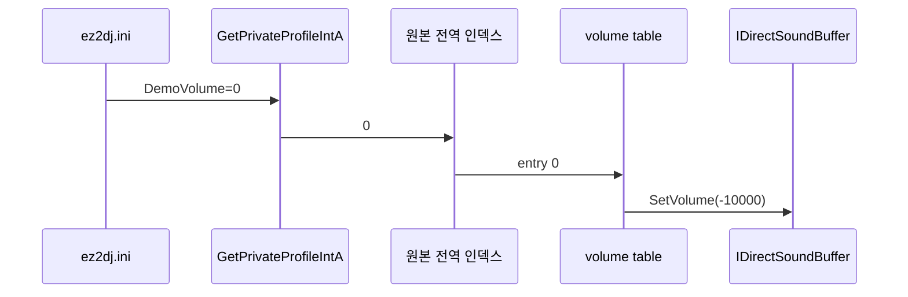

# EZ2DJ 데모 음량 프로필 분석

## 한국어

### 범위

이 문서는 1st SE의 title/demo 재생에 적용되는 `DemoVolume` 설정, 원본 DirectSound volume table과 Win32 HLE 경계를 정리한다. 원본 코드 바이트나 WAV 데이터는 기록하지 않고, 대응 unprotected binary의 주소·구조와 실제 실행에서 관찰한 scalar 상태만 기록한다.

### 확인된 설정 경로

**확인됨.** 대응 unprotected `ez2dj1.exe`의 VA `0x004371a6` 부근은 IAT slot `0x01eba38c`를 통해 `GetPrivateProfileIntA`를 호출하며 다음 의미의 인자를 전달한다.

| 인자 | 확인된 값 |
| --- | --- |
| section | `GAMEASSIGNMENTS` |
| key | `DemoVolume` |
| default | `3` |
| 결과 저장 | 전역 데모 음량 인덱스 |

실제 사용자 제공 HDD의 `ez2dj.ini`에는 같은 section 아래 `DemoVolume=0`이 있었다. 이 파일은 읽기 전용으로 조사했으며 저장소에 포함하지 않았다.

### 확인된 volume table

**확인됨.** 원본 함수 VA `0x004311f0`은 전역 인덱스 `[0x01c3ecb4]`를 읽고 VA `0x00466f70`의 dword table을 조회한 뒤, VA `0x00424c40` wrapper를 통해 `IDirectSoundBuffer::SetVolume`을 호출한다.

| `DemoVolume` | DirectSound 값(1/100 dB) | dB | 선형 gain `10^(value/2000)` | 의미 |
| ---: | ---: | ---: | ---: | --- |
| 0 | `-10000` | -100 dB | 0.00001 | DirectSound 최소 gain, 사실상 음소거 |
| 1 | `-2222` | -22.22 dB | 약 0.07745 | 22.22 dB 감쇠 |
| 2 | `-1111` | -11.11 dB | 약 0.27829 | 11.11 dB 감쇠 |
| 3 | `0` | 0 dB | 1.0 | 감쇠 없음 |

인접 VA `0x00466f80`에는 `[0, 36, 78, 121]`이 있으나, **미확정**으로 유지한다. 현재 trace와 호출 분석만으로 이 table의 단위와 사용 목적을 데모 음량에 귀속할 수 없다.

### 실제 실행 귀속

**확인됨.** 실제 실행 `20260829-001324-200.audio.log`에서 44.1 kHz title streaming buffer는 재생 전에 `SetVolume(-10000)`을 한 번만 받고 약 60초 동안 다른 volume 호출을 받지 않았다. 이때 streaming queue와 `+6 dB` host master gain은 정상 동작했다.

**확인됨.** caller 추적은 facade wrapper의 즉시 caller RVA `0x24c6e`와 그 위 원본 caller RVA `0x3120f`를 기록했다. `0x3120f`는 대응 unprotected binary의 VA `0x004311f0` 함수 안에 있으며 위 table 조회 경로와 일치한다.

따라서 작은 title 음량의 남은 직접 원인은 PCM decode·복사 감쇠나 streaming 갱신 누락이 아니라, 원본 설정값 0이 원본 table의 `-10000`을 선택한 것이다. 과거의 cabinet master 누락 추정은 이 현상에 대해서는 폐기한다.

### HLE 정책과 검증

**확인됨.** 작업 086은 원본 main image의 `GetPrivateProfileIntA` import thunk에서 section/key가 정확히 `GAMEASSIGNMENTS/DemoVolume`일 때만 외부 `--demo-volume 0..3` 값을 반환한다. 제품 기본값은 3이다. 다른 profile 요청은 Win32 API로 그대로 전달하고 원본 EXE와 HDD INI는 변경하지 않는다. 별도 SDL master gain 기본값은 0 dB다.

최종 실제 trace `20260829-003716-488.audio.log`는 다음을 확인했다.

- `ini:demo-volume configured=3`
- original caller RVA `0x3120f`
- requested/applied DirectSound volume `0`
- track gain `1.0`, master gain `1.0`
- 계속되는 45,056바이트 dirty streaming refresh와 bounded queue

### 남은 미확정 항목

- 다른 EZ2DJ 버전이 같은 section/key와 네 단계 table을 사용하는지
- 인접 `[0, 36, 78, 121]` table의 실제 의미
- profile 1과 2의 캐비닛 실제 음압 및 전체 gameplay 효과음과의 체감 균형

## English

### Scope

This document records the 1st SE title/demo `DemoVolume` setting, the original DirectSound volume table, and the selected Win32 HLE boundary. It contains no original code bytes or WAV payloads, only addresses, structures, and scalar runtime observations from the corresponding unprotected binary and real execution.

### Confirmed configuration path

**Confirmed.** Near VA `0x004371a6`, the corresponding unprotected `ez2dj1.exe` calls `GetPrivateProfileIntA` through IAT slot `0x01eba38c` with section `GAMEASSIGNMENTS`, key `DemoVolume`, and default `3`, storing the result as the global demo-volume index. The user-supplied HDD's actual `ez2dj.ini` contains `DemoVolume=0` in that section. The file was inspected read-only and was not added to the repository.

### Confirmed volume table

**Confirmed.** Original function VA `0x004311f0` reads global index `[0x01c3ecb4]`, indexes the dword table at VA `0x00466f70`, and calls `IDirectSoundBuffer::SetVolume` through wrapper VA `0x00424c40`. Indices 0 through 3 map to `[-10000, -2222, -1111, 0]`, meaning -100 dB, -22.22 dB, -11.11 dB, and 0 dB under the DirectSound hundredths-of-a-decibel contract. Their approximate linear gains are 0.00001, 0.07745, 0.27829, and 1.0. The adjacent table `[0, 36, 78, 121]` at VA `0x00466f80` remains **unresolved** because current call analysis does not establish its unit or purpose.

### Runtime attribution

**Confirmed.** In real run `20260829-001324-200.audio.log`, the 44.1 kHz title stream receives one `SetVolume(-10000)` before playback and no later volume call for roughly 60 seconds, while streaming and the then-active +6 dB host master gain work normally. Caller tracing records immediate facade-wrapper caller RVA `0x24c6e` and upstream original caller RVA `0x3120f`; the latter lies in the corresponding VA `0x004311f0` table-lookup function. The remaining low title level is therefore directly caused by original setting zero selecting `-10000`, not by PCM decode/copy attenuation or missing streaming refresh. The earlier missing-cabinet-master inference is superseded for this symptom.

### HLE policy and verification

**Confirmed.** Task 086 replaces the original main image's `GetPrivateProfileIntA` import thunk only for exact section/key `GAMEASSIGNMENTS/DemoVolume`, returning external `--demo-volume 0..3` with product default 3. Other profile reads pass through to Win32, and neither the original EXE nor HDD INI changes. SDL master gain separately defaults to 0 dB. Final real trace `20260829-003716-488.audio.log` confirms configured profile 3, original caller RVA `0x3120f`, requested/applied DirectSound volume 0, track/master gain 1.0, and continuing 45,056-byte dirty streaming refreshes with a bounded queue.

### Unresolved items

- Whether other EZ2DJ versions use the same section/key and four-entry table
- The actual meaning of adjacent table `[0, 36, 78, 121]`
- Cabinet sound-pressure levels for profiles 1 and 2 and their perceived balance against all gameplay effects

## 관련 문서 / Related documents

- [DirectSound 데모 음량 설정 HLE 설계](../design/20260829-086-directsound-volume-transition.md)
- [DirectSound 데모 음량 설정 HLE 작업 로그](../work-logs/20260829-086-directsound-volume-transition.md)
- [실행 파일 구조 누적 분석](ez2dj-exe-structures.md)
