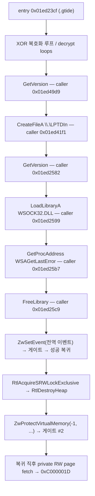

# EZ2DJ 실행 파일 구조 / EZ2DJ Executable Structures

주제: 원본 EZ2DJ 실행 파일 각각의 PE 구조, 보호 계층 해부, 데이터 인벤토리, 관찰된 런타임 흐름. 새 실행 파일이 확인될 때마다 이 문서에 섹션 하나를 추가해 누적한다.

*Topic: the PE structure, protection anatomy, data inventory, and observed runtime flow of each original EZ2DJ executable. Whenever a new executable is identified, add one section here.*

측정 도구: `re2dj_pe_analyzer <file>` (헤더·섹션·데이터 디렉터리), `re2dj_hdd_probe <dir>` (덤프 식별), `re2dj_windows_x86_launcher_probe` (런타임 관찰, `--api-trace` 등). import 함수 목록은 [import 표면 분석](ez2dj-import-surface.md)이, 덤프 디렉터리 구조와 실행 파일 식별 근거는 [HDD 레이아웃 분석](ez2dj-hdd-layout.md)이 담당한다. 이 문서는 실행 파일 단위 구조만 담는다.

*Measurement tools: `re2dj_pe_analyzer <file>` (headers, sections, data directories), `re2dj_hdd_probe <dir>` (dump identification), `re2dj_windows_x86_launcher_probe` (runtime observation via `--api-trace` and friends). The import function lists live in the [import surface analysis](ez2dj-import-surface.md); dump directory structure and executable identification live in the [HDD layout analysis](ez2dj-hdd-layout.md). This document carries per-executable structure only.*

## 표기 규칙 / Notation

모든 서술은 확인됨 / 추정 / 미확정 중 하나로 표기한다. 확인됨에는 측정 방법을, 추정에는 근거를, 미확정에는 확인 방법을 함께 적는다.

*Every statement is marked confirmed, inferred, or unresolved, with the measurement method, evidence, or the way to find out.*

---

## 공통 특성 / Common traits

**확인됨.** 다섯 실행 파일 전부 `PE32 / i386 / Windows GUI (subsystem 2, 버전 4.0)`, image base `0x00400000`, section alignment `0x00001000`, file alignment `0x00001000`, size of headers `0x00001000`, `dll flags 0x0000`이다. `dll flags 0`은 `DYNAMIC_BASE`(ASLR)와 `NX_COMPAT`(DEP) 어느 쪽도 선호하지 않는다는 뜻이다.

*Confirmed. All five executables are PE32 / i386 / Windows GUI (subsystem 2, version 4.0) at image base 0x00400000 with 0x1000 section/file alignment, 0x1000 header size, and dll flags 0x0000 — meaning no ASLR (`DYNAMIC_BASE`) and no DEP opt-in (`NX_COMPAT`).* 

**확인됨.** `ez2dj1.exe`와 `ez2dj.exe`의 PE TimeDateStamp가 `0x3862df27`로 동일하다. 보호 처리가 타임스탬프를 보존했을 가능성과 함께, 두 파일이 같은 원본 빌드의 관계라는 기존 결론([HDD 레이아웃](ez2dj-hdd-layout.md) 3절)을 뒷받침한다.

*Confirmed. `ez2dj1.exe` and `ez2dj.exe` share the identical PE TimeDateStamp `0x3862df27`, supporting both timestamp preservation by the protection step and the earlier conclusion that the protected file wraps the same underlying build.*

| 파일 | 타임스탬프 | 덤프 |
| --- | --- | --- |
| `ez2dj1.exe` | `0x3862df27` | 1st SE |
| `ez2dj.exe` | `0x3862df27` | 1st SE |
| `Test.exe` | `0x38607297` | 1st SE |
| `PlzPowerOff.exe` | `0x3700321a` | 1st SE |
| `EZ2DJ.EXE` | `0x3baea943` | 3rd |

---

## 1. `ez2dj1.exe` — 1st SE bring-up 빌드 (보호 없음)

### 1.1 헤더와 섹션 — 확인됨

`re2dj_pe_analyzer`로 확인. entry point RVA `0x0003a640`은 `.text` 안에 있고, SizeOfImage는 `0x01ad1000`이다. import directory는 표준 위치 `.idata`(RVA `0x01aba000`, 크기 `0x00000fa4`)에 있다. base relocation data directory는 `{RVA 0, Size 0}`로 비어 있으므로 선호 주소 `0x00400000`에 고정 적재해야 한다.

*Verified with `re2dj_pe_analyzer`. The entry RVA 0x0003a640 lies in `.text`; SizeOfImage is 0x01ad1000; the import directory sits at the standard `.idata` (RVA 0x01aba000, size 0x00000fa4); and the base-relocation directory is empty, so the image must load at its preferred base.*

| 섹션 | VA | VSize | Raw Off | Raw Size | Flags |
| --- | --- | --- | --- | --- | --- |
| `.text` | `0x00001000` | `0x00052540` | `0x00001000` | `0x00053000` | code, exec, read |
| `.rdata` | `0x00054000` | `0x00007571` | `0x00054000` | `0x00008000` | data, read |
| `.data` | `0x0005c000` | `0x01a5d2f8` | `0x0005c000` | `0x0000d000` | data, read, write |
| `.idata` | `0x01aba000` | `0x00000fa4` | `0x00069000` | `0x00001000` | data, read, write |
| `.reloc` | `0x01abb000` | `0x00015094` | `0x0006a000` | `0x00016000` | discardable |

**추정.** `.data`는 raw 52 KB에 비해 가상 27 MB다. 파일에서 오지 않는 약 27 MB는 0으로 채워지는 정적 버퍼일 가능성이 높다(게임 자산용 추정). 실제 용도는 실행해야 확인된다.

*Inferred. `.data` is 52 KB raw against ~27 MB virtual; the zero-filled remainder is likely a static buffer for game assets, pending a run.*

### 1.2 import — 확인됨

7개 DLL, 144개 함수. 전체 목록과 HLE 우선순위는 [import 표면 분석](ez2dj-import-surface.md) 1~8절.

*Seven DLLs, 144 functions; see the import surface analysis.*

---

## 2. `ez2dj.exe` — 1st SE 정식 실행 파일 (보호됨)

### 2.1 헤더와 섹션 — 확인됨

entry point RVA `0x01ad23cf`는 마지막 코드 섹션 `.gtide` 안에 있고, SizeOfImage는 `0x01ada000`이다. import directory는 `.gidata`(RVA `0x01ad8000`)로 옮겨져 있고 IAT directory도 `0x01ad80a0`에 있다. base relocation directory는 보이지 않는다(`ez2dj1.exe`와 마찬가지로 선호 주소 고정으로 추정 — 확인 방법: relocation directory 값을 직접 읽기).

*The entry RVA 0x01ad23cf lies in the last code section `.gtide`; SizeOfImage is 0x01ada000; the import directory moved into `.gidata` (RVA 0x01ad8000) with the IAT directory at 0x01ad80a0; no base-relocation directory is visible (preferred-base load inferred, as with ez2dj1.exe — confirm by reading the relocation directory directly).*

| 섹션 | VA | VSize | Raw Off | Raw Size | Flags |
| --- | --- | --- | --- | --- | --- |
| `.text` | `0x00001000` | `0x00052540` | `0x00001000` | `0x00053000` | code, exec, read |
| `.rdata` | `0x00054000` | `0x00007571` | `0x00054000` | `0x00008000` | data, read |
| `.data` | `0x0005c000` | `0x01a5d2f8` | `0x0005c000` | `0x0000d000` | data, read, write |
| `.idata` | `0x01aba000` | `0x00000fa4` | `0x00069000` | `0x00001000` | data, read, write |
| `.reloc` | `0x01abb000` | `0x00015094` | `0x0006a000` | `0x00016000` | discardable |
| `.gtide` | `0x01ad1000` | `0x0000596e` | `0x00080000` | `0x00006000` | code, exec, read |
| `.gdata` | `0x01ad7000` | `0x00000c00` | `0x00086000` | `0x00001000` | data, read, write |
| `.gidata` | `0x01ad8000` | `0x00001100` | `0x00087000` | `0x00002000` | data, read, write |

앞의 다섯 섹션은 `ez2dj1.exe`와 VA·크기가 정확히 같다. 보호 계층은 원본 이미지 뒤에 `.gtide`(코드 스텁), `.gdata`(보호 데이터), `.gidata`(import 재배치)를 덧붙인 형태다.

*The first five sections match `ez2dj1.exe` exactly; the protection appends `.gtide` (stub code), `.gdata` (protection data), and `.gidata` (relocated imports) behind the original image.*

### 2.2 `.gidata` — import 재배치 — 확인됨

import directory(RVA `0x01ad8000`)와 IAT(RVA `0x01ad80a0`)를 직접 해석한 결과: KERNEL32(원본 97개급 전체 + 보호 특화 추가), USER32, GDI32, ADVAPI32(`RegFlushKey`), DSOUND(ordinal 1), WINMM, DDRAW. 보호 특화 추가 목록과 슬롯 VA는 [import 표면 분석](ez2dj-import-surface.md) 9절에 있다. 런타임에 관찰된 동적 해석은 `GetProcAddress(wsock32, "WSAGetLastError")` 하나뿐이다.

*Parsing the directory directly: KERNEL32 (the full original surface plus protection-flavored additions), USER32, GDI32, ADVAPI32, DSOUND ordinal 1, WINMM, DDRAW. The protection-specific additions and slot VAs are in the import surface analysis; the only dynamic resolution observed at runtime is GetProcAddress for WSAGetLastError.*

### 2.3 `.gtide` — 보호 스텁 해부 — 확인됨

정적 덤프(파일 오프셋 `0x80000` 기준)에서 다음이 확인됐다.

*From the static dump (file offset 0x80000 base):*

1. **안티디스어셈블 점프.** `eb 01 e8`, `eb 03` 같은 짧은 `jmp`가 코드 전반에 깔려 직후의 쓰레기 바이트(`e8` 등)를 건너뛴다. 선형 디스어셈블러를 무너뜨리는 패턴이다.
2. **XOR 복호화 루프.** entry `0x01ed23cf` 직후와 여러 함수에서 `mov cl,[eax+reg]; xor cl,[ebp-key]; mov [eax+reg],cl; jmp back` 형태의 바이트 단위 복호화 루프가 보인다.
3. **정적으로 일관된 헬퍼 하나.** `0x01ed2504` 근처의 함수는 정적으로 온전히 해석된다: 인자가 `-1`이면 `-1` 반환, `_lread`(IAT 슬롯 `0x01ed8228`)로 10바이트 읽기, 바이트 XOR 루프, `0x646c6f47`(`"Gold"`)과 `0x6f736e65`(`"enso"`) 8바이트 매직 비교, 결과를 `[ebp+0x10]`에 기록.
4. **자기 수정 확인.** 런타임 caller 주소들(`0x01ed2582`, `0x01ed2599`, `0x01ed25b7`, `0x01ed25c9`)의 정적 opcode는 관찰된 호출(`GetVersion`, `LoadLibraryA`, `GetProcAddress`, `FreeLibrary`)과 어긋난다. 실행 시점의 `.gtide` 바이트는 파일과 다르다.

*Anti-disassembly short jumps skip junk bytes throughout; XOR byte-decrypt loops appear at the entry and in several functions; one helper near 0x01ed2504 parses coherently (arg −1 early return, `_lread` of 10 bytes via IAT slot 0x01ed8228, XOR loop, 8-byte magic compare against "Gold"/"enso"); and the runtime caller addresses decode to different calls than the static bytes, confirming self-modification.*

**확인됨.** TLS data directory는 없다. 따라서 진입 전 TLS callback이 `.gtide`를 고친 가능성은 배제된다.

*Confirmed: there is no TLS data directory, so pre-entry TLS-callback modification is excluded.*

**미확정.** `.gtide` 섹션 플래그는 write 비트가 없는데도 런타임 바이트가 바뀌었다. 수정 경로(직접 쓰기가 허용된 환경 요인인지, 관찰 시작 이전 수정인지, 다른 우회인지)는 확인되지 않았다. 확인 방법: entry 직전 정지 시점에 `.gtide` 체크섬을 파일과 비교하고, 이후 시점마다 재비교.

*Unresolved: `.gtide` carries no write flag yet its runtime bytes changed. The modification route (environment that permits direct writes, modification before observation starts, or another bypass) is unknown; verify by checksumming `.gtide` against the file at the pre-entry stop and re-comparing at later points.*

### 2.4 `.gdata` — 문자열·데이터 인벤토리 — 확인됨

파일 오프셋 기준 `0x869b0`~`0x86aa0` 구간을 직접 읽었다. VA 변환은 `VA = 오프셋 + 0x01E51000`이다.

*Read directly from file offsets 0x869b0–0x86aa0; VA = offset + 0x01E51000.*

| VA | 내용 | 런타임 대조 |
| --- | --- | --- |
| `0x01ed79b0` | `".gdata"` 문자열 (패커 흔적) | — |
| `0x01ed79b8` | `"WSOCK32.DLL"` | `LoadLibraryA` 인자와 **일치** |
| `0x01ed79c4` | `"WSAGetLastError"` | `GetProcAddress` 인자와 **일치** |
| `0x01ed79dc` / `0x01ed79e8` | `"WSOCK32.DLL"` / `"WSAGetLastError"` (두 번째 쌍) | 미관찰 |
| `0x01ed79f0` | `"MSVBVM50.DLL"` | 미관찰 |
| `0x01ed7a06`~`0x01ed7a17` | 비ASCII 메시지 바이트 (EUC-KR 추정) | 미관찰 |
| `0x01ed7a18` | `"MSVBVM50.DLL"` (두 번째) | 미관찰 |
| `0x01ed7a2c` | `".gdata"` 문자열 | — |
| `0x01ed7a34` | `"\\.\TDSD.VXD"` | 미관찰 |
| `0x01ed7a44` | dword `1` | — |
| `0x01ed7a4c` | `"\\.\LPTDI0"` | **같은 주소가 런타임에 `"\\.\LPTDI1"`로 관찰됨** |
| `0x01ed7a5c`~`0x01ed7a87` 부근 | 해시성 blob 바이트들 | 미관찰 |
| `0x01ed7a9c` | dword `0xc0e92228` | — |

**확인됨.** `0x01ed7a4c`의 문자열은 파일에는 `\\.\LPTDI0`인데, `--api-trace` 실행에서 같은 주소를 가리키는 `CreateFileA` 첫 인자가 `\\.\LPTDI1`로 디코딩됐다(JSON sanitizing으로 `\`가 `.`로 표기된 `....LPTDI1`). 보호 코드가 포트 번호 자리를 실행 중에 바꿔 쓴다는 뜻이다. `\\.\TDSD.VXD`·`\\.\LPTDI*`·덤프 루트의 비활성 `Tdsd.vxd111`이 함께 보호·I/O 검사 장치 후보다.

*Confirmed: the string at 0x01ed7a4c is `\\.\LPTDI0` in the file, but the `CreateFileA` first argument pointing at the same address decoded as `\\.\LPTDI1` in an `--api-trace` run — the protection rewrites the port digit at runtime. Together with `\\.\TDSD.VXD`, the `\\.\LPTDI*` family, and the disabled `Tdsd.vxd111` at the dump root, these are the candidate protection/I-O check devices.*

**추정.** `MSVBVM50.DLL` 문자열 두 쌍과 매직 비교(`"Gold"`/`"enso"`), 해시 blob은 동글 응답 검증이나 라이선스 데이터일 가능성이 있다. 근거는 문자열 구성뿐이며 목적은 실행 관찰로 확인해야 한다.

*Inferred: the MSVBVM50.DLL pairs, the magic compare, and the hash blobs look like dongle-response or license data, but the evidence is the string composition alone.*

### 2.5 관찰된 런타임 흐름 — 확인됨

`--api-trace`와 언로드 종반 single-step(`--api-trace` 확장)으로 관찰한 흐름이다. caller 주소는 실행마다 동일했다. 근거는 [작업 로그 20260823-042](../work-logs/20260823-042-protected-api-observation-trace.md)와 [HDD 레이아웃 분석](ez2dj-hdd-layout.md) 3절이다.

*Observed via `--api-trace` plus the unload-tail single-step extension; caller addresses repeat across runs. Evidence lives in work log 20260823-042 and the HDD layout analysis.*

fault 전에 `VirtualAlloc`·`VirtualProtect` 호출은 관찰되지 않았다. fault 서명은 실행마다 동일하다: `EBX` = fault page base, `ECX=EDX=ESI=EDI` = entry VA `0x01ed23cf`, `EAX` = `0x001affcc`(debugger 없는 실행의 종료 코드와 동일), `EBP` = kernel32 내부 주소, `ESP` = `0x001aff80`. fault page 내용은 `{0x00010000, 0xffffffff, 0x00400000, ntdll 포인터들, ...}` 구조이고, allocation base `0x00200000`의 기존 process heap 안에 있다.

정밀 관찰([작업 로그 20260823-044](../work-logs/20260823-044-protected-fault-path-precision.md))과 복귀 추적([작업 로그 20260823-045](../work-logs/20260823-045-post-gate-resume-trace.md))으로 다음이 확인됐다.

1. **전환 직전의 시스템 콜은 `ntdll!ZwSetEvent`다.** 샘플 심볼 해석에서 스텁 주소가 `ZwSetEvent+0x0`과 정확히 일치하고, `mov eax,0x7000e; mov edx,&thunk; call edx; ret 8` 패턴이 NtSetEvent의 두 인자(`ret 8`)와 맞다. 직전의 내부 함수는 `push 0; push [ntdll 전역 핸들]` 후 이 스텁을 부른다.
2. **fault 시점 보고 컨텍스트는 32비트 모드다.** `cs=0x0023, ds/es/gs/ss=0x002b, fs=0x0053`. WOW64 계층이 합성한 값이므로 실제 CPU 모드와 다를 수 있지만, 보고 기준은 32비트 사용자 코드 세그먼트다.
3. **WOW64 게이트 통과 순간 single-step 보고가 끊긴다.** 게이트 도착 샘플에서 보고 레지스터가 세이브 영역 값으로 뒤집히고, 그 다음 관찰되는 것은 곧바로 다음 event다. TF가 전환을 살아남지 못한다.
4. **스텁 복귀 주소의 software breakpoint로 복귀 이후를 다시 추적할 수 있다.** `call edx` 감지 시 복귀 주소에 INT3를 심으면 64비트 처리 뒤 정확히 그 자리에서 hit하고, byte 복원·TF 재무장으로 이후 수백 명령을 더 수집한다.
5. **ZwSetEvent는 성공(EAX=0)으로 돌아오고, 죽음은 힙 파괴 안에 있다.** 복귀 직후 EBX=EDI=`0x73190000`(wsock32 image base)로 보존돼 있고, 경로는 내부 epilogue → `RtlAcquireSRWLockExclusive` → **`RtlDestroyHeap`** → helper가 `-1, &base, &size, protect, &old` 다섯 인자를 쌓은 **`ZwProtectVirtualMemory`(eax=0x50)** → 두 번째 게이트 → 도착 직후 private RW page #UD다. 종료는 ZwSetEvent가 아니라 언로드 종반의 힙 파괴 + 페이지 속성 변경 안에서 일어나며, fault page의 allocation base `0x00200000` 예약이 파괴 대상 힙과 겹친다는 것이 가장 강한 상관이다(추정).

*No VirtualAlloc/VirtualProtect occurs before the fault. The fault signature repeats across runs (EBX = fault page base, ECX=EDX=ESI=EDI = entry VA, EAX = the raw-run exit-code value, ESP = 0x001aff80), and the page carries the deterministic structure inside the pre-existing process heap.*

*Precision observation plus resume tracing confirmed five facts: (1) the pre-transition syscall is exactly ntdll!ZwSetEvent; (2) the fault-time synthesized context reports 32-bit user segments (cs=0x0023, fs=0x0053); (3) crossing the gate flips the reported registers to save-area values and silently ends single-step reporting because TF does not survive the transition; (4) a software breakpoint on the detected call-edx return address catches the 32-bit resume, and re-tracing works for hundreds of instructions past the gate; and (5) ZwSetEvent returns success with wsock32's image base preserved in EBX/EDI, after which the path runs RtlAcquireSRWLockExclusive → RtlDestroyHeap → a five-argument ZwProtectVirtualMemory → the second gate → immediate #UD on a fresh private RW page. The termination happens inside heap destruction plus page-protection work during the unload tail, and the fault page's reservation overlapping the destroyed heap is the strongest correlation (inferred).*

**미확정.** 두 번째 게이트의 64비트 처리가 왜 private RW page로 전송을 만드는지, 그리고 이 종료가 하드웨어 동글·환경 검사 실패의 반응인지 현대 WOW64 환경과의 부정합인지는 여전히 열려 있다. RtlDestroyHeap이 ws2_32 detach 과정의 소유인지도 복귀 시점 깊은 stack dump로 확인해야 한다(추정 근거: SRW lock + 이벤트 시그널 + 힙 파괴 조합). 확인 방법: `syscall_resume_hit`에서 stack 상단 64 word를 덤프해 `ws2_32`(동적 base) 영역 복귀 주소를 찾는다. RtlDestroyHeap 인자(힙 핸들)와 fault allocation의 상관도 대조한다.

*Unresolved: why the second gate's 64-bit processing transfers to a private RW page, and whether the termination reacts to failed dongle/environment checks or mismatches modern WOW64. Whether RtlDestroyHeap belongs to ws2_32 detach also needs the deeper stack dump at the resume hit (inferred from the SRW-lock plus event-signal plus heap-destroy combination). Verify by dumping the top 64 stack words at syscall_resume_hit and looking for return addresses inside the dynamically loaded ws2_32 range, and by correlating RtlDestroyHeap's heap-handle argument with the fault allocation.*

---

## 3. `EZ2DJ.EXE` — 3rd Trax 정식 실행 파일 (보호됨)

### 3.1 헤더와 섹션 — 확인됨

entry point RVA `0x00642240`은 `.protect` 섹션 안에 있고, SizeOfImage는 `0x0067c000`이다. import directory RVA `0x0067af90`과 base relocation directory RVA `0x00643000`이 **모두 `.protect` 가상 범위 안**(`0x00642000` + `0x00039251`)에 있다. 즉 import와 reloc까지 패커 섹션이 소유한다.

*The entry RVA 0x00642240 lies in `.protect`; SizeOfImage is 0x0067c000; and both the import directory (RVA 0x0067af90) and the base-relocation directory (RVA 0x00643000) fall inside the `.protect` virtual range — the packer section owns imports and relocations too.*

| 섹션 | VA | VSize | Raw Off | Raw Size | Flags |
| --- | --- | --- | --- | --- | --- |
| `.text` | `0x00001000` | `0x000c0c96` | `0x00001000` | `0x000c1000` | code, exec, read |
| `.rdata` | `0x000c2000` | `0x0000a68c` | `0x000c2000` | `0x0000b000` | data, read |
| `.data` | `0x000cd000` | `0x00567790` | `0x000cd000` | `0x00015000` | data, read, write |
| `.idata` | `0x00635000` | `0x000016df` | `0x000e2000` | `0x00002000` | data, read, write |
| `.reloc` | `0x00637000` | `0x0000af0a` | `0x000e4000` | `0x0000b000` | data, read, write, discardable |
| `.protect` | `0x00642000` | `0x00039251` | `0x000ef000` | `0x0003a000` | code, exec, read, write |

**확인됨.** `.protect` 플래그는 `0xe0000020`으로 **write 비트가 있다**(1st SE의 `.gtide`와 다름). 섹션 자체가 RWX로 선언되어 자기 수정이 플래그 수준에서 허용된다.

*Confirmed: `.protect` flags 0xe0000020 include write — unlike 1st SE's `.gtide` — so self-modification is permitted at the flag level.*

**추정.** `.data`는 raw 84 KB에 비해 가상 5.5 MB로, 1st SE와 같은 0 채움 정적 버퍼 패턴이다.

*Inferred: `.data` is 84 KB raw against 5.5 MB virtual — the same zero-filled static-buffer pattern as 1st SE.*

### 3.2 import와 런타임 — 부분 확인

3rd의 import에는 1st SE에 없는 `DINPUT.dll: DirectInputCreateA`, `AVIFIL32.dll`, `WS2_32.dll`이 있다([import 표면 분석](ez2dj-import-surface.md) 4절). `EZ2DJ.INI`의 `"UseIOCard" = 1`이 I/O 카드 사용을 확인해 준다. 런타임 흐름은 아직 추적하지 않았다. 확인 방법: `--api-trace --target ez2dj3rd` 실행.

*Third's imports add DINPUT.dll DirectInputCreateA, AVIFIL32.dll, and WS2_32.dll; EZ2DJ.INI's UseIOCard=1 confirms I-O card use. The runtime flow is untraced; verify with `--api-trace --target ez2dj3rd`.*

**미확정.** 3rd의 게스트 드라이브 문자와 작업 디렉터리(`System.ini` 부재), 보호 스텁의 세부 구조, fault 여부.

*Unresolved: 3rd's guest drive and working directory (no System.ini), the protection stub's anatomy, and whether it faults.*

---

## 4. 보조 도구 / Auxiliary tools (1st SE)

### 4.1 `Test.exe` — 서비스·테스트 도구 — 확인됨

entry RVA `0x0001ada0`(`.text`), SizeOfImage `0x001de000`, 섹션 여섯 개(`.text .rdata .data .idata .rsrc .reloc`). resource directory(`0x001c9000`)와 **비어 있지 않은** base relocation directory(`0x001ce000`, 크기 `0x0000c8d0`)가 있다. 즉 이 실행 파일은 재배치 가능하다. 캐비닛이 부팅에 쓰지 않는 서비스 도구다([HDD 레이아웃](ez2dj-hdd-layout.md) 5절).

*Entry 0x0001ada0 in `.text`, SizeOfImage 0x001de000, six sections including `.rsrc`, and a non-empty base-relocation directory — this service tool is relocatable and is not the cabinet's boot target.*

### 4.2 `PlzPowerOff.exe` — 종료 화면 — 확인됨

entry RVA `0x00001e6e`(`.text`), SizeOfImage `0x0001b000`, 섹션 네 개(`.text .rdata .data .rsrc`). characteristics가 `0x010f`로 다른 실행 파일(`0x010e`)과 다르다. 전원 종료 화면 표시용 소형 도구다.

*Entry 0x00001e6e in `.text`, SizeOfImage 0x0001b000, four sections, and characteristics 0x010f (vs 0x010e elsewhere) — a small shutdown-screen tool.*

---

## 5. 새 실행 파일 추가 절차 / Procedure for a new executable

1. `re2dj_pe_analyzer <file>`로 헤더·섹션·데이터 디렉터리를 확보하고 이 문서에 섹션을 추가한다. 골격은 1~4절 중 보호 여부에 맞는 것을 따른다.
2. 보호 섹션이 보이면 import directory의 위치(원본 `.idata` 유지 여부, 패커 섹션 이동 여부)를 확인하고, 필요하면 슬롯 VA까지 해석해 [import 표면 분석](ez2dj-import-surface.md)에 기록한다.
3. 데이터 섹션의 문자열·blob 인벤토리를 VA와 함께 남긴다. 런타임 관찰 결과와 정적 값을 대조하는 열을 유지한다(2.4절 형식).
4. 런타임 흐름은 launcher probe 관찰 후 이 문서에 요약하고 근거 작업 로그를 링크한다. 확인됨/추정/미확정 표기를 유지한다.
5. `docs/analysis/README.md` 색인과 이 문서의 공통 특성 표를 같은 작업에서 갱신한다.

*1. Capture headers/sections/directories with `re2dj_pe_analyzer` and add a section here following the protected or unprotected skeleton. 2. For a protection section, locate the import directory and, if moved, resolve slot VAs into the import surface document. 3. Record string/blob inventories with VAs, keeping a runtime-vs-static comparison column. 4. Summarize runtime flow after launcher-probe observation and link the evidence work log. 5. Update the analysis README index and the common-traits table in the same task.*

---

## 관련 문서 / Related documents

* [EZ2DJ import 표면](ez2dj-import-surface.md)
* [HDD 레이아웃과 실행 파일 식별](ez2dj-hdd-layout.md)
* [보호 stub API 관찰 trace 작업 로그](../work-logs/20260823-042-protected-api-observation-trace.md)
* [PE32 실행 형식](../kb/pe32-executable-format.md)
* [원본 실행 파일 분석 (누적)](../EXE_DESIGN.ko.md)
