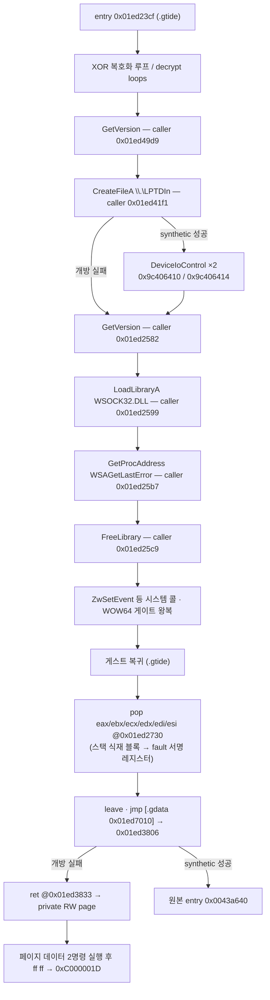

# EZ2DJ 실행 파일 구조 / EZ2DJ Executable Structures

주제: 원본 EZ2DJ 실행 파일 각각의 PE 구조, 보호 계층 해부, 데이터 인벤토리, 관찰된 런타임 흐름. 새 실행 파일이 확인될 때마다 이 문서에 섹션 하나를 추가해 누적한다.

*Topic: the PE structure, protection anatomy, data inventory, and observed runtime flow of each original EZ2DJ executable. Whenever a new executable is identified, add one section here.*

측정 도구: `re2dj_pe_analyzer <file>` (헤더·섹션·데이터 디렉터리), `re2dj_hdd_probe <dir>` (덤프 식별), `re2dj_windows_x86_launcher_probe` (런타임 관찰, `--api-trace` 등). import 함수 목록은 [import 표면 분석](ez2dj-import-surface.md)이, 덤프 디렉터리 구조와 실행 파일 식별 근거는 [HDD 레이아웃 분석](ez2dj-hdd-layout.md)이 담당한다. 이 문서는 실행 파일 단위 구조만 담는다.

*Measurement tools: `re2dj_pe_analyzer <file>` (headers, sections, data directories), `re2dj_hdd_probe <dir>` (dump identification), `re2dj_windows_x86_launcher_probe` (runtime observation via `--api-trace` and friends). The import function lists live in the [import surface analysis](ez2dj-import-surface.md); dump directory structure and executable identification live in the [HDD layout analysis](ez2dj-hdd-layout.md). This document carries per-executable structure only.*

## 표기 규칙 / Notation

모든 서술은 확인됨 / 추정 / 미확정 중 하나로 표기한다. 확인됨에는 측정 방법을, 추정에는 근거를, 미확정에는 확인 방법을 함께 적는다.

*Every statement is marked confirmed, inferred, or unresolved, with the measurement method, evidence, or the way to find out.*

---

## 공통 특성 / Common traits

**확인됨.** 다섯 실행 파일 전부 `PE32 / i386 / Windows GUI (subsystem 2, 버전 4.0)`, image base `0x00400000`, section alignment `0x00001000`, file alignment `0x00001000`, size of headers `0x00001000`, `dll flags 0x0000`이다. `dll flags 0`은 `DYNAMIC_BASE`(ASLR)와 `NX_COMPAT`(DEP) 어느 쪽도 선호하지 않는다는 뜻이다.

*Confirmed. All five executables are PE32 / i386 / Windows GUI (subsystem 2, version 4.0) at image base 0x00400000 with 0x1000 section/file alignment, 0x1000 header size, and dll flags 0x0000 — meaning no ASLR (`DYNAMIC_BASE`) and no DEP opt-in (`NX_COMPAT`).* 

**확인됨.** `ez2dj1.exe`와 `ez2dj.exe`의 PE TimeDateStamp가 `0x3862df27`로 동일하다. 보호 처리가 타임스탬프를 보존했을 가능성과 함께, 두 파일이 같은 원본 빌드의 관계라는 기존 결론([HDD 레이아웃](ez2dj-hdd-layout.md) 3절)을 뒷받침한다.

*Confirmed. `ez2dj1.exe` and `ez2dj.exe` share the identical PE TimeDateStamp `0x3862df27`, supporting both timestamp preservation by the protection step and the earlier conclusion that the protected file wraps the same underlying build.*

| 파일 | 타임스탬프 | 덤프 |
| --- | --- | --- |
| `ez2dj1.exe` | `0x3862df27` | 1st SE |
| `ez2dj.exe` | `0x3862df27` | 1st SE |
| `Test.exe` | `0x38607297` | 1st SE |
| `PlzPowerOff.exe` | `0x3700321a` | 1st SE |
| `EZ2DJ.EXE` | `0x3baea943` | 3rd |

---

## 1. `ez2dj1.exe` — 1st SE bring-up 빌드 (보호 없음)

### 1.1 헤더와 섹션 — 확인됨

`re2dj_pe_analyzer`로 확인. entry point RVA `0x0003a640`은 `.text` 안에 있고, SizeOfImage는 `0x01ad1000`이다. import directory는 표준 위치 `.idata`(RVA `0x01aba000`, 크기 `0x00000fa4`)에 있다. base relocation data directory는 `{RVA 0, Size 0}`로 비어 있으므로 선호 주소 `0x00400000`에 고정 적재해야 한다.

*Verified with `re2dj_pe_analyzer`. The entry RVA 0x0003a640 lies in `.text`; SizeOfImage is 0x01ad1000; the import directory sits at the standard `.idata` (RVA 0x01aba000, size 0x00000fa4); and the base-relocation directory is empty, so the image must load at its preferred base.*

| 섹션 | VA | VSize | Raw Off | Raw Size | Flags |
| --- | --- | --- | --- | --- | --- |
| `.text` | `0x00001000` | `0x00052540` | `0x00001000` | `0x00053000` | code, exec, read |
| `.rdata` | `0x00054000` | `0x00007571` | `0x00054000` | `0x00008000` | data, read |
| `.data` | `0x0005c000` | `0x01a5d2f8` | `0x0005c000` | `0x0000d000` | data, read, write |
| `.idata` | `0x01aba000` | `0x00000fa4` | `0x00069000` | `0x00001000` | data, read, write |
| `.reloc` | `0x01abb000` | `0x00015094` | `0x0006a000` | `0x00016000` | discardable |

**추정.** `.data`는 raw 52 KB에 비해 가상 27 MB다. 파일에서 오지 않는 약 27 MB는 0으로 채워지는 정적 버퍼일 가능성이 높다(게임 자산용 추정). 실제 용도는 실행해야 확인된다.

*Inferred. `.data` is 52 KB raw against ~27 MB virtual; the zero-filled remainder is likely a static buffer for game assets, pending a run.*

### 1.2 import — 확인됨

7개 DLL, 144개 함수. 전체 목록과 HLE 우선순위는 [import 표면 분석](ez2dj-import-surface.md) 1~8절.

*Seven DLLs, 144 functions; see the import surface analysis.*

---

## 2. `ez2dj.exe` — 1st SE 정식 실행 파일 (보호됨)

### 2.1 헤더와 섹션 — 확인됨

entry point RVA `0x01ad23cf`는 마지막 코드 섹션 `.gtide` 안에 있고, SizeOfImage는 `0x01ada000`이다. import directory는 `.gidata`(RVA `0x01ad8000`)로 옮겨져 있고 IAT directory도 `0x01ad80a0`에 있다. base relocation directory는 보이지 않는다(`ez2dj1.exe`와 마찬가지로 선호 주소 고정으로 추정 — 확인 방법: relocation directory 값을 직접 읽기).

*The entry RVA 0x01ad23cf lies in the last code section `.gtide`; SizeOfImage is 0x01ada000; the import directory moved into `.gidata` (RVA 0x01ad8000) with the IAT directory at 0x01ad80a0; no base-relocation directory is visible (preferred-base load inferred, as with ez2dj1.exe — confirm by reading the relocation directory directly).*

| 섹션 | VA | VSize | Raw Off | Raw Size | Flags |
| --- | --- | --- | --- | --- | --- |
| `.text` | `0x00001000` | `0x00052540` | `0x00001000` | `0x00053000` | code, exec, read |
| `.rdata` | `0x00054000` | `0x00007571` | `0x00054000` | `0x00008000` | data, read |
| `.data` | `0x0005c000` | `0x01a5d2f8` | `0x0005c000` | `0x0000d000` | data, read, write |
| `.idata` | `0x01aba000` | `0x00000fa4` | `0x00069000` | `0x00001000` | data, read, write |
| `.reloc` | `0x01abb000` | `0x00015094` | `0x0006a000` | `0x00016000` | discardable |
| `.gtide` | `0x01ad1000` | `0x0000596e` | `0x00080000` | `0x00006000` | code, exec, read |
| `.gdata` | `0x01ad7000` | `0x00000c00` | `0x00086000` | `0x00001000` | data, read, write |
| `.gidata` | `0x01ad8000` | `0x00001100` | `0x00087000` | `0x00002000` | data, read, write |

앞의 다섯 섹션은 `ez2dj1.exe`와 VA·크기가 정확히 같다. 보호 계층은 원본 이미지 뒤에 `.gtide`(코드 스텁), `.gdata`(보호 데이터), `.gidata`(import 재배치)를 덧붙인 형태다.

*The first five sections match `ez2dj1.exe` exactly; the protection appends `.gtide` (stub code), `.gdata` (protection data), and `.gidata` (relocated imports) behind the original image.*

### 2.2 `.gidata` — import 재배치 — 확인됨

import directory(RVA `0x01ad8000`)와 IAT(RVA `0x01ad80a0`)를 직접 해석한 결과: KERNEL32(원본 97개급 전체 + 보호 특화 추가), USER32, GDI32, ADVAPI32(`RegFlushKey`), DSOUND(ordinal 1), WINMM, DDRAW. 보호 특화 추가 목록과 슬롯 VA는 [import 표면 분석](ez2dj-import-surface.md) 9절에 있다. 런타임에 관찰된 동적 해석은 `GetProcAddress(wsock32, "WSAGetLastError")` 하나뿐이다.

*Parsing the directory directly: KERNEL32 (the full original surface plus protection-flavored additions), USER32, GDI32, ADVAPI32, DSOUND ordinal 1, WINMM, DDRAW. The protection-specific additions and slot VAs are in the import surface analysis; the only dynamic resolution observed at runtime is GetProcAddress for WSAGetLastError.*

### 2.3 `.gtide` — 보호 스텁 해부 — 확인됨

정적 덤프(파일 오프셋 `0x80000` 기준)에서 다음이 확인됐다.

*From the static dump (file offset 0x80000 base):*

1. **안티디스어셈블 점프.** `eb 01 e8`, `eb 03` 같은 짧은 `jmp`가 코드 전반에 깔려 직후의 쓰레기 바이트(`e8` 등)를 건너뛴다. 선형 디스어셈블러를 무너뜨리는 패턴이다.
2. **XOR 복호화 루프.** entry `0x01ed23cf` 직후와 여러 함수에서 `mov cl,[eax+reg]; xor cl,[ebp-key]; mov [eax+reg],cl; jmp back` 형태의 바이트 단위 복호화 루프가 보인다.
3. **정적으로 일관된 헬퍼 하나.** `0x01ed2504` 근처의 함수는 정적으로 온전히 해석된다: 인자가 `-1`이면 `-1` 반환, `_lread`(IAT 슬롯 `0x01ed8228`)로 10바이트 읽기, 바이트 XOR 루프, `0x646c6f47`(`"Gold"`)과 `0x6f736e65`(`"enso"`) 8바이트 매직 비교, 결과를 `[ebp+0x10]`에 기록.
4. **자기 수정 확인.** 런타임 caller 주소들(`0x01ed2582`, `0x01ed2599`, `0x01ed25b7`, `0x01ed25c9`)의 정적 opcode는 관찰된 호출(`GetVersion`, `LoadLibraryA`, `GetProcAddress`, `FreeLibrary`)과 어긋난다. 실행 시점의 `.gtide` 바이트는 파일과 다르다.

*Anti-disassembly short jumps skip junk bytes throughout; XOR byte-decrypt loops appear at the entry and in several functions; one helper near 0x01ed2504 parses coherently (arg −1 early return, `_lread` of 10 bytes via IAT slot 0x01ed8228, XOR loop, 8-byte magic compare against "Gold"/"enso"); and the runtime caller addresses decode to different calls than the static bytes, confirming self-modification.*

**확인됨.** TLS data directory는 없다. 따라서 진입 전 TLS callback이 `.gtide`를 고친 가능성은 배제된다.

*Confirmed: there is no TLS data directory, so pre-entry TLS-callback modification is excluded.*

**미확정.** `.gtide` 섹션 플래그는 write 비트가 없는데도 런타임 바이트가 바뀌었다. 수정 경로(직접 쓰기가 허용된 환경 요인인지, 관찰 시작 이전 수정인지, 다른 우회인지)는 확인되지 않았다. 확인 방법: entry 직전 정지 시점에 `.gtide` 체크섬을 파일과 비교하고, 이후 시점마다 재비교.

*Unresolved: `.gtide` carries no write flag yet its runtime bytes changed. The modification route (environment that permits direct writes, modification before observation starts, or another bypass) is unknown; verify by checksumming `.gtide` against the file at the pre-entry stop and re-comparing at later points.*

### 2.4 `.gdata` — 문자열·데이터 인벤토리 — 확인됨

파일 오프셋 기준 `0x869b0`~`0x86aa0` 구간을 직접 읽었다. VA 변환은 `VA = 오프셋 + 0x01E51000`이다.

*Read directly from file offsets 0x869b0–0x86aa0; VA = offset + 0x01E51000.*

| VA | 내용 | 런타임 대조 |
| --- | --- | --- |
| `0x01ed79b0` | `".gdata"` 문자열 (패커 흔적) | — |
| `0x01ed79b8` | `"WSOCK32.DLL"` | `LoadLibraryA` 인자와 **일치** |
| `0x01ed79c4` | `"WSAGetLastError"` | `GetProcAddress` 인자와 **일치** |
| `0x01ed79dc` / `0x01ed79e8` | `"WSOCK32.DLL"` / `"WSAGetLastError"` (두 번째 쌍) | 미관찰 |
| `0x01ed79f0` | `"MSVBVM50.DLL"` | 미관찰 |
| `0x01ed7a06`~`0x01ed7a17` | 비ASCII 메시지 바이트 (EUC-KR 추정) | 미관찰 |
| `0x01ed7a18` | `"MSVBVM50.DLL"` (두 번째) | 미관찰 |
| `0x01ed7a2c` | `".gdata"` 문자열 | — |
| `0x01ed7a34` | `"\\.\TDSD.VXD"` | 미관찰 |
| `0x01ed7a44` | dword `1` | — |
| `0x01ed7a4c` | `"\\.\LPTDI0"` | **같은 주소가 런타임에 `"\\.\LPTDI1"`로 관찰됨** |
| `0x01ed7a5c`~`0x01ed7a87` 부근 | 해시성 blob 바이트들 | 미관찰 |
| `0x01ed7a9c` | dword `0xc0e92228` | — |

**확인됨.** `0x01ed7a4c`의 문자열은 파일에는 `\\.\LPTDI0`인데, `--api-trace` 실행에서 같은 주소를 가리키는 `CreateFileA` 첫 인자가 `\\.\LPTDI1`로 디코딩됐다(JSON sanitizing으로 `\`가 `.`로 표기된 `....LPTDI1`). 보호 코드가 포트 번호 자리를 실행 중에 바꿔 쓴다는 뜻이다. `\\.\TDSD.VXD`·`\\.\LPTDI*`·덤프 루트의 비활성 `Tdsd.vxd111`이 함께 보호·I/O 검사 장치 후보다.

*Confirmed: the string at 0x01ed7a4c is `\\.\LPTDI0` in the file, but the `CreateFileA` first argument pointing at the same address decoded as `\\.\LPTDI1` in an `--api-trace` run — the protection rewrites the port digit at runtime. Together with `\\.\TDSD.VXD`, the `\\.\LPTDI*` family, and the disabled `Tdsd.vxd111` at the dump root, these are the candidate protection/I-O check devices.*

**추정.** `MSVBVM50.DLL` 문자열 두 쌍과 매직 비교(`"Gold"`/`"enso"`), 해시 blob은 동글 응답 검증이나 라이선스 데이터일 가능성이 있다. 근거는 문자열 구성뿐이며 목적은 실행 관찰로 확인해야 한다.

*Inferred: the MSVBVM50.DLL pairs, the magic compare, and the hash blobs look like dongle-response or license data, but the evidence is the string composition alone.*

### 2.5 관찰된 런타임 흐름 — 확인됨

`--api-trace`와 언로드 종반 single-step(`--api-trace` 확장)으로 관찰한 흐름이다. caller 주소는 실행마다 동일했다. 근거는 [작업 로그 20260823-042](../work-logs/20260823-042-protected-api-observation-trace.md)와 [HDD 레이아웃 분석](ez2dj-hdd-layout.md) 3절이다.

*Observed via `--api-trace` plus the unload-tail single-step extension; caller addresses repeat across runs. Evidence lives in work log 20260823-042 and the HDD layout analysis.*

fault 전에 `VirtualAlloc`·`VirtualProtect` 호출은 관찰되지 않았다. fault 서명은 실행마다 동일하다: `EBX` = fault page base, `ECX=EDX=ESI=EDI` = entry VA `0x01ed23cf`, `EAX` = `0x001affcc`(debugger 없는 실행의 종료 코드와 동일), `EBP` = kernel32 내부 주소, `ESP` = `0x001aff80`. fault page 내용은 `{0x00010000, 0xffffffff, 0x00400000, ntdll 포인터들, ...}` 구조이고, allocation base `0x00200000`의 기존 process heap 안에 있다.

정밀 관찰([작업 로그 20260823-044](../work-logs/20260823-044-protected-fault-path-precision.md)), 복귀 추적([20260823-045](../work-logs/20260823-045-post-gate-resume-trace.md)), 종료 귀속 관찰([20260823-046](../work-logs/20260823-046-teardown-attribution.md))로 다음이 확인됐다.

1. **전환 직전의 시스템 콜은 `ntdll!ZwSetEvent`다.** 샘플 심볼 해석에서 스텁 주소가 `ZwSetEvent+0x0`과 정확히 일치하고, `mov eax,0x7000e; mov edx,&thunk; call edx; ret 8` 패턴이 NtSetEvent의 두 인자(`ret 8`)와 맞다.
2. **fault 시점 보고 컨텍스트는 32비트 모드다.** `cs=0x0023, ds/es/gs/ss=0x002b, fs=0x0053`.
3. **WOW64 게이트 통과 순간 single-step 보고가 끊긴다.** TF가 전환을 살아남지 못하며, 스텁 복귀 주소의 software breakpoint로 복귀를 잡아 TF를 재무장하면 이후 구간을 다시 추적할 수 있다(재무장 가능하게 하여 4회의 게이트 왕복을 모두 포착).
4. **복귀 시점 stack에는 ws2_32/wsock32 프레임이 없다.** `KERNELBASE!FreeLibrary+0x16`과 `ntdll!LdrUnloadDll+0x15d`만 보이므로 ZwSetEvent·힙 파괴 구간은 LdrUnloadDll 자체의 마무리 처리 안에서 실행된다(ws2_32 detach 코드가 아님).
5. **fault 서명 값은 스텁이 식재한 stack 블록이다.** entry VA 참조 탐색이 stack 위 `{LdrUnloadDll+0x166, entry ×5, page base}` 연속 블록(`0x001aff08`~)과 `{page base, entry ×3}` 블록들을 찾았고(20 match 중 15 run), 이는 fault 레지스터(ECX=EDX=ESI=EDI=entry, EBX=page)와 정확히 같은 배치다.
6. **최종 전송은 게스트 코드 자신이 수행한다.** 시스템 콜 왕복 후 `.gtide`로 돌아온 스텁은 `0x01ed2730`에서 `pop eax; pop ebx; pop ecx; pop edx; pop edi; pop esi; leave`로 식재 블록을 그대로 레지스터에 복원하고(fault 서명 완성), `leave` 뒤 `jmp dword [0x01ed7010]`(.gdata 포인터)로 `0x01ed3806`에 도착, 플래그 `[0x01ed7074]` 검사 뒤 `0x01ed3833`의 `ret`으로 private RW page(page base)에 점프한다.
7. **page 내용은 코드가 아니어서 두 명령을 우연 실행한 뒤 죽는다.** page 선두 `{0x00010000, 0xffffffff, image base, ntdll 포인터}` 구조에서 `add [eax],...` 두 명령이 DEP 부재 환경에서 실행되고 `ff ff`에서 #UD가 난다.
8. **LPTDI 개방 성공은 실패 분기를 우회한다.** [작업 48](../work-logs/20260824-048-lptdi-mock-open.md)의 mock-off/on 각 2회 비교에서 off는 실행별 private page(`0x00393004`, `0x0023f004`)의 #UD를 재현했다. on은 `CreateFileA` kernel32 호출 없이 synthetic handle `0xFEED0001`을 받고 IOCTL `0x9c406410`·`0x9c406414`를 호출한 뒤, 두 번 모두 `.gtide`에서 원본 entry `0x0043a640`으로 넘어갔다. 이어 원본 `.text` caller의 `GetVersion`·`VirtualAlloc`·`GetProcAddress`가 관찰됐다.
9. **원본 초기화 AV는 손상된 `.data` initializer slot 호출이다.** [작업 49](../work-logs/20260824-049-original-init-av-attribution.md)의 두 실행에서 execute AV `0x19d521bd`, `EAX=ECX=EDX=0x0045c008`, `[EDX]=0x19d521bd`가 동일했다. stack return `0x0043b688` 주변 runtime bytes는 비보호 동형 빌드의 `0x0043b683: call dword ptr [edx]`와 일치한다. 그 함수는 `[0x0045c008, 0x0045c014)`의 nonzero initializer를 호출한다. 비보호 배열 `{0, 0x0043c600, 0x0044e710, 0}`과 달리 canonical runtime의 `0x0045c000`부터 8 dword는 `{0xb9f5c1dd, 0x69e5f14d, 0x19d521bd, 0xc908172d, 0x79f968ad, 0x29a5b10d, 0xd995e17d, 0x89c8d81d}`로 두 실행에서 동일했다.
10. **두 IOCTL은 실패하고 어떤 출력도 쓰지 않는다.** [작업 50](../work-logs/20260824-050-device-io-control-return-trace.md)의 두 실행에서 `0x9c406410`(input 4, output 8)과 `0x9c406414`(input 24, output 104)는 모두 `EAX=0`, bytes-returned 무변화, input/output buffer 무변화였다. 첫 input 4바이트와 두 번째 input의 nonzero challenge 필드는 실행마다 달랐다. IOCTL code를 CTL_CODE bitfield로 해석하면 vendor device type `0x9c40`, read access, `METHOD_BUFFERED`, 연속 function `0x904`·`0x905`다. 이는 고정 presence query보다 challenge-response protocol을 지지하지만 올바른 output 의미는 미확정이다.
11. **0바이트 성공은 제어 흐름을 바꾸지만 유효한 성공 응답이 아니다.** [작업 51](../work-logs/20260824-051-lptdi-ioctl-zero-success.md)에서 두 IOCTL에 output 무변화, bytes-returned 0, `TRUE`를 반환했다. 두 API-trace 실행은 원본 entry와 initializer AV에 도달하지 않고 WSOCK32 해제 뒤 기존 private-page 종료 choreography로 돌아가 실행별 `0x002d6004`, `0x00209004`에서 #UD가 났다. exit-break 실행도 `0x0038b004`, 종료 코드 `0xc000001d`를 재현했다. BOOL은 보호 분기에 인과적으로 관여하지만 정상 경로에는 실제 response data도 필요하다.
12. **full bytes-returned도 유효 payload를 대체하지 못한다.** [작업 52](../work-logs/20260824-052-lptdi-hasp-response-contract.md)에서 호출 전 output을 유지하고 각각 8/104 bytes와 `TRUE`를 반환했다. 두 실행은 원본 entry 전에 기존 private-page 경로로 돌아가 `0x00310004`, `0x00237004` #UD로 끝났다. 공개 HASP4 `HaspCode`의 4-byte seed→4×16-bit output은 첫 IOCTL shape와 맞지만, classic HASP의 공개 device path `\\.\HASP`와 28-byte call packet은 LPTDI 전체 인터페이스와 다르다. HASP 계열 가능성은 유력한 추정이며 vendor와 payload는 미확정이다.
13. **첫 8바이트 output의 첫 DWORD 소비 위치가 확인됐다.** [작업 53](../work-logs/20260824-053-lptdi-post-ioctl-trace.md)의 full-size preserving trace에서 `0x9c406410`은 세 번 호출됐다. 매 복귀 뒤 `0x01ed4253: cmp dword ptr [ebp-0x70], ebx`가 output 첫 DWORD를 0과 비교한다. 세 번째 시도 뒤 `0x01ed4279: mov eax, dword ptr [ebp-0x70]`가 그 값을 반환하고, 상위 `0x01ed4d0d`, `0x01ed2b85`가 nonzero 여부를 다시 검사한다. 보존된 bytes `f8 0f 0f 77 ...`의 첫 DWORD는 little-endian `0x770f0ff8`로 그대로 전달됐다. 두 512-step 실행의 호출별 주소/바이트 흐름은 112, 112, 394 sample로 동일했다. 이 구간은 첫 DWORD의 zero/nonzero 소비 계약만 확인하며, 8바이트 전체의 HASP code 의미나 정상 response 생성 규칙은 여전히 미확정이다.
14. **첫 IOCTL의 다음 단계 통과값은 첫 DWORD 0이다.** [작업 54](../work-logs/20260824-054-lptdi-external-response-profile.md)의 외부 profile 반복 실행에서 8바이트 zero response는 `0x9c406410`을 한 번만 호출하고 `0x9c406414`로 진행했다. 반면 첫 DWORD 1 response는 `0x9c406410`을 정확히 세 번 호출하고 두 번째 IOCTL 없이 private-page #UD로 끝났다. zero 실행에서 profile에 없는 `0x9c406414`는 `FALSE`를 반환했으며, 이후 원본 `.text`에 도달해 두 번 모두 동일한 initializer execute AV `0x19d521bd`와 손상된 `.data` window를 재현했다. 따라서 첫 DWORD 0은 첫 단계 통과에 충분하지만 전체 보호 해제에는 충분하지 않으며, 다음 미확정 계약은 104바이트 두 번째 output이다.
15. **두 번째 IOCTL은 DWORD0=0일 때 output offset 4~11로 8바이트 상태를 만든다.** [작업 55](../work-logs/20260824-055-lptdi-second-response-consumption.md)의 두 all-zero 실행에서 `0x01ed4dd5`가 DWORD0을 0과 비교한 뒤, `0x01ed4df2`가 offset 4~11을 차례로 읽었다. 각 바이트는 `0x01ed4dfc`에서 두 번째 IOCTL input seed를 두 번 변환해 얻은 8바이트 mask와 XOR되고, `0x01ed4e07`에서 `[0x01ed7bf4]`가 가리키는 상태에 기록됐다. all-zero payload는 고정 AV `0x19d521bd`를 실행별 `0xd3e72bdf`, `0x0c5c6c3c`로 바꾸고 `.data` window도 바꿨으므로 이 8바이트가 `.data` 복원에 인과적으로 관여한다. DWORD0=1 canonical 두 실행은 loop를 건너뛰고 private-page #UD(`0x003d4004`, `0x002fc004`)로 끝났다. 104바이트 중 offset 0과 4~11 이외는 이 경로에서 읽힌 증거가 없으며, 올바른 응답 생성 규칙은 미확정이다.
16. **challenge mask 변환과 8바이트 상태의 결정성이 확인됐다.** [작업 56](../work-logs/20260824-056-lptdi-adaptive-target-state.md)은 `0x01ed4141`의 runtime 명령에서 32비트 변환을 복원했다. 두 번째 input DWORD에 이 변환을 두 번 연속 적용한 little-endian 8바이트가 response offset 4~11과 XOR된다. 적응형 응답으로 target state를 zero로 고정한 두 실행은 seed `0x7cd97507`, `0x5d7f6e64`에 각각 다른 payload를 반환했지만, 모두 같은 AV `0x19d521bd`와 같은 `.data` window를 재현했다. 따라서 실행별 challenge가 `.data`에 주던 변동은 이 8바이트 상태를 통해 전달되며, 다음 미확정 값은 정상 initializer를 만드는 고정 target state다. 이 변환을 공식 HASP/Hardlock 알고리즘으로 식별하지는 않았다.
17. **정상 `.data` 복원 상태는 최소값 `0900000000000000`이다.** [작업 57](../work-logs/20260824-057-lptdi-target-state-inversion.md)의 4096-step trace에서 `0x01ed2bd0`~`0x01ed2bd5`가 상태 첫 DWORD를 `0x01ed7296`에 seed하고, `0x01ed2742`가 매 바이트 같은 변환으로 갱신하며, `0x01ed26c1`~`0x01ed26ce`가 그 하위 바이트를 보호 raw에서 빼는 흐름이 확인됐다. 보호/비보호 첫 64바이트 차이는 초기 하위 바이트 `0x09`의 출력열과 64/64 일치했다. `0900000000000000` 두 실행은 initializer `{0, 0, 0, 0x0043c600, 0x0044e710, 0, 0, 0x0043c730}`을 반복 복원하고 기존 AV 없이 ExitProcess breakpoint에 도달했다. 상위 24비트와 두 번째 DWORD의 필요성은 이 경로에서 관찰되지 않았다. 이 값은 현재 바이너리의 최소 복원 상태이며 물리 동글 key나 공식 vendor 알고리즘으로 확정하지 않는다.
18. **첫 자산 API 전의 다음 경계는 640×480×16 display-mode 실패다.** [작업 58](../work-logs/20260824-058-first-original-asset-api.md)의 host/VFS 비교에서 `RegisterClassA`·`CreateWindowExA`·`ShowWindow`·`UpdateWindow`는 모두 실행됐다. 이후 `0x00437894`가 `SetCurrentDirectoryA("c:\\ez2dj")`를 호출하고, `0x00437cba`가 640×480×16 `DEVMODEA`로 `ChangeDisplaySettingsExA`를 호출했다. 반환 뒤 코드는 성공 0과 restart 1 어느 쪽도 아닌 분기로 `0x0041f257: PostQuitMessage(0)`에 도달했다. 두 실행 모두 파일 API 없이 `ExitProcess` return `0x0043b63f`로 끝났다. VFS 정책과 무관한 표시 초기화 경계이며 정확한 음수 DISP_CHANGE 값은 아직 직접 기록하지 않았다.
19. **Direct3D 3 초기화 HLE 뒤 최초 경계는 port `0x103` input이다.** [작업 61](../work-logs/20260825-061-direct3d3-opengl-hle.md)의 최종 두 실행은 가상 HAL과 논리 surface/device/viewport로 다섯 graphics stage를 전부 통과해 기존 `0x00422f39` AV를 제거했다. 다음 예외는 두 번 모두 `0x00419609`가 port `0x103`을 인자로 `0x00438980`을 호출하고, `0x00438987: in al,dx`를 실행한 지점의 `0xc0000096`이었다. caller는 이어서 `0x104`, `0x105`도 읽도록 작성돼 있다. 이는 첫 3D 초기화 경계가 제거됐음을 확인하지만 port 값의 장치 의미는 확정하지 않는다.
20. **port 호출 계약과 idle HLE 통과가 확인됐다.** [작업 62](../work-logs/20260825-062-legacy-io-port-hle.md)의 정적 확인에서 `0x101`, `0x102`, `0x106` read는 bitwise NOT 뒤 24개 boolean으로 풀리므로 active-low이다. `0x103`~`0x105`는 이전값과 비교되고 세 번째 byte는 modulo-256 delta에 쓰인다. byte output은 `0x100`~`0x103`, `0x106`에 기록된다. 공용 idle state `ff ff 00 00 00 ff`를 사용한 최종 두 실행은 `0x103`~`0x105` read를 처리하고 privileged exception과 `av_access` 없이 같은 `ExitProcess` return `0x00424061`에 도달했다. port의 물리 배선과 button/axis/output 의미는 **미확정**이다.
21. **controlled exit의 실제 원인은 `coin0.wav` KSND load 실패다.** [작업 63](../work-logs/20260825-063-controlled-exit-attribution.md)은 공유 종료 helper `0x00424040`의 EBP frame을 ExitProcess breakpoint에서 읽었다. 최종 두 실행 모두 caller `0x00424813`, format `KSND(ksndLoadSound) : failed to load %s`, detail `coin0.wav`를 기록했고 `av_access`는 없었다. 정적 caller는 `0x00423f70` search-path lookup이 1을 반환할 때 이 종료 경로를 선택한다. HDD에는 `System/Common/coin0.wav`가 실제로 존재한다. search-path 등록 수와 실제 `CreateFileA` 후보가 아직 관찰되지 않았으므로 VFS failure인지 search-path 초기화 failure인지는 **미확정**이다.
22. **KSND search-path는 정상 등록됐고 VFS mount root가 한 단계 위다.** [작업 64](../work-logs/20260825-064-ksnd-search-path-observation.md)의 두 실행은 count 1과 entry `System/Common`을 동일하게 기록했다. 주입 runtime은 이를 `roms/ez2dj1stse/System/Common/coin0.wav`로 host `CreateFileA`에 전달했지만 실제 파일은 `roms/ez2dj1stse/ez2dj/System/Common/coin0.wav`에 있다. 따라서 현재 실패는 search-path 초기화가 아니라 launcher가 dump root를 VFS root로 주입한 데서 생긴 **확인된 mount-root 불일치**다. 수정 뒤 다음 자산/API 경계는 아직 미확정이다.
23. **working-directory mount 수정 뒤 최초 자산 load가 통과하고 다음 null AV가 드러났다.** [작업 65](../work-logs/20260825-065-target-working-directory-vfs-mount.md)는 target profile의 `ez2dj` working directory를 VFS source root로 주입했다. 최종 두 실행 모두 `System/Common/coin0.wav`, `coin1.wav`, `System/WarningMsg/WarningMsg.bmp` host 후보를 기록한 뒤 `0x0042292b`에서 null read AV가 발생했다. 레지스터는 두 번 모두 `ECX=0`, `EIP=0x0042292b`였고 instruction bytes `8b 11 ff 52 44`는 null interface의 vtable slot 호출 형태다. 이 객체의 종류와 생성 실패 원인은 **미확정**이다.
24. **null 객체는 RGB565 DirectDraw texture surface였고, 다음 경계는 DrawPrimitive다.** [작업 66](../work-logs/20260825-066-texture-surface-gdi-hle.md)의 정적 분석은 `0x0042285e`를 `IDirectDraw4::CreateSurface`, descriptor flags `0x00101007`, caps `DDSCAPS_TEXTURE`, `0x0042292b`를 surface `GetDC`로 확인했다. 이어 `ReleaseDC`, `SetColorKey(DDCKEY_SRCBLT)`, IID가 확인된 `IDirect3DTexture2` QueryInterface가 호출된다. surface HLE 뒤 처음 드러난 null Blt slot도 확인된 `DDBLT_COLORFILL`로 구현했다. 최종 두 실행은 두 AV를 모두 제거하고 return `0x0042325f`에서 vtable `+0x70`, 즉 `IDirect3DDevice3::DrawPrimitive` null slot execute AV를 동일하게 기록했다. primitive type 5, vertex type `0x1c4`, count 4이며 정확한 FVF 의미와 vertex 변환은 다음 작업에서 확정한다.
25. **최소 OpenGL draw HLE 뒤 그래픽 null slot 연쇄가 제거됐다.** [작업 67](../work-logs/20260825-067-drawprimitive-opengl-backend.md)은 `0x1c4`를 `D3DFVF_XYZRHW | D3DFVF_DIFFUSE | D3DFVF_SPECULAR | D3DFVF_TEX1`의 32바이트 정점으로 확정하고, 네 정점 triangle strip을 공용 command와 Windows WGL/GLSL backend로 연결했다. 첫 통합 실행은 기존 `0x0042325c` AV를 통과한 뒤 call site `0x00431f2d`, vtable `+0xa0`의 `SetTextureStageState` null slot을 return `0x00431f33`에서 드러냈다. Get/Set state 보존과 post-handoff debug marker 기록을 연결한 최종 두 실행 `20260825-024310-301.jsonl`, `20260825-024347-572.jsonl`은 각각 DrawPrimitive 성공 표식 201회, OpenGL 실패 0회, `av_access` 0회를 기록하고 모두 caller `0x004249f6`, format `ksnd: Cant Load Sound %s`, detail `title.wav` 제어 종료에 도달했다. **확인됨:** 이전 그래픽 AV와 이어진 stage-state AV는 제거됐고 backend draw가 성공을 반환했다. **추정:** OpenGL draw가 의도한 화면과 시각적으로 일치한다. **당시 미확정:** `title.wav` 실패의 검색 경로(작업 68에서 해소), 실제 present 결과, 나머지 texture-stage state의 정확한 shader 의미.
26. **`title.wav`는 검색·parse에 성공하고 DirectSound buffer 생성에서 실패한다.** [작업 68](../work-logs/20260826-068-ksnd-title-load-attribution.md)의 파일명별 재무장 trace에서 최종 두 실행 `20260826-001806-977.jsonl`, `20260826-001915-355.jsonl`은 모두 `title.wav`의 payload 9,438,264바이트를 parse하고 return `0x0042483d`에서 EAX 1을 기록했다. 이어 global DirectSound 객체의 vtable `+0x0c`, 즉 `IDirectSound::CreateSoundBuffer`가 retry 0~9까지 매번 `0x80004001`을 반환하고 output buffer는 null로 남았다. Lock `+0x2c`와 Unlock `+0x4c`에는 도달하지 않았다. **확인됨:** VFS 경로와 WAV parser는 현재 실패 원인이 아니며 `0x80004001`은 `E_NOTIMPL`이다. **미확정:** system DirectSound가 이 descriptor를 거부한 내부 이유와 HLE backend의 정확한 buffer/state 집합. 두 실행의 `av_access`와 OpenGL 실패는 모두 0회다.
27. **SDL3/SDL3_mixer DirectSound HLE 뒤 전체 초기 sound bank가 통과하고 다음 D3D3 AV가 드러났다.** [작업 69](../work-logs/20260826-069-directsound-sdl3-mixer-hle.md)은 `DSOUND.dll` ordinal `#1`을 guest-callable facade로 바꾸고 `0x140e2` static buffer와 `0x140c6` hardware-placement streaming buffer를 가상화했다. trace `20260826-005558-184.jsonl`은 실제 SDL playback device, secondary buffer 121개, Lock/Unlock 각 299회, `title.wav`의 360,448바이트 looping Play와 OpenGL failure 0회를 기록했다. **확인됨:** 기존 `CreateSoundBuffer E_NOTIMPL`과 KSND 종료는 제거됐다. 다음 execute AV는 address 0, return `0x00420276`, call site `0x00420273`의 global `IDirect3D3` vtable `+0x24`이며 Direct3D 3 계약상 `CreateVertexBuffer`다. **미확정:** vertex buffer descriptor와 이어지는 method 집합, 실제 audio/화면의 사용자 청취·시각 정확성.
28. **null 호출 AV 뒤 예외 dispatch 붕괴가 재현됐고 audio 경계 재검증도 동일 결과를 확인했다.** 작업 69 재검증 실행 `20260826-014926-561.jsonl`은 기준 trace와 동일하게 primary 1개, secondary 121개(`0x140e2` 119 + `0x140c6` 2), Lock/Unlock 각 299회, looping Play 1회, OpenGL failure 0회를 기록했다. null `CreateVertexBuffer` 호출 AV가 debugger에서 `DBG_EXCEPTION_NOT_HANDLED`로 guest에 전달된 직후 같은 thread·같은 ESP에서 두 번째 `c0000005`(address `0xfaa77401`, 미커밋 region)가 발생하고 process 전체가 `0xc0000005`로 종료한다. 이 패턴은 두 실행에서 결정적으로 동일하다. **확인됨:** audio HLE 자체의 실패나 퇴행은 없으며, process 종료는 다음 graphics 경계 AV가 처리되지 않을 때의 dispatch 후속 붕괴다. **추정:** 두 번째 AV는 guest SEH/WOW64 exception dispatch가 null-call 뒤 회복 불가능한 상태에 진입한 결과다.
29. **`CreateVertexBuffer` 통과 뒤 게스트 정점 루프와 Lock 불명 모순이 관찰됐다.** [작업 70](../work-logs/20260826-070-direct3d3-vertex-buffer-hle.md)의 실행 `20260826-022620-578.jsonl`은 marker `caps=0x00000000:fvf=0x00000112:vertices=121:flags=0x00000000`로 첫 정점 버퍼 생성을 기록했다. FVF `0x112`=XYZ|NORMAL|TEX1이므로 **untransformed 파이프라인 사용이 확인됐고** stride 32가 유도된다. `.text`(RVA=파일 오프셋)의 `0x00420230`–`0x00420390` 해독: descriptor `{16,0,0x112,0x79}`를 stack에 구성하고 global `[0x01eb7ce0]`으로 `CreateVertexBuffer(&desc, out=[ebp+8], 0, 0)`을 호출한 뒤 반환 객체로 `Lock(vb, 1, &[ebp-0x20], NULL)` 형태의 `call [vtbl+0xc]`(`0x0042028b`)이 이어지며, 11×11 이중 루프(i,j∈0..10)가 `idx=i+j*11`과 `shl 5`로 stride-32 정점을 `[data+idx*32+{0,4,8(0),0xc(0)}]`에 기록한다. 첫 실패는 `0x00420353` `mov [ecx+eax],edx`(ecx=`[ebp-0x20]`, address `0x001b013c`, index 67)이고 이후 711회 execute@0 AV로 process가 붕괴했다. **확인됨:** 위 marker·해독·AV 사실과 `IDirect3DVertexBuffer` marker 부재. **모순/미확정:** 모든 VbLock 경로는 `*data`를 반드시 기록하므로 `[ebp-0x20]`이 스택 잔재 `0x001af8dc`(ebp−0xC)였다는 것은 VbLock이 실제로 호출되지 않았음을 시사하지만 원인은 불명이다. 다음 단계는 VbLock 진입 계측(self/vtable/data 포인터 기록)이다.

30. **확인됨 — 작업 70 완료.** Lock 미호출 모순의 원인은 facade가 원본의 `lpdwSize=nullptr`을 marker 전에 거절한 것이었다. 수정 후 final trace `20260826-104802-472.jsonl`, `20260826-104944-099.jsonl`에서 반환 facade와 Lock self/vtable이 각각 일치했고, flags 1의 null-size Lock은 3,872바이트(121×32)를 반환한 뒤 Unlock됐다. 두 실행 모두 `0x00420353`, `av_access`, OpenGL failure가 0회이며 DrawPrimitive 2,961회/3,855회 뒤 caller `0x00424f68`, `KSnd(ksndDuplicate) : Error on duplicate`로 제어 종료했다. 따라서 정점 buffer 경계는 회복됐고 다음 확인 대상은 DirectSound duplicate다.

31. **확인됨 — 작업 71.** Microsoft 계약에 따라 PCM storage를 공유하고 cursor/control/Play 상태와 SDL voice를 분리한 `DuplicateSoundBuffer` HLE 뒤 final trace `20260826-110206-895.jsonl`, `20260826-110358-397.jsonl`은 secondary buffer 126개씩, duplicate 70회/47회, Play 84회/60회, DrawPrimitive 37,937회/36,111회를 기록했다. 두 실행 모두 `av_access`, OpenGL failure와 SDL error가 0회이고 `KSnd(ksndDuplicate)` 제어 종료도 사라졌다. **확인됨:** 원본은 관찰 시간 동안 새 안정 실패 경계 없이 메인 루프를 유지했으며 증거 확보 후 수동 종료했다. 실제 화면·오디오·입력 정확성은 사용자 관찰이 필요한 미확정 항목이다.

결론: 종료는 우연한 손상이 아니라 **LPTDI 보호 응답에 따라 스텁이 선택하는 계획된 실패 경로**다. 개방 성공과 host IOCTL 실패 조합은 손상된 `.data` initializer slot AV를 일으키고, IOCTL TRUE와 빈 output 조합은 private-page #UD로 돌아간다. 실행별 challenge mask를 상쇄해 최소 target state `0900000000000000`을 만들면 정상 `.data` initializer가 복원되고 기존 AV가 제거된다. 물리 동글의 원래 wire-response 알고리즘과 vendor 귀속은 여전히 미확정이다.

*Precision observation, resume tracing, and teardown attribution confirmed seven facts: (1) the pre-transition syscall is exactly ntdll!ZwSetEvent; (2) the fault-time synthesized context reports 32-bit user segments; (3) single-step reporting dies at each gate but a software breakpoint on a detected stub's return address re-arms tracing — with repeatable arming all four gate crossings were caught; (4) the resume-time stack holds KERNELBASE!FreeLibrary+0x16 and ntdll!LdrUnloadDll+0x15d with no ws2_32/wsock32 frames, so the event-signal and heap-destroy stretch runs inside LdrUnloadDll's own finalization rather than ws2_32 detach code; (5) the fault-signature values live in stub-planted stack blocks — the entry scan found {LdrUnloadDll+0x166, entry×5, page-base} and {page-base, entry×3} runs matching the register layout exactly; (6) after returning into .gtide the stub itself executes pop eax/ebx/ecx/edx/edi/esi + leave at 0x01ed2730, restoring precisely that signature, then jmp through its .gdata pointer table to 0x01ed3806 and finally ret at 0x01ed3833 onto the private RW page; and (7) the page data is not code — two accidental add instructions execute before ff ff raises #UD.*

*Task 48 adds an eighth confirmed fact: in two matched pairs, mock-off reproduced #UD on run-varying private pages, while mock-on intercepted CreateFileA, passed synthetic handle 0xFEED0001 through IOCTLs 0x9c406410 and 0x9c406414, and reached original entry 0x0043a640 in both runs. Original .text then called GetVersion, VirtualAlloc, and GetProcAddress before a stable execute access violation at 0x19d521bd. Failed LPTDI open is therefore causally responsible for selecting the private-page failure path; the narrower "skipped decryption" mechanism remains inferred because success bypasses that page rather than filling it.*

*Task 49 confirms the later AV as an indirect call through a corrupt `.data` initializer slot. Both runs report execute AV 0x19d521bd with EAX=ECX=EDX=0x0045c008 and `[EDX]=0x19d521bd`; runtime code around return 0x0043b688 matches `call dword ptr [edx]` at 0x0043b683 in the sibling unprotected build. The eight-dword canonical runtime window is stable but differs completely from the unprotected initializer array. The limited `.text` call site is restored while this `.data` region is not.*

*Task 50 confirms that both IOCTLs fail without writing any output. Across two runs, 0x9c406410 (input 4/output 8) and 0x9c406414 (input 24/output 104) return EAX zero with unchanged bytes-returned and unchanged buffers. Challenge input fields vary by run. CTL_CODE decoding gives vendor device type 0x9c40, read access, METHOD_BUFFERED, and consecutive functions 0x904/0x905. This supports a challenge-response protocol rather than a fixed presence query, while the correct output semantics remain unresolved.*

*Task 51 confirms that zero-byte success changes control flow but is not a valid success response. Returning TRUE, zero bytes, and unchanged output for both IOCTLs prevented both canonical runs from reaching the original entry or the later initializer AV. After WSOCK32 unload they instead returned to the existing private-page teardown choreography and raised #UD at per-run addresses 0x002d6004 and 0x00209004; an exit-break run independently ended with 0xc000001d at 0x0038b004. The BOOL is causally relevant, but valid response data is also required.*

*Task 52 confirms that full bytes-returned cannot replace valid payload. Preserving the pre-call output while returning TRUE and 8/104 bytes sent both runs back to the pre-original-entry private-page path, ending in #UD at 0x00310004 and 0x00237004. Public HASP4 HaspCode's four-byte seed to four 16-bit values matches the first IOCTL shape, but classic HASP's published `\\.\HASP` path and 28-byte call packet differ from the complete LPTDI interface. HASP remains a strong inference; the vendor and payload are unresolved.*

*Task 53 confirms where the first DWORD of the eight-byte output is consumed. Full-size-preserving traces call 0x9c406410 three times. After each return, `0x01ed4253: cmp dword ptr [ebp-0x70], ebx` compares the first output DWORD with zero. After the third attempt, `0x01ed4279: mov eax, dword ptr [ebp-0x70]` returns it, and callers at 0x01ed4d0d and 0x01ed2b85 test it for nonzero again. The preserved bytes begin with little-endian 0x770f0ff8 and propagate unchanged. Two 512-step runs produced identical per-call address/byte trails of 112, 112, and 394 samples. This establishes only a first-DWORD zero/nonzero consumption contract in this stage; the meaning of all eight bytes and the valid response algorithm remain unresolved.*

*Task 54 confirms that zero is the first IOCTL's advance value. In repeated external-profile runs, an eight-byte zero response called 0x9c406410 once and advanced to 0x9c406414. A first-DWORD-one response called 0x9c406410 exactly three times and ended in private-page #UD without reaching the second IOCTL. The absent 0x9c406414 profile entry returned FALSE on zero runs; execution then reached original `.text` and reproduced the identical initializer execute AV at 0x19d521bd and the same corrupt `.data` window twice. First-DWORD zero is therefore sufficient to pass the first stage but not the complete protection path; the next unresolved contract is the 104-byte second output.*

*Task 55 confirms that the second IOCTL builds an eight-byte state from output offsets 4 through 11 when DWORD0 is zero. In two all-zero runs, 0x01ed4dd5 compared DWORD0 with zero, 0x01ed4df2 read offsets 4 through 11 in order, 0x01ed4dfc XORed each byte with an eight-byte mask obtained by transforming the second-IOCTL input seed twice, and 0x01ed4e07 wrote the result through the pointer at [0x01ed7bf4]. The all-zero payload changed the stable 0x19d521bd AV to per-run addresses 0xd3e72bdf and 0x0c5c6c3c and changed the `.data` window, causally connecting these eight bytes to `.data` restoration. Two canonical DWORD0-one runs skipped the loop and ended in private-page #UD at 0x003d4004 and 0x002fc004. No read of the other 92 bytes was observed on this path, and the valid response rule remains unresolved.*

*Task 56 confirms the challenge-mask transform and determinism of the eight-byte state. Runtime instructions at 0x01ed4141 apply a reconstructed 32-bit transform twice to the second input DWORD; the resulting eight little-endian bytes are XORed with response offsets 4 through 11. Adaptive zero-target-state runs returned different payloads for seeds 0x7cd97507 and 0x5d7f6e64, yet both reproduced the same AV at 0x19d521bd and the same `.data` window. Per-run challenge variation therefore reaches `.data` through this eight-byte state, leaving the fixed target state that restores the normal initializer as the next unresolved value. The transform is not identified as an official HASP or Hardlock algorithm.*

*Task 57 confirms minimal normal-restoration state `0900000000000000`. The 4096-step trace seeds its first DWORD into `0x01ed7296` at 0x01ed2bd0–0x01ed2bd5, advances it once per byte at 0x01ed2742 with the same transform, and subtracts its low byte from protected raw data at 0x01ed26c1–0x01ed26ce. The first 64 protected/unprotected byte differences match all 64 generated bytes for initial low byte 0x09. Two adaptive runs restored initializer `{0, 0, 0, 0x0043c600, 0x0044e710, 0, 0, 0x0043c730}` and reached the ExitProcess breakpoint without the old AV. The upper 24 bits and second DWORD were not observed as required. This is the minimal restoration state for this binary, not confirmation of a physical-dongle key or official vendor algorithm.*

*Task 58 identifies the next pre-asset boundary as display-mode failure. Host and VFS runs both execute RegisterClassA, CreateWindowExA, ShowWindow, and UpdateWindow, then call SetCurrentDirectoryA("c:\\ez2dj") at 0x00437894 and ChangeDisplaySettingsExA at 0x00437cba with a 640×480×16 DEVMODEA. The executed return branch is neither success zero nor restart one and reaches PostQuitMessage(0) at 0x0041f257. Both runs exit through return 0x0043b63f without a file API. This is display startup independent of VFS policy; the exact negative DISP_CHANGE value has not yet been directly captured.*

*Task 61 confirms port 0x103 input as the next boundary after Direct3D 3 initialization HLE. Two final runs pass all five graphics stages with a virtual HAL and logical surfaces, device, and viewport, eliminating the old AV at 0x00422f39. Both next raise 0xc0000096 when caller 0x00419609 invokes helper 0x00438980 and executes `in al,dx` at 0x00438987 for port 0x103. The caller is written to read 0x104 and 0x105 next. This confirms removal of the first 3D boundary but does not identify the device or port-value semantics.*

*Task 62 confirms the port contract and idle-HLE passage. Reads from 0x101, 0x102, and 0x106 are inverted and expanded into 24 booleans, confirming active-low inputs. Ports 0x103 through 0x105 are compared with previous bytes, with the third used as a modulo-256 delta. Byte writes target 0x100 through 0x103 and 0x106. Two final runs with shared idle state `ff ff 00 00 00 ff` handle the three initial counter reads and reach the same ExitProcess return 0x00424061 without a privileged exception or `av_access`. Physical wiring and button, axis, and output meanings remain unresolved.*

*Task 63 attributes the controlled exit to a KSND `coin0.wav` load failure. Reading the shared helper's EBP frame at the ExitProcess breakpoint yields caller 0x00424813, format `KSND(ksndLoadSound) : failed to load %s`, and detail `coin0.wav` in both final runs, with no access violation. The static caller selects this path when search-path lookup 0x00423f70 returns one, while the HDD actually contains `System/Common/coin0.wav`. Search-path count and concrete CreateFile candidates remain unobserved, so VFS failure versus search-path initialization failure is unresolved.*

*Task 64 confirms that KSND registration is present and the VFS mount root is one directory too high. Both runs record count one and entry `System/Common`. The injected runtime passes `roms/ez2dj1stse/System/Common/coin0.wav` to host CreateFileA, while the actual file is under `roms/ez2dj1stse/ez2dj/System/Common/coin0.wav`. The current failure is therefore a confirmed mount-root mismatch caused by injecting the dump root, not missing KSND search initialization. The next boundary after correction remains unresolved.*

*Task 65 injects the target profile's `ez2dj` working directory as the VFS source root. Both final runs reach host candidates for `System/Common/coin0.wav`, `coin1.wav`, and `System/WarningMsg/WarningMsg.bmp`, then fail with a null read AV at 0x0042292b. Both contexts have ECX zero; instruction bytes `8b 11 ff 52 44` form a vtable-slot call through a null interface. The object type and reason its creation failed remain unresolved.*

*Task 66 identifies the null object as an RGB565 DirectDraw texture surface. Static evidence maps 0x0042285e to IDirectDraw4::CreateSurface with flags 0x00101007 and DDSCAPS_TEXTURE, followed by GetDC at 0x0042292b, ReleaseDC, SetColorKey(DDCKEY_SRCBLT), and a confirmed IDirect3DTexture2 QueryInterface. The surface HLE also handles the subsequently exposed DDBLT_COLORFILL null slot. Two final runs remove both AVs and reproduce the next execute AV at return 0x0042325f: null IDirect3DDevice3::DrawPrimitive vtable slot +0x70. Observed arguments are primitive type 5, vertex type 0x1c4, and count 4; exact FVF meaning and vertex translation remain for the next task.*

*Task 67 confirms FVF 0x1c4 as a 32-byte D3DFVF_XYZRHW | DIFFUSE | SPECULAR | TEX1 vertex and routes the four-vertex triangle strip through a neutral command and Windows WGL/GLSL backend. The first integrated run passes the old 0x0042325c AV and exposes SetTextureStageState at call site 0x00431f2d, vtable +0xa0, returning to 0x00431f33. After symmetric state retention and post-handoff debug-marker recording are connected, final logs 20260825-024310-301.jsonl and 20260825-024347-572.jsonl each record 201 DrawPrimitive success markers, zero OpenGL failures, and zero av_access events before the same controlled exit from caller 0x004249f6 with `ksnd: Cant Load Sound %s` and `title.wav`. Confirmed: the prior graphics and subsequent state-slot AVs are removed and backend draws return success. Inferred: rendered output visually matches intent. Unresolved at that time: the title.wav lookup failure (resolved in Task 68), observed presentation, and exact shader semantics of remaining texture-stage states.*

*Task 68 confirms that title.wav succeeds through lookup and parsing, then fails at DirectSound buffer creation. In final logs 20260826-001806-977.jsonl and 20260826-001915-355.jsonl, the rearming filename-aware trace parses the same 9,438,264-byte payload and records EAX one at return 0x0042483d. The global DirectSound object's vtable +0x0c IDirectSound::CreateSoundBuffer then returns 0x80004001 for retries zero through nine and leaves the output buffer null. Lock +0x2c and Unlock +0x4c are never reached. Confirmed: VFS path resolution and WAV parsing are not the current failure, and 0x80004001 is E_NOTIMPL. Unresolved: why system DirectSound rejects this descriptor and the exact buffer/state set for an HLE backend. Both runs contain zero av_access and zero OpenGL failure events.*

*Task 69 replaces DSOUND ordinal 1 with an SDL3/SDL3_mixer-backed guest COM facade and virtualizes observed 0x140e2 static and 0x140c6 hardware-placement streaming buffers. Trace 20260826-005558-184.jsonl records a real SDL playback device, 121 secondary buffers, 299 Lock/Unlock pairs, looping playback of a 360,448-byte title.wav buffer, and zero OpenGL failures. Confirmed: the former CreateSoundBuffer E_NOTIMPL and KSND exit are removed. The next execute AV is address zero returning to 0x00420276, from global IDirect3D3 vtable slot +0x24 CreateVertexBuffer at call site 0x00420273. Unresolved: the vertex-buffer descriptor and following method set, and user-observed audio/visual accuracy.*

*Re-verification item 28: rerun trace 20260826-014926-561.jsonl reproduces the baseline exactly — one primary buffer, 121 secondary buffers (119 static 0x140e2 plus 2 streaming 0x140c6), 299 Lock/Unlock pairs, one looping Play, and zero OpenGL failures. After the null CreateVertexBuffer call AV is delivered to the guest with DBG_EXCEPTION_NOT_HANDLED, a second c0000005 at address 0xfaa77401 in an uncommitted region fires on the same thread with the same ESP and the whole process exits 0xc0000005; both runs show this deterministically. Confirmed: no audio HLE failure or regression — process death is post-dispatch collapse behind the unhandled next graphics boundary. Inferred: the second AV is guest SEH/WOW64 dispatch entering an unrecoverable state after the null call.*

*Task 70 item 29: run 20260826-022620-578.jsonl records the first successful vertex-buffer creation with marker caps=0, fvf=0x112, vertices=121, flags=0. FVF 0x112 (XYZ|NORMAL|TEX1) confirms the untransformed pipeline and implies stride 32. Decoding .text 0x00420230–0x00420390 (RVA equals file offset) shows the guest building descriptor {16,0,0x112,0x79} on its stack, calling CreateVertexBuffer(&desc, out=[ebp+8], 0, 0) through global [0x01eb7ce0], immediately issuing call [vtbl+0xc] shaped as Lock(vb, 1, &[ebp-0x20], NULL), then an 11×11 double loop storing stride-32 vertices at [data + idx*32 + {0,4,8(0),0xc(0)}] with idx=i+j*11. The first failure is the write at 0x00420353 (ecx=[ebp-0x20], address 0x001b013c, index 67), followed by 711 execute-at-zero AVs collapsing the process. Confirmed: the marker facts, the decode, the AV sequence, and the total absence of IDirect3DVertexBuffer markers. Contradiction/unresolved: every VbLock path writes *data, yet the observed local kept stack residue 0x001af8dc (ebp−0xC), implying VbLock was never actually invoked — cause unknown. Next step: entry-point instrumentation of VbLock recording self, vtable, data, and size pointers.*

*Confirmed — Task 70 completion. The apparent missing Lock was the facade rejecting the original null `lpdwSize` before its marker. After the fix, final traces 20260826-104802-472.jsonl and 20260826-104944-099.jsonl show matching returned facade and Lock self/vtable pointers, a successful flags-one null-size Lock returning 3,872 bytes (121×32), and Unlock. Both have zero 0x00420353 events, access violations, and OpenGL failures, followed by 2,961/3,855 DrawPrimitive calls and the same controlled exit at caller 0x00424f68 with `KSnd(ksndDuplicate) : Error on duplicate`. The vertex-buffer boundary is recovered; DirectSound duplication is next.*

*Confirmed — Task 71. After implementing the Microsoft duplication contract with shared PCM plus independent cursor/control/Play state and SDL voices, final traces 20260826-110206-895.jsonl and 20260826-110358-397.jsonl record 126 secondary buffers each, 70/47 duplicates, 84/60 Play calls, and 37,937/36,111 DrawPrimitive calls. Both have zero access violations, OpenGL failures, and SDL errors; the former KSND duplicate exit is gone. The original remains in its main loop for the observation period and was stopped manually after evidence collection. Visual, audible, and input accuracy still require user observation.*

32. **확인됨 — 작업 072의 원본 fixed-function state.** bounded runtime trace는 stage 0 `COLOROP=MODULATE`, `COLORARG1=TEXTURE`, `COLORARG2=DIFFUSE`, min/mag linear filter, `COLORKEYENABLE=1`, alpha test `NOTEQUAL`/reference 0, alpha blend enable과 `SRCBLEND/DESTBLEND`의 `ZERO/SRCALPHA`·`ONE/ZERO` 전환을 기록했다. 기존 backend는 이 state를 저장만 하고 nearest·overwrite·float color-key discard로 그렸으므로 사용자 관찰의 누락 그림·테두리와 일치하는 구현 결손이었다. surface identity/revision cache, RGB565 key-to-alpha upload와 확인된 fixed-function state 적용 뒤 debugger 회귀 로그 `20260826-184241-943.jsonl`은 OpenGL failure와 AV 0회를 기록했다. **미확정:** 실제 누락 그림과 테두리가 모두 해소됐는지는 사용자 재검증이 필요하다.

33. **확인됨 — debugger I/O 왕복과 detached runtime.** 상세 I/O JSON을 억제해도 debugger mode의 자산 진행 속도는 거의 변하지 않았다. Windows exception 순서상 debugger가 vectored handler보다 first chance를 먼저 받으므로 debugger 유지 자체가 각 `IN`/`OUT`의 왕복 비용이다. `--run-detached`는 원본 entry와 IAT를 검증한 뒤 debugger를 분리하며 injected handler가 RVA `0x38987`의 `IN AL,DX`, RVA `0x389ab`의 `OUT DX,AL`과 기존 허용 port만 처리한다. 로그 `20260826-183749-602.jsonl`은 준비와 detach를 기록했고 원본 process는 40초 동안 유지된 뒤 검증을 위해 강제 종료됐다. 원본 instruction byte는 수정하지 않았다.

*Confirmed — Task 72 fixed-function state. A bounded runtime trace records stage-zero MODULATE with TEXTURE/DIFFUSE arguments, linear min/mag filtering, COLORKEYENABLE, alpha test NOTEQUAL against reference zero, alpha blending, and ZERO/SRCALPHA versus ONE/ZERO blend-factor transitions. The previous nearest, overwrite, float-discard backend ignored these retained states. After per-surface identity/revision caching, RGB565 key-to-alpha upload, and confirmed state translation, debugger regression log 20260826-184241-943.jsonl records zero OpenGL failures and access violations. Whether every missing image and border is visually corrected remains unresolved pending user revalidation.*

*Confirmed — debugger I/O round trips and detached runtime. Suppressing detailed I/O JSON did not materially change debugger-mode asset progress because debugger first-chance delivery still crosses the process boundary for every IN/OUT. `--run-detached` verifies entry and IAT state, detaches, and lets the injected handler accept only IN AL,DX at RVA 0x38987, OUT DX,AL at RVA 0x389ab, and the existing allowed ports. Log 20260826-183749-602.jsonl records preparation and detachment; the original process remained alive for 40 seconds until forcibly stopped for verification. Original instruction bytes are unchanged.*

34. **확인됨 — 작업 073의 offscreen BMP와 2D blit 경로.** 사용자 실행의 WER dump는 `0xc0000005`, fault `0x004088d6`, read address `0x00000008`, `ECX=0`을 기록했다. 명령은 게임 객체 `[eax+0x2c8]`의 null 값을 받아 `[ecx+8]`을 읽으며, 호출자 `0x004085e5`와 객체 `0x016403a4`도 dump에서 확인했다. 생성자 `0x0040a9c4`는 문자열 `1p_meter_back`을 `0x0041ff10`에 넘겨 이 멤버를 채운다. 조회 함수는 `%s.bmp`를 열고 `DDSURFACEDESC2 {dwFlags=7, ddsCaps=0x40}`으로 surface를 만든다. `0x40`은 `DDSCAPS_OFFSCREENPLAIN`이며, 성공 뒤 `GetDC`/GDI copy/`SetColorKey`와 vtable `+0x1c` source-key `BltFast`, `+0x14` source-key `Blt`가 이어진다. crash dump의 동적 surface count `[0x00bb6e68]`은 0이었다. 기존 HLE가 offscreen surface를 `DDERR_UNSUPPORTED`로 거절하고 `BltFast` slot을 비워 둔 것이 누락 그림과 null 역참조의 직접 원인이다. 이를 구현한 로그 `20260826-201731-528.jsonl`은 기존 약 76초 crash 지점을 넘어 120초 동안 응답 상태를 유지했고 검증을 위해 강제 종료됐다. 같은 시간대에 새 WER crash는 없다. **미확정:** 사용자 화면에서 모든 offscreen sprite의 위치와 컬러키 결과가 정확한지는 재검증이 필요하다.

*Confirmed — Task 073 offscreen BMP and 2D blit path. The user's WER dump records `0xc0000005` at `0x004088d6`, reading `0x00000008` with `ECX=0`. The instruction consumes null game-object member `[eax+0x2c8]`; caller `0x004085e5` and object `0x016403a4` are also present in the dump. Constructor `0x0040a9c4` fills the member by passing `1p_meter_back` to `0x0041ff10`. That lookup opens `%s.bmp` and creates a surface from `DDSURFACEDESC2 {dwFlags=7, ddsCaps=0x40}`; `0x40` is `DDSCAPS_OFFSCREENPLAIN`. Success is followed by GetDC/GDI copy/SetColorKey, source-key BltFast at vtable +0x1c, and source-key Blt at +0x14. The dump's dynamic-surface count `[0x00bb6e68]` is zero. The HLE's unsupported offscreen surface and unset BltFast slot directly caused both missing images and the null dereference. After implementing them, log `20260826-201731-528.jsonl` stays responsive for 120 seconds beyond the former roughly 76-second crash point and is then forcibly stopped for verification, with no new WER crash in that interval. User validation of every offscreen sprite position and color-key result remains unresolved.*

35. **확인됨 — Win32 제품 loader 실행과 낮은 체감 음량.** 사용자는 일반 `re2dj --run`으로 보호된 원본이 실행되는 것을 확인했고, 오디오는 출력되지만 지나치게 작다고 관찰했다. 현재 DirectSound buffer 변환식 `10^(volume/2000)`은 1/100 dB 계약과 일치하므로 이를 원인으로 확정할 수 없다. **추정:** 원본이 별도 WINMM mixer API로 조절하던 캐비닛 master volume이 SDL 출력 계층에 대응되지 않은 것이 체감 차이의 한 원인이다. 작업 080은 buffer별 상대 gain을 보존하면서 제품 기본 `+6 dB` host master gain을 추가했다. **미확정:** 실제 캐비닛 음압과 같은 절대 기준, `+6 dB`의 최종 체감·clipping 여부, 원본 WINMM control ID와 값의 정확한 의미.

*Confirmed — Win32 product-loader execution and low perceived volume. The user confirmed that the protected original runs through ordinary `re2dj --run` and produces audio, but perceived output is much too quiet. The current `10^(volume/2000)` DirectSound buffer conversion matches the hundredths-of-a-decibel contract and is not itself a confirmed cause. Inferred: one contributor is the missing SDL equivalent of cabinet master volume, which the original controls through separate WINMM mixer APIs. Task 080 adds a default `+6 dB` host master gain while preserving relative buffer gains. Unresolved: an absolute cabinet loudness reference, perceived level and clipping at `+6 dB`, and exact original WINMM control IDs and values.*

36. **확인됨 — 작은 title 출력의 주원인은 streaming buffer 갱신 누락이다.** 작업 082의 `0 dB` 실제 실행 `20260828-081711-510.audio.log`에서 원본은 WINMM device 0을 열고 speaker destination volume control ID 2(범위 0–65535)에 57,194를 썼으며 호출은 성공했다. 이어 44.1 kHz stereo 16-bit, 360,448바이트 looping DirectSound buffer를 만들고 첫 재생 청크의 peak `0.457763672`, RMS `0.075547613`을 기록했다. 이 값은 사용자 HDD의 `System/Title/title.wav` 첫 360,448 data bytes와 정확히 일치하므로 WAV loader나 HLE 복사 과정의 선행 감쇠는 없다. 첫 청크 RMS는 `-22.44 dBFS`, WAV 전체 RMS는 `-9.29 dBFS`로 `13.14 dB` 차이다. 원본은 재생 뒤 같은 ring buffer를 계속 `Lock/Unlock`하여 5–8번째 관찰 청크에서 peak `0.979309082`, RMS `0.140381544..0.260812569`까지 갱신했지만 trace는 각 갱신에 `backend-refresh=0`을 확인했다. 현재 SDL backend는 `Play` 순간 `MIX_LoadRawAudio`로 첫 snapshot만 만들고 이후 `Unlock` 내용을 갱신하지 않으므로 조용한 도입부 청크를 반복한다. 이는 사용자가 `+12 dB`에서 일반 음량처럼 느낀 관찰과 수치상 일치한다. **확인됨:** WINMM volume 호출 누락과 PCM 변환 감쇠가 이 실행의 주원인은 아니다. **미확정:** `SetVolume(-10000)`의 원본 fade 상태 전이와 모든 gameplay buffer의 상대 음량. 다음 수정은 master gain 확대가 아니라 DirectSound streaming/ring-buffer 동기화여야 한다.

*Confirmed — the main cause of low title output is missing streaming-buffer refresh. In Task 082's real 0 dB run `20260828-081711-510.audio.log`, the original opens WINMM device 0 and successfully writes 57,194 to speaker-destination volume control ID 2 (range 0–65,535). It then creates a 44.1 kHz stereo 16-bit 360,448-byte looping DirectSound buffer whose first-play peak is 0.457763672 and RMS is 0.075547613. These exactly match the first 360,448 data bytes of `System/Title/title.wav` on the user-supplied HDD, ruling out attenuation in WAV loading or the HLE copy. The first chunk is -22.44 dBFS RMS while the complete WAV is -9.29 dBFS RMS, a 13.14 dB difference. After playback begins, the original continuously updates the ring buffer through Lock/Unlock; observed updates five through eight reach peak 0.979309082 and RMS 0.140381544..0.260812569, while every trace reports `backend-refresh=0`. The current SDL backend creates one `MIX_LoadRawAudio` snapshot at Play and never applies later Unlock contents, so it repeats the quiet introduction chunk. This numerically agrees with the user's observation that +12 dB sounds normal. Confirmed: missing WINMM volume calls and PCM conversion attenuation are not the main cause in this run. Unresolved: the original fade transition behind `SetVolume(-10000)` and relative levels across all gameplay buffers. The next fix should implement DirectSound streaming/ring-buffer synchronization instead of increasing master gain.*

37. **확인됨 — 원본 streaming writer는 whole-buffer lock 안에서 45,056바이트 청크를 순환 갱신한다.** 작업 083의 첫 실행 `20260828-151051-585.audio.log`는 원본이 매번 `DSBLOCK_ENTIREBUFFER`로 360,448바이트 전체를 Lock/Unlock하지만 play cursor는 약 44–46KB씩 전진함을 확인했다. Unlock 길이 전체를 SDL stream에 추가한 초기 변환은 queue를 5,448,476바이트까지 증가시켰으므로 실제 write 길이로 사용할 수 없다. committed snapshot과 현재 PCM을 frame 단위로 비교한 최종 실행 `20260828-151817-074.audio.log`는 64회 Unlock 중 초기 no-change 7회를 제외한 57회를 모두 45,056바이트 dirty 구간으로 분리했다. offset은 `0..315392`를 45,056바이트 간격으로 순환하고 queue는 251,160–358,684바이트로 안정됐다. 후속 PCM peak는 약 0.98까지 도달했으며 대응 JSONL의 AV, controlled exit와 OpenGL failure는 0건이다. **확인됨:** stale 첫 snapshot 반복과 무제한 queue 증가는 제거됐다. **미확정:** 다른 게임 버전의 streaming descriptor와 전체 곡·효과음의 사용자 청취 정확성.

*Confirmed — the original streaming writer cyclically updates 45,056-byte chunks inside whole-buffer locks. Task 083's first run, `20260828-151051-585.audio.log`, shows complete 360,448-byte `DSBLOCK_ENTIREBUFFER` Lock/Unlock calls while the play cursor advances roughly 44–46 KB. Treating the Unlock length as new PCM grew the SDL queue to 5,448,476 bytes and is therefore invalid. The final committed-snapshot implementation in `20260828-151817-074.audio.log` classifies 57 of 64 Unlocks—excluding seven initial no-change calls—as exact 45,056-byte dirty intervals. Offsets cycle from 0 through 315,392 in 45,056-byte steps, the queue remains stable between 251,160 and 358,684 bytes, later PCM reaches roughly 0.98 peak, and the matching JSONL contains zero AV, controlled-exit, or OpenGL-failure events. Confirmed: stale first-snapshot repetition and unbounded queue growth are removed. Unresolved: streaming descriptors in other game versions and user-audible accuracy across the complete song and effects.*

38. **확인됨 — 남은 title 음량 저하는 원본 `DemoVolume=0` 설정 때문이다.** 약 60초의 `20260829-001324-200.audio.log`에서 streaming queue와 `+6 dB` master gain은 정상인데 title buffer가 `SetVolume(-10000)`을 한 번만 받고 그대로 유지됐다. caller trace는 wrapper 밖 원본 RVA `0x3120f`를 가리켰다. 대응 unprotected binary에서 이 함수는 전역 인덱스로 VA `0x00466f70`의 dword table `[-10000, -2222, -1111, 0]`을 조회한다. 전역 인덱스는 `GetPrivateProfileIntA("GAMEASSIGNMENTS", "DemoVolume", 3, ...)` 반환값이며 사용자 HDD의 실제 INI 값은 0이다. 따라서 원본이 의도대로 DirectSound 최소 gain을 선택한 것이 직접 원인이고, 기존의 cabinet master 추정이나 PCM 선행 감쇠는 이 현상을 설명하지 않는다. 작업 086은 해당 import thunk의 이 key만 외부 기본 profile 3으로 재정의하고 다른 key는 pass-through한다. 최종 trace `20260829-003716-488.audio.log`는 `configured=3`, `SetVolume(0)`, track/master gain `1.0`, 계속되는 45,056바이트 streaming refresh를 확인했다. 원본 EXE와 HDD INI는 변경하지 않았다. **미확정:** 다른 게임 버전도 같은 key와 table을 사용하는지, 전체 gameplay 효과음의 사용자 청취 정확성. 상세 주소와 상태 구분은 [데모 음량 프로필 분석](ez2dj-demo-volume.md)에 둔다.

*Confirmed — the remaining low title level comes from the original `DemoVolume=0` setting. In the roughly 60-second `20260829-001324-200.audio.log`, streaming and +6 dB master gain work, but the title buffer receives one persistent `SetVolume(-10000)`. Caller tracing identifies original RVA `0x3120f`. In the corresponding unprotected binary, that function indexes the dword table `[-10000, -2222, -1111, 0]` at VA `0x00466f70` with a global loaded from `GetPrivateProfileIntA("GAMEASSIGNMENTS", "DemoVolume", 3, ...)`; the user HDD's actual INI value is zero. The original therefore deliberately selects minimum DirectSound gain. This directly supersedes the cabinet-master conjecture and rules out upstream PCM attenuation for this symptom. Task 086 overrides only that key at its import thunk with external default profile 3 and passes other keys through. Final trace `20260829-003716-488.audio.log` confirms `configured=3`, `SetVolume(0)`, track/master gain `1.0`, and continuing 45,056-byte streaming refreshes. Neither the original EXE nor HDD INI was changed. Unresolved: whether other game versions share this key/table and user-audible accuracy across all gameplay effects.*

**미확정.** 남은 질문: 실패 경로 private page의 원래 목적, 플래그 `[0x01ed7074]`의 의미, entry 직후 XOR 루프의 실제 대상, 물리 동글의 원래 wire-response 알고리즘과 vendor 귀속. 다음 실행 단계는 새 detached runtime에서 화면 정확성, 체감 속도와 실제 오디오·입력을 사용자 환경에서 재검증하는 것이다.

*Unresolved: the intended role of the failure-path private page, flag [0x01ed7074], early XOR-loop targets, the physical dongle's original wire-response algorithm, and vendor attribution. The next execution milestone is user revalidation of visual accuracy, perceived speed, audio, and input under the detached runtime.*

---

### 2.12 Music Select texture Load 경계 — 작업 088

39. **확인됨 — Music Select 곡 BMP는 로드되며 texture Load HLE 결손은 해당 장면의 직접 원인이 아니었다.** 사용자 실행의 `20260829-013719-626.vfs.log`는 `System\MusicSelect\disc\_3week.bmp`를 포함한 곡 그림의 `LoadImageA` 성공을 기록했다. 작업 088은 당시 모든 호출에 `DDERR_UNSUPPORTED`를 반환하던 `IDirect3DTexture2::Load`에 동일 root·크기 RGB565 texture의 pixel row, source color key와 destination revision 복사를 구현했다. 그러나 사용자 재검증에서도 화면 변화가 없었고 최신 `20260829-015640-892.ddraw.log`의 `TextureLoad` 호출은 0회였다. 따라서 texture-copy 결손을 이 장면의 직접 원인으로 보았던 **이전 추정은 기각됨**이다. **확인됨:** 같은 로그에서 실패한 `DrawPrimitive`는 texture 114/115를 사용하는 `FVF 0x112` 14회와 texture 없는 `FVF 0x1e2` 50회이며 모두 `0x80004001`을 반환했다. **미확정:** 작업 089 수정 뒤 중앙 그림 표시 여부와 두 정점 형식 각각의 정확한 시각적 역할.

*Confirmed — Music Select song BMPs load, and the missing texture Load HLE was not the direct cause of this scene defect. User-run log `20260829-013719-626.vfs.log` records successful `LoadImageA` calls for artwork including `System\MusicSelect\disc\_3week.bmp`. Task 088 implemented same-root, equal-sized RGB565 pixel-row, source-color-key, and destination-revision copying for the formerly unconditional `DDERR_UNSUPPORTED` `IDirect3DTexture2::Load`. However, user revalidation showed no visual change and latest log `20260829-015640-892.ddraw.log` records zero `TextureLoad` calls, so the prior direct-cause inference is rejected. Confirmed: failed draws in the same log comprise fourteen textured FVF `0x112` calls using textures 114/115 and fifty untextured FVF `0x1e2` calls, all returning `0x80004001`. Unresolved: center-artwork visibility after Task 089 and the exact visual role of each vertex format.*

### 2.13 변환 전 Direct3D 정점 경계 — 작업 089

40. **확인됨 — Music Select 진행 중 32바이트 변환 전 정점 형식 두 종류가 중앙 곡 그림의 실제 미구현 draw 경계였다.** `FVF 0x112`는 `D3DFVF_XYZ | D3DFVF_NORMAL | D3DFVF_TEX1`인 `D3DVERTEX`, `FVF 0x1e2`는 `D3DFVF_XYZ | D3DFVF_RESERVED1 | D3DFVF_DIFFUSE | D3DFVF_SPECULAR | D3DFVF_TEX1`인 `D3DLVERTEX`로 해석되며 둘 다 stride 32바이트다. 작업 089는 원본 정점 데이터를 바꾸지 않고 facade가 보존한 world/view/projection matrix와 `D3DVIEWPORT2`를 플랫폼 중립 decoder에 전달해 기존 XYZRHW 명령으로 변환한다. identity·matrix 합성·두 field layout·비정상 입력 단위 테스트와 Windows build, CTest 3/3이 통과했고 사용자가 중앙 그림 복구를 확인했다. **미확정:** `0x112` normal에 대한 lighting이 다른 장면에서 필요한지 여부.

*Confirmed — two 32-byte untransformed vertex formats were the actual unsupported boundary for the Music Select center artwork. FVF `0x112` is `D3DVERTEX` with `D3DFVF_XYZ | D3DFVF_NORMAL | D3DFVF_TEX1`; FVF `0x1e2` is `D3DLVERTEX` with `D3DFVF_XYZ | D3DFVF_RESERVED1 | D3DFVF_DIFFUSE | D3DFVF_SPECULAR | D3DFVF_TEX1`. Task 089 preserves original vertex data and passes facade-retained world/view/projection matrices and `D3DVIEWPORT2` into a platform-neutral decoder that produces the existing XYZRHW command. Unit tests cover identity, composed transforms, both field layouts, and invalid inputs; Windows builds and CTest 3/3 pass, and the user confirmed restoration of the center artwork. Unresolved: whether FVF `0x112` normals require lighting in other scenes.*

### 2.15 Music Select 논리 좌표와 host viewport — 작업 097

45. **확인됨 — 최신 Music Select 유사 구간의 정적 논리 좌표는 자산 크기와 중앙 정렬에 맞는다.** 실행 `20260830-120003-655.ddraw.log`의 `frame=3327`에서 297x112 `CLUBMIX_PANEL`은 `x=172..469`로, 175x39 `DEMOPLAY`는 `x=232.5..407.5`로 그려졌다. 두 값 모두 논리 640x480 화면의 중앙 배치와 일치한다. 64x64 디스크와 128x128 마스크도 해당 장면의 좌측 carousel 영역 안에서 일관된 크기로 기록됐다. 따라서 이 trace만으로 원본 좌표 오프셋이나 z 정렬 오류는 확인되지 않는다.

**추정 — host 크기 변경 뒤 stale viewport가 좌표 이상으로 보일 수 있다.** SDL3/OpenGL backend는 이전 구현에서 첫 draw 때만 `glViewport`를 설정했다. native child 창이 host shell의 `WM_SIZE` 또는 DPI 변경으로 크기를 바꾼 뒤에도 pixel viewport가 남으면, guest의 논리 좌표는 올바르더라도 실제 출력 비율과 위치가 어긋날 수 있다. 작업 097은 조회한 pixel 폭/높이가 바뀔 때만 `glViewport`를 다시 적용하도록 수정했다.

**미확정.** 사용자가 관찰한 특정 중앙 artwork의 최종 위치는 동일 장면을 재현한 캡처가 필요하다. 현재 보정은 Music Select 전용 좌표 오프셋을 추가하지 않으며, 실제 draw 호출의 좌표와 자산을 다시 대조해야 한다.

46. **확인됨 — 최신 ClubMix 추적에서 디스크의 투명 경계는 색상 키로 활성화되어 있으나 우측 상단 디스크 draw 좌표는 관찰되지 않는다.** 실행 `20260830-121711-829.ddraw.log`의 `frame=603` 이후 `256x256` 후보 표면(`texture=21`, `texture=22`)은 `key=1`, `colorkey=1`, `alphatest=0`으로 그려졌고, 각각 48,147개와 25,534개의 비키 픽셀이 기록됐다. 이는 RGB565 색상 키 discard 경로가 후보 디스크의 유효 픽셀을 모두 제거하는 상태가 아님을 보여준다. 같은 추적에서 폭·높이 64 이상인 텍스처 draw 중 논리 좌표 `x>300`, `y<100`인 상단 우측 후보는 0회였다. 따라서 투명도는 외곽선과 겹침 품질에는 영향을 줄 수 있지만, 이번 누락의 직접 원인은 현재 근거상 좌표/상태 전환 쪽이 우선이며, 대형 합성 표면(`texture=20`, 512x512)의 내부 구성은 미확정이다.

*Confirmed — the latest ClubMix trace has active color-key transparency for the disc edges, but no upper-right disc draw coordinates. After `frame=603` in `20260830-121711-829.ddraw.log`, the 256x256 candidates (`texture=21` and `texture=22`) draw with `key=1`, `colorkey=1`, and `alphatest=0`, with 48,147 and 25,534 non-key pixels respectively. This shows that the RGB565 color-key discard path is not removing all valid candidate-disc pixels. The same trace contains zero textured draws of width and height at least 64 with logical `x>300` and `y<100`. Transparency can still affect edges and overlap quality, but the direct cause of the missing upper-right image is currently more likely coordinate/state transition; the internal composition of the 512x512 surface (`texture=20`) remains unresolved.*

*Confirmed — the static logical coordinates in the latest Music Select-like interval agree with resource sizes and centering. In run `20260830-120003-655.ddraw.log`, at `frame=3327`, the 297x112 `CLUBMIX_PANEL` is drawn at `x=172..469` and the 175x39 `DEMOPLAY` asset at `x=232.5..407.5`, both centered in the 640x480 logical surface. The 64x64 discs and 128x128 mask also remain in a consistent left-carousel region. This trace does not establish a source coordinate offset or z-order defect.

*Inferred — a stale host viewport after a resize may present as a coordinate error. The earlier SDL3/OpenGL backend set `glViewport` only on the first draw. If the native child changes size through the host shell's `WM_SIZE` or DPI handling, the unchanged pixel viewport can displace or scale otherwise-correct guest coordinates. Task 097 now reapplies `glViewport` only when the queried pixel width or height changes.

*Unresolved: the final position of the specific artwork observed by the user still requires a reproducible capture of the same scene. The correction adds no Music Select-specific coordinate offset; the actual draw coordinates and assets must be compared again.*

47. **확인됨 — 늦은 display-surface 합성에는 디스크 후보 표면이 나타나지 않으며, 색상 키가 후보 이미지를 전부 제거하지 않는다.** `frame>=3000` 별도 bounded trace의 `20260830-133722-498.ddraw.log`에서 `frame=3328` visible surface `id=2 (640x480)`에 대한 source는 `id=174 (28x363)`, `id=242 (72x54)`, `id=253 (21x22)`뿐이다. `512x512` 또는 `256x256` 후보 표면을 display surface에 `Blt`/`BltFast`하는 호출은 확인되지 않았다. `frame=603`의 직접 draw `texture=21/22`는 `key=1`, `colorkey=1`, 비키 픽셀 48,147/25,534, `DD_OK`를 기록한다. 따라서 투명도는 가장자리·겹침 품질에는 관여할 수 있지만, 현재 우측 상단 디스크 누락의 직접 원인으로 확인되지 않았다. 원본 애니메이션/상태 전환과 `texture=20 (512x512)` 내부 합성은 미확정이다. 원본 픽셀·자산 내용은 저장하지 않았다.

*Confirmed — the late display-surface composition contains no disc-candidate surface, and color-keying does not erase all candidate pixels. In the separate bounded trace `20260830-133722-498.ddraw.log` for `frame>=3000`, the `frame=3328` visible surface `id=2 (640x480)` receives only sources `id=174 (28x363)`, `id=242 (72x54)`, and `id=253 (21x22)`. No `512x512` or `256x256` candidate surface is sent to the display surface by `Blt`/`BltFast`. The direct draws at `frame=603` for `texture=21/22` report `key=1`, `colorkey=1`, 48,147/25,534 non-key pixels, and `DD_OK`. Transparency may still affect edge and overlap quality, but it is not confirmed as the direct cause of the missing upper-right disc; the original animation/state transition and the internal composition of `texture=20 (512x512)` remain unresolved. Original pixels and asset contents were not stored.*

48. **확인됨 — 후보 표면의 내부 유효 영역은 존재하며 중앙 직접 draw만 관찰된다.** `20260830-141656-891.ddraw.log`의 `frame=603`에서 `texture=20`의 non-key/non-zero 영역은 `(0,0)-(511,511)`이고, `texture=21/22`는 각각 `(1,9)-(255,247)`, `(4,47)-(250,208)`이다. 후보의 비키 픽셀 수는 48,147/25,534이며 직접 draw 결과는 `DD_OK`였다. 따라서 투명도 discard가 표면을 비운 것이 아니며, 관찰된 실행에서 후보 표면은 논리 중앙 `x=195..451`, `y=3..259` 경로로만 그려졌다. 상단 우측 경로는 원본 애니메이션/상태 전환 관점에서 계속 미확정이다. bounding box 요약만 기록하고 원본 픽셀은 저장하지 않았다.

*Confirmed — candidate surface content exists, while only the central direct-draw path is observed. At `frame=603` in `20260830-141656-891.ddraw.log`, the non-key/non-zero area of `texture=20` is `(0,0)-(511,511)`, and the areas of `texture=21/22` are `(1,9)-(255,247)` and `(4,47)-(250,208)`. The candidate non-key counts are 48,147/25,534 and the direct draw results are `DD_OK`. Color-key discard therefore did not empty the surfaces; in the observed run they are drawn only through the logical-central path `x=195..451`, `y=3..259`. The upper-right path remains unresolved at the original animation/state-transition level. Only bounding-box summaries were recorded; original pixels were not stored.*

### 2.14 Win32 창 닫기와 process lifetime — 작업 090

41. **확인됨 — close 감지 뒤 `ExitProcess(0)` termination 교착과 self hard-termination 해결.** 제품 trace `20260829-112237-831`은 PID 41488, HWND `0x0002159a`에서 close message 2회, `visible=0`, `watcher-exit`을 기록했지만 process가 `HasExited=True`, thread 1개, handle 410개의 종료 중 상태로 남고 parent가 대기하는 것을 확인했다. HWND·watcher 실패 가설은 **기각됨**이고 termination sequence 미완료가 **확인됨**이다. **추정:** 남은 thread가 DLL/process detach lock을 기다렸으며 정확한 DLL과 lock은 미확정이다. 원본 WndProc 정리 뒤 current-process `TerminateProcess(..., 0)`을 사용한 실행 `20260829-112906-743`은 같은 close/watcher 경계 뒤 `runtime_detached_exit` code 0과 성공 outcome을 기록했다. Debug/Release CTest 3/3이 통과했고 사용자가 창 닫기 시 process 종료를 확인했다.

*Confirmed — `ExitProcess(0)` termination deadlock after close detection and its self-hard-termination resolution. Product trace `20260829-112237-831` records two close messages, `visible=0`, and `watcher-exit` for PID 41488 and HWND `0x0002159a`, but the process remains terminating with `HasExited=True`, one thread, and 410 handles while its parent waits. HWND and watcher-failure hypotheses are rejected; incomplete termination is confirmed. Inferred: the remaining thread waited on a DLL/process-detach lock; the exact DLL and lock remain unresolved. Run `20260829-112906-743`, using current-process `TerminateProcess(..., 0)` after original-WndProc cleanup, records the same close/watcher boundary followed by `runtime_detached_exit` code zero and a successful outcome. Debug/Release CTest passes 3/3, and the user confirmed process termination on window close.*

42. **확인됨 — 종료 중 교착의 정확한 위치는 injected runtime 정적 오디오 backend의 SDL/WASAPI 종료 경로다.** 제품 실행 `20260829-230321-304`에서 `ez2dj.exe` PID 21140은 CPU 증가가 없고 thread 1개만 남은 채 `ntdll!NtWaitForAlertByThreadId`에서 대기했다. 실행 중인 thread를 짧게 정지하여 읽은 WOW64 raw stack은 `WaitOnAddress` → `SDL_WaitSemaphoreTimeoutNS` → `WASAPI_ProxyToManagementThread` → `WASAPI_DeinitializeStart` → `SDL_QuitAudio` → `Sdl3MixerAudioBackend::~Sdl3MixerAudioBackend` → CRT atexit → `LdrShutdownProcess` → `ExitProcess` 순서를 확인했다. 따라서 작업 090에서 미확정이던 DLL/process-detach lock은 오디오 singleton의 process-exit 소멸자가 SDL audio 관리 thread의 응답을 기다리는 교착으로 확정된다. 종료 중에는 다른 thread가 이미 제거되므로 응답 주체가 없다. 같은 실행의 VFS fallback open과 마지막 Direct3D draw는 성공했으며, 렌더링 또는 입력 HLE 자체가 이 정지 상태의 직접 원인이라는 증거는 없다. **미확정:** 원본 코드가 이번 `ExitProcess` 경로에 진입한 최초 조건과 exit code는 현재 detached 로그만으로 확정하지 못했다.

*Confirmed — the exact shutdown deadlock is in the injected runtime's static audio-backend SDL/WASAPI teardown path. In product run `20260829-230321-304`, ez2dj.exe PID 21140 showed no CPU growth and retained one thread waiting in `ntdll!NtWaitForAlertByThreadId`. A brief WOW64 thread-context capture produced the raw stack sequence `WaitOnAddress` → `SDL_WaitSemaphoreTimeoutNS` → `WASAPI_ProxyToManagementThread` → `WASAPI_DeinitializeStart` → `SDL_QuitAudio` → `Sdl3MixerAudioBackend::~Sdl3MixerAudioBackend` → CRT atexit → `LdrShutdownProcess` → `ExitProcess`. This resolves task 090's unknown DLL/process-detach lock as the process-exit destructor of the audio singleton waiting for an SDL audio management thread that has already been removed during process shutdown. VFS fallback opens and the final Direct3D draws in the same run succeeded; there is no evidence that rendering or input HLE directly caused this stopped state. Unresolved: the initial original-code condition that entered `ExitProcess`, and its exit code, cannot be established from the current detached log.*

43. **확인됨 — process-lifetime 오디오 backend가 종료 교착을 제거하고 뒤의 null execute AV를 노출했다.** 수정 전 실제 WASAPI exit child probe는 native `ExitProcess(0)` 뒤 5초 timeout으로 실패했다. `Sdl3MixerAudioBackend::Instance()`를 atexit에 등록되지 않는 process-lifetime allocation으로 바꾼 뒤 같은 probe는 0.56초에 exit code 0으로 끝났다. Debug/Release CTest는 각각 3/3 통과했다. 실제 제품 실행 `20260829-233725-840`의 PID 20768은 이전과 같은 약 100초 경계에서 thread 1개 교착으로 남지 않고 부모와 함께 종료됐다. launcher는 `runtime_detached_exit` code `0xc0000005`와 success outcome을 기록했고, Windows Application Error는 fault module unknown, fault offset `0x00000000`을 기록했으며 WER dump `ez2dj.exe.20768.dmp`를 생성했다. **확인됨:** SDL/WASAPI teardown은 더 이상 종료를 막지 않는다. **미확정:** 실행 주소 0을 호출한 원본 call site와 누락된 HLE 계약은 dump 분석이 필요하다.

*Confirmed — the process-lifetime audio backend removes the shutdown deadlock and exposes the following null-execute access violation. Before the fix, a real WASAPI exit-child probe timed out five seconds after native `ExitProcess(0)`. After changing `Sdl3MixerAudioBackend::Instance()` to a process-lifetime allocation that is not registered with atexit, the same probe exited with code zero in 0.56 seconds. Debug and Release CTest each pass 3/3. Product run `20260829-233725-840`, PID 20768, reached the same roughly 100-second boundary but did not remain in the former one-thread deadlock; both child and parent exited. The launcher records `runtime_detached_exit` code `0xc0000005` and a success outcome. Windows Application Error records an unknown faulting module at offset `0x00000000`, and WER produced `ez2dj.exe.20768.dmp`. Confirmed: SDL/WASAPI teardown no longer blocks termination. Unresolved: dump analysis must identify the original call site and missing HLE contract behind the execute-at-zero fault.*

44. **확인됨 — 작업 095의 execute-at-zero는 `IDirect3DDevice3::DrawIndexedPrimitiveVB` null slot이었다.** WER dump `ez2dj.exe.20768.dmp`의 exception thread 23292는 `EIP=0`, `ESP=0x001af9d4`, 첫 stack 복귀 주소 `0x004206a3`을 기록한다. 원본 `0x00420670`–`0x004206a3`은 flags 0, index count `0x258`(600), index pointer, vertex-buffer pointer, primitive 4를 push한 뒤 global device `[0x01eb7cc0]`의 vtable `+0x8c`를 간접 호출한다. DirectX 6 `IDirect3DDevice3` ABI에서 이 슬롯은 정확히 `DrawIndexedPrimitiveVB`이고 primitive 4는 `D3DPT_TRIANGLELIST`다. dump의 `EDX`가 가리킨 facade vtable에서 `+0x8c`가 null인 것도 일치했다. **확인됨:** 공용 16-bit index 범위 검사·전개, triangle-list 명령과 Win32 COM 슬롯 구현 뒤 Debug/Release CTest 3/3이 통과했다. 제품 실행 `20260830-000841-620`은 약 3분 동안 응답 상태를 유지했고 정상 close 뒤 child와 parent가 exit code 0으로 종료했으며 기존 `0xc0000005`는 재현되지 않았다. **미확정:** 이 재실행 trace에는 primitive 4 draw marker가 나타나지 않아 실제 제품에서 같은 호출의 성공 진입 자체는 runtime probe로만 검증됐다. 원본이 이전 실행에서 그 호출 경로에 들어간 최초 상태 조건은 미확정이다.

*Confirmed — Task 095 attributes the execute-at-zero failure to a null `IDirect3DDevice3::DrawIndexedPrimitiveVB` slot. Exception thread 23292 in WER dump `ez2dj.exe.20768.dmp` records EIP zero, ESP `0x001af9d4`, and first stack return `0x004206a3`. Original code `0x00420670`–`0x004206a3` pushes flags zero, index count `0x258` (600), an index pointer, a vertex-buffer pointer, and primitive 4 before indirectly calling global device `[0x01eb7cc0]` at vtable offset `+0x8c`. In the DirectX 6 `IDirect3DDevice3` ABI that slot is exactly `DrawIndexedPrimitiveVB`, and primitive 4 is `D3DPT_TRIANGLELIST`. The facade vtable addressed by dump register EDX also has a null `+0x8c` slot. Confirmed: after implementing shared bounds-checked 16-bit index expansion, triangle-list commands, and the Win32 COM slot, Debug and Release CTest each pass 3/3. Product run `20260830-000841-620` remains responsive for roughly three minutes and exits both child and parent with code zero after a normal close; the former `0xc0000005` does not recur. Unresolved: that rerun contains no primitive-four draw marker, so actual entry into the same product call is verified only by the runtime probe. The original state condition that first selected the call path in the earlier run remains unknown.*

---

## 3. `EZ2DJ.EXE` — 3rd Trax 정식 실행 파일 (보호됨)

### 3.1 헤더와 섹션 — 확인됨

entry point RVA `0x00642240`은 `.protect` 섹션 안에 있고, SizeOfImage는 `0x0067c000`이다. import directory RVA `0x0067af90`과 base relocation directory RVA `0x00643000`이 **모두 `.protect` 가상 범위 안**(`0x00642000` + `0x00039251`)에 있다. 즉 import와 reloc까지 패커 섹션이 소유한다.

*The entry RVA 0x00642240 lies in `.protect`; SizeOfImage is 0x0067c000; and both the import directory (RVA 0x0067af90) and the base-relocation directory (RVA 0x00643000) fall inside the `.protect` virtual range — the packer section owns imports and relocations too.*

| 섹션 | VA | VSize | Raw Off | Raw Size | Flags |
| --- | --- | --- | --- | --- | --- |
| `.text` | `0x00001000` | `0x000c0c96` | `0x00001000` | `0x000c1000` | code, exec, read |
| `.rdata` | `0x000c2000` | `0x0000a68c` | `0x000c2000` | `0x0000b000` | data, read |
| `.data` | `0x000cd000` | `0x00567790` | `0x000cd000` | `0x00015000` | data, read, write |
| `.idata` | `0x00635000` | `0x000016df` | `0x000e2000` | `0x00002000` | data, read, write |
| `.reloc` | `0x00637000` | `0x0000af0a` | `0x000e4000` | `0x0000b000` | data, read, write, discardable |
| `.protect` | `0x00642000` | `0x00039251` | `0x000ef000` | `0x0003a000` | code, exec, read, write |

**확인됨.** `.protect` 플래그는 `0xe0000020`으로 **write 비트가 있다**(1st SE의 `.gtide`와 다름). 섹션 자체가 RWX로 선언되어 자기 수정이 플래그 수준에서 허용된다.

*Confirmed: `.protect` flags 0xe0000020 include write — unlike 1st SE's `.gtide` — so self-modification is permitted at the flag level.*

**추정.** `.data`는 raw 84 KB에 비해 가상 5.5 MB로, 1st SE와 같은 0 채움 정적 버퍼 패턴이다.

*Inferred: `.data` is 84 KB raw against 5.5 MB virtual — the same zero-filled static-buffer pattern as 1st SE.*

### 3.2 import와 런타임 — 부분 확인

정적 import table을 `dumpbin /imports`로 확인하면 KERNEL32의 기본 파일 API(`CreateFileA`, `ReadFile`, `WriteFile`, `CloseHandle`, `GetFileSize` 등), `USER32!MessageBoxA`/`UpdateWindow`, `WINMM!mixerGetLineControlsA`, `DSOUND` ordinal `#1`, `DINPUT!DirectInputCreateA`, `DDRAW!DirectDrawCreateEx`, `AVIFIL32!AVIStreamInfoA`, `WS2_32` ordinal `#9`가 있다. 반면 현재 launcher가 제공하는 `DirectDrawCreate`, `ChangeDisplaySettingsExA`, `LoadImageA`, `GetPrivateProfileIntA`, `GetCommandLineA`, `GetWindowsDirectoryA`, `GetFileType` import는 3rd 정적 IAT에 없다. VFS의 선택적 import 처리는 이 차이를 허용하지만, 3rd 기본 정책에는 DirectDraw/display·command-line/Windows-directory·DemoVolume·legacy I/O hook을 넣지 않는다.

*The static import table, checked with `dumpbin /imports`, contains KERNEL32 file APIs such as `CreateFileA`, `ReadFile`, `WriteFile`, `CloseHandle`, and `GetFileSize`; `USER32!MessageBoxA`/`UpdateWindow`; `WINMM!mixerGetLineControlsA`; DSOUND ordinal `#1`; `DINPUT!DirectInputCreateA`; `DDRAW!DirectDrawCreateEx`; `AVIFIL32!AVIStreamInfoA`; and WS2_32 ordinal `#9`. The 3rd static IAT does not contain the `DirectDrawCreate`, `ChangeDisplaySettingsExA`, `LoadImageA`, `GetPrivateProfileIntA`, `GetCommandLineA`, `GetWindowsDirectoryA`, or `GetFileType` imports currently hooked by the launcher. Optional VFS import handling tolerates this difference, while the 3rd baseline deliberately omits DirectDraw/display, command-line/Windows-directory, DemoVolume, and legacy-I/O hooks.*

**확인됨 — 2026-08-30.** 실행별 로그 `logs/windows_x86_launcher_probe/ez2dj3rd/20260830-152959-334.jsonl`의 `re2dj ez2dj3rd` 실행은 저장소 root 기준 `roms/ez2dj3rd`를 선택하고 `ez2dj/EZ2DJ.EXE`를 built-in profile로 매칭했다. launcher는 entry breakpoint, runtime 주입, DirectSound ordinal hook, `ez2dj` working-directory VFS mount와 선택적 `LoadImageA` 생략을 통과해 `runtime_detached`까지 기록했다. 게임 process는 정상 실행 상태로 유지되어 검증 후 수동 종료했다. 이는 단축 경로와 현재 HLE 준비가 동작한다는 확인이지, 3rd의 화면·입력·보호 해제 전체 성공을 뜻하지 않는다.

*Confirmed — 2026-08-30. The run recorded in `logs/windows_x86_launcher_probe/ez2dj3rd/20260830-152959-334.jsonl` selects `roms/ez2dj3rd` relative to the repository root and matches `ez2dj/EZ2DJ.EXE` as the built-in profile. The launcher reached the entry breakpoint, injected the runtime, hooked DirectSound ordinal 1, mounted VFS from the `ez2dj` working directory, skipped the absent optional `LoadImageA` import, and recorded `runtime_detached`. The game process remained alive in its normal run state and was stopped manually for verification. This confirms shortcut resolution and current HLE preparation, not complete 3rd visual/input/protection success.*

**미확정.** 3rd의 게스트 드라이브 문자와 Win32 작업 디렉터리(`System.ini` 부재), `DirectInput`/AVI/WS2_32의 실제 런타임 역할, `DirectDrawCreateEx`를 통한 그래픽 경로, 보호 스텁의 세부 구조와 LPTDI 응답 계약.

**확인됨 — 2026-08-30.** 3rd의 정적 EXE 검색에서는 `LPTDI`, `TDSD.VXD`, `DeviceIoControl` 문자열이 발견되지 않았고, `EZ2DJ.INI`의 `UseIOCard=1`만 확인됐다. `--hle-vfs --run-detached` 실행 로그 `20260830-172403-483.jsonl`은 entry 주입·VFS mount·detached까지 기록했지만 LPTDI 응답 이벤트나 3rd VFS asset trace는 만들지 않았다. 1st SE target state `0900000000000000`을 3rd에 강제로 전달한 최신 실행 `20260830-172624-412.jsonl`은 정적 IAT에 없는 `DeviceIoControl`을 패치하기 전에 `LPTDI device mock is not configured for this target` 정책 오류로 거부됐다. 따라서 1st의 LPTDI mock/raw-I/O 정책은 3rd와 공유할 수 없으며, 3rd의 실제 `UseIOCard` 소비 방식과 보호 응답 계약은 여전히 미확정이다.

*Confirmed — 2026-08-30. Static EXE scanning of 3rd found no `LPTDI`, `TDSD.VXD`, or `DeviceIoControl` strings; only `UseIOCard=1` was observed in `EZ2DJ.INI`. The `--hle-vfs --run-detached` run in `20260830-172403-483.jsonl` recorded entry injection, VFS mount, and detachment but produced no LPTDI response event or 3rd VFS asset trace. The latest run `20260830-172624-412.jsonl`, which forced the 1st SE target state `0900000000000000` onto 3rd, was rejected by profile policy with `LPTDI device mock is not configured for this target` before attempting to patch the statically absent `DeviceIoControl` import. The 1st LPTDI mock/raw-I/O policy therefore cannot be shared with 3rd; 3rd's actual `UseIOCard` consumption and protection-response contract remain unresolved.*

*Unresolved: 3rd's guest drive and Win32 working directory (no System.ini), the actual runtime roles of DirectInput/AVI/WS2_32, the graphics path through `DirectDrawCreateEx`, the protection stub's anatomy, and the LPTDI response contract.*

**확인됨 — 2026-08-30.** 제품 명령 `re2dj ez2dj3rd`를 실제 실행한 로그 `logs/windows_x86_launcher_probe/ez2dj3rd/20260830-211620-710.jsonl`에서 `roms/ez2dj3rd/ez2dj/EZ2DJ.EXE` 선택, runtime 주입, `ez2dj` working-directory VFS mount, DirectSound hook, `runtime_detached`와 응답 상태의 원본 프로세스를 확인했다. 프로세스 창 열거에서는 `#32770` 클래스와 `Hardlock` 제목의 대화상자가 확인되었으며, 대화상자 본문은 `Error 1009 : Cannot open Hardlock driver.`였다. 따라서 현재 3rd 실행 경계는 게임 화면이 아니라 Hardlock 보호 경계다.

**확인됨 — 2026-08-30.** 3rd VFS runtime probe는 `\\.\\Hardlock`을 설정되지 않은 장치 경로로 통과시킬 때 `device-open` trace에 API, 요청 경로, 실패 상태와 `ERROR_INVALID_NAME`을 기록했다. 그러나 안정적인 3rd 제품 실행에서는 해당 요청이 현재 정적 VFS import thunk를 통과했다는 증거가 없으므로, 이 probe 결과를 실제 Hardlock 응답 계약으로 해석하지 않는다.

*Confirmed — 2026-08-30. The product command `re2dj ez2dj3rd`, recorded in `logs/windows_x86_launcher_probe/ez2dj3rd/20260830-211620-710.jsonl`, selected `roms/ez2dj3rd/ez2dj/EZ2DJ.EXE`, injected the runtime, mounted VFS from the `ez2dj` working directory, hooked DirectSound, recorded `runtime_detached`, and left the original process responsive. Window enumeration found a `#32770` dialog titled `Hardlock` with body `Error 1009 : Cannot open Hardlock driver.` The current 3rd execution boundary is therefore the Hardlock protection boundary, not a game screen.*

*Confirmed — 2026-08-30. The 3rd VFS runtime probe records API, request path, failure status, and `ERROR_INVALID_NAME` in a bounded `device-open` trace when an unconfigured `\\.\\Hardlock` path is passed to it. The stable 3rd product run does not prove that this request passes through the current static VFS import thunk, so the probe result is not treated as the real Hardlock response contract.*

**확인됨 — 2026-08-30, 프로파일별 응답 경계 구현.** `TargetLptdiPolicy`가 synthetic device path prefix와 post-XOR target state를 각각 보유하도록 확장되었다. 1st SE는 `\\.\\LPTDI`와 `0900000000000000`, 3rd는 `\\.\\Hardlock`과 `0000000000000000`을 사용하며, 공용 runtime은 동일한 challenge-mask 변환을 재사용한다. 3rd 값은 1st SE 값의 암묵적 복사가 아니라 zero-state 진단 probe이며 실제 Hardlock 동글 응답이나 seed로 확정하지 않는다. 정적 `DeviceIoControl` import가 없는 3rd를 위해 launcher는 `GetProcAddress` 결과를 runtime의 `CreateFileA`·파일 wrapper·`DeviceIoControl` wrapper로 연결한다. unit test, product-loader probe와 VFS runtime probe에서 두 경계 및 동적 wrapper를 확인했다.

*Confirmed — 2026-08-30, profile-specific response boundary implemented. `TargetLptdiPolicy` now carries an independent synthetic device path prefix and post-XOR target state. 1st SE uses `\\.\\LPTDI` with `0900000000000000`; 3rd uses `\\.\\Hardlock` with `0000000000000000`; the shared runtime reuses the same challenge-mask transform. The 3rd value is a zero-state diagnostic probe, not an implicit copy of 1st SE and not a confirmed physical Hardlock response or seed. Because 3rd has no static `DeviceIoControl` import, the launcher routes `GetProcAddress` results to the runtime's `CreateFileA`, file-wrapper, and `DeviceIoControl` wrappers. The unit test, product-loader probe, and VFS runtime probe verify both boundaries and the dynamic wrapper.*

**확인됨 — 2026-08-31, Function 0x0e 경계.** all-slot `KERNEL32.dll!GetProcAddress` 연결을 적용한 실행 로그 `20260831-000859-972.jsonl`은 두 resolver 슬롯을 모두 연결한 뒤 `.vfs.log`에 `CreateFileA("\\.\\NTICE")`와 `CreateFileA("\\.\\FEnteDev")`를 기록했다. 계측 실행 로그 `20260830-233623-425.vfs.log`에서 `FEnteDev`를 synthetic handle로 연결했을 때 `0x9c402468`, `0x9c402450`, `0x9c40244c`, `0x9c402458` 요청이 이어졌다. 마지막 요청은 256바이트 descriptor와 뒤 8바이트 암호 블록으로 구성되고 descriptor의 `Function`은 `0x0e`였다. 이는 1st SE의 `0x9c406410/414` LPTDI 변환으로 대체할 수 없는 별도 Hardlock 계약이다.

*Confirmed — 2026-08-31, Function 0x0e boundary. With all matching `KERNEL32.dll!GetProcAddress` slots routed, run log `20260831-000859-972.jsonl` records `CreateFileA("\\.\\NTICE")` and `CreateFileA("\\.\\FEnteDev")` in the VFS log. Instrumentation log `20260830-233623-425.vfs.log` shows that, when `FEnteDev` was connected to a synthetic handle, the request sequence continued through `0x9c402468`, `0x9c402450`, `0x9c40244c`, and `0x9c402458`. The final request has a 256-byte descriptor followed by an eight-byte encrypted block, and the descriptor's `Function` is `0x0e`. This is a separate Hardlock contract and cannot be replaced by the 1st SE `0x9c406410/414` LPTDI transform.*

**미확정 — 2026-08-31.** 3rd Function `0x0e`의 유효한 8바이트 응답과 이를 생성하는 세 개의 16비트 seed는 현재 원본 EXE와 실행 trace만으로 확정하지 못했다. 공개 Hardlock 자료도 이 envelope 단계가 세 seed에 의존한다고 설명하며, 실제 동글 dump 또는 알려진 입출력 응답이 다음 분석 입력으로 필요하다. 따라서 zero target state를 3rd seed로 간주하거나, 응답 버퍼를 그대로 보존하는 mock을 성공 구현으로 취급하지 않는다.

*Unresolved — 2026-08-31. The valid eight-byte response for the 3rd Function `0x0e`, and the three 16-bit seeds that generate it, are not established from the original executable and execution traces alone. Public Hardlock material also describes this envelope stage as seed-dependent, so an original dongle dump or a known input/output response is required for the next analysis step. The zero target state must not be treated as the 3rd seed, and a mock that leaves the response buffer unchanged must not be treated as a successful implementation.*

**확인됨 — 2026-08-31, EXE 입력 블록 매핑.** 계측된 18개 Function `0x0e` 입력은 3rd `EZ2DJ.EXE`의 raw offset/RVA `0x1000`부터 `0x8000` 간격으로 이어지는 `.text` chunk 시작 8바이트와 순서대로 정확히 일치했다. 18회 중 고유 입력은 17개이며, 호출 wrapper는 in-place 반환 버퍼와 API 성공 여부를 사용하지만 출력 8바이트를 EXE 내부 고정 상수와 직접 비교하지 않는다. 전체 표는 `docs/analysis/ez2dj3rd-hardlock-function-0e.md`에 유지한다.

*Confirmed — 2026-08-31, EXE input-block mapping. The 18 instrumented Function `0x0e` inputs exactly match, in order, the first eight bytes of `.text` chunks spaced every `0x8000` bytes from raw offset/RVA `0x1000` in the 3rd `EZ2DJ.EXE`. There are 17 unique inputs across 18 calls. The wrapper uses an in-place return buffer and the API success result, but does not directly compare the returned eight bytes with a fixed constant stored in the EXE. The complete table is maintained in `docs/analysis/ez2dj3rd-hardlock-function-0e.md`.*

**확인됨 — 2026-08-31, wrapper 복원과 현재 실행 경계.** 런타임 코드 창을 주소별로 합쳐 복원한 `0x00a4f008..0x00a4f167` 경로는 256바이트 descriptor와 `count * 8` block 배열을 임시 in-place IOCTL packet으로 조립합니다. 새 경량 IOCTL 로그를 사용한 실행은 `0x9c402468` 한 번 뒤 종료했으며 `0x458`에는 도달하지 않았습니다. 유효한 8바이트 response와 세 16비트 seed는 EXE 내부 평문 상수로 확인되지 않았고, synthetic no-op output은 유효 쌍이 아닙니다.

*Confirmed — 2026-08-31, wrapper reconstruction and current runtime boundary. Address-based reconstruction of runtime windows at `0x00a4f008..0x00a4f167` shows the wrapper assembling a temporary in-place IOCTL packet from a 256-byte descriptor and a `count * 8` block array. A run with lightweight IOCTL logging stopped after one `0x9c402468` request and did not reach `0x458`. No valid eight-byte response or three 16-bit seeds were found as plaintext constants in the executable, and synthetic no-op output is not a valid pair.*

---

## 4. 보조 도구 / Auxiliary tools (1st SE)

### 4.1 `Test.exe` — 서비스·테스트 도구 — 확인됨

entry RVA `0x0001ada0`(`.text`), SizeOfImage `0x001de000`, 섹션 여섯 개(`.text .rdata .data .idata .rsrc .reloc`). resource directory(`0x001c9000`)와 **비어 있지 않은** base relocation directory(`0x001ce000`, 크기 `0x0000c8d0`)가 있다. 즉 이 실행 파일은 재배치 가능하다. 캐비닛이 부팅에 쓰지 않는 서비스 도구다([HDD 레이아웃](ez2dj-hdd-layout.md) 5절).

*Entry 0x0001ada0 in `.text`, SizeOfImage 0x001de000, six sections including `.rsrc`, and a non-empty base-relocation directory — this service tool is relocatable and is not the cabinet's boot target.*

### 4.2 `PlzPowerOff.exe` — 종료 화면 — 확인됨

entry RVA `0x00001e6e`(`.text`), SizeOfImage `0x0001b000`, 섹션 네 개(`.text .rdata .data .rsrc`). characteristics가 `0x010f`로 다른 실행 파일(`0x010e`)과 다르다. 전원 종료 화면 표시용 소형 도구다.

*Entry 0x00001e6e in `.text`, SizeOfImage 0x0001b000, four sections, and characteristics 0x010f (vs 0x010e elsewhere) — a small shutdown-screen tool.*

---

## 5. 새 실행 파일 추가 절차 / Procedure for a new executable

1. `re2dj_pe_analyzer <file>`로 헤더·섹션·데이터 디렉터리를 확보하고 이 문서에 섹션을 추가한다. 골격은 1~4절 중 보호 여부에 맞는 것을 따른다.
2. 보호 섹션이 보이면 import directory의 위치(원본 `.idata` 유지 여부, 패커 섹션 이동 여부)를 확인하고, 필요하면 슬롯 VA까지 해석해 [import 표면 분석](ez2dj-import-surface.md)에 기록한다.
3. 데이터 섹션의 문자열·blob 인벤토리를 VA와 함께 남긴다. 런타임 관찰 결과와 정적 값을 대조하는 열을 유지한다(2.4절 형식).
4. 런타임 흐름은 launcher probe 관찰 후 이 문서에 요약하고 근거 작업 로그를 링크한다. 확인됨/추정/미확정 표기를 유지한다.
5. `docs/analysis/README.md` 색인과 이 문서의 공통 특성 표를 같은 작업에서 갱신한다.

*1. Capture headers/sections/directories with `re2dj_pe_analyzer` and add a section here following the protected or unprotected skeleton. 2. For a protection section, locate the import directory and, if moved, resolve slot VAs into the import surface document. 3. Record string/blob inventories with VAs, keeping a runtime-vs-static comparison column. 4. Summarize runtime flow after launcher-probe observation and link the evidence work log. 5. Update the analysis README index and the common-traits table in the same task.*

---

## 관련 문서 / Related documents

* [EZ2DJ import 표면](ez2dj-import-surface.md)
* [HDD 레이아웃과 실행 파일 식별](ez2dj-hdd-layout.md)
* [보호 stub API 관찰 trace 작업 로그](../work-logs/20260823-042-protected-api-observation-trace.md)
* [PE32 실행 형식](../kb/pe32-executable-format.md)
* [원본 실행 파일 분석 (누적)](../EXE_DESIGN.ko.md)
