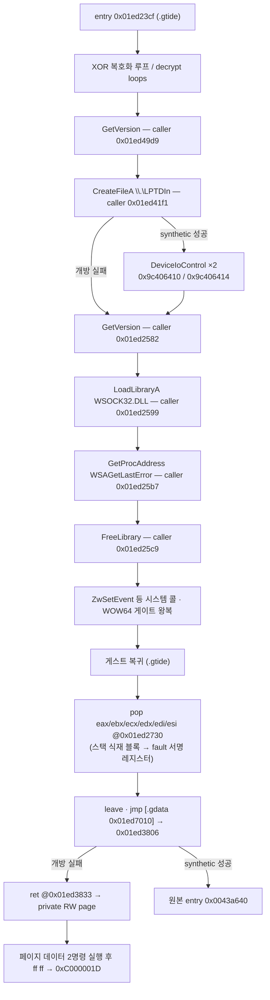

# EZ2DJ 실행 파일 구조 / EZ2DJ Executable Structures

주제: 원본 EZ2DJ 실행 파일 각각의 PE 구조, 보호 계층 해부, 데이터 인벤토리, 관찰된 런타임 흐름. 새 실행 파일이 확인될 때마다 이 문서에 섹션 하나를 추가해 누적한다.

*Topic: the PE structure, protection anatomy, data inventory, and observed runtime flow of each original EZ2DJ executable. Whenever a new executable is identified, add one section here.*

측정 도구: `re2dj_pe_analyzer <file>` (헤더·섹션·데이터 디렉터리), `re2dj_hdd_probe <dir>` (덤프 식별), `re2dj_windows_x86_launcher_probe` (런타임 관찰, `--api-trace` 등). import 함수 목록은 [import 표면 분석](ez2dj-import-surface.md)이, 덤프 디렉터리 구조와 실행 파일 식별 근거는 [HDD 레이아웃 분석](ez2dj-hdd-layout.md)이 담당한다. 이 문서는 실행 파일 단위 구조만 담는다.

*Measurement tools: `re2dj_pe_analyzer <file>` (headers, sections, data directories), `re2dj_hdd_probe <dir>` (dump identification), `re2dj_windows_x86_launcher_probe` (runtime observation via `--api-trace` and friends). The import function lists live in the [import surface analysis](ez2dj-import-surface.md); dump directory structure and executable identification live in the [HDD layout analysis](ez2dj-hdd-layout.md). This document carries per-executable structure only.*

## 표기 규칙 / Notation

모든 서술은 확인됨 / 추정 / 미확정 중 하나로 표기한다. 확인됨에는 측정 방법을, 추정에는 근거를, 미확정에는 확인 방법을 함께 적는다.

*Every statement is marked confirmed, inferred, or unresolved, with the measurement method, evidence, or the way to find out.*

---

## 공통 특성 / Common traits

**확인됨.** 다섯 실행 파일 전부 `PE32 / i386 / Windows GUI (subsystem 2, 버전 4.0)`, image base `0x00400000`, section alignment `0x00001000`, file alignment `0x00001000`, size of headers `0x00001000`, `dll flags 0x0000`이다. `dll flags 0`은 `DYNAMIC_BASE`(ASLR)와 `NX_COMPAT`(DEP) 어느 쪽도 선호하지 않는다는 뜻이다.

*Confirmed. All five executables are PE32 / i386 / Windows GUI (subsystem 2, version 4.0) at image base 0x00400000 with 0x1000 section/file alignment, 0x1000 header size, and dll flags 0x0000 — meaning no ASLR (`DYNAMIC_BASE`) and no DEP opt-in (`NX_COMPAT`).* 

**확인됨.** `ez2dj1.exe`와 `ez2dj.exe`의 PE TimeDateStamp가 `0x3862df27`로 동일하다. 보호 처리가 타임스탬프를 보존했을 가능성과 함께, 두 파일이 같은 원본 빌드의 관계라는 기존 결론([HDD 레이아웃](ez2dj-hdd-layout.md) 3절)을 뒷받침한다.

*Confirmed. `ez2dj1.exe` and `ez2dj.exe` share the identical PE TimeDateStamp `0x3862df27`, supporting both timestamp preservation by the protection step and the earlier conclusion that the protected file wraps the same underlying build.*

| 파일 | 타임스탬프 | 덤프 |
| --- | --- | --- |
| `ez2dj1.exe` | `0x3862df27` | 1st SE |
| `ez2dj.exe` | `0x3862df27` | 1st SE |
| `Test.exe` | `0x38607297` | 1st SE |
| `PlzPowerOff.exe` | `0x3700321a` | 1st SE |
| `EZ2DJ.EXE` | `0x3baea943` | 3rd |

---

## 1. `ez2dj1.exe` — 1st SE bring-up 빌드 (보호 없음)

### 1.1 헤더와 섹션 — 확인됨

`re2dj_pe_analyzer`로 확인. entry point RVA `0x0003a640`은 `.text` 안에 있고, SizeOfImage는 `0x01ad1000`이다. import directory는 표준 위치 `.idata`(RVA `0x01aba000`, 크기 `0x00000fa4`)에 있다. base relocation data directory는 `{RVA 0, Size 0}`로 비어 있으므로 선호 주소 `0x00400000`에 고정 적재해야 한다.

*Verified with `re2dj_pe_analyzer`. The entry RVA 0x0003a640 lies in `.text`; SizeOfImage is 0x01ad1000; the import directory sits at the standard `.idata` (RVA 0x01aba000, size 0x00000fa4); and the base-relocation directory is empty, so the image must load at its preferred base.*

| 섹션 | VA | VSize | Raw Off | Raw Size | Flags |
| --- | --- | --- | --- | --- | --- |
| `.text` | `0x00001000` | `0x00052540` | `0x00001000` | `0x00053000` | code, exec, read |
| `.rdata` | `0x00054000` | `0x00007571` | `0x00054000` | `0x00008000` | data, read |
| `.data` | `0x0005c000` | `0x01a5d2f8` | `0x0005c000` | `0x0000d000` | data, read, write |
| `.idata` | `0x01aba000` | `0x00000fa4` | `0x00069000` | `0x00001000` | data, read, write |
| `.reloc` | `0x01abb000` | `0x00015094` | `0x0006a000` | `0x00016000` | discardable |

**추정.** `.data`는 raw 52 KB에 비해 가상 27 MB다. 파일에서 오지 않는 약 27 MB는 0으로 채워지는 정적 버퍼일 가능성이 높다(게임 자산용 추정). 실제 용도는 실행해야 확인된다.

*Inferred. `.data` is 52 KB raw against ~27 MB virtual; the zero-filled remainder is likely a static buffer for game assets, pending a run.*

### 1.2 import — 확인됨

7개 DLL, 144개 함수. 전체 목록과 HLE 우선순위는 [import 표면 분석](ez2dj-import-surface.md) 1~8절.

*Seven DLLs, 144 functions; see the import surface analysis.*

---

## 2. `ez2dj.exe` — 1st SE 정식 실행 파일 (보호됨)

### 2.1 헤더와 섹션 — 확인됨

entry point RVA `0x01ad23cf`는 마지막 코드 섹션 `.gtide` 안에 있고, SizeOfImage는 `0x01ada000`이다. import directory는 `.gidata`(RVA `0x01ad8000`)로 옮겨져 있고 IAT directory도 `0x01ad80a0`에 있다. base relocation directory는 보이지 않는다(`ez2dj1.exe`와 마찬가지로 선호 주소 고정으로 추정 — 확인 방법: relocation directory 값을 직접 읽기).

*The entry RVA 0x01ad23cf lies in the last code section `.gtide`; SizeOfImage is 0x01ada000; the import directory moved into `.gidata` (RVA 0x01ad8000) with the IAT directory at 0x01ad80a0; no base-relocation directory is visible (preferred-base load inferred, as with ez2dj1.exe — confirm by reading the relocation directory directly).*

| 섹션 | VA | VSize | Raw Off | Raw Size | Flags |
| --- | --- | --- | --- | --- | --- |
| `.text` | `0x00001000` | `0x00052540` | `0x00001000` | `0x00053000` | code, exec, read |
| `.rdata` | `0x00054000` | `0x00007571` | `0x00054000` | `0x00008000` | data, read |
| `.data` | `0x0005c000` | `0x01a5d2f8` | `0x0005c000` | `0x0000d000` | data, read, write |
| `.idata` | `0x01aba000` | `0x00000fa4` | `0x00069000` | `0x00001000` | data, read, write |
| `.reloc` | `0x01abb000` | `0x00015094` | `0x0006a000` | `0x00016000` | discardable |
| `.gtide` | `0x01ad1000` | `0x0000596e` | `0x00080000` | `0x00006000` | code, exec, read |
| `.gdata` | `0x01ad7000` | `0x00000c00` | `0x00086000` | `0x00001000` | data, read, write |
| `.gidata` | `0x01ad8000` | `0x00001100` | `0x00087000` | `0x00002000` | data, read, write |

앞의 다섯 섹션은 `ez2dj1.exe`와 VA·크기가 정확히 같다. 보호 계층은 원본 이미지 뒤에 `.gtide`(코드 스텁), `.gdata`(보호 데이터), `.gidata`(import 재배치)를 덧붙인 형태다.

*The first five sections match `ez2dj1.exe` exactly; the protection appends `.gtide` (stub code), `.gdata` (protection data), and `.gidata` (relocated imports) behind the original image.*

### 2.2 `.gidata` — import 재배치 — 확인됨

import directory(RVA `0x01ad8000`)와 IAT(RVA `0x01ad80a0`)를 직접 해석한 결과: KERNEL32(원본 97개급 전체 + 보호 특화 추가), USER32, GDI32, ADVAPI32(`RegFlushKey`), DSOUND(ordinal 1), WINMM, DDRAW. 보호 특화 추가 목록과 슬롯 VA는 [import 표면 분석](ez2dj-import-surface.md) 9절에 있다. 런타임에 관찰된 동적 해석은 `GetProcAddress(wsock32, "WSAGetLastError")` 하나뿐이다.

*Parsing the directory directly: KERNEL32 (the full original surface plus protection-flavored additions), USER32, GDI32, ADVAPI32, DSOUND ordinal 1, WINMM, DDRAW. The protection-specific additions and slot VAs are in the import surface analysis; the only dynamic resolution observed at runtime is GetProcAddress for WSAGetLastError.*

### 2.3 `.gtide` — 보호 스텁 해부 — 확인됨

정적 덤프(파일 오프셋 `0x80000` 기준)에서 다음이 확인됐다.

*From the static dump (file offset 0x80000 base):*

1. **안티디스어셈블 점프.** `eb 01 e8`, `eb 03` 같은 짧은 `jmp`가 코드 전반에 깔려 직후의 쓰레기 바이트(`e8` 등)를 건너뛴다. 선형 디스어셈블러를 무너뜨리는 패턴이다.
2. **XOR 복호화 루프.** entry `0x01ed23cf` 직후와 여러 함수에서 `mov cl,[eax+reg]; xor cl,[ebp-key]; mov [eax+reg],cl; jmp back` 형태의 바이트 단위 복호화 루프가 보인다.
3. **정적으로 일관된 헬퍼 하나.** `0x01ed2504` 근처의 함수는 정적으로 온전히 해석된다: 인자가 `-1`이면 `-1` 반환, `_lread`(IAT 슬롯 `0x01ed8228`)로 10바이트 읽기, 바이트 XOR 루프, `0x646c6f47`(`"Gold"`)과 `0x6f736e65`(`"enso"`) 8바이트 매직 비교, 결과를 `[ebp+0x10]`에 기록.
4. **자기 수정 확인.** 런타임 caller 주소들(`0x01ed2582`, `0x01ed2599`, `0x01ed25b7`, `0x01ed25c9`)의 정적 opcode는 관찰된 호출(`GetVersion`, `LoadLibraryA`, `GetProcAddress`, `FreeLibrary`)과 어긋난다. 실행 시점의 `.gtide` 바이트는 파일과 다르다.

*Anti-disassembly short jumps skip junk bytes throughout; XOR byte-decrypt loops appear at the entry and in several functions; one helper near 0x01ed2504 parses coherently (arg −1 early return, `_lread` of 10 bytes via IAT slot 0x01ed8228, XOR loop, 8-byte magic compare against "Gold"/"enso"); and the runtime caller addresses decode to different calls than the static bytes, confirming self-modification.*

**확인됨.** TLS data directory는 없다. 따라서 진입 전 TLS callback이 `.gtide`를 고친 가능성은 배제된다.

*Confirmed: there is no TLS data directory, so pre-entry TLS-callback modification is excluded.*

**미확정.** `.gtide` 섹션 플래그는 write 비트가 없는데도 런타임 바이트가 바뀌었다. 수정 경로(직접 쓰기가 허용된 환경 요인인지, 관찰 시작 이전 수정인지, 다른 우회인지)는 확인되지 않았다. 확인 방법: entry 직전 정지 시점에 `.gtide` 체크섬을 파일과 비교하고, 이후 시점마다 재비교.

*Unresolved: `.gtide` carries no write flag yet its runtime bytes changed. The modification route (environment that permits direct writes, modification before observation starts, or another bypass) is unknown; verify by checksumming `.gtide` against the file at the pre-entry stop and re-comparing at later points.*

### 2.4 `.gdata` — 문자열·데이터 인벤토리 — 확인됨

파일 오프셋 기준 `0x869b0`~`0x86aa0` 구간을 직접 읽었다. VA 변환은 `VA = 오프셋 + 0x01E51000`이다.

*Read directly from file offsets 0x869b0–0x86aa0; VA = offset + 0x01E51000.*

| VA | 내용 | 런타임 대조 |
| --- | --- | --- |
| `0x01ed79b0` | `".gdata"` 문자열 (패커 흔적) | — |
| `0x01ed79b8` | `"WSOCK32.DLL"` | `LoadLibraryA` 인자와 **일치** |
| `0x01ed79c4` | `"WSAGetLastError"` | `GetProcAddress` 인자와 **일치** |
| `0x01ed79dc` / `0x01ed79e8` | `"WSOCK32.DLL"` / `"WSAGetLastError"` (두 번째 쌍) | 미관찰 |
| `0x01ed79f0` | `"MSVBVM50.DLL"` | 미관찰 |
| `0x01ed7a06`~`0x01ed7a17` | 비ASCII 메시지 바이트 (EUC-KR 추정) | 미관찰 |
| `0x01ed7a18` | `"MSVBVM50.DLL"` (두 번째) | 미관찰 |
| `0x01ed7a2c` | `".gdata"` 문자열 | — |
| `0x01ed7a34` | `"\\.\TDSD.VXD"` | 미관찰 |
| `0x01ed7a44` | dword `1` | — |
| `0x01ed7a4c` | `"\\.\LPTDI0"` | **같은 주소가 런타임에 `"\\.\LPTDI1"`로 관찰됨** |
| `0x01ed7a5c`~`0x01ed7a87` 부근 | 해시성 blob 바이트들 | 미관찰 |
| `0x01ed7a9c` | dword `0xc0e92228` | — |

**확인됨.** `0x01ed7a4c`의 문자열은 파일에는 `\\.\LPTDI0`인데, `--api-trace` 실행에서 같은 주소를 가리키는 `CreateFileA` 첫 인자가 `\\.\LPTDI1`로 디코딩됐다(JSON sanitizing으로 `\`가 `.`로 표기된 `....LPTDI1`). 보호 코드가 포트 번호 자리를 실행 중에 바꿔 쓴다는 뜻이다. `\\.\TDSD.VXD`·`\\.\LPTDI*`·덤프 루트의 비활성 `Tdsd.vxd111`이 함께 보호·I/O 검사 장치 후보다.

*Confirmed: the string at 0x01ed7a4c is `\\.\LPTDI0` in the file, but the `CreateFileA` first argument pointing at the same address decoded as `\\.\LPTDI1` in an `--api-trace` run — the protection rewrites the port digit at runtime. Together with `\\.\TDSD.VXD`, the `\\.\LPTDI*` family, and the disabled `Tdsd.vxd111` at the dump root, these are the candidate protection/I-O check devices.*

**추정.** `MSVBVM50.DLL` 문자열 두 쌍과 매직 비교(`"Gold"`/`"enso"`), 해시 blob은 동글 응답 검증이나 라이선스 데이터일 가능성이 있다. 근거는 문자열 구성뿐이며 목적은 실행 관찰로 확인해야 한다.

*Inferred: the MSVBVM50.DLL pairs, the magic compare, and the hash blobs look like dongle-response or license data, but the evidence is the string composition alone.*

### 2.5 관찰된 런타임 흐름 — 확인됨

`--api-trace`와 언로드 종반 single-step(`--api-trace` 확장)으로 관찰한 흐름이다. caller 주소는 실행마다 동일했다. 근거는 [작업 로그 20260823-042](../work-logs/20260823-042-protected-api-observation-trace.md)와 [HDD 레이아웃 분석](ez2dj-hdd-layout.md) 3절이다.

*Observed via `--api-trace` plus the unload-tail single-step extension; caller addresses repeat across runs. Evidence lives in work log 20260823-042 and the HDD layout analysis.*

fault 전에 `VirtualAlloc`·`VirtualProtect` 호출은 관찰되지 않았다. fault 서명은 실행마다 동일하다: `EBX` = fault page base, `ECX=EDX=ESI=EDI` = entry VA `0x01ed23cf`, `EAX` = `0x001affcc`(debugger 없는 실행의 종료 코드와 동일), `EBP` = kernel32 내부 주소, `ESP` = `0x001aff80`. fault page 내용은 `{0x00010000, 0xffffffff, 0x00400000, ntdll 포인터들, ...}` 구조이고, allocation base `0x00200000`의 기존 process heap 안에 있다.

정밀 관찰([작업 로그 20260823-044](../work-logs/20260823-044-protected-fault-path-precision.md)), 복귀 추적([20260823-045](../work-logs/20260823-045-post-gate-resume-trace.md)), 종료 귀속 관찰([20260823-046](../work-logs/20260823-046-teardown-attribution.md))로 다음이 확인됐다.

1. **전환 직전의 시스템 콜은 `ntdll!ZwSetEvent`다.** 샘플 심볼 해석에서 스텁 주소가 `ZwSetEvent+0x0`과 정확히 일치하고, `mov eax,0x7000e; mov edx,&thunk; call edx; ret 8` 패턴이 NtSetEvent의 두 인자(`ret 8`)와 맞다.
2. **fault 시점 보고 컨텍스트는 32비트 모드다.** `cs=0x0023, ds/es/gs/ss=0x002b, fs=0x0053`.
3. **WOW64 게이트 통과 순간 single-step 보고가 끊긴다.** TF가 전환을 살아남지 못하며, 스텁 복귀 주소의 software breakpoint로 복귀를 잡아 TF를 재무장하면 이후 구간을 다시 추적할 수 있다(재무장 가능하게 하여 4회의 게이트 왕복을 모두 포착).
4. **복귀 시점 stack에는 ws2_32/wsock32 프레임이 없다.** `KERNELBASE!FreeLibrary+0x16`과 `ntdll!LdrUnloadDll+0x15d`만 보이므로 ZwSetEvent·힙 파괴 구간은 LdrUnloadDll 자체의 마무리 처리 안에서 실행된다(ws2_32 detach 코드가 아님).
5. **fault 서명 값은 스텁이 식재한 stack 블록이다.** entry VA 참조 탐색이 stack 위 `{LdrUnloadDll+0x166, entry ×5, page base}` 연속 블록(`0x001aff08`~)과 `{page base, entry ×3}` 블록들을 찾았고(20 match 중 15 run), 이는 fault 레지스터(ECX=EDX=ESI=EDI=entry, EBX=page)와 정확히 같은 배치다.
6. **최종 전송은 게스트 코드 자신이 수행한다.** 시스템 콜 왕복 후 `.gtide`로 돌아온 스텁은 `0x01ed2730`에서 `pop eax; pop ebx; pop ecx; pop edx; pop edi; pop esi; leave`로 식재 블록을 그대로 레지스터에 복원하고(fault 서명 완성), `leave` 뒤 `jmp dword [0x01ed7010]`(.gdata 포인터)로 `0x01ed3806`에 도착, 플래그 `[0x01ed7074]` 검사 뒤 `0x01ed3833`의 `ret`으로 private RW page(page base)에 점프한다.
7. **page 내용은 코드가 아니어서 두 명령을 우연 실행한 뒤 죽는다.** page 선두 `{0x00010000, 0xffffffff, image base, ntdll 포인터}` 구조에서 `add [eax],...` 두 명령이 DEP 부재 환경에서 실행되고 `ff ff`에서 #UD가 난다.
8. **LPTDI 개방 성공은 실패 분기를 우회한다.** [작업 48](../work-logs/20260824-048-lptdi-mock-open.md)의 mock-off/on 각 2회 비교에서 off는 실행별 private page(`0x00393004`, `0x0023f004`)의 #UD를 재현했다. on은 `CreateFileA` kernel32 호출 없이 synthetic handle `0xFEED0001`을 받고 IOCTL `0x9c406410`·`0x9c406414`를 호출한 뒤, 두 번 모두 `.gtide`에서 원본 entry `0x0043a640`으로 넘어갔다. 이어 원본 `.text` caller의 `GetVersion`·`VirtualAlloc`·`GetProcAddress`가 관찰됐다.
9. **원본 초기화 AV는 손상된 `.data` initializer slot 호출이다.** [작업 49](../work-logs/20260824-049-original-init-av-attribution.md)의 두 실행에서 execute AV `0x19d521bd`, `EAX=ECX=EDX=0x0045c008`, `[EDX]=0x19d521bd`가 동일했다. stack return `0x0043b688` 주변 runtime bytes는 비보호 동형 빌드의 `0x0043b683: call dword ptr [edx]`와 일치한다. 그 함수는 `[0x0045c008, 0x0045c014)`의 nonzero initializer를 호출한다. 비보호 배열 `{0, 0x0043c600, 0x0044e710, 0}`과 달리 canonical runtime의 `0x0045c000`부터 8 dword는 `{0xb9f5c1dd, 0x69e5f14d, 0x19d521bd, 0xc908172d, 0x79f968ad, 0x29a5b10d, 0xd995e17d, 0x89c8d81d}`로 두 실행에서 동일했다.
10. **두 IOCTL은 실패하고 어떤 출력도 쓰지 않는다.** [작업 50](../work-logs/20260824-050-device-io-control-return-trace.md)의 두 실행에서 `0x9c406410`(input 4, output 8)과 `0x9c406414`(input 24, output 104)는 모두 `EAX=0`, bytes-returned 무변화, input/output buffer 무변화였다. 첫 input 4바이트와 두 번째 input의 nonzero challenge 필드는 실행마다 달랐다. IOCTL code를 CTL_CODE bitfield로 해석하면 vendor device type `0x9c40`, read access, `METHOD_BUFFERED`, 연속 function `0x904`·`0x905`다. 이는 고정 presence query보다 challenge-response protocol을 지지하지만 올바른 output 의미는 미확정이다.
11. **0바이트 성공은 제어 흐름을 바꾸지만 유효한 성공 응답이 아니다.** [작업 51](../work-logs/20260824-051-lptdi-ioctl-zero-success.md)에서 두 IOCTL에 output 무변화, bytes-returned 0, `TRUE`를 반환했다. 두 API-trace 실행은 원본 entry와 initializer AV에 도달하지 않고 WSOCK32 해제 뒤 기존 private-page 종료 choreography로 돌아가 실행별 `0x002d6004`, `0x00209004`에서 #UD가 났다. exit-break 실행도 `0x0038b004`, 종료 코드 `0xc000001d`를 재현했다. BOOL은 보호 분기에 인과적으로 관여하지만 정상 경로에는 실제 response data도 필요하다.
12. **full bytes-returned도 유효 payload를 대체하지 못한다.** [작업 52](../work-logs/20260824-052-lptdi-hasp-response-contract.md)에서 호출 전 output을 유지하고 각각 8/104 bytes와 `TRUE`를 반환했다. 두 실행은 원본 entry 전에 기존 private-page 경로로 돌아가 `0x00310004`, `0x00237004` #UD로 끝났다. 공개 HASP4 `HaspCode`의 4-byte seed→4×16-bit output은 첫 IOCTL shape와 맞지만, classic HASP의 공개 device path `\\.\HASP`와 28-byte call packet은 LPTDI 전체 인터페이스와 다르다. HASP 계열 가능성은 유력한 추정이며 vendor와 payload는 미확정이다.
13. **첫 8바이트 output의 첫 DWORD 소비 위치가 확인됐다.** [작업 53](../work-logs/20260824-053-lptdi-post-ioctl-trace.md)의 full-size preserving trace에서 `0x9c406410`은 세 번 호출됐다. 매 복귀 뒤 `0x01ed4253: cmp dword ptr [ebp-0x70], ebx`가 output 첫 DWORD를 0과 비교한다. 세 번째 시도 뒤 `0x01ed4279: mov eax, dword ptr [ebp-0x70]`가 그 값을 반환하고, 상위 `0x01ed4d0d`, `0x01ed2b85`가 nonzero 여부를 다시 검사한다. 보존된 bytes `f8 0f 0f 77 ...`의 첫 DWORD는 little-endian `0x770f0ff8`로 그대로 전달됐다. 두 512-step 실행의 호출별 주소/바이트 흐름은 112, 112, 394 sample로 동일했다. 이 구간은 첫 DWORD의 zero/nonzero 소비 계약만 확인하며, 8바이트 전체의 HASP code 의미나 정상 response 생성 규칙은 여전히 미확정이다.
14. **첫 IOCTL의 다음 단계 통과값은 첫 DWORD 0이다.** [작업 54](../work-logs/20260824-054-lptdi-external-response-profile.md)의 외부 profile 반복 실행에서 8바이트 zero response는 `0x9c406410`을 한 번만 호출하고 `0x9c406414`로 진행했다. 반면 첫 DWORD 1 response는 `0x9c406410`을 정확히 세 번 호출하고 두 번째 IOCTL 없이 private-page #UD로 끝났다. zero 실행에서 profile에 없는 `0x9c406414`는 `FALSE`를 반환했으며, 이후 원본 `.text`에 도달해 두 번 모두 동일한 initializer execute AV `0x19d521bd`와 손상된 `.data` window를 재현했다. 따라서 첫 DWORD 0은 첫 단계 통과에 충분하지만 전체 보호 해제에는 충분하지 않으며, 다음 미확정 계약은 104바이트 두 번째 output이다.
15. **두 번째 IOCTL은 DWORD0=0일 때 output offset 4~11로 8바이트 상태를 만든다.** [작업 55](../work-logs/20260824-055-lptdi-second-response-consumption.md)의 두 all-zero 실행에서 `0x01ed4dd5`가 DWORD0을 0과 비교한 뒤, `0x01ed4df2`가 offset 4~11을 차례로 읽었다. 각 바이트는 `0x01ed4dfc`에서 두 번째 IOCTL input seed를 두 번 변환해 얻은 8바이트 mask와 XOR되고, `0x01ed4e07`에서 `[0x01ed7bf4]`가 가리키는 상태에 기록됐다. all-zero payload는 고정 AV `0x19d521bd`를 실행별 `0xd3e72bdf`, `0x0c5c6c3c`로 바꾸고 `.data` window도 바꿨으므로 이 8바이트가 `.data` 복원에 인과적으로 관여한다. DWORD0=1 canonical 두 실행은 loop를 건너뛰고 private-page #UD(`0x003d4004`, `0x002fc004`)로 끝났다. 104바이트 중 offset 0과 4~11 이외는 이 경로에서 읽힌 증거가 없으며, 올바른 응답 생성 규칙은 미확정이다.
16. **challenge mask 변환과 8바이트 상태의 결정성이 확인됐다.** [작업 56](../work-logs/20260824-056-lptdi-adaptive-target-state.md)은 `0x01ed4141`의 runtime 명령에서 32비트 변환을 복원했다. 두 번째 input DWORD에 이 변환을 두 번 연속 적용한 little-endian 8바이트가 response offset 4~11과 XOR된다. 적응형 응답으로 target state를 zero로 고정한 두 실행은 seed `0x7cd97507`, `0x5d7f6e64`에 각각 다른 payload를 반환했지만, 모두 같은 AV `0x19d521bd`와 같은 `.data` window를 재현했다. 따라서 실행별 challenge가 `.data`에 주던 변동은 이 8바이트 상태를 통해 전달되며, 다음 미확정 값은 정상 initializer를 만드는 고정 target state다. 이 변환을 공식 HASP/Hardlock 알고리즘으로 식별하지는 않았다.
17. **정상 `.data` 복원 상태는 최소값 `0900000000000000`이다.** [작업 57](../work-logs/20260824-057-lptdi-target-state-inversion.md)의 4096-step trace에서 `0x01ed2bd0`~`0x01ed2bd5`가 상태 첫 DWORD를 `0x01ed7296`에 seed하고, `0x01ed2742`가 매 바이트 같은 변환으로 갱신하며, `0x01ed26c1`~`0x01ed26ce`가 그 하위 바이트를 보호 raw에서 빼는 흐름이 확인됐다. 보호/비보호 첫 64바이트 차이는 초기 하위 바이트 `0x09`의 출력열과 64/64 일치했다. `0900000000000000` 두 실행은 initializer `{0, 0, 0, 0x0043c600, 0x0044e710, 0, 0, 0x0043c730}`을 반복 복원하고 기존 AV 없이 ExitProcess breakpoint에 도달했다. 상위 24비트와 두 번째 DWORD의 필요성은 이 경로에서 관찰되지 않았다. 이 값은 현재 바이너리의 최소 복원 상태이며 물리 동글 key나 공식 vendor 알고리즘으로 확정하지 않는다.
18. **첫 자산 API 전의 다음 경계는 640×480×16 display-mode 실패다.** [작업 58](../work-logs/20260824-058-first-original-asset-api.md)의 host/VFS 비교에서 `RegisterClassA`·`CreateWindowExA`·`ShowWindow`·`UpdateWindow`는 모두 실행됐다. 이후 `0x00437894`가 `SetCurrentDirectoryA("c:\\ez2dj")`를 호출하고, `0x00437cba`가 640×480×16 `DEVMODEA`로 `ChangeDisplaySettingsExA`를 호출했다. 반환 뒤 코드는 성공 0과 restart 1 어느 쪽도 아닌 분기로 `0x0041f257: PostQuitMessage(0)`에 도달했다. 두 실행 모두 파일 API 없이 `ExitProcess` return `0x0043b63f`로 끝났다. VFS 정책과 무관한 표시 초기화 경계이며 정확한 음수 DISP_CHANGE 값은 아직 직접 기록하지 않았다.
19. **Direct3D 3 초기화 HLE 뒤 최초 경계는 port `0x103` input이다.** [작업 61](../work-logs/20260825-061-direct3d3-opengl-hle.md)의 최종 두 실행은 가상 HAL과 논리 surface/device/viewport로 다섯 graphics stage를 전부 통과해 기존 `0x00422f39` AV를 제거했다. 다음 예외는 두 번 모두 `0x00419609`가 port `0x103`을 인자로 `0x00438980`을 호출하고, `0x00438987: in al,dx`를 실행한 지점의 `0xc0000096`이었다. caller는 이어서 `0x104`, `0x105`도 읽도록 작성돼 있다. 이는 첫 3D 초기화 경계가 제거됐음을 확인하지만 port 값의 장치 의미는 확정하지 않는다.
20. **port 호출 계약과 idle HLE 통과가 확인됐다.** [작업 62](../work-logs/20260825-062-legacy-io-port-hle.md)의 정적 확인에서 `0x101`, `0x102`, `0x106` read는 bitwise NOT 뒤 24개 boolean으로 풀리므로 active-low이다. `0x103`~`0x105`는 이전값과 비교되고 세 번째 byte는 modulo-256 delta에 쓰인다. byte output은 `0x100`~`0x103`, `0x106`에 기록된다. 공용 idle state `ff ff 00 00 00 ff`를 사용한 최종 두 실행은 `0x103`~`0x105` read를 처리하고 privileged exception과 `av_access` 없이 같은 `ExitProcess` return `0x00424061`에 도달했다. port의 물리 배선과 button/axis/output 의미는 **미확정**이다.
21. **controlled exit의 실제 원인은 `coin0.wav` KSND load 실패다.** [작업 63](../work-logs/20260825-063-controlled-exit-attribution.md)은 공유 종료 helper `0x00424040`의 EBP frame을 ExitProcess breakpoint에서 읽었다. 최종 두 실행 모두 caller `0x00424813`, format `KSND(ksndLoadSound) : failed to load %s`, detail `coin0.wav`를 기록했고 `av_access`는 없었다. 정적 caller는 `0x00423f70` search-path lookup이 1을 반환할 때 이 종료 경로를 선택한다. HDD에는 `System/Common/coin0.wav`가 실제로 존재한다. search-path 등록 수와 실제 `CreateFileA` 후보가 아직 관찰되지 않았으므로 VFS failure인지 search-path 초기화 failure인지는 **미확정**이다.
22. **KSND search-path는 정상 등록됐고 VFS mount root가 한 단계 위다.** [작업 64](../work-logs/20260825-064-ksnd-search-path-observation.md)의 두 실행은 count 1과 entry `System/Common`을 동일하게 기록했다. 주입 runtime은 이를 `roms/ez2dj1stse/System/Common/coin0.wav`로 host `CreateFileA`에 전달했지만 실제 파일은 `roms/ez2dj1stse/ez2dj/System/Common/coin0.wav`에 있다. 따라서 현재 실패는 search-path 초기화가 아니라 launcher가 dump root를 VFS root로 주입한 데서 생긴 **확인된 mount-root 불일치**다. 수정 뒤 다음 자산/API 경계는 아직 미확정이다.
23. **working-directory mount 수정 뒤 최초 자산 load가 통과하고 다음 null AV가 드러났다.** [작업 65](../work-logs/20260825-065-target-working-directory-vfs-mount.md)는 target profile의 `ez2dj` working directory를 VFS source root로 주입했다. 최종 두 실행 모두 `System/Common/coin0.wav`, `coin1.wav`, `System/WarningMsg/WarningMsg.bmp` host 후보를 기록한 뒤 `0x0042292b`에서 null read AV가 발생했다. 레지스터는 두 번 모두 `ECX=0`, `EIP=0x0042292b`였고 instruction bytes `8b 11 ff 52 44`는 null interface의 vtable slot 호출 형태다. 이 객체의 종류와 생성 실패 원인은 **미확정**이다.
24. **null 객체는 RGB565 DirectDraw texture surface였고, 다음 경계는 DrawPrimitive다.** [작업 66](../work-logs/20260825-066-texture-surface-gdi-hle.md)의 정적 분석은 `0x0042285e`를 `IDirectDraw4::CreateSurface`, descriptor flags `0x00101007`, caps `DDSCAPS_TEXTURE`, `0x0042292b`를 surface `GetDC`로 확인했다. 이어 `ReleaseDC`, `SetColorKey(DDCKEY_SRCBLT)`, IID가 확인된 `IDirect3DTexture2` QueryInterface가 호출된다. surface HLE 뒤 처음 드러난 null Blt slot도 확인된 `DDBLT_COLORFILL`로 구현했다. 최종 두 실행은 두 AV를 모두 제거하고 return `0x0042325f`에서 vtable `+0x70`, 즉 `IDirect3DDevice3::DrawPrimitive` null slot execute AV를 동일하게 기록했다. primitive type 5, vertex type `0x1c4`, count 4이며 정확한 FVF 의미와 vertex 변환은 다음 작업에서 확정한다.

결론: 종료는 우연한 손상이 아니라 **LPTDI 보호 응답에 따라 스텁이 선택하는 계획된 실패 경로**다. 개방 성공과 host IOCTL 실패 조합은 손상된 `.data` initializer slot AV를 일으키고, IOCTL TRUE와 빈 output 조합은 private-page #UD로 돌아간다. 실행별 challenge mask를 상쇄해 최소 target state `0900000000000000`을 만들면 정상 `.data` initializer가 복원되고 기존 AV가 제거된다. 물리 동글의 원래 wire-response 알고리즘과 vendor 귀속은 여전히 미확정이다.

*Precision observation, resume tracing, and teardown attribution confirmed seven facts: (1) the pre-transition syscall is exactly ntdll!ZwSetEvent; (2) the fault-time synthesized context reports 32-bit user segments; (3) single-step reporting dies at each gate but a software breakpoint on a detected stub's return address re-arms tracing — with repeatable arming all four gate crossings were caught; (4) the resume-time stack holds KERNELBASE!FreeLibrary+0x16 and ntdll!LdrUnloadDll+0x15d with no ws2_32/wsock32 frames, so the event-signal and heap-destroy stretch runs inside LdrUnloadDll's own finalization rather than ws2_32 detach code; (5) the fault-signature values live in stub-planted stack blocks — the entry scan found {LdrUnloadDll+0x166, entry×5, page-base} and {page-base, entry×3} runs matching the register layout exactly; (6) after returning into .gtide the stub itself executes pop eax/ebx/ecx/edx/edi/esi + leave at 0x01ed2730, restoring precisely that signature, then jmp through its .gdata pointer table to 0x01ed3806 and finally ret at 0x01ed3833 onto the private RW page; and (7) the page data is not code — two accidental add instructions execute before ff ff raises #UD.*

*Task 48 adds an eighth confirmed fact: in two matched pairs, mock-off reproduced #UD on run-varying private pages, while mock-on intercepted CreateFileA, passed synthetic handle 0xFEED0001 through IOCTLs 0x9c406410 and 0x9c406414, and reached original entry 0x0043a640 in both runs. Original .text then called GetVersion, VirtualAlloc, and GetProcAddress before a stable execute access violation at 0x19d521bd. Failed LPTDI open is therefore causally responsible for selecting the private-page failure path; the narrower "skipped decryption" mechanism remains inferred because success bypasses that page rather than filling it.*

*Task 49 confirms the later AV as an indirect call through a corrupt `.data` initializer slot. Both runs report execute AV 0x19d521bd with EAX=ECX=EDX=0x0045c008 and `[EDX]=0x19d521bd`; runtime code around return 0x0043b688 matches `call dword ptr [edx]` at 0x0043b683 in the sibling unprotected build. The eight-dword canonical runtime window is stable but differs completely from the unprotected initializer array. The limited `.text` call site is restored while this `.data` region is not.*

*Task 50 confirms that both IOCTLs fail without writing any output. Across two runs, 0x9c406410 (input 4/output 8) and 0x9c406414 (input 24/output 104) return EAX zero with unchanged bytes-returned and unchanged buffers. Challenge input fields vary by run. CTL_CODE decoding gives vendor device type 0x9c40, read access, METHOD_BUFFERED, and consecutive functions 0x904/0x905. This supports a challenge-response protocol rather than a fixed presence query, while the correct output semantics remain unresolved.*

*Task 51 confirms that zero-byte success changes control flow but is not a valid success response. Returning TRUE, zero bytes, and unchanged output for both IOCTLs prevented both canonical runs from reaching the original entry or the later initializer AV. After WSOCK32 unload they instead returned to the existing private-page teardown choreography and raised #UD at per-run addresses 0x002d6004 and 0x00209004; an exit-break run independently ended with 0xc000001d at 0x0038b004. The BOOL is causally relevant, but valid response data is also required.*

*Task 52 confirms that full bytes-returned cannot replace valid payload. Preserving the pre-call output while returning TRUE and 8/104 bytes sent both runs back to the pre-original-entry private-page path, ending in #UD at 0x00310004 and 0x00237004. Public HASP4 HaspCode's four-byte seed to four 16-bit values matches the first IOCTL shape, but classic HASP's published `\\.\HASP` path and 28-byte call packet differ from the complete LPTDI interface. HASP remains a strong inference; the vendor and payload are unresolved.*

*Task 53 confirms where the first DWORD of the eight-byte output is consumed. Full-size-preserving traces call 0x9c406410 three times. After each return, `0x01ed4253: cmp dword ptr [ebp-0x70], ebx` compares the first output DWORD with zero. After the third attempt, `0x01ed4279: mov eax, dword ptr [ebp-0x70]` returns it, and callers at 0x01ed4d0d and 0x01ed2b85 test it for nonzero again. The preserved bytes begin with little-endian 0x770f0ff8 and propagate unchanged. Two 512-step runs produced identical per-call address/byte trails of 112, 112, and 394 samples. This establishes only a first-DWORD zero/nonzero consumption contract in this stage; the meaning of all eight bytes and the valid response algorithm remain unresolved.*

*Task 54 confirms that zero is the first IOCTL's advance value. In repeated external-profile runs, an eight-byte zero response called 0x9c406410 once and advanced to 0x9c406414. A first-DWORD-one response called 0x9c406410 exactly three times and ended in private-page #UD without reaching the second IOCTL. The absent 0x9c406414 profile entry returned FALSE on zero runs; execution then reached original `.text` and reproduced the identical initializer execute AV at 0x19d521bd and the same corrupt `.data` window twice. First-DWORD zero is therefore sufficient to pass the first stage but not the complete protection path; the next unresolved contract is the 104-byte second output.*

*Task 55 confirms that the second IOCTL builds an eight-byte state from output offsets 4 through 11 when DWORD0 is zero. In two all-zero runs, 0x01ed4dd5 compared DWORD0 with zero, 0x01ed4df2 read offsets 4 through 11 in order, 0x01ed4dfc XORed each byte with an eight-byte mask obtained by transforming the second-IOCTL input seed twice, and 0x01ed4e07 wrote the result through the pointer at [0x01ed7bf4]. The all-zero payload changed the stable 0x19d521bd AV to per-run addresses 0xd3e72bdf and 0x0c5c6c3c and changed the `.data` window, causally connecting these eight bytes to `.data` restoration. Two canonical DWORD0-one runs skipped the loop and ended in private-page #UD at 0x003d4004 and 0x002fc004. No read of the other 92 bytes was observed on this path, and the valid response rule remains unresolved.*

*Task 56 confirms the challenge-mask transform and determinism of the eight-byte state. Runtime instructions at 0x01ed4141 apply a reconstructed 32-bit transform twice to the second input DWORD; the resulting eight little-endian bytes are XORed with response offsets 4 through 11. Adaptive zero-target-state runs returned different payloads for seeds 0x7cd97507 and 0x5d7f6e64, yet both reproduced the same AV at 0x19d521bd and the same `.data` window. Per-run challenge variation therefore reaches `.data` through this eight-byte state, leaving the fixed target state that restores the normal initializer as the next unresolved value. The transform is not identified as an official HASP or Hardlock algorithm.*

*Task 57 confirms minimal normal-restoration state `0900000000000000`. The 4096-step trace seeds its first DWORD into `0x01ed7296` at 0x01ed2bd0–0x01ed2bd5, advances it once per byte at 0x01ed2742 with the same transform, and subtracts its low byte from protected raw data at 0x01ed26c1–0x01ed26ce. The first 64 protected/unprotected byte differences match all 64 generated bytes for initial low byte 0x09. Two adaptive runs restored initializer `{0, 0, 0, 0x0043c600, 0x0044e710, 0, 0, 0x0043c730}` and reached the ExitProcess breakpoint without the old AV. The upper 24 bits and second DWORD were not observed as required. This is the minimal restoration state for this binary, not confirmation of a physical-dongle key or official vendor algorithm.*

*Task 58 identifies the next pre-asset boundary as display-mode failure. Host and VFS runs both execute RegisterClassA, CreateWindowExA, ShowWindow, and UpdateWindow, then call SetCurrentDirectoryA("c:\\ez2dj") at 0x00437894 and ChangeDisplaySettingsExA at 0x00437cba with a 640×480×16 DEVMODEA. The executed return branch is neither success zero nor restart one and reaches PostQuitMessage(0) at 0x0041f257. Both runs exit through return 0x0043b63f without a file API. This is display startup independent of VFS policy; the exact negative DISP_CHANGE value has not yet been directly captured.*

*Task 61 confirms port 0x103 input as the next boundary after Direct3D 3 initialization HLE. Two final runs pass all five graphics stages with a virtual HAL and logical surfaces, device, and viewport, eliminating the old AV at 0x00422f39. Both next raise 0xc0000096 when caller 0x00419609 invokes helper 0x00438980 and executes `in al,dx` at 0x00438987 for port 0x103. The caller is written to read 0x104 and 0x105 next. This confirms removal of the first 3D boundary but does not identify the device or port-value semantics.*

*Task 62 confirms the port contract and idle-HLE passage. Reads from 0x101, 0x102, and 0x106 are inverted and expanded into 24 booleans, confirming active-low inputs. Ports 0x103 through 0x105 are compared with previous bytes, with the third used as a modulo-256 delta. Byte writes target 0x100 through 0x103 and 0x106. Two final runs with shared idle state `ff ff 00 00 00 ff` handle the three initial counter reads and reach the same ExitProcess return 0x00424061 without a privileged exception or `av_access`. Physical wiring and button, axis, and output meanings remain unresolved.*

*Task 63 attributes the controlled exit to a KSND `coin0.wav` load failure. Reading the shared helper's EBP frame at the ExitProcess breakpoint yields caller 0x00424813, format `KSND(ksndLoadSound) : failed to load %s`, and detail `coin0.wav` in both final runs, with no access violation. The static caller selects this path when search-path lookup 0x00423f70 returns one, while the HDD actually contains `System/Common/coin0.wav`. Search-path count and concrete CreateFile candidates remain unobserved, so VFS failure versus search-path initialization failure is unresolved.*

*Task 64 confirms that KSND registration is present and the VFS mount root is one directory too high. Both runs record count one and entry `System/Common`. The injected runtime passes `roms/ez2dj1stse/System/Common/coin0.wav` to host CreateFileA, while the actual file is under `roms/ez2dj1stse/ez2dj/System/Common/coin0.wav`. The current failure is therefore a confirmed mount-root mismatch caused by injecting the dump root, not missing KSND search initialization. The next boundary after correction remains unresolved.*

*Task 65 injects the target profile's `ez2dj` working directory as the VFS source root. Both final runs reach host candidates for `System/Common/coin0.wav`, `coin1.wav`, and `System/WarningMsg/WarningMsg.bmp`, then fail with a null read AV at 0x0042292b. Both contexts have ECX zero; instruction bytes `8b 11 ff 52 44` form a vtable-slot call through a null interface. The object type and reason its creation failed remain unresolved.*

*Task 66 identifies the null object as an RGB565 DirectDraw texture surface. Static evidence maps 0x0042285e to IDirectDraw4::CreateSurface with flags 0x00101007 and DDSCAPS_TEXTURE, followed by GetDC at 0x0042292b, ReleaseDC, SetColorKey(DDCKEY_SRCBLT), and a confirmed IDirect3DTexture2 QueryInterface. The surface HLE also handles the subsequently exposed DDBLT_COLORFILL null slot. Two final runs remove both AVs and reproduce the next execute AV at return 0x0042325f: null IDirect3DDevice3::DrawPrimitive vtable slot +0x70. Observed arguments are primitive type 5, vertex type 0x1c4, and count 4; exact FVF meaning and vertex translation remain for the next task.*

**미확정.** 남은 질문: 실패 경로 private page의 원래 목적, 플래그 `[0x01ed7074]`의 의미, entry 직후 XOR 루프의 실제 대상, 물리 동글의 원래 wire-response 알고리즘과 vendor 귀속. 다음 실행 단계는 안정화된 원본 초기화 뒤 첫 자산 파일 API까지 진행하는 것이다.

*Unresolved: the intended role of the failure-path private page, flag [0x01ed7074], early XOR-loop targets, the physical dongle's original wire-response algorithm, and vendor attribution. The next execution milestone is the first original asset-file API after stable original initialization.*

---

## 3. `EZ2DJ.EXE` — 3rd Trax 정식 실행 파일 (보호됨)

### 3.1 헤더와 섹션 — 확인됨

entry point RVA `0x00642240`은 `.protect` 섹션 안에 있고, SizeOfImage는 `0x0067c000`이다. import directory RVA `0x0067af90`과 base relocation directory RVA `0x00643000`이 **모두 `.protect` 가상 범위 안**(`0x00642000` + `0x00039251`)에 있다. 즉 import와 reloc까지 패커 섹션이 소유한다.

*The entry RVA 0x00642240 lies in `.protect`; SizeOfImage is 0x0067c000; and both the import directory (RVA 0x0067af90) and the base-relocation directory (RVA 0x00643000) fall inside the `.protect` virtual range — the packer section owns imports and relocations too.*

| 섹션 | VA | VSize | Raw Off | Raw Size | Flags |
| --- | --- | --- | --- | --- | --- |
| `.text` | `0x00001000` | `0x000c0c96` | `0x00001000` | `0x000c1000` | code, exec, read |
| `.rdata` | `0x000c2000` | `0x0000a68c` | `0x000c2000` | `0x0000b000` | data, read |
| `.data` | `0x000cd000` | `0x00567790` | `0x000cd000` | `0x00015000` | data, read, write |
| `.idata` | `0x00635000` | `0x000016df` | `0x000e2000` | `0x00002000` | data, read, write |
| `.reloc` | `0x00637000` | `0x0000af0a` | `0x000e4000` | `0x0000b000` | data, read, write, discardable |
| `.protect` | `0x00642000` | `0x00039251` | `0x000ef000` | `0x0003a000` | code, exec, read, write |

**확인됨.** `.protect` 플래그는 `0xe0000020`으로 **write 비트가 있다**(1st SE의 `.gtide`와 다름). 섹션 자체가 RWX로 선언되어 자기 수정이 플래그 수준에서 허용된다.

*Confirmed: `.protect` flags 0xe0000020 include write — unlike 1st SE's `.gtide` — so self-modification is permitted at the flag level.*

**추정.** `.data`는 raw 84 KB에 비해 가상 5.5 MB로, 1st SE와 같은 0 채움 정적 버퍼 패턴이다.

*Inferred: `.data` is 84 KB raw against 5.5 MB virtual — the same zero-filled static-buffer pattern as 1st SE.*

### 3.2 import와 런타임 — 부분 확인

3rd의 import에는 1st SE에 없는 `DINPUT.dll: DirectInputCreateA`, `AVIFIL32.dll`, `WS2_32.dll`이 있다([import 표면 분석](ez2dj-import-surface.md) 4절). `EZ2DJ.INI`의 `"UseIOCard" = 1`이 I/O 카드 사용을 확인해 준다. 런타임 흐름은 아직 추적하지 않았다. 확인 방법: `--api-trace --target ez2dj3rd` 실행.

*Third's imports add DINPUT.dll DirectInputCreateA, AVIFIL32.dll, and WS2_32.dll; EZ2DJ.INI's UseIOCard=1 confirms I-O card use. The runtime flow is untraced; verify with `--api-trace --target ez2dj3rd`.*

**미확정.** 3rd의 게스트 드라이브 문자와 작업 디렉터리(`System.ini` 부재), 보호 스텁의 세부 구조, fault 여부.

*Unresolved: 3rd's guest drive and working directory (no System.ini), the protection stub's anatomy, and whether it faults.*

---

## 4. 보조 도구 / Auxiliary tools (1st SE)

### 4.1 `Test.exe` — 서비스·테스트 도구 — 확인됨

entry RVA `0x0001ada0`(`.text`), SizeOfImage `0x001de000`, 섹션 여섯 개(`.text .rdata .data .idata .rsrc .reloc`). resource directory(`0x001c9000`)와 **비어 있지 않은** base relocation directory(`0x001ce000`, 크기 `0x0000c8d0`)가 있다. 즉 이 실행 파일은 재배치 가능하다. 캐비닛이 부팅에 쓰지 않는 서비스 도구다([HDD 레이아웃](ez2dj-hdd-layout.md) 5절).

*Entry 0x0001ada0 in `.text`, SizeOfImage 0x001de000, six sections including `.rsrc`, and a non-empty base-relocation directory — this service tool is relocatable and is not the cabinet's boot target.*

### 4.2 `PlzPowerOff.exe` — 종료 화면 — 확인됨

entry RVA `0x00001e6e`(`.text`), SizeOfImage `0x0001b000`, 섹션 네 개(`.text .rdata .data .rsrc`). characteristics가 `0x010f`로 다른 실행 파일(`0x010e`)과 다르다. 전원 종료 화면 표시용 소형 도구다.

*Entry 0x00001e6e in `.text`, SizeOfImage 0x0001b000, four sections, and characteristics 0x010f (vs 0x010e elsewhere) — a small shutdown-screen tool.*

---

## 5. 새 실행 파일 추가 절차 / Procedure for a new executable

1. `re2dj_pe_analyzer <file>`로 헤더·섹션·데이터 디렉터리를 확보하고 이 문서에 섹션을 추가한다. 골격은 1~4절 중 보호 여부에 맞는 것을 따른다.
2. 보호 섹션이 보이면 import directory의 위치(원본 `.idata` 유지 여부, 패커 섹션 이동 여부)를 확인하고, 필요하면 슬롯 VA까지 해석해 [import 표면 분석](ez2dj-import-surface.md)에 기록한다.
3. 데이터 섹션의 문자열·blob 인벤토리를 VA와 함께 남긴다. 런타임 관찰 결과와 정적 값을 대조하는 열을 유지한다(2.4절 형식).
4. 런타임 흐름은 launcher probe 관찰 후 이 문서에 요약하고 근거 작업 로그를 링크한다. 확인됨/추정/미확정 표기를 유지한다.
5. `docs/analysis/README.md` 색인과 이 문서의 공통 특성 표를 같은 작업에서 갱신한다.

*1. Capture headers/sections/directories with `re2dj_pe_analyzer` and add a section here following the protected or unprotected skeleton. 2. For a protection section, locate the import directory and, if moved, resolve slot VAs into the import surface document. 3. Record string/blob inventories with VAs, keeping a runtime-vs-static comparison column. 4. Summarize runtime flow after launcher-probe observation and link the evidence work log. 5. Update the analysis README index and the common-traits table in the same task.*

---

## 관련 문서 / Related documents

* [EZ2DJ import 표면](ez2dj-import-surface.md)
* [HDD 레이아웃과 실행 파일 식별](ez2dj-hdd-layout.md)
* [보호 stub API 관찰 trace 작업 로그](../work-logs/20260823-042-protected-api-observation-trace.md)
* [PE32 실행 형식](../kb/pe32-executable-format.md)
* [원본 실행 파일 분석 (누적)](../EXE_DESIGN.ko.md)
