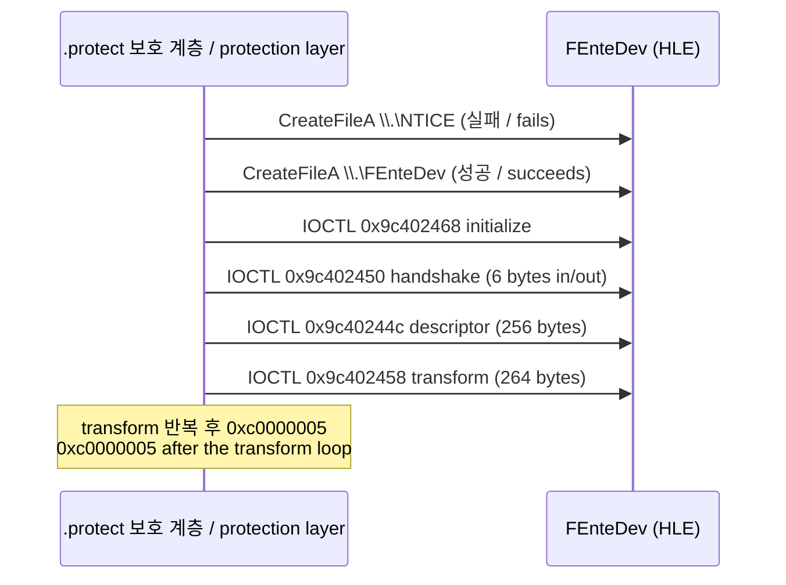
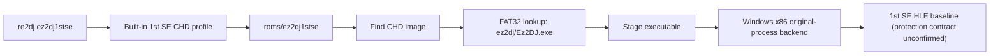

# ez2dj1stse CHD 파일시스템 분석

## 한국어

### 확인된 구조 — 확인됨

사용자가 제공한 `roms/ez2dj1stse/ez2dj1stse.chd`를 `re2dj_chd_probe`로 읽었습니다. 원본 CHD와 실행 파일은 저장소에 추가하지 않습니다.

- CHD v5, logical bytes `4,310,433,792`, hunk `4096`, unit `512`, hunk count `1,052,352`
- codecs `lzma,zlib,huff,flac`
- GDDD metadata `CYLS:8352,HEADS:16,SECS:63,BPS:512`
- MBR signature `55aa`, FAT32 partition 1개, partition LBA `63`, partition sectors `8,417,997`
- sectors per cluster `8`, reserved sectors `32`, FAT `2`개, sectors per FAT `8205`
- data LBA `16505`, root cluster `2`, cluster count `1,050,194`
- volume label `EZ2DJ_SE`
- 내부 실행 파일 `ez2dj/Ez2DJ.exe`, first cluster `915889`, size `634,880`
- PE machine `i386`, magic `PE32`, subsystem `windows-gui`, image base `0x00400000`, entry RVA `0x01ad1240`, `SizeOfImage 0x01aec000`, sections `6`

파티션은 하나뿐이고 Windows 98 시스템 디렉터리와 게임 디렉터리가 같은 볼륨에 있습니다. 루트에는 `WINDOWS`, `Program Files`, `ez2dj`를 포함해 30개 항목이 있고, `ez2dj` 디렉터리에는 `Ez2DJ.exe`, `Test.exe`, `PlzPowerOff.exe`, `ez2dj.ini`, `SYSTEM.INI`, `Songs`, `System`, `rank_0.dat`, `rank_1.dat`, `rank_2.dat` 10개 항목이 있습니다.

### 게스트 부팅 경로 — 확인됨

`WINDOWS/SYSTEM.INI`의 `shell=`은 `Explorer.exe`이고, 게임은 StartUp 폴더의 바로 가기로 시작됩니다.

- `WINDOWS/Start Menu/Programs/StartUp/Ez2DJ.exe.lnk` (301 bytes)
- 링크 안의 대상 문자열은 `C:\ez2dj\Ez2DJ.exe`, working directory 문자열은 `C:\ez2dj`
- `WINDOWS/WIN.INI`의 `run=`과 `load=`는 모두 비어 있음
- `ez2dj/SYSTEM.INI`(게임 디렉터리에 있는 별도 사본)의 `shell=`은 `c:\ez2dj\ez2dj.exe`

따라서 이 CHD의 게스트 경로는 드라이브 `C`, 디렉터리 `\ez2dj`입니다. 기존 추출 덤프의 `System.ini`가 `d:\ez2dj\ez2dj.exe`였던 것과 **드라이브 문자가 다릅니다.**

### 추출 덤프와의 실행 파일 차이 — 확인됨

CHD 내부 `ez2dj/Ez2DJ.exe`는 기존 `roms/ez2dj1stse/ez2dj/ez2dj.exe`와 **같은 파일이 아닙니다.**

| 항목 | CHD `ez2dj/Ez2DJ.exe` | 추출 덤프 `ez2dj/ez2dj.exe` |
| --- | --- | --- |
| size | `634,880` | `561,152` |
| sections | 6 | 8 |
| 보호 섹션 | `.protect` `0x01ad1000` vsize `0x0001ae8c` flags `0xe0000020` (RWX) | `.gtide` / `.gdata` / `.gidata` |
| entry RVA | `0x01ad1240` (`.protect`) | `0x01ad23cf` (`.gtide`) |
| `SizeOfImage` | `0x01aec000` | `0x01ada000` |
| import directory | `0x01aebbd0` (`.protect` 범위 안) | `0x01ad8000` (`.gidata`) |
| basereloc directory | `0x01ad2000` 존재 | 없음 |
| `.text` 바이트 | 암호화됨, 엔트로피 `7.99` | 평문 x86, 엔트로피 `6.21` |

두 파일의 PE timestamp는 `0x3862df27`로 같고, `.text` `.rdata` `.data` `.idata` `.reloc`의 가상 주소·가상 크기·raw offset·raw size가 완전히 같으며 `.idata`의 raw 바이트는 **완전히 동일**합니다. 즉 같은 원본 빌드에 서로 다른 보호 래퍼를 씌운 두 배포본으로 보입니다.

**확인됨.** 추출 덤프 `.text`의 RVA `0x00038987`에는 `ec`(`in al, dx`), RVA `0x000389ab`에는 `ee`(`out dx, al`)가 실제로 있습니다. 이 두 값이 현재 1st SE profile의 legacy I/O helper RVA입니다.

**추정.** CHD 쪽 `.protect` 빌드도 런타임에 같은 `.text` 이미지를 복원한다면 같은 RVA에 같은 helper가 존재합니다. 두 파일의 `.text` 섹션 배치가 완전히 같다는 점이 근거이지만, 디스크의 `.text`가 암호화되어 있어 정적으로는 확인할 수 없습니다. 확인 방법: CHD 빌드를 실행해 privileged-instruction fault 주소를 기록하고 이 RVA와 비교합니다.

**확인됨 — 2026-09-15, 두 빌드의 섹션 대조.** 두 빌드는 PE TimeDateStamp가 `0x3862df27`로 같습니다. `.text`(raw `0x1000`, `0x53000`바이트), `.rdata`(raw `0x54000`, `0x8000`), `.data`(raw `0x5c000`, `0xd000`), `.idata`(raw `0x69000`, `0x1000`), `.reloc`(raw `0x6a000`, `0x16000`)는 VA·VSize·raw offset·raw size가 모두 같습니다. 그러나 내용을 대조하면 `.text`·`.rdata`·`.data`·`.reloc`은 다르고 **`.idata`만 바이트 단위로 같습니다.** 즉 두 packer 계열은 원본 import table 섹션을 건드리지 않고 본체 섹션에 서로 다른 변환을 적용합니다. PE header(`0x0`~`0x1000`)도 다릅니다.

*Confirmed — 2026-09-15, section-by-section comparison. The two builds share the PE TimeDateStamp `0x3862df27`, and their `.text` (raw `0x1000`, `0x53000` bytes), `.rdata` (raw `0x54000`, `0x8000`), `.data` (raw `0x5c000`, `0xd000`), `.idata` (raw `0x69000`, `0x1000`) and `.reloc` (raw `0x6a000`, `0x16000`) agree on VA, VSize, raw offset and raw size. Comparing content, however, `.text`, `.rdata`, `.data` and `.reloc` differ while **`.idata` alone is byte-identical**: the two packer families leave the original import-table section untouched and apply different transforms to the body sections. The PE header (`0x0`–`0x1000`) differs as well.*

| 항목 / item | `.gtide` 빌드 (디렉터리) | `.protect` 빌드 (CHD) |
| --- | --- | --- |
| 크기 / size | 561,152 | 634,880 |
| MD5 | `41d6adc1397fe8eb653b8de624b5602a` | `5760cfb4f556d70711f18f473457c57b` |
| SHA-1 | `12d365d0248cf15543f83761b14d990ba086dc2f` | `3f3f960542dd9573f529dc8fb45dacd0206baffe` |
| entry point RVA | `0x01ad23cf` | `0x01ad1240` |
| SizeOfImage | `0x01ada000` | `0x01aec000` |
| base relocation directory | `{0, 0}` | RVA `0x01ad2000` |

**미확정.** `.protect` 빌드의 Hardlock 장치 이름, IOCTL 시퀀스, 유효 응답, 그리고 `.gtide` 빌드에서 확인한 LPTDI mock target state `0900000000000000`이 이 빌드에도 성립하는지는 확인되지 않았습니다. `.protect` 섹션 이름과 RWX 플래그는 3rd/4th(`docs/analysis/ez2dj-exe-structures.md`)와 같은 계열이지만, 계열이 같다는 것이 계약이 같다는 뜻은 아닙니다.

### CHD 빌드 첫 실행 결과 — 확인됨

전환 직후 `re2dj ez2dj1stse`를 한 번 실행했습니다. 진단 로그는 `logs/windows_x86_launcher_probe/ez2dj1stse/20260908-004923-080.jsonl`입니다.

- staging된 실행 파일은 `.../re2dj/chd/ez2dj1stse/ez2dj/Ez2DJ.exe`이고 CHD 경로가 함께 전달됨
- image base `0x00400000`, entry breakpoint가 `0x01ed1240`에서 hit — `0x00400000 + 0x01ad1240`과 일치
- VFS mount는 source root `.../chd/ez2dj1stse/ez2dj`, working directory `ez2dj`로 성립
- `lptdi_target_state` `0900000000000000`, `io_port_runtime` in `0x00038987` / out `0x000389ab` 모두 `prepared`
- `preparation_status`: `reached` `entry_restored` `runtime_loaded` `display_prepared` `directsound_prepared` `directinput_prepared` `vfs_prepared` `image_loader_prepared` `io_runtime_prepared` = true
- 실패 항목: `handoff_prepared=false`, `iat_verified=false`, `handoff_observed=false`, `d3d3_prepared=false`, `demo_volume_prepared=false`
- `outcome`: `runtime handoff preparation failed`

**확인됨.** CHD의 `.protect` 빌드는 현재 launcher의 IAT 기반 runtime handoff를 통과하지 못합니다. 저장소·VFS·장치 경계는 정상 동작합니다.

**추정.** 원인은 이 빌드의 import directory와 IAT가 `.protect` 안에 있고 디스크 상태가 보호되어 있어, 정적 IAT 조회로 기대한 슬롯을 찾지 못하는 것입니다. 확인 방법: entry 정지 시점 이후 `.protect` 복호화가 끝난 상태에서 import directory를 다시 읽어 슬롯 위치를 비교합니다.

**미확정.** legacy I/O helper RVA가 이 빌드에서도 맞는지는 이 실행으로 확인되지 않았습니다. handoff 이전 단계에서 멈췄기 때문에 privileged-instruction fault가 발생하지 않았습니다.

### Hardlock 경계 — 확인됨

[Hardlock descriptor ID 추출 절차](../guides/hardlock-descriptor-extraction.md)를 CHD `.protect` 빌드에 적용했습니다. 진단 로그는 `logs/windows_x86_launcher_probe/ez2dj1stse/20260908-010213-266`입니다.

**장치.** 이 빌드는 먼저 `\\.\NTICE`를 열려고 시도하고(실패, error 123) 이어서 `\\.\FEnteDev`를 엽니다. 즉 **3rd·4th·6th와 같은 Hardlock 계열이며, 추출 `.gtide` 빌드가 쓰던 `\\.\LPTDI`가 아닙니다.** `CreateFileA`, `DeviceIoControl`, `CloseHandle`은 모두 `GetProcAddress`로 동적 해석되므로 dynamic resolver가 필요합니다.

**IOCTL 순서.** 관측된 순서는 다음과 같습니다.

**descriptor 헤더.** `header_valid=1`이고 `module_id=0x0000`, `module_address=0x15e1`, `remote=0x0001`, `port=0x0378`, `speed=0x0000`, `network_users=0x0000`, `block_count=0`입니다. `function`은 `0x0000`과 `0x0006` 두 종류가 관측되었고, `id_ref`와 `id_verify`는 모두 non-zero이며 모든 요청에서 같은 값입니다. raw ID 원문은 저장소에 기록하지 않고 사용자 로컬 `cfg/hardlock-id.ini`의 `[ez2dj1stse]` section에만 남겼습니다. `module_address=0x15e1`은 6th의 `0x4c51`과 다릅니다.

**게이트 조건.** `--hardlock-device` 없이는 initialize `0x9c402468`에서 멈추고 exit code `8`로 종료합니다. `--device-mock-wts-console-session`만으로는 이 지점을 넘지 못했습니다. 3rd·4th에 쓰던 `response450=0100fafa0010`과 `tail44c=0001`을 함께 주면 descriptor와 transform까지 진행하고, transform 반복 뒤 `0xc0000005`로 끝납니다. 이는 3rd에서 관측된 형태와 같습니다.

### Transform 응답 확정 — 확인됨

seed 후보 map 129개를 모두 원본에 주입해 판별했습니다. 절차는 [Hardlock seed 복구 워크스루](../guides/hardlock-seed-recovery-walkthrough.md) Stage 6·7을 따랐고, 결과 정리는 [작업 로그](../work-logs/20260908-224-ez2dj1stse-hardlock-candidate-judgement.md)에 있습니다.

| 관찰 | 후보 128개 | 후보 1개 |
| --- | --- | --- |
| 종료 코드 | fault (`0xc0000005` 85, `0xc0000096` 28, `0xc000001d` 11, 기타 4) | `0x00000000` |
| `.vfs.log` 줄 수 | 252 (전부 동일) | 316 |
| descriptor 요청 | 18 | 19 |
| transform 요청 | 17, 전부 `mapped=1:unmapped=0` | 동일 |

**확인됨.** 갈린 후보 하나는 transform loop 이후 복호화된 게임 코드의 부팅 시퀀스를 실행합니다. `System\Common\coin0.wav`를 읽고, `System\WarningMsg\WarningMsg.bmp`, `System\CompanyLogo\logo.str`(52,892 바이트)과 `AMUSEWORLD_BG.bmp`, `LIGHT.bmp`, `AMUSEWORLD_OBJ256.bmp` 등 로고 BMP를 CHD에서 열고, `System\Title`로 작업 디렉터리를 옮긴 뒤 `function=0x0001` descriptor를 한 번 더 요청하고 `ExitProcess(0)`으로 끝납니다. 자산 개방 11건, Hardlock 요청 합계 `total=40:initialize=2:handshake=2:descriptor=19:transform=17:rejected=0`입니다. 재실행에서 같은 종료 코드와 같은 줄 수로 재현됩니다.

오답 후보가 우연히 원본 자산의 실제 경로를 만들어 낼 수 없으므로, 이 후보의 응답 map이 옳다는 것은 확정입니다.

**확인됨.** `response450=0100fafa0010`과 `tail44c=0001`은 3rd·4th에서 가져온 값이지만 1st SE에서도 성립합니다. 세 제품이 같은 handshake 재생값을 쓴다는 뜻이며, 그 값이 물리 동글의 응답인지는 여전히 별개 문제입니다.

seed 값과 응답 바이트는 저장소에 기록하지 않습니다. 확정된 map은 사용자 로컬 `cfg/hardlock-ez2dj1stse.map`, 재생값은 `cfg/hardlock.ini`의 `[ez2dj1stse]` section에 있으며, `hardlock_cfg_material_default`가 켜져 있어 `re2dj ez2dj1stse`가 별도 옵션 없이 소비합니다.

### 복호화 이후 도달 경계 — 확인됨

첫 관측에서 복호화된 게스트는 작업 디렉터리 설정 두 건에 실패했습니다. `SetCurrentDirectory("c:\ez2dj")`가 `resolved=ez2dj:success=0`, `System\Title`로 이동한 뒤의 `SetCurrentDirectory("Songs")`가 `resolved=System/Title/Songs:success=0`이었습니다.

원인은 VFS 쪽 결함 두 개였고 [작업 225](../work-logs/20260908-225-vfs-guest-root-and-chd-enumeration.md)에서 고쳤습니다. 게스트 루트 접두사가 `D:\ez2dj`로 고정되어 있었고, CHD 열거가 와일드카드 때문에 게스트 현재 디렉터리를 잃고 CHD 루트를 훑고 있었습니다.

**확인됨 — 수정 후.** 같은 실행에서 `set:request=c:\ez2dj`가 `success=1`이 되고, `find-first`가 `chd_dir=EZ2DJ/System/Title`에서 31개 항목을 반환합니다. 실패하던 `Songs` 설정은 사라지고 게스트가 저장해 둔 native 경로로 되돌아갑니다. `.vfs.log`는 316줄에서 **2372줄**로 늘고, 자산 개방은 11건에서 **971건**으로 늘었습니다.

게스트는 이제 타이틀(`System\Title\title.str`), 공용 UI(`System\Common\A_credits_*.bmp`, `WAIT_CLUB.bmp`), ClubMix 디스크 그래픽(`System\ClubMix\club_effect*_on.bmp`), 곡 폴더(`Songs\reggae-rm\ez\...`)까지 읽습니다. 실행은 게스트 자신의 예외 처리기가 `ExitProcess(0xc0000005)`를 호출하며 끝납니다.

**확인됨 — DirectDraw 연결 후.** 그 access violation의 원인은 비어 있던 DirectDraw IAT 슬롯이었습니다. packed import directory에는 `DirectDrawEnumerateA`만 있지만 원본 `.idata`(RVA `0x01aba000`)가 `DDRAW.dll!DirectDrawCreate`를 import하고 있습니다. IAT 조회가 header directory에서 못 찾으면 `.idata`까지 보도록 넓히고 `hle_d3d3`를 켜자([작업 226](../work-logs/20260908-226-ez2dj1stse-directdraw-hle.md)) 그 종료가 사라졌습니다.

게스트는 `640x480x16`으로 화면 모드를 요청하고, 창을 만들고, back buffer 1개를 가진 primary surface와 `128x128` RGB565 off-screen surface 42개를 만든 뒤 `Blt`·`Flip`·`RenderState`로 렌더 루프를 돕니다. 60초 시점에 `frame=3330`이었습니다.

**확인됨 — 타이틀 화면 도달.** 실행 화면을 캡처해 확인했습니다. 처음에는 자산 이름이 적힌 대체 사각형만 그려졌고, 원인은 스프라이트 픽셀이 `ReadFile`이 아니라 `LoadImageA`로 들어오는데 그 import가 동적 resolver 표에 없어 packed build에서 후크에 도달하지 못한 것이었습니다([작업 231](../work-logs/20260908-231-loadimagea-dynamic-resolver.md)). resolver에 추가한 뒤 타이틀 화면이 원본대로 렌더링됩니다 — EZ2DJ 로고, `THE 1ST TRACKS / SPECIAL EDITION` 문자판, `VERSION 1.0`, `(C)1999 AmuseWorld All Rights Reserved.`, 회전 배경. `asset-open:api=LoadImageA`가 42건 기록됩니다.

**확인됨 — 게임플레이 도달.** 코인 3회와 start를 넣으면 LEVEL SELECT까지 원본대로 렌더링되고, StreetMix 진입 시 `0xC0000094`(정수 0 나누기)로 종료하던 것을 고친 뒤 게임플레이 화면에 도달합니다([작업 233](../work-logs/20260908-233-profile-api-vfs.md)). 원인은 `Songs\music.ini`를 읽는 `GetPrivateProfile*` API가 `route=win32`로 남아 호스트에서 곡 색인을 찾지 못하고 곡 개수가 0이 된 것이었습니다. 네 API를 VFS로 라우팅하니 `music.ini` 읽기 375건, `Songs\` 자산 열기 182건이 기록되고 크래시가 사라집니다.

**미확정.** Warning에서 로고로 넘어갈 때의 깜빡임과, 게임플레이 배경이 단색 위 실루엣으로 보이는 것은 확인하지 않았습니다.

### Packed import directory — 확인됨

PE header의 import data directory는 RVA `0x01aebbd0`으로 `.protect` 범위 안에 있습니다. 원본 `.idata`(RVA `0x01aba000`)는 파일에 그대로 남아 있지만 header가 더 이상 가리키지 않습니다. 정적으로 보이는 import는 다음이 전부입니다.

| 모듈 | 항목 |
| --- | --- |
| `KERNEL32.dll` | `CloseHandle`, `LocalAlloc`, `GetEnvironmentVariableA`, `LocalFree`, `Sleep`, `GetProcAddress`, `LoadLibraryA`, `GetVersion`, `CreateFileA`, `GetCurrentProcessId`, `SetErrorMode`, `GetModuleHandleA`, `FreeLibrary`, `GetCommandLineA`, `RtlUnwind` |
| `USER32.dll` | `MessageBoxA`, `wsprintfA` |
| `GDI32.dll` | `GetStockObject` |
| `ADVAPI32.dll` | `RegFlushKey` |
| `DSOUND.dll` | ordinal `#1` |
| `WINMM.dll` | `mixerGetControlDetailsA` |
| `DDRAW.dll` | `DirectDrawEnumerateA` |

launcher의 HLE 준비는 모두 이 표에서 IAT 슬롯을 찾으므로, 각 경계의 성립 여부가 이 표 하나로 전부 설명됩니다. `GetWindowsDirectoryA`, `DirectDrawCreate`, `DirectDrawCreateEx`, `GetPrivateProfileIntA`는 없고 `GetCommandLineA`와 `DSOUND` ordinal `#1`은 있습니다.

### 프로파일 정정 — 적용됨

위 사실에 따라 [실행 정책 정정 작업](../work-logs/20260908-223-ez2dj1stse-chd-profile-correction.md)에서 `ez2dj1stse` 기본값을 다음과 같이 맞췄습니다.

| 항목 | 변경 | 근거 |
| --- | --- | --- |
| `device_mock_path_prefix` | `\\.\LPTDI` → `\\.\FEnteDev` | 실제로 여는 장치 |
| `device_mock_target_state_hex` | 해제 | LPTDI 전용 값, 이 빌드는 LPTDI를 열지 않음 |
| `hle_windows_directory` | `true` → `false` | import 없음, `handoff_prepared=false` |
| `hle_d3d3` | `true` → `false` | Create/CreateEx import 없음 |
| `demo_volume` | `3` → 해제 | `GetPrivateProfileIntA` 없음 |
| `hle_dynamic_vfs` | 미설정 → `true` | 장치 API가 `GetProcAddress` 경유 |
| `hardlock_cfg_material_default` | 미설정 → `true` | 로컬 Hardlock 자료 소비 경로 |
| `hle_command_line`, `hle_directsound` | 유지 | import 존재 |
| `hle_wts_console_session` (이전 `hle_wts_active_console`) | 미설정 유지 | 있으나 없으나 IOCTL 진행이 동일 |

`legacy_io_ports`와 helper RVA `0x00038987`/`0x000389ab`는 `io_port_runtime` 준비까지는 성공했지만, 실행이 privileged instruction에 도달하지 않아 이 빌드에서 맞는지는 **여전히 미확정**입니다.

### 실행 연결

`ez2dj1stse` built-in profile은 이제 CHD shortcut으로 동작합니다. launcher는 CHD의 FAT32에서 `ez2dj/Ez2DJ.exe`를 조회하고, Windows x86 original-process backend에 CHD 경로와 staging 실행 파일 경로를 함께 전달합니다. 실행 기본값은 위 표대로 이 빌드에서 관측한 경계를 따릅니다. 로컬 Hardlock 자료가 없으면 initialize 요청에서 멈추며, 그것이 현재 도달 가능한 경계입니다.

`MatchBuiltInTargetProfiles`는 `kDirectory`가 아닌 profile을 건너뛰므로, 추출 디렉터리 `roms/ez2dj1stse/ez2dj`는 3rd 전환 때와 같이 built-in 정책 없는 generic detected profile로만 남습니다.

### Linux in-process 실행 — 확인됨

2026-09-28, [작업 420](../work-logs/20260928-420-1stse-chd-linux.md)·[421](../work-logs/20260928-421-bitmap-files.md)에서 CHD 빌드를 Linux x64 in-process 실행기로 돌렸습니다.

- **확인됨.** 보호 계층이 Linux facade 위에서 Hardlock 요청 39건(initialize 2, handshake 2, descriptor 18, transform 17)을 모두 마치고 원본 import를 `GetProcAddress`로 해석합니다. 원본 `.idata` 144개 중 facade에 없던 것은 `GDI32!SetBkColor` 하나였습니다.
- **확인됨.** legacy I/O helper RVA `0x00038987`(in)·`0x000389ab`(out)가 이 빌드에서 맞습니다. 실행 중 `reads=8 writes=9 unanswered=0`으로 답했습니다. 위의 "미확정" 두 항목은 이것으로 해소됩니다.
- **확인됨.** 원본 코드는 `0x422b60`에서 BMP를 `LoadImageA(LR_LOADFROMFILE | LR_CREATEDIBSECTION)`로 읽습니다. `0x4228e0`에서 `StretchBlt`로 texture surface에 복사하고, surface에서 `IDirect3DTexture2`를 얻습니다. surface 크기는 `IDirect3DDevice3::GetCaps`가 보고하는 `D3DPTEXTURECAPS_POW2`·`SQUAREONLY`에 따라 늘어납니다. 설계: [작업 421](../design/20260928-421-bitmap-files.md).
- **확인됨.** 자산 BMP 7,360개는 모두 bottom-up `BI_RGB`입니다. 24비트가 7,355개, 8비트가 5개입니다.
- **확인됨.** [작업 422](../work-logs/20260928-422-dx6-textures.md)에서 다음을 Windows DX6 facade 규칙으로 더했습니다: 표면의 `IDirect3DTexture2`, 색 채우기·복사 `Blt`, `BltFast`, DX6 vertex buffer. 그 뒤 Linux x64 실행은 멈추지 않습니다. 시간 제한으로 창이 닫힐 때까지 983,378호출을 지나며, Warning·CompanyLogo·Title 장면의 자산을 읽고 프레임을 표시합니다.
- **미확정.** 화면이 원본과 같은지는 확인하지 못했습니다. 이 세션에서 화면을 캡처하지 못했습니다.
${python_ko}

## English

### Confirmed structure — confirmed

The user-supplied `roms/ez2dj1stse/ez2dj1stse.chd` was read with `re2dj_chd_probe`. The original CHD and executable are not added to the repository.

- CHD v5, 4,310,433,792 logical bytes, 4,096-byte hunks, 512-byte units, 1,052,352 hunks
- codecs `lzma,zlib,huff,flac`
- GDDD metadata `CYLS:8352,HEADS:16,SECS:63,BPS:512`
- MBR signature `55aa`, one FAT32 partition at LBA 63 with 8,417,997 sectors
- 8 sectors per cluster, 32 reserved sectors, 2 FATs, 8,205 sectors per FAT
- data LBA 16,505, root cluster 2, and 1,050,194 clusters
- volume label `EZ2DJ_SE`
- `ez2dj/Ez2DJ.exe`, first cluster 915,889, size 634,880 bytes
- PE i386/PE32 Windows GUI, image base `0x00400000`, entry RVA `0x01ad1240`, `SizeOfImage 0x01aec000`, six sections

There is exactly one partition, and the Windows 98 system directories share the volume with the game directory. The root holds 30 entries including `WINDOWS`, `Program Files`, and `ez2dj`; the `ez2dj` directory holds ten entries: `Ez2DJ.exe`, `Test.exe`, `PlzPowerOff.exe`, `ez2dj.ini`, `SYSTEM.INI`, `Songs`, `System`, and `rank_0.dat` through `rank_2.dat`.

### Guest boot path — confirmed

`WINDOWS/SYSTEM.INI` sets `shell=Explorer.exe`; the game starts from a StartUp-folder shortcut instead.

- `WINDOWS/Start Menu/Programs/StartUp/Ez2DJ.exe.lnk` (301 bytes)
- Its embedded target string is `C:\ez2dj\Ez2DJ.exe` and its working-directory string is `C:\ez2dj`
- `WINDOWS/WIN.INI` has empty `run=` and `load=` entries
- `ez2dj/SYSTEM.INI`, a separate copy inside the game directory, sets `shell=c:\ez2dj\ez2dj.exe`

The guest path for this CHD is therefore drive `C`, directory `\ez2dj`. That **differs in drive letter** from the extracted dump, whose `System.ini` read `d:\ez2dj\ez2dj.exe`.

### Executable difference against the extracted dump — confirmed

The CHD's `ez2dj/Ez2DJ.exe` is **not the same file** as the existing `roms/ez2dj1stse/ez2dj/ez2dj.exe`.

| Item | CHD `ez2dj/Ez2DJ.exe` | Extracted `ez2dj/ez2dj.exe` |
| --- | --- | --- |
| size | 634,880 | 561,152 |
| sections | 6 | 8 |
| protection section | `.protect` at `0x01ad1000`, vsize `0x0001ae8c`, flags `0xe0000020` (RWX) | `.gtide` / `.gdata` / `.gidata` |
| entry RVA | `0x01ad1240` (`.protect`) | `0x01ad23cf` (`.gtide`) |
| `SizeOfImage` | `0x01aec000` | `0x01ada000` |
| import directory | `0x01aebbd0`, inside `.protect` | `0x01ad8000`, in `.gidata` |
| basereloc directory | present at `0x01ad2000` | absent |
| `.text` bytes | encrypted, entropy 7.99 | plaintext x86, entropy 6.21 |

Both files carry PE timestamp `0x3862df27`, their `.text`, `.rdata`, `.data`, `.idata`, and `.reloc` sections share identical virtual addresses, virtual sizes, raw offsets, and raw sizes, and the raw `.idata` bytes are **byte-for-byte identical**. They appear to be two releases of the same original build wrapped by different protection layers.

**Confirmed.** The extracted dump's `.text` holds `ec` (`in al, dx`) at RVA `0x00038987` and `ee` (`out dx, al`) at RVA `0x000389ab` — the two legacy-I/O helper RVAs the current 1st SE profile uses.

**Inferred.** If the `.protect` build restores the same `.text` image at run time, the same helpers sit at the same RVAs. The identical `.text` section placement supports this, but the on-disk `.text` is encrypted, so it cannot be confirmed statically. Verify by running the CHD build and comparing the recorded privileged-instruction fault addresses with these RVAs.

**Unresolved.** The `.protect` build's Hardlock device name, IOCTL sequence, valid response, and whether the LPTDI mock target state `0900000000000000` confirmed for the `.gtide` build also holds here are all unconfirmed. The `.protect` section name and RWX flags put it in the same family as 3rd and 4th (`docs/analysis/ez2dj-exe-structures.md`), but a shared family is not a shared contract.

### First run of the CHD build — confirmed

`re2dj ez2dj1stse` was run once immediately after the conversion. The diagnostic log is `logs/windows_x86_launcher_probe/ez2dj1stse/20260908-004923-080.jsonl`.

- The staged executable is `.../re2dj/chd/ez2dj1stse/ez2dj/Ez2DJ.exe`, passed together with the CHD path.
- Image base `0x00400000`, and the entry breakpoint hit `0x01ed1240`, which equals `0x00400000 + 0x01ad1240`.
- The VFS mounted with source root `.../chd/ez2dj1stse/ez2dj` and working directory `ez2dj`.
- `lptdi_target_state` `0900000000000000` and `io_port_runtime` with in `0x00038987` / out `0x000389ab` both reported `prepared`.
- `preparation_status` reported true for `reached`, `entry_restored`, `runtime_loaded`, `display_prepared`, `directsound_prepared`, `directinput_prepared`, `vfs_prepared`, `image_loader_prepared`, and `io_runtime_prepared`.
- It reported false for `handoff_prepared`, `iat_verified`, `handoff_observed`, `d3d3_prepared`, and `demo_volume_prepared`.
- `outcome`: `runtime handoff preparation failed`.

**Confirmed.** The CHD `.protect` build does not pass the launcher's current IAT-based runtime handoff. The storage, VFS, and device boundaries do work.

**Inferred.** The cause is that this build's import directory and IAT live inside `.protect` and are protected on disk, so a static IAT lookup cannot find the expected slots. Verify by re-reading the import directory once `.protect` has finished decrypting after the entry stop and comparing slot locations.

**Unresolved.** This run did not confirm whether the legacy-I/O helper RVAs hold for this build; execution stopped before the handoff, so no privileged-instruction fault occurred.

### Hardlock boundary — confirmed

The [Hardlock descriptor ID extraction procedure](../guides/hardlock-descriptor-extraction.md) was applied to the CHD `.protect` build. The diagnostic log is `logs/windows_x86_launcher_probe/ez2dj1stse/20260908-010213-266`.

**Device.** The build first tries to open `\\.\NTICE` (fails with error 123), then opens `\\.\FEnteDev`. It therefore belongs to **the same Hardlock family as 3rd, 4th, and 6th, not the `\\.\LPTDI` device the extracted `.gtide` build used.** `CreateFileA`, `DeviceIoControl`, and `CloseHandle` are all resolved through `GetProcAddress`, so the dynamic resolver is required.

**IOCTL order.** The observed order is `CreateFileA \\.\NTICE` (fails), `CreateFileA \\.\FEnteDev` (succeeds), IOCTL `0x9c402468` initialize, IOCTL `0x9c402450` handshake with 6 bytes in and out, IOCTL `0x9c40244c` descriptor with 256 bytes, and IOCTL `0x9c402458` transform with 264 bytes, ending in `0xc0000005` after the transform loop.

**Descriptor header.** `header_valid=1` with `module_id=0x0000`, `module_address=0x15e1`, `remote=0x0001`, `port=0x0378`, `speed=0x0000`, `network_users=0x0000`, and `block_count=0`. Two `function` values were observed, `0x0000` and `0x0006`. Both `id_ref` and `id_verify` are non-zero and identical across every request. Their raw values are not recorded in the repository; they live only in the user's local `cfg/hardlock-id.ini` under the `[ez2dj1stse]` section. `module_address=0x15e1` differs from the 6th's `0x4c51`.

**Gate conditions.** Without `--hardlock-device` the run stops at the `0x9c402468` initialize request and exits with code `8`; `--device-mock-wts-console-session` alone did not pass that point. Supplying the 3rd/4th values `response450=0100fafa0010` and `tail44c=0001` advances it through descriptor and transform, ending in `0xc0000005` after the transform loop — the same shape observed for 3rd.

### Transform response resolved — confirmed

All 129 seed candidate maps were injected into the original and judged following Stage 6 and 7 of the [Hardlock seed recovery walkthrough](../guides/hardlock-seed-recovery-walkthrough.md); the results are tabulated in the [work log](../work-logs/20260908-224-ez2dj1stse-hardlock-candidate-judgement.md).

| Observation | 128 candidates | 1 candidate |
| --- | --- | --- |
| exit code | fault (`0xc0000005` ×85, `0xc0000096` ×28, `0xc000001d` ×11, four others) | `0x00000000` |
| `.vfs.log` lines | 252, identical across all of them | 316 |
| descriptor requests | 18 | 19 |
| transform requests | 17, every one `mapped=1:unmapped=0` | same |

**Confirmed.** The one candidate that separated runs the boot sequence of decrypted game code after the transform loop: it reads `System\Common\coin0.wav`, opens `System\WarningMsg\WarningMsg.bmp` and `System\CompanyLogo\logo.str` (52,892 bytes) along with logo bitmaps such as `AMUSEWORLD_BG.bmp`, `LIGHT.bmp`, and `AMUSEWORLD_OBJ256.bmp` from the CHD, moves its working directory to `System\Title`, issues one more `function=0x0001` descriptor, and ends at `ExitProcess(0)`. That run records eleven asset opens and Hardlock totals of `total=40:initialize=2:handshake=2:descriptor=19:transform=17:rejected=0`, and it reproduces with the same exit code and line count on a rerun.

A wrong candidate cannot invent the original's real asset paths by chance, so this candidate's response map is established as correct.

**Confirmed.** `response450=0100fafa0010` and `tail44c=0001`, carried over from 3rd and 4th, also hold for 1st SE. All three products therefore share the same handshake replay values; whether those values are a physical dongle's response remains a separate question.

Seed values and response bytes are not recorded in the repository. The confirmed map lives in the user's local `cfg/hardlock-ez2dj1stse.map` and the replay values in the `[ez2dj1stse]` section of `cfg/hardlock.ini`; with `hardlock_cfg_material_default` enabled, `re2dj ez2dj1stse` consumes both with no extra options.

### Boundary reached after decryption — confirmed

On first observation the decrypted guest failed two working-directory changes: `SetCurrentDirectory("c:\ez2dj")` reported `resolved=ez2dj:success=0`, and after moving to `System\Title` a `SetCurrentDirectory("Songs")` reported `resolved=System/Title/Songs:success=0`.

Both traced to VFS defects, fixed in [task 225](../work-logs/20260908-225-vfs-guest-root-and-chd-enumeration.md): the guest root prefix was hardcoded to `D:\ez2dj`, and CHD enumeration lost the guest current directory on wildcard names and swept the CHD root instead.

**Confirmed after the fix.** The same run now reports `set:request=c:\ez2dj` with `success=1` and `find-first` returning 31 entries from `chd_dir=EZ2DJ/System/Title`. The failing `Songs` change is gone; the guest returns to the native path it saved. The `.vfs.log` grows from 316 lines to **2,372** and asset opens from eleven to **971**.

The guest now reads the title screen (`System\Title\title.str`), the shared UI (`System\Common\A_credits_*.bmp`, `WAIT_CLUB.bmp`), ClubMix disc graphics (`System\ClubMix\club_effect*_on.bmp`), and song folders (`Songs\reggae-rm\ez\...`). The run ends with the guest's own exception handler calling `ExitProcess(0xc0000005)`.

**Confirmed after connecting DirectDraw.** The access violation came from an empty DirectDraw IAT slot. The packed import directory carries only `DirectDrawEnumerateA`, but the original `.idata` at RVA `0x01aba000` imports `DDRAW.dll!DirectDrawCreate`. Widening the IAT lookup to consult `.idata` when the header directory finds nothing, and enabling `hle_d3d3` ([task 226](../work-logs/20260908-226-ez2dj1stse-directdraw-hle.md)), removed that exit.

The guest now requests a `640x480x16` display mode, creates a window, builds a primary surface with one back buffer plus 42 off-screen `128x128` RGB565 surfaces, and runs a render loop of `Blt`, `Flip`, and `RenderState` calls, reaching `frame=3330` at a 60-second bound.

**Confirmed — the title screen is reached.** Capturing the running window showed only labeled placeholder rectangles at first. The cause was that sprite pixels arrive through `LoadImageA` rather than `ReadFile`, and that import was absent from the dynamic resolver table, so on a packed build the guest's call never reached the hook ([task 231](../work-logs/20260908-231-loadimagea-dynamic-resolver.md)). With it added, the title screen renders as the original: the EZ2DJ logo, the `THE 1ST TRACKS / SPECIAL EDITION` plate, `VERSION 1.0`, `(C)1999 AmuseWorld All Rights Reserved.`, and the animated background. The trace records 42 `asset-open:api=LoadImageA` events.

**Confirmed — gameplay is reached.** With three coins and a start, LEVEL SELECT renders as the original, and after fixing an exit with `0xC0000094` (integer divide by zero) on entering StreetMix the run reaches the gameplay screen ([task 233](../work-logs/20260908-233-profile-api-vfs.md)). The cause was that the `GetPrivateProfile*` APIs reading `Songs\music.ini` were still at `route=win32`, so the host lookup found no song index and the song count became zero. Routing the four APIs through the VFS produced 375 `music.ini` reads and 182 `Songs\` asset opens, and the crash is gone.

**Unresolved.** The flicker on the Warning-to-logo transition, and the gameplay background rendering as silhouettes over a flat colour, are unexamined.

### Packed import directory — confirmed

The PE header's import data directory sits at RVA `0x01aebbd0`, inside `.protect`. The original `.idata` at RVA `0x01aba000` is still present in the file but the header no longer points at it. The complete set of statically visible imports is `KERNEL32.dll` (`CloseHandle`, `LocalAlloc`, `GetEnvironmentVariableA`, `LocalFree`, `Sleep`, `GetProcAddress`, `LoadLibraryA`, `GetVersion`, `CreateFileA`, `GetCurrentProcessId`, `SetErrorMode`, `GetModuleHandleA`, `FreeLibrary`, `GetCommandLineA`, `RtlUnwind`), `USER32.dll` (`MessageBoxA`, `wsprintfA`), `GDI32.dll` (`GetStockObject`), `ADVAPI32.dll` (`RegFlushKey`), `DSOUND.dll` (ordinal `#1`), `WINMM.dll` (`mixerGetControlDetailsA`), and `DDRAW.dll` (`DirectDrawEnumerateA`).

Every launcher HLE preparation step locates its IAT slot in that table, so it explains each boundary's success or failure on its own: `GetWindowsDirectoryA`, `DirectDrawCreate`, `DirectDrawCreateEx`, and `GetPrivateProfileIntA` are absent, while `GetCommandLineA` and `DSOUND` ordinal `#1` are present.

### Profile correction — applied

Following those facts, the [execution-policy correction](../work-logs/20260908-223-ez2dj1stse-chd-profile-correction.md) aligned the `ez2dj1stse` defaults: `device_mock_path_prefix` changed from `\\.\LPTDI` to `\\.\FEnteDev` and `device_mock_target_state_hex` was cleared, since this build never opens LPTDI; `hle_windows_directory` and `hle_d3d3` were disabled and `demo_volume` unset because their imports are absent; `hle_dynamic_vfs` was enabled because the device APIs are reached through `GetProcAddress`; `hardlock_cfg_material_default` was enabled to consume local Hardlock material; `hle_command_line` and `hle_directsound` were kept because their imports are present; and `hle_wts_active_console` was left off because IOCTL progression was identical with and without it.

`legacy_io_ports` and the helper RVAs `0x00038987` / `0x000389ab` did reach `io_port_runtime` preparation, but execution never hit a privileged instruction, so whether they are correct for this build remains **unresolved**.

### Execution connection

The built-in `ez2dj1stse` profile now uses the CHD shortcut. The launcher resolves `ez2dj/Ez2DJ.exe` through the CHD FAT32 view and passes both the CHD path and the staging executable path to the Windows x86 original-process backend. Its execution defaults follow the boundary observed on this build, as tabulated above. Without local Hardlock material the run stops at the initialize request, which is the currently reachable boundary.

Because `MatchBuiltInTargetProfiles` skips profiles that are not `kDirectory`, the extracted directory `roms/ez2dj1stse/ez2dj` now falls back to a generic detected profile with no built-in policy, exactly as happened with the 3rd conversion.

### Linux in-process run — confirmed

On 2026-09-28 the CHD build ran on the Linux x64 in-process runner ([task 420](../work-logs/20260928-420-1stse-chd-linux.md), [421](../work-logs/20260928-421-bitmap-files.md)).

- **Confirmed.** The protection completes all 39 Hardlock requests (initialize 2, handshake 2, descriptor 18, transform 17) on the Linux facade, then resolves the original imports through `GetProcAddress`. Of the 144 original `.idata` imports only `GDI32!SetBkColor` was missing from the facade.
- **Confirmed.** The legacy-I/O helper RVAs `0x00038987` (in) and `0x000389ab` (out) hold for this build: the run answered `reads=8 writes=9 unanswered=0`. This settles the two "unresolved" notes above.
- **Confirmed.** The original code reads BMPs at `0x422b60` with `LoadImageA(LR_LOADFROMFILE | LR_CREATEDIBSECTION)`, copies them onto a texture surface with `StretchBlt` at `0x4228e0`, and takes `IDirect3DTexture2` from the surface. The surface grows only for the `D3DPTEXTURECAPS_POW2` and `SQUAREONLY` caps `IDirect3DDevice3::GetCaps` reports. Design: [task 421](../design/20260928-421-bitmap-files.md).
- **Confirmed.** All 7,360 asset BMPs are bottom-up `BI_RGB`: 7,355 at 24 bits and 5 at 8 bits.
- **Confirmed.** [Task 422](../work-logs/20260928-422-dx6-textures.md) added, under the Windows DX6 facade's rules, the surface's `IDirect3DTexture2`, color-fill and copy `Blt`, `BltFast`, and DX6 vertex buffers. After that the Linux x64 run no longer stops: it passes 983,378 calls until the timeout closes the window, reading the Warning, CompanyLogo, and Title scenes' assets and presenting frames.
- **Unresolved.** Whether the picture matches the original was not checked, since the screen could not be captured in this session.
${python_en}
