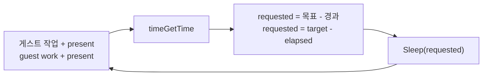

# EZ2DJ 3rd 프레임 pacing / EZ2DJ 3rd frame pacing

주제: 3rd `EZ2DJ.EXE`가 프레임 주기를 스스로 맞추는 방식과, 그 방식이 호스트에서 무엇에 의존하는가.

*Topic: how 3rd's `EZ2DJ.EXE` paces its own frames, and what that pacing depends on when it runs on a modern host.*

측정 대상: CHD 빌드 `EZ2DJ.EXE`, TimeDateStamp `0x3bca98a3`. 측정 호스트: Windows 11 Pro 26200, 64-bit.

*Measured on the CHD build `EZ2DJ.EXE`, TimeDateStamp `0x3bca98a3`, running on Windows 11 Pro 26200 x64.*

근거 작업: [작업 289](../work-logs/20260915-289-present-interval-histogram.md), [작업 290](../work-logs/20260915-290-guest-wait-accounting.md), [작업 291](../work-logs/20260915-291-timer-resolution-dependency.md)

일반 배경: [Windows 타이머 해상도](../kb/windows-timer-resolution.md)

---

## 1. 확인됨: 타이밍 import 표면 / Confirmed: the timing import surface

원본 `.idata`를 해석한 결과다.

*From parsing the original `.idata`.*

| 항목 / item | 값 / value |
| --- | --- |
| `WINMM.dll` import 8개 / the 8 `WINMM.dll` imports | `mixerOpen`, `mixerClose`, `mixerGetNumDevs`, `mixerGetLineInfoA`, `mixerGetLineControlsA`, `mixerGetControlDetailsA`, `mixerSetControlDetails`, `timeGetTime` |
| 타이밍 관련 `KERNEL32` import / timing-related `KERNEL32` imports | `Sleep`, `GetThreadPriority`, `SetThreadPriority` |
| `timeBeginPeriod` | **없음 / absent.** `.idata`뿐 아니라 파일 전체 바이트 검색에서 0건이므로 보호 계층의 `GetProcAddress` 동적 해석 가능성도 없다 / zero hits across the whole file, not just `.idata`, so the protection layer cannot resolve it through `GetProcAddress` either |

**3rd는 타이머 해상도를 한 번도 요청하지 않는다.** Windows 9x에서는 기본이 1 ms였으므로 요청할 이유가 없었다.

***3rd never requests a timer resolution.*** *On Windows 9x the default was 1 ms, so there was no reason to ask.*

## 2. 확인됨: 프레임 루프의 형태 / Confirmed: the shape of the frame loop

프레임마다 `Sleep` 정확히 1회, `WaitForSingleObject` 2회, `timeGetTime` 4회다. `WaitForSingleObject`는 즉시 반환하며 합쳐 0.12 ms로 무시 가능하다.

*Exactly one `Sleep`, two `WaitForSingleObject` and four `timeGetTime` calls per frame. The waits return immediately, totalling 0.12 ms, and are negligible.*

이 호출들은 정적 IAT를 지나지 않고 **`GetProcAddress`로 해석된다.** 정적 슬롯만 패치하면 계정이 한 건도 잡히지 않는다.

*These calls do not pass the static IAT: they are resolved through `GetProcAddress`. Patching the static slots alone accounts nothing.*

## 3. 확인됨: 주기 계산은 피드백 루프다 / Confirmed: the period is computed by a feedback loop

프레임마다 `(Sleep 요청값 x, 직전 non-sleeping 구간 y)` 쌍을 누적합으로 모아 판정했다.

*Decided from running sums over per-frame pairs of (requested sleep `x`, preceding non-sleeping segment `y`).*

| 창 / window | `mean(x)` | `sd(x)` | `mean(y)` | `sd(y)` | `mean(x+y)` | `sd(x+y)` | `corr` |
| --- | --- | --- | --- | --- | --- | --- | --- |
| 1 | 14.35 | 3.17 | 2.77 | 3.08 | 17.13 | 0.62 | -0.981 |
| 2 | 15.19 | 2.11 | 1.81 | 1.97 | 17.00 | 0.63 | -0.955 |
| 3 | 15.37 | 1.05 | 1.59 | 0.95 | 16.96 | 0.53 | -0.864 |
| 4 | 15.43 | 0.87 | 1.51 | 0.84 | 16.94 | 0.57 | -0.780 |

세 가지가 동시에 성립한다.

*Three things hold at once.*

* `corr`이 -0.78에서 -0.98로 **강한 음의 상관**이다. 작업이 길어진 프레임에서는 덜 잔다.
* `sd(x)`와 `sd(y)`는 프레임마다 0.8~3.2 ms로 움직인다.
* 그런데 `sd(x+y)`는 **0.53~0.68 ms로 일정하다.**

*`corr` runs -0.78 to -0.98, a strong negative correlation: a frame that worked longer sleeps less. Both `sd(x)` and `sd(y)` move over 0.8-3.2 ms, yet `sd(x+y)` stays flat at 0.53-0.68 ms.*

따라서 게스트는 `x + y`를 일정하게 유지한다. **`Sleep` 요청값은 고정 상수가 아니라 `목표 주기 - 경과 시간`이다.**

*The guest therefore holds `x + y` constant: the sleep request is **not a fixed constant but `target period - elapsed`**.*

## 4. 추정: 목표 주기는 약 17 ms / Inferred: the target period is about 17 ms

`mean(x+y)`는 16.94~17.35 ms이며, 호스트의 타이머 해상도를 1 ms에서 15.6 ms로 바꿔도(5절) 이 값은 움직이지 않는다. 목표 주기가 호스트 조건과 무관한 게스트 내부 상수라는 뜻이다.

*`mean(x+y)` is 16.94-17.35 ms and does not move when the host's timer resolution changes from 1 ms to 15.6 ms (section 5), so the target is a guest-internal constant independent of host conditions.*

약 17 ms는 **58.8 Hz**에 해당하며 60 Hz의 16.67 ms가 아니다. 다만 게스트의 경과 측정은 `timeGetTime`의 1 ms 양자화를 거치고 우리 측정 구간과 경계가 정확히 같지 않으므로, 이 값은 원본 상수의 추정치다. **원본 코드의 상수를 직접 읽지 않았으므로 16 ms인지 17 ms인지는 미확정이다.**

*About 17 ms corresponds to **58.8 Hz**, not the 16.67 ms of 60 Hz. The guest measures its elapsed time through `timeGetTime`'s 1 ms quantization and its measurement window does not exactly match ours, so this is an estimate of the original constant. **Whether that constant is 16 or 17 is unresolved,** because it has not been read out of the original code.*

## 5. 확인됨: 프레임률은 SDL3의 타이머 해상도 요청에 얹혀 있다 / Confirmed: the frame rate rides on SDL3's timer-resolution request

3절의 피드백 루프는 `Sleep`이 요청값 근처에서 돌아온다는 전제 위에서만 목표 주기를 지킨다. NT 계열 기본 해상도 15.625 ms에서는 그 전제가 깨진다.

*The feedback loop in section 3 holds its target only while `Sleep` returns near the requested value, which the NT family's 15.625 ms default breaks.*

우리 주입 런타임 DLL의 import table에 `timeBeginPeriod`와 `timeEndPeriod`가 있다. 우리 소스에는 호출이 없고 게스트에도 없으므로(1절), 출처는 정적 링크된 SDL3다. SDL3는 서브시스템 하나만 초기화해도 `SDL_InitTicks`에서 `timeBeginPeriod(1)`을 부른다.

*Our injected runtime DLL imports `timeBeginPeriod` and `timeEndPeriod`. Neither our sources nor the guest call them (section 1), so the source is statically linked SDL3, which calls `timeBeginPeriod(1)` from `SDL_InitTicks` when any subsystem initializes.*

SDL의 힌트 `SDL_TIMER_RESOLUTION=0`으로 그 요청만 제거하고 같은 실행을 반복했다. 다른 조건은 모두 같다.

*The same run was repeated with only that request removed, through SDL's `SDL_TIMER_RESOLUTION=0` hint. Everything else was identical.*

| 측정 / measurement | 기본 / default | `SDL_TIMER_RESOLUTION=0` |
| --- | --- | --- |
| `Sleep` 소요 p50 / duration p50 | 16.00~16.25 ms | **27.50~27.75 ms** |
| 프레임 간격 mean / frame interval mean | 17.56~17.59 ms | **30.29~30.63 ms** |
| 프레임률 / frame rate | 약 56.9 fps | **약 32.7 fps** |
| `mean(x+y)` (목표 주기 / target period) | 16.94~17.13 ms | 17.09~17.35 ms |

프레임률은 거의 정확히 절반이 되고 목표 주기는 그대로다. **3rd의 현재 프레임률은 SDL3의 기본 힌트가 공급하는 1 ms 해상도에 의존한다.**

*The frame rate halves while the target period is unchanged. **3rd's current frame rate depends on the 1 ms resolution supplied by SDL3's default hint.***

## 6. 확인됨: 전역 해상도 읽기로는 이 의존을 볼 수 없다 / Confirmed: reading the global resolution cannot see this dependency

`NtQueryTimerResolution`은 세 실행 모두에서 `current_ms=1.0000`을 돌려주었다. 5절에서 프레임률이 절반이 된 실행에서도 같은 값이었다.

*`NtQueryTimerResolution` returned `current_ms=1.0000` in all three runs, including the one whose frame rate halved in section 5.*

이 API는 **시스템 전역** 값을 읽고, Windows 10 2004부터 `timeBeginPeriod`는 호출한 프로세스에만 적용되기 때문이다. 이 호스트에서는 무관한 다른 프로세스가 전역 값을 1 ms로 유지하고 있었고, 아무것도 요청하지 않은 대조 프로세스의 `Sleep(15)` p50은 29.96 ms였다. 배경은 [Windows 타이머 해상도](../kb/windows-timer-resolution.md)에 있다.

*The API reads the **system-wide** value, and since Windows 10 2004 `timeBeginPeriod` applies only to the calling process. On this host an unrelated process was holding the global value at 1 ms, while a control process that requested nothing measured a `Sleep(15)` p50 of 29.96 ms. The background is in [Windows timer resolution](../kb/windows-timer-resolution.md).*

**프로세스의 실효 해상도는 `Sleep` 자체를 재야 알 수 있다.** 진단은 전역 값을 참고 자료로만 기록한다.

***A process's effective resolution is only visible by measuring `Sleep` itself.*** *The diagnostic records the global value as corroboration only.*

## 6.1. 확인됨: `timeGetTime`은 함께 뭉개지지 않는다 / Confirmed: `timeGetTime` does not degrade with it

Microsoft 문서는 `timeBeginPeriod`가 `timeGetTime`과 `Sleep`의 해상도를 함께 바꾼다고 적는다. 그렇다면 5절의 힌트 제거 실행에서 게스트의 경과 측정도 15.6 ms로 뭉개졌어야 하지만, 그렇지 않았다.

*Microsoft's documentation says `timeBeginPeriod` changes the resolution of `timeGetTime` and `Sleep` together, which would mean the guest's elapsed measurement also coarsened to 15.6 ms in section 5's hint-removed run. It did not.*

해상도를 요청하지 않은 대조 프로세스에서 두 값을 같은 프로세스 안에서 측정했다.

*Both values were measured inside one control process that requested no resolution.*

| 측정 / measurement | 값 / value |
| --- | --- |
| `timeGetTime` 관측 step / observed step | **1 ms** (200 표본 중 197 / 197 of 200 samples) |
| 같은 프로세스의 `Sleep(15)` p50 / same process | **25.87 ms** |

**한 프로세스 안에서 시계는 1 ms, 수면은 15.6 ms 계열이다.** 게스트 데이터도 같은 결론을 준다. 5절의 힌트 제거 실행에서 `sd(x)`는 1.17~1.77 ms, `sd(x+y)`는 0.68 ms였다. 게스트의 시계가 15.6 ms 단위였다면 경과값이 0 또는 16으로만 읽혀 두 값 모두 6 ms 근처가 되어야 한다. 관측값은 그 1/5 이하다.

***Within one process the clock steps at 1 ms while sleeps move in the 15.6 ms family.*** *The guest data agrees: in the hint-removed run `sd(x)` was 1.17-1.77 ms and `sd(x+y)` 0.68 ms, where a 15.6 ms guest clock would read elapsed as only 0 or 16 and drive both above 6 ms — five times what was observed.*

추정되는 이유는 `timeGetTime`이 전역 틱 카운터를 읽는 반면, Windows 10 2004의 프로세스 단위 규칙은 **타이머 만료**(`Sleep`과 대기 함수)에만 적용되기 때문이다.

*The inferred reason is that `timeGetTime` reads the global tick counter while the Windows 10 2004 per-process rule governs only **timer expiry** — `Sleep` and the wait functions.*

따라서 5절의 위험은 좁다. **SDL3의 요청을 잃으면 프레임률이 절반이 되지만 게스트의 내부 시간 진행은 유지된다.** 다만 이 호스트의 `timeGetTime` 고해상도 자체가 우리가 통제하지 않는 외부 프로세스의 전역 틱 요청에 얹혀 있다는 점은 8절에 남긴다.

*Section 5's risk is therefore narrow: **losing SDL3's request halves the frame rate but leaves the guest's internal advance of time intact.** That this host's fine `timeGetTime` itself rides on an outside process's global-tick request is recorded in section 8.*

## 7. 확인됨: 프레임 예산 / Confirmed: the frame budget

기본 구성의 17.6 ms 프레임은 전부 설명된다.

*The default configuration's 17.6 ms frame is fully accounted for.*

| 구간 / segment | 프레임당 / per frame | 비중 / share |
| --- | --- | --- |
| 게스트 `Sleep` / guest `Sleep` | 약 16.0 ms | 91% |
| `Sleep` 초과분 / sleep overshoot | 약 0.6 ms | (위 값에 포함 / included above) |
| backend `Present` | 0.24 ms | 1.4% |
| 나머지 / remainder | 약 1.3 ms | 7% |

게스트가 지키는 목표 주기는 17.0 ms인데 실제 프레임은 17.6 ms다. 차이 0.6 ms는 `Sleep`이 요청값보다 길게 자는 몫이며, 1 ms 해상도에서도 요청값은 틱 경계로 올림되기 때문이다.

*The guest holds a 17.0 ms target while the actual frame is 17.6 ms. The 0.6 ms difference is the sleep running long: even at 1 ms resolution a request rounds up to a tick boundary.*

## 8. 미확정 / Unresolved

* 원본 코드의 목표 주기 상수. 4절의 약 17 ms는 측정 추정치다.
* 원본 캐비닛에서 이 루프가 실제로 몇 fps로 돌았는지.
* 전역 틱을 아무도 잡지 않는 호스트에서의 `timeGetTime` 해상도. 6.1절의 1 ms는 무관한 외부 프로세스가 전역 틱을 1 ms로 유지하는 상태에서 측정한 값이다. 아무도 잡지 않으면 전역 틱이 15.6 ms가 되고 **게스트의 시계 자체가 뭉개질 것으로 추정되나**, 이 호스트에서는 전역 틱을 낮출 수단이 없어 확인하지 못했다. 그 경우 손상은 프레임률에 그치지 않는다.
* 3rd 외 타깃이 같은 전제를 가지는지. 같은 시기 빌드이므로 가능성은 있으나 확인하지 않았다.
* 프레임률 개입 여부와 방식. 원본 게임 로직의 시간 진행을 바꾸는 일이므로 별도 판단이 필요하다.

*The target-period constant in the original code; section 4's 17 ms is a measured estimate. What frame rate this loop ran at on the original cabinet. The `timeGetTime` resolution on a host where nothing holds the global tick: section 6.1's 1 ms was measured while an unrelated outside process held it there, and with nobody holding it the global tick would be 15.6 ms and **the guest's own clock would presumably coarsen too** — unverified, because this host offers no way to lower the global tick, and the damage would then not stop at the frame rate. Whether targets other than 3rd share the assumption, which is plausible for builds of the same era but unverified. Whether and how to intervene in the frame rate, which changes how time advances for the original game logic and needs its own judgment.*
