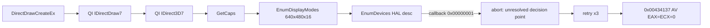
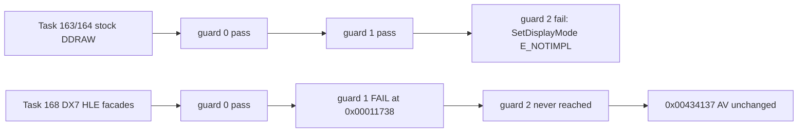
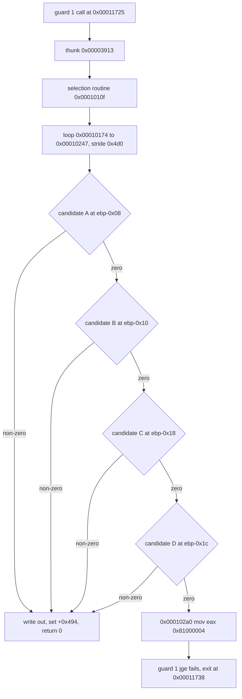
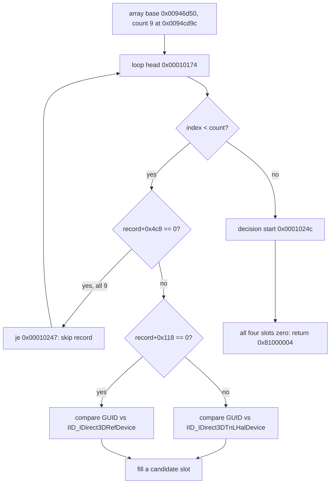
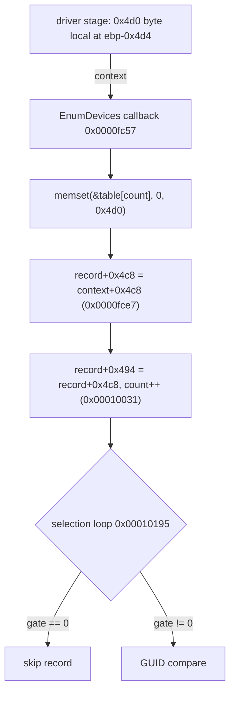
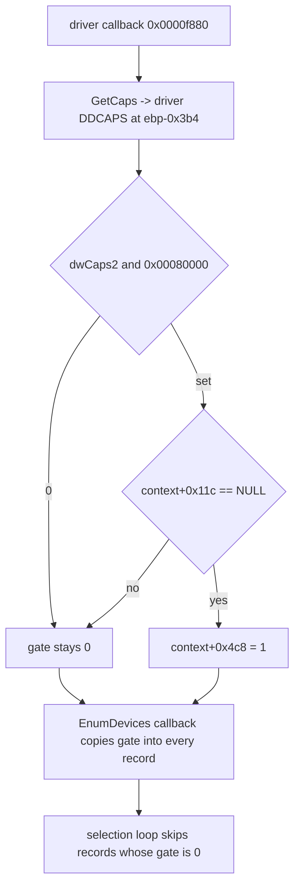
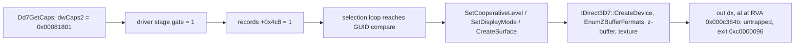

# ez2dj4th Hardlock runtime 분석

## 확인됨

- **확인됨 — 기본 설정 적재.** 실제 CHD 제품 실행은 명시적 `--hardlock-config` 없이 Git-ignore된 `cfg/hardlock.ini`의 `ez2dj4th` section을 읽고 `hardlock_secret_config loaded=true`를 기록했습니다. 값 자체는 명령행과 JSONL/VFS 로그에 나타나지 않았습니다.
- **확인됨 — 장치 초기화 경계.** broad API software watch 없이 slot-writer hardware trace를 사용한 실제 CHD 실행은 `CreateFileA("\\.\NTICE")` 두 번, `CreateFileA("\\.\FEnteDev")` 한 번을 호출했습니다. `FEnteDev` synthetic handle의 첫 요청은 `0x9c402468`, input/output size `0/0`입니다.
- **확인됨 — active-console 진행 조건.** host WTS 상태를 그대로 전달한 실행은 `0x468` 뒤에서 더 진행하지 않았습니다. 성공한 `WTS_CURRENT_SESSION` class-4 결과만 active 상태 `0`으로 바꾼 bounded 실행은 동일한 in-place 6-byte `0x9c402450` 요청을 세 번 호출했습니다.
- **확인됨 — 4th descriptor/transform 경계.** active-console HLE에 기존 synthetic `0x450` replay와 nonzero descriptor tail 분기 실험을 결합한 bounded 실행은 initialize 1회, handshake 2회, descriptor 37회, Function `0x0e` transform 36회를 기록하고 child exit로 끝났습니다. Function 0/6 `0x44c`는 256-byte in-place descriptor이며, Function `0x0e` `0x458`은 block count 1의 264-byte in-place packet입니다. 모든 요청의 shape와 sequence가 유효했고, 모든 descriptor의 module address가 외부 profile 설정과 일치했습니다.
- **확인됨 — 값 비노출 검증 경계.** 플랫폼 중립 `HardlockProtocolTracker`는 `0x468`, `0x450`, `0x44c`, `0x458`의 순서와 크기를 판정합니다. descriptor가 도달하면 Function, block count, 설정된 module address와의 일치 여부만 기록하며 실제 module address, seed, ID 및 block byte는 기록하지 않습니다.
- **확인됨 — 공식 vendor driver 출처.** [`haspnt64` release](https://github.com/leecher1337/haspnt64/releases/tag/20221021)가 가리키는 `haspdinst.exe` 8.31을 시스템 임시 디렉터리에만 내려받아 실행하지 않고 embedded CAB을 분리했습니다. Installer의 Authenticode는 `Thales DIS CPL USA, Inc.` 서명으로 유효했고 SHA-256은 `B3CEEF35024FE9E5FC6D8B2F658CB80F56ABCE35CF435AAAB97C35F498D437CA`입니다. CAB에서 확인한 x86 `hardlock.sys` 3.92와 x64 `hardlock.sys` 3.93도 각각 `Gemalto, Inc.`의 유효한 Authenticode 서명을 가집니다. Binary와 raw disassembly는 저장소에 복사하지 않았고 installer와 driver는 실행·설치·load하지 않았습니다.
- **확인됨 — x64 driver IOCTL 계약.** x64 `hardlock.sys` 3.93의 `.text`에는 `0x9c402468`, `0x9c402450`, `0x9c40244c`, `0x9c402458` 네 상수가 각각 한 번씩 직접 dispatch 비교에 나타납니다. `0x450` 경로는 input/output을 각각 6바이트로 검사하고, `0x44c` 경로는 각각 256바이트로 검사합니다. `0x458` 경로는 input이 최소 256바이트이고 input/output 크기가 같아야 하며, descriptor offset `0x16`의 block count를 읽어 8바이트 단위 payload 길이를 처리합니다. 이 계약은 4th bounded 실행에서 관찰한 264-byte, block-count-one packet과 독립적으로 일치합니다.
- **확인됨 — Function `0x0e`의 driver 경계.** `0x458` dispatch는 공통 packet validator를 거쳐 descriptor와 `0x100` 뒤의 block payload를 내부 transport routine으로 전달합니다. 확인한 host-driver 경로에는 profile별 세 seed를 입력받는 인터페이스나 세 seed로 8바이트 응답을 계산하는 독립 transform이 없습니다. [`haspnt64`의 I/O adapter](https://github.com/leecher1337/haspnt64/blob/main/haspvdd/haspio.c)도 DOS packet을 변환한 뒤 실제 처리를 `HARDLOCK.SYS`에 위임합니다. 따라서 공식 driver는 IOCTL framing의 독립 근거이지만, dongle 내부 Function `0x0e` 알고리즘의 구현 근거는 아닙니다.

*Confirmed — An option-free real-CHD product launch loads the `ez2dj4th` section from Git-ignored `cfg/hardlock.ini` and emits only `hardlock_secret_config loaded=true`. With broad API software watches disabled, a slot-writer hardware trace calls `CreateFileA("\\.\NTICE")` twice and `CreateFileA("\\.\FEnteDev")` once; the first synthetic-handle request is zero-sized `0x9c402468`. Forwarding the host WTS state stops there, while changing only a successful current-session class-4 result to active state zero reaches six-byte `0x450`. Combining active-console HLE with the existing synthetic `0x450` replay and nonzero-tail branch experiment produces one initialize, two handshakes, 37 descriptors, and 36 Function `0x0e` transforms before child exit. Function 0/6 `0x44c` is an in-place 256-byte descriptor; Function `0x0e` `0x458` is an in-place 264-byte packet with block count one. Every shape and sequence is valid and every descriptor module address matches the external profile configuration. Logs retain only function, block count, and match Booleans—never the configured address, seeds, IDs, or block bytes. Static-only inspection of the Thales 8.31 installer and its validly signed Gemalto x86 3.92/x64 3.93 `hardlock.sys` drivers independently confirms the exact x64 dispatch constants. The driver requires 6/6 bytes for `0x450`, 256/256 bytes for `0x44c`, and equal input/output sizes of at least 256 bytes for `0x458`; the latter reads descriptor block count at `0x16` and handles payload in eight-byte units. It then sends the descriptor and blocks through an internal transport boundary. No host interface or independent host transform consuming three profile seeds was found. The official driver therefore confirms framing but not the dongle-internal Function `0x0e` algorithm. No installer or driver was executed, installed, or loaded, and no downloaded binary or raw disassembly entered the repository.*

- **확인됨 — 장치 경계 스텁.** 플랫폼 중립 `HardlockStubDevice`는 확인된 vendor framing(`0/0`, `6/6`, `256/256`, `256 + block_count × 8`)에 맞는 요청만 완료 처리하고, 크기·block count·buffer 겹침이 어긋나면 거절합니다. `0x468`은 성공만 반환하고, `0x450`은 설정된 replay 또는 요청 buffer 보존, `0x44c`/`0x458`은 요청 보존과 status word `0` 정리로 응답합니다. Function `0x0e` payload는 변환하지 않고 그대로 통과시킵니다. 이 계약은 unit test로 고정했습니다.

*Confirmed — device-boundary stub. The platform-neutral `HardlockStubDevice` completes only requests matching the confirmed vendor framing (`0/0`, `6/6`, `256/256`, and `256 + block_count × 8`) and rejects mismatched sizes, block counts, or partially overlapping buffers. It answers `0x468` with success alone, `0x450` with a configured replay or the preserved request buffer, and `0x44c`/`0x458` with the preserved request plus a cleared status word, passing the Function `0x0e` payload through untransformed. Unit tests pin this contract.*

- **확인됨 — 장치 경계 스텁 실제 실행.** 실제 CHD bounded 실행 두 번으로 스텁 경로를 확인했습니다. 분기 실험값 없이 실행하면 initialize 1회와 handshake 3회가 모두 `outcome=completed`(`replayed=0`, 요청 buffer 보존)로 처리된 뒤 `0x44c`에 도달하지 못하고 child가 `0x00000008`로 종료합니다. 기존 `0100fafa0010` replay와 `tail=0x0001`을 함께 주면 initialize 1회, handshake 2회, descriptor 37회, transform 36회가 모두 `outcome=completed`이고 `rejected-shape`는 0회입니다. 이 횟수는 Task 127이 두 개의 개별 분기로 관찰한 값과 정확히 일치합니다.
- **확인됨 — transform loop 이후 fault.** 위 두 번째 실행은 `0xc0000005` write fault로 종료합니다. `eip=0x004c440b`(`.text`), `esp=0x75295d4d`, `ebp=0xc415ff50`이고 fault 주소 `0x75295d49`는 `esp - 4`입니다. `esp`는 `kernel32` 이미지 주소 범위 안에 있습니다.

*Confirmed — device-boundary stub in a real run. Two bounded real-CHD runs exercised the stub path. Without branch-experiment values, one initialize and three handshakes all completed with `replayed=0` (request buffer preserved), then the child exited `0x00000008` without reaching `0x44c`. Supplying the existing `0100fafa0010` replay and `tail=0x0001` produced one initialize, two handshakes, 37 descriptors, and 36 transforms, all `outcome=completed` with zero `rejected-shape` — counts matching exactly what Task 127 observed through two separate branches.*

*Confirmed — fault after the transform loop. That second run ends in a `0xc0000005` write fault at `eip=0x004c440b` in `.text`, with `esp=0x75295d4d`, `ebp=0xc415ff50`, and faulting address `0x75295d49`, which is `esp - 4` and lies inside the `kernel32` image range.*

- **확인됨 — `.text`는 파일에서 암호화되어 있다.** 4th `EZ2DJ.EXE`의 `.text`는 `vaddr 0x1000 / raw 0x1000`이라 RVA와 file offset이 같습니다. 901,120바이트의 Shannon 엔트로피는 `7.9967` bits/byte이고 `55 8b ec` prologue와 `cc` padding이 각각 0회입니다.
- **확인됨 — `.text`는 실행 중 다시 쓰인다.** VA `0x004c4400`(file offset `0x000c4400`)의 32바이트는 파일과 실행 중 memory가 서로 다릅니다. fault 지점 `0x004c440b`의 실행 중 바이트는 `0x55`(`push ebp`)이며 기록된 `esp - 4` write fault와 일치합니다.
- **확인됨 — 게스트는 Function `0x0e` 출력을 소비한다.** 다른 옵션이 모두 같고 IOCTL 처리 결과도 같은(initialize 1, handshake 2, descriptor 37, transform 36, 전부 `completed`) 두 실행에서 transform 출력 8바이트만 XOR `0xff`로 뒤집자 fault가 `eip=0x004c440b`, write `0x75295d49`, `esp=0x75295d4d`에서 `eip=0x0024d000`, write `0x00000000`, `esp=0x001beb34`로 바뀌었습니다. 출력 값이 이후 실행 경로를 결정합니다.

*Confirmed — `.text` is encrypted on disk. For 4th `EZ2DJ.EXE`, `.text` maps `vaddr 0x1000` to `raw 0x1000`, so RVA equals file offset; its 901,120 bytes have Shannon entropy `7.9967` bits/byte with zero `55 8b ec` prologues and zero `cc` padding.*

*Confirmed — `.text` is rewritten at runtime. The 32 bytes at VA `0x004c4400` (file offset `0x000c4400`) differ between the file and process memory, and the runtime byte at the fault point `0x004c440b` is `0x55` (`push ebp`), matching the recorded `esp - 4` write fault.*

*Confirmed — the guest consumes the Function `0x0e` output. Between two runs with every other option identical and identical IOCTL results (one initialize, two handshakes, 37 descriptors, 36 transforms, all completed), inverting only the eight transform output bytes with XOR `0xff` moved the fault from `eip=0x004c440b`, write `0x75295d49`, `esp=0x75295d4d` to `eip=0x0024d000`, write `0x00000000`, `esp=0x001beb34`. The output value determines the downstream execution path.*

- **확인됨 — 제품 실행 경로 도달 지점.** `run_detached`와 active-console 정책을 profile 기본값으로 둔 뒤, 실제 CHD 제품 실행 `re2dj.exe ez2dj4th --run`은 detach 후 initialize 1회와 handshake 3회를 거쳐 `0x00000008`로 종료합니다. 이는 분기 실험값 없는 bounded launcher 실행과 같은 지점입니다. 제품 실행 경로에는 합성 응답 옵션이 없으므로 이 지점은 장치 경계 스텁 없이 도달한 결과입니다. 스텁을 켠 launcher 실행도 같은 지점에서 멈추므로, 스텁은 도달 지점을 바꾸지 않고 요청 계약만 검증합니다.

*Confirmed — where the product path reaches. With `run_detached` and the active-console policy as profile defaults, a real-CHD `re2dj.exe ez2dj4th --run` detaches, passes one initialize and three handshakes, and exits `0x00000008` — the same point a bounded launcher run without branch-experiment values reaches. The product path carries no synthetic-response option, so this point is reached without the device-boundary stub; a launcher run with the stub enabled stops at the same point, so the stub does not change where execution reaches and only validates the request contract.*

- **확인됨 — `0x450` 검사 범위.** 원본은 6바이트 `0x450` 응답 중 byte 2와 byte 3만 검증하며 두 바이트는 정확히 일치해야 합니다. byte 0·1·4·5를 바꾼 실행은 descriptor 37회와 transform 36회를 그대로 기록하고, byte 2 또는 byte 3을 바꾼 실행은 descriptor에 도달하지 못한 채 handshake 3회 뒤 `0x00000008`로 종료합니다. 인접값 한 바이트 변경도 실패하므로 범위나 구조 검사가 아닙니다. 근거는 [Task 133 작업 로그](../work-logs/20260902-133-ez2dj4th-protection-shape.md)입니다.
- **확인됨 — 원본 이미지는 전 구간 암호문이다.** (보호 대상 범위는 Task 135에서 `.idata`와 `.protect`를 제외한 전체로 확정되었습니다.) `.text` 901,120바이트는 64 KiB 단위 14개 구간 전부 엔트로피 `7.997`이고 zero byte 비율이 균등난수 기대값 부근이며, `55 8b ec` prologue와 `cc` padding이 각각 0회입니다. `.rdata` `7.896`, `.data` `7.998`, `.protect` `7.969`로 다른 섹션도 고엔트로피입니다. `.text`에 평문 구간은 없습니다.
- **확인됨 — 보호를 건너뛰어 진입점으로 갈 수 없다.** `.text`가 전 구간 암호문이고, 보호 코드가 실행 중 `.text`를 다시 쓰며, Function `0x0e` 출력이 그 결과를 결정합니다. 따라서 Hardlock은 게임 앞의 검문소가 아니라 게임을 복호화하는 열쇠 공급원이며, 건너뛰면 도착지는 진입점이 아니라 암호문입니다.

*Confirmed — the scope of the `0x450` check. The original validates only bytes 2 and 3 of the six-byte `0x450` response and requires an exact match. Changing byte 0, 1, 4, or 5 still records 37 descriptors and 36 transforms, while changing byte 2 or 3 stops before any descriptor, ending after three handshakes with `0x00000008`; even a one-byte change to an adjacent value fails, so this is not a range or structural check. The evidence is the [Task 133 work log](../work-logs/20260902-133-ez2dj4th-protection-shape.md).*

*Confirmed — the original image is ciphertext throughout. `.text`'s 901,120 bytes read entropy `7.997` across all fourteen 64 KiB chunks with zero-byte shares near the uniform-random expectation and zero `55 8b ec` prologues and `cc` padding; `.rdata` at `7.896`, `.data` at `7.998`, and `.protect` at `7.969` are likewise high entropy. `.text` contains no plaintext region.*

*Confirmed — the protection cannot be skipped to reach the entry point. `.text` is ciphertext throughout, the protection rewrites it at runtime, and the Function `0x0e` output determines that result, so Hardlock is the key source that decrypts the game rather than a checkpoint in front of it; skipping it arrives at ciphertext rather than at an entry point.*

- **확인됨 — 4th descriptor 식별값.** `--hardlock-descriptor-ids` 진단으로 두 번 독립 실행한 결과가 일치했습니다. API version `0347`, module id `0x0000`, module address `0x4c53`, remote `1`, port `0x0378`, `ID_Ref=a755931881fd81ea`, `ID_Verify=ceed1a5e4f27078f`입니다. 3rd는 module address `0x4c51`, `ID_Ref=478c8b793f201f8a`, `ID_Verify=cc22ae2da344b2a2`이므로 4th는 별개 module입니다. 이 값들은 seed 자체나 유효한 Function `0x0e` 응답이 아니라 seed 복구 제약식의 입력입니다. 근거는 [Task 134 작업 로그](../work-logs/20260902-134-hardlock-stub-rescope.md)입니다.

*Confirmed — 4th descriptor identity values. Two independent runs with the `--hardlock-descriptor-ids` diagnostic agreed on API version `0347`, module id `0x0000`, module address `0x4c53`, remote `1`, port `0x0378`, `ID_Ref=a755931881fd81ea`, and `ID_Verify=ceed1a5e4f27078f`. 3rd carries module address `0x4c51` with `ID_Ref=478c8b793f201f8a` and `ID_Verify=cc22ae2da344b2a2`, so 4th is a separate module. These values are inputs to seed-recovery constraints rather than seeds or valid Function `0x0e` responses; the evidence is the [Task 134 work log](../work-logs/20260902-134-hardlock-stub-rescope.md).*

- **확인됨 — Function `0x0e` challenge의 출처.** 4th의 36개 challenge block은 원본 이미지에서 32 KiB 청크 시작 8바이트와 정확히 일치합니다. 청크는 section별로 raw 시작에서 `0x8000` 간격으로 걷습니다. `.text`(`0x001000`) 28개, `.rdata`(`0x0dd000`) 2개, `.data`(`0x0ea000`) 4개, `.reloc`(`0x108000`) 2개로 합계 36개입니다. `.idata`(`0x106000`)와 `.protect`(`0x115000`)에는 challenge가 없습니다. 두 독립 실행이 동일한 목록을 기록했고 고유값은 32개, 중복 4개입니다. 근거는 [Task 135 작업 로그](../work-logs/20260902-135-hardlock-transform-response-map.md)입니다.
- **확인됨 — 응답 주입 경계.** 외부에서 계산한 challenge→response 매핑을 원본 실행에 전달하는 경계가 동작합니다. 수집한 challenge에 XOR `0xff` 출력을 부여한 합성 매핑 실행은 36개 요청 전부를 `mapped=1:unmapped=0`으로 처리했고, fault 시점 레지스터가 기존 `--hardlock-transform-xor ff` probe 실행과 일치했습니다.
- **확인됨 — fault 주소는 판별 기준이 아니다.** 위 두 실행의 `eip`는 `0x0024d000`과 `0x00313000`으로 달랐고 둘 다 이미지 밖 주소입니다. fault 주소는 실행마다 달라지는 할당 주소이므로 후보 판별에 그대로 쓸 수 없습니다.

*Confirmed — where the Function `0x0e` challenges come from. 4th's 36 challenge blocks match the first eight bytes of each 32 KiB chunk of the original image exactly, walked per section from each section's raw start at `0x8000` intervals: 28 in `.text` (`0x001000`), 2 in `.rdata` (`0x0dd000`), 4 in `.data` (`0x0ea000`), and 2 in `.reloc` (`0x108000`), totalling 36, with no challenge for `.idata` (`0x106000`) or `.protect` (`0x115000`). Two independent runs recorded the same list, with 32 unique values and four repeats; the evidence is the [Task 135 work log](../work-logs/20260902-135-hardlock-transform-response-map.md).*

*Confirmed — the response injection boundary. The boundary carrying an externally computed challenge-to-response map into the original execution works: a synthetic map assigning each collected challenge its XOR `0xff` output handled all 36 requests as `mapped=1:unmapped=0`, and the fault-time registers matched the earlier `--hardlock-transform-xor ff` probe run.*

*Confirmed — the fault address is not a discriminator. Those two runs faulted at `eip=0x0024d000` and `0x00313000`, both outside any image. The fault address is a per-run allocation address and cannot be used directly to judge candidates.*

- **추정 — `.idata` 제외 이유.** Windows loader가 import table을 평문으로 읽어야 하므로 제외된 것으로 보입니다. 이 귀속은 별도로 확인하지 않았습니다.

*Inferred — why `.idata` is excluded. It is likely excluded because the Windows loader must read the import table as plaintext; this attribution was not separately verified.*

- **확인됨 — challenge 유도 규칙.** 4th의 36개 Function `0x0e` challenge는 원본 실행 파일만으로 재현됩니다. 각 PE section에 대해 raw 시작에서 `0x8000` 간격으로 걷고 각 지점의 8바이트를 취하며, 다음 지점이 section raw 범위를 벗어나면 그 section을 끝내고, `.idata`와 `.protect`를 제외합니다. 이 규칙으로 유도한 36개는 관찰 목록과 **값과 순서까지 정확히 일치**했습니다. 근거는 [Task 136 작업 로그](../work-logs/20260902-136-resoftlock-interface-contract.md)입니다.

*Confirmed — the challenge derivation rule. 4th's 36 Function `0x0e` challenges can be reproduced from the original executable alone: for each PE section, walk from its raw start at `0x8000` intervals taking eight bytes at each point, stop when the next point leaves the section's raw range, and skip `.idata` and `.protect`. The 36 challenges derived this way matched the observed list **exactly in both value and order**; the evidence is the [Task 136 work log](../work-logs/20260902-136-resoftlock-interface-contract.md).*

- **확인됨 — 보호를 통과하는 응답 집합이 존재한다.** [Task 139](../work-logs/20260902-139-hardlock-candidate-judgement.md)에서 외부 생성기의 후보 93개를 모두 주입한 결과, 정확히 하나(`candidate-68`)만 다른 실행 형태를 보였습니다. 나머지 92개는 transform loop 직후 fault로 끝나고(`0xc0000005` 59, `0xc0000096` 19, `0xc000001d` 10, 기타 4), 그 후보만 종료 코드 `0x00000000`으로 끝나며 vfs trace가 451줄에서 468줄로 늘고 `0x450` handshake가 4회에서 8회가 되며 `\\.\FEnteDev`를 다시 열고 descriptor `function=1`이 처음 나타나고 `EZ2DJ.ini`를 엽니다. 세 번 재실행에서 동일하게 재현됐습니다. 주입은 93회 모두 `mapped=36:unmapped=0`으로 완전했습니다. seed 값과 응답 바이트는 이 저장소에 기록하지 않습니다.
- **추정 — 그 후보가 물리 dongle seed다.** 확인된 것은 원본이 그 응답을 받아들이고 보호를 통과한다는 사실입니다. 그 값이 물리 dongle 내부 seed와 같은지는 직접 관찰하지 않았습니다.

*Confirmed — a response set that passes the protection exists. Injecting all 93 external-generator candidates in Task 139 left exactly one, `candidate-68`, with a different run shape: the other 92 end in a fault right after the transform loop, while that one exits `0x00000000`, grows the vfs trace from 451 to 468 lines, doubles the `0x450` handshakes from four to eight, reopens `\\.\FEnteDev`, produces the first observed `function=1` descriptors, and opens `EZ2DJ.ini`. It reproduced identically across three runs, and all 93 runs injected completely at `mapped=36:unmapped=0`. Seed values and response bytes are not recorded in this repository.*

*Inferred — that candidate holds the physical dongle's seeds. What is confirmed is that the original accepts its responses and passes the protection; whether the values equal the dongle's internal seeds was not directly observed.*

- **확인됨 — 섹션 점수가 재현된다.** [Task 137](../work-logs/20260902-137-decrypted-region-judge.md)의 `re2dj_code_score`가 원본 CHD의 `EZ2DJ.EXE`를 읽어 `.text` `7.9967`(prologue 0, `cc` run 0), `.rdata` `7.8962`, `.data` `7.9975`, `.protect` `7.9690`을 보고했습니다. 이전에 임시 계산으로 기록한 값과 일치하므로 기록과 측정기가 서로를 검증합니다. `.idata`는 `3.4734`, `.reloc`은 `7.7558`입니다.
- **확인됨 — `.protect` 머리 1 KiB는 평문 코드다.** 파일 offset `0x115000`부터 1,024바이트 구간은 엔트로피 `2.8456`, `55 8b ec` 3회, zero byte `65.7%`입니다. `.protect`의 3회는 섹션 전체에서 관찰된 prologue 전부이며, 균등 난수 237,568바이트의 기대값은 약 `0.014`회입니다. 같은 섹션의 `+0x1000` 이후 구간은 `7.97` 부근입니다. 따라서 "이미지 전 구간이 암호문"이라는 서술의 예외는 이 1 KiB이며, `.text`에 평문 구간이 없다는 결론은 그대로입니다.

*Confirmed — the section scores reproduce. Task 137's `re2dj_code_score`, reading `EZ2DJ.EXE` from the original CHD, reported `.text` at `7.9967` with zero prologues and zero `cc` runs, `.rdata` at `7.8962`, `.data` at `7.9975`, and `.protect` at `7.9690`, matching the figures recorded earlier from ad hoc calculation, so the record and the measurement tool validate each other; `.idata` reads `3.4734` and `.reloc` `7.7558`.*

*Confirmed — the first 1 KiB of `.protect` is plaintext code. The 1,024 bytes at file offset `0x115000` read entropy `2.8456` with three `55 8b ec` occurrences and `65.7%` zero bytes. Those three are every prologue observed in the whole section, against an expectation of about `0.014` for 237,568 uniform random bytes, and the section reads near `7.97` from `+0x1000` onward. This 1 KiB is therefore the exception to "the image is ciphertext throughout"; the conclusion that `.text` holds no plaintext region is unchanged.*

- **추정 — `.protect` 머리 stub의 역할.** 평문으로 남은 이 1 KiB가 보호의 최초 실행 코드로 보입니다. 무엇인가는 복호화 이전에 실행되어야 하고, 진입점 RVA `0x006e0240`이 `.text` 밖이라는 기존 관찰과 일관됩니다. 다만 이 구간이 실제로 진입점을 포함하는지는 확인하지 않았습니다.

*Inferred — the role of the `.protect` head stub. The 1 KiB left in plaintext reads as the protection's first executing code: something must run before decryption, and this is consistent with the existing observation that entry RVA `0x006e0240` lies outside `.text`. Whether this range actually contains the entry point was not verified.*

## 미확정

- **추정 — transform 출력의 역할.** `.text`가 파일에서 암호화되어 있고 실행 중 다시 쓰인다는 사실과, transform 출력이 실행 경로를 바꾼다는 사실을 함께 보면 그 출력이 보호 복호화의 key material로 쓰인다고 보는 것이 자연스럽습니다. 다만 key 유도 경로 자체를 직접 관찰하지는 않았습니다.
- **확인됨 — 분기 강제로는 대체 불가.** 위 인과 결과에 따라 이 blocker는 뒤집을 보호 분기 하나가 아닙니다. 따라서 게스트 분기 강제 방식의 우회는 올바른 Function `0x0e` 결과를 대체할 수 없습니다.

*Inferred — the role of the transform output. Taken together, `.text` being encrypted on disk and rewritten at runtime, plus the transform output changing the execution path, make it natural to read that output as key material for the protection's decryption, though the key-derivation path itself was not directly observed.*

*Confirmed — branch forcing is not a substitute. Given the causality result, this blocker is not a single protection branch, so a guest branch-forcing bypass cannot substitute for a correct Function `0x0e` result.*

- **미확정 — 스텁 실행 관찰의 지위.** 스텁이 켜진 실행에서 관찰한 동작은 원본 동작이 아닙니다. 스텁은 장치 경계의 API 성공만 보장하며, 응답 내용은 실제 dongle 값이 아닙니다.
- **미확정 — `0x450` byte 2·3의 출처.** 통과하는 값은 알고 있지만, 그 16비트가 실제 dongle 응답에서 어떻게 나오는지는 확인하지 않았습니다. 요청 buffer를 보존하는 success 정책은 이 검사를 통과하지 못합니다.
- **미확정 — synthetic 분기값의 진위.** `0x44c/0x458` 도달에 사용한 replay와 tail은 보호 코드의 다음 경계를 확인하기 위한 기존 synthetic 실험값입니다. 실제 driver 또는 dongle response라는 근거는 없으며 profile 비밀값에서 유도된 값도 아닙니다.
- **미확정 — Function `0x0e` 변환.** 세 seed를 사용하는 bit-level transform의 허용 가능한 독립 근거와 알려진 입출력 vector를 확보하지 못했습니다. 공개 copyleft 구현은 프로젝트 정책에 따라 사용하지 않았으며, 알고리즘을 추측해 제품 코드에 넣지 않았습니다.
- **미확정 — x86 3.92의 동일 dispatch 위치.** x86 driver에는 네 IOCTL 값이 직접 little-endian 상수로 나타나지 않아 이번 범위에서 x64와 같은 dispatch 위치를 독립적으로 특정하지 않았습니다. 4th의 실제 32-bit caller 계약은 원본 실행 계측으로 이미 확인됐지만, x86 vendor driver 내부 귀속은 별도 control-flow 복원이 필요합니다.

*Unresolved — Buffer-preserving success does not pass the `0x450` boundary, so a real driver-written six-byte response or independently verified behavior is required. The replay and tail used to reach `0x44c/0x458` are existing synthetic branch experiments, not verified driver/dongle responses and not values derived from the profile secrets. No policy-compatible independent basis or known input/output vector for the three-seed Function `0x0e` bit-level transform has been obtained. Public copyleft implementations were not used, and no guessed algorithm was added to product code. The x86 3.92 driver does not contain the four IOCTL values as direct little-endian constants, so this task does not claim the corresponding internal x86 dispatch locations; recovering those locations would require a separate control-flow analysis.*

## 2EZConfig-V2 참고 결과

- **확인됨 — 라이선스와 범위.** 사용자가 제시한 [2EZConfig-V2 Hardlock directory](https://github.com/ben-rnd/2EZConfig-V2/tree/master/src/libs/hardlock)를 별도 임시 clone으로 확인했습니다. 저장소 root [LICENSE](https://github.com/ben-rnd/2EZConfig-V2/blob/master/LICENSE)는 GPL-3.0-or-later이며, Hardlock 파일에는 re2DJ가 사용할 수 있는 별도 permissive license가 확인되지 않았습니다. 따라서 source는 복사·번역·link하지 않았습니다.
- **확인됨 — high-level 계약 대조.** 해당 소스는 `API_CRYPT`를 Function 14로 구분하고, Function `0x0e` 처리에서 descriptor 뒤 offset `0x100`부터 `Bcnt`개의 8바이트 block을 in-place 처리하는 형태를 보여 줍니다. 같은 primitive를 초기 ID pair 확인에도 사용하는 구조가 보이지만, 이는 GPL source에서 관찰한 high-level 계약일 뿐 re2DJ의 독립 구현 근거 또는 vendor/dongle response vector가 아닙니다.
- **추정 — backend 설계 적합성.** 위 계약은 현재 원본에서 확인된 `0x458`, descriptor `0x16` block count, `0x100` payload 경계와 일치하므로 별도 `HardlockDeviceBackend`의 request shape 설계에는 참고가 됩니다. 그러나 계약만으로 seed algorithm이나 유효 response를 결정할 수는 없습니다.
- **미확정 — 인증 가능한 응답.** 별도 자동화 test vector나 물리 동글 output이 확인되지 않았습니다. GPL 구현의 bit-level primitive를 재작성하거나 기존 synthetic replay/tail을 제품 기본값으로 승격하는 것은 현재 작업 범위와 프로젝트 라이선스·증거 정책에 맞지 않습니다.

*Confirmed — license and scope. The user-provided [2EZConfig-V2 Hardlock directory](https://github.com/ben-rnd/2EZConfig-V2/tree/master/src/libs/hardlock) was inspected in a separate temporary clone. The repository root [LICENSE](https://github.com/ben-rnd/2EZConfig-V2/blob/master/LICENSE) is GPL-3.0-or-later, and no separate permissive license usable by re2DJ was found for the Hardlock files. Its source was therefore not copied, translated, or linked.*

*Confirmed — high-level contract comparison. The source distinguishes `API_CRYPT` as Function 14 and shows Function `0x0e` processing `Bcnt` eight-byte blocks in place starting at offset `0x100` after the descriptor. It also appears to use the same primitive for the initial ID-pair check, but this is only a high-level contract observed in GPL source, not an independent implementation basis or vendor/dongle response vector for re2DJ.*

*Inferred — backend design fit. The contract aligns with the original's observed `0x458`, descriptor block count at `0x16`, and payload boundary at `0x100`, so it is useful for shaping a separate `HardlockDeviceBackend` request interface. The contract alone cannot determine the seed algorithm or a valid response.*

*Unresolved — authenticating response. No independent automated test vector or physical-dongle output was found. Rewriting the GPL bit-level primitive or promoting the existing synthetic replay/tail to a product default would violate the current project license and evidence policy.*

## 2026-09-03 VFS 절대 경로 수정 후 실행 결과

- **확인됨 — Hardlock 이후 VFS 경계 진행.** `cfg/hardlock.ini`의 4th 응답 재료와 36개 transform map이 계속 적용되었고, 최신 실행은 transform 36회를 모두 `mapped=1:unmapped=0`으로 처리했습니다.
- **확인됨 — host absolute path 재해석.** staging 아래의 `C:\...\EZ2DJ\EZ2DJ.ini` 요청이 더 이상 `C:\...\EZ2DJ\C:\...`로 이중 결합되지 않았습니다. VFS trace에서 요청과 매핑 결과가 동일한 staging 파일로 기록되며 `success=1:error=0`입니다.
- **확인됨 — CHD와 overlay 경로 보존.** 설정된 HDD root 및 HLE Windows root 아래의 host absolute path를 기존 상대 suffix 경로로 되돌리고, read/overlay 우선순위와 copy-on-write 정책을 유지하도록 runtime probe 회귀 검증을 추가했습니다.
- **미확정 — 다음 실행 경계.** `EZ2DJ.ini`를 성공적으로 연 뒤 child가 `0xc0000096`으로 종료했습니다. 이 실행 기록에는 fault instruction address가 없으므로 privileged instruction 또는 raw port I/O라고 단정하지 않으며, 다음 작업에서 예외 지점 계측으로 확인해야 합니다.

*Confirmed — Hardlock-to-VFS progression. The 4th response material from `cfg/hardlock.ini` and the 36-entry transform map remained active, and the latest run completed all 36 transforms as `mapped=1:unmapped=0`.*

*Confirmed — host-absolute path remapping. The staging path `C:\...\EZ2DJ\EZ2DJ.ini` is no longer double-joined as `C:\...\EZ2DJ\C:\...`. The VFS trace records the request and mapped result as the same staging file with `success=1:error=0`.*

*Confirmed — CHD and overlay policy preserved. Host-absolute paths under the configured HDD and HLE Windows roots are converted back to the existing relative suffix paths, while read/overlay precedence and copy-on-write behavior remain covered by runtime-probe regression checks.*

*Unresolved — next execution boundary. After successfully opening `EZ2DJ.ini`, the child exits with `0xc0000096`. The run record contains no faulting instruction address, so this is not yet attributed to a privileged instruction or raw port I/O; the next task must capture the exception point.*

## 2026-09-03 privileged instruction 계측 결과

- **확인됨 — 4th raw I/O fault 위치.** 실제 CHD staging root에 attached debugger를 유지한 `--slot-writer-trace` 실행을 추가 계측한 결과, `0xc0000096`의 first chance와 second chance가 모두 원본 image의 `0x004c3817`에서 발생했습니다.
- **확인됨 — 명령어와 port.** fault 지점의 bytes는 `ec c3...`이며 `0xec`는 `IN AL,DX`, `0xc3`는 `RET`입니다. 계측된 EDX는 `0x00ac0103`이고 low word port는 `0x0103`입니다.
- **확인됨 — 기존 경계 이후 발생.** 같은 실행에서 `response450=true`, `tail44c=true`, `map=true`, transform 36회 `mapped=1:unmapped=0`, `EZ2DJ.ini` `success=1:error=0`가 먼저 기록되었습니다. 이후 예외가 처리되지 않고 child가 `0xc0000096`으로 종료했습니다.
- **미확정 — 반환값과 HLE 정책.** 계측된 EAX low byte `0x00`은 실제 `IN` 수행 전 context 값이며 장치가 반환해야 할 값이 아닙니다. port `0x0103`의 의미와 반환 byte는 아직 확인되지 않았으므로 4th raw-I/O HLE를 기본 활성화하지 않습니다.

*Confirmed — 4th raw-I/O fault location. An attached-debugger `--slot-writer-trace`
run against the real CHD staging root, with the added instrumentation, observed both
the first- and second-chance `0xc0000096` at original image address `0x004c3817`.*

*Confirmed — instruction and port. The fault bytes begin `ec c3...`; `0xec` is
`IN AL,DX` and `0xc3` is `RET`. The captured EDX is `0x00ac0103`, making the low-word
port `0x0103`.*

*Confirmed — after the existing boundary. The same run first records
`response450=true`, `tail44c=true`, `map=true`, all 36 transforms as
`mapped=1:unmapped=0`, and `EZ2DJ.ini` with `success=1:error=0`. The unhandled
exception then causes child exit `0xc0000096`.*

*Unresolved — return value and HLE policy. The captured EAX low byte `0x00` is the
pre-`IN` context value, not the byte the device would return. The meaning and return
value for port `0x0103` remain unconfirmed, so 4th raw-I/O HLE is not enabled by default.*

## 2026-09-03 shared raw-I/O diagnostic

- **확인됨 — 4th read를 공용 bus가 처리함.** `20260903-004511-065.jsonl`에서 기존 Hardlock material과 36개 transform 및 `EZ2DJ.ini` read가 먼저 성공한 뒤, `0x004c3817`의 `0xc0000096` privileged event가 기록되었습니다. 프로파일별 RVA 연결 후 같은 주소에 대한 `io_port_read`가 `0x0103 -> 0x80`, `0x0104 -> 0x80`, `0x0105 -> 0x00`으로 기록되었고, 이후 child는 `0x00434137`의 `0xc0000005` AV까지 진행했습니다.
- **확인됨 — 4th의 현재 주소 범위.** 4th profile은 main-image byte-read RVA `0x000c3817`만 보유합니다. byte-write RVA는 0으로 남겨 두었으며 확인되지 않은 `OUT` trap은 추가하지 않았습니다.
- **확인됨 — injected runtime 경로.** 명시적 `--hle-io-ports --run-detached` 실행 `20260903-004600-318.jsonl`은 runtime policy를 `in_rva=0x000c3817`, `out_rva=0x00000000`으로 준비했고 child exit code는 `0xc0000005`였습니다. 이는 runtime handler가 이전 `0xc0000096` 경계를 넘긴다는 실행 증거입니다.
- **추정/미확정 — 응답 의미.** `0x0103`과 `0x0104`의 `0x80`은 `Ez2DjIoBoard`의 초기 turntable center 값이며, `0x0105`의 `0x00`은 초기 coin counter입니다. 이 값들이 4th 물리 보드의 정답 응답인 것은 확인되지 않았습니다. 따라서 4th raw I/O는 제품 기본값으로 승격하지 않았습니다.

* **Confirmed — the shared bus handles the 4th read.** In `20260903-004511-065.jsonl`, the existing Hardlock material, all 36 transforms, and the `EZ2DJ.ini` read succeed before the `0xc0000096` privileged event at `0x004c3817`. After the profile-specific RVA connection, `io_port_read` records `0x0103 -> 0x80`, `0x0104 -> 0x80`, and `0x0105 -> 0x00` at the same helper, and the child advances to an `0xc0000005` access violation at `0x00434137`.
* **Confirmed — the current 4th address range.** The 4th profile owns only main-image byte-read RVA `0x000c3817`. Its byte-write RVA remains zero, and no unconfirmed `OUT` trap was added.
* **Confirmed — injected runtime path.** The explicit `--hle-io-ports --run-detached` run `20260903-004600-318.jsonl` prepares the runtime policy as `in_rva=0x000c3817`, `out_rva=0x00000000`, and the child exits with `0xc0000005`. This is execution evidence that the runtime handler passes the previous `0xc0000096` boundary.
* **Inferred/unresolved — response meaning.** `0x80` at ports `0x0103` and `0x0104` is the `Ez2DjIoBoard` initial turntable-center value, while `0x00` at `0x0105` is the initial coin counter. These values are not confirmed as the physical 4th board response, so 4th raw I/O is not promoted to a product default.

관련 설계와 실행 절차는 [Task 144 설계](../design/20260903-144-ez2dj4th-profile-io-reuse.md), [Task 144 작업 지시서](../work-orders/20260903-144-ez2dj4th-profile-io-reuse.md), [Task 144 작업 로그](../work-logs/20260903-144-ez2dj4th-profile-io-reuse.md)에 둡니다.

The related design, work order, and execution record are [Task 144 design](../design/20260903-144-ez2dj4th-profile-io-reuse.md), [Task 144 work order](../work-orders/20260903-144-ez2dj4th-profile-io-reuse.md), and [Task 144 work log](../work-logs/20260903-144-ez2dj4th-profile-io-reuse.md).

## 2026-09-03 AV null receiver attribution

- **확인됨 — faulting instruction과 receiver.** `20260903-012922-258.jsonl`에서 thread `18688`이 `0x00434137`의 read AV(`0x00000014`)를 재현했습니다. runtime bytes는 `8b 48 14`(`mov ecx, [eax+0x14]`)이며 AV register는 `EAX=0`, `ECX=0`입니다.
- **확인됨 — runtime target chain.** stack direct-call candidate `0x00402275`의 runtime bytes는 `e9 9c 1e 03 00`으로 `0x00434116`으로 jump합니다. `0x00434116`은 `ECX`를 local에 저장한 뒤 `[EAX+0x14]`를 읽는 member-like routine이므로, 직접적인 fault 원인은 null object receiver입니다.
- **확인됨 — immediate caller가 null을 전달함.** runtime callsite `0x00417da4`는 `mov [EBP-8], ECX` 후 `mov ECX, [EBP-8]`을 수행하고 `call 0x00402275`를 실행합니다. `av_caller_frame`은 이 caller local을 `0x00000000`으로 기록했습니다. callee return address는 `0x00417dc7`, caller return address는 `0x0041a6a4`입니다.
- **확인됨 — 한 단계 위의 field가 zero임.** `0x0041a684` 부근 runtime window는 `mov ECX, [EBP-0x118]`, `mov ECX, [ECX+0x11c]`, `call 0x00402298` 순서입니다. `av_outer_frame`은 `[outer EBP-0x118] = 0x00acd708` 및 `[(0x00acd708)+0x11c] = 0x00000000`을 기록했습니다. 이 값은 `0x00417da4`에 전달되는 null의 가장 가까운 확인 지점입니다.
- **확인됨 — Hardlock 성공 경계와 직접 AV를 분리함.** 별도 run `20260903-010325-894.jsonl`에서 `0x450`은 `0100fafa0010` 응답과 `EAX=1`을 기록했고, `20260903-010211-910.jsonl`에서 마지막 `0x44c`는 256-byte output과 `EAX=1`을 기록했습니다. 따라서 현재 증거는 `DeviceIoControl`의 null/실패 반환을 직접적인 AV 원인으로 지지하지 않습니다.
- **확인됨 — raw-I/O 반환과 저장 위치.** `20260903-010808-683.jsonl`에서 `0x0103 -> 0x80`, `0x0104 -> 0x80`, `0x0105 -> 0x00`이 기록됐고, 각 반환-site는 값을 원본 객체의 `+0xb3c`, `+0xb40`, `+0xb44`에 저장합니다.
- **미확정 — 상위 field writer와 간접 연관성.** `0x00acd708+0x11c`를 쓰는 초기화 루틴과 raw-I/O 값이 해당 field를 간접적으로 결정하는지는 아직 확인되지 않았습니다. 그러므로 이번 결과는 “Hardlock 직접 실패”가 아니라 “상위 객체 초기화/전달 경로의 null receiver”로 분류하며, 4th 물리 I/O 응답 의미를 새로 확정하지 않습니다.

* **Confirmed — faulting instruction and receiver.** `20260903-012922-258.jsonl` reproduces a read AV at `0x00434137` on thread `18688`, reading `0x00000014`. The runtime bytes are `8b 48 14` (`mov ecx, [eax+0x14]`), and the AV registers are `EAX=0`, `ECX=0`.
* **Confirmed — runtime target chain.** The stack direct-call candidate `0x00402275` contains runtime bytes `e9 9c 1e 03 00`, which jumps to `0x00434116`. `0x00434116` stores `ECX` in a local and then reads `[EAX+0x14]`; the immediate fault cause is therefore a null object receiver.
* **Confirmed — the immediate caller passes null.** Runtime callsite `0x00417da4` executes `mov [EBP-8], ECX`, then `mov ECX, [EBP-8]`, and calls `0x00402275`. `av_caller_frame` records this caller local as `0x00000000`. The callee return address is `0x00417dc7`, and the caller return address is `0x0041a6a4`.
* **Confirmed — the field one level above is zero.** The runtime window near `0x0041a684` contains `mov ECX, [EBP-0x118]`, `mov ECX, [ECX+0x11c]`, and `call 0x00402298`. `av_outer_frame` records `[outer EBP-0x118] = 0x00acd708` and `[(0x00acd708)+0x11c] = 0x00000000`. This is the nearest confirmed source of the null passed to `0x00417da4`.
* **Confirmed — Hardlock success boundary is separate from the direct AV.** Separate run `20260903-010325-894.jsonl` records the `0x450` response `0100fafa0010` with `EAX=1`, and `20260903-010211-910.jsonl` records the final `0x44c` with a 256-byte output and `EAX=1`. Current evidence therefore does not support a null or failed `DeviceIoControl` return as the direct AV cause.
* **Confirmed — raw-I/O return values and storage.** `20260903-010808-683.jsonl` records `0x0103 -> 0x80`, `0x0104 -> 0x80`, and `0x0105 -> 0x00`; each return site stores the value into original-object offsets `+0xb3c`, `+0xb40`, and `+0xb44`.
* **Unresolved — upper-field writer and indirect relation.** The initializer that writes `0x00acd708+0x11c`, and whether raw-I/O state indirectly determines that field, remain unconfirmed. The result is therefore classified as an upstream object-initialization/null-receiver path, not a direct Hardlock failure, and does not confirm a physical 4th I/O-board response.

관련 진단 설계와 작업 지시서는 [Task 145 설계](../design/20260903-145-ez2dj4th-av-null-context.md)와 [Task 145 작업 지시서](../work-orders/20260903-145-ez2dj4th-av-null-context.md)에 둡니다.

The related diagnostic design and work order are [Task 145 design](../design/20260903-145-ez2dj4th-av-null-context.md) and [Task 145 work order](../work-orders/20260903-145-ez2dj4th-av-null-context.md).

## 2026-09-03 null field writer trace

- **확인됨 — write watch 준비와 초기값.** `20260903-014526-938.jsonl` 및 `20260903-014716-040.jsonl`에서 `image_base + 0x006cd824 = 0x00acd824`에 대한 x86 `DR3` 4-byte write watch가 `prepared=true`로 설정됐고, ready 시점 field 값은 `0x00000000`이었습니다.
- **확인됨 — AV 전 writer hit 없음.** 두 실행 모두 `null_context_field_writer_hit`가 0회였고, 동일한 `0x00434137 / 0xc0000005` AV가 발생했습니다. child-exit boundary에서도 field current 값은 0이었습니다. 이는 watch 설치 후 해당 4-byte 범위에 쓰기가 관찰되지 않았다는 뜻입니다.
- **확인됨 — 고정 absolute reference 없음.** `20260903-014716-040.jsonl`의 읽기 전용 image scan은 field `0x00acd824`에 대해 `matches=0`을 기록했습니다. 고정 주소를 직접 피연산자로 갖는 runtime image reference는 이 scan에서 발견되지 않았습니다.
- **확인됨 — 기존 breakpoint와 공존.** `20260903-014819-394.jsonl`은 `--slot-writer-trace`와 새 `DR3` watch를 동시에 사용했으며, 기존 slot writer `0x00aefe62` hit(`EAX=0x00b17b00`)를 정상 기록했습니다. 두 breakpoint 설정의 충돌은 관찰되지 않았습니다.
- **미확정 — writer 시점과 접근 경로.** field가 watch 설치 전에 이미 0이었거나, 간접 객체 경로로 접근될 가능성이 있습니다. 이는 writer가 존재하지 않는다는 증명이 아닙니다. 동일 field의 read/access watch로 최초 사용 지점과 상위 객체 공급 경로를 확인해야 합니다.

* **Confirmed — write-watch setup and initial value.** `20260903-014526-938.jsonl` and `20260903-014716-040.jsonl` set an x86 `DR3` four-byte write watch at `image_base + 0x006cd824 = 0x00acd824` with `prepared=true`; the field was `0x00000000` when the watch was armed.
* **Confirmed — no writer hit before the AV.** Both runs recorded zero `null_context_field_writer_hit` events and produced the same `0x00434137 / 0xc0000005` AV. The field current value was also zero at the child-exit boundary. This means no write to the watched four-byte range was observed after arming.
* **Confirmed — no fixed absolute reference.** The read-only image scan in `20260903-014716-040.jsonl` reported `matches=0` for field `0x00acd824`. No runtime-image reference with that fixed address as an immediate operand was found by this scan.
* **Confirmed — coexistence with existing breakpoints.** `20260903-014819-394.jsonl` used `--slot-writer-trace` together with the new `DR3` watch and recorded the existing slot writer hit at `0x00aefe62` with `EAX=0x00b17b00`. No collision between the breakpoint configurations was observed.
* **Unresolved — writer timing and access path.** The field may already have been zero before the watch was armed, or may be accessed through an indirect object path. This does not prove that no writer exists. A read/access watch on the same field is required to identify the first use and upper-object supply path.

관련 설계와 작업 지시서는 [Task 146 설계](../design/20260903-146-ez2dj4th-null-field-writer-trace.md)와 [Task 146 작업 지시서](../work-orders/20260903-146-ez2dj4th-null-field-writer-trace.md)에 둡니다.

The related design and work order are [Task 146 design](../design/20260903-146-ez2dj4th-null-field-writer-trace.md) and [Task 146 work order](../work-orders/20260903-146-ez2dj4th-null-field-writer-trace.md).

## 2026-09-03 null field access trace

- **확인됨 — access watch와 최초 접근.** `20260903-015902-887.jsonl`에서 `image_base + 0x006cd824 = 0x00acd824`에 대한 `DR3` read/write access watch가 `prepared=true`로 설정되었습니다. 첫 hit는 thread `4772`에서 발생했으며 field 값은 before/after 모두 `0x00000000`이었습니다.
- **확인됨 — field read site.** 첫 hit의 post-access EIP는 `0x0041a69f`이고 runtime code window는 `0x0041a699`의 `mov ECX, [ECX+0x11c]`와 이어지는 `call 0x00402298`를 포함합니다. 이 명령이 `0x00acd824` field를 읽은 지점으로 확인됩니다.
- **확인됨 — read 직후 null 전달.** 같은 access hit에서 `ECX=0`이었고, 같은 thread가 곧바로 `0x00434137`에서 `0x00000014` read AV를 발생시켰습니다. `av_outer_frame`은 outer object `0x00acd708`의 `+0x11c` field가 여전히 0임을 기록했습니다.
- **확인됨 — slot writer와 공존.** `20260903-020004-160.jsonl`은 기존 slot-writer `DR0–DR2`와 field access `DR3`를 함께 arm했고, 같은 thread에서 slot-writer hit와 field access hit를 모두 정상 기록했습니다.
- **판정 — read site와 null 전달 순서 확인.** field는 0으로 읽힌 뒤 `ECX=0`인 상태로 다음 호출에 전달되고, 동일 thread에서 null receiver AV가 발생합니다. 이는 Hardlock 반환 경로가 이 field를 직접 채우지 못했다는 실행 증거이지만, field가 왜 0인지와 어떤 HLE 경계가 상위 객체를 초기화해야 하는지는 미확정입니다. 따라서 field 값을 직접 주입하거나 Hardlock 응답값을 추측하는 수정은 보류합니다.

* **Confirmed — access watch and first access.** `20260903-015902-887.jsonl` prepared a `DR3` read/write access watch for `image_base + 0x006cd824 = 0x00acd824` with `prepared=true`. The first hit occurred on thread `4772`, and the field value was `0x00000000` both before and after the access.
* **Confirmed — field read site.** The first hit's post-access EIP was `0x0041a69f`, and the runtime code window includes `mov ECX, [ECX+0x11c]` at `0x0041a699` followed by `call 0x00402298`. This identifies the instruction that read the field at `0x00acd824`.
* **Confirmed — null propagation immediately after the read.** The same access hit had `ECX=0`, and the same thread then raised the `0x00000014` read AV at `0x00434137`. `av_outer_frame` records that the `+0x11c` field of outer object `0x00acd708` was still zero.
* **Confirmed — coexistence with the slot writer.** `20260903-020004-160.jsonl` armed the existing slot-writer `DR0`–`DR2` watches together with field access `DR3`, and recorded both the slot-writer hit and field-access hit on the same thread.
* **Classification — read site and null-propagation order confirmed.** The field is read as zero, passed onward with `ECX=0`, and the same thread reaches the null-receiver AV. This is execution evidence that the Hardlock return path does not directly populate this field, but why the field is zero and which HLE boundary should initialize the upper object remain unresolved. Direct field injection and guessed Hardlock responses are therefore deferred.

관련 설계와 작업 지시서 및 실행 결과는 [Task 147 설계](../design/20260903-147-ez2dj4th-null-field-access-trace.md), [Task 147 작업 지시서](../work-orders/20260903-147-ez2dj4th-null-field-access-trace.md), [Task 147 작업 로그](../work-logs/20260903-147-ez2dj4th-null-field-access-trace.md)에 둡니다.

The related design, work order, and execution record are [Task 147 design](../design/20260903-147-ez2dj4th-null-field-access-trace.md), [Task 147 work order](../work-orders/20260903-147-ez2dj4th-null-field-access-trace.md), and [Task 147 work log](../work-logs/20260903-147-ez2dj4th-null-field-access-trace.md).

## 2026-09-03 upper-object allocation trace

- **확인됨 — 객체 context.** `20260903-023341-871.jsonl`의 첫 field access hit는 `[EBP-0x118] = 0x00acd708`, 객체 field 주소 `0x00acd824`, field 값 `0`을 기록했습니다. 객체 주소는 관찰 image base 기준 `image_base + 0x006cd708`인 image-resident 주소입니다.
- **확인됨 — 관찰된 allocator와 불일치.** 같은 실행에서 `LocalAlloc`·`VirtualAlloc` return hit 34,537건을 관찰했지만 `0x00acd708`과 일치하는 `EAX`는 없었고, field event의 `allocation_return_match`도 `false`였습니다. 상세 return event는 256건으로 제한했지만 비교용 주소 집합은 계속 갱신했습니다.
- **미확정 — HeapAlloc 범위.** `HeapAlloc` export는 forwarded 상태여서 watch가 설치되지 않았습니다. 따라서 `HeapAlloc`이 객체를 반환했는지는 이 실행으로 판정할 수 없습니다.
- **판정 — pre-existing/other origin 범위.** `0x00acd708`은 관찰된 두 Win32 allocator의 반환값이 아니며, 관찰 경계에서 이미 존재하는 정적 객체이거나 다른 공급 경로에서 온 것으로 분류합니다. 이는 `[EBP-0x118]`에 값을 쓴 instruction을 식별한 결과가 아니므로, 다음에는 해당 stack-local assignment 또는 caller를 추적해야 합니다.

관련 설계, 작업 지시서 및 작업 로그는 [Task 148 설계](../design/20260903-148-ez2dj4th-object-allocation-trace.md), [Task 148 작업 지시서](../work-orders/20260903-148-ez2dj4th-object-allocation-trace.md), [Task 148 작업 로그](../work-logs/20260903-148-ez2dj4th-object-allocation-trace.md)에 둡니다.

* **Confirmed — object context.** The first field-access hit in `20260903-023341-871.jsonl` recorded `[EBP-0x118] = 0x00acd708`, object-field address `0x00acd824`, and field value zero. The object address is image-resident at `image_base + 0x006cd708` for the observed image base.
* **Confirmed — mismatch with observed allocators.** The same run observed 34,537 `LocalAlloc` and `VirtualAlloc` return hits, but no `EAX` matched `0x00acd708`; the field event also reported `allocation_return_match=false`. Detailed return events were bounded at 256 while the comparison address set continued to update.
* **Unresolved — HeapAlloc scope.** The `HeapAlloc` export was forwarded, so no watch was installed. This run cannot determine whether `HeapAlloc` returned the object.
* **Classification — pre-existing/other origin within scope.** `0x00acd708` was not returned by the two observed Win32 allocators and is classified as a pre-existing static object or a value from another supply path at this observation boundary. This does not identify the instruction that populated `[EBP-0x118]`; the next step is to trace that stack-local assignment or its caller.

The related Task 148 design, work order, and work log are [Task 148 design](../design/20260903-148-ez2dj4th-object-allocation-trace.md), [Task 148 work order](../work-orders/20260903-148-ez2dj4th-object-allocation-trace.md), and [Task 148 work log](../work-logs/20260903-148-ez2dj4th-object-allocation-trace.md).

## 2026-09-03 object source stack-slot trace

- **확인됨 — 고정 stack-slot watch 설치.** `20260903-025152-528.jsonl`에서 `DR2` 4-byte write watch가 configured slot `0x001afcf0`에 `prepared=true`로 설치되었습니다. source hit 61건이 기록되었습니다.
- **확인됨 — 고정 주소와 target frame 불일치.** 준비 시점 configured slot 값은 `0x001afd24`였고, 61건 모두 `stack_slot_matches_target=false`, `frame_slot_matches_target=false`였습니다. `target_matches=0`으로 target object `0x00acd708`과 일치한 공급 write는 관찰되지 않았습니다.
- **확인됨 — 고정 주소의 재사용.** hit context 중 다수는 `0x001afcf0`이 다른 OS/runtime frame의 stack 또는 `ESP`로 사용되는 쓰기였습니다. 따라서 이전 실행에서의 absolute stack address를 다음 실행의 object source 주소로 재사용할 수 없습니다.
- **확인됨 — baseline frame은 기존과 동일.** source watch를 끈 `20260903-025218-345.jsonl`에서는 field access 1건이 `EBP=0x001afe08`, `[EBP-0x118]=0x001afcf0`, object `0x00acd708`, field `0x00000000`을 기록한 뒤 `0x00434137` AV로 진행했습니다.
- **미확정 — object 공급 instruction.** 고정 stack-slot watch는 source mechanism과 주소 drift를 확인했지만, target object를 `[EBP-0x118]`에 공급하는 instruction은 확인하지 못했습니다. 다음 진단은 runtime field-access 함수의 진입 경계에서 현재 `EBP`를 계산해 동적으로 watch를 설치해야 합니다.

* **Confirmed — fixed stack-slot watch setup.** `20260903-025152-528.jsonl` prepared a `DR2` four-byte write watch at configured slot `0x001afcf0` with `prepared=true` and recorded 61 source hits.
* **Confirmed — fixed address does not match the target frame.** The configured slot contained `0x001afd24` when armed, and all 61 hits reported `stack_slot_matches_target=false` and `frame_slot_matches_target=false`. `target_matches=0`, so no write supplying target object `0x00acd708` was observed.
* **Confirmed — fixed-address reuse.** Many hit contexts used `0x001afcf0` as another OS/runtime frame's stack or as `ESP`. An absolute stack address from one run cannot be reused as the object-source address in the next run.
* **Confirmed — baseline frame remains unchanged.** Without the source watch, `20260903-025218-345.jsonl` recorded one field access with `EBP=0x001afe08`, `[EBP-0x118]=0x001afcf0`, object `0x00acd708`, and field `0x00000000`, followed by the `0x00434137` AV.
* **Unresolved — object-supply instruction.** The fixed stack-slot watch validated the source mechanism and address drift but did not identify the instruction that supplies the target object to `[EBP-0x118]`. The next diagnostic should derive the current `EBP` at the runtime field-access function boundary and install the watch dynamically.

The related Task 149 design, work order, and work log are [Task 149 design](../design/20260903-149-ez2dj4th-object-source-trace.md), [Task 149 work order](../work-orders/20260903-149-ez2dj4th-object-source-trace.md), and [Task 149 work log](../work-logs/20260903-149-ez2dj4th-object-source-trace.md).

## 2026-09-03 dynamic object source boundary trace

- **확인됨 — runtime boundary.** baseline field-access run `20260903-030307-249.jsonl`의 runtime scan은 field-read anchor `0x0041a699` 앞에서 prologue `0x0041a649`와 prologue 직후 boundary `0x0041a64c`를 확인했습니다. entry 준비 시점에는 보호 stub가 runtime code를 아직 복호화하지 않아 같은 scan이 실패했으므로, 확인된 boundary RVA `0x001a64c`를 다음 run의 `DR0` anchor로 사용했습니다.
- **확인됨 — dynamic frame slot.** `20260903-030421-317.jsonl`에서 `DR0` boundary hit는 `EBP=0x001afe08`을 기록했고, 현재 frame slot `EBP-0x118=0x001afcf0`에 `DR2` write watch를 동적으로 설치했습니다.
- **확인됨 — upper-object supply instruction.** 같은 run의 두 번째 source hit는 slot 값 `0x00acd708`, `frame_slot_matches_target=true`를 기록했습니다. runtime window는 `0x0041a668` 시작의 `mov [EBP-0x118], ECX`와 post-EIP `0x0041a66e`를 나타내며, 대입 시 `ECX=0x00acd708`이었습니다.
- **확인됨 — field zero와 fault 순서.** source hit 뒤 같은 thread에서 `0x00acd824` field access가 발생했고 field 값은 `0x00000000`이었습니다. 이후 `0x00434137`에서 `0x00000014` read AV가 재현되었습니다.
- **미확정 — field initializer.** 상위 객체 pointer 공급 instruction은 확인했지만 `0x00acd708+0x11c`를 0이 아닌 값으로 초기화하는 instruction과 그 HLE 경계는 확인하지 못했습니다. 직접 field 주입과 Hardlock 응답 변경은 여전히 보류합니다.

* **Confirmed — runtime boundary.** The baseline field-access run `20260903-030307-249.jsonl` scanned runtime bytes before field-read anchor `0x0041a699` and confirmed prologue `0x0041a649` and the post-prologue boundary `0x0041a64c`. The same scan failed during entry preparation because the protection stub had not decrypted runtime code yet, so the confirmed boundary RVA `0x001a64c` was used as the `DR0` anchor for the next run.
* **Confirmed — dynamic frame slot.** In `20260903-030421-317.jsonl`, the `DR0` boundary hit recorded `EBP=0x001afe08` and dynamically installed a `DR2` write watch at the current frame slot `EBP-0x118=0x001afcf0`.
* **Confirmed — upper-object supply instruction.** The second source hit in the same run recorded slot value `0x00acd708` with `frame_slot_matches_target=true`. Its runtime window identifies `mov [EBP-0x118], ECX` starting at `0x0041a668`, post-EIP `0x0041a66e`, with `ECX=0x00acd708` at assignment.
* **Confirmed — field-zero and fault order.** The same thread accessed field `0x00acd824` after the source hit while the field value was `0x00000000`, then reproduced the `0x00000014` read AV at `0x00434137`.
* **Unresolved — field initializer.** The upper-object pointer supply instruction is confirmed, but the instruction initializing `0x00acd708+0x11c` to a nonzero value and the appropriate HLE boundary remain unknown. Direct field injection and Hardlock-response changes remain deferred.

The related Task 150 design, work order, and work log are [Task 150 design](../design/20260903-150-ez2dj4th-dynamic-object-source-trace.md), [Task 150 work order](../work-orders/20260903-150-ez2dj4th-dynamic-object-source-trace.md), and [Task 150 work log](../work-logs/20260903-150-ez2dj4th-dynamic-object-source-trace.md).

## 2026-09-03 pre-entry field writer trace

- **확인됨 — pre-entry watch 설치.** `20260903-031354-995.jsonl`에서 CREATE_PROCESS/CREATE_THREAD 단계의 `DR3` write watch가 field `0x00acd824`에 설치되었고 early thread arm event가 기록되었습니다.
- **확인됨 — early writer 미관찰.** initial breakpoint 이전 구간에서 `null_context_field_writer_early_hit`는 0건이었습니다. 이 관찰 범위에서는 보호 stub 또는 pre-entry 초기화가 field에 write하지 않았습니다.
- **확인됨 — 이후 source/access 순서 유지.** 같은 실행에서 object source boundary `0x0041a64c` 1건, dynamic source hit 2건과 target match 1건, field access 1건이 기록되었습니다. field 값은 `0x00000000`이고 이후 `0x00434137` read AV가 발생했습니다.
- **미확정 — field 결정 경로.** early writer가 없다는 결과만으로 field가 항상 미초기화라고 확정할 수는 없습니다. 다른 주소의 write, 간접 계산, 또는 관찰 boundary 밖의 초기화 가능성은 남아 있습니다.

* **Confirmed — pre-entry watch setup.** `20260903-031354-995.jsonl` installed the `DR3` write watch for field `0x00acd824` during CREATE_PROCESS/CREATE_THREAD handling and recorded early thread-arm events.
* **Confirmed — no early writer observed.** `null_context_field_writer_early_hit` occurred zero times before the initial breakpoint. Within this observation scope, the protection stub and pre-entry initialization did not write the field.
* **Confirmed — later source/access order preserved.** The same run recorded one object-source boundary hit at `0x0041a64c`, two dynamic source hits with one target match, and one field access. The field was `0x00000000`, followed by the `0x00434137` read AV.
* **Unresolved — field determination path.** The absence of an early writer does not prove the field is always uninitialized. A write at another address, indirect calculation, or initialization outside the observed boundary remains possible.

The related Task 151 design, work order, and work log are [Task 151 design](../design/20260903-151-ez2dj4th-pre-entry-field-writer-trace.md), [Task 151 work order](../work-orders/20260903-151-ez2dj4th-pre-entry-field-writer-trace.md), and [Task 151 work log](../work-logs/20260903-151-ez2dj4th-pre-entry-field-writer-trace.md).

## 2026-09-03 runtime +0x11c direct-reference scan

- **확인됨 — 복호화된 `.text` 스캔 성공.** `20260903-032038-359.jsonl`의 첫 field access 시점에 image base `0x00400000`의 runtime `.text` 범위 `0x00401000`–`0x004dc021` (`RVA 0x001000`, virtual size `0x000db022`)를 모두 읽었습니다. `readable=true`, `bytes_copied=897058`입니다.
- **확인됨 — 직접 displacement 후보 존재.** displacement `0x0000011c`를 가진 syntactic 후보는 23개였고 read 분류 16개, write 분류 4개, 기타 분류 3개였습니다. write 후보는 runtime 주소 `0x0040fdbd` (`RVA 0x0000fdbd`, `89 81`), `0x0040fde1` (`RVA 0x0000fde1`, `c7 81`), `0x0041825f` (`RVA 0x0001825f`, `c7 80`), `0x0041dbd3` (`RVA 0x0001dbd3`, `89 8a`)입니다.
- **확인됨 — 알려진 read site 포함.** 기존 field read instruction `0x0041a699` (`RVA 0x0001a699`, `8b 89`)가 16개 read 후보 중 하나로 다시 확인되었습니다. 실제 access hit는 여전히 field `0x00acd824`를 `0x00000000`으로 읽었고 `0x00434137` null receiver AV로 이어졌습니다.
- **추정 — 후보 writer와 target object의 관계.** 네 write 후보는 `+0x11c`를 사용하는 명령이라는 점만 확인된 것이며, 각 명령이 실제 object `0x00acd708`를 receiver로 실행되었는지는 확인되지 않았습니다. 동일 offset을 사용하는 다른 object type일 가능성이 있습니다. 기타 후보에는 전체 instruction decoder 없이 수집된 arithmetic/branch 형태가 포함되므로 field access 증거로 사용하지 않습니다.
- **미확정 — 실제 초기화 writer.** 첫 access 이전에 네 write 후보 중 하나가 `0x00acd708 + 0x11c`를 썼는지, 또는 field가 다른 간접 복사 경로로 정해지는지는 아직 미확정입니다. 다음 단계는 네 후보의 실행 여부와 receiver register/target address를 제한적으로 추적하는 것입니다.

* **Confirmed — decrypted `.text` scan succeeded.** At the first field-access point in `20260903-032038-359.jsonl`, the complete runtime `.text` range at image base `0x00400000`, from `0x00401000` through `0x004dc021` (`RVA 0x001000`, virtual size `0x000db022`), was readable. The event reports `readable=true` and `bytes_copied=897058`.
* **Confirmed — direct-displacement candidates exist.** There were 23 syntactic candidates using displacement `0x0000011c`: 16 classified as reads, four as writes, and three as other. The write candidates are runtime addresses `0x0040fdbd` (`RVA 0x0000fdbd`, `89 81`), `0x0040fde1` (`RVA 0x0000fde1`, `c7 81`), `0x0041825f` (`RVA 0x0001825f`, `c7 80`), and `0x0041dbd3` (`RVA 0x0001dbd3`, `89 8a`).
* **Confirmed — known read site included.** The existing field-read instruction at `0x0041a699` (`RVA 0x0001a699`, `8b 89`) was rediscovered as one of the 16 read candidates. The runtime access hit still read field `0x00acd824` as `0x00000000` and then reached the `0x00434137` null-receiver AV.
* **Inferred — relationship between writer candidates and target object.** The four write candidates are confirmed only as instructions using displacement `+0x11c`; it is not confirmed that any executed with object `0x00acd708` as the receiver. They may belong to other object types sharing the same offset. The other candidates include arithmetic/branch forms collected without a full instruction decoder and are not treated as field-access evidence.
* **Unresolved — actual initialization writer.** It remains unresolved whether one of the four write candidates wrote `0x00acd708 + 0x11c` before the first access, or whether the field is established through another indirect copy path. The next step is a bounded trace of candidate execution and receiver/target addresses.

The related Task 152 design, work order, and work log are [Task 152 design](../design/20260903-152-ez2dj4th-runtime-field-reference-scan.md), [Task 152 work order](../work-orders/20260903-152-ez2dj4th-runtime-field-reference-scan.md), and [Task 152 work log](../work-logs/20260903-152-ez2dj4th-runtime-field-reference-scan.md).

## 2026-09-03 field writer 실행 추적

- **확인됨 — 네 write 후보 실행 관찰.** `20260903-113127-946.jsonl`과 재현 실행 `20260903-113352-952.jsonl`에서 `DR0`–`DR3` execution breakpoint가 후보 주소 `0x0040fdbd`, `0x0040fde1`, `0x0041825f`, `0x0041dbd3`에 `prepared=true`로 설치되었습니다. 두 실행 모두 `hits=6`, `recorded=6`, `target_matches=0`, `pending=0`, `capped=false`였고 hit의 receiver·값·순서가 완전히 동일했습니다.
- **확인됨 — 후보는 target object를 receiver로 쓰지 않습니다.** 관찰된 receiver는 `0x00946d50`, `0x00947220`, `0x009476f0`, `0x00947bc0`, `0x00948090`이며 계산된 target은 각각 `receiver + 0x11c`입니다. image-resident target object `0x00acd708`과 일치하는 hit는 없었습니다.
- **확인됨 — 후보 0·1은 별도 객체 class입니다.** 다섯 receiver는 간격 `0x4d0`으로 배치된 heap 객체입니다. 후보 1(`c7 81`)은 immediate `0x00000000`을, 후보 0(`89 81`)은 `receiver + 0x4ac` 내부 self-pointer를 `+0x11c`에 씁니다.
- **확인됨 — 후보 2·3 미실행.** `0x0041825f`와 `0x0041dbd3`는 관찰 구간에서 hit가 없었습니다.
- **확인됨 — 원본 명령 비파괴 통과.** `rearmed` 6건의 `eip_after`는 `0x0040fdeb`(= `0x0040fde1 + 10`)와 `0x0040fdc3`(= `0x0040fdbd + 6`)이며, 각 후보 명령이 한 번만 실행된 뒤 breakpoint가 복구되었습니다. field 값과 Hardlock 응답은 변경되지 않았습니다.
- **확인됨 — 이 환경에서 기존 AV 순서 미재현.** 같은 바이너리로 Tasks 150–152의 옵션 조합을 실행한 `20260903-113251-040.jsonl`은 object-source boundary hit 0건, field access hit 0건이었고 `0xc0000005`가 발생하지 않았습니다. 세 실행 모두 Hardlock descriptor IOCTL과 `EZ2DJ.ini` 열기 직후 DirectDraw·DirectSound·window DLL을 적재한 뒤 5초 동안 debug event가 없어 `idle_timeout`으로 종료했습니다. 관찰된 fault는 `0x004c3817`의 `in al, dx` privileged instruction 3건(`0xc0000096`)뿐입니다.
- **미확정 — 첫 field access 직전 구간 전체.** 실행이 field read anchor `0x0041a699`까지 진행하지 않았으므로, 이번 결과는 관찰된 구간에 한정됩니다. 그 이후 구간에서 후보가 target을 쓸 가능성은 배제되지 않았습니다.
- **판정 — 조사 방향 전환.** Task 146의 write watch(hit 0건)와 absolute reference scan(`matches=0`), Task 151의 pre-entry watch(hit 0건), 이번 execution trace(target match 0건)를 합치면 이 field는 사용 시점까지 관찰된 어떤 경로로도 쓰이지 않습니다. 다음 조사는 writer instruction 탐색이 아니라, 초기화 분기가 실행되지 않는 이유와 관찰 구간을 field read anchor까지 복원하는 실행 조건에 둡니다. field 직접 주입과 Hardlock 응답 변경은 계속 보류합니다.

* **Confirmed — the four write candidates were observed in execution.** `20260903-113127-946.jsonl` and the reproduction run `20260903-113352-952.jsonl` installed `DR0`–`DR3` execution breakpoints at candidate addresses `0x0040fdbd`, `0x0040fde1`, `0x0041825f`, and `0x0041dbd3` with `prepared=true`. Both runs reported `hits=6`, `recorded=6`, `target_matches=0`, `pending=0`, and `capped=false`, with identical receivers, values, and ordering.
* **Confirmed — no candidate uses the target object as its receiver.** The observed receivers were `0x00946d50`, `0x00947220`, `0x009476f0`, `0x00947bc0`, and `0x00948090`, each with calculated target `receiver + 0x11c`. No hit matched the image-resident target object `0x00acd708`.
* **Confirmed — candidates 0 and 1 belong to a separate object class.** The five receivers are heap objects spaced `0x4d0` apart. Candidate 1 (`c7 81`) writes immediate `0x00000000`, and candidate 0 (`89 81`) writes the interior self-pointer `receiver + 0x4ac` into `+0x11c`.
* **Confirmed — candidates 2 and 3 did not execute.** `0x0041825f` and `0x0041dbd3` produced no hits in the observed window.
* **Confirmed — original instructions passed non-destructively.** The six `rearmed` events reported `eip_after` values `0x0040fdeb` (= `0x0040fde1 + 10`) and `0x0040fdc3` (= `0x0040fdbd + 6`); each candidate instruction executed once before the breakpoints were restored. Field values and Hardlock responses were unchanged.
* **Confirmed — the earlier AV order does not reproduce in this environment.** `20260903-113251-040.jsonl` ran the same binary with the Task 150–152 option set and recorded zero object-source boundary hits, zero field-access hits, and no `0xc0000005`. All three runs loaded DirectDraw, DirectSound, and window DLLs right after the Hardlock descriptor IOCTL and the `EZ2DJ.ini` open, then produced no debug event for five seconds and ended at `idle_timeout`. The only observed faults were three `0xc0000096` privileged-instruction events for `in al, dx` at `0x004c3817`.
* **Unresolved — the complete interval before the first field access.** Because execution never reached field-read anchor `0x0041a699`, this result is bounded to the observed window and does not exclude a later candidate write to the target.
* **Classification — investigation direction change.** Task 146's write watch (zero hits) and absolute-reference scan (`matches=0`), Task 151's pre-entry watch (zero hits), and this execution trace (zero target matches) together show that no observed path writes the field before it is used. The next investigation targets why the initialization branch does not run and which execution configuration restores the observation window up to the field-read anchor, rather than searching for a writer instruction. Direct field injection and Hardlock-response changes remain deferred.

관련 Task 154 설계, 작업 지시서, 작업 로그는 [Task 154 설계](../design/20260903-154-ez2dj4th-field-writer-execution-trace.md), [Task 154 작업 지시서](../work-orders/20260903-154-ez2dj4th-field-writer-execution-trace.md), [Task 154 작업 로그](../work-logs/20260903-154-ez2dj4th-field-writer-execution-trace.md)에 둡니다.

The related Task 154 design, work order, and work log are [Task 154 design](../design/20260903-154-ez2dj4th-field-writer-execution-trace.md), [Task 154 work order](../work-orders/20260903-154-ez2dj4th-field-writer-execution-trace.md), and [Task 154 work log](../work-logs/20260903-154-ez2dj4th-field-writer-execution-trace.md).

## 2026-09-03 진단 idle 경계 정정과 후보 판정 확정

- **정정 — 직전 절의 "AV 미재현"은 관찰 절단이었습니다.** launcher probe의 bounded 진단 loop는 고정 5초 idle 경계를 사용했고, 이 호스트에서는 그래픽·오디오 초기화 구간이 5초보다 오래 debug event 없이 진행됩니다. `--diagnostic-idle-timeout`으로 경계를 60초로 늘리면 같은 바이너리·같은 옵션에서 이전 세션의 실행 순서가 그대로 재현됩니다. child가 정지한 것이 아니었습니다.
- **확인됨 — 확장 경계에서 기존 실행 순서 재현.** `20260903-114428-322.jsonl`(`diagnostic_idle_timeout_ms=60000`)은 object source `boundary_hits=1`, `hits=2`, `target_matches=1`, field access `hits=1`(`eip_after=0x0041a69f`, `ECX=0x00000000`)을 기록하고 `0x00434137`에서 `0xc0000005`(참조 주소 `0x00000014`)로 종료했습니다. 두 boundary event 모두 `reason=child_exit`입니다.
- **확인됨 — 네 write 후보는 fault 시점까지 target field를 쓰지 않습니다.** 확장 경계로 재실행한 `20260903-114501-799.jsonl`과 `20260903-114540-170.jsonl`은 모두 `reason=child_exit`, `hits=2`, `recorded=2`, `target_matches=0`, `pending=0`, `code=0xc0000005`였습니다. 관찰된 receiver는 `0x00946d50`, `0x00947220`으로 여전히 heap 객체입니다. 이로써 Task 154의 판정이 첫 field access와 AV를 포함한 전체 구간에 대해 확인됩니다.
- **확인됨 — 기본 경계 유지.** `--diagnostic-idle-timeout` 기본값은 `5000`이며, 지정하지 않은 실행의 경계와 boundary event는 기존과 같습니다. 선택된 값은 `launch` event의 `diagnostic_idle_timeout_ms`에 기록됩니다.
- **미확정 — field 초기화 경로.** `0x00acd708 + 0x11c`를 채워야 하는 경로는 여전히 미확정입니다. 다음 조사는 target object의 다른 field 초기화 상태와 field read anchor `0x0041a699` 함수의 호출자 경로입니다. 직접 주입과 Hardlock 응답 변경은 계속 보류합니다.

* **Correction — the preceding section's "AV does not reproduce" was an observation truncation.** The launcher probe's bounded diagnostic loop used a fixed five-second idle boundary, and on this host the graphics and audio initialization interval runs longer than five seconds without producing a debug event. Raising the boundary to 60 seconds with `--diagnostic-idle-timeout` reproduces the previous session's execution order with the same binary and options. The child had not stopped.
* **Confirmed — the earlier execution order reproduces at the extended boundary.** `20260903-114428-322.jsonl` (`diagnostic_idle_timeout_ms=60000`) recorded object-source `boundary_hits=1`, `hits=2`, `target_matches=1`, and field access `hits=1` (`eip_after=0x0041a69f`, `ECX=0x00000000`), then ended at `0x00434137` with `0xc0000005` and reference address `0x00000014`. Both boundary events report `reason=child_exit`.
* **Confirmed — the four write candidates do not write the target field before the fault.** The extended-boundary reruns `20260903-114501-799.jsonl` and `20260903-114540-170.jsonl` both reported `reason=child_exit`, `hits=2`, `recorded=2`, `target_matches=0`, `pending=0`, and `code=0xc0000005`. The observed receivers `0x00946d50` and `0x00947220` remain heap objects. Task 154's classification is therefore confirmed for the complete interval including the first field access and the AV.
* **Confirmed — the default boundary is unchanged.** `--diagnostic-idle-timeout` defaults to `5000`, so runs that omit it keep the previous boundary and boundary events. The selected value is recorded as `diagnostic_idle_timeout_ms` in the `launch` event.
* **Unresolved — field-initialization path.** The path that should populate `0x00acd708 + 0x11c` is still unknown. The next investigation covers the initialization state of the target object's other fields and the caller path of the function containing field-read anchor `0x0041a699`. Direct injection and Hardlock-response changes remain deferred.

관련 Task 155 설계, 작업 지시서, 작업 로그는 [Task 155 설계](../design/20260903-155-diagnostic-idle-timeout.md), [Task 155 작업 지시서](../work-orders/20260903-155-diagnostic-idle-timeout.md), [Task 155 작업 로그](../work-logs/20260903-155-diagnostic-idle-timeout.md)에 둡니다.

The related Task 155 design, work order, and work log are [Task 155 design](../design/20260903-155-diagnostic-idle-timeout.md), [Task 155 work order](../work-orders/20260903-155-diagnostic-idle-timeout.md), and [Task 155 work log](../work-logs/20260903-155-diagnostic-idle-timeout.md).

## 2026-09-03 null-context 객체 상태와 호출자 경로

- **확인됨 — 객체는 생성되어 있고 field 하나만 비어 있습니다.** `20260903-121134-641.jsonl`과 재현 실행 `20260903-121242-364.jsonl`에서 경계 `0x0041a64c` hit 시 객체 base부터 `0x200`바이트 중 12개 dword가 0이 아니었고, `field_value`는 `0x00000000`이었습니다. 두 실행 모두 `reason=child_exit`, `hits=4`, `recorded=4`, `frames=8`, `code=0xc0000005`입니다.
- **확인됨 — offset `0x00`은 `.rdata` 주소입니다.** 원본 이미지의 `.rdata`는 RVA `0x000dd000`에서 시작하며, 관찰된 값은 그 범위 안입니다. C++ 객체의 vtable pointer 형태와 일치하므로 생성자가 실행된 것으로 봅니다.
- **확인됨 — target object는 `.data`의 파일 backing 없는 구간에 있습니다.** `.data`는 RVA `0x000ea000`, vsize `0x005e66b0`, raw size `0x0001c000`입니다. target object RVA `0x006cd708`은 raw 영역 밖이므로 적재 시 0으로 채워지며, 값은 런타임에만 생깁니다.
- **확인됨 — 채워진 field와 빈 field가 공존합니다.** `0x008`, `0x044`, `0x048`, `0x0d4`, `0x12c`, `0x1d4`가 값을 가지고 `0x1d8`–`0x1e0`에는 ASCII 이름 문자열 field가 있는 반면, `0x11c`만 0입니다. `0x004`와 `0x1c4`는 실행마다 달라지는 값입니다.
- **확인됨 — 호출자 경로는 결정적입니다.** 네 hit 모두 `ECX = 0x00acd708`, `EBP = 0x0019fe04`이고, 반환 주소 RVA는 `0x00071905`, `0x00071867`, `0x00071709`, `0x000076ad`, `0x000a4294`, `0x000a4fbf`, `0x00006834`, `0x00006d3b` 순서로 모두 `.text` 범위입니다. 같은 경로로 최소 4회 진입합니다.
- **정정 — Task 154 receiver는 heap이 아니라 image-resident 정적 객체입니다.** size of image는 `0x0071a000`이므로 `0x00946d50`–`0x00948090`은 RVA `0x00546d50`–`0x00548090`이며 `.data` 범위입니다. 간격 `0x4d0`은 같은 클래스 정적 배열의 stride로 해석합니다. 이번 실행에서 target object의 offset `0x48`이 그중 하나(`0x009476f0`)를 가리키는 것도 확인됐습니다.
- **추정 — 누락된 것은 생성자 이후 단계입니다.** 생성자 실행 흔적이 있으므로 `+0x11c`는 생성 이후 별도 초기화 단계에서 채워질 가능성이 큽니다. 실행 증거로는 아직 확인되지 않았습니다.
- **미확정 — 초기화 단계와 분기 조건.** 어떤 함수가 이 field를 채워야 하는지와 건너뛰는 조건은 미확정입니다. field 직접 주입과 Hardlock 응답 변경은 계속 보류합니다.
- **주의 — window entry의 `stack` 분류는 휴리스틱입니다.** `ESP ± 0x00100000` 범위 표시일 뿐 실제 stack 여부를 증명하지 않습니다. `image` 분류만 PE 범위로 확정됩니다.

* **Confirmed — the object is constructed and only one field is empty.** In `20260903-121134-641.jsonl` and the reproduction `20260903-121242-364.jsonl`, the boundary hit at `0x0041a64c` found twelve nonzero dwords in the first `0x200` bytes of the object while `field_value` was `0x00000000`. Both runs report `reason=child_exit`, `hits=4`, `recorded=4`, `frames=8`, and `code=0xc0000005`.
* **Confirmed — offset `0x00` holds an `.rdata` address.** The original image's `.rdata` starts at RVA `0x000dd000`, and the observed value lies inside it. This matches the shape of a C++ vtable pointer, so the constructor is taken to have run.
* **Confirmed — the target object lies in the file-unbacked part of `.data`.** `.data` is RVA `0x000ea000` with vsize `0x005e66b0` and raw size `0x0001c000`. Target object RVA `0x006cd708` falls outside the raw region, so the loader zero-fills it and any value can only come from runtime initialization.
* **Confirmed — populated and empty fields coexist.** `0x008`, `0x044`, `0x048`, `0x0d4`, `0x12c`, and `0x1d4` hold values and `0x1d8`–`0x1e0` carries an ASCII name field, while only `0x11c` is zero. `0x004` and `0x1c4` vary between runs.
* **Confirmed — the caller path is deterministic.** All four hits had `ECX = 0x00acd708` and `EBP = 0x0019fe04`, with return-address RVAs `0x00071905`, `0x00071867`, `0x00071709`, `0x000076ad`, `0x000a4294`, `0x000a4fbf`, `0x00006834`, and `0x00006d3b`, all inside `.text`. The same path enters at least four times.
* **Correction — the Task 154 receivers are image-resident static objects, not heap.** With size of image `0x0071a000`, `0x00946d50`–`0x00948090` are RVAs `0x00546d50`–`0x00548090`, inside `.data`. The `0x4d0` spacing is read as the stride of a static array of the same class. This run also shows the target object's offset `0x48` pointing at one of them (`0x009476f0`).
* **Inferred — what is missing is a post-construction step.** Because construction evidently ran, `+0x11c` is most likely filled by a separate later initialization step. This is not yet confirmed by execution evidence.
* **Unresolved — the initialization step and its branch condition.** Which function should fill the field, and under what condition it is skipped, remain unknown. Direct field injection and Hardlock-response changes remain deferred.
* **Caveat — the `stack` label in window entries is heuristic.** It only marks the `ESP ± 0x00100000` range and does not prove stack residency. Only the `image` label is established from PE ranges.

관련 Task 156 설계, 작업 지시서, 작업 로그는 [Task 156 설계](../design/20260903-156-ez2dj4th-object-state-and-caller-trace.md), [Task 156 작업 지시서](../work-orders/20260903-156-ez2dj4th-object-state-and-caller-trace.md), [Task 156 작업 로그](../work-logs/20260903-156-ez2dj4th-object-state-and-caller-trace.md)에 둡니다.

The related Task 156 design, work order, and work log are [Task 156 design](../design/20260903-156-ez2dj4th-object-state-and-caller-trace.md), [Task 156 work order](../work-orders/20260903-156-ez2dj4th-object-state-and-caller-trace.md), and [Task 156 work log](../work-logs/20260903-156-ez2dj4th-object-state-and-caller-trace.md).

## 2026-09-03 null-context 객체 참조 스캔

- **확인됨 — `.text` 전체에서 객체·vtable immediate 참조는 5개뿐입니다.** `20260903-124903-472.jsonl`과 재현 실행 `20260903-125055-989.jsonl`에서 스캔은 `readable=true`, `matches=5`, `capped=false`였고 boundary는 `reason=child_exit`, `code=0xc0000005`입니다. 두 실행의 match 집합은 동일합니다.
- **확인됨 — 객체 주소 참조 3개.** RVA `0x000a295c`와 `0x000a298b`는 직전 4바이트가 `55 8b ec b9`로, 함수 prologue 직후의 `mov ecx, obj`입니다. RVA `0x000a2b28`은 직전 dword가 `0x00ac29b4`입니다.
- **확인됨 — vtable 설치 지점 2개.** RVA `0x00010381`과 `0x000104a1`은 직전 바이트가 `c7 00`이므로 `mov [eax], 0x004dd054` 형태입니다.
- **확인됨 — vtable 위치와 slot.** vtable은 `.rdata` RVA `0x000dd054`이고, slot 0–3이 `.text` 주소 `RVA 0x0000111d`, `0x00002603`, `0x00001046`, `0x00002126`입니다. slot 4는 0이고 slot 5–12는 IEEE-754 단정도 상수 패턴입니다.
- **확인됨 — 호출자는 전역 pointer에서 receiver를 읽습니다.** 호출자 depth 0 코드 창은 `0x004718fa`의 `8b 0d b4 29 ac 00`(`mov ecx, [0x00ac29b4]`) 다음에 `0x00471900`의 `call 0x00401ac3`, 그리고 반환 주소 `0x00471905`입니다. 같은 실행의 경계 hit에서 `ECX = 0x00acd708`이므로 이 시점 전역 값은 객체 주소입니다.
- **확인됨 — 호출자 분기 요소.** depth 1 창에는 `cmp [ebp-0x14], 0` 후 조건 분기가, depth 3 창에는 `mov [edx+8], 1`과 `call [edx+0x10]` 가상 호출이 있습니다.
- **추정 — `0x000a2b28`은 전역 등록 지점입니다.** 직전 dword가 정확히 전역 주소이므로 `c7 05 <global> <obj>` 형태로 읽힙니다. `c7 05` 두 바이트는 이번 수집 범위 밖입니다.
- **추정 — 낮은 `.text` 주소는 incremental-link thunk입니다.** vtable slot과 call 대상이 모두 그 영역에 몰려 있습니다. thunk 바이트는 아직 읽지 않았습니다.
- **판정 — field writer는 immediate 경로에 없습니다.** 객체 주소를 immediate로 갖는 세 지점은 receiver 적재 두 곳과 전역 저장 한 곳뿐이며 field write가 아닙니다. Task 146의 절대 주소 스캔(`matches=0`), Task 154의 후보 target match 0건과 합치면, `+0x11c`를 채우는 코드는 전역 pointer를 거쳐 receiver를 받은 함수 안에만 존재할 수 있습니다.
- **미확정 — 그 함수와 건너뛰는 조건.** 여전히 미확정이며 field 직접 주입과 Hardlock 응답 변경은 계속 보류합니다.

* **Confirmed — the whole `.text` holds only five object/vtable immediate references.** In `20260903-124903-472.jsonl` and the reproduction `20260903-125055-989.jsonl` the scan reported `readable=true`, `matches=5`, and `capped=false`, with the boundary at `reason=child_exit` and `code=0xc0000005`. Both runs produced the identical match set.
* **Confirmed — three object-address references.** RVAs `0x000a295c` and `0x000a298b` are preceded by `55 8b ec b9`, a `mov ecx, obj` right after a function prologue. RVA `0x000a2b28` is preceded by the dword `0x00ac29b4`.
* **Confirmed — two vtable installation sites.** RVAs `0x00010381` and `0x000104a1` are preceded by `c7 00`, giving `mov [eax], 0x004dd054`.
* **Confirmed — vtable location and slots.** The vtable sits at `.rdata` RVA `0x000dd054`, with slots 0–3 holding `.text` addresses `RVA 0x0000111d`, `0x00002603`, `0x00001046`, and `0x00002126`. Slot 4 is zero and slots 5–12 follow an IEEE-754 single-precision constant pattern.
* **Confirmed — callers load the receiver from a global pointer.** The depth 0 caller window shows `8b 0d b4 29 ac 00` (`mov ecx, [0x00ac29b4]`) at `0x004718fa`, `call 0x00401ac3` at `0x00471900`, and return address `0x00471905`. The same run's boundary hit had `ECX = 0x00acd708`, so the global holds the object address at that point.
* **Confirmed — caller branch elements.** The depth 1 window contains `cmp [ebp-0x14], 0` with a conditional branch, and the depth 3 window contains `mov [edx+8], 1` and the virtual call `call [edx+0x10]`.
* **Inferred — `0x000a2b28` is the global registration site.** The preceding dword is exactly the global address, giving the `c7 05 <global> <obj>` shape. The leading `c7 05` lies outside the bytes collected here.
* **Inferred — the low `.text` addresses are incremental-link thunks.** Vtable slots and call targets cluster in that region. The thunk bytes have not been read.
* **Classification — the field writer is not on the immediate path.** The three object-address sites are two receiver loads and one global store, none a field write. Combined with Task 146's absolute-address scan (`matches=0`) and Task 154's zero candidate target matches, the code that fills `+0x11c` can only exist inside a function that received the receiver through the global pointer.
* **Unresolved — that function and the condition that skips it.** It remains unresolved, and direct field injection and Hardlock-response changes stay deferred.

관련 Task 157 설계, 작업 지시서, 작업 로그는 [Task 157 설계](../design/20260903-157-ez2dj4th-object-reference-scan.md), [Task 157 작업 지시서](../work-orders/20260903-157-ez2dj4th-object-reference-scan.md), [Task 157 작업 로그](../work-logs/20260903-157-ez2dj4th-object-reference-scan.md)에 둡니다.

The related Task 157 design, work order, and work log are [Task 157 design](../design/20260903-157-ez2dj4th-object-reference-scan.md), [Task 157 work order](../work-orders/20260903-157-ez2dj4th-object-reference-scan.md), and [Task 157 work log](../work-logs/20260903-157-ez2dj4th-object-reference-scan.md).

## 2026-09-03 singleton 전역 참조 스캔

- **확인됨 — 전역 참조 1210회, 객체 직접 참조 3회.** `20260903-131003-927.jsonl`의 값별 스캔은 `global=0x00ac29b4` 총 1210건(기록 128, capped), `object=0x00acd708` 3건, `vtable=0x004dd054` 2건입니다. 이 객체는 코드 전반에서 전역을 통해 접근되는 subsystem singleton이며, 객체 주소 자체는 등록 1회와 receiver 적재 2회에만 쓰입니다.
- **확인됨 — 전역은 경계 시점에 객체를 가리킵니다.** context 이벤트가 `global_value=0x00acd708`, `global_matches_object=true`를 기록했습니다.
- **확인됨 — 참조 형태 분포.** 기록된 128건 중 `8b 0d`(`mov ecx, [global]`) 115건, `8b 15`(`mov edx`) 6건, `a1`(`mov eax`) 7건입니다. 직후에 `call rel32`가 오는 경우가 109건이며 해석된 대상은 40개입니다.
- **확인됨 — `0x00401ac3`은 경계 함수로 가는 thunk입니다.** 전역 receiver 적재 뒤 가장 많이 호출되는 대상(15건)이며, Task 157 호출자 창의 `call 0x00401ac3` 반환 주소 `0x00471905`가 경계 함수 frame chain의 depth 0입니다. 중간 frame이 없으므로 이 호출은 `0x0041a649`로 이어집니다.
- **확인됨 — 기록된 전역 참조는 `RVA 0x00036072`–`0x0003d89e` 한 구간에 몰려 있습니다.** 상한 때문에 그 뒤는 기록되지 않았지만 총계는 온전합니다.
- **추정 — 낮은 RVA 호출 대상은 incremental-link thunk 표입니다.** 해석된 40개 대상이 모두 `0x00003a67` 이하입니다. thunk 바이트는 아직 읽지 않았습니다.
- **추정 — 이 singleton은 그래픽·장치 계열 관리자입니다.** 호출 인자에 `0x437f0000`(255.0), `0x41200000`(10.0) 같은 단정도 상수와 좌표성 정수가 반복됩니다. 클래스 이름이나 역할은 확인하지 않았습니다.
- **판정 — `+0x11c` 초기화 후보 범위.** field를 채우는 코드는 이 40개 진입점 중 하나를 거쳐 receiver를 받은 함수 안에 있어야 합니다. Task 154가 `.text` 전체의 `+0x11c` write 명령이 네 개뿐임을 확인했으므로, 그 네 명령 중 하나가 이 singleton을 receiver로 실행되는 경로가 존재해야 하며 관찰 구간에서는 실행되지 않았습니다.
- **미확정 — 그 경로와 건너뛰는 조건.** field 직접 주입과 Hardlock 응답 변경은 계속 보류합니다.

* **Confirmed — 1210 global references against three direct object references.** The per-value scan in `20260903-131003-927.jsonl` reports `global=0x00ac29b4` with a total of 1210 (128 recorded, capped), `object=0x00acd708` with three, and `vtable=0x004dd054` with two. The object is a subsystem singleton reached through the global across the code base, and its address is used only for one registration and two receiver loads.
* **Confirmed — the global points at the object at the boundary.** The context event recorded `global_value=0x00acd708` and `global_matches_object=true`.
* **Confirmed — distribution of reference forms.** Of the 128 recorded, 115 are `8b 0d` (`mov ecx, [global]`), six are `8b 15` (`mov edx`), and seven are `a1` (`mov eax`). A `call rel32` follows in 109 cases, resolving to 40 distinct targets.
* **Confirmed — `0x00401ac3` is the thunk into the boundary function.** It is the most frequent target after a global receiver load (15 sites), and the return address of Task 157's `call 0x00401ac3`, `0x00471905`, is depth 0 of the boundary function's frame chain. With no intervening frame, that call reaches `0x0041a649`.
* **Confirmed — the recorded global references fall in one span, `RVA 0x00036072`–`0x0003d89e`.** The cap left the later region unrecorded while the total remains complete.
* **Inferred — the low-RVA call targets are an incremental-link thunk table.** All 40 resolved targets are at or below `0x00003a67`. The thunk bytes have not been read.
* **Inferred — the singleton is a graphics or device manager.** Call arguments repeatedly carry single-precision constants such as `0x437f0000` (255.0) and `0x41200000` (10.0) alongside coordinate-like integers. The class name and role were not established.
* **Classification — the range for `+0x11c` initialization.** The code that fills the field must live in a function that received the receiver through one of these 40 entry points. Since Task 154 confirmed only four `+0x11c` write instructions exist in the whole `.text`, a path must exist where one of them executes with this singleton as its receiver, and that path did not run in the observed window.
* **Unresolved — that path and the condition that skips it.** Direct field injection and Hardlock-response changes remain deferred.

관련 Task 158 설계, 작업 지시서, 작업 로그는 [Task 158 설계](../design/20260903-158-ez2dj4th-singleton-global-scan.md), [Task 158 작업 지시서](../work-orders/20260903-158-ez2dj4th-singleton-global-scan.md), [Task 158 작업 로그](../work-logs/20260903-158-ez2dj4th-singleton-global-scan.md)에 둡니다.

The related Task 158 design, work order, and work log are [Task 158 design](../design/20260903-158-ez2dj4th-singleton-global-scan.md), [Task 158 work order](../work-orders/20260903-158-ez2dj4th-singleton-global-scan.md), and [Task 158 work log](../work-logs/20260903-158-ez2dj4th-singleton-global-scan.md).

## 2026-09-03 코드 영역 스캔

- **확인됨 — field 읽기 전 검사가 없습니다.** `20260903-135023-263.jsonl`의 `field_read` 영역은 함수 시작 `RVA 0x0001a649`부터 96바이트입니다. 본문은 `mov [ebp-0x118], ecx`로 `this`를 저장하고, `[ebp+0x10]`이 0인지에 따라 인자를 고른 뒤, `mov ecx, [ebp-0x118]` · `mov ecx, [ecx+0x11c]` · `call 0x00402298` 순서로 진행합니다. field 자체를 검사하는 분기는 없습니다.
- **확인됨 — 실행되는 두 write 후보는 같은 함수에 있습니다.** `0x0000fdbd`와 `0x0000fde1`의 함수 시작이 모두 `RVA 0x0000fc57`로 확인되었습니다(거리 358, 394).
- **확인됨 — 그 함수는 정적 배열 원소를 초기화합니다.** 시작부에서 전역 카운터를 증가시키고, `imul edx, edx, 0x4d0` 및 `add edx, 0x00946d50`으로 원소 주소를 계산하며, `memset(원소, 0, 0x4d0)` 후 template에서 `0xec`바이트를 `원소+0x2c`로 복사하고 `+0x120`부터 `0x17c`바이트를 `rep movsd`로 복사합니다.
- **확인됨 — 두 후보는 같은 if/else의 양쪽입니다.** 한쪽은 `mov [ecx+0x11c], eax`로 `원소 + 0x4ac`를, 다른 쪽은 `mov dword ptr [ecx+0x11c], 0`을 씁니다. 두 분기 모두 직후에 `call dword ptr [0x00ad1724]`를 수행합니다.
- **확인됨 — singleton의 `+0x48`은 그 배열의 index 2 원소입니다.** `0x00946d50 + 2 * 0x4d0 = 0x009476f0`으로, Task 156이 기록한 값과 같습니다.
- **확인됨 — vtable 설치 함수는 생성자 형태입니다.** `RVA 0x00010366`에서 `this`를 저장하고 base 생성자를 호출한 뒤 `mov [eax], 0x004dd054`로 vtable을 설치하고 `+0x04`를 0으로 둡니다.
- **추정 — `0x00ad1724`는 IAT slot입니다.** `.idata`가 RVA `0x006d1000`, 크기 `0x0000171c`이므로 이 주소(RVA `0x006d1724`)는 그 범위 안입니다. import 이름은 확인하지 않았습니다.
- **판정 — 네 후보가 singleton을 쓰지 않는 이유가 코드로 설명됩니다.** 후보 0·1은 다른 클래스의 배열 원소 초기화 코드이며 receiver가 구조적으로 그 원소입니다. singleton의 `+0x11c`는 `.text` 안에 전용 writer가 없으며, 값이 채워지려면 후보 2·3(`0x0001825f`, `0x0001dbd3`) 중 하나가 singleton을 receiver로 실행되어야 합니다. 두 후보는 관찰 구간에서 한 번도 실행되지 않았습니다.
- **미확정 — 후보 2·3의 소속 함수와 호출 조건.** field 직접 주입과 Hardlock 응답 변경은 계속 보류합니다.

* **Confirmed — nothing checks the field before the read.** The `field_read` region in `20260903-135023-263.jsonl` covers 96 bytes from function start `RVA 0x0001a649`. The body stores `this` with `mov [ebp-0x118], ecx`, selects an argument based on whether `[ebp+0x10]` is zero, and then runs `mov ecx, [ebp-0x118]`, `mov ecx, [ecx+0x11c]`, and `call 0x00402298`. No branch tests the field itself.
* **Confirmed — the two executing write candidates share one function.** The function start for both `0x0000fdbd` and `0x0000fde1` resolves to `RVA 0x0000fc57` (distances 358 and 394).
* **Confirmed — that function initializes static array elements.** It increments a global counter, computes the element address with `imul edx, edx, 0x4d0` and `add edx, 0x00946d50`, memsets `0x4d0` bytes, copies `0xec` bytes from a template into `element+0x2c`, and copies `0x17c` bytes from `+0x120` with `rep movsd`.
* **Confirmed — the candidates are the two sides of one if/else.** One writes `element + 0x4ac` with `mov [ecx+0x11c], eax`, the other writes zero with `mov dword ptr [ecx+0x11c], 0`. Both branches then execute `call dword ptr [0x00ad1724]`.
* **Confirmed — the singleton's `+0x48` is element index 2 of that array.** `0x00946d50 + 2 * 0x4d0 = 0x009476f0`, matching the value Task 156 recorded.
* **Confirmed — the vtable installation function has constructor shape.** At `RVA 0x00010366` it stores `this`, calls a base constructor, installs the vtable with `mov [eax], 0x004dd054`, and zeroes `+0x04`.
* **Inferred — `0x00ad1724` is an IAT slot.** `.idata` is RVA `0x006d1000` with size `0x0000171c`, and this address (RVA `0x006d1724`) falls inside it. The import name was not determined.
* **Classification — the code explains why the four candidates never write the singleton.** Candidates 0 and 1 are element-initialization code for a different class whose receiver is structurally that element. The singleton's `+0x11c` has no dedicated writer in `.text`; for it to be filled, candidate 2 or 3 (`0x0001825f`, `0x0001dbd3`) would have to execute with the singleton as receiver, and neither ran even once in the observed window.
* **Unresolved — the functions containing candidates 2 and 3 and their call conditions.** Direct field injection and Hardlock-response changes remain deferred.

관련 Task 159 설계, 작업 지시서, 작업 로그는 [Task 159 설계](../design/20260903-159-ez2dj4th-code-region-scan.md), [Task 159 작업 지시서](../work-orders/20260903-159-ez2dj4th-code-region-scan.md), [Task 159 작업 로그](../work-logs/20260903-159-ez2dj4th-code-region-scan.md)에 둡니다.

The related Task 159 design, work order, and work log are [Task 159 design](../design/20260903-159-ez2dj4th-code-region-scan.md), [Task 159 work order](../work-orders/20260903-159-ez2dj4th-code-region-scan.md), and [Task 159 work log](../work-logs/20260903-159-ez2dj4th-code-region-scan.md).

## 2026-09-03 field initializer 호출 체인

- **확인됨 — 후보 2는 자기 `this`의 field를 씁니다.** `20260903-173115-277.jsonl`의 코드 영역에서 함수 `RVA 0x00018234`는 `mov [ebp-0x100], ecx`로 `this`를 저장한 뒤 `mov dword ptr [eax+0x11c], 0x00964e18`을 수행합니다. singleton을 receiver로 이 함수가 실행되면 field가 채워집니다.
- **확인됨 — 후보 2의 함수는 한 곳에서만 호출됩니다.** thunk `0x0000349a`를 목적지로 하는 호출은 `RVA 0x00011c23` 하나뿐입니다.
- **확인됨 — 그 호출 지점은 `this`를 receiver로 넘깁니다.** 포함 함수 `RVA 0x000116c8`은 진입 시 `mov [ebp-0x284], ecx`로 `this`를 저장하고 호출 직전 `mov ecx, [ebp-0x284]`로 되읽습니다.
- **확인됨 — 그 함수는 singleton 클래스의 가상 메서드 slot 2입니다.** 함수 `0x000116c8`의 thunk는 `0x00001046`이며 Task 157이 기록한 vtable slot 2 값과 같습니다. 이 thunk를 목적지로 하는 `call rel32`는 0건이므로 호출은 vtable을 통해서만 일어납니다.
- **확인됨 — 후보 3은 고정 객체 전용입니다.** 함수 `RVA 0x0001db3e`는 `mov dword ptr [ebp-0x20], 0x00964e68`으로 대상을 고정하고, `+0x110`에 인자, `+0x114`에 `0x14`, `+0x118`에 `5`를 쓴 뒤 `[+0x110] * ([+0x114] + 1)`을 `+0x11c`에 저장합니다.
- **확인됨 — 후보 0·1의 함수는 rel32로 불리지 않습니다.** `0x0000fc57`을 목적지로 하는 분기가 0건입니다. Task 159의 배열 원소 초기화 결론은 그대로입니다.
- **확인됨 — 추적 방법 자기 검증.** field read 함수 `0x0041a649`를 목적지로 하는 분기는 thunk `0x00401ac3` 하나뿐이고 그 thunk 호출은 165건으로, Task 157·158의 관찰과 일치합니다.
- **판정 — singleton `+0x11c`의 유일한 writer는 후보 2이며 가상 메서드 slot 2로만 도달합니다.** 관찰된 실행에서 후보 2는 한 번도 실행되지 않았으므로 slot 2 메서드가 singleton에 대해 호출되지 않았습니다. field는 0으로 남고, 검사 없는 read가 `0x00434137` null receiver AV로 이어집니다.
- **추정 — `0x00964e18`과 `0x00964e68`은 같은 정적 테이블의 이웃 항목입니다.** 두 주소는 `0x50` 간격이며 모두 `.data` 범위입니다. 의미는 확인하지 않았습니다.
- **미확정 — slot 2 메서드가 호출되지 않는 이유.** field 직접 주입과 Hardlock 응답 변경은 계속 보류합니다.

* **Confirmed — candidate 2 writes the field of its own `this`.** In the code region from `20260903-173115-277.jsonl`, function `RVA 0x00018234` stores `this` with `mov [ebp-0x100], ecx` and then performs `mov dword ptr [eax+0x11c], 0x00964e18`. Running it with the singleton as receiver fills the field.
* **Confirmed — candidate 2's function has exactly one call site.** Only `RVA 0x00011c23` targets thunk `0x0000349a`.
* **Confirmed — that call site passes `this` as the receiver.** The containing function `RVA 0x000116c8` stores `this` at entry with `mov [ebp-0x284], ecx` and reloads it with `mov ecx, [ebp-0x284]` right before the call.
* **Confirmed — that function is virtual method slot 2 of the singleton's class.** Its thunk is `0x00001046`, matching the vtable slot 2 value Task 157 recorded, and no `call rel32` targets that thunk, so it is reached only through the vtable.
* **Confirmed — candidate 3 serves a fixed object.** Function `RVA 0x0001db3e` fixes its target with `mov dword ptr [ebp-0x20], 0x00964e68`, writes an argument to `+0x110`, `0x14` to `+0x114`, and `5` to `+0x118`, then stores `[+0x110] * ([+0x114] + 1)` into `+0x11c`.
* **Confirmed — candidates 0 and 1's function is not called through rel32.** No branch targets `0x0000fc57`. The Task 159 conclusion that it initializes array elements is unchanged.
* **Confirmed — self-check of the tracing method.** Exactly one branch targets the field-read function `0x0041a649`, the thunk `0x00401ac3`, with 165 calls on that thunk, agreeing with the Task 157 and 158 observations.
* **Classification — candidate 2 is the only writer of the singleton's `+0x11c`, reachable only through virtual slot 2.** It never executed in the observed runs, so the slot 2 method was never invoked on the singleton. The field stays zero and the unchecked read leads to the `0x00434137` null-receiver AV.
* **Inferred — `0x00964e18` and `0x00964e68` are neighboring entries of one static table.** They are `0x50` apart and both lie in `.data`. Their meaning was not established.
* **Unresolved — why the slot 2 method is not called.** Direct field injection and Hardlock-response changes remain deferred.

관련 Task 160 설계, 작업 지시서, 작업 로그는 [Task 160 설계](../design/20260903-160-ez2dj4th-field-initializer-chain.md), [Task 160 작업 지시서](../work-orders/20260903-160-ez2dj4th-field-initializer-chain.md), [Task 160 작업 로그](../work-logs/20260903-160-ez2dj4th-field-initializer-chain.md)에 둡니다.

The related Task 160 design, work order, and work log are [Task 160 design](../design/20260903-160-ez2dj4th-field-initializer-chain.md), [Task 160 work order](../work-orders/20260903-160-ez2dj4th-field-initializer-chain.md), and [Task 160 work log](../work-logs/20260903-160-ez2dj4th-field-initializer-chain.md).

## 2026-09-03 initializer 진입 추적

- **확인됨 — 생성자와 slot 2 메서드는 실행됩니다.** `20260903-174026-243.jsonl`과 재현 실행 `20260903-174125-316.jsonl`에서 `singleton_constructor`(`RVA 0x00010366`)가 `ECX = 0x00acd708`으로 진입했고 호출자는 `RVA 0x000a2965`, `vtable_slot2_method`(`RVA 0x000116c8`)가 같은 receiver로 진입했고 호출자는 `RVA 0x000a2b67`입니다.
- **확인됨 — field initializer는 진입하지 않습니다.** `field_initializer`(`RVA 0x00018234`) hit는 0건이며 `capped=false`이므로 기록 누락이 아닙니다. slot 2 메서드 안의 유일한 호출 지점 `RVA 0x00011c23`에 도달하지 못합니다.
- **확인됨 — field reader는 실행되고 AV로 이어집니다.** `field_reader`(`RVA 0x0001a649`)가 같은 receiver로 진입했고 호출자는 `RVA 0x00071905`입니다. boundary는 `reason=child_exit`, `hits=3`, `singleton_receivers=3`, `code=0xc0000005`입니다.
- **확인됨 — 정적 초기화 구간이 세 단계를 연달아 수행합니다.** 생성자 호출(`0x000a2965` 반환), 전역 등록(`0x000a2b22`), slot 2 가상 호출(`0x000a2b67` 반환)이 같은 구간에 있습니다.
- **판정 — 체인은 slot 2 메서드 내부에서 끊깁니다.** 초기화 메서드가 호출되지 않는 것이 아니라, 호출된 메서드가 `0x000116c8`에서 시작해 `0x00011c23`의 field write 호출에 도달하기 전에 경로를 벗어납니다.
- **추정 — 그 사이 코드는 장치·자원 생성이며 실패 시 조기 반환합니다.** 호출 지점 앞에 `call [eax+0x40]` 형태의 가상 호출이 있습니다. 어떤 호출이 실패하는지는 확인하지 않았습니다.
- **미확정 — 이탈 지점과 조건.** field 직접 주입과 Hardlock 응답 변경은 계속 보류합니다.

* **Confirmed — the constructor and the slot 2 method run.** In `20260903-174026-243.jsonl` and the reproduction `20260903-174125-316.jsonl`, `singleton_constructor` (`RVA 0x00010366`) was entered with `ECX = 0x00acd708` from caller `RVA 0x000a2965`, and `vtable_slot2_method` (`RVA 0x000116c8`) with the same receiver from caller `RVA 0x000a2b67`.
* **Confirmed — the field initializer is not entered.** `field_initializer` (`RVA 0x00018234`) had zero hits with `capped=false`, so this is not a recording gap; the single call site inside the slot 2 method, `RVA 0x00011c23`, is never reached.
* **Confirmed — the field reader runs and leads to the AV.** `field_reader` (`RVA 0x0001a649`) was entered with the same receiver from caller `RVA 0x00071905`. The boundary reports `reason=child_exit`, `hits=3`, `singleton_receivers=3`, and `code=0xc0000005`.
* **Confirmed — one static-initialization span performs three steps in sequence.** The constructor call (returning to `0x000a2965`), the global registration (`0x000a2b22`), and the slot 2 virtual call (returning to `0x000a2b67`) all lie in that span.
* **Classification — the chain breaks inside the slot 2 method.** The initialization method is not missing its call; the called method starts at `0x000116c8` and leaves its path before reaching the field-write call at `0x00011c23`.
* **Inferred — the intervening code is device or resource creation that returns early on failure.** A `call [eax+0x40]` virtual call precedes the call site. Which call fails was not established.
* **Unresolved — the exit point and its condition.** Direct field injection and Hardlock-response changes remain deferred.

관련 Task 161 설계, 작업 지시서, 작업 로그는 [Task 161 설계](../design/20260903-161-ez2dj4th-initializer-entry-trace.md), [Task 161 작업 지시서](../work-orders/20260903-161-ez2dj4th-initializer-entry-trace.md), [Task 161 작업 로그](../work-logs/20260903-161-ez2dj4th-initializer-entry-trace.md)에 둡니다.

The related Task 161 design, work order, and work log are [Task 161 design](../design/20260903-161-ez2dj4th-initializer-entry-trace.md), [Task 161 work order](../work-orders/20260903-161-ez2dj4th-initializer-entry-trace.md), and [Task 161 work log](../work-logs/20260903-161-ez2dj4th-initializer-entry-trace.md).

## 2026-09-03 slot 2 메서드 조기 이탈

- **확인됨 — 메서드에는 실패 시 반환하는 guard가 세 개 있습니다.** `20260903-174816-357.jsonl`의 분기 목록(범위 `0x000116c8`–`0x00011c48`, 110건, `capped=false`)과 코드 창에서, 세 곳 모두 `cmp [ebp-0x4c], 0` 뒤 `jge`와 `xor eax, eax` · `jmp 0x00011ce5` 형태입니다. `jmp` 주소는 `0x00011714`, `0x00011738`, `0x00011838`입니다.
- **확인됨 — 실행은 guard 2에서 이탈합니다.** 세 `jmp`를 `DR0`–`DR3`로 동시에 감시한 `20260903-175046-180.jsonl`에서 hit는 `0x00011838` 1건뿐이며, 같은 실행에서 field initializer hit는 0건입니다. boundary는 `reason=child_exit`, `capped=false`, `code=0xc0000005`입니다.
- **확인됨 — 실패하는 호출은 `RVA 0x00011823`이고 대상은 `RVA 0x000106d2`입니다.** 호출은 thunk `0x0000317f`를 거치며, receiver는 메서드의 `this`, 인자는 다른 객체의 `[ecx+4]`입니다. thunk 대상은 `20260903-175539-518.jsonl`의 분기 목록으로 확인했습니다.
- **확인됨 — 실패 경로에만 오류 보고 호출이 있습니다.** `RVA 0x00011831`이 thunk `0x000038dc`를 거쳐 `RVA 0x00010066`으로 갑니다.
- **확인됨 — 분기 목록 자기 검증.** 초기화 호출 지점이 목록에 `RVA 0x00011c23`, `opcode=0xe8`, 대상 `RVA 0x0000349a`로 나타나 Task 160의 정적 결과와 일치합니다.
- **추정 — guard는 HRESULT 형태의 실패 검사입니다.** 부호 비교로 음수를 실패로 처리합니다. 반환값의 실제 의미는 확인하지 않았습니다.
- **미확정 — `0x000106d2`가 실패하는 이유.** field 직접 주입과 Hardlock 응답 변경은 계속 보류합니다.

* **Confirmed — the method has three return-on-failure guards.** From the branch listing in `20260903-174816-357.jsonl` (range `0x000116c8`–`0x00011c48`, 110 entries, `capped=false`) and the code windows, each is `cmp [ebp-0x4c], 0` followed by `jge`, then `xor eax, eax` and `jmp 0x00011ce5`. The `jmp` addresses are `0x00011714`, `0x00011738`, and `0x00011838`.
* **Confirmed — execution exits at guard 2.** Watching all three `jmp` addresses in `DR0`–`DR3` in `20260903-175046-180.jsonl` produced exactly one hit, at `0x00011838`, and the field initializer had zero hits in the same run. The boundary reports `reason=child_exit`, `capped=false`, and `code=0xc0000005`.
* **Confirmed — the failing call is at `RVA 0x00011823` and targets `RVA 0x000106d2`.** It goes through thunk `0x0000317f`, with the method's `this` as receiver and an argument from another object's `[ecx+4]`. The thunk target comes from the branch listing in `20260903-175539-518.jsonl`.
* **Confirmed — only the failure path reports an error.** `RVA 0x00011831` goes through thunk `0x000038dc` to `RVA 0x00010066`.
* **Confirmed — branch-listing self-check.** The initializer call site appears in the listing as `RVA 0x00011c23`, `opcode=0xe8`, target `RVA 0x0000349a`, matching Task 160's static result.
* **Inferred — the guards are HRESULT-style failure checks.** They treat negative values as failure through a signed comparison; the actual meaning of the return value was not established.
* **Unresolved — why `0x000106d2` fails.** Direct field injection and Hardlock-response changes remain deferred.

관련 Task 162 설계, 작업 지시서, 작업 로그는 [Task 162 설계](../design/20260903-162-ez2dj4th-slot2-early-exit.md), [Task 162 작업 지시서](../work-orders/20260903-162-ez2dj4th-slot2-early-exit.md), [Task 162 작업 로그](../work-logs/20260903-162-ez2dj4th-slot2-early-exit.md)에 둡니다.

The related Task 162 design, work order, and work log are [Task 162 design](../design/20260903-162-ez2dj4th-slot2-early-exit.md), [Task 162 work order](../work-orders/20260903-162-ez2dj4th-slot2-early-exit.md), and [Task 162 work log](../work-logs/20260903-162-ez2dj4th-slot2-early-exit.md).

## 2026-09-03 guard 실패 원인

- **확인됨 — guard 0·1은 통과하고 guard 2만 실패합니다.** `20260903-192806-776.jsonl`의 호출 반환 지점 관찰에서 `guard0_return`(`RVA 0x00011706`) `EAX = 0`, `guard1_return`(`0x0001172a`) `EAX = 0`, `guard2_return`(`0x00011828`) `EAX = 0x8200000a`입니다. `guard2_target_entry`(`0x000106d2`)는 `ECX = 0x00acd708`로 진입했습니다.
- **확인됨 — 실패 코드의 생성 지점은 `.text`에서 유일합니다.** `20260903-192957-170.jsonl`의 스캔에서 `0x8200000a`의 `total`은 1, `capped=false`이며 위치는 `RVA 0x00010a8a`의 `mov eax, 0x8200000A`입니다.
- **확인됨 — 실패 판정은 가상 호출 결과의 부호 검사입니다.** `RVA 0x00010a6f`의 `call dword ptr [ecx+0x54]` 뒤 `test eax, eax`(`0x00010a79`)와 `jge 0x00010a94`(`0x00010a7b`)가 성공 경로를 고릅니다. 인터페이스 포인터는 `[this+0x28]`에서 읽고 vtable은 그 객체의 첫 dword입니다. 실패 시 메시지 포인터를 밀어 로거(thunk `0x00001d7a`)를 부른 뒤 상수를 반환합니다.
- **확인됨 — 호출 체인이 닫힙니다.** 실패 함수 시작은 `RVA 0x00010975`, 그 thunk는 `RVA 0x00001636`이며, thunk 호출자는 `RVA 0x000107d9` 한 곳뿐입니다. 그 주소는 guard 2 대상 함수 `RVA 0x000106d2` 안에 있습니다.
- **확인됨 — `0x8200000N`은 프로그램 정의 오류 계열입니다.** 인접 함수가 같은 형태로 `RVA 0x000106b9`에서 `0x8200000C`를 반환합니다.
- **확인됨 — 실패한 가상 호출은 `IDirectDraw4::SetDisplayMode`입니다.** Task 164에서 `RVA 0x00010a6f` 관찰 결과 `[this+0x28]` 객체의 vtable(`0x7badcfc0`) index 21(offset `0x54`) 함수 주소는 `0x7baa9210`이며 `DDRAW.dll!SetAppCompatData+0x2ba0`에 해당합니다. 인자 크기는 6 DWORD(24바이트, `ret 0x18`)로 `IDirectDraw4::SetDisplayMode(this, width, height, bpp, refresh_rate, flags)` 시그니처와 완전히 일치합니다.
- **확인됨 — IAT 외부 라이브러리 슬롯 심볼.** 실패 함수 시작부의 `0x00ad1908`(RVA `0x006d1908`)은 `USER32.dll!SetRect`, Task 159의 `0x00ad1724`(RVA `0x006d1724`)는 `KERNEL32.dll!lstrcpynA`로 확정되었습니다.
- **확인됨 — 가상 호출 실패 원인은 호스트 DirectDraw의 `E_NOTIMPL` 반환입니다.** 호출 직후 반환값 `EAX`는 `0x80004001`(`E_NOTIMPL`)이며, 이로 인해 `jge` 실패 후 `mov eax, 0x8200000A`가 반환되어 guard 2에서 조기 이탈했습니다.

* **Confirmed — what failed is `IDirectDraw4::SetDisplayMode`.** Observing `RVA 0x00010a6f` in Task 164 showed the object at `[this+0x28]` has vtable `0x7badcfc0` whose index 21 (offset `0x54`) function address `0x7baa9210` maps to `DDRAW.dll!SetAppCompatData+0x2ba0`. The parameter size is 6 DWORDs (24 bytes, `ret 0x18`), perfectly matching `IDirectDraw4::SetDisplayMode(this, width, height, bpp, refresh_rate, flags)`.
* **Confirmed — IAT external library slot symbols.** The failing function's opening `0x00ad1908` (RVA `0x006d1908`) is `USER32.dll!SetRect`, and Task 159's `0x00ad1724` (RVA `0x006d1724`) is `KERNEL32.dll!lstrcpynA`.
* **Confirmed — the virtual call failure cause is host DirectDraw returning `E_NOTIMPL`.** Immediately after the call `EAX` returns `0x80004001` (`E_NOTIMPL`), causing the signed test to fail and returning `mov eax, 0x8200000A`, which triggers the early exit at guard 2.

관련 Task 163 설계, 작업 지시서, 작업 로그는 [Task 163 설계](../design/20260903-163-ez2dj4th-guard-failure-source.md), [Task 163 작업 지시서](../work-orders/20260903-163-ez2dj4th-guard-failure-source.md), [Task 163 작업 로그](../work-logs/20260903-163-ez2dj4th-guard-failure-source.md)에 둡니다.

The related Task 163 design, work order, and work log are [Task 163 design](../design/20260903-163-ez2dj4th-guard-failure-source.md), [Task 163 work order](../work-orders/20260903-163-ez2dj4th-guard-failure-source.md), and [Task 163 work log](../work-logs/20260903-163-ez2dj4th-guard-failure-source.md).

## 2026-09-04 실패 가상 호출 대상 및 원인 특정

- **확인됨 — 가상 호출 대상은 시스템 `DDRAW.dll`의 `IDirectDraw4::SetDisplayMode`입니다.** 진단 로그 `20260904-001030-168.jsonl`에서 `RVA 0x00010a6f` 진입 시 `[this+0x28]`의 vtable `0x7badcfc0` 인덱스 21 함수 주소는 `0x7baa9210`(`DDRAW.dll!SetAppCompatData+0x2ba0`)이며, 스택 복구 크기는 24바이트(6 DWORD)입니다.
- **확인됨 — 가상 호출 반환값은 `0x80004001` (`E_NOTIMPL`)입니다.** 현대 Windows 호환성 계층의 DirectDraw가 해당 호출에 대해 `E_NOTIMPL`을 반환함으로써 `test eax, eax` / `jge`가 실패하고 오류 코드 `0x8200000A`가 생성되었습니다.
- **확인됨 — IAT 슬롯 심볼.** 런타임 언패킹된 IAT 슬롯 `0x00ad1908`은 `USER32.dll!SetRect`, `0x00ad1724`는 `KERNEL32.dll!lstrcpynA`로 확인되었습니다.
- **판정 — ez2dj4th DirectDraw HLE 연결 필요.** re2DJ의 DirectDraw4 / Direct3D3 HLE(`RootSetDisplayMode`)를 `ez2dj4th`에 연결하면 `SetDisplayMode`가 `DD_OK`를 반환하여 guard 2를 통과하고 필드 초기화기(`0x00018234`)에 도달할 수 있습니다.

* **Confirmed — the virtual call target is `IDirectDraw4::SetDisplayMode` in system `DDRAW.dll`.** In diagnostic log `20260904-001030-168.jsonl`, at `RVA 0x00010a6f`, the vtable `0x7badcfc0` index 21 function pointer is `0x7baa9210` (`DDRAW.dll!SetAppCompatData+0x2ba0`), unwinding 24 bytes (6 DWORDs) from the stack.
* **Confirmed — the virtual call return value is `0x80004001` (`E_NOTIMPL`).** The modern Windows DirectDraw compatibility layer returns `E_NOTIMPL`, causing `test eax, eax` / `jge` to fail and generating error code `0x8200000A`.
* **Confirmed — IAT slot symbols.** Unpacked runtime IAT slots `0x00ad1908` and `0x00ad1724` are confirmed as `USER32.dll!SetRect` and `KERNEL32.dll!lstrcpynA`.
* **Classification — requirement to wire ez2dj4th DirectDraw HLE.** Connecting re2DJ's DirectDraw4 / Direct3D3 HLE (`RootSetDisplayMode`) to `ez2dj4th` will allow `SetDisplayMode` to return `DD_OK`, passing guard 2 and reaching field initializer `0x00018234`.

관련 Task 164 설계, 작업 지시서, 작업 로그는 [Task 164 설계](../design/20260903-164-ez2dj4th-failing-virtual-call-target.md), [Task 164 작업 지시서](../work-orders/20260903-164-ez2dj4th-failing-virtual-call-target.md), [Task 164 작업 로그](../work-logs/20260903-164-ez2dj4th-failing-virtual-call-target.md)에 둡니다.

The related Task 164 design, work order, and work log are [Task 164 design](../design/20260903-164-ez2dj4th-failing-virtual-call-target.md), [Task 164 work order](../work-orders/20260903-164-ez2dj4th-failing-virtual-call-target.md), and [Task 164 work log](../work-logs/20260903-164-ez2dj4th-failing-virtual-call-target.md).

## 2026-09-04 --hle-d3d3 및 SetDisplayMode 대체 구현 검증 결과

- **확인됨 — `DirectDrawCreateEx` 동적 임포트.** `EZ2DJ 4th`는 정적 IAT가 아닌 `GetProcAddress("DirectDrawCreateEx")`를 통해 동적으로 DirectDraw 팩토리를 로드하며, `IID_IDirectDraw7` (`15e65ec0-3b9c-11d2-b92f-00609797ea5b`) 인터페이스를 요청합니다.
- **확인됨 — HLE 진입 성공.** `Re2djHleDirectDrawCreateEx`가 정상 호출되어 HLE `RootFacade`가 생성되었고, 게스트는 즉시 `QueryInterface(IID_IDirect3D7)` (`f5049e77-4861-11d2-a407-00a0c90629a8`) 및 `IDirectDraw4::GetCaps`를 호출했습니다.
- **확인됨 — `SetDisplayMode` 진입 조건.** 게스트는 DirectDraw 생성 직후 `SetDisplayMode`를 부르기 전에 `IDirect3D7` 인터페이스를 통한 3D 서브시스템 초기화를 먼저 수행합니다. 현재 HLE는 `IDirect3D3` vtable 레이아웃만 구현되어 있으므로, 게스트가 `IDirect3D7`의 vtable 인덱스 8(`call dword ptr [eax+0x20]`)을 호출하면서 `0x00000000` 역참조로 정지합니다.
- **판정 — `IDirect3D7` 호환 어댑터 필요.** `SetDisplayMode` 대체 구현에 도달하여 guard 2를 넘기 위해서는 `IDirect3D7` COM 인터페이스 어댑터 계층의 vtable 지원이 수반되어야 합니다.

* **Confirmed — dynamic import of `DirectDrawCreateEx`.** `EZ2DJ 4th` dynamically resolves DirectDraw factory via `GetProcAddress("DirectDrawCreateEx")` rather than static IAT, requesting `IID_IDirectDraw7` (`15e65ec0-3b9c-11d2-b92f-00609797ea5b`).
* **Confirmed — successful HLE entry.** `Re2djHleDirectDrawCreateEx` successfully intercepts the call, instantiating `RootFacade`, and the guest immediately invokes `QueryInterface(IID_IDirect3D7)` (`f5049e77-4861-11d2-a407-00a0c90629a8`) and `IDirectDraw4::GetCaps`.
* **Confirmed — prerequisite to reach `SetDisplayMode`.** The guest completes 3D device initialization through `IDirect3D7` before calling `SetDisplayMode`. Because the HLE currently implements only the `IDirect3D3` vtable layout, the guest hits a null pointer call at `0x00000000` when invoking `IDirect3D7` vtable index 8 (`call dword ptr [eax+0x20]`).
* **Classification — `IDirect3D7` compatibility adapter required.** Reaching the `SetDisplayMode` replacement to pass guard 2 requires implementing an `IDirect3D7` COM interface vtable adapter layer.

관련 Task 165 설계, 작업 지시서, 작업 로그는 [Task 165 설계](../design/20260904-165-ez2dj4th-hle-d3d3-display-mode.md), [Task 165 작업 지시서](../work-orders/20260904-165-ez2dj4th-hle-d3d3-display-mode.md), [Task 165 작업 로그](../work-logs/20260904-165-ez2dj4th-hle-d3d3-display-mode.md)에 둡니다.

The related Task 165 design, work order, and work log are [Task 165 design](../design/20260904-165-ez2dj4th-hle-d3d3-display-mode.md), [Task 165 work order](../work-orders/20260904-165-ez2dj4th-hle-d3d3-display-mode.md), and [Task 165 work log](../work-logs/20260904-165-ez2dj4th-hle-d3d3-display-mode.md).

## 2026-09-04 IDirect3D7 / IDirectDraw7 COM Facade 분리 구현 및 검증 결과

- **확인됨 — DirectX 7 파일 분리 및 인터페이스 vtable 독립.** DirectDraw와 Direct3D의 버전별 분리 원칙에 따라 `directdraw7_com_facade.*` 및 `direct3d7_com_facade.*`로 소스를 분리하고, 공통 상태를 `directdraw_com_context.h`로 묶었습니다.
- **확인됨 — DirectX 7 디바이스/모드 열거 루틴 정상 통과.** `20260904-005052-508.jsonl`에서 `IDirectDraw7::EnumDisplayModes` (640x480x16 열거) 및 `IDirect3D7::EnumDevices` (하드웨어 HAL 디바이스 열거)가 정상 호출되었으며, 게스트 콜백이 `0x00000001` (`D3DENUMRET_OK`)을 반환하여 이전의 `0x00000000` 가상 함수 크래시를 완전히 극복했습니다.

* **Confirmed — DirectX 7 file separation and independent interface vtables.** In accordance with the version separation principle between DirectDraw and Direct3D, sources were isolated into `directdraw7_com_facade.*` and `direct3d7_com_facade.*`, with shared state unified in `directdraw_com_context.h`.
* **Confirmed — DirectX 7 device/mode enumeration success.** In `20260904-005052-508.jsonl`, `IDirectDraw7::EnumDisplayModes` (enumerating 640x480x16) and `IDirect3D7::EnumDevices` (enumerating hardware HAL device) succeeded, with the guest callback returning `0x00000001` (`D3DENUMRET_OK`), completely eliminating the previous `0x00000000` virtual call crash.

관련 Task 166 설계, 작업 지시서, 작업 로그는 [Task 166 설계](../design/20260904-166-direct3d7-com-facade.md), [Task 166 작업 지시서](../work-orders/20260904-166-direct3d7-com-facade.md), [Task 166 작업 로그](../work-logs/20260904-166-direct3d7-com-facade.md)에 둡니다.

The related Task 166 design, work order, and work log are [Task 166 design](../design/20260904-166-direct3d7-com-facade.md), [Task 166 work order](../work-orders/20260904-166-direct3d7-com-facade.md), and [Task 166 work log](../work-logs/20260904-166-direct3d7-com-facade.md).

## 2026-09-04 ez2dj4th hle-io-ports 기본 활성화 결과

- **확인됨 — 기본 실행 옵션 승격.** `ez2dj4th` 프로파일의 `run_defaults.lptdi.legacy_io_ports_default = true` 승격을 통해 `re2dj.exe ez2dj4th` 실행 시 `--hle-io-ports`가 기본 인자에 포함됩니다.
- **확인됨 — `0xc0000096` 특권 명령 예외 해소.** 실행 로그 `20260904-010042-172.jsonl`에서 `io_port_runtime` (`in_rva=0x000c3817`)이 정상 주입되어, 포트 `0x0103` 읽기 시점에서 발생하던 `0xc0000096` 예외 없이 다음 실행 단계로 안전하게 진행함을 확인했습니다.

* **Confirmed — promotion to default run option.** By promoting `run_defaults.lptdi.legacy_io_ports_default = true` in the `ez2dj4th` profile, `--hle-io-ports` is automatically included in default arguments when running `re2dj.exe ez2dj4th`.
* **Confirmed — resolution of `0xc0000096` privileged instruction exception.** In execution log `20260904-010042-172.jsonl`, `io_port_runtime` (`in_rva=0x000c3817`) was injected, safely advancing past the port `0x0103` read without the `0xc0000096` exception.

관련 Task 167 설계, 작업 지시서, 작업 로그는 [Task 167 설계](../design/20260904-167-ez2dj4th-default-hle-io-ports.md), [Task 167 작업 지시서](../work-orders/20260904-167-ez2dj4th-default-hle-io-ports.md), [Task 167 작업 로그](../work-logs/20260904-167-ez2dj4th-default-hle-io-ports.md)에 둡니다.

The related Task 167 design, work order, and work log are [Task 167 design](../design/20260904-167-ez2dj4th-default-hle-io-ports.md), [Task 167 work order](../work-orders/20260904-167-ez2dj4th-default-hle-io-ports.md), and [Task 167 work log](../work-logs/20260904-167-ez2dj4th-default-hle-io-ports.md).


## 2026-09-04 DX7 facade 연결 후 초기화 중단 지점 이동

- **확인됨 — 제품 기본 실행이 특권 명령 경계를 넘고 AV로 끝납니다.** 사용자 실행 로그 `20260904-010601-836.jsonl`에서 `hle_io_ports=true`, `io_port_runtime`(`in_rva=0x000c3817`) `status=prepared`가 기록되고, `runtime_detached_exit`가 `0xc0000005`입니다. `0xc0000096`은 더 이상 나타나지 않습니다.
- **확인됨 — HLE facade가 실제로 받은 호출은 6개뿐입니다.** attached 진단 `20260904-005052-508.jsonl`(`hle_io_ports=true`, `run_detached=false`)에서 한 시도마다 `DirectDrawCreateEx` → `IDirectDraw7::QueryInterface(IID_IDirectDraw7)` → `QueryInterface(IID_IDirect3D7)` → `IDirectDraw7::GetCaps` → `IDirectDraw7::EnumDisplayModes` → `IDirect3D7::EnumDevices` 순으로 호출되고, 그 뒤 facade 호출이 없습니다.
- **확인됨 — 같은 시퀀스가 3회 반복됩니다.** 매 회 `DirectDrawCreateEx`부터 다시 시작하며, 게스트 `EnumDevices` 콜백은 3회 모두 `0x00000001`(`D3DENUMRET_OK`, 열거 계속)을 반환합니다.
- **확인됨 — AV 지점과 레지스터는 Task 147 이후와 동일합니다.** thread `34048`이 `0x00434137`에서 `mov ecx,[eax+0x14]`를 실행하며 `EAX=0`, `ECX=0`, 참조 주소 `0x00000014`입니다. callee return `0x00417dc7`, caller return `0x0041a6a4`, outer return `0x00471905`로 프레임 체인도 같습니다.
- **확인됨 — I/O 포트 읽기는 AV 직전에 처리됩니다.** 같은 실행에서 포트 `0x0103`·`0x0104`·`0x0105`에 대한 `in al, dx`가 `0x004c3817`에서 세 번 기록되고, 그 뒤 `re2dj:device:DeviceIoControl` 한 건을 거쳐 AV가 발생합니다.
- **추정 — `SetDisplayMode`·`SetCooperativeLevel`·`CreateSurface`·`CreateDevice`는 실행되지 않았습니다.** 네 메서드 모두 진입 즉시 `OutputDebugStringA`를 남기지만 캡처된 스트림에 없습니다. 부재 기반 판단이므로 guard 진입 추적으로 확인해야 합니다.
- **추정 — 시도 사이에 모달 대화상자가 표시됩니다.** `comctl32`(WinSxS v6), `dui70.dll`, `duser.dll`, `InputSwitch.dll`, `DWrite.dll`, `d3d11.dll`, `dcomp.dll`이 두 차례 무리지어 적재됩니다. 문자열 증거는 아직 없습니다.
- **확인됨 — detached 제품 실행에는 그래픽 HLE 증거가 남지 않습니다.** DX7 facade는 `OutputDebugStringA`만 사용하므로 디버거 없이 실행하면 아무 기록도 남지 않고, `graphics_trace`가 가리키는 `.ddraw.log`도 생성되지 않았습니다.
- **미확정 — `EnumDevices` 직후 초기화를 포기하는 판정 지점.** 중단이 guard 2(`0x00011838`)인지 그보다 앞선 guard 0·1인지, 그리고 거부 대상이 디스플레이 모드 목록인지 `D3DDEVICEDESC7` caps인지 `deviceGUID`인지는 아직 확인되지 않았습니다.

* **Confirmed — the product default run clears the privileged-instruction boundary and ends in an access violation.** The user's run log `20260904-010601-836.jsonl` records `hle_io_ports=true` and `io_port_runtime` (`in_rva=0x000c3817`) with `status=prepared`, and `runtime_detached_exit` reports `0xc0000005`. `0xc0000096` no longer appears.
* **Confirmed — the HLE facades receive only six calls.** In the attached diagnostic `20260904-005052-508.jsonl` (`hle_io_ports=true`, `run_detached=false`), each attempt calls `DirectDrawCreateEx` → `IDirectDraw7::QueryInterface(IID_IDirectDraw7)` → `QueryInterface(IID_IDirect3D7)` → `IDirectDraw7::GetCaps` → `IDirectDraw7::EnumDisplayModes` → `IDirect3D7::EnumDevices`, and no facade call follows.
* **Confirmed — the same sequence repeats three times,** restarting from `DirectDrawCreateEx`, with the guest `EnumDevices` callback returning `0x00000001` (`D3DENUMRET_OK`, continue enumerating) on all three.
* **Confirmed — the access violation site and registers are unchanged since Task 147.** Thread `34048` executes `mov ecx,[eax+0x14]` at `0x00434137` with `EAX=0`, `ECX=0`, referencing `0x00000014`. The frame chain is also the same: callee return `0x00417dc7`, caller return `0x0041a6a4`, outer return `0x00471905`.
* **Confirmed — the I/O port reads are serviced just before the access violation.** The same run records `in al, dx` at `0x004c3817` for ports `0x0103`, `0x0104`, and `0x0105`, followed by one `re2dj:device:DeviceIoControl` and then the fault.
* **Inferred — `SetDisplayMode`, `SetCooperativeLevel`, `CreateSurface`, and `CreateDevice` never executed.** All four emit `OutputDebugStringA` on entry, and none appear in the captured stream. This is absence-based reasoning and needs entry-trace confirmation.
* **Inferred — a modal dialog appears between attempts.** `comctl32` (WinSxS v6), `dui70.dll`, `duser.dll`, `InputSwitch.dll`, `DWrite.dll`, `d3d11.dll`, and `dcomp.dll` load in two bursts. No string evidence exists yet.
* **Confirmed — the detached product run leaves no graphics HLE evidence.** The DX7 facades use only `OutputDebugStringA`, so nothing is recorded without a debugger, and the `.ddraw.log` named by `graphics_trace` was never created.
* **Unresolved — the decision point that abandons initialization right after `EnumDevices`.** Whether the abort is guard 2 (`0x00011838`) or the earlier guard 0/1, and whether the rejected input is the display-mode list, the `D3DDEVICEDESC7` caps, or the `deviceGUID`, is not yet established.



관련 Task 168 설계와 작업 지시는 [Task 168 설계](../design/20260904-168-ez2dj4th-d3d7-init-abort.md), [Task 168 작업 지시서](../work-orders/20260904-168-ez2dj4th-d3d7-init-abort.md), [Task 168 작업 로그](../work-logs/20260904-168-ez2dj4th-d3d7-init-abort.md)에 둡니다.

The related Task 168 design and work order are [Task 168 design](../design/20260904-168-ez2dj4th-d3d7-init-abort.md) [Task 168 work order](../work-orders/20260904-168-ez2dj4th-d3d7-init-abort.md), and [Task 168 work log](../work-logs/20260904-168-ez2dj4th-d3d7-init-abort.md).

## 2026-09-04 중단 지점이 guard 1로 이동한 것과 열거 데이터 반증

- **확인됨 — `SetDisplayMode`는 도달하지 않습니다.** `20260904-013219-685.jsonl`에서 앵커 `virtual_call_site`(`RVA 0x00010a6f`) hit는 0건입니다. 이전 절의 부재 기반 추정이 실행 증거로 확정되었습니다.
- **확인됨 — 이탈 guard는 guard 2가 아니라 guard 1입니다.** 같은 실행의 `null_context_entry_trace_boundary`가 `hits=1`, `recorded=1`, `capped=false`이고, 유일한 hit는 `slot2_early_exit_1`(`RVA 0x00011738`, `EIP=0x00411738`, `EAX=0x00000000`, thread `25536`)입니다. guard 0(`0x00011714`)과 guard 2(`0x00011838`)는 hit가 없습니다. Task 163에서 guard 1은 통과하고 guard 2가 실패했으므로, HLE facade 연결로 실패 지점이 한 단계 앞으로 이동했습니다.
- **확인됨 — 열거 데이터는 중단 원인이 아닙니다.** 디스플레이 모드를 320x240~1024x768 × 16·24·32비트 15개로, Direct3D 장치를 RGB Emulation·Direct3D HAL·Direct3D T&L HAL 3개로 늘리고 `D3DDEVICEDESC7`의 `dpcTriCaps`·`dpcLineCaps`·`dwTextureOpCaps`·블렌드 스테이지를 모두 채웠으나 동작은 그대로입니다. 게스트 콜백은 모든 항목에 `0x00000001`(계속)만 반환하고 `DDENUMRET_CANCEL` / `D3DENUMRET_CANCEL`을 한 번도 반환하지 않습니다.
- **확인됨 — `EnumDevices` 이후 facade 호출이 없습니다.** `CreateDevice`, `SetCooperativeLevel`, `SetDisplayMode`, `CreateSurface`는 호출 원장에 나타나지 않습니다. 원장은 22개 vtable 메서드를 모두 포함하므로 이 부재는 기록 누락이 아닙니다.
- **확인됨 — 모달 대화상자는 표시되지 않습니다.** `USER32!MessageBoxA` / `MessageBoxW` 진입점 경계가 `installed:ansi=1:wide=1`로 설치되었으나 포착 건수는 0입니다. 앞 절의 "3회 반복 사이 모달 대화상자" 추정은 반증되었으며, `comctl32`·`dui70`·`duser`·`InputSwitch` 적재의 출처는 미확정입니다.
- **확인됨 — detached 제품 실행에도 그래픽 증거가 남습니다.** DX7 facade 진단을 `g_re2dj_graphics_trace_path` sink로 옮긴 뒤 `20260904-013337-654.ddraw.log`가 7,893바이트로 생성되었고, 모드 열거 45줄과 장치 열거 9줄이 기록되었습니다. 앞 절의 "detached 실행에는 그래픽 HLE 증거가 남지 않는다"는 상태는 해소되었습니다.
- **확인됨 — AV 지점은 여전히 같습니다.** thread `25536`이 `0x00434137`에서 `EAX=ECX=0`으로 `0xc0000005`를 냅니다.
- **미확정 — guard 1의 호출이 실패하는 이유.** guard 1 반환 지점(`RVA 0x0001172a`)의 `EAX` 값과 그 실패 코드의 생성 지점은 아직 관측되지 않았습니다.

* **Confirmed — `SetDisplayMode` is not reached.** In `20260904-013219-685.jsonl` the `virtual_call_site` anchor (`RVA 0x00010a6f`) records zero hits, turning the earlier absence-based inference into execution evidence.
* **Confirmed — the exiting guard is guard 1, not guard 2.** The same run's `null_context_entry_trace_boundary` reports `hits=1`, `recorded=1`, `capped=false`, and the single hit is `slot2_early_exit_1` (`RVA 0x00011738`, `EIP=0x00411738`, `EAX=0x00000000`, thread `25536`). Guard 0 (`0x00011714`) and guard 2 (`0x00011838`) record no hits. Guard 1 passed in Task 163 while guard 2 failed, so attaching the HLE facades moved the failure one step earlier.
* **Confirmed — the enumerated data is not the cause.** Display modes were expanded to 15 entries (320x240 through 1024x768 at 16, 24, and 32 bits) and Direct3D devices to three (RGB Emulation, Direct3D HAL, Direct3D T&L HAL) with `D3DDEVICEDESC7`'s `dpcTriCaps`, `dpcLineCaps`, `dwTextureOpCaps`, and blend-stage fields filled, and the behavior is unchanged. The guest callback answers `0x00000001` (continue) for every entry and never returns `DDENUMRET_CANCEL` or `D3DENUMRET_CANCEL`.
* **Confirmed — no facade call follows `EnumDevices`.** `CreateDevice`, `SetCooperativeLevel`, `SetDisplayMode`, and `CreateSurface` do not appear in the call ledger, and the ledger covers all 22 vtable methods, so this absence is not a recording gap.
* **Confirmed — no modal dialog is shown.** The `USER32!MessageBoxA` / `MessageBoxW` entry-point boundary installed (`installed:ansi=1:wide=1`) and captured nothing. The earlier "modal dialog between the three attempts" inference is refuted, and the source of the `comctl32`, `dui70`, `duser`, and `InputSwitch` loads is unresolved.
* **Confirmed — the detached product run now leaves graphics evidence.** After the DX7 facade diagnostics moved to the `g_re2dj_graphics_trace_path` sink, `20260904-013337-654.ddraw.log` was produced at 7,893 bytes with 45 mode-enumeration lines and 9 device-enumeration lines. The earlier "no graphics HLE evidence in a detached run" condition is resolved.
* **Confirmed — the access violation site is still the same.** Thread `25536` raises `0xc0000005` at `0x00434137` with `EAX=ECX=0`.
* **Unresolved — why guard 1's call fails.** The `EAX` value at guard 1's return site (`RVA 0x0001172a`) and the origin of that failure code have not been observed yet.



관련 Task 168 설계, 작업 지시서, 작업 로그는 [Task 168 설계](../design/20260904-168-ez2dj4th-d3d7-init-abort.md), [Task 168 작업 지시서](../work-orders/20260904-168-ez2dj4th-d3d7-init-abort.md), [Task 168 작업 로그](../work-logs/20260904-168-ez2dj4th-d3d7-init-abort.md)에 둡니다.

The related Task 168 design, work order, and work log are [Task 168 design](../design/20260904-168-ez2dj4th-d3d7-init-abort.md), [Task 168 work order](../work-orders/20260904-168-ez2dj4th-d3d7-init-abort.md), and [Task 168 work log](../work-logs/20260904-168-ez2dj4th-d3d7-init-abort.md).

## 2026-09-04 guard 1 실패 코드와 선택 루틴

- **확인됨 — guard 1 호출의 반환값은 `0x81000004`입니다.** `20260904-014522-290.jsonl`에서 thread `20564`가 네 앵커를 순서대로 한 번씩 히트했고(`hits=4`, `recorded=4`, `capped=false`), `guard0_return`(`RVA 0x00011706`) `EAX=0x00000000`, `guard1_call_site`(`0x00011725`) 진입, `guard1_return`(`0x0001172a`) `EAX=0x81000004`, `slot2_early_exit_1`(`0x00011738`) 순입니다. guard 0은 통과하고 guard 1만 실패합니다.
- **확인됨 — guard 1의 호출 대상은 `RVA 0x0001010f`입니다.** `20260904-014546-500.jsonl`의 `guard1_thunk`(`0x00003913`) 분기 목록이 guard 2 thunk와 같은 2건 형태이며 첫 항목이 `jmp 0x0001010f`입니다.
- **확인됨 — `0x81000004`의 생성 지점은 `.text`에서 하나뿐입니다.** `20260904-014712-897.jsonl`의 값 스캔은 5건을 보고하지만, 직전 바이트가 `b8`(`mov eax, imm32`)인 것은 `RVA 0x000102a1` 하나입니다. 나머지는 `mov edx,[ecx+0x4bc]`(`0x0000ffbb`, `0x0000ffd4`), `jmp rel32`(`0x000af9de`), 데이터(`0x0000fc90`) 안에서 같은 4바이트가 우연히 나온 경우입니다. 따라서 생성 명령은 `0x000102a0`의 `mov eax, 0x81000004`이며, guard 1 대상 함수 안에 있습니다.
- **확인됨 — 실패 조건은 후보 슬롯 4개가 모두 0인 것입니다.** `0x0001024c`부터 우선순위 체인이 `[ebp-0x08]`, `[ebp-0x10]`, `[ebp-0x18]`, `[ebp-0x1c]`를 차례로 검사하고, 0이 아닌 첫 값을 `*[ebp+0x08]`에 써서 0을 반환합니다. 마지막 검사(`0x00010294`의 `je 0x000102a0`)까지 모두 0이면 `0x81000004`로 낙하합니다. 앞의 두 블록은 인자 `[ebp+0x0c]`의 비트 0이 서 있으면 건너뜁니다.
- **확인됨 — 성공 경로는 `*out` 객체의 `+0x494`에 1을 씁니다.** `0x000102ac`의 `mov dword [eax+0x494], 1` 이후 `xor eax, eax`로 0을 반환합니다.
- **확인됨 — 결정 앞의 루프는 스트라이드 `0x4d0`(1,232바이트) 배열을 순회합니다.** 인덱스 `[ebp-0x0c]`, base `[ebp-0x14]`, 루프 머리 `0x00010174`, 꼬리 `jmp` `0x00010247`이며, 주소 계산은 `0x00010239`의 `imul edx, edx, 0x4d0`입니다. 루프 안에서 thunk `0x00002595`를 거쳐 helper `0x00012820`을 `0x000101cf`와 `0x00010217` 두 곳에서 호출합니다.
- **확인됨 — `.text`는 디스크에서 암호화되어 있습니다.** 파일 오프셋이 RVA와 같은 `.text` 영역을 직접 읽으면 guard 주변 바이트가 고엔트로피 블록으로 나옵니다. 이 절의 모든 바이트는 런타임에 언패킹된 `.text`를 읽어 얻은 것이며, 정적 디스어셈블로는 재현되지 않습니다.
- **확인됨 — 분기 목록에는 오탐이 있습니다.** `ListNearBranches`는 바이트 스캐너이므로 명령 중간의 `0xe8`·`0xe9`를 보고합니다. guard 1 대상에서 `0x00010246`의 `call 0x00002b34`는 실제로 `89 45 e8`(`mov [ebp-0x18], eax`)이고, `0x00002b34`에 thunk가 없다는 점이 이를 뒷받침합니다. `0x00010158`은 다음 명령을 가리키는 형태이며, `0x0001011f`·`0x00010282`·`0x0001028b`·`0x000102e3`은 대상이 이미지 밖입니다.
- **추정 — `0x0001010f`는 열거 결과에서 장치를 고르는 선택 루틴입니다.** 우선순위 후보 4개, 플래그 비트 0으로 상위 후보 두 개를 건너뛰는 구조, "아무것도 고르지 못했다" 형태의 오류 코드가 모두 이 해석과 맞습니다. 1,232바이트 레코드의 실제 필드는 확인하지 않았습니다.
- **미확정 — 루프가 0회 도는지, 돌지만 후보를 채우지 못하는지.** `[ebp-0x0c]`의 최종 값, `[ebp-0x14]` 배열의 원소 수, helper `0x00012820`의 반환값은 아직 관측하지 않았습니다.

* **Confirmed — guard 1's call returns `0x81000004`.** In `20260904-014522-290.jsonl` thread `20564` hit the four anchors once each in order (`hits=4`, `recorded=4`, `capped=false`): `guard0_return` (`RVA 0x00011706`) with `EAX=0x00000000`, `guard1_call_site` (`0x00011725`), `guard1_return` (`0x0001172a`) with `EAX=0x81000004`, then `slot2_early_exit_1` (`0x00011738`). Guard 0 passes and only guard 1 fails.
* **Confirmed — guard 1's call target is `RVA 0x0001010f`.** The `guard1_thunk` (`0x00003913`) branch listing in `20260904-014546-500.jsonl` has the same two-entry shape as the guard 2 thunk, and its first entry is `jmp 0x0001010f`.
* **Confirmed — `0x81000004` is produced at exactly one site in `.text`.** The value scan in `20260904-014712-897.jsonl` reports five byte matches, but only `RVA 0x000102a1` is preceded by `b8` (`mov eax, imm32`). The others fall inside `mov edx,[ecx+0x4bc]` (`0x0000ffbb`, `0x0000ffd4`), a `jmp rel32` (`0x000af9de`), and data (`0x0000fc90`). The producing instruction is therefore `mov eax, 0x81000004` at `0x000102a0`, inside guard 1's target function.
* **Confirmed — the failure condition is that all four candidate slots are zero.** From `0x0001024c` a priority chain tests `[ebp-0x08]`, `[ebp-0x10]`, `[ebp-0x18]`, and `[ebp-0x1c]` in turn, writing the first non-zero value to `*[ebp+0x08]` and returning 0. When the last test (`je 0x000102a0` at `0x00010294`) also finds zero, execution falls into `0x81000004`. The first two blocks are skipped when bit 0 of argument `[ebp+0x0c]` is set.
* **Confirmed — the success path writes 1 to `+0x494` of the `*out` object,** with `mov dword [eax+0x494], 1` at `0x000102ac` before `xor eax, eax`.
* **Confirmed — the loop before the decision walks an array with a `0x4d0` (1,232-byte) stride.** The index is `[ebp-0x0c]`, the base `[ebp-0x14]`, the loop head `0x00010174`, and the tail `jmp` `0x00010247`, with the address computed by `imul edx, edx, 0x4d0` at `0x00010239`. Inside the loop, helper `0x00012820` is called through thunk `0x00002595` from `0x000101cf` and `0x00010217`.
* **Confirmed — `.text` is encrypted on disk.** Reading the `.text` region directly from the file, where the raw offset equals the RVA, yields high-entropy blocks around the guards. Every byte in this section comes from the runtime-unpacked `.text` and is not reproducible by static disassembly.
* **Confirmed — the branch listing contains false positives.** `ListNearBranches` is a byte scanner and reports `0xe8` and `0xe9` bytes inside other instructions. In guard 1's target, the `call 0x00002b34` at `0x00010246` is really the `e8` of `89 45 e8` (`mov [ebp-0x18], eax`), supported by the absence of a thunk at `0x00002b34`; `0x00010158` points at the following instruction; and `0x0001011f`, `0x00010282`, `0x0001028b`, and `0x000102e3` target addresses outside the image.
* **Inferred — `0x0001010f` is the routine that selects a device from the enumeration result.** Four prioritized candidates, a flag bit that skips the top two, and a "nothing was selected" style error code all fit that reading. The actual fields of the 1,232-byte record were not established.
* **Unresolved — whether the loop iterates zero times or iterates without filling a candidate.** The final value of `[ebp-0x0c]`, the element count of the `[ebp-0x14]` array, and the return value of helper `0x00012820` have not been observed.



관련 Task 169 설계, 작업 지시서, 작업 로그는 [Task 169 설계](../design/20260904-169-ez2dj4th-guard1-failure-source.md), [Task 169 작업 지시서](../work-orders/20260904-169-ez2dj4th-guard1-failure-source.md), [Task 169 작업 로그](../work-logs/20260904-169-ez2dj4th-guard1-failure-source.md)에 둡니다.

The related Task 169 design, work order, and work log are [Task 169 design](../design/20260904-169-ez2dj4th-guard1-failure-source.md), [Task 169 work order](../work-orders/20260904-169-ez2dj4th-guard1-failure-source.md), and [Task 169 work log](../work-logs/20260904-169-ez2dj4th-guard1-failure-source.md).

## 2026-09-04 장치 테이블 게이트 `+0x4c8`

- **확인됨 — 선택 루틴은 고정 전역 테이블을 순회합니다.** `RVA 0x0001010f`은 `0x00010147`에서 `0x000100ea`를 불러 배열 base `0x00946d50`(RVA `0x00546d50`)과 원소 수 `[0x0094cd9c]`(RVA `0x0054cd9c`)를 받습니다. 루프 머리는 `0x00010174`, 종료 조건은 `0x00010183`의 `jae 0x0001024c`이며 스트라이드는 `0x4d0`입니다.
- **확인됨 — 각 반복의 첫 관문은 `cmp dword [record+0x4c8], 0` 뒤의 `je 0x00010247`입니다.** `0x00010195`–`0x0001019d`에 있으며, 0이면 그 레코드를 통째로 건너뜁니다.
- **확인됨 — 루프는 9회 돌고 GUID 비교에는 한 번도 도달하지 않습니다.** `20260904-020043-391.jsonl`에서 `guard1_loop_head`가 8건 기록되고 `EAX`가 `0`에서 `7`까지 단조 증가하며(EAX가 루프 인덱스), `guard1_decision_start`가 `EAX=0x00000009`로 1건, `guard1_helper_call_0`과 `guard1_helper_call_1`은 0건입니다(`hits=10`, `recorded=9`, `capped=true`).
- **확인됨 — 게이트 필드가 실제로 0입니다.** `20260904-020434-780.jsonl`의 데이터 창에서 `device_table_count`(`0x0094cd9c`)는 `9`, `device_record_0_gate`(`0x00947218`)와 `device_record_1_gate`(`0x009476e8`)는 모두 `0x00000000`입니다.
- **확인됨 — 비교 상수는 문자열이 아니라 GUID 테이블입니다.** `0x004e4da0`부터 16바이트씩 `{f5049e78-4861-11d2-a407-00a0c90629a8}`(`IID_IDirect3DTnLHalDevice`), `{8767df22-bacc-11d1-8969-00a0c90629a8}`(`IID_IDirect3DNullDevice`), `{50936643-13e9-11d1-89aa-00a0c9054129}`(`IID_IDirect3DRefDevice`), `{881949a1-d6f3-11d0-89ab-00a0c9054129}`(`IID_IDirect3DMMXDevice`)입니다. 루프가 푸시하는 두 주소는 `0x004e4da0`과 `0x004e4dc0`이므로 비교 대상은 T&L HAL과 Reference입니다. helper `0x00012820`은 2인자 cdecl GUID 비교입니다.
- **확인됨 — 게스트는 열거 결과를 레코드에 복사합니다.** `device_record_0_head`(`0x00946d50`)는 `+0x00`에 40바이트 인라인 문자열로 `"RGB Emulation"`을, `device_record_1_head`(`0x00947220`)는 `"Direct3D HAL"`을 담고 있습니다. `+0x2c`의 `0x0008af51`은 re2DJ의 `FillDeviceDescription`이 채운 `dwDevCaps`와 같으므로 `D3DDEVICEDESC7`은 `+0x2c`부터 놓입니다. `+0x28`의 `0x009471ec`는 레코드 base + `0x49c`로, 게스트가 GUID를 레코드에 복사하고 그 사본을 가리킵니다.
- **확인됨 — 열거 문자열의 수명은 원인이 아닙니다.** re2DJ의 `EnumDevices`가 콜백에 스택 지역 버퍼를 넘기지만 게스트가 내용을 복사하므로, 포인터가 무효해지는 문제는 발생하지 않습니다.
- **확인됨 — `.rdata`와 `.data`도 디스크에서 암호화되어 있습니다.** `.rdata`는 RVA `0x000dd000`에서 시작하고 raw offset이 RVA와 같지만 파일에서 `0x000e4da0`을 읽으면 고엔트로피 바이트가 나옵니다. 이 절의 모든 데이터는 자식 프로세스 메모리에서 읽었습니다.
- **추정 — 레코드는 DirectX 7 SDK 예제 프레임워크의 열거 구조 계열입니다.** 선두 40바이트 설명 문자열, `+0x28`의 GUID 포인터, `+0x2c`의 `D3DDEVICEDESC7`, `+0x120`에서 관측된 `0x0000017c`(`DDCAPS`의 `dwSize`)가 그 형태와 맞습니다. 전체 필드 배치는 확인하지 않았습니다.
- **추정 — 여섯 호출이 3회 반복되는 것은 드라이버당 한 벌입니다.** 게스트가 `DirectDrawEnumerateEx`로 드라이버 3개를 얻고 각각에 대해 `DirectDrawCreateEx` → `QueryInterface(IID_IDirect3D7)` → `GetCaps` → `EnumDisplayModes` → `EnumDevices`를 수행하면 드라이버 3 × 장치 3 = 레코드 9가 됩니다. 드라이버 열거는 아직 HLE 경계를 지나지 않아 확인하지 못했습니다.
- **미확정 — `record + 0x4c8`에 무엇을 쓰는가.** 이 필드를 채우는 코드 경로와 그것이 실행되지 않은 이유는 아직 관측하지 않았습니다.

* **Confirmed — the selection routine walks a fixed global table.** `RVA 0x0001010f` calls `0x000100ea` at `0x00010147` to receive the array base `0x00946d50` (RVA `0x00546d50`) and the element count at `[0x0094cd9c]` (RVA `0x0054cd9c`). The loop head is `0x00010174`, the exit is `jae 0x0001024c` at `0x00010183`, and the stride is `0x4d0`.
* **Confirmed — each iteration's first gate is `cmp dword [record+0x4c8], 0` followed by `je 0x00010247`** at `0x00010195`–`0x0001019d`, which skips the whole record when the field is zero.
* **Confirmed — the loop runs nine times and never reaches a GUID comparison.** In `20260904-020043-391.jsonl`, `guard1_loop_head` is recorded eight times with `EAX` rising monotonically from `0` to `7` (EAX is the loop index), `guard1_decision_start` once with `EAX=0x00000009`, and `guard1_helper_call_0` and `guard1_helper_call_1` zero times (`hits=10`, `recorded=9`, `capped=true`).
* **Confirmed — the gate field really is zero.** The data windows in `20260904-020434-780.jsonl` show `device_table_count` (`0x0094cd9c`) as `9` and both `device_record_0_gate` (`0x00947218`) and `device_record_1_gate` (`0x009476e8`) as `0x00000000`.
* **Confirmed — the comparison constants are a GUID table, not strings.** From `0x004e4da0` in 16-byte steps they are `{f5049e78-4861-11d2-a407-00a0c90629a8}` (`IID_IDirect3DTnLHalDevice`), `{8767df22-bacc-11d1-8969-00a0c90629a8}` (`IID_IDirect3DNullDevice`), `{50936643-13e9-11d1-89aa-00a0c9054129}` (`IID_IDirect3DRefDevice`), and `{881949a1-d6f3-11d0-89ab-00a0c9054129}` (`IID_IDirect3DMMXDevice`). The loop pushes `0x004e4da0` and `0x004e4dc0`, so it matches against T&L HAL and Reference. Helper `0x00012820` is a two-argument cdecl GUID comparison.
* **Confirmed — the guest copies the enumeration result into the records.** `device_record_0_head` (`0x00946d50`) holds `"RGB Emulation"` as a 40-byte inline string at `+0x00`, and `device_record_1_head` (`0x00947220`) holds `"Direct3D HAL"`. The `0x0008af51` at `+0x2c` equals the `dwDevCaps` re2DJ's `FillDeviceDescription` publishes, so `D3DDEVICEDESC7` begins at `+0x2c`. The `0x009471ec` at `+0x28` is the record base plus `0x49c`, so the guest copies the GUID into the record and points at its own copy.
* **Confirmed — the lifetime of the enumeration strings is not the cause.** re2DJ's `EnumDevices` hands the callback stack-local buffers, but the guest copies the text, so no pointer goes stale.
* **Confirmed — `.rdata` and `.data` are encrypted on disk too.** `.rdata` starts at RVA `0x000dd000` with a raw offset equal to the RVA, yet reading `0x000e4da0` from the file yields high-entropy bytes. Every value in this section was read from the child process.
* **Inferred — the record follows the DirectX 7 SDK sample framework's enumeration structure.** The leading 40-byte description string, the GUID pointer at `+0x28`, the `D3DDEVICEDESC7` at `+0x2c`, and the `0x0000017c` observed at `+0x120` (a `DDCAPS` `dwSize`) all fit that shape. The full field layout was not established.
* **Inferred — the six calls repeat once per driver.** If the guest obtains three drivers from `DirectDrawEnumerateEx` and runs `DirectDrawCreateEx` → `QueryInterface(IID_IDirect3D7)` → `GetCaps` → `EnumDisplayModes` → `EnumDevices` for each, three drivers times three devices gives nine records. The driver enumeration does not yet cross an HLE boundary, so this is unconfirmed.
* **Unresolved — what writes `record + 0x4c8`.** The code path that fills the field, and why it did not run, have not been observed.



관련 Task 170 설계, 작업 지시서, 작업 로그는 [Task 170 설계](../design/20260904-170-ez2dj4th-device-selection-inputs.md), [Task 170 작업 지시서](../work-orders/20260904-170-ez2dj4th-device-selection-inputs.md), [Task 170 작업 로그](../work-logs/20260904-170-ez2dj4th-device-selection-inputs.md)에 둡니다.

The related Task 170 design, work order, and work log are [Task 170 design](../design/20260904-170-ez2dj4th-device-selection-inputs.md), [Task 170 work order](../work-orders/20260904-170-ez2dj4th-device-selection-inputs.md), and [Task 170 work log](../work-logs/20260904-170-ez2dj4th-device-selection-inputs.md).

## 2026-09-04 게이트 `+0x4c8`의 출처와 레코드 레이아웃

- **확인됨 — 게이트에 쓰는 명령은 `.text` 전체에서 하나입니다.** `0x000004c8` 바이트 열은 6곳에 있고, 그중 쓰기는 `RVA 0x0000fce7`의 `mov [eax+0x4c8], edx` 하나입니다. 나머지는 `0x0000fce1`(읽기), `0x00010031`(읽기), `0x00010198`(게이트 비교), 그리고 무관한 스택 상수 2건(`0x000502bc`, `0x0009fb7c`)입니다.
- **확인됨 — `RVA 0x0000fc57`이 `IDirect3D7::EnumDevices` 콜백입니다.** `20260904-135318-201.ddraw.log`가 `callback=0040FC57`을 기록했고 이미지 base는 `0x00400000`입니다. 이 콜백이 `[0x0094cd9c]`의 현재 개수로 `dest = 0x00946d50 + count * 0x4d0`을 만들고 `memset(dest, 0, 0x4d0)` 뒤 필드를 채웁니다.
- **확인됨 — 게이트는 콜백이 계산하지 않고 컨텍스트에서 복사합니다.** `0x0000fc86`의 `mov ecx, [ebp+0x14]`가 콜백의 네 번째 인자를 받고, `0x0000fce1`–`0x0000fce7`이 `context+0x4c8`을 `record+0x4c8`로 무조건 옮깁니다. 따라서 게이트가 0인 원인은 컨텍스트에 있습니다.
- **확인됨 — 등록 경로가 게이트를 `+0x494`로 복사하고 개수를 늘립니다.** `0x00010031`–`0x00010046`이 `record+0x494 = record+0x4c8`을 수행한 뒤 `[0x0094cd9c]`를 1 증가시키고 1을 반환합니다. `0x0001009c`–`0x000100d8`은 레코드별 힙 포인터 `+0x4bc`를 해제하고 0으로 되돌립니다.
- **확인됨 — 레코드 레이아웃입니다.** `+0x000` 40바이트 설명 문자열, `+0x028` `GUID*`(레코드 자신의 `+0x49c`를 가리킴), `+0x02c` `D3DDEVICEDESC7`, `+0x0f0` `deviceGUID`, `+0x118` `bHardware`, `+0x120`과 `+0x29c` 각각 `0x17c` 바이트 `DDCAPS`, `+0x418` 선택된 전체화면 모드, `+0x494` 게이트 사본, `+0x49c` `GUID` 사본, `+0x4bc` 모드 배열 포인터, `+0x4c0` 모드 수, `+0x4c4` 선택된 모드 index, `+0x4c8` 게이트.
- **확인됨 — Task 170이 GUID 선택자로 본 `+0x118`은 `bHardware`입니다.** 값 `0x00080000`은 `D3DDEVCAPS_HWRASTERIZATION`이며, 루프는 하드웨어 장치면 T&L HAL GUID와, 아니면 Reference GUID와 비교합니다.
- **확인됨 — re2DJ가 발표한 caps와 모드가 레코드에 그대로 들어 있습니다.** `DDCAPS`의 `dwCaps 0x00400041`과 `ddsCaps 0x6204`는 `Dd7GetCaps`가 채우는 값과 같고, `+0x4c0`의 15는 `Dd7EnumDisplayModes`가 열거하는 모드 수, `+0x4c4`의 index 6은 640x480x16으로 `+0x418`에 저장된 모드와 일치합니다. 게스트는 모드 선택까지 정상적으로 마쳤습니다.
- **확인됨 — 드라이버 수는 호스트 상태에 따라 달라집니다.** `20260904-135318-201` 실행에서는 `DirectDrawCreateEx` 2회, `EnumDevices` 2회, 모드 열거 30회, `device_table_count` 6이었습니다. Task 170의 실행에서는 3회와 9였습니다.
- **추정 — `+0x418`의 모드 구조체는 `DDSURFACEDESC2`의 앞 `0x7c` 바이트입니다.** re2DJ는 `dwSize`에 `0x11c`를 쓰지만 레코드에는 `0x7c`가 들어 있고 다음 필드까지의 간격도 `0x7c`와만 맞습니다.
- **추정 — 컨텍스트는 드라이버 콜백의 스택 지역입니다.** `0x0000f93e`에서 `push 0x4d0; push 0; lea eax, [ebp-0x4d4]`가 관측되므로 드라이버 단계가 `0x4d0` 바이트 지역 구조체를 0으로 밀고 채웁니다. 그 경우 게이트는 `[ebp-0x0c]`로 접근되어 변위 스캔에 잡히지 않습니다.
- **미확정 — 컨텍스트의 `+0x4c8`을 무엇이 결정하는가.** 드라이버 단계 코드(`RVA 0x0000f700`–`0x0000fd60`)를 아직 읽지 않았습니다.
- **미확정 — 게이트의 의미.** DirectX 7 SDK 예제 프레임워크의 열거 구조에서 이 위치는 windowed 가능 여부를 담지만, 이 실행 파일에서 확인하지는 않았습니다. `IDirectDraw7::GetDisplayMode`가 한 번도 호출되지 않은 것은 관측된 사실입니다.

* **Confirmed — exactly one instruction writes the gate.** The byte sequence `0x000004c8` appears at six sites; the only write is `mov [eax+0x4c8], edx` at `RVA 0x0000fce7`. The others are reads at `0x0000fce1` and `0x00010031`, the gate comparison at `0x00010198`, and two unrelated stack constants.
* **Confirmed — `RVA 0x0000fc57` is the `IDirect3D7::EnumDevices` callback.** `20260904-135318-201.ddraw.log` recorded `callback=0040FC57` against an image base of `0x00400000`. The callback forms `dest = 0x00946d50 + count * 0x4d0` from `[0x0094cd9c]`, calls `memset(dest, 0, 0x4d0)`, and then fills fields.
* **Confirmed — the callback copies the gate rather than computing it.** `mov ecx, [ebp+0x14]` at `0x0000fc86` takes the callback's fourth argument, and `0x0000fce1`–`0x0000fce7` move `context+0x4c8` into `record+0x4c8` unconditionally, so a zero gate originates in the context.
* **Confirmed — the registration path copies the gate to `+0x494` and increments the count.** `0x00010031`–`0x00010046` performs `record+0x494 = record+0x4c8`, increments `[0x0094cd9c]`, and returns 1. `0x0001009c`–`0x000100d8` frees the per-record heap pointer at `+0x4bc` and clears it.
* **Confirmed — the record layout** is a 40-byte description string at `+0x000`, a `GUID*` at `+0x028` pointing at the record's own `+0x49c`, `D3DDEVICEDESC7` at `+0x02c`, `deviceGUID` at `+0x0f0`, `bHardware` at `+0x118`, two `0x17c`-byte `DDCAPS` blocks at `+0x120` and `+0x29c`, the selected fullscreen mode at `+0x418`, a gate copy at `+0x494`, a `GUID` copy at `+0x49c`, the mode array pointer at `+0x4bc`, the mode count at `+0x4c0`, the selected mode index at `+0x4c4`, and the gate at `+0x4c8`.
* **Confirmed — the `+0x118` field Task 170 read as a GUID selector is `bHardware`.** Its value `0x00080000` is `D3DDEVCAPS_HWRASTERIZATION`, so the loop compares hardware devices against the T&L HAL GUID and everything else against the Reference GUID.
* **Confirmed — the caps and modes re2DJ publishes reach the record intact.** The `DDCAPS` `dwCaps 0x00400041` and `ddsCaps 0x6204` match what `Dd7GetCaps` fills, the `15` at `+0x4c0` matches the mode count `Dd7EnumDisplayModes` enumerates, and index `6` at `+0x4c4` is 640x480x16, the same mode stored at `+0x418`. The guest completed mode selection normally.
* **Confirmed — the driver count varies with host state.** Run `20260904-135318-201` shows two `DirectDrawCreateEx` calls, two `EnumDevices` callbacks, thirty mode enumerations, and `device_table_count` 6, where the Task 170 run showed three and nine.
* **Inferred — the mode structure at `+0x418` is the first `0x7c` bytes of a `DDSURFACEDESC2`.** re2DJ writes `0x11c` into `dwSize`, but the record holds `0x7c`, and only `0x7c` fits the gap to the next field.
* **Inferred — the context is a stack local of the driver callback.** `push 0x4d0; push 0; lea eax, [ebp-0x4d4]` at `0x0000f93e` shows a `0x4d0`-byte local being zeroed, in which case the gate is reached as `[ebp-0x0c]` and is invisible to a displacement scan.
* **Unresolved — what decides the context's `+0x4c8`.** The driver-stage code at `RVA 0x0000f700`–`0x0000fd60` has not been read.
* **Unresolved — what the gate means.** The DirectX 7 SDK sample framework holds a windowed-capability flag at this position, but that has not been confirmed in this executable. That `IDirectDraw7::GetDisplayMode` is never called is an observed fact.



관련 Task 171 문서는 [Task 171 설계](../design/20260904-171-ez2dj4th-device-record-gate-writer.md), [Task 171 작업 지시서](../work-orders/20260904-171-ez2dj4th-device-record-gate-writer.md), [Task 171 작업 로그](../work-logs/20260904-171-ez2dj4th-device-record-gate-writer.md)에 둡니다.

The related Task 171 documents are [Task 171 design](../design/20260904-171-ez2dj4th-device-record-gate-writer.md), [Task 171 work order](../work-orders/20260904-171-ez2dj4th-device-record-gate-writer.md), and [Task 171 work log](../work-logs/20260904-171-ez2dj4th-device-record-gate-writer.md).

## 2026-09-04 게이트 조건: `DDCAPS2_CANRENDERWINDOWED`와 NULL 드라이버 GUID

- **확인됨 — 드라이버 한 개를 처리하는 함수는 `RVA 0x0000f880`입니다.** 인자는 `[ebp+0x08]` 드라이버 GUID 포인터와 `[ebp+0x0c]` 설명 문자열이며, `[ebp-0x4d4]`에 `0x4d0` 바이트 컨텍스트를 두고 `memset`으로 0으로 만든 뒤 `lstrcpynA`로 설명을 복사합니다. 게이트는 `[ebp-0x0c]`, 즉 컨텍스트 `+0x4c8`입니다.
- **확인됨 — 게이트 조건은 두 항의 AND입니다.** `0x0000f9cd`–`0x0000f9e5`가 driver `DDCAPS.dwCaps2`(`[ebp-0x3ac]`)와 `0x00080000`(`DDCAPS2_CANRENDERWINDOWED`)을 AND한 뒤, 컨텍스트 `+0x11c`의 드라이버 GUID 포인터가 NULL일 때만 `mov dword [ebp-0x0c], 1`을 실행합니다.
- **확인됨 — `[ebp-0x3b4]`는 `IDirectDraw7::GetCaps`가 채운 driver `DDCAPS`입니다.** `0x0000f96c`가 `dwSize`에 `0x17c`를 넣고 `0x0000f999`의 `call [eax+0x2c]`에 첫 인자로 넘깁니다. HEL `DDCAPS`는 `[ebp-0x238]`입니다.
- **확인됨 — 컨텍스트 `+0x11c`는 드라이버 GUID 포인터입니다.** `[ebp+0x08]`이 NULL이 아닐 때만 GUID 16바이트를 지역에 복사하고 그 주소를 씁니다.
- **확인됨 — re2DJ의 `Dd7GetCaps`는 `dwCaps2`를 채우지 않습니다.** `dwSize`, `dwCaps`, `ddsCaps.dwCaps`만 채웁니다. 레코드 `+0x120` `DDCAPS` 블록에서 `dwCaps`(`+0x124`)는 `0x00400041`로 보이지만 `dwCaps2`(`+0x128`)는 0입니다. 따라서 `0x0000f9da`의 `je`가 항상 성립하고 게이트는 모든 드라이버에서 0으로 남습니다. **이것이 guard 1이 `0x81000004`를 반환하는 근본 원인입니다.**
- **확인됨 — 같은 컨텍스트가 두 열거 콜백에 전달됩니다.** 모드 콜백은 `0x0040fb5e`(`0x0000fa07`의 `EnumDisplayModes`), 장치 콜백은 `0x0040fc57`(`0x0000fa48`의 `EnumDevices`)입니다.
- **확인됨 — 장치 콜백이 `+0x118`을 `bHardware`로 채웁니다.** `0x0000fcb0`이 `D3DDEVICEDESC7.dwDevCaps`와 `0x00080000`(`D3DDEVCAPS_HWRASTERIZATION`)을 AND해 씁니다.
- **확인됨 — `IDirectDraw7::GetDisplayMode`는 호출되지 않습니다.** 게이트 조건은 표시 모드 질의와 무관합니다.
- **확인됨 — 드라이버 열거는 HLE 경계 밖입니다.** `injected_runtime`의 동적 resolver는 `DirectDrawCreate`와 `DirectDrawCreateEx`만 대체하므로 `DirectDrawEnumerateExA`는 호스트의 실제 `ddraw.dll`이 처리합니다. 조건의 두 번째 항은 호스트가 주 표시 드라이버를 NULL GUID로 열거하는 관례에 의존합니다.
- **미확정 — 이번 실행의 드라이버 중 NULL GUID가 있는지.** `Re2djHleDirectDrawCreateEx`가 받은 `driver_guid`를 아직 기록하지 않습니다.

* **Confirmed — the per-driver function is `RVA 0x0000f880`.** Its arguments are the driver GUID pointer at `[ebp+0x08]` and the description string at `[ebp+0x0c]`. It keeps a `0x4d0`-byte context at `[ebp-0x4d4]`, zeroes it with `memset`, and copies the description with `lstrcpynA`. The gate is `[ebp-0x0c]`, which is context `+0x4c8`.
* **Confirmed — the gate condition is a conjunction.** `0x0000f9cd`–`0x0000f9e5` ANDs the driver `DDCAPS.dwCaps2` at `[ebp-0x3ac]` with `0x00080000` (`DDCAPS2_CANRENDERWINDOWED`) and then executes `mov dword [ebp-0x0c], 1` only when the driver GUID pointer at context `+0x11c` is NULL.
* **Confirmed — `[ebp-0x3b4]` is the driver `DDCAPS` filled by `IDirectDraw7::GetCaps`.** `0x0000f96c` writes `0x17c` into its `dwSize` and `0x0000f999` passes it as the first argument of `call [eax+0x2c]`; the HEL `DDCAPS` is `[ebp-0x238]`.
* **Confirmed — context `+0x11c` is the driver GUID pointer,** written only when `[ebp+0x08]` is non-NULL.
* **Confirmed — re2DJ's `Dd7GetCaps` never fills `dwCaps2`.** It fills only `dwSize`, `dwCaps`, and `ddsCaps.dwCaps`, which matches the record where `dwCaps` reads `0x00400041` and `dwCaps2` is zero. The `je` at `0x0000f9da` therefore always falls through and the gate stays zero for every driver. **This is the root cause of guard 1 returning `0x81000004`.**
* **Confirmed — the same context reaches both enumeration callbacks:** the mode callback `0x0040fb5e` via `EnumDisplayModes` at `0x0000fa07`, and the device callback `0x0040fc57` via `EnumDevices` at `0x0000fa48`.
* **Confirmed — the device callback fills `+0x118` as `bHardware`** by ANDing `D3DDEVICEDESC7.dwDevCaps` with `0x00080000` (`D3DDEVCAPS_HWRASTERIZATION`) at `0x0000fcb0`.
* **Confirmed — `IDirectDraw7::GetDisplayMode` is never called,** so the gate does not depend on a display-mode query.
* **Confirmed — driver enumeration is outside the HLE boundary.** The dynamic resolver replaces only `DirectDrawCreate` and `DirectDrawCreateEx`, so `DirectDrawEnumerateExA` is served by the host's real `ddraw.dll`, and the condition's second term relies on the host enumerating the primary display driver with a NULL GUID.
* **Unresolved — whether either driver in this run had a NULL GUID.** The `driver_guid` handed to `Re2djHleDirectDrawCreateEx` is not recorded yet.



관련 Task 172 문서는 [Task 172 설계](../design/20260904-172-ez2dj4th-driver-stage-gate-condition.md), [Task 172 작업 지시서](../work-orders/20260904-172-ez2dj4th-driver-stage-gate-condition.md), [Task 172 작업 로그](../work-logs/20260904-172-ez2dj4th-driver-stage-gate-condition.md)에 둡니다.

The related Task 172 documents are [Task 172 design](../design/20260904-172-ez2dj4th-driver-stage-gate-condition.md), [Task 172 work order](../work-orders/20260904-172-ez2dj4th-driver-stage-gate-condition.md), and [Task 172 work log](../work-logs/20260904-172-ez2dj4th-driver-stage-gate-condition.md).

## 2026-09-04 `dwCaps2` 보고 후 게이트 개방과 새 중단 지점

- **확인됨 — `dwCaps2` 누락이 guard 1 실패의 원인이었습니다.** `Dd7GetCaps`가 `DDCAPS2_CERTIFIED | DDCAPS2_NOPAGELOCKREQUIRED | DDCAPS2_WIDESURFACES | DDCAPS2_CANRENDERWINDOWED`(`0x00081801`)을 보고하자 레코드의 `+0x128`과 `+0x2a4`가 그 값으로 채워지고 게이트 `+0x4c8`과 그 사본 `+0x494`가 1이 되었습니다(`20260904-141314-210.jsonl`).
- **확인됨 — 호스트는 주 표시 드라이버를 NULL GUID로 열거합니다.** `20260904-141410-225.ddraw.log`에 `DirectDrawCreateEx driver=null`이 두 번, `driver={67685559-3106-11d0-b971-00aa00342f9f}`가 한 번 기록되었습니다. 게이트 조건의 두 번째 항이 성립합니다.
- **확인됨 — 선택 루프가 GUID 비교에 도달합니다.** 진입 추적에서 `guard1_helper_call_0` 4건, `guard1_helper_call_1` 1건이 기록되었고, 비교에 넘어간 포인터 `0x009471ec`, `0x009476bc`, `0x00947b8c`는 레코드 0, 1, 2의 `+0x49c` GUID 사본과 일치합니다. Task 170에서 0건이던 앵커입니다.
- **확인됨 — D3D7 초기화가 장치 생성 단계를 넘어섭니다.** `SetCooperativeLevel(flags=0x00000813)`, `GetDisplayMode`, `SetDisplayMode 640x480x16`, 기본 surface `CreateSurface(flags=0x21, caps=0x2218)`, `QueryInterface(IID_IDirect3D7)`, `IDirect3D7::CreateDevice`, `EnumZBufferFormats` 2회, z-buffer surface `caps=0x00024000`, 128x128 텍스처 surface가 차례로 호출됩니다.
- **확인됨 — 새 중단 지점은 트랩되지 않은 I/O out입니다.** `RVA 0x000c384b`의 `out dx, al`(포트 `0x0100`)이 first chance에 처리되지 않아 second chance로 넘어가고 프로세스가 `0xc0000096`으로 종료합니다. 같은 실행에서 `RVA 0x000c3817`의 `in al, dx`는 포트 `0x0101`–`0x0106`에 대해 정상 처리되었습니다.
- **확인됨 — 원인은 프로필 설정입니다.** `src/target/target_profile.cpp`의 ez2dj4th 항목은 `legacy_io_in_byte_rva = 0x000c3817`만 설정하고 `legacy_io_out_byte_rva`를 비워 둡니다. `LegacyIoTrapPolicy`는 두 RVA를 각각 비교하므로 out helper는 트랩되지 않습니다.
- **확인됨 — out helper의 배치.** `0x000c384b`의 바이트 `ee c3 66 8b 54 24 04 66 8b 44 24 08 66 ef c3`는 바이트 폭 `out dx, al; ret` 뒤에 워드 폭 out helper가 이어지는 형태입니다.

* **Confirmed — the missing `dwCaps2` was the cause of the guard 1 failure.** With `Dd7GetCaps` reporting `0x00081801`, the record's `+0x128` and `+0x2a4` carry that value and both the gate at `+0x4c8` and its copy at `+0x494` read 1.
* **Confirmed — the host enumerates the primary display driver with a NULL GUID,** so the gate condition's second term holds: two `driver=null` passes and one `driver={67685559-3106-11d0-b971-00aa00342f9f}`.
* **Confirmed — the selection loop reaches the GUID comparison.** The entry trace records four `guard1_helper_call_0` hits and one `guard1_helper_call_1` hit, with compared pointers `0x009471ec`, `0x009476bc`, and `0x00947b8c` matching the `+0x49c` GUID copies of records 0, 1, and 2. Task 170 recorded none of these.
* **Confirmed — D3D7 initialization now passes device creation:** `SetCooperativeLevel(0x00000813)`, `GetDisplayMode`, `SetDisplayMode 640x480x16`, a primary `CreateSurface(0x21, caps 0x2218)`, `QueryInterface(IID_IDirect3D7)`, `IDirect3D7::CreateDevice`, two `EnumZBufferFormats` calls, a z-buffer surface, and a 128x128 texture surface.
* **Confirmed — the new stopping point is an untrapped I/O write.** The `out dx, al` at `RVA 0x000c384b` (port `0x0100`) is not handled on first chance and the process exits with `0xc0000096`, while the `in al, dx` at `RVA 0x000c3817` is handled for ports `0x0101`–`0x0106` in the same run.
* **Confirmed — the cause is profile configuration.** The ez2dj4th entry in `src/target/target_profile.cpp` sets `legacy_io_in_byte_rva = 0x000c3817` and leaves `legacy_io_out_byte_rva` unset, and `LegacyIoTrapPolicy` compares each RVA separately.
* **Confirmed — the out helper layout.** The bytes at `0x000c384b`, `ee c3 66 8b 54 24 04 66 8b 44 24 08 66 ef c3`, are a byte-width `out dx, al; ret` followed by a word-width out helper.



관련 Task 173 문서는 [Task 173 설계](../design/20260904-173-ez2dj4th-ddcaps2-windowed.md), [Task 173 작업 지시서](../work-orders/20260904-173-ez2dj4th-ddcaps2-windowed.md), [Task 173 작업 로그](../work-logs/20260904-173-ez2dj4th-ddcaps2-windowed.md)에 둡니다.

The related Task 173 documents are [Task 173 design](../design/20260904-173-ez2dj4th-ddcaps2-windowed.md), [Task 173 work order](../work-orders/20260904-173-ez2dj4th-ddcaps2-windowed.md), and [Task 173 work log](../work-logs/20260904-173-ez2dj4th-ddcaps2-windowed.md).

## 2026-09-04 I/O out helper 트랩과 새 접근 위반

- **확인됨 — ez2dj4th의 바이트 폭 out helper는 `RVA 0x000c384b`입니다.** 프로필에 설정하자 `out dx, al`이 HLE 포트 경로로 처리됩니다. `20260904-141951-723.jsonl`에서 특권 명령 트랩 4,913건 중 `first_chance:false`는 0건입니다. 직전 실행에서는 11건 중 1건이 두 번째 기회로 넘어가 프로세스를 죽였습니다.
- **확인됨 — 트랩 정책과 주입 런타임은 이미 out 경로를 지원합니다.** 프로필 값과 loader probe 기대값 외의 코드 변경 없이 동작했습니다.
- **확인됨 — 실행이 텍스처 적재 단계까지 진행합니다.** `CreateSurface` 26회(대부분 `caps=0x10005000` 128x128), `IDirect3D7::CreateDevice` 1회, `EnumZBufferFormats` 2회, `EnumSurfaces`와 `RestoreAllSurfaces` 각 1회가 기록되었습니다.
- **확인됨 — 새 중단 지점은 `RVA 0x00009701`의 읽기 접근 위반입니다.** faulting 명령은 `mov eax, [eax+8]`이고 `EAX`가 `0xcccccccc`, 접근 주소가 `0xccccccd4`입니다. 이어지는 명령은 `mov [edx+0x0c], eax`입니다.
- **확인됨 — `0xcccccccc`는 이 실행 파일이 프롤로그에서 지역을 채우는 값입니다.** 드라이버 콜백의 `rep stosd`에서도 같은 값이 쓰입니다. 따라서 초기화되지 않은 지역을 역참조한 것입니다.
- **확인됨 — faulting 함수는 `RVA 0x00009696`에서 시작하며 `RVA 0x000658d7`의 직접 호출로 진입합니다.** 호출은 incremental link thunk `0x004023d8`을 거칩니다.
- **미확정 — 비어 있는 값의 출처.** 그 지역을 채워야 할 경로가 우리 facade 응답인지 게스트 내부 상태인지 아직 관측하지 않았습니다.

* **Confirmed — the ez2dj4th byte-width out helper is `RVA 0x000c384b`.** With it named in the profile, the run records 4,913 privileged-instruction traps and zero second-chance ones, where the previous run died on the single untrapped write.
* **Confirmed — the trap policy and injected runtime already support the out path,** since nothing but the profile value and the loader probe expectation changed.
* **Confirmed — execution now reaches texture loading:** 26 `CreateSurface` calls, mostly 128x128 with `caps=0x10005000`, one `IDirect3D7::CreateDevice`, two `EnumZBufferFormats`, and one each of `EnumSurfaces` and `RestoreAllSurfaces`.
* **Confirmed — the new stopping point is a read access violation at `RVA 0x00009701`,** where `mov eax, [eax+8]` runs with `EAX` at `0xcccccccc` and the next instruction is `mov [edx+0x0c], eax`.
* **Confirmed — `0xcccccccc` is this executable's own uninitialized-local fill,** the same value its prologues write, so an unset local was dereferenced.
* **Confirmed — the faulting function starts at `RVA 0x00009696` and is entered from a direct call at `RVA 0x000658d7`** through the incremental link thunk at `0x004023d8`.
* **Unresolved — where the empty value should have come from,** and whether the path that fills it is a facade response or guest-internal state.

관련 Task 174 문서는 [Task 174 설계](../design/20260904-174-ez2dj4th-io-out-helper.md), [Task 174 작업 지시서](../work-orders/20260904-174-ez2dj4th-io-out-helper.md), [Task 174 작업 로그](../work-logs/20260904-174-ez2dj4th-io-out-helper.md)에 둡니다.

The related Task 174 documents are [Task 174 design](../design/20260904-174-ez2dj4th-io-out-helper.md), [Task 174 work order](../work-orders/20260904-174-ez2dj4th-io-out-helper.md), and [Task 174 work log](../work-logs/20260904-174-ez2dj4th-io-out-helper.md).

## 2026-09-04 자원 적재 실패와 상대 경로 해석

- **확인됨 — `RVA 0x00009701`의 접근 위반은 자원 적재 실패의 결과입니다.** `RVA 0x000658a1`이 `%dPLAYERInsertCoin.str`로 이름을 만들고, `0x000658bd`가 싱글턴 loader(`RVA 0x0000827f`, thunk `0x0000185c`)를 `loader(name, &out)`으로 부르며, `0x000658c4`가 반환값을 검사하지 않고 `out`을 다음 호출로 넘깁니다.
- **확인됨 — loader는 실패 경로에서 `*out`을 쓰지 않습니다.** `0x000082d9`의 캐시 조회가 실패하면 `0x00008311`이 파일을 적재하고, 실패 시 `0x0000831e`가 오류를 출력한 뒤 0을 반환하며 `*out`은 그대로 둡니다. 성공 경로에서만 `*out`을 씁니다.
- **확인됨 — faulting 함수는 `arg1`이 0일 때만 조기 반환합니다.** `0x000096a4`의 검사는 `0xcccccccc`를 걸러내지 못하고 `0x00009701`의 `mov eax, [eax+8]`이 그대로 실행됩니다.
- **확인됨 — 실패한 열기는 모두 상대 이름입니다.** `20260904-141951-723.vfs.log`에 실패 34건이 있고 `Credits.abm`, `Credits_0.abm`–`Credits_S10.abm`, `2PLAYERInsertCoin.str`처럼 디렉터리가 없는 이름입니다. 성공한 열기는 게스트가 만든 절대 경로뿐입니다.
- **확인됨 — 게스트는 `SetCurrentDirectoryA`를 해석해 씁니다.** 동적 resolver 기록에 `SetCurrentDirectoryA`와 `GetCurrentDirectoryA`가 있습니다. re2DJ는 두 API를 대체하지 않고 게스트의 현재 디렉터리도 추적하지 않습니다.
- **확인됨 — `MapVfsPath`는 상대 이름을 HDD 루트에 붙입니다.** 이름이 구분자로 시작하지 않으면 그대로 접미사로 쓰므로, 요청은 항상 `EZ2DJ/<name>`이 됩니다.
- **확인됨 — 요청된 자원은 `EZ2DJ` 바로 아래에 없습니다.** `re2dj_chd_probe --list`로 확인한 배치는 `EZ2DJ`(9개: 실행 파일, INI, 폰트 2개, `CACHE.REG`, `CACHE.TXT`, `BG`, `Sound`, `SYSTEM`), `EZ2DJ/SYSTEM`(31개: 모드별 디렉터리와 `WARNING.ABM`), `EZ2DJ/SYSTEM/Common`(67개: `Credits.abm`, `1PLAYER.STR`, `1PLAYERInsertCoin.str`), `EZ2DJ/SYSTEM/Title`(38개: `TITLE.STR`, `INSERTCOIN.str`)입니다.
- **확인됨 — FAT32 긴 이름 조립에 결함이 있습니다.** 13자를 넘는 이름마다 13번째 문자 뒤에 4바이트가 끼어들고, 그 4바이트는 같은 항목의 짧은 이름 앞 4자입니다. `logo4th_mask.abm`에는 `LOGO`, `INSERTCOIN.str`에는 `INSE`, `SIMBOL_MASK.abm`에는 `SIMB`, `1PLAYERInsertCoin.str`에는 `1PLA`가 들어갑니다. 정확히 13자인 `Credits_0.abm`도 영향을 받습니다.
- **추정 — 이 결함만으로도 13자를 넘는 자원 조회는 실패합니다.** `Fat32Volume::Find`는 이름 비교로 항목을 찾기 때문입니다. 현재 실패는 디렉터리 해석으로도 설명되므로 두 원인을 분리해 확인하지는 않았습니다.

* **Confirmed — the access violation at `RVA 0x00009701` is the consequence of a failed resource load.** `RVA 0x000658a1` formats a name from `%dPLAYERInsertCoin.str`, `0x000658bd` calls the singleton loader at `RVA 0x0000827f` as `loader(name, &out)`, and `0x000658c4` passes `out` on without checking the return value.
* **Confirmed — the loader leaves `*out` untouched on its failure path,** printing an error at `0x0000831e` and returning 0; only the cache-hit and load-success paths write it.
* **Confirmed — the faulting function only early-returns when `arg1` is zero,** so `0xcccccccc` passes the check at `0x000096a4` and is dereferenced.
* **Confirmed — every failed open is a bare relative name.** The run's VFS log holds 34 failures, all directory-less names, while every success is an absolute path the guest built itself.
* **Confirmed — the guest resolves and uses `SetCurrentDirectoryA`,** which re2DJ neither replaces nor tracks, and `MapVfsPath` joins relative names straight onto the HDD root, so every such request becomes `EZ2DJ/<name>`.
* **Confirmed — none of the requested resources sit directly under `EZ2DJ`.** `re2dj_chd_probe --list` shows them under `EZ2DJ/SYSTEM/Common` and `EZ2DJ/SYSTEM/Title`.
* **Confirmed — the FAT32 long-name assembly is defective:** four extra bytes follow the thirteenth character of every longer name, and they are the entry's own short-name prefix (`LOGO`, `INSE`, `SIMB`, `1PLA`). An exactly thirteen-character name such as `Credits_0.abm` is affected too.
* **Inferred — that defect alone would fail any lookup of a name longer than thirteen characters,** because `Fat32Volume::Find` matches on the assembled name. The current failure is already explained by directory resolution, so the two causes were not separated.

```mermaid
flowchart TD
    A["guest: SetCurrentDirectoryA(resource dir)"] -.->|추적되지 않음| B[re2DJ VFS]
    C["CreateFileA(\"2PLAYERInsertCoin.str\")"] --> B
    B --> D["EZ2DJ/2PLAYERInsertCoin.str"]
    D --> E[CHD lookup fails]
    E --> F["loader returns 0, *out untouched"]
    F --> G["caller uses 0xcccccccc"]
    G --> H["access violation at RVA 0x00009701"]
    I["real location: EZ2DJ/SYSTEM/Common/"] -.-> E
```

관련 Task 175 문서는 [Task 175 설계](../design/20260904-175-ez2dj4th-uninitialized-out-parameter.md), [Task 175 작업 지시서](../work-orders/20260904-175-ez2dj4th-uninitialized-out-parameter.md), [Task 175 작업 로그](../work-logs/20260904-175-ez2dj4th-uninitialized-out-parameter.md)에 둡니다.

The related Task 175 documents are [Task 175 design](../design/20260904-175-ez2dj4th-uninitialized-out-parameter.md), [Task 175 work order](../work-orders/20260904-175-ez2dj4th-uninitialized-out-parameter.md), and [Task 175 work log](../work-logs/20260904-175-ez2dj4th-uninitialized-out-parameter.md).

## 2026-09-04 FAT32 긴 이름 조립 수정

- **확인됨 — 결함은 긴 이름 슬롯의 마지막 문자 범위였습니다.** 슬롯의 문자 필드는 `0x01`에서 5문자, `0x0e`에서 6문자, `0x1c`에서 2문자로 모두 13문자입니다. 구현은 마지막 범위를 4문자로 읽어 32바이트 슬롯을 4바이트 넘겼고, 디스크에서 그 자리에 오는 것이 같은 파일의 짧은 이름 항목이라 짧은 이름 앞 4자가 끼어들었습니다.
- **확인됨 — 수정 후 이름이 정확합니다.** `re2dj_chd_probe --list`로 같은 디렉터리를 다시 읽으면 `Credits_0.abm`, `INSERTCOIN.str`, `logo4th_mask.abm`, `1PLAYERInsertCoin.str`이 온전히 나옵니다.
- **확인됨 — 요청된 자원이 이미지에 있습니다.** `EZ2DJ/SYSTEM/Common`에 `1PLAYERInsertCoin.str`과 `2PLAYERInsertCoin.str`이 각각 1,556바이트로 있고, `PressStart`와 `Wait` 짝도 있습니다. 수정 전에는 이 이름들이 조립 결함에 가려져 있었습니다.
- **확인됨 — 이름 해독은 이제 이미지 없이 시험됩니다.** `fat32_directory_name` 단위와 합성 항목 시험이 13자 경계, 두 슬롯 이름, 체크섬 불일치, 슬롯 누락을 다룹니다. 결함 상태로 되돌리면 그중 넷이 실패합니다.
- **확인됨 — 이 수정만으로는 게스트 적재가 성공하지 않습니다.** VFS가 상대 이름을 `EZ2DJ/<name>`으로 해석하는 문제는 그대로입니다.

* **Confirmed — the defect was the final character range of a long-name slot.** A slot carries five characters at `0x01`, six at `0x0e`, and two at `0x1c`, thirteen in all; reading four from the last field ran four bytes past the 32-byte slot into that file's own short-name entry, which is why the junk was always the short name's first four characters.
* **Confirmed — names decode correctly after the fix,** as a re-listing of the same directories shows.
* **Confirmed — the requested resources exist in the image:** `EZ2DJ/SYSTEM/Common` holds `1PLAYERInsertCoin.str` and `2PLAYERInsertCoin.str` at 1,556 bytes each, along with the `PressStart` and `Wait` pairs, all previously hidden by the assembly defect.
* **Confirmed — name decoding is now testable without an image,** through the `fat32_directory_name` unit and its synthetic-entry test; reverting the range makes four of its checks fail.
* **Confirmed — the fix alone does not make the guest's load succeed,** because the VFS still resolves bare relative names to `EZ2DJ/<name>`.

관련 Task 176 문서는 [Task 176 설계](../design/20260904-176-fat32-long-name-assembly.md), [Task 176 작업 지시서](../work-orders/20260904-176-fat32-long-name-assembly.md), [Task 176 작업 로그](../work-logs/20260904-176-fat32-long-name-assembly.md)에 둡니다.

The related Task 176 documents are [Task 176 design](../design/20260904-176-fat32-long-name-assembly.md), [Task 176 work order](../work-orders/20260904-176-fat32-long-name-assembly.md), and [Task 176 work log](../work-logs/20260904-176-fat32-long-name-assembly.md).

## 2026-09-04 게스트 현재 디렉터리 추적과 CHD 읽기 경로 개통

- **확인됨 — 게스트는 현재 디렉터리를 바꾼 뒤 상대 이름으로 자원을 엽니다.** `20260904-150114-649.vfs.log`에 `SetCurrentDirectoryA("System\Common")`과 `SetCurrentDirectoryA("System\AmuseLogo")`가 기록되고, 그 사이 상대 이름 열기가 이어집니다. 게스트는 우리가 `GetCurrentDirectoryA`로 돌려준 native 절대 경로도 그대로 다시 넘깁니다.
- **확인됨 — 현재 디렉터리를 추적하자 자원 적재가 성공합니다.** `2PLAYERInsertCoin.str` 요청이 `chd://EZ2DJ/System/Common/2PLAYERInsertCoin.str`으로 매핑되어 열립니다. Task 175에서 34건이던 실패 열기가 0건이 되었고, 남은 실패는 보호 코드의 `\\.\NTICE` 탐색 두 건뿐입니다.
- **확인됨 — 그때까지 CHD 읽기 경로는 한 번도 쓰이지 않았습니다.** 이전 실행들의 `stage=chd`는 0건이고 성공한 열기는 모두 staging 디렉터리에 미리 풀려 있던 파일이었습니다. 원인은 런처가 `--chd`를 받은 그대로 런타임에 기록한 것입니다. 런타임은 자식 프로세스 안에서 그 경로를 열고 자식의 작업 디렉터리는 게스트 쪽이라, 상대 경로면 `Fat32Volume::Open`이 조용히 실패합니다. 절대화 후 한 실행에서 `stage=chd` 54건이 성공했습니다.
- **확인됨 — 실행이 크게 전진했습니다.** 디버그 이벤트 5,233 → 50,035, 특권 명령 트랩 4,913 → 47,343, `IDirectDraw7::CreateSurface` 26 → 236건입니다. `RestoreAllSurfaces`와 `EnumSurfaces`도 각각 3회 나타납니다. 프로세스는 종료되지 않고 진단 idle 경계까지 살아 있었습니다.
- **확인됨 — 적재되는 자원은 `System\Common`과 `System\AmuseLogo` 아래입니다.** `warning.abm`, `Credits*.abm`, `1PLAYER*`와 `2PLAYER*` 계열, `fontkr.dat`, `fontEn.dat`가 CHD에서 열립니다.
- **미확정 — `RVA 0x0001290e`의 읽기 접근 위반.** `mov ecx, [edx]` 뒤 `call [ecx+0x0c]`로 가상 호출을 시도하다 발생하며 두 번 기록되었습니다. 프로세스가 종료되지 않았으므로 게스트 예외 처리기가 흡수하는지 여부는 아직 모릅니다.

* **Confirmed — the guest changes its working directory and then opens resources by bare name,** and it also hands back the native absolute path `GetCurrentDirectoryA` returned.
* **Confirmed — tracking that directory makes the loads succeed:** `2PLAYERInsertCoin.str` now maps to `chd://EZ2DJ/System/Common/2PLAYERInsertCoin.str`, and the 34 failed opens drop to none beyond the protection's `\\.\NTICE` probes.
* **Confirmed — the CHD read path had never been used before this task.** Earlier runs record zero `chd` stages because the launcher wrote the `--chd` argument verbatim, and a relative path cannot mount inside the child, whose working directory is the guest's. With the path made absolute, one run records 54 CHD-backed opens.
* **Confirmed — execution advanced substantially:** 5,233 to 50,035 debug events, 4,913 to 47,343 privileged-instruction traps, and 26 to 236 `CreateSurface` calls, with the process surviving to the diagnostic idle boundary instead of exiting.
* **Unresolved — the read access violation at `RVA 0x0001290e`,** raised while attempting a virtual call through an invalid object pointer; whether the guest absorbs it is not yet known.

```mermaid
flowchart TD
    A["SetCurrentDirectoryA(\"System\\Common\")"] --> B[tracked components: System/Common]
    B --> C["CreateFileA(\"2PLAYERInsertCoin.str\")"]
    C --> D["EZ2DJ/System/Common/2PLAYERInsertCoin.str"]
    D --> E{native or overlay copy?}
    E -- no --> F["CHD read handle (stage=chd)"]
    E -- yes --> G[native handle]
```

관련 Task 177 문서는 [Task 177 설계](../design/20260904-177-vfs-guest-working-directory.md), [Task 177 작업 지시서](../work-orders/20260904-177-vfs-guest-working-directory.md), [Task 177 작업 로그](../work-logs/20260904-177-vfs-guest-working-directory.md)에 둡니다.

The related Task 177 documents are [Task 177 design](../design/20260904-177-vfs-guest-working-directory.md), [Task 177 work order](../work-orders/20260904-177-vfs-guest-working-directory.md), and [Task 177 work log](../work-logs/20260904-177-vfs-guest-working-directory.md).

## 2026-09-04 패널 단계 중단: null 정점 버퍼

- **확인됨 — faulting 함수는 `RVA 0x00012875`에서 시작합니다.** 인자 객체를 `memset(arg1, 0, 0x4bc)`로 지운 뒤 지역에 `{0x10, 0, 0x112, 0x79}` 서술자를 만들고, `this->[0x2c]`가 가리키는 인터페이스의 vtable slot 5를 `(desc, &arg1->[0x08], 0)`으로 부릅니다.
- **확인됨 — 그 호출은 `IDirect3D7::CreateVertexBuffer`입니다.** vtable slot 5가 그 메서드이고, 인자 순서와 서술자 배치(`dwSize 0x10`, `dwCaps 0`, `dwFVF 0x112`, `dwNumVertices 0x79`)가 `D3DVERTEXBUFFERDESC`와 정확히 맞습니다. 같은 실행의 `.ddraw.log` 마지막 줄도 `re2dj:hle:IDirect3D7::CreateVertexBuffer`입니다.
- **확인됨 — re2DJ가 성공과 함께 null을 돌려줍니다.** `D3d7CreateVertexBuffer`는 서술자와 flags를 버리고 `*vb = nullptr`을 쓴 뒤 `D3D_OK`를 반환합니다.
- **확인됨 — 게스트는 반환값을 검사하지 않습니다.** `0x00012905`–`0x00012911`이 곧바로 `arg1->[0x08]`을 vtable 있는 객체로 다뤄 slot 3을 부르므로 `0x0001290e`의 `mov ecx, [edx]`에서 접근 위반이 납니다.
- **확인됨 — 이 예외는 실행을 멈춥니다.** 진단 로그에서 접근 위반 뒤 디버그 이벤트가 없고 idle 경계에 도달합니다.
- **확인됨 — 중단 시점은 게임 플레이 화면 구성 단계입니다.** 직전 자원은 `System/StreetMix/Panel/`의 `Judgment_Kool.str`–`Judgment_Fail.str`과 `combo0.str`–`combo0000.str`이고, 호스트는 `wdmaud.drv`, `ksuser.dll`, `msacm32.drv`, `midimap.dll`을 적재한 상태입니다.
- **미확정 — 이 함수의 나머지 두 호출 지점.** `0x000383f8`, `0x0007296e`, `0x0008ff0e` 세 곳에서 불리며 이번에 걸린 것은 첫 번째입니다.

* **Confirmed — the faulting function starts at `RVA 0x00012875`,** clears its argument object with `memset(arg1, 0, 0x4bc)`, builds a local `{0x10, 0, 0x112, 0x79}` descriptor, and calls vtable slot 5 of the interface at `this->[0x2c]` with `(desc, &arg1->[0x08], 0)`.
* **Confirmed — that call is `IDirect3D7::CreateVertexBuffer`:** slot 5 is that method, and the argument order and descriptor layout match `D3DVERTEXBUFFERDESC` exactly. The run's last graphics trace line is `re2dj:hle:IDirect3D7::CreateVertexBuffer`.
* **Confirmed — re2DJ returns success with a null buffer,** since `D3d7CreateVertexBuffer` writes `*vb = nullptr` and returns `D3D_OK`.
* **Confirmed — the guest does not check the return value** and dereferences the null immediately at `0x0001290e`.
* **Confirmed — the exception stops execution:** no debug event follows it before the idle boundary.
* **Confirmed — the stop happens during gameplay-screen construction,** after the `System/StreetMix/Panel/` sprites loaded and the host audio driver stack was mapped.
* **Unresolved — the function's other two call sites** at `0x0007296e` and `0x0008ff0e`.

관련 Task 178 문서는 [Task 178 설계](../design/20260904-178-ez2dj4th-panel-null-object.md), [Task 178 작업 지시서](../work-orders/20260904-178-ez2dj4th-panel-null-object.md), [Task 178 작업 로그](../work-logs/20260904-178-ez2dj4th-panel-null-object.md)에 둡니다.

The related Task 178 documents are [Task 178 design](../design/20260904-178-ez2dj4th-panel-null-object.md), [Task 178 work order](../work-orders/20260904-178-ez2dj4th-panel-null-object.md), and [Task 178 work log](../work-logs/20260904-178-ez2dj4th-panel-null-object.md).

## 2026-09-04 정점 버퍼 facade 이후 실행 상태

- **확인됨 — null 정점 버퍼가 접근 위반의 원인이었습니다.** `IDirect3D7::CreateVertexBuffer`가 실제 `IDirect3DVertexBuffer7`을 돌려주자 `RVA 0x0001290e`의 접근 위반이 사라졌습니다. `20260904-152525-592` 실행의 예외는 모두 우리 진단이 심은 single step(`0x80000004`)뿐입니다.
- **확인됨 — 게스트의 요청과 사용 방식.** `caps=0`, `fvf=0x112`(`XYZ | NORMAL | TEX1`), `vertices=121`이며 stride 32, 전체 3,872바이트입니다. 생성 직후 `Lock(flags=1, &data, nullptr)`을 부르고 `Unlock`, `Release`까지 마칩니다. 이 주기가 한 실행에서 3회 반복됩니다.
- **확인됨 — 실행이 배경 애니메이션 단계까지 갑니다.** `IDirectDraw7::CreateSurface`가 1,108회(가장 작은 것은 9x13 글리프), `RestoreAllSurfaces`와 `EnumSurfaces`가 각각 7회이고, 마지막 자원은 `EZ2DJ/BG/aquaris/eye01.str`과 `zoom01.str`입니다. 디버그 이벤트는 156,565건입니다.
- **확인됨 — 프로세스가 예외 없이 스스로 종료합니다.** `exit_process code 0x00000001`이며 접근 위반은 0건입니다.
- **추정 — 종료를 결정하는 것은 보호 검사입니다.** 종료 직전 기록이 Hardlock descriptor IOCTL(`code=0x9c40244c`, `answered=0`)입니다.
- **미확정 — `ExitProcess(1)`을 부르는 코드 지점.**

* **Confirmed — the null vertex buffer was the cause of the access violation.** With a real `IDirect3DVertexBuffer7` returned, the fault at `RVA 0x0001290e` is gone and the run's only exceptions are our own single-step traps.
* **Confirmed — the guest's request and usage:** `caps=0`, `fvf=0x112` (`XYZ | NORMAL | TEX1`), 121 vertices, stride 32, 3,872 bytes, locked immediately with `Lock(1, &data, nullptr)` and then unlocked and released, three times in one run.
* **Confirmed — execution reaches background animation loading:** 1,108 `CreateSurface` calls down to 9x13 glyph surfaces, seven `RestoreAllSurfaces` and `EnumSurfaces` calls, and `EZ2DJ/BG/aquaris/eye01.str` and `zoom01.str` as the last resources, across 156,565 debug events.
* **Confirmed — the process now exits deliberately** with `exit_process code 0x00000001` and no access violation.
* **Inferred — the protection check decides that exit,** since the last records before it are Hardlock descriptor IOCTLs with `answered=0`.
* **Unresolved — which code path calls `ExitProcess(1)`.**

관련 Task 179 문서는 [Task 179 설계](../design/20260904-179-direct3d7-vertex-buffer-facade.md), [Task 179 작업 지시서](../work-orders/20260904-179-direct3d7-vertex-buffer-facade.md), [Task 179 작업 로그](../work-logs/20260904-179-direct3d7-vertex-buffer-facade.md)에 둡니다.

The related Task 179 documents are [Task 179 design](../design/20260904-179-direct3d7-vertex-buffer-facade.md), [Task 179 work order](../work-orders/20260904-179-direct3d7-vertex-buffer-facade.md), and [Task 179 work log](../work-logs/20260904-179-direct3d7-vertex-buffer-facade.md).

## 2026-09-04 자발적 종료를 부르는 것은 보호 스텁이다

- **확인됨 — `ExitProcess`를 부르는 것은 보호 스텁입니다.** 관측 wrapper가 기록한 호출자 반환 주소는 `0x00aed26a`(`RVA 0x006ed26a`)이고, 그 앞 6바이트 `ff 15 cc e6 ae 00`은 `call dword [0x00aee6cc]`입니다. `0x00aed264 + 6`이 반환 주소와 정확히 맞습니다. 이 RVA는 진입점 `RVA 0x006e0240`과 같은 `.protect` 구간입니다.
- **확인됨 — 정적 IAT 관측으로는 잡히지 않습니다.** 이 실행 파일은 `ExitProcess`를 `GetProcAddress`로 해석하므로 런처의 `--break-exit-process`가 심는 정적 slot이 존재하지 않고, 동적 resolver 자리에서만 관측됩니다. 호출도 스텁 자신의 import slot `0x00aee6cc`를 거칩니다.
- **확인됨 — 종료 코드는 실행마다 다릅니다.** Task 179 실행은 `1`, 이번 실행은 `0xffffffff`입니다.
- **확인됨 — Hardlock 요청 네 종류가 모두 완료 처리됩니다.** 한 실행에서 `handshake` 4회(6바이트), `initialize` 1회(0바이트), `transform` 36회(264바이트, `mapped=1`), `descriptor` 103회(256바이트, `status_cleared=1`)이며 전부 `outcome=completed`이고 거절은 없습니다. IOCTL 코드는 `0x9c40244c` 82회, `0x9c402458` 36회, `0x9c402450` 4회, `0x9c402468` 1회입니다. 로그의 `answered` 필드는 `result.handshake_answered`를 찍은 handshake 전용 값이므로, 다른 종류에서 0인 것은 미응답을 뜻하지 않습니다.
- **확인됨 — 종료 직전 기록이 descriptor 요청입니다.** 두 건 모두 `outcome=completed`이고 256바이트를 씁니다. 다만 로그 순서만으로는 종료가 그 요청 직후인지 한참 뒤인지 알 수 없습니다.
- **확인됨 — 실행이 타이틀과 모드 선택 자원까지 갑니다.** surface 1,484개를 만들고 `System/Title/Press.str`, `System/ez2catch/title/title-c.str`, `System/scratchmix/title/title-s.str`을 적재합니다. 접근 위반은 없습니다.
- **추정 — 종료를 결정하는 것이 Hardlock 검사인지는 확실하지 않습니다.** 호출자가 보호 스텁 안이고 직전 기록이 Hardlock 요청이지만, 같은 실행에서 요청 144건이 모두 완료 처리되고도 게스트가 계속 진행했습니다. 스텁 안의 어느 검사가 이 분기를 만드는지도 아직 읽지 않았습니다.
- **미확정 — 두 실행의 종료 코드가 다른 이유.**

* **Confirmed — the protection stub calls `ExitProcess`.** The observation wrapper recorded caller `0x00aed26a` (`RVA 0x006ed26a`), preceded by `ff 15 cc e6 ae 00`, a `call dword [0x00aee6cc]` whose return address matches exactly. That RVA sits in the same `.protect` region as the entry point at `RVA 0x006e0240`.
* **Confirmed — a static IAT observation cannot see this call,** because the executable resolves `ExitProcess` through `GetProcAddress` and calls it through the stub's own import slot.
* **Confirmed — the exit code varies between runs:** `1` in the Task 179 run and `0xffffffff` here.
* **Confirmed — all four Hardlock request kinds complete.** One run shows 4 handshakes (6 bytes), 1 initialize (0 bytes), 36 transforms (264 bytes, `mapped=1`), and 103 descriptors (256 bytes, `status_cleared=1`), every one `outcome=completed` with no rejection. The log's `answered` field prints `result.handshake_answered` and is handshake-specific, so a zero on another kind does not mean the request went unanswered.
* **Confirmed — the records immediately before the exit are two descriptor requests,** both `outcome=completed` writing 256 bytes; log order alone cannot say whether the exit followed them immediately or long after.
* **Confirmed — execution reaches title and mode-select resources** after 1,484 surfaces, with no access violation.
* **Inferred — whether a Hardlock check decides the exit is not settled.** The caller is inside the stub and the preceding records are Hardlock requests, yet the same run completed all 144 of them and kept going, and the branch inside the stub has not been read.
* **Unresolved — why the two runs exit with different codes.**

```mermaid
flowchart TD
    A["guest: GetProcAddress(\"ExitProcess\")"] --> B[dynamic resolver returns the observation wrapper]
    C["protect stub RVA 0x006ed264: call [0x00aee6cc]"] --> D[Re2djHleExitProcess]
    D --> E["trace: code, caller, RVA, bytes"]
    E --> F[real ExitProcess]
    G["Hardlock descriptor: answered=0"] -.-> C
```

관련 Task 180 문서는 [Task 180 설계](../design/20260904-180-ez2dj4th-exit-process-source.md), [Task 180 작업 지시서](../work-orders/20260904-180-ez2dj4th-exit-process-source.md), [Task 180 작업 로그](../work-logs/20260904-180-ez2dj4th-exit-process-source.md)에 둡니다.

The related Task 180 documents are [Task 180 design](../design/20260904-180-ez2dj4th-exit-process-source.md), [Task 180 work order](../work-orders/20260904-180-ez2dj4th-exit-process-source.md), and [Task 180 work log](../work-logs/20260904-180-ez2dj4th-exit-process-source.md).

## 2026-09-04 종료 귀속 로그와 Hardlock 검토 종료

- **확인됨 — 사용자 모드 종료 훅은 이 게스트에 닿지 않습니다.** `ExitProcess`와 `TerminateProcess`에 관측 wrapper를 달아 동적 resolver가 게스트에게 전달했는데도(`route=observe`) 어느 쪽도 불리지 않았고, `DLL_PROCESS_DETACH`도 실행되지 않았습니다. 같은 실행에서 스레드 11개가 모두 코드 `1`로 종료된 뒤 프로세스가 끝났습니다(`20260904-204959-444`).
- **추정 — 종료는 kernel32 아래에서 일어납니다.** 사용자 모드 wrapper를 모두 비켜가면서 detach도 실행되지 않는 경로는 ntdll 수준의 강제 종료입니다. 해당 함수를 직접 확인하지는 않았습니다.
- **확인됨 — tick 짝짓기는 종료 경로와 무관하게 동작합니다.** `hardlock-device` 줄과 런처의 `exit_process` 진단에 각각 `GetTickCount64` 값을 넣었습니다. `20260904-205408-549`에서 마지막 요청 `tick_ms=381776031`, 종료 `tick_ms=381779937`으로 간격 3,906ms를 얻었습니다. 종료 훅이 하나도 불리지 않은 실행입니다.
- **확인됨 — 이번 종료는 Hardlock 요청 직후가 아닙니다.** 같은 실행의 마지막 요청 간격이 0, 28,016, 94, 23,344, 4,406ms로 흩어져 있어, 3,906ms는 정상 간격 범위 안입니다.
- **확인됨 — Hardlock 요청은 계속 모두 완료됩니다.** 여섯 실행에서 네 종류 모두 `outcome=completed`이고 거절은 0건입니다. 한 실행 기준 `descriptor` 52–96회, `transform` 36회, `handshake` 4회, `initialize` 1회입니다.
- **확인됨 — 로그 필드 이름을 정정했습니다.** `answered`를 `handshake_answered`로 바꿨습니다. 이 이름이 Task 180의 오독을 불렀습니다.
- **미확정 — `exit-process`와 `exit-detach` 기록의 실제 출력.** 그것을 내보내는 종료가 관측 실행에서 일어나지 않았습니다. 진단 이벤트 상한에 도달한 실행은 런처가 `TerminateProcess`로 끝내므로 detach가 실행되지 않습니다.

**Hardlock 검토는 여기서 종료합니다.** 근거는 네 가지입니다. 요청이 모두 처리되고, 응답이 진행을 막지 않으며(요청 90여 건을 지나 타이틀·모드 선택 자원까지 적재), 종료가 요청에 붙어 있지 않고, 종료 코드가 실행마다 다릅니다. 다시 열 조건은 `exit_process`의 `tick_ms`와 마지막 `hardlock-device`의 `tick_ms` 차이가 작고 그 요청의 `outcome`이 `completed`가 아닐 때입니다.

* **Confirmed — user-mode exit hooks do not reach this guest.** Wrappers on `ExitProcess` and `TerminateProcess` were handed to the guest by the dynamic resolver and neither fired, and `DLL_PROCESS_DETACH` did not run; eleven threads exited with code `1` and the process ended.
* **Inferred — the exit happens below kernel32,** since a path that bypasses every user-mode wrapper and skips detach is an ntdll-level termination. The function itself was not confirmed.
* **Confirmed — tick pairing works regardless of the exit path.** With `GetTickCount64` on both the Hardlock request line and the launcher's exit diagnostic, a run where no exit hook fired still yielded an interval of 3,906 ms.
* **Confirmed — that exit did not immediately follow a Hardlock request,** since request spacing in the same run ranged from 94 ms to 28,016 ms.
* **Confirmed — Hardlock requests keep completing:** all four kinds `outcome=completed` with no rejection across six runs.
* **Confirmed — the log field was renamed** from `answered` to `handshake_answered`, the name that caused the Task 180 misreading.
* **Unresolved — the `exit-process` and `exit-detach` records have not been seen in a run,** because no observed exit took a path that emits them.

**The Hardlock line closes here,** on four grounds — every request completes, answers do not gate progress, the exit is not adjacent to a request, and the exit code varies between runs — with an explicit reopening condition: a small tick difference together with a last request whose `outcome` is not `completed`.

관련 Task 181 문서는 [Task 181 설계](../design/20260904-181-hardlock-exit-attribution-log.md), [Task 181 작업 지시서](../work-orders/20260904-181-hardlock-exit-attribution-log.md), [Task 181 작업 로그](../work-logs/20260904-181-hardlock-exit-attribution-log.md)에 둡니다.

The related Task 181 documents are [Task 181 design](../design/20260904-181-hardlock-exit-attribution-log.md), [Task 181 work order](../work-orders/20260904-181-hardlock-exit-attribution-log.md), and [Task 181 work log](../work-logs/20260904-181-hardlock-exit-attribution-log.md).
