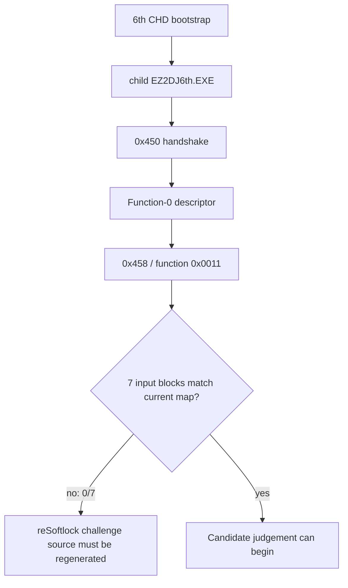

# ez2dj6th Hardlock 변환 경계

## 한국어

### 확인됨 — 2026-09-06, 올바른 CHD 실행

`EZ2DJ/EZ2DJ.EXE` bootstrap에 6th CHD를 연결하고 `EZ2DJ6th.EXE` child를 추적한 실행에서 다음 경계를 확인했습니다.

- child 생성과 runtime handoff가 성공했습니다.
- child가 자신의 `EZ2DJ.ini`를 CHD VFS에서 읽었습니다.
- `0x450` handshake 2회와 Function-0 descriptor 1회 뒤 `0x458` transform 요청 1회가 발생했습니다.
- transform descriptor의 function은 `0x0011`이고 입력 block은 7개이며 각 block은 8바이트입니다.
- 올바른 CHD를 포함한 194개 후보 실행 모두 같은 transform 경계까지 도달했습니다.
- 기존 후보 map을 주입한 194개 실행에서는 7개 block이 모두 `unmapped`였습니다.

대표 child trace는 `logs/windows_x86_launcher_probe/ez2dj6th/20260906-175433-575.child.vfs.log`입니다. 입력 추출 기능을 포함한 확인 실행은 `20260906-180222-512`이며 child는 종료 코드 `0x00000000`으로 종료했습니다. 원시 입력 block은 저장소에 기록하지 않고 외부 임시 파일로만 추출했습니다.

### 해석

현재 `cfg/ez2dj6th/maps/`의 194개 map은 실행 실패로 판정된 것이 아닙니다. 이 map들은 정적 `challenges.txt`의 42개 challenge를 기준으로 생성되었지만, 실제 6th child가 `0x0011` 변환 단계에서 전달하는 7개 입력과 일치하지 않습니다. 따라서 지금까지의 sweep은 seed 후보를 제거하는 판단이 아니라, challenge 생성 경계가 잘못되었음을 확인한 것입니다.

### 다음 작업

1. 외부 임시 덤프의 7개 입력을 reSoftlock의 새 6th challenge 입력으로 사용합니다.
2. 기존 194개 seed 후보에 대해 7개 입력용 response map을 다시 생성합니다.
3. 새 map을 주입하고 모든 transform block이 `mapped=7:unmapped=0`인지 먼저 확인합니다.
4. 그 조건을 만족한 후보만 child의 후속 실행 경계와 `EZ2DJ.ini` 재접근 여부로 판정합니다.

response/seed 계산 알고리즘은 re2DJ에 구현하지 않습니다. re2DJ는 reSoftlock이 만든 map을 주입하고 원본 실행의 경계를 관찰하는 역할만 유지합니다.

### 미확정

- 6th의 실제 Hardlock response와 seed.
- 실행 중 생성되는 7개 입력이 원본 파일의 정적 challenge와 어떻게 연결되는지.
- 새 challenge 입력으로 생성한 후보 중 원본 실행을 완전히 통과하는 후보.

### 확인됨 — runtime challenge 재생성 및 194개 map 검증

6th EXE에 reSoftlock의 정적 challenge 추출을 적용하면 20개가 생성되며, runtime `function=0x0011` 입력 7개와의 교집합은 0개였습니다. runtime 입력 7개를 challenge 파일로 사용해 기존 194개 seed 후보의 map을 다시 생성하면 모든 후보가 `mapped=7:unmapped=0`이 됩니다.

하지만 194개 실행은 모두 transform 직후 정상적인 후속 인증 경계에 도달하지 않았습니다. 193개는 `0xc0000005`, 1개는 다른 종료 코드와 crash context를 남겼습니다. 어떤 후보도 transform 이후 추가 `EZ2DJ.ini` 접근이나 원본이 수용한 후속 Hardlock 경계를 재현하지 못했습니다. fault 주소 분포는 후보 선별 기준으로 사용하지 않았습니다.

map을 주입하지 않은 baseline은 transform 뒤 Function `0x0001` descriptor까지 도달하고 종료 코드 `0x00000000`을 남겼지만, 이것은 response가 맞다는 증거가 아닙니다. 오히려 현재 reSoftlock의 `HL_CRYPT` map을 Function `0x0011`에 적용하는 방식 또는 4th 기반 초기 descriptor response가 6th와 호환되지 않을 가능성을 보여줍니다.

### 추정 — 2026-09-11, Function `0x0011`은 `API_CODE`

2EZConfig-V2의 상위 계약(사실 대조만 함, [Hardlock API function 코드](../kb/hardlock-api-functions.md))에서 Function 17(`0x11`)은 `API_CODE`입니다. `API_CODE`는 끝에서 두 번째 블록을 입력으로 **한 번** 계산해 payload 여러 위치에 쓰고, 일부 블록에는 더하며, 마지막 블록은 유지합니다. 응답이 블록마다 독립이 아니므로, 위에서 7개 입력 블록 각각에 `HL_CRYPT`를 적용한 map은 **모양부터** 이 계약과 맞지 않습니다. 194개 후보가 모두 실패한 결과는 seed 후보를 제거하는 근거가 아닐 가능성이 큽니다.

같은 요청을 보내는 `ez2d2m`에서는 7개 입력 중 블록 5만 실행·환경과 무관하게 같고 나머지는 바뀌는 것이 확인됐습니다([ez2d2m 분석](ez2d2m-chd-filesystem.md)). 6th의 7개 입력도 같은 구조인지는 **미확정**이며, 6th의 map을 재판별하기 전에 입력을 여러 번 받아 확인해야 합니다. re2DJ는 이런 응답을 담는 요청 행을 갖추었습니다([설계 247](../design/20260911-247-hardlock-payload-response-rows.md)).

## English

### Confirmed — 2026-09-06, correct CHD-backed execution

With the 6th CHD attached to the `EZ2DJ/EZ2DJ.EXE` bootstrap and the `EZ2DJ6th.EXE` child followed, the following boundary is confirmed:

- Child creation and runtime handoff succeed.
- The child reads its own `EZ2DJ.ini` through the CHD VFS.
- Two `0x450` handshakes, one Function-0 descriptor, and one `0x458` transform request occur.
- The transform descriptor uses function `0x0011` with seven eight-byte input blocks.
- All 194 candidate runs reach this transform boundary when the correct CHD is supplied.
- With the existing candidate maps injected, all seven blocks are `unmapped` in all 194 runs.

The representative child trace is `logs/windows_x86_launcher_probe/ez2dj6th/20260906-175433-575.child.vfs.log`. The input-dump verification run is `20260906-180222-512`; the child exits with code `0x00000000`. Raw input blocks are kept only in an external temporary file and are not stored in the repository.

### Interpretation

The 194 maps under `cfg/ez2dj6th/maps/` are not proven bad. They were generated from the 42-entry static `challenges.txt`, while the real 6th child supplies seven different inputs at the `0x0011` transform boundary. The sweep therefore does not eliminate seed candidates; it proves that the challenge-generation boundary must be regenerated.

### Confirmed — runtime challenge regeneration and 194-map validation

Running reSoftlock's static challenge extraction on the 6th executable produces 20 entries, with zero intersection against the seven runtime inputs from the `function=0x0011` request. Regenerating maps for the existing 194 seed candidates from the seven runtime inputs makes every candidate report `mapped=7:unmapped=0`.

However, none of the 194 runs reaches a valid post-transform authentication boundary. 193 leave through `0xc0000005`, while one leaves with a different termination code and crash context. No candidate reproduces a later `EZ2DJ.ini` access or a later Hardlock boundary accepted by the original. Fault-address distribution is not used for judgement.

The no-map baseline reaches a Function `0x0001` descriptor after transform and exits with `0x00000000`, but this is not evidence of a valid response. It instead indicates that applying reSoftlock's current `HL_CRYPT` maps to Function `0x0011`, or using the 4th-based initial descriptor response, may not be compatible with 6th.

### Next steps

1. Use the seven inputs from the external temporary dump as the new 6th challenge input for reSoftlock.
2. Regenerate response maps for the existing 194 seed candidates.
3. Inject the new maps and first require `mapped=7:unmapped=0` for the transform request.
4. Judge only fully mapped candidates by later child execution boundaries, including the post-transform `EZ2DJ.ini` access.

The response/seed algorithm remains in reSoftlock. re2DJ only injects generated maps and observes the original execution boundary.

### Unresolved

- The actual 6th Hardlock response and seed.
- The relationship between the seven runtime-generated inputs and static executable challenges.
- Which regenerated candidate, if any, fully passes the original execution.

### Inferred — 2026-09-11, Function `0x0011` is `API_CODE`

In 2EZConfig-V2's high-level contract, consulted for facts only ([Hardlock API function codes](../kb/hardlock-api-functions.md)), Function 17 (`0x11`) is `API_CODE`. It computes **once** from the second-to-last block, writes the result to several places in the payload, adds into some blocks and keeps the last one. Because its answer is not independent per block, the maps above that applied `HL_CRYPT` to each of the seven input blocks do not fit the contract **even in shape**, and the failure of all 194 candidates is most likely not evidence for eliminating seed candidates.

On `ez2d2m`, which sends the same request, only block 5 of the seven inputs is confirmed to stay the same across runs and environments while the rest change ([the ez2d2m analysis](ez2d2m-chd-filesystem.md)). Whether 6th's seven inputs share that structure is **unresolved** and should be checked by capturing them more than once before re-judging 6th's maps. re2DJ now has request rows able to carry such an answer ([design 247](../design/20260911-247-hardlock-payload-response-rows.md)).
