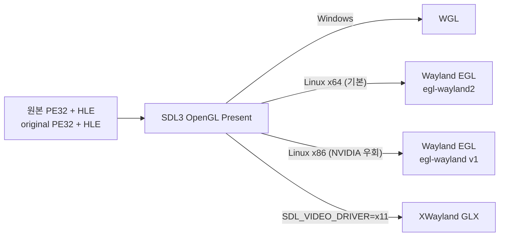

# Windows와 Linux x86·x64 성능 비교 / Windows compared with Linux x86 and x64 performance

[작업 453](../work-logs/20261005-453-release-screenshots-performance.md)에서 Windows x86 in-process 러너의 성능을 쟀다([Windows in-process 러너 성능](windows-in-process-performance.md)). 같은 PC에서 같은 조건으로 Linux x86·x64 Release를 재서 그 결과와 비교했다. 측정은 [#4](https://github.com/reexec/re2DJ/issues/4)에서 했다([작업 로그](../work-logs/20261005-i004-linux-windows-performance.md)).

*[Task 453](../work-logs/20261005-453-release-screenshots-performance.md) measured the Windows x86 in-process runner ([Windows in-process runner performance](windows-in-process-performance.md)); the Linux x86 and x64 Release builds were measured on the same PC under the same conditions and compared with it in [#4](https://github.com/reexec/re2DJ/issues/4) ([work log](../work-logs/20261005-i004-linux-windows-performance.md)).*

## 요약 / Summary

- **확인됨**: 기본 설정(vsync on)에서는 세 빌드 모두 다섯 타깃이 평균 59.4~60 fps다. CPU는 Linux x64가 가장 낮다. 코어 하나 기준 4.0~12.6%로, Windows(9.1~16.9%)의 절반 안팎이다. Linux x86(8.4~18.5%)은 Windows와 비슷하다.
- **확인됨**: vsync off 처리량은 Linux x64가 Windows in-process의 ×1.47~×3.37이다(6th만 ×0.98). Linux x86(NVIDIA Wayland 우회 경로)은 ×0.54~×1.03이다.
- **확인됨(단일 측정)**: Linux x86이 느린 주된 이유는 NVIDIA 32비트에서 쓰는 `egl-wayland` v1 표시 경로다. x64도 이 경로로 돌리면 처리량이 29~49% 떨어지고 CPU가 66~79%로 내려간다(표시에서 기다린다). 두 빌드를 X11로 맞추면 x86은 x64의 51~84%가 되고, 4th·1st SE는 Windows보다 빠르다.
- **확인됨**: 메모리는 Linux RSS가 Windows working set보다 7~45% 많다. Linux `VmData`는 Windows private bytes와 비슷하다(−4~+2%).

*Confirmed: at the default (vsync on) all three builds keep the five targets at 59.4 to 60 fps on average, with Linux x64 using the least CPU — 4.0 to 12.6% of one core, about half of Windows' 9.1 to 16.9% — and Linux x86 (8.4 to 18.5%) close to Windows. Confirmed: vsync-off throughput on Linux x64 is ×1.47 to ×3.37 that of the Windows in-process runner (×0.98 for 6th alone), and on Linux x86 (the NVIDIA Wayland workaround path) ×0.54 to ×1.03. Confirmed (single runs): Linux x86 is slow mainly because of the `egl-wayland` v1 presentation path used for NVIDIA's 32-bit driver; running x64 through it costs 29 to 49% of throughput with CPU falling to 66 to 79% (waiting in presentation), and with both builds on X11, x86 reaches 51 to 84% of x64 and beats Windows on 4th and 1st SE. Confirmed: Linux RSS is 7 to 45% above the Windows working set, and Linux `VmData` is close to Windows private bytes (−4 to +2%).*

## 측정 조건 / Conditions

| 항목 | Windows(작업 453) | Linux(#4) |
| --- | --- | --- |
| PC | Ryzen 5 5600X(6코어 12스레드), RTX 4090, 3840x2160 60 Hz, Windows 11 Pro 26200 | 같은 CPU·GPU, 5120x2880 59.99 Hz 두 대, Ubuntu 26.04.1(커널 7.0), GNOME Wayland, NVIDIA 595.91.07 |
| 빌드 | in-process 러너, Release x86(MSVC) | v0.0.65 + #3 브랜치, `linux-x64-release`·`linux-x86-release`(GCC 15.2) |
| 표시 | SDL3 OpenGL(WGL) | SDL3 OpenGL, 네이티브 Wayland EGL. x64는 기본 `egl-wayland2`, x86은 NVIDIA 32비트 문제로 `egl-wayland` v1([가이드](../guides/linux-sdl3-build.md)) |
| 실행 | 타깃마다 vsync on/off 40초, 2배 창(1280x960), 입력 없음, 1회 | 같음. 조건마다 2회, x64·x86 번갈아 |
| vsync off | 임시 패치(`PresentSync::kImmediate`) | 같은 임시 패치 |
| FPS | 1초마다 창 제목 | 같은 `FrameRate` 값을 임시 패치로 로그에 기록(Wayland에서는 다른 프로세스가 창 제목을 읽지 못함) |
| CPU·메모리 | 프로세스 트리 1초 샘플 | 프로세스 트리(6th 자식 포함) 1초 샘플: `/proc/<pid>/stat` utime+stime, `VmRSS`, `VmData`, `smaps_rollup` Private |
| 집계 | 15초 이후 | 같음. 두 회의 평균, 최저 FPS는 두 회 중 낮은 값 |

*The table pairs each condition: the same CPU and GPU (two 5120x2880 59.99 Hz displays, Ubuntu 26.04.1 with kernel 7.0, GNOME Wayland, NVIDIA 595.91.07 on Linux); the Windows in-process Release x86 (MSVC) against `linux-x64-release` and `linux-x86-release` (GCC 15.2) from v0.0.65 plus the #3 branch; SDL3 OpenGL on WGL against native Wayland EGL, x64 on the default `egl-wayland2` and x86 on `egl-wayland` v1 for NVIDIA's 32-bit driver ([guide](../guides/linux-sdl3-build.md)); 40 s per target with vsync on and off in the 2x window (1280x960) with no input, once on Windows and twice per condition on Linux alternating x64 and x86; the same temporary vsync-off patch; the same `FrameRate` value read from the window title on Windows and written to the log by a temporary patch on Linux, where another process cannot read a window title; per-second samples of the process tree (6th's child included) — utime+stime from `/proc/<pid>/stat`, `VmRSS`, `VmData` and Private from `smaps_rollup`; aggregated after 15 s, averaging the two Linux runs and taking the lower minimum FPS.*

## 결과 / Results

### vsync off — 처리량 / throughput

| 타깃 | Windows 주입 | Windows in-process | Linux x86 | Linux x64 | x86 / Win in-process | x64 / Win in-process |
| --- | --- | --- | --- | --- | --- | --- |
| 4th | 796 / 497, 78% | 657 / 357, 126% | 442 / 180, 81% | 988 / 664, 97% | ×0.67 | ×1.50 |
| 1st SE | 1168 / 1101, 69% | 908 / 881, 78% | 938 / 683, 77% | 3056 / 2747, 98% | ×1.03 | ×3.37 |
| 5th | 900 / 878, 76% | 801 / 790, 127% | 558 / 456, 79% | 1177 / 1045, 98% | ×0.70 | ×1.47 |
| 6th | 849 / 810, 139% | 711 / 700, 118% | 384 / 228, 84% | 700 / 601, 99% | ×0.54 | ×0.98 |
| 2nd MOVE | 1120 / 744, 70% | 1231 / 1063, 130% | 907 / 687, 75% | 2523 / 1703, 97% | ×0.74 | ×2.05 |

값은 평균 FPS / 최저 FPS, CPU(코어 하나를 100%로 본 값)다. Linux 두 회의 평균 FPS 차이는 4th x86 6%, 5th x86 7%, 나머지 4% 이하다.

*Values are average FPS / lowest FPS and CPU in percent of one core. The two Linux runs differ in average FPS by 6% for 4th x86, 7% for 5th x86 and 4% or less elsewhere.*

### 표시 경로 대조 / Presentation-path control (vsync off, 단일 측정 / single runs)

| 타깃 | x64 Wayland(`egl-wayland2`) | x64 Wayland(`egl-wayland` v1) | x64 X11 | x86 Wayland(`egl-wayland` v1) | x86 X11 |
| --- | --- | --- | --- | --- | --- |
| 4th | 988, 97% | 703, 79% | 1037, 99% | 442, 81% | 757, 100% |
| 1st SE | 3056, 98% | 1570, 66% | 3141, 99% | 938, 77% | 1591, 101% |
| 6th | 700, 99% | 498, 77% | 741, 100% | 384, 84% | 622, 102% |

값은 평균 FPS, CPU다. x64·x86 Wayland 기본 열은 위 표(두 회 평균)에서 가져왔다.

*Values are average FPS and CPU; the x64 and x86 default Wayland columns come from the table above (two-run averages).*

### vsync on — 기본 설정 / the default

| 타깃 | CPU Win / x86 / x64 | 평균 FPS Win / x86 / x64 | 최저 FPS Win / x86 / x64 | 첫 FPS Win / x86 / x64 |
| --- | --- | --- | --- | --- |
| 4th | 16.9% / 15.1% / 7.8% | 60.0 / 59.7 / 59.8 | 60 / 53.0 / 56.2 | 3.4 / 2.0 / 1.9 s |
| 1st SE | 9.1% / 8.4% / 4.0% | 60.1 / 59.9 / 59.9 | 60 / 58.3 / 58.6 | 5.6 / 4.6 / 4.5 s |
| 5th | 11.9% / 13.8% / 8.4% | 59.7 / 59.4 / 59.5 | 52 / 48.4 / 51.2 | 3.3 / 2.0 / 1.9 s |
| 6th | 11.7% / 18.5% / 12.6% | 59.6 / 59.5 / 59.5 | 50 / 48.2 / 46.2 | 3.3 / 2.3 / 2.2 s |
| 2nd MOVE | 12.4% / 9.6% / 5.0% | 59.9 / 60.0 / 59.7 | 58 / 59.2 / 56.8 | 4.4 / 3.9 / 3.6 s |

Windows의 최저 FPS는 창 제목의 정수 값이고, 첫 FPS 시각은 1초 샘플이라 ±1초다. Linux는 로그 시각으로 재서 0.1초 단위다.

*Windows' lowest FPS is the window title's integer and its first-FPS time comes from 1 s samples (±1 s); Linux times come from log timestamps, to 0.1 s.*

### 메모리 / Memory (vsync on)

| 타깃 | Working set(Win) / RSS(x86 / x64) | Private bytes(Win, 최대) / VmData(x86 / x64, 최대) | 상주 private(x86 / x64, 최대) |
| --- | --- | --- | --- |
| 4th | 294 / 355 / 349 MB | 771 / 741 / 748 MB | 333 / 232 MB |
| 1st SE | 150 / 217 / 210 MB | 679 / 654 / 668 MB | 193 / 93 MB |
| 5th | 310 / 369 / 365 MB | 783 / 751 / 759 MB | 348 / 248 MB |
| 6th | 413 / 467 / 471 MB | 1407 / 1400 / 1431 MB | 427 / 342 MB |
| 2nd MOVE | 897 / 964 / 958 MB | 1416 / 1370 / 1384 MB | 938 / 842 MB |

## 해석 / Interpretation

- **확인됨**: 플레이 체감에 해당하는 기본 설정에서는 세 빌드에 차이가 없다. 평균 60 fps이고, vsync off 처리량이 가장 낮은 경우(6th x86, 384 fps)도 60 fps의 6배다.
- **확인됨(단일 측정)**: Linux x86의 낮은 처리량과 100% 밑의 CPU는 주로 `egl-wayland` v1 표시 경로 탓이다. 같은 경로에서 x64도 CPU가 66~79%로 내려가고 처리량이 줄었다. X11로 바꾸면 두 빌드 모두 CPU가 100%에 닿는다. 그래서 NVIDIA에서 x86 빌드를 쓸 때는 처리량 면에서 `SDL_VIDEO_DRIVER=x11` 쪽이 낫다. vsync on에서는 두 우회 방법 모두 60 fps라 체감 차이는 없다.
- **추정**: X11에서 남는 x86과 x64의 차이(x86이 x64의 51~84%)는 32비트 호스트 코드에서 온다. HLE 처리기와 그래픽 코어가 i386으로 컴파일되면 레지스터가 적고 64비트 연산이 나뉜다. 32비트 GL 드라이버의 차이도 있을 수 있다. 프로파일로 확인하지 않았다.
- **추정**: Linux x64가 Windows in-process(x86)보다 빠른 것은 호스트 코드가 64비트라는 점, 그리고 Linux의 게스트 전환이 Windows보다 가볍다는 점 때문으로 보인다. Windows의 import bridge는 fs:0 SEH 체인과 그림자 TEB를 맞추는데([Windows 문서](windows-in-process-performance.md)), Linux x64는 far transition과 FS base 복원만 한다. 같은 x86 호스트끼리인 Linux x86 X11과 Windows in-process는 4th +15%, 1st SE +75%, 6th −12%로 엇갈린다.
- **추정**: Windows in-process는 vsync off에서 CPU가 100%를 넘고(78~130%), Linux는 x64가 97~99%, X11의 x86이 100~102%다. Linux에서는 한 코어가 한계인 셈이다. Windows의 SDL·드라이버 스레드 분담이 다르기 때문으로 보이며, 확인하지 않았다.
- **추정**: RSS가 Windows working set보다 많은 것은 GL 드라이버와 SDL 공유 라이브러리를 세는 방식이 달라서로 보인다. `VmData`가 Windows private bytes와 거의 같은 것은 두 OS 모두 게스트 주소 공간을 미리 확보하기 때문으로 보인다. 상주 private는 x86이 x64보다 85~100 MB 많은데, 원인은 **미확정**이다.
- **미확정**: 6th는 세 빌드 모두 vsync on 최저 FPS가 46~50으로 낮다. 게임 쪽 장면 전환인지 호스트 쪽 끊김인지는 프레임 시간 기록으로 확인해야 한다.
- **미확정**: Windows는 조건마다 한 번만 쟀고 Linux는 두 번 쟀다. 표시 경로 대조는 한 번씩이다. 10~20% 차이를 확정하려면 반복 측정이 더 필요하다.

*Confirmed: at the default, which is what play feels like, the three builds do not differ: 60 fps on average, the lowest vsync-off throughput (6th on x86, 384 fps) still six times 60. Confirmed (single runs): Linux x86's lower throughput and sub-100% CPU come mainly from the `egl-wayland` v1 presentation path: on that path x64's CPU also falls to 66 to 79% with lower throughput, and on X11 both builds reach 100% CPU, so for throughput the x86 build on NVIDIA does better with `SDL_VIDEO_DRIVER=x11`, while at vsync on both workarounds hold 60 fps with no felt difference. Inferred: the remaining x86-to-x64 gap on X11 (x86 at 51 to 84% of x64) comes from 32-bit host code — HLE handlers and the graphics core compiled for i386 with fewer registers and split 64-bit arithmetic — and perhaps the 32-bit GL driver; not profiled. Inferred: Linux x64 beats the Windows in-process (x86) build because its host code is 64-bit and its guest transitions are lighter — Windows' import bridge keeps the fs:0 SEH chain and the shadow TEB in step ([Windows document](windows-in-process-performance.md)) while Linux x64 does a far transition and restores the FS base — and between the two x86 hosts, Linux x86 on X11 and Windows in-process, the results are mixed: +15% for 4th, +75% for 1st SE, −12% for 6th. Inferred: the Windows in-process build goes above 100% CPU with vsync off (78 to 130%) while Linux sits at 97 to 99% for x64 and 100 to 102% for x86 on X11, bounded by one core, apparently from a different split of SDL and driver work across threads on Windows; not confirmed. Inferred: RSS above the Windows working set reflects how GL driver and SDL shared libraries are counted, and `VmData` matching Windows private bytes reflects both OSes reserving the guest address space up front; resident private memory is 85 to 100 MB higher on x86 than x64 for unresolved reasons. Unresolved: 6th's vsync-on minimum is low on all three (46 to 50 fps); frame-time records would tell a game-side scene change from a host-side stall. Unresolved: Windows ran once per condition, Linux twice, and the presentation-path control once, so settling 10 to 20% differences needs more repetitions.*
