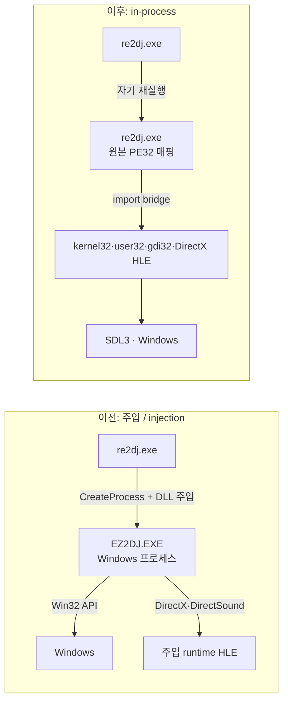

# Windows in-process 러너 성능 / Windows in-process runner performance

작업 446~450에서 Windows 실행 방식을 주입(원본 PE32를 별도 Windows 프로세스로 띄우고 runtime DLL을 주입)에서 in-process 러너(re2dj 자기 프로세스 안에 원본 PE32를 매핑)로 바꿨다. 이 문서는 그 전후의 실행 성능을 같은 PC에서 비교한 결과다. 측정은 작업 453에서 했다([작업 로그](../work-logs/20261005-453-release-screenshots-performance.md)).

*Tasks 446 to 450 moved Windows execution from injection (the original PE32 started as its own Windows process with a runtime DLL injected) to the in-process runner (the original PE32 mapped into re2dj's own process). This document compares run performance before and after on one PC, measured in task 453 ([work log](../work-logs/20261005-453-release-screenshots-performance.md)).*

같은 PC에서 Linux x86·x64와 비교한 결과는 [Windows와 Linux x86·x64 성능 비교](linux-windows-performance.md)에 있다.

*The comparison with Linux x86 and x64 on the same PC is in [Windows compared with Linux x86 and x64 performance](linux-windows-performance.md).*

## 요약 / Summary

- **확인됨**: vsync를 끈 최대 처리량은 in-process 쪽이 4th −17%, 1st SE −22%, 5th −11%, 6th −16% 낮고 2nd MOVE만 +10% 높다. 프레임당 CPU 시간은 6th(×1.02)를 빼고 ×1.5~×2.0이다.
- **확인됨**: 기본 설정(vsync on)에서는 두 방식 모두 다섯 타깃이 평균 60fps를 유지한다. CPU는 코어 하나 기준 2~4%p 늘었고, 최저 FPS와 첫 화면까지의 시간은 같거나 나아졌다.
- **확인됨**: Private bytes는 2~5배(최대 1.4 GB) 늘었다. Working set은 6th(274 → 415 MB)를 빼면 비슷하다.
- **추정**: 처리량 저하는 OS가 직접 처리하던 kernel32·user32 호출이 이제 import bridge와 HLE handler를 거치는 비용, 그리고 게스트 스레드를 하나씩만 돌리는 전역 게스트 잠금에서 온다. 프로파일링으로는 확인하지 않았다([TODO](../TODO.md)).

*Confirmed: with vsync off, peak throughput under the in-process runner is 17% lower for 4th, 22% for 1st SE, 11% for 5th and 16% for 6th, and 10% higher for 2nd MOVE; CPU time per frame is ×1.5 to ×2.0 except for 6th (×1.02). Confirmed: at the default (vsync on) both keep all five targets at 60 fps on average, CPU rising by 2 to 4 points of one core, with the lowest FPS and the time to the first frame the same or better. Confirmed: private bytes grow 2 to 5 times (up to 1.4 GB) while the working set stays close except for 6th (274 → 415 MB). Inferred: the throughput loss comes from kernel32 and user32 calls the OS used to serve now crossing the import bridge and HLE handlers, and from the global guest lock running one guest thread at a time; not confirmed by profiling ([TODO](../TODO.md)).*

## 측정 조건 / Conditions

| 항목 | 값 |
| --- | --- |
| PC | AMD Ryzen 5 5600X(6코어 12스레드), 32 GB, NVIDIA GeForce RTX 4090, 3840x2160 60 Hz, Windows 11 Pro 26200 |
| 이전 | v0.0.62 태그 소스를 Release(x86, MSVC)로 빌드한 주입 경로. `re2dj <target> [--vsync off]` |
| 이후 | `feature/windows-in-process-loader`(작업 452 시점) Release(x86, MSVC). vsync off는 측정용 임시 패치(환경 변수로 `PresentSync::kImmediate`)로만 켰고 측정 후 되돌렸다 |
| 실행 | 타깃마다 vsync on/off를 두 빌드가 번갈아 40초씩, 창 모드 2배(1280x960), 입력 없음(어트랙트 화면) |
| 수집 | 1초마다 실행에 딸린 프로세스 트리 전체의 누적 CPU 시간·working set·private bytes, 창 제목의 FPS. 15초 이후를 안정 구간으로 집계 |

*PC: Ryzen 5 5600X (6 cores, 12 threads), 32 GB, RTX 4090, 3840x2160 at 60 Hz, Windows 11 Pro 26200. Before: the injection path built in Release (x86, MSVC) from the v0.0.62 tag, run as `re2dj <target> [--vsync off]`. After: `feature/windows-in-process-loader` as of task 452 in Release (x86, MSVC), vsync off enabled only by a temporary measuring patch (an environment variable selecting `PresentSync::kImmediate`) reverted afterwards. Each target ran 40 s per build with vsync on and off, the builds alternating, in the 2x window (1280x960) with no input (attract screens). Every second the whole process tree's cumulative CPU time, working set and private bytes and the window title's FPS were sampled, and samples after 15 s form the steady window.*

GitHub에 게시된 v0.0.61 Windows 패키지는 처음 실행 뒤 Windows Defender가 `re2dj.exe`를 악성으로 판정해 격리했다. 그래서 이전 쪽은 같은 Windows 경로를 가진 v0.0.62 태그를 직접 빌드해 썼다(v0.0.62의 변경은 Linux 게임패드뿐이다). 직접 빌드한 실행 파일은 격리되지 않았다.

*Windows Defender quarantined `re2dj.exe` from the published v0.0.61 Windows package after its first run, so the before side was built from the v0.0.62 tag, which has the same Windows path (v0.0.62 changed only Linux gamepads); the locally built executable was not quarantined.*

## 결과 / Results

### vsync off — 처리량 / throughput

| 타깃 | 이전 FPS(평균 / 최저) | 이후 FPS(평균 / 최저) | 변화 | 이전 CPU | 이후 CPU | 프레임당 CPU |
| --- | --- | --- | --- | --- | --- | --- |
| 4th | 796 / 497 | 657 / 357 | −17% | 78% | 126% | ×1.95 |
| 1st SE | 1168 / 1101 | 908 / 881 | −22% | 69% | 78% | ×1.46 |
| 5th | 900 / 878 | 801 / 790 | −11% | 76% | 127% | ×1.88 |
| 6th | 849 / 810 | 711 / 700 | −16% | 139%* | 118% | ×1.02 |
| 2nd MOVE | 1120 / 744 | 1231 / 1063 | +10% | 70% | 130% | ×1.69 |

CPU는 코어 하나를 100%로 본 값이다. \* 이전 6th는 런처 `EZ2DJ.EXE`와 `EZ2DJ6th.EXE`가 함께 떠 있다.

*CPU is in percent of one core. \* Before, 6th has the launcher `EZ2DJ.EXE` and `EZ2DJ6th.EXE` running together.*

### vsync on — 기본 설정 / the default

| 타깃 | CPU 이전 → 이후 | 평균 FPS 이전 → 이후 | 최저 FPS 이전 → 이후 | 첫 FPS 표시 이전 → 이후 |
| --- | --- | --- | --- | --- |
| 4th | 13.3% → 16.9% | 59.8 → 60.0 | 55 → 60 | 3.5 s → 3.4 s |
| 1st SE | 5.7% → 9.1% | 59.8 → 60.1 | 54 → 60 | 5.7 s → 5.6 s |
| 5th | 9.9% → 11.9% | 59.6 → 59.7 | 49 → 52 | 4.5 s → 3.3 s |
| 6th | 13.7% → 11.7% | 59.2 → 59.6 | 38 → 50 | 3.3 s → 3.3 s |
| 2nd MOVE | 10.9% → 12.4% | 59.9 → 59.9 | 58 → 58 | 5.6 s → 4.4 s |

첫 FPS 표시는 1초 간격 샘플이라 ±1초 오차가 있다.

*The first-FPS time comes from 1 s samples and carries ±1 s.*

### 메모리 / Memory

| 타깃 | Working set 이전 → 이후 | Private bytes(최대) 이전 → 이후 |
| --- | --- | --- |
| 4th | 271 → 294 MB | 269 → 771 MB |
| 1st SE | 160 → 150 MB | 157 → 679 MB |
| 5th | 282 → 310 MB | 280 → 783 MB |
| 6th | 273 → 413 MB | 264 → 1407 MB |
| 2nd MOVE | 888 → 897 MB | 885 → 1416 MB |

## 해석 / Interpretation

- **확인됨**: 기본 설정에서는 차이가 체감되지 않는다. vsync off 처리량이 60fps의 7~20배라 여유가 크다.
- **추정**: 이전 경로에서는 `GetTickCount`·`timeGetTime`·`QueryPerformanceCounter`·`EnterCriticalSection`·메시지 큐 같은 호출을 Windows가 직접 처리했다. 이후 경로에서는 이 호출마다 import bridge(fs:0 SEH 체인 이동, 그림자 TEB, 스택 검사)와 HLE handler를 지난다. DirectX·DirectSound는 두 경로 모두 HLE라 차이의 원인이 아니다.
- **추정**: [`native_guest_threads.h`](../../src/platform/native/native_guest_threads.h)의 전역 게스트 잠금은 게스트 코드와 import handler를 한 번에 한 스레드만 돌린다. vsync off에서 CPU가 100%를 넘는데도 처리량이 낮은 것과 맞는다.
- **추정**: Private bytes 증가는 게스트 주소 공간을 미리 commit하는 몫으로 보인다. Working set이 비슷하기 때문이다.
- **미확정**: 2nd MOVE만 빨라진 이유와 6th의 working set 증가. 확인하려면 vsync off 실행에서 import별 호출 횟수와 샘플링 프로파일을 본다.
- **미확정**: 조건마다 한 번씩만 측정했다. 같은 조건의 첫 시험에서 이후 5th가 425fps, 이번에 801fps였을 만큼 편차가 커서, 10~20% 차이를 확정하려면 반복 측정이 필요하다.

*Confirmed: at the default the difference is not noticeable, vsync-off throughput being 7 to 20 times 60 fps. Inferred: calls such as `GetTickCount`, `timeGetTime`, `QueryPerformanceCounter`, `EnterCriticalSection` and the message queue were served by Windows before and now each cross the import bridge (moving the fs:0 SEH chain, the shadow TEB, the stack checks) and an HLE handler; DirectX and DirectSound were HLE on both paths and are not the cause. Inferred: the global guest lock in [`native_guest_threads.h`](../../src/platform/native/native_guest_threads.h) runs guest code and import handlers on one thread at a time, consistent with lower throughput despite CPU above 100% with vsync off. Inferred: the private-bytes growth looks like the guest address space committed up front, since the working set stays close. Unresolved: why only 2nd MOVE got faster and why 6th's working set grew; import call counts and a sampling profile of a vsync-off run would tell. Unresolved: each condition ran once, and an earlier trial gave the after build 425 fps on 5th against 801 fps here, so repeated runs are needed to settle differences of 10 to 20%.*
