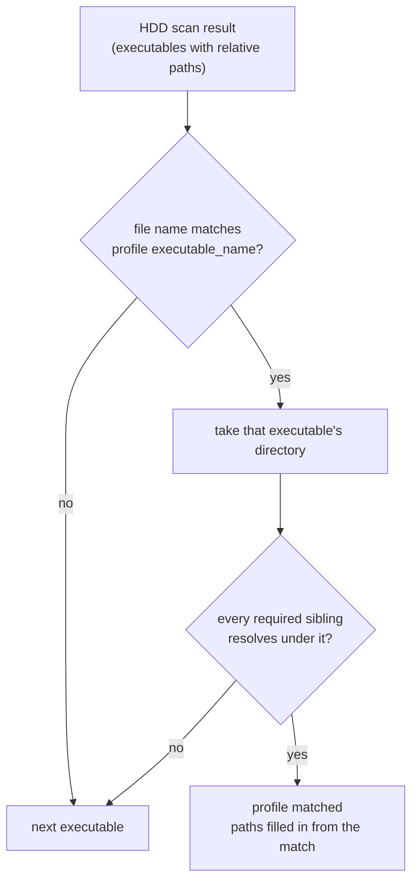

# 내장 타깃 프로파일 설계

## 배경

[작업 로그 004](../work-logs/20260822-004-first-dump-analysis.md)에서 기본 타깃 선택이 틀렸다는 결함을 기록했다. 후보 순위가 "게스트 형식 GUI 우선, 같은 등급에서는 파일 크기 내림차순"이라, 1st SE 덤프에서 서비스 도구 `Test.exe`(1.86 MB)가 게임 `ez2dj.exe`(561 KB)보다 먼저 뽑힌다.

당시 결론은 "순위 휴리스틱을 더 정교하게 만드는 것은 또 다른 추측을 쌓는 일이므로, 경로가 확인되었으니 내장 타깃 프로파일을 추가하는 것이 옳은 해법"이었다. 이 문서가 그 설계다.

## 새로 확인된 사실

1st SE 덤프의 `System.ini` `[boot]` 절에 결정적 증거가 있다.

```ini
shell=d:\ez2dj\ez2dj.exe
```

Windows 98은 `shell=` 항목이 가리키는 프로그램을 Explorer 대신 띄운다. 즉 아케이드 캐비닛이 부팅 직후 실행하는 것이 **`ez2dj.exe`**다. 여기서 세 가지가 한 번에 확정된다.

| 항목 | 값 |
| --- | --- |
| 정식 실행 파일 | `ez2dj.exe` |
| 게스트 드라이브 문자 | `D:` |
| 게스트 작업 디렉터리 | `\ez2dj` |

드라이브 문자와 작업 디렉터리는 `docs/EXE_DESIGN.*`에서 미확정으로 남아 있던 항목이다.

## 정식 타깃과 bring-up 타깃을 분리한다

`ez2dj.exe`는 보호되어 있다. 진입점이 `.gtide` 섹션 안에 있고, 그 스텁은 자기 자신을 풀어 원래 코드 섹션에 써 넣으므로 자기 수정 코드다. 인터프리터 backend가 성숙하기 전에는 실행할 수 없다.

`ez2dj1.exe`는 보호되지 않았고 앞 다섯 섹션 배치가 `ez2dj.exe`와 같다. Stage 2·3을 진행하기에 적합하다.

두 파일은 **역할이 다르다.** 하나로 합치면 어느 쪽도 정확히 표현하지 못한다.

* `ez2dj.exe` — 캐비닛이 실제로 실행한 것. 프로젝트가 최종적으로 실행해야 하는 것. **기본 타깃.**
* `ez2dj1.exe` — 보호되지 않아 로더 개발에 쓰기 좋은 것. 캐비닛이 실행한 것이 **아니다.**

따라서 프로파일을 둘로 나누고, bring-up 쪽에는 그것이 정식 실행 파일이 아니라는 사실을 프로파일 자체에 기록한다. 나중에 누군가 `ez2dj1.exe`로 관찰한 동작을 원본 동작으로 인용하는 것을 막기 위해서다.

## 프로파일 식별 방식

내장 프로파일이 어떤 덤프에 해당하는지 판단해야 한다. 세 가지 제약이 있다.

1. **덤프 루트가 중첩될 수 있다.** 사용자가 `<root>/se/ez2dj/`처럼 상위 디렉터리를 지정할 수 있다.
2. **경로 해석이 대소문자를 무시한다.** 3rd의 `EZ2DJ.EXE`라는 이름만으로는 1st SE의 `ez2dj.exe`와 구별되지 않는다.
3. **파일 크기와 해시는 근거가 약하다.** 리비전마다 달라지고, 덤프마다 다를 수 있다.

그래서 **지문(fingerprint)** 방식을 쓴다. 프로파일마다 실행 파일 이름과, 그 실행 파일과 같은 디렉터리에 반드시 있어야 하는 항목 목록을 선언한다.



중첩은 자동으로 해결된다. 실행 파일을 스캔 결과에서 찾으므로 깊이에 상관없이 걸리고, 형제 항목도 그 실행 파일의 디렉터리를 기준으로 확인하기 때문이다.

대소문자 문제도 해결된다. 두 프로파일의 지문이 서로소이기 때문이다.

| 프로파일 | 실행 파일 | 필수 형제 항목 |
| --- | --- | --- |
| `ez2dj1stse` | `ez2dj.exe` | `ez2dj1.exe`, `ez2dj.ini`, `System.ini`, `Songs`, `System` |
| `ez2dj1stse_unpacked` | `ez2dj1.exe` | `ez2dj.exe`, `ez2dj.ini`, `Songs`, `System` |
| `ez2dj3rd` | `EZ2DJ.EXE` | `EZ2DJ.INI`, `FONTKR.DAT`, `BG`, `Sound`, `system` |

3rd 덤프에는 `Songs/`가 없고 1st SE 덤프에는 `FONTKR.DAT`가 없으므로, 이름이 대소문자만 다른 상태에서도 서로를 오인하지 않는다.

## 감지된 프로파일은 없애지 않는다

내장 프로파일에 없는 버전의 덤프도 여전히 동작해야 한다. 기존 `DetectTargetProfiles()`를 유지하되 순서를 바꾼다.

1. 내장 프로파일 중 지문이 맞는 것
2. 내장 프로파일이 이미 가져간 실행 파일을 제외한 나머지에서 감지한 것

1st SE 덤프에서는 내장 둘이 `ez2dj.exe`와 `ez2dj1.exe`를 가져가고, `Test.exe`와 `PlzPowerOff.exe`가 감지 프로파일로 뒤에 남는다. 기본 타깃은 목록 첫 번째이므로 `ez2dj1stse`가 되어 결함이 해소된다.

## 보호 여부는 계산한다

프로파일에 "보호됨"을 상수로 적을 수도 있지만, 그러면 내장 프로파일이 없는 덤프에서는 아무것도 알 수 없다. 대신 PE 헤더에서 계산한다.

진입점이 놓인 섹션 이름을 찾고, 그것이 `.text`가 아니면 보호 계층을 의심한다. 확보한 표본 다섯 개 전부에서 이 판정이 맞는다.

| 파일 | 진입점 섹션 | 판정 |
| --- | --- | --- |
| `ez2dj1.exe` | `.text` | 정상 |
| `Test.exe` | `.text` | 정상 |
| `PlzPowerOff.exe` | `.text` | 정상 |
| `ez2dj.exe` | `.gtide` | 의심 |
| `EZ2DJ.EXE` | `.protect` | 의심 |

**이것은 휴리스틱이지 증명이 아니다.** 정상적인 프로그램도 진입점을 `.text` 밖에 둘 수 있고, 보호된 프로그램이 진입점만 `.text`에 남겨 둘 수도 있다. 그래서 함수 이름과 출력 문구 모두 단정하지 않고 "`.text` 밖"이라는 관찰 사실만 말한다.

## 프로파일이 담을 것

기존 필드에 다음을 더한다.

| 필드 | 이유 |
| --- | --- |
| `guest_drive_letter` | `System.ini`로 확인됨(`D:`). Stage 5 경로 변환이 쓴다 |
| `guest_directory` | 같음(`\ez2dj`). 게스트가 자신이 있다고 믿는 Win32 경로 |
| `is_bring_up_target` | 정식 실행 파일이 아님을 프로파일 자체에 기록한다 |
| `note` | 그 이유를 사람이 읽을 수 있게 남긴다 |

3rd 덤프에는 `System.ini`가 없어 드라이브 문자와 게스트 디렉터리를 확인할 수 없다. **추측해 채우지 않고 비워 둔다.** 비어 있음이 "모른다"를 정확히 표현한다.

## 검증

* 1st SE 덤프에서 기본 타깃이 `ez2dj1stse` → `ez2dj.exe`가 된다
* 3rd 덤프에서 기본 타깃이 `ez2dj3rd` → `EZ2DJ.EXE`가 된다
* 두 덤프가 서로의 프로파일에 걸리지 않는다
* 내장 프로파일이 없는 디렉터리에서도 감지 프로파일이 그대로 동작한다
* 중첩된 루트(`<root>/se/ez2dj/`)를 지정해도 같은 프로파일이 잡힌다
* 단위 테스트로 위 전부를 고정한다

## Background

[Work log 004](../work-logs/20260822-004-first-dump-analysis.md) recorded a defect: default target selection breaks ties by descending file size, so the service tool `Test.exe` outranks the game `ez2dj.exe` in the 1st SE dump. The conclusion then was that refining the heuristic would stack another guess, and that built-in target profiles were the correct fix now that paths are confirmed. This is that design.

## Newly confirmed facts

The `[boot]` section of the 1st SE dump's `System.ini` reads `shell=d:\ez2dj\ez2dj.exe`. Windows 98 launches whatever `shell=` names in place of Explorer, so the cabinet runs **`ez2dj.exe`** at boot. That fixes three things at once: the canonical executable is `ez2dj.exe`, the guest drive letter is `D:`, and the guest working directory is `\ez2dj`. The latter two were unresolved items in the `EXE_DESIGN` documents.

## Canonical and bring-up targets are separate

`ez2dj.exe` is protected — its entry point sits in `.gtide`, and the stub unpacks itself into the original code sections, which is self-modifying code that no immature interpreter can run. `ez2dj1.exe` is unprotected and shares the first five sections' layout, which suits Stages 2 and 3.

The two files have **different roles**, and merging them into one profile would represent neither accurately. `ez2dj.exe` is what the cabinet ran and what the project must ultimately execute, so it is the default. `ez2dj1.exe` is convenient for loader development and is **not** what the cabinet ran. The bring-up profile therefore records that fact in the profile itself, so nobody later cites behavior observed through `ez2dj1.exe` as original behavior.

## How a profile is identified

Three constraints shape this: a user may point at a parent directory such as `<root>/se/ez2dj/`; path resolution is case-insensitive, so the name `EZ2DJ.EXE` alone does not distinguish 3rd from 1st SE; and file sizes and hashes are weak evidence that varies per revision and per dump.

So each profile declares a **fingerprint**: an executable file name plus the entries that must exist beside it. Matching searches the scan for an executable whose file name matches, then checks the required siblings resolve relative to that executable's directory. Nesting resolves itself because the search runs over scan results at any depth, and the case-insensitivity problem resolves itself because the two fingerprints are disjoint — the 3rd dump has no `Songs/` and the 1st SE dump has no `FONTKR.DAT`.

## Detected profiles are kept

A dump of a version with no built-in profile must still work, so `DetectTargetProfiles()` stays and only the ordering changes: built-in matches first, then detection over the executables no built-in claimed. In the 1st SE dump the two built-ins claim `ez2dj.exe` and `ez2dj1.exe`, leaving `Test.exe` and `PlzPowerOff.exe` as detected entries behind them. The default is the first entry, so it becomes `ez2dj1stse` and the defect is resolved.

## Protection status is computed

A profile could state "protected" as a constant, but then a dump with no built-in profile would reveal nothing. Instead the entry point's section name is looked up in the PE header, and anything other than `.text` raises suspicion. That verdict holds for all five samples in hand.

**This is a heuristic, not proof.** A legitimate program may place its entry point outside `.text`, and a protected one may leave its entry point inside it. The function name and the printed wording therefore assert only the observation — that the entry point lies outside `.text`.

## What a profile carries

Added to the existing fields: `guest_drive_letter` and `guest_directory`, both confirmed from `System.ini` and needed by Stage 5 path translation; `is_bring_up_target`, recording in the profile that this is not the canonical executable; and `note`, giving a human-readable reason.

The 3rd dump has no `System.ini`, so its drive letter and guest directory cannot be confirmed. They are **left empty rather than guessed**, because empty states "not known" exactly.

## Verification

The 1st SE dump defaults to `ez2dj1stse` → `ez2dj.exe`; the 3rd dump defaults to `ez2dj3rd` → `EZ2DJ.EXE`; neither dump matches the other's profile; detection still works in a directory with no built-in profile; a nested root such as `<root>/se/ez2dj/` yields the same profile; and unit tests pin all of it.
