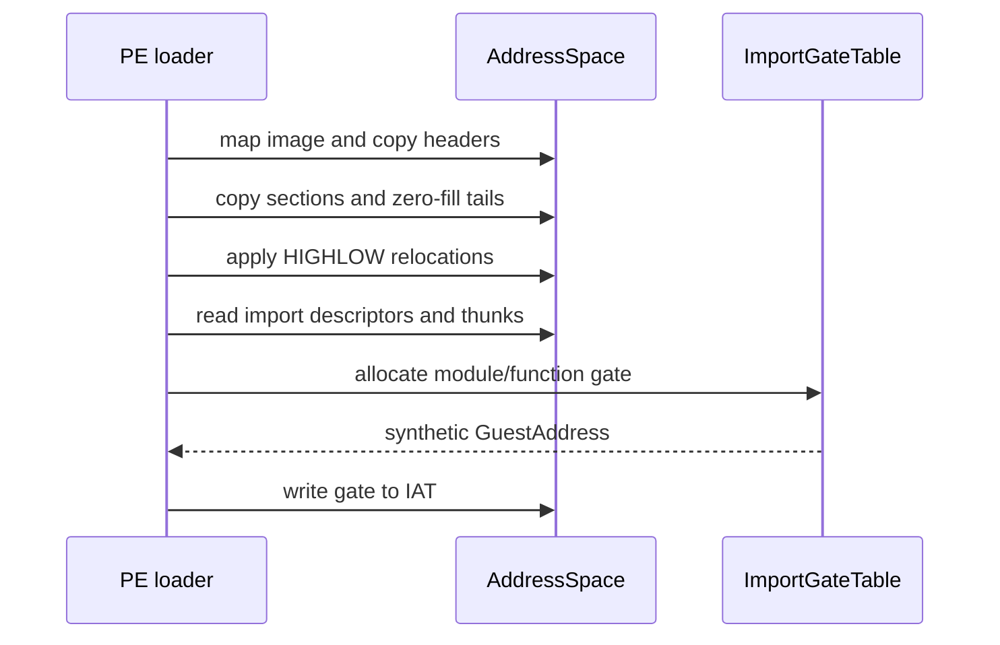

# Stage 2 PE 로더와 게스트 주소 공간 설계

## 배경

Stage 2는 원본 32비트 x86 PE32 실행 파일을 실행 backend에 전달하기 전 필요한 메모리·이미지 로딩 경계를 정의합니다. 이번 단계의 대상은 `GuestAddress`, `AddressSpace`, PE32 섹션 매핑, 기본 재배치, import 해석 및 합성 gate 주소의 IAT 기록입니다. 원본 게임 코드의 실행과 실제 HLE API 동작은 이후 단계의 책임입니다.

## Background

Stage 2 defines the memory and image-loading boundary needed before a 32-bit x86 PE32 executable can be handed to an execution backend. This stage covers `GuestAddress`, `AddressSpace`, PE32 section mapping, basic relocation, import resolution, and writing synthetic gate addresses into the IAT. Executing the original code and implementing HLE API behavior remain later-stage responsibilities.

## 설계

`GuestAddress`는 산술과 비교를 제공하는 32비트 값 타입이며 host pointer로 변환하지 않습니다. `AddressSpace`는 예약된 게스트 범위와 실제 저장소를 분리하고, 읽기·쓰기 API를 통해서만 접근을 허용합니다. 처음 구현은 매핑 요청을 4 KiB 페이지 경계로 확장한 host-backed 바이트 배열로 관리하며, 겹치는 매핑과 32비트 주소 오버플로를 거부합니다.

`PeLoader`는 다음 순서로 동작합니다.

1. `SizeOfImage` 범위를 매핑하고 `SizeOfHeaders`를 복사합니다.
2. 각 섹션의 raw 데이터를 `VirtualAddress`에 복사하고 `VirtualSize`까지 0으로 채웁니다.
3. 실제 로드 주소와 선호 `ImageBase`가 다르면 relocation directory의 `IMAGE_REL_BASED_HIGHLOW` 항목을 적용합니다.
4. import descriptor와 ILT를 읽고, 이름 또는 ordinal별 gate를 등록합니다.
5. 반환한 gate 주소를 IAT에 기록하고 엔트리 포인트를 보고합니다.

The loader does not execute code, call host DLLs, or infer unsupported relocation types. Malformed RVAs, truncated descriptors, unterminated thunk arrays, overlapping sections, and unsupported relocation types fail the load rather than being guessed through.

## Gate 정책

gate 주소는 `AddressSpace`의 예약 범위에 속하는 값이며 실제 x86 명령어를 저장하지 않습니다. `ImportGateTable`은 `(DLL, name|ordinal)`을 gate 주소에 매핑하고, 이후 execution backend가 이 주소를 감지해 HLE dispatcher로 전달할 수 있도록 메타데이터를 보존합니다. 현재 단계에서는 import 목록 전체에 gate를 배정하며 구현되지 않은 API도 로드 단계에서 제외하지 않습니다.

## 검증 전략

원본 자산을 저장소에 추가하지 않고 synthetic PE32 바이트 배열을 테스트 fixture로 확장합니다. 테스트는 주소 범위/권한, 섹션 raw 및 zero-fill, 선호 주소에서의 로드, HIGHLOW 재배치, 이름·ordinal import, IAT 기록, malformed input 거부를 확인합니다. 기존 PE header reader와 전체 unit test 및 CMake build를 함께 실행합니다.

## Verification strategy

No original asset is added to the repository. The existing synthetic PE32 byte fixture is extended for tests covering address ranges and permissions, section raw and zero-fill mapping, preferred-base loading, HIGHLOW relocation, named and ordinal imports, IAT writes, and malformed-input rejection. The existing PE reader tests, the complete unit suite, and the CMake build are run together.

