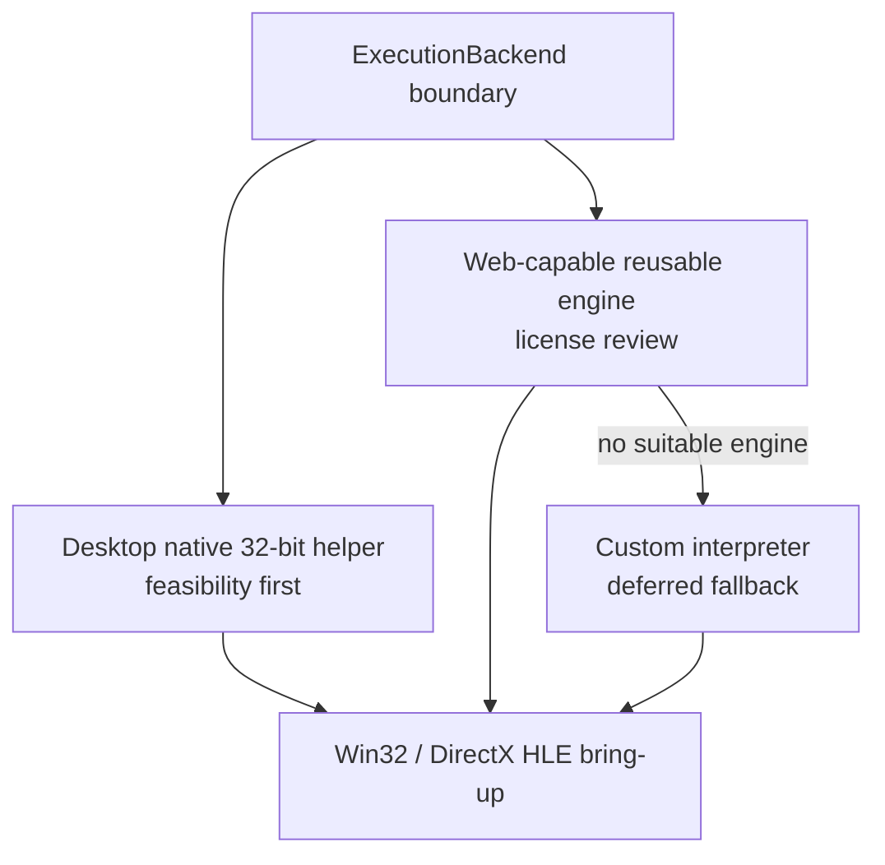

# 직접 x86 인터프리터 후순위화 설계

## 결정

직접 작성하는 x86-32 인터프리터를 다음 즉시 구현 단계에서 제외하고 Web 또는 공용 fallback 실행 경로가 필요해지는 시점까지 미룹니다. `ExecutionBackend` 경계는 먼저 설계하되 구현 우선순위는 다음과 같습니다.

1. Windows x64와 Linux x86-64에서 별도 32비트 helper 프로세스로 원본 x86 코드를 네이티브 실행할 수 있는지 검증합니다.
2. WebAssembly까지 지원할 수 있고 프로젝트의 BSD 3-Clause 정책과 호환되는 재사용 가능 실행 엔진을 조사합니다.
3. 앞의 두 경로로 요구사항을 충족하지 못할 때 직접 인터프리터를 구현합니다.

## Decision

Defer a custom x86-32 interpreter from the next implementation stage until a Web or shared fallback execution path requires it. Define the `ExecutionBackend` boundary first, then prioritize: validating a separate native 32-bit helper process on Windows x64 and Linux x86-64; evaluating reusable Web-capable execution engines compatible with the BSD 3-Clause policy; and implementing a custom interpreter only if those paths cannot satisfy the requirements.

## 근거

x86-64 운영체제는 별도 32비트 프로세스에서 x86 코드를 CPU로 실행할 수 있습니다. Windows는 WOW64를 제공하고 Wine도 x86-64 Unix 호스트에서 32비트 Windows 응용프로그램을 지원합니다. 반면 WebAssembly는 x86 명령어를 직접 실행하지 못하므로 Web 단계에는 인터프리터, DBT 또는 외부 실행 엔진 중 하나가 여전히 필요합니다.

Wine/Proton은 동작 비교와 조사 기준으로 사용할 수 있지만 프로젝트 실행 경로에 소스를 통합하지 않습니다. Wine의 LGPL과 프로젝트 라이선스 정책이 충돌하고 Proton은 Wine 기반 Linux 호환 도구이므로 Windows/Web 공용 backend가 아닙니다.

## Rationale

An x86-64 operating system can let the CPU execute x86 code in a separate 32-bit process. Windows provides WOW64, and Wine supports 32-bit Windows applications on x86-64 Unix hosts. WebAssembly cannot execute x86 instructions directly, so the Web stage still needs an interpreter, DBT, or external execution engine.

Wine and Proton may serve as behavioral references, but their source is not integrated into the project runtime. Wine's LGPL conflicts with project policy, and Proton is a Wine-based Linux compatibility tool rather than a shared Windows/Web backend.

## 보존되는 경계

Stage 2의 `GuestAddress`, `AddressSpace`, PE32 loader, import gate 메타데이터는 유지합니다. 네이티브 helper가 PE 적재를 운영체제에 맡기더라도 import 목록, HLE 서비스 식별, Web/fallback backend, 검증 도구에서 이 구조가 필요합니다. backend별 메모리 표현 차이는 `ExecutionBackend` adapter가 흡수합니다.

## Preserved boundaries

Stage 2's `GuestAddress`, `AddressSpace`, PE32 loader, and import-gate metadata remain. Even if a native helper delegates PE mapping to the operating system, these structures remain useful for import inventory, HLE service identification, Web/fallback backends, and verification tools. `ExecutionBackend` adapters isolate backend-specific memory representations.

## 참고 자료

* [Microsoft WOW64 Implementation Details](https://learn.microsoft.com/windows/win32/winprog64/wow64-implementation-details)
* [WineHQ: About Wine](https://www.winehq.org/about/)
* [Valve Proton repository](https://github.com/ValveSoftware/Proton)
