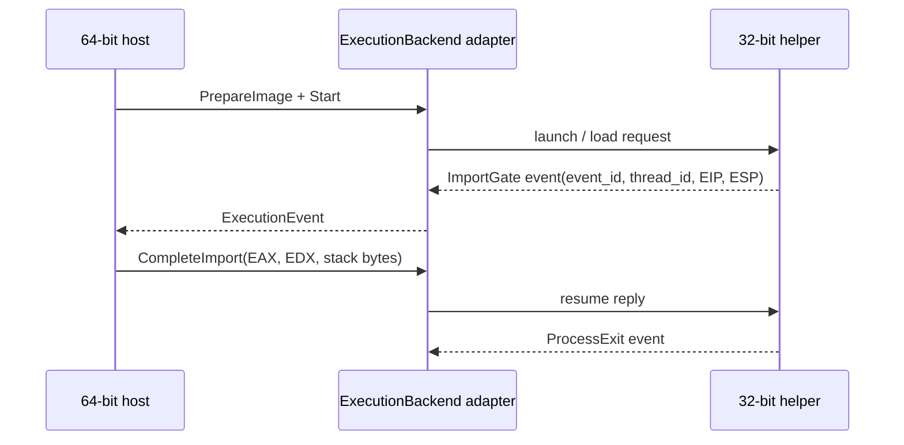

# 실행 backend 경계와 WOW64 probe 설계

## 목표

Stage 3의 첫 작업으로 backend 공용 경계를 고정하고, 64비트 Windows 호스트에서 별도 32비트 프로세스가 x86 코드를 네이티브 실행해 HLE gate 함수로 진입할 수 있는지 최소 probe로 검증합니다.

## Goal

The first Stage 3 task fixes the shared backend boundary and uses a minimal probe to verify that a separate 32-bit process on a 64-bit Windows host can execute x86 code natively and enter an HLE gate function.

## ExecutionBackend 경계

backend는 PE 이미지 준비, 실행 시작, event 대기, import 완료 응답, 중단 요청을 제공합니다. event는 backend 내부 구현이나 host pointer를 노출하지 않고 다음 값만 전달합니다.

* backend가 발급한 `event_id`
* backend-local `thread_id`
* 중단 이유: import gate, thread/process exit, fault, host stop
* 게스트 `EIP`, `ESP`, gate 주소
* exit 또는 fault 코드

import 응답에는 `EAX`, `EDX`, callee가 정리할 stack byte 수와 계속/중단 action을 담습니다. 이를 통해 `__stdcall`, 64비트 반환값, 미구현 API 중단을 backend 종류와 무관하게 표현합니다. 멀티스레드 backend는 여러 thread event를 queue할 수 있으며 `event_id`로 응답을 대응시킵니다.

## ExecutionBackend boundary

A backend prepares a PE image, starts execution, waits for events, completes import calls, and accepts stop requests. Events expose only backend-issued event IDs, backend-local thread IDs, stop reasons, guest EIP/ESP and gate addresses, and exit or fault codes—never implementation details or host pointers. Import replies carry EAX, EDX, callee-cleaned stack bytes, and a continue/stop action. This represents `__stdcall`, 64-bit returns, and unimplemented-API termination independently of the backend. Multithreaded backends may queue events and correlate replies by event ID.

## 첫 probe 범위

이번 probe는 IPC와 전체 PE mapper를 아직 구현하지 않습니다. Win32 x86 target을 별도 빌드하고 다음만 검증합니다.

1. 프로세스 pointer 폭이 32비트인지 확인합니다.
2. x64 Windows에서 WOW64 process인지 확인합니다.
3. 실행 가능한 메모리에 작은 x86 호출 시퀀스를 생성합니다.
4. 그 코드가 `__stdcall` C++ gate를 호출하고 `41`을 `42`로 바꾸는지 확인합니다.

이는 네이티브 x86→HLE 함수 호출의 feasibility 증거입니다. synthetic PE32 매핑, 64비트 host와의 IPC, import gate event 왕복은 후속 작업입니다.

## First probe scope

This probe does not yet implement IPC or a complete PE mapper. It builds a separate Win32 x86 target, confirms 32-bit pointer width and WOW64 execution, emits a small executable x86 call sequence, and verifies that it calls a `__stdcall` C++ gate that transforms `41` into `42`. This is feasibility evidence for native x86-to-HLE entry. Synthetic PE32 mapping, 64-bit host IPC, and import-event round trips follow later.

## 검증

* 기존 Windows x64 경고-오류 build와 unit test가 그대로 통과해야 합니다.
* Win32 probe를 경고-오류로 빌드하고 x64 Windows에서 실행해야 합니다.
* probe는 gate 호출 횟수 1, 결과 42를 확인한 경우에만 0으로 종료합니다.

## Verification

The existing Windows x64 warnings-as-errors build and unit tests must remain green. The Win32 probe must build with warnings as errors and run on x64 Windows, returning zero only when it observes one gate call and result 42.
