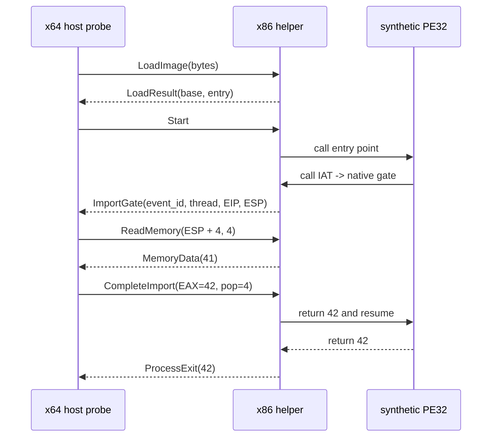

# Windows native helper synthetic PE32와 IPC 설계

## 목표

64비트 Windows host가 별도 Win32 x86 helper를 실행하고 synthetic PE32 이미지를 전달합니다. helper는 이미지를 선호 주소에 mapping하고 import IAT를 in-process gate에 연결합니다. guest가 gate를 호출하면 helper가 event를 64비트 host에 보내고, host는 helper의 guest stack을 읽어 HLE 결과를 돌려준 뒤 guest 실행을 재개합니다.

## Goal

A 64-bit Windows host launches a separate Win32 x86 helper and sends it a synthetic PE32 image. The helper maps the image at its preferred base and binds its import IAT to an in-process gate. When the guest calls the gate, the helper sends an event to the 64-bit host; the host reads the helper's guest stack, returns an HLE result, and resumes guest execution.

## Synthetic PE32

host가 실행 때 바이트 배열로 생성하며 저장소에 바이너리를 추가하지 않습니다.

* ImageBase `0x10000000`, entry RVA `0x1000`
* `.text`: `push 41; call dword ptr [IAT]; ret`
* `.idata`: `probe.dll!ProbeGate` 하나와 IAT/ILT
* helper는 `0x20000000` 기준 주소로 link해 guest 선호 주소와 충돌하지 않게 합니다.

## IPC protocol v1

anonymous pipe 두 개를 child stdin/stdout으로 연결합니다. 모든 packet은 little-endian 고정 폭 header와 payload를 사용합니다.

v1은 한 번에 하나의 import event만 처리합니다. packet header에 protocol magic/version과 payload size를 두고 예상하지 않은 순서·크기·magic은 양쪽 모두 실패로 처리합니다. helper의 진단 문자는 stderr만 사용해 binary stdout protocol과 섞이지 않게 합니다.

## 메모리 접근

`ExecutionBackend`에 guest memory read/write 메서드를 추가합니다. native helper adapter는 이를 IPC request로 구현하고 Web/fallback backend는 자체 `AddressSpace`에 연결할 수 있습니다. 이번 probe는 import 진입 시 `ESP + 4`의 첫 `__stdcall` 인자를 읽는 경로를 검증합니다. helper는 임의 주소 역참조 대신 `ReadProcessMemory`/`WriteProcessMemory`를 사용해 잘못된 주소를 protocol error로 반환합니다.

## Memory access

Add guest-memory read/write operations to `ExecutionBackend`. A native-helper adapter can implement them as IPC requests, while Web/fallback backends can connect them to their own `AddressSpace`. This probe reads the first `__stdcall` argument at `ESP + 4`. The helper uses `ReadProcessMemory` and `WriteProcessMemory` rather than unchecked pointer dereferences, returning protocol errors for invalid ranges.

## 제외 범위

* 원본 `ez2dj1.exe` 실행
* 일반 Win32 API HLE table
* relocation과 TLS callback 실행
* 병렬 import event와 실제 guest thread 생성
* Linux helper

## 검증

기존 x64 unit test와 Win32 gate probe를 유지합니다. 새 통합 script는 x64 host probe와 x86 helper를 각각 빌드하고 실행해 load base, entry point, import argument 41, process result 42, child exit code 0을 확인합니다.

## Verification

Keep the existing x64 unit suite and Win32 gate probe green. A new integration script builds the x64 host probe and x86 helper separately, then verifies load base, entry point, import argument 41, process result 42, and child exit code zero.
