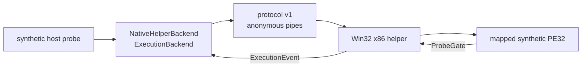
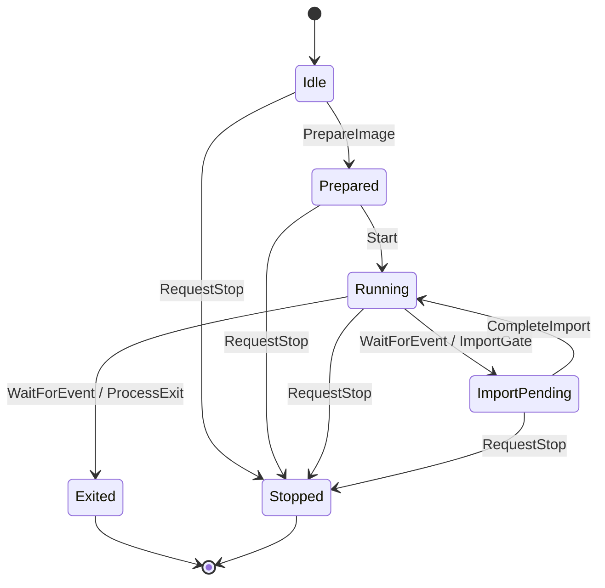

# Windows native helper backend adapter 설계

## 목표

검증된 Windows x64/Win32 x86 IPC prototype의 host 측 책임을 `ExecutionBackend` 구현으로 캡슐화합니다. 호출자는 anonymous pipe, packet 순서, child process handle을 알지 않고 공용 backend API로 image 준비, 실행, event 처리, memory 접근과 import 완료를 수행합니다.

## Goal

Encapsulate the validated Windows x64/Win32 x86 IPC prototype's host-side responsibilities in an `ExecutionBackend` implementation. Callers use the shared backend API for image preparation, execution, events, memory access, and import completion without knowing about anonymous pipes, packet ordering, or child-process handles.

## 구성

`NativeHelperBackend`의 공개 header는 Windows header를 포함하지 않으며 PImpl로 구현 세부 사항을 숨깁니다. Windows 전용 source가 helper process 생성, protocol v1 송수신, 상태 검증과 handle 정리를 소유합니다. 기존 host probe는 synthetic PE32 생성과 결과 검증만 유지합니다.

## Structure

The public `NativeHelperBackend` header includes no Windows headers and hides implementation details behind PImpl. Its Windows-only source owns helper-process creation, protocol-v1 transport, state validation, and handle cleanup. The existing host probe retains only synthetic-PE32 construction and result verification.

## 상태와 호출 규칙

adapter는 한 image와 한 직렬 event를 처리합니다. `PrepareImage()`는 helper를 시작하고 `LoadImage`/`LoadResult`를 완료합니다. `Start()` 이후 `WaitForEvent()`가 import event를 반환하면 memory read/write와 `CompleteImport()`만 허용합니다. process-exit event를 받은 뒤 helper의 정상 종료까지 확인합니다. 순서가 잘못된 호출은 pipe에 packet을 쓰지 않고 오류로 거부합니다.

## State and call rules

The adapter handles one image and one serialized event. `PrepareImage()` starts the helper and completes `LoadImage`/`LoadResult`. After `Start()`, an import event returned by `WaitForEvent()` enables memory reads/writes and `CompleteImport()`. A process-exit event also waits for clean helper termination. Calls made in an invalid order fail before writing packets to the pipe.

## 오류와 종료 정책

protocol magic, version, packet type와 payload 크기를 adapter에서 검증합니다. helper의 `Error` packet은 문자열 오류로 변환합니다. 소멸 또는 `RequestStop()` 때 입력 pipe를 닫아 정상 종료 기회를 주고, 제한 시간 안에 종료하지 않은 해당 child helper만 종료합니다. 사용자 자산이나 다른 process에는 영향을 주지 않습니다.

## Error and shutdown policy

The adapter validates protocol magic, version, packet type, and payload size. It converts helper `Error` packets into string errors. Destruction or `RequestStop()` closes the input pipe to allow a clean exit, then terminates only that child helper if it does not exit within a bounded interval. It never affects user assets or unrelated processes.

## 이번 범위의 제한

helper는 계속 synthetic `probe.dll!ProbeGate` 하나만 지원합니다. import별 범용 native thunk, relocation, TLS callback, 병렬 guest thread와 원본 실행 파일 실행은 이번 범위에 포함하지 않습니다. `LoadedPeImage.imports`는 이 prototype에서 비어 있으며, 범용 thunk 작업에서 실제 gate metadata와 함께 채웁니다.

## Scope limitations

The helper continues to support only the synthetic `probe.dll!ProbeGate`. Per-import native thunks, relocation, TLS callbacks, parallel guest threads, and original-executable execution are outside this scope. `LoadedPeImage.imports` remains empty in this prototype and will be populated with real gate metadata during the generic-thunk task.

## 검증

x64 unit suite와 기존 Win32 gate probe를 유지합니다. IPC integration probe를 adapter API만 사용하도록 바꾸고 load base, entry point, import event, stack argument `41`, memory write, completion result `42`, process exit과 child 정상 종료를 확인합니다.

## Verification

Keep the x64 unit suite and existing Win32 gate probe green. Convert the IPC integration probe to use only the adapter API and verify load base, entry point, import event, stack argument `41`, memory write, completion result `42`, process exit, and clean child termination.
