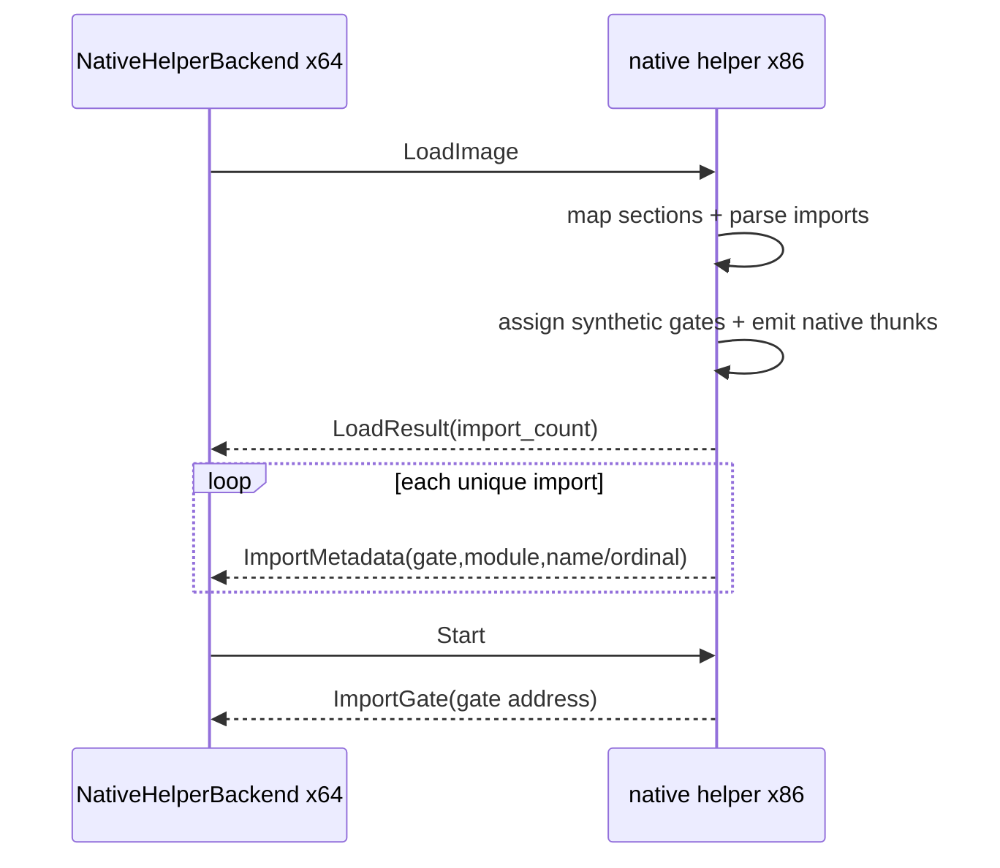
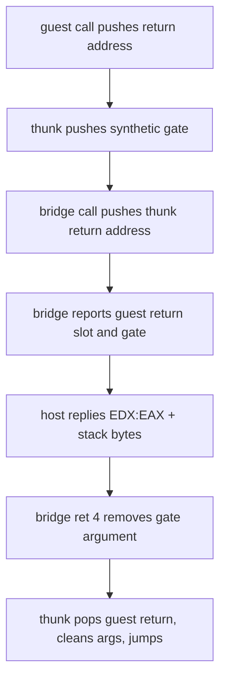

# Windows import별 native thunk 설계

## 목표

Win32 x86 helper의 `probe.dll!ProbeGate` 하드코딩을 제거합니다. PE32 import directory의 모든 이름/ordinal import를 읽고 import별 native thunk를 생성해 IAT에 바인딩합니다. x64 `NativeHelperBackend`에는 동일한 synthetic gate 주소와 module/name/ordinal metadata를 전달하여 `LoadedPeImage.imports`와 실행 event를 연결합니다.

## Goal

Remove the Win32 x86 helper's hard-coded `probe.dll!ProbeGate`. Read every named and ordinal import from the PE32 import directory, generate a native thunk per import, and bind it into the IAT. Send the same synthetic gate addresses and module/name/ordinal metadata to x64 `NativeHelperBackend`, connecting `LoadedPeImage.imports` to execution events.

## Protocol v2

`LoadResult`에 고유 import 수를 추가하고 뒤이어 그 수만큼 `ImportMetadata` packet을 보냅니다. metadata 고정 header는 synthetic gate 주소, ordinal 여부와 값, module/name byte 길이를 담고 문자열은 null terminator 없이 이어집니다. 양쪽은 전체 payload 크기, 문자열 상한과 ordinal/name 조합을 검증합니다. 이 변경은 v1과 호환되지 않으므로 protocol version을 2로 올립니다.

## Protocol v2

Add the unique import count to `LoadResult`, followed by that many `ImportMetadata` packets. A fixed metadata header carries the synthetic gate address, ordinal flag/value, and module/name byte lengths; non-null-terminated strings follow it. Both sides validate total payload size, string limits, and ordinal/name combinations. This is incompatible with v1, so the protocol version becomes 2.



## Import 해석과 gate identity

helper는 import descriptor를 종료 descriptor까지 순회합니다. `OriginalFirstThunk`가 0이면 `FirstThunk`를 lookup table로 사용합니다. thunk 값의 bit 31이 설정되면 ordinal, 아니면 `IMAGE_IMPORT_BY_NAME`의 hint 다음 문자열로 해석합니다. `ImportGateTable`을 사용해 module/name 또는 module/ordinal 조합에 `0xF0000000`부터 16바이트 간격의 안정된 synthetic gate 주소를 배정합니다. 중복 import는 같은 gate와 native thunk를 재사용합니다.

## Import parsing and gate identity

The helper walks import descriptors through the terminating descriptor. A zero `OriginalFirstThunk` falls back to `FirstThunk` as the lookup table. Bit 31 denotes an ordinal; otherwise the value points to the string after the `IMAGE_IMPORT_BY_NAME` hint. `ImportGateTable` assigns stable synthetic gate addresses at 16-byte intervals from `0xF0000000` for module/name or module/ordinal pairs. Duplicate imports reuse the same gate and native thunk.

## Native thunk

IAT에는 synthetic gate 주소가 아니라 helper process 안에서 실행 가능한 thunk 주소를 씁니다. 각 thunk는 synthetic gate 주소를 bridge 인자로 push하고 공용 `NativeImportGate`를 호출합니다. bridge가 완료 응답을 받으면 64비트 반환값으로 `EDX:EAX`를 복원하고 전역 직렬 cleanup 크기를 기록합니다. thunk는 guest return address를 꺼내고 요청된 byte만큼 guest stack을 정리한 뒤 그 주소로 jump합니다.

## Native thunk

The IAT receives an executable thunk address inside the helper process rather than the synthetic gate address. Each thunk pushes its synthetic gate address and calls the shared `NativeImportGate` bridge. After receiving completion, the bridge restores `EDX:EAX` through a 64-bit return and records the serialized cleanup size. The thunk pops the guest return address, removes the requested number of guest-stack bytes, and jumps to that address.

```text
push imm32 gate_address
call NativeImportGate
pop ecx
add esp, dword ptr [completion_stack_bytes]
jmp ecx
```



현재 protocol은 import event 하나를 직렬 처리하므로 cleanup 저장소도 하나입니다. 멀티스레드 event queue를 도입할 때 thread-local 또는 event별 resume frame으로 교체해야 합니다.

*Protocol v2 still serializes one import event, so it uses one cleanup slot. A multithreaded event queue must replace this with thread-local or per-event resume frames.*

## Synthetic 검증 image

synthetic PE32는 `probe.dll!ProbeGate`와 `probe.dll` ordinal `#7`을 import하고 두 IAT thunk를 차례로 호출합니다. 첫 호출은 인자 41에 EAX 42를 돌려받아 둘째 인자로 사용합니다. 둘째 호출은 EAX 43과 EDX 1을 돌려받고 guest가 두 register를 더해 최종 44로 종료합니다. host는 두 metadata와 두 event gate 주소, event ID, stack 인자, EDX:EAX와 cleanup을 확인합니다.

## Synthetic verification image

The synthetic PE32 imports `probe.dll!ProbeGate` and `probe.dll` ordinal `#7`, then calls both IAT thunks in sequence. The first call receives EAX 42 for argument 41 and uses it as the second argument. The second receives EAX 43 and EDX 1; guest code adds both registers and exits with 44. The host verifies both metadata records, both event gate addresses and IDs, stack arguments, EDX:EAX, and cleanup.

## 제외 범위

base relocation, TLS callback, delay-load import, bound import, forwarded export, 실제 Win32 HLE dispatcher와 병렬 guest thread는 이번 범위에 포함하지 않습니다. 원본 실행 파일은 metadata가 144개까지 생성되는지 별도 분석 단계에서 연결하며 이번 검증에는 포함하지 않습니다.

## Out of scope

Base relocation, TLS callbacks, delay-load imports, bound imports, forwarded exports, the real Win32 HLE dispatcher, and parallel guest threads are outside this task. Connecting the original executable and verifying all 144 metadata records belongs to a later analysis step.

## 검증

x64 warnings-as-errors build와 unit suite, 기존 Win32 gate probe를 유지합니다. adapter integration script에서 이름/ordinal metadata 2개와 두 번의 gate 왕복, EDX:EAX 복원, 최종 result 44 및 child exit 0을 확인합니다.

## Verification

Keep the x64 warnings-as-errors build and unit suite and the existing Win32 gate probe green. The adapter integration script verifies two named/ordinal metadata records, two gate round trips, EDX:EAX restoration, final result 44, and child exit zero.
