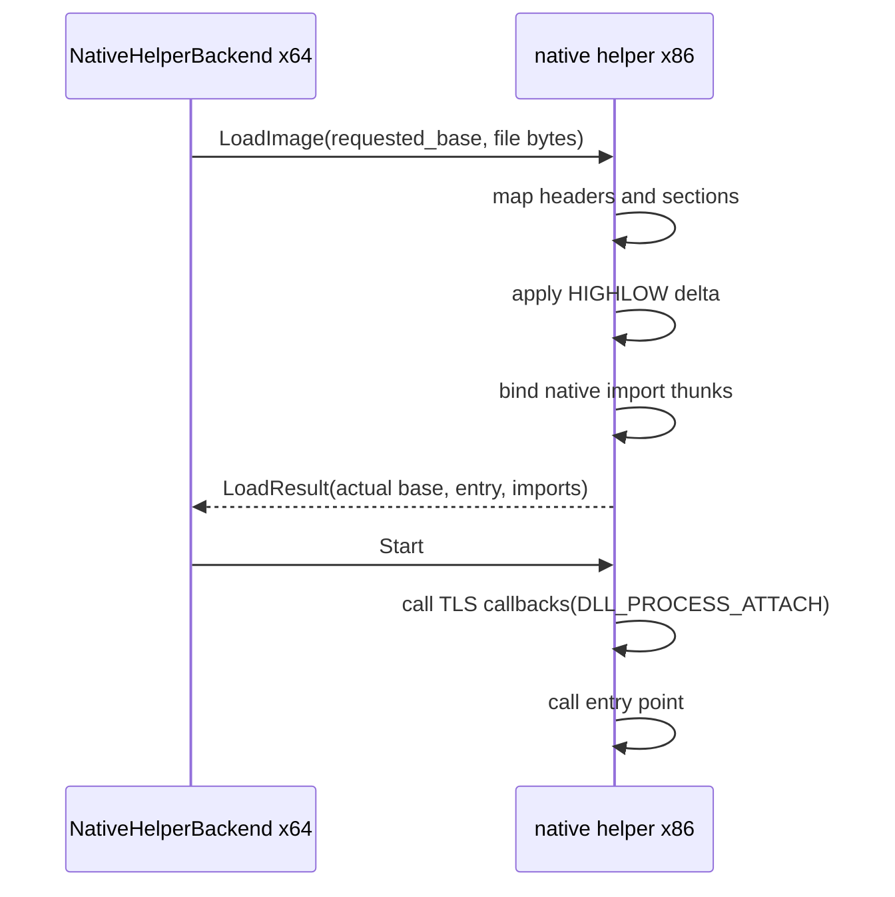

# Windows native helper relocation과 TLS callback 설계

## 목표

`NativeHelperBackend::PrepareImage()`의 `requested_base`를 Win32 x86 helper에 전달하고 PE32 `IMAGE_REL_BASED_HIGHLOW` relocation을 적용합니다. 실행 시작 시 PE TLS directory의 callback 배열을 `DLL_PROCESS_ATTACH`로 호출한 뒤 entry point를 실행합니다.

## Goal

Pass `NativeHelperBackend::PrepareImage()`'s `requested_base` to the Win32 x86 helper and apply PE32 `IMAGE_REL_BASED_HIGHLOW` relocations. On start, invoke the PE TLS directory's callback array with `DLL_PROCESS_ATTACH` before executing the entry point.

## Protocol v3

기존 `LoadImage` payload 앞에 `LoadImageRequest`를 추가합니다. 고정 header는 요청 load base와 뒤따르는 PE file byte 수를 담습니다. 요청 base가 0이면 helper가 PE preferred base를 사용합니다. helper의 `LoadResult`는 실제 base와 entry point를 반환하며 import metadata 흐름은 v2와 같습니다. payload 형식이 호환되지 않으므로 version을 3으로 올립니다.

## Protocol v3

Prefix the existing `LoadImage` payload with `LoadImageRequest`, a fixed header containing the requested load base and following PE-file byte count. A zero requested base selects the PE preferred base. `LoadResult` returns the actual base and entry point; the import-metadata flow remains as in v2. The incompatible payload format bumps the protocol version to 3.

## Native PE image 하위 시스템

helper 진입점에 남아 있는 image mapping을 `native_pe_image.h/.cpp`로 추출합니다. 이 하위 시스템은 정확한 주소의 `VirtualAlloc`, header/section copy와 zero-fill, relocation 적용, import thunk 연결, section protection, TLS callback 실행과 해제를 소유합니다. protocol 및 gate bridge는 `native_ipc_helper.cpp`에 남깁니다.

## Native PE image subsystem

Extract image mapping from the helper entry point into `native_pe_image.h/.cpp`. This subsystem owns exact-address `VirtualAlloc`, header/section copy and zero-fill, relocation application, import-thunk binding, section protection, TLS callback execution, and release. Protocol and the gate bridge remain in `native_ipc_helper.cpp`.

## Base relocation

실제 load base와 PE `ImageBase`의 차이가 0이면 relocation을 건너뜁니다. 차이가 있으면 directory 5를 block 단위로 검증하고 `ABSOLUTE`(0)는 무시하며 `HIGHLOW`(3) target의 32비트 값에 delta를 더합니다. directory가 없거나 block/target이 image 밖이거나 다른 type이면 적재를 실패시킵니다. relocation은 import IAT를 native thunk로 덮기 전에 적용합니다.

## Base relocation

Skip relocation when the actual load base equals PE `ImageBase`. Otherwise validate directory 5 block by block, ignore `ABSOLUTE` (0), and add the delta to each 32-bit `HIGHLOW` (3) target. Loading fails for a missing directory, malformed block, out-of-image target, or unsupported type. Relocations run before import IAT slots are overwritten with native thunks.

## TLS callback

PE32 TLS directory의 `AddressOfCallbacks`는 RVA가 아니라 VA이므로 relocation 적용 뒤 실제 load base 범위로 변환합니다. null-terminated callback VA 배열을 검증하고 각 callback을 image 순서대로 `(module_base, DLL_PROCESS_ATTACH, nullptr)`로 호출합니다. callback은 import thunk를 사용할 수 있으므로 import binding 및 section protection 뒤, guest entry point 전의 `Start` 경로에서 실행합니다.

## TLS callbacks

PE32 TLS `AddressOfCallbacks` is a VA rather than an RVA, so convert it against the actual load range after relocation. Validate the null-terminated callback-VA array and call each callback in image order with `(module_base, DLL_PROCESS_ATTACH, nullptr)`. A callback may use import thunks, so callbacks run after import binding and section protection but before the guest entry point in the `Start` path.

이번 범위는 callback 실행만 다룹니다. TLS raw template 복사, TLS index 할당, thread별 TLS block과 thread attach/detach callback은 멀티스레드 guest 지원과 함께 구현합니다.

*This task covers callback execution only. TLS raw-template copying, TLS-index allocation, per-thread TLS blocks, and thread attach/detach callbacks remain coupled to multithreaded guest support.*

## Synthetic 검증 image

preferred base `0x10000000`인 synthetic PE32를 `0x11000000`에 요청합니다. relocation directory는 두 import call operand, TLS callback 내부 absolute state 주소, entry의 state read, TLS callback directory/array VA를 보정합니다. callback은 guest state를 7로 설정합니다. 두 import 왕복 결과 44에 해당 state를 더해 최종 51로 종료하므로 relocation과 entry 이전 callback 실행을 함께 증명합니다.

## Synthetic verification image

Request synthetic PE32 with preferred base `0x10000000` at `0x11000000`. Its relocation directory fixes both import-call operands, the TLS callback's absolute state address, the entry's state read, and TLS directory/array VAs. The callback sets guest state to 7. Adding that state to the two-import result 44 produces final exit 51, proving relocation and callback-before-entry ordering together.

## 제외 범위

TLS storage/index, thread attach/detach, relocation type 1/2/4, delay import, exception 격리와 preferred base가 점유됐을 때의 자동 fallback은 포함하지 않습니다. 요청 주소에 정확히 mapping하지 못하면 명시적으로 실패합니다.

## Out of scope

TLS storage/index allocation, thread attach/detach, relocation types 1/2/4, delay imports, exception isolation, and automatic fallback when the preferred base is occupied are outside this task. Failure to map exactly at the requested address is explicit.

## 검증

x64/x86 warnings-as-errors build와 기존 test/probe를 유지합니다. protocol v3 integration에서 실제 base `0x11000000`, 이름/ordinal import metadata, 두 gate 왕복, TLS state 7이 반영된 result 51과 child exit 0을 확인합니다.

## Verification

Keep x64/x86 warnings-as-errors builds and existing tests/probes green. Protocol-v3 integration verifies actual base `0x11000000`, named/ordinal import metadata, two gate round trips, result 51 incorporating TLS state 7, and child exit zero.
