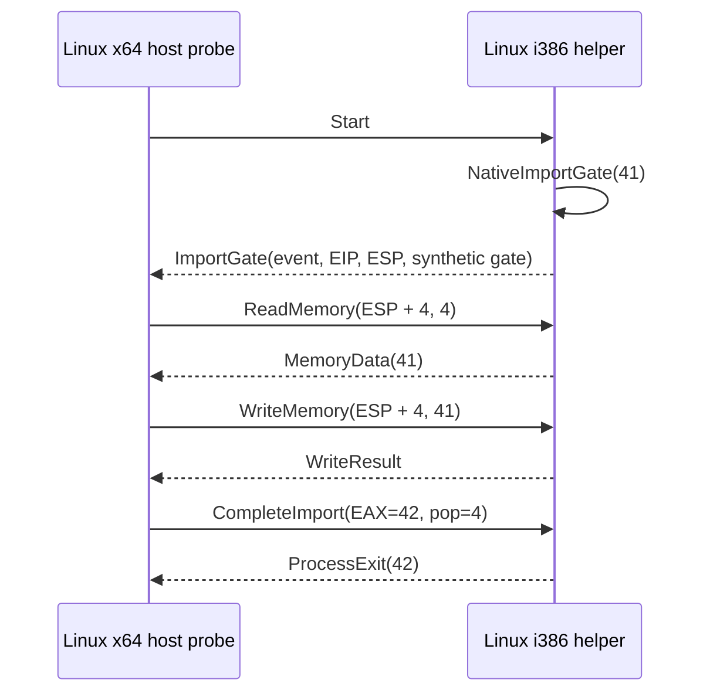

# Linux native x86 helper 최소 prototype 설계

## 목표

Linux x86-64 host가 별도 32비트 i386 helper를 실행하고, helper 안에서 실제 x86 `__stdcall` gate 호출을 발생시킵니다. gate event, guest stack memory read/write와 EAX completion을 pipe IPC로 왕복하여 Linux desktop native execution 경로의 기본 가능성을 검증합니다.

## Goal

Have a Linux x86-64 host launch a separate 32-bit i386 helper and perform a real x86 `__stdcall` gate call inside it. Round-trip the gate event, guest-stack memory read/write, and EAX completion over pipe IPC to validate the basic feasibility of the Linux desktop native-execution path.

## 범위

이번 단계는 Windows의 최초 native gate feasibility probe에 대응하는 Linux 최소 prototype입니다. helper는 컴파일된 `NativeImportGate(41)`을 호출하고, x64 host는 event의 stack pointer 기준 `ESP + 4`에서 41을 읽고 다시 쓴 뒤 EAX 42와 stack cleanup 4를 응답합니다. helper는 결과 42를 process-exit event로 보내고 exit code 0으로 종료합니다.

## Scope

This is the Linux counterpart to the first Windows native-gate feasibility probe. The helper calls compiled `NativeImportGate(41)`; the x64 host reads 41 at `ESP + 4`, writes it back, and replies with EAX 42 plus four bytes of stack cleanup. The helper sends result 42 as a process-exit event and terminates with exit code zero.

## IPC와 공용 protocol

Windows에서 검증한 고정 폭 little-endian protocol v3 header와 event/memory/completion packet을 Linux에서도 재사용합니다. OS API를 포함하지 않는 protocol header를 `src/platform/` 공용 위치로 이동합니다. Linux prototype은 image load packet을 사용하지 않고 `Start` 이후 event subset만 사용합니다. stdin/stdout pipe는 binary protocol 전용이며 진단은 stderr로 보냅니다.

## IPC and shared protocol

Reuse the fixed-width little-endian protocol-v3 headers and event/memory/completion packets validated on Windows. Move the OS-independent protocol header to shared `src/platform/`. The Linux prototype uses only the event subset after `Start`, not image loading. stdin/stdout pipes carry binary protocol exclusively; diagnostics go to stderr.

## Stack memory 안전 범위

helper는 event가 pending인 동안 현재 gate의 return slot과 첫 32비트 인자를 포함하는 8바이트 범위만 read/write 대상으로 허용합니다. 임의 process address를 역참조하지 않습니다. 이 제한은 최소 probe용이며 실제 Linux backend는 mapped guest memory 정책을 별도로 구현합니다.

## Stack-memory safety range

While an event is pending, the helper permits reads and writes only within the eight-byte range containing the current gate's return slot and first 32-bit argument. It never dereferences arbitrary process addresses. This is a probe-only restriction; the production Linux backend will define mapped guest-memory policy separately.

## Process와 build 구조

x64 host는 `fork`, `dup2`, `execl`과 두 anonymous pipe로 helper를 실행하고 `waitpid`로 exit code를 확인합니다. helper는 별도 CMake 32비트 preset에서 `-m32`로 빌드합니다. WSL Ubuntu 검증에는 `g++-multilib`와 `ninja-build`가 필요하며 저장소에는 third-party code를 추가하지 않습니다.

## Process and build structure

The x64 host launches the helper through `fork`, `dup2`, `execl`, and two anonymous pipes, then verifies its exit status with `waitpid`. The helper builds under a separate 32-bit CMake preset with `-m32`. WSL Ubuntu verification requires `g++-multilib` and `ninja-build`; no third-party code is added to the repository.

## 제외 범위

PE32 mapping, relocation, import parsing, TLS, 범용 thunk, Linux `ExecutionBackend` adapter, 병렬 guest thread와 원본 실행 파일은 포함하지 않습니다. 이 최소 probe 성공 후 Windows native image 구조를 Linux `mmap`/`mprotect` backend로 옮기는 작업을 별도로 설계합니다.

## Out of scope

PE32 mapping, relocation, import parsing, TLS, generic thunks, a Linux `ExecutionBackend` adapter, parallel guest threads, and the original executable are outside this task. After this probe succeeds, porting the Windows native-image structure to a Linux `mmap`/`mprotect` backend will be designed separately.

## 검증

WSL Ubuntu 24.04에서 Linux x64 전체 build와 unit CTest를 통과시키고, 별도 i386 helper를 빌드합니다. integration script가 architecture, argument 41, result 42와 child exit 0을 확인해야 합니다.

## Verification

Pass the Linux x64 full build and unit CTest under WSL Ubuntu 24.04, then build the separate i386 helper. The integration script must verify architecture, argument 41, result 42, and child exit zero.
