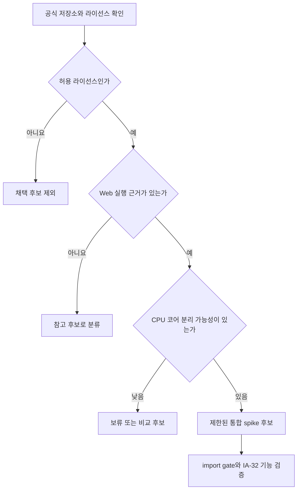

# Web x86 실행 엔진 평가 설계

## 목적

WebAssembly 호스트에서 원본 32비트 x86 Win32 코드를 실행할 수 있는 재사용 엔진 후보를 조사한다. 이번 작업은 후보 선정과 후속 검증 범위 확정까지 수행하며, 서드파티 코드를 저장소에 도입하지 않는다.

## 전제

- 원본 게임 코드는 계속 주 실행 주체여야 한다.
- Win32와 DirectX 서비스는 프로젝트의 HLE import thunk가 제공한다.
- 완전한 PC, 운영체제, BIOS 또는 장치 모델을 제품 실행 경로에 통합하지 않는다.
- BSD, MIT, zlib, ISC 계열처럼 프로젝트 정책에 허용된 라이선스만 채택 후보로 삼는다.
- 직접 x86 인터프리터 구현은 적합한 재사용 엔진이 없다고 확인된 뒤의 후순위 대안으로 유지한다.

## 평가 기준

1. 라이선스와 필수 종속성이 프로젝트 정책에 부합하는가.
2. IA-32 보호 모드 사용자 코드를 실행하고 레지스터와 메모리를 호스트가 제어할 수 있는가.
3. WebAssembly 또는 Emscripten 실행 근거가 있는가.
4. import gate에서 실행을 중단하고 HLE 호출 뒤 재개할 수 있는가.
5. 원본 실행 파일 분석으로 필요성이 확인될 수 있는 x87, MMX, SSE 등 확장 명령을 지원할 여지가 있는가.
6. CPU 코어를 PC·BIOS·장치 모델과 분리해 `ExecutionBackend` 뒤에 둘 수 있는가.
7. 유지보수 상태, 코드 규모, 빌드 복잡도가 제한된 검증 작업에 적합한가.

## 의사결정 방법

후보별 사실은 공식 프로젝트 문서와 라이선스 원문을 우선 근거로 기록한다. 프로젝트에 실제로 도입하기 전에는 별도의 설계와 작업 지시를 작성하고, 해당 시점의 소스 및 전이 종속성 라이선스를 다시 확인한다.

## 산출물

- 후보 비교와 출처를 담은 지식 기반 문서
- 채택 또는 보류 판단과 제한된 후속 검증 범위
- Stage 3 진행 상태 갱신

## 조사 결과와 결정

- v86은 BSD-2-Clause, 브라우저 x86-to-Wasm JIT, IA-32/FPU/SSE 범위가 확인되어 제한된 분리성 spike를 수행했다. 후속 source-level spike에서 CPU-only build 경계와 gate stop/resume hook이 없어 부적합으로 판정되어 채택을 중단했다.
- TinyEMU는 MIT지만 현재 JSLinux Web x86 구현의 재사용 가능한 공개 소스 경계가 확인되지 않아 보류한다.
- libx86emu는 허용형 라이선스와 좋은 hook API가 있으나 FPU/MMX/SSE가 없어 기능 범위가 부족하다.
- Blink는 ISC지만 x86-64 Linux 사용자 공간 중심이며 공식 Web 호스트 근거가 없다.
- QEMU, Unicorn, Bochs, Halfix, MAME는 프로젝트 정책상 허용되지 않는 GPL/LGPL 범위를 포함하므로 채택 후보에서 제외한다.

따라서 이번 작업에서는 의존성을 추가하지 않는다. 후속 spike도 v86 전체 PC를 통합하지 않고 CPU·메모리·실행 루프의 최소 분리 가능성만 검증한다.

---

# Web x86 Execution Engine Evaluation Design

## Purpose

Investigate reusable engines capable of executing original 32-bit x86 Win32 code on a WebAssembly host. This task selects candidates and defines follow-up validation scope only; it does not add third-party code to the repository.

## Premises

- The original game code remains the primary executing subject.
- Project HLE import thunks provide Win32 and DirectX services.
- A complete PC, operating system, BIOS, or device model is not integrated into the product execution path.
- Only licenses allowed by project policy, such as BSD, MIT, zlib, and ISC, are adoption candidates.
- A custom x86 interpreter remains a deferred fallback after reusable engines have been found unsuitable.

## Evaluation Criteria

1. The license and required dependencies comply with project policy.
2. The engine can execute IA-32 protected-mode user code while allowing host control of registers and memory.
3. There is evidence of WebAssembly or Emscripten operation.
4. Execution can stop at an import gate and resume after an HLE call.
5. There is a path to support extensions such as x87, MMX, and SSE if original-executable analysis confirms they are required.
6. The CPU core can be separated from PC, BIOS, and device models behind `ExecutionBackend`.
7. Maintenance state, code size, and build complexity are suitable for a bounded validation task.

## Decision Method

The diagram above shows the evaluation flow. Candidate facts are recorded primarily from official project documentation and original license texts. Before any actual adoption, a separate design and work order will recheck the selected source revision and all transitive dependency licenses.

## Deliverables

- A knowledge-base comparison with sources
- An adoption or deferral decision and bounded follow-up validation scope
- Updated Stage 3 status

## Findings and Decision

- v86 is BSD-2-Clause and has verified browser x86-to-Wasm JIT and IA-32/FPU/SSE coverage, so it received a bounded separability spike. The follow-up source-level spike found no CPU-only build boundary or gate stop/resume hook, judged it unsuitable, and stopped adoption.
- TinyEMU is MIT, but the reusable published-source boundary of the current JSLinux Web x86 implementation is unconfirmed, so it is deferred.
- libx86emu has a permissive license and useful hook APIs but lacks FPU/MMX/SSE coverage.
- Blink is ISC but focuses on x86-64 Linux userspace and has no official Web host evidence.
- QEMU, Unicorn, Bochs, Halfix, and MAME include GPL/LGPL scope disallowed by project policy and are excluded from adoption.

No dependency is added by this task. The follow-up spike will not integrate the complete v86 PC; it will test only minimum separation of the CPU, memory, and execution loop.
