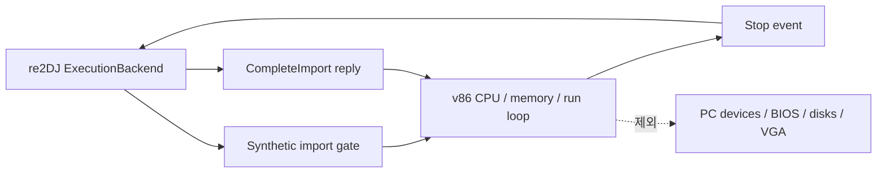

# v86 CPU 분리성 spike 설계

## 목적

v86 전체 PC emulator를 도입하지 않고, Web `ExecutionBackend`에 필요한 CPU·메모리·실행 루프만 독립시킬 수 있는지 소스 수준에서 검증한다. 이 작업은 조사용 임시 checkout만 사용하며 re2DJ 소스·빌드·배포물에 v86 코드를 넣지 않는다.

## 검증 대상

다음 사실을 소스와 build target에서 확인한다.

1. CPU 실행 시작점, 레지스터, 게스트 메모리의 공개 또는 분리 가능한 제어점
2. 특정 EIP/gate 주소에서 실행을 중단하고 상태를 호스트에 전달할 수 있는 경계
3. import 결과를 적용한 뒤 같은 CPU context를 재개할 수 있는 경계
4. code page write 뒤 JIT/번역 캐시를 무효화하는 경로
5. CPU 실행에 필요한 최소 소스 파일과 그 직접 라이선스 고지
6. PC 장치, BIOS, 디스크·VGA·네트워크 없이 빌드 가능한지 여부

## 수행 방식

- v86 공식 저장소의 특정 commit을 임시 디렉터리에 shallow checkout한다.
- re2DJ 저장소에는 v86 파일, build output, ROM·BIOS·disk image를 복사하지 않는다.
- 소스 의존 그래프와 build script를 읽고 필요하면 v86 자체의 공개 build/test만 실행한다.
- re2DJ에는 판단, commit 식별자, 최소 파일 집합, 결과만 문서화한다.

## 결정 기준

- CPU 실행이 PC device 또는 BIOS 초기화에 구조적으로 결합되어 있거나 최소 소스 집합에 허용되지 않는 라이선스가 있으면 **부적합**이다.
- gate stop/resume과 write invalidation의 구현 지점을 확인하고, 최소 집합이 허용 라이선스이면 **후속 adapter prototype 후보**다.
- 이 spike는 실제 backend 구현이나 v86 의존성 도입을 승인하지 않는다.

## 결과

공식 commit `847e34d5499b17b90d2783d5342ddd243c753497`을 조사했다. v86의 CPU Rust crate는 CPU-only feature·target이 없고 memory/run loop가 APIC, IOAPIC, VGA, MMIO callback, browser timer/IRQ에 직접 연결된다. 기본 `0xF0000000` import gate는 configured RAM 밖의 mapped/MMIO 범위라 instruction fetch/JIT가 실행할 수 없다. 선택 EIP에서 host로 돌아가는 stop hook도 interpreter와 JIT 양쪽에 존재하지 않는다.

SoftFloat(BSD-3-Clause)와 zstd(BSD 선택 가능)를 포함한 라이선스는 차단 사유가 아니지만, 독립 실행 경계를 만들려면 PC 모델과 실행 제어를 대규모로 fork해야 한다. 따라서 v86은 이 프로젝트의 제한된 재사용 후보에서 제외한다.

---

# v86 CPU Separability Spike Design

## Purpose

Determine at source level whether only the CPU, memory, and execution loop needed by Web `ExecutionBackend` can be separated, without adopting the complete v86 PC emulator. This task uses a temporary research checkout only and adds no v86 code to re2DJ source, builds, or distributions.

## Validation Target

The diagram above shows the proposed boundary. The spike verifies CPU entry-point, register and guest-memory control; a stop boundary at a gate address; resume after an import result; invalidation after code-page writes; direct license notices of the minimum source set; and whether that set builds without PC devices, BIOS, disks, VGA, or networking.

## Method

- Shallow-check out a specific commit of the official v86 repository in a temporary directory.
- Do not copy v86 files, build output, ROMs, BIOS images, or disk images into re2DJ.
- Read source dependencies and build scripts, and run only v86's public build/tests if needed.
- Record only the decision, commit identifier, minimum file set, and result in re2DJ documentation.

## Decision Criteria

- The candidate is **unsuitable** if CPU execution is structurally coupled to PC devices or BIOS initialization, or if the minimum source set has a disallowed license.
- It is a **candidate for a follow-up adapter prototype** if gate stop/resume and write invalidation points are found and the minimum set has permitted licenses.
- This spike does not approve a backend implementation or v86 dependency adoption.

## Result

Official commit `847e34d5499b17b90d2783d5342ddd243c753497` was inspected. Its Rust CPU crate has no CPU-only feature or target, and its memory/run loop directly connects to APIC, IOAPIC, VGA, MMIO callbacks, and browser timer/IRQ services. The default `0xF0000000` import gate lies outside configured RAM in mapped/MMIO space, where instruction fetch and JIT cannot execute it. Neither the interpreter nor the JIT has a host-return stop hook at a selected EIP.

Licensing, including SoftFloat (BSD-3-Clause) and a BSD option for zstd, is not the blocker. But creating an independent execution boundary requires a substantial fork of PC-model and execution-control code. v86 is therefore excluded from the project's bounded reuse candidates.
