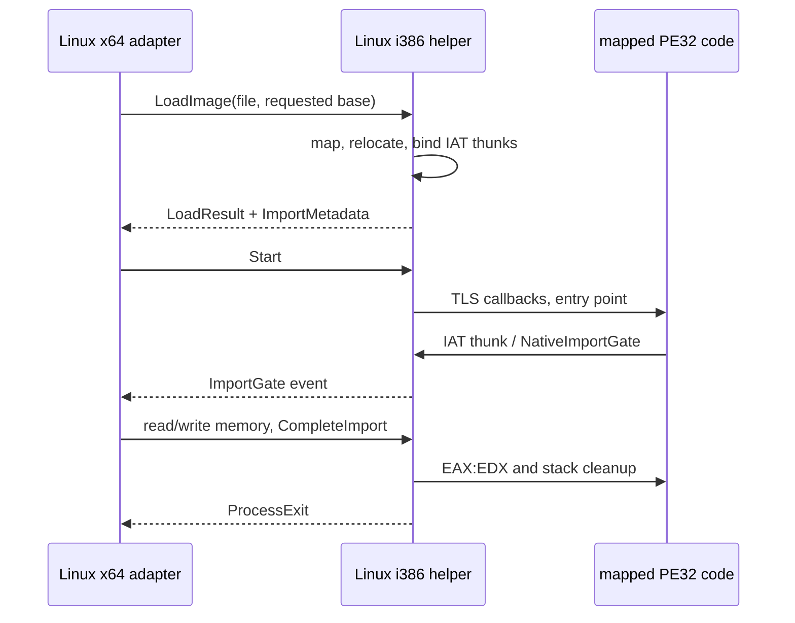

# Linux Native Helper PE32 Backend

## 한국어

### 목적

Linux x86-64 호스트에서 원본 x86 PE32 코드를 실행하기 위한 i386 native helper와 `ExecutionBackend` adapter를 정의합니다. 이 경로는 Wine 코드를 사용하지 않으며, 원본 실행 파일의 import thunk만 HLE 경계로 전환합니다.

### 설계

Helper는 `LoadImage`로 받은 PE 파일을 요청된 32비트 가상 주소에 익명 매핑합니다. 요청 주소를 확보할 수 없으면 성공한 것처럼 다른 주소를 사용하지 않고 로드를 실패시킵니다. 섹션을 복사한 뒤 `HIGHLOW` 재배치를 적용하고, import IAT를 helper 내부의 실행 thunk로 바꿉니다. thunk는 import gate 주소와 실제 guest 호출 프레임을 `NativeImportGate`에 전달합니다. 이 gate는 IPC로 이벤트를 보내고 HLE 완료 값을 받은 뒤 EAX:EDX와 동적 callee-pop을 guest 호출자에게 돌려줍니다.

공용 프로토콜은 기존 v3을 유지합니다. x64 호스트는 POSIX pipe, `fork`, `exec`만 담당하고, PE 주소를 호스트 포인터로 해석하지 않습니다. i386 helper 내부에서만 검증된 32비트 guest 주소를 매핑된 이미지 또는 guest 스택 접근에 사용합니다.

### 범위와 제한

이 작업은 단일 guest 실행 흐름, import gate 대기 중 최대 4096바이트 메모리 전송, PE32 `HIGHLOW` 재배치, TLS process-attach callback만 지원합니다. DLL loader, guest thread 생성, 예외 처리, instruction interpreter는 포함하지 않습니다.

### 검증

x64 host probe가 선호 base와 다른 주소에 합성 PE32를 로드합니다. probe는 이름 import와 ordinal import, 두 번의 gate 왕복, relocation, TLS callback, process exit 값을 확인합니다. Linux x64 host와 Linux i386 helper를 각각 빌드해 결합 실행합니다.

## English

### Purpose

This defines an i386 native helper and an `ExecutionBackend` adapter for executing original x86 PE32 code from a Linux x86-64 host. The path uses no Wine code and switches only original executable import thunks to the HLE boundary.

### Design

The helper maps the PE file received through `LoadImage` into the requested 32-bit virtual address. If that address cannot be reserved, loading fails instead of silently using a different address. It copies sections, applies `HIGHLOW` relocations, and replaces import IAT entries with executable helper thunks. A thunk passes its import gate address and the real guest call frame to `NativeImportGate`. The gate reports an IPC event, receives an HLE completion, then returns EAX:EDX and dynamic callee-pop behavior to the guest caller.

The existing v3 shared protocol remains unchanged. The x64 host owns only POSIX pipes, `fork`, and `exec`; it never interprets PE addresses as host pointers. Only the i386 helper uses validated 32-bit guest addresses for mapped-image and guest-stack access.

### Scope and limits

This task supports one guest execution flow, memory transfers up to 4096 bytes while an import gate is pending, PE32 `HIGHLOW` relocations, and TLS process-attach callbacks. It excludes a DLL loader, guest thread creation, exception handling, and an instruction interpreter.

### Verification

The x64 host probe loads a synthetic PE32 at a non-preferred base. It verifies named and ordinal imports, two gate round trips, relocation, a TLS callback, and the process-exit value. The Linux x64 host and Linux i386 helper are built separately and run together.
