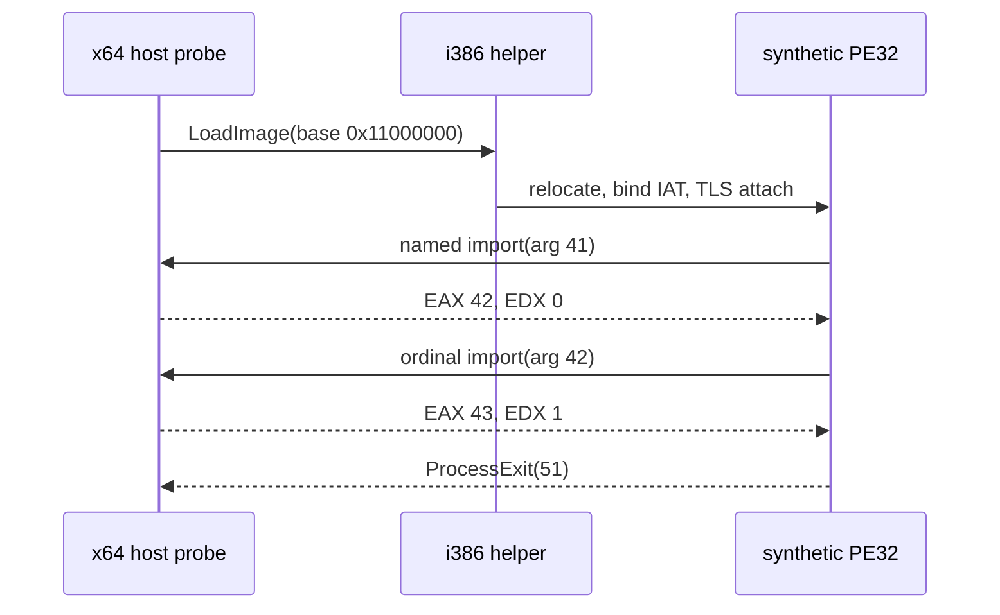

# Linux Native Helper Extended Probe

## 한국어

### 목적

Linux native helper의 기존 최소 PE32 probe를 확장하여 IAT thunk, `HIGHLOW` relocation, TLS process-attach callback과 두 import completion 왕복을 하나의 실행으로 검증합니다.

### Fixture

합성 PE32는 preferred base `0x10000000`, 요청 base `0x11000000`을 사용합니다. entry point는 named import `probe.dll!ProbeGate`에 41을 전달하고, 반환 EAX를 ordinal import `probe.dll!#7`에 전달합니다. host는 각각 EAX=42/EDX=0과 EAX=43/EDX=1로 완료합니다. TLS callback은 data state를 7로 쓰며, entry point는 두 반환값과 TLS state를 더해 51을 반환합니다.

### 완료 기준

host probe는 import metadata 두 개, 각 gate의 argument와 instruction pointer, process-exit event id 3 및 status 51을 확인합니다.

## English

### Purpose

Extend the minimal Linux PE32 probe so one run verifies IAT thunks, `HIGHLOW` relocation, TLS process-attach callbacks, and two import-completion round trips.

### Fixture

The synthetic PE32 has preferred base `0x10000000` and requested base `0x11000000`. Its entry point calls named import `probe.dll!ProbeGate` with 41, then calls ordinal import `probe.dll!#7` with the returned EAX. The host completes them with EAX=42/EDX=0 and EAX=43/EDX=1. The TLS callback stores 7 in data state; the entry point adds both returns and TLS state to return 51.

### Completion criteria

The host probe confirms two import metadata entries, each gate argument and instruction pointer, and process-exit event id 3 with status 51.
