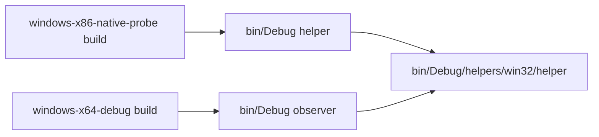

# Windows Helper Staging

## 한국어

Windows x64 host와 Win32 helper는 서로 다른 CMake architecture configuration으로 빌드됩니다. 따라서 staging script가 두 preset을 빌드하고 Win32 `re2dj_native_ipc_helper.exe`를 x64 host output의 `helpers/win32/`로 복사합니다. observer의 기본 탐색 두 번째 경로와 정확히 일치합니다.

## English

Windows x64 hosts and the Win32 helper are built in separate CMake architecture configurations. A staging script builds both presets and copies the Win32 `re2dj_native_ipc_helper.exe` into `helpers/win32/` below the x64 host output. This exactly matches the observer's second default discovery path.
