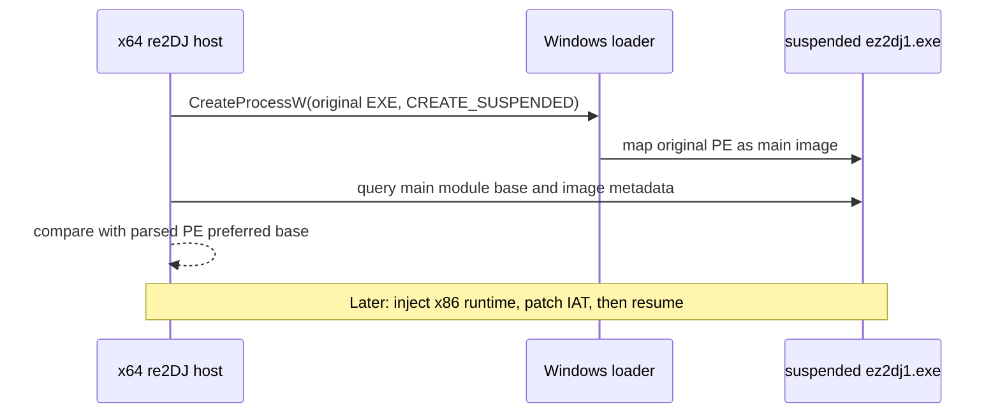

# Windows Original-Process Loader Probe

## 한국어

`ez2dj1.exe`는 재배치 정보가 없고, 별도 Win32 helper가 수동으로 적재할 때 Windows x86 loader의 NLS mapped view와 `0x00400000`이 충돌합니다. 그러나 Windows가 원본 EXE를 **주 이미지**로 process 생성할 때는 loader가 다른 런타임 매핑보다 먼저 주 이미지를 선호 주소에 배치할 수 있습니다.

다음 Windows backend 후보를 검증합니다.

이 작업은 process 생성과 주 이미지 주소 검증만 수행합니다. guest thread를 resume하지 않고, DLL injection·IAT patch·HLE API 구현은 포함하지 않습니다. 원본 HDD의 파일은 읽기·실행만 하며 수정하지 않습니다.

성공 기준은 x64 host가 `CREATE_SUSPENDED`로 원본 `ez2dj1.exe`를 만들고, child의 main module base와 host가 파싱한 PE image base가 모두 `0x00400000`임을 확인한 뒤 child를 종료하는 것입니다.

## English

`ez2dj1.exe` has no relocation data, and its `0x00400000` base conflicts with an NLS mapped view when a separate Win32 helper manually maps it. When Windows creates the original EXE as the **main image** of a process, however, the loader can place that image at its preferred base before other runtime mappings.

This task validates the following Windows-backend candidate:

This task performs only process creation and main-image address verification. It does not resume the guest thread and excludes DLL injection, IAT patching, and HLE API implementation. Original HDD files are only read and executed, never modified.

Success means an x64 host creates the original `ez2dj1.exe` with `CREATE_SUSPENDED`, verifies that both the child's main-module base and the host-parsed PE image base are `0x00400000`, then terminates the child.
