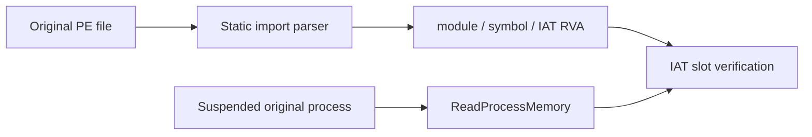

# Windows Suspended IAT Probe

## 한국어

원본 EXE를 Windows loader의 주 이미지로 suspended 생성하는 경로가 fixed-base 충돌을 피함을 확인했다. 다음으로 injection 없이 child의 import address table(IAT)을 원격 읽기 전용으로 검증한다.

probe는 원본 파일의 import descriptor와 lookup thunk를 해석하여 `{module, name 또는 ordinal, iat_rva}` 목록을 만든다. 이후 동일한 IAT RVA에 대해 suspended child에서 32비트 값을 `ReadProcessMemory`로 읽는다. loader가 정상적으로 import를 해결했다면 각 값은 0도 아니고 image 내부 RVA도 아닌 외부 함수 주소다.

이 작업은 `VirtualProtectEx`, `WriteProcessMemory`, DLL injection, thread resume을 호출하지 않는다. 성공하면 future injected runtime이 patch할 정확한 IAT 주소와 loader-resolved 값의 존재를 확인한다. 이는 IAT patch의 안전성이나 HLE dispatch 동작을 아직 보장하지 않는다.

## English

Creating the original EXE as a suspended Windows-loader main image avoids the fixed-base conflict. The next step verifies the child import address table (IAT) remotely and read-only, without injection.

The probe parses the original file's import descriptors and lookup thunks into `{module, name or ordinal, iat_rva}` entries. It then reads a 32-bit value at the same IAT RVA from the suspended child with `ReadProcessMemory`. If the loader resolved imports normally, every value is nonzero and is not an RVA inside the original image.

This task never calls `VirtualProtectEx`, `WriteProcessMemory`, DLL injection, or thread resume. Success establishes the exact IAT addresses a future injected runtime would patch and the presence of loader-resolved values. It does not yet guarantee IAT-patch safety or HLE dispatch behavior.
