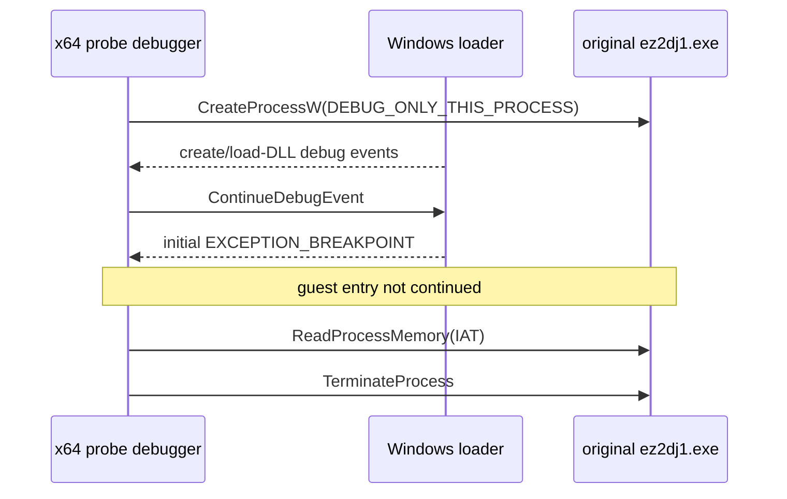

# Windows Initial-Breakpoint IAT Probe

## 한국어

`CREATE_SUSPENDED` 직후에는 원본 image는 배치되어 있지만 IAT가 아직 lookup thunk를 가리킨다. Windows debugger의 initial breakpoint는 loader가 DLL을 초기화하고 import를 결합한 뒤, application entry point 전에 발생하는 후보 정지 지점이다.

probe는 원본 EXE를 `DEBUG_ONLY_THIS_PROCESS`로 시작한다. `CREATE_PROCESS_DEBUG_EVENT`와 `LOAD_DLL_DEBUG_EVENT`를 계속 처리하고, 첫 `EXCEPTION_BREAKPOINT`에서는 `ContinueDebugEvent`를 호출하지 않는다. 정지된 child의 main-image base와 IAT를 읽기 전용 검증한 뒤 `TerminateProcess`로 끝낸다.

이 작업은 IAT를 읽기만 한다. `VirtualProtectEx`, `WriteProcessMemory`, remote thread, DLL injection은 금지한다. success는 initial breakpoint에서 144 IAT slot이 모두 nonzero 외부 주소로 확인되고 main module base가 `0x00400000`인 것이다.

## English

Immediately after `CREATE_SUSPENDED`, the original image is mapped but the IAT still points to lookup thunks. The Windows debugger initial breakpoint is a candidate stop after the loader initializes DLLs and binds imports, but before application entry.

The probe starts the original EXE with `DEBUG_ONLY_THIS_PROCESS`. It continues `CREATE_PROCESS_DEBUG_EVENT` and `LOAD_DLL_DEBUG_EVENT` events, but does not call `ContinueDebugEvent` for the first `EXCEPTION_BREAKPOINT`. It then verifies the stopped child's main-image base and IAT read-only, and ends it with `TerminateProcess`.

This task only reads the IAT. `VirtualProtectEx`, `WriteProcessMemory`, remote threads, and DLL injection are prohibited. Success means all 144 IAT slots are nonzero external addresses and the main-module base is `0x00400000` at the initial breakpoint.
