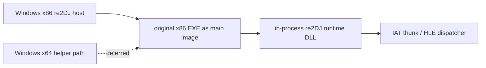

# Windows x86 Native Host Policy

## 한국어

사용자 결정에 따라 Windows 1차 실행 host를 x64에서 Win32 x86으로 전환한다. x86 host는 원본 x86 EXE와 같은 실행 모드이므로 x64→x86 IPC, WOW64 remote-thread address 계산, 별도 injector helper 없이 같은 process의 runtime DLL과 import thunk를 사용할 수 있다.

Windows x64는 지원 제거가 아니라 **보류**다. 기존 x64 helper·original-process probe는 검증 근거로 유지하지만 Windows 기본 preset·build script·Stage 4 실행 기준으로 사용하지 않는다. Linux x86-64와 Web은 기존처럼 후속 대상이다.

이번 작업은 Win32 full-host preset을 기본으로 승격하고 x64 정책을 문서화한다. original EXE launcher·DLL injection replacement·IAT patch는 다음 작업으로 분리한다.

## English

By user decision, the primary Windows execution host moves from x64 to Win32 x86. An x86 host shares the original x86 EXE's execution mode, so it can use an in-process runtime DLL and import thunks without x64-to-x86 IPC, WOW64 remote-thread address calculation, or a separate injector helper.

Windows x64 is **deferred**, not removed. Existing x64 helper and original-process probes remain as evidence but are no longer the Windows default preset, build-script, or Stage-4 execution reference. Linux x86-64 and Web remain later targets.

This task promotes a Win32 full-host preset as default and documents the x64 policy. The original-EXE launcher, DLL-injection replacement, and IAT patching are separate follow-up work.
