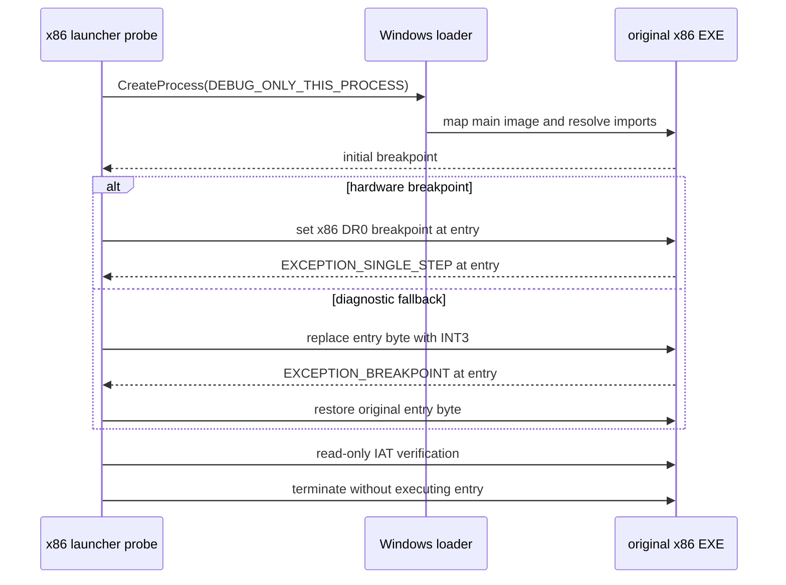

# Windows x86 원본 프로세스 entry launcher

## 설계

Windows 기본 실행 경로는 Win32 x86 launcher가 원본 x86 EXE를 별도 자식 프로세스의 주 이미지로 생성하는 구조를 사용한다. launcher 자신이 원본 EXE를 대체하거나 수동 매핑하지 않는다. Windows loader가 원본의 선호 이미지 기준 주소를 배치하게 하여 재배치 불가능한 `ez2dj1.exe`의 주소 충돌을 피한다.

이번 작업의 검증 도구 `re2dj_windows_x86_launcher_probe`는 다음까지만 수행한다.

Win32 launcher와 자식이 같은 x86 bitness이므로 `GetThreadContext`와 `SetThreadContext`의 일반 x86 `CONTEXT_DEBUG_REGISTERS` 경로를 먼저 사용한다. 기존 x64 observer의 WOW64 PEB/context 처리나 x64-to-x86 remote-thread 주소 계산은 이 기본 경로에 포함하지 않는다. hardware breakpoint가 이 입력에서 entry를 잡지 못하면, 진단용으로 child 메모리의 entry 첫 바이트만 일시적으로 `INT3`로 교체하고 정지 즉시 원복한다. 원본 파일과 HDD는 변경하지 않는다.

entry single-step에서 모든 IAT slot이 loader-resolved 외부 주소인지 읽기 전용으로 검사한다. 성공해도 원본 게임 코드는 실행하지 않으며, DLL 주입·IAT 교체·HLE dispatch는 후속 작업이다.

## English

The primary Windows path uses a Win32 x86 launcher that creates the original x86 EXE as the main image of a separate child process. The launcher neither replaces the original EXE nor manually maps it. The Windows loader places the original at its preferred image base, avoiding the fixed-base conflict of the non-relocatable `ez2dj1.exe`.

This task's verification tool, `re2dj_windows_x86_launcher_probe`, stops at the following boundary only.

Because launcher and child share x86 bitness, the normal x86 `CONTEXT_DEBUG_REGISTERS` path through `GetThreadContext` and `SetThreadContext` is tried first. The x64 observer's WOW64 PEB/context handling and x64-to-x86 remote-thread address calculation are not part of this primary path. If the hardware breakpoint does not catch entry for this input, the diagnostic fallback temporarily replaces only the entry's first byte in child memory with `INT3` and restores it immediately after stopping. It does not modify the original file or HDD.

At the entry single-step, the tool verifies read-only that every IAT slot contains a loader-resolved external address. A successful run does not execute original game code; DLL injection, IAT replacement, and HLE dispatch remain follow-up work.
