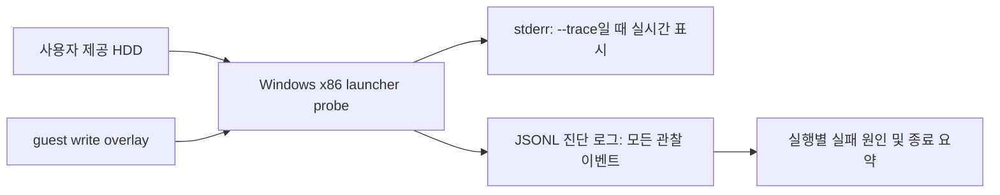

# Windows 로더 진단 로그

## 목적

Windows x86 launcher probe가 원본 실행 파일을 시작하거나 entry 이후를 관찰하는 중 실패했을 때, 콘솔을 보존하지 않아도 실패 원인을 바로 확인할 수 있는 실행 단위 진단 로그를 남긴다.

## 범위

`re2dj_windows_x86_launcher_probe`는 대상 프로필과 원본 실행 파일을 확인한 뒤 실행별 JSON Lines 파일을 연다. 기본 위치는 현재 작업 디렉터리를 기준으로 다음과 같다.

`logs/windows_x86_launcher_probe/<target-id>/<timestamp>.jsonl`

이 위치는 사용자가 제공한 HDD와 guest write overlay 밖이다. `logs/`는 Git에서 무시하므로 원본 실행 중 생성된 진단 자료가 우연히 커밋되지 않는다.

## 기록 정책

로그에는 launcher 설정, debug event, entry/ExitProcess 관찰 자료, 오류, 최종 결과를 구조화된 JSON 한 줄씩 기록한다. 각 줄은 즉시 flush하여 비정상 종료나 긴 대기 중에도 이미 관찰한 정보를 보존한다.

`--trace`는 stderr에 이벤트를 실시간으로 표시할지 결정한다. 파일 로그는 `--trace`가 없어도 기록하여 재현 실행에서 콘솔 출력 옵션을 잊어도 진단 근거가 남게 한다. launcher의 최종 표준 출력 및 표준 오류 JSON에는 생성된 로그 경로를 포함한다.

원본 HDD 파일 내용은 로그에 복사하지 않는다. 기존 trace가 예외 명령어 포인터 주변에서 읽는 제한된 메모리 관찰값만 기록하며, 로그 디렉터리는 저장소 관리 대상이 아니다.

## 검증

Windows x86 Debug 빌드에서 기존 CTest를 실행하고, 합법적으로 제공된 `ez2dj1stse` HDD를 software entry breakpoint 및 ExitProcess 관찰 옵션으로 실행한다. 해당 실행이 실패하더라도 로그 파일이 생성되고 `launch`, 예외/디버그 이벤트, `outcome` 또는 `error` 레코드를 포함하는지 확인한다.

---

# Windows Loader Diagnostic Log

## Purpose

When the Windows x86 launcher probe fails while starting the original executable or observing post-entry execution, retain a per-run diagnostic log that makes the cause available even when the console output was not preserved.

## Scope

After resolving a target profile and original executable, `re2dj_windows_x86_launcher_probe` opens one JSON Lines file per run. Its default location, relative to the current working directory, is:

`logs/windows_x86_launcher_probe/<target-id>/<timestamp>.jsonl`

The location is outside both the user-supplied HDD and the guest-write overlay. `logs/` is Git-ignored, preventing generated diagnostic material from being committed accidentally.

## Recording policy

The log records launcher configuration, debug events, entry/ExitProcess observations, errors, and the final result as structured JSON lines. Each line is flushed promptly so information already observed survives an abnormal termination or a long wait.

`--trace` controls live stderr output. File logging occurs even without `--trace`, so a reproducer retains diagnostic evidence without remembering that console option. The launcher's final stdout and stderr JSON include the created log path.

The log does not copy original HDD files. It records only the bounded process-memory observation already produced by the existing trace around an exception instruction pointer, and the log directory is not repository-managed content.

## Verification

Run the existing CTest suite in a Windows x86 Debug build, then run the launcher against a legally supplied `ez2dj1stse` HDD with the software-entry-breakpoint and ExitProcess-observation options. Even if that run fails, verify that a log file is created and contains `launch`, exception/debug-event, and `outcome` or `error` records.
