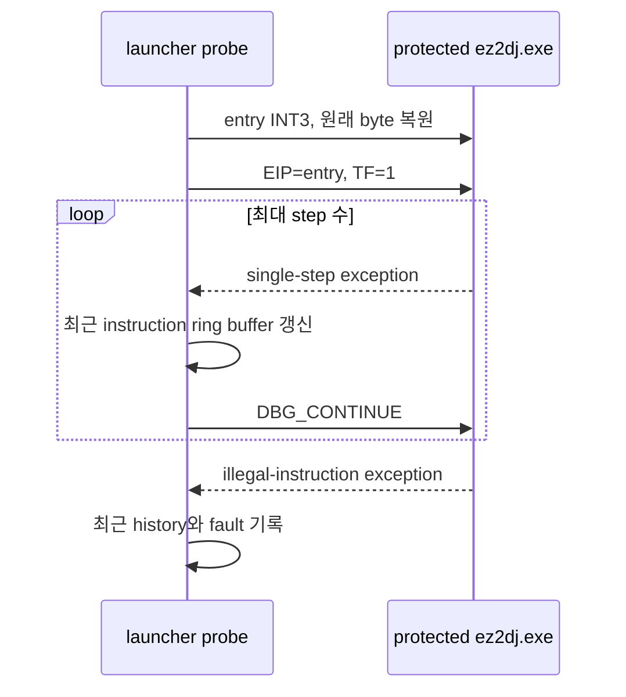

# 보호 실행 파일 instruction trace

## 목적

canonical protected `ez2dj.exe`가 private RW 영역의 invalid target으로 제어를 넘기기 직전에 실행한 guest instruction을 확인한다. 현재 관찰된 `EXCEPTION_ILLEGAL_INSTRUCTION`의 fault 주소와 exception stack만으로는 branch caller를 식별할 수 없다.

## 설계

launcher의 software entry breakpoint에서 원래 entry byte를 복원한 뒤, primary thread의 EIP를 static entry로 되돌리고 Trap Flag(TF)를 설정한다. 이후 `EXCEPTION_SINGLE_STEP`마다 TF를 다시 설정하고, 방금 실행된 instruction의 address와 제한된 바이트를 고정 길이 ring buffer에 보관한다.

protected code가 크거나 loop를 포함할 수 있으므로 기본 실행 수 제한을 두고, 중간 모든 instruction을 JSONL에 쓰지 않는다. `EXCEPTION_ILLEGAL_INSTRUCTION`이 오면 최근 instruction history만 한 번에 로그로 flush한다. 이 기록의 마지막 step은 fault target으로 전이한 `call`/`jmp` 또는 그 직전 instruction 후보를 제공한다.

## 관찰 경계

이 기능은 guest 코드를 수정하지 않으며, software entry breakpoint와 TF라는 debugger 제어만 사용한다. instruction history가 branch operand를 완전히 해석하거나 그 branch가 invalid target을 계산한 조건을 증명하지는 않는다. 마지막 step의 기계어와 레지스터 상태는 다음 분석에서 indirect target 계산을 해석하기 위한 근거다.

## 검증

Windows x86 Debug build와 CTest를 실행한다. `ez2dj1stse` canonical `ez2dj.exe`를 `--software-breakpoint --instruction-trace <limit>`로 실행하고, 로그에 `instruction_trace`와 illegal-instruction fault가 함께 남는지 확인한다. 제한 전에 도달하지 못하면 step 수·마지막 history를 사실로 기록하고 원인을 확정하지 않는다.

---

# Protected Executable Instruction Trace

## Purpose

Identify the guest instruction executed immediately before canonical protected `ez2dj.exe` transfers control to an invalid target in private RW memory. The currently observed `EXCEPTION_ILLEGAL_INSTRUCTION` fault address and exception stack do not identify the branching caller.

## Design

At the launcher's software-entry breakpoint, restore the original entry byte, reset the primary thread EIP to static entry, and enable the Trap Flag (TF). On each `EXCEPTION_SINGLE_STEP`, rearm TF and retain the address and bounded bytes of the just-executed instruction in a fixed-size ring buffer.

Protected code may be large or loop, so the trace has a maximum step count and does not write every intermediate instruction to JSONL. On `EXCEPTION_ILLEGAL_INSTRUCTION`, it flushes only recent instruction history. Its final step provides the candidate `call`/`jmp`, or instruction immediately before it, that transferred to the fault target.

## Observation boundary

This function does not modify guest code; it uses only the software-entry breakpoint and debugger TF control. The history does not itself decode a branch operand or prove the condition that computed the invalid target. The final machine code and register state are evidence for a subsequent analysis of the indirect target calculation.

## Verification

Run the Windows x86 Debug build and CTest. Run canonical `ez2dj.exe` from `ez2dj1stse` with `--software-breakpoint --instruction-trace <limit>` and verify that the log contains both `instruction_trace` and the illegal-instruction fault. If the limit is exhausted first, record the count and final history as facts without asserting a cause.
