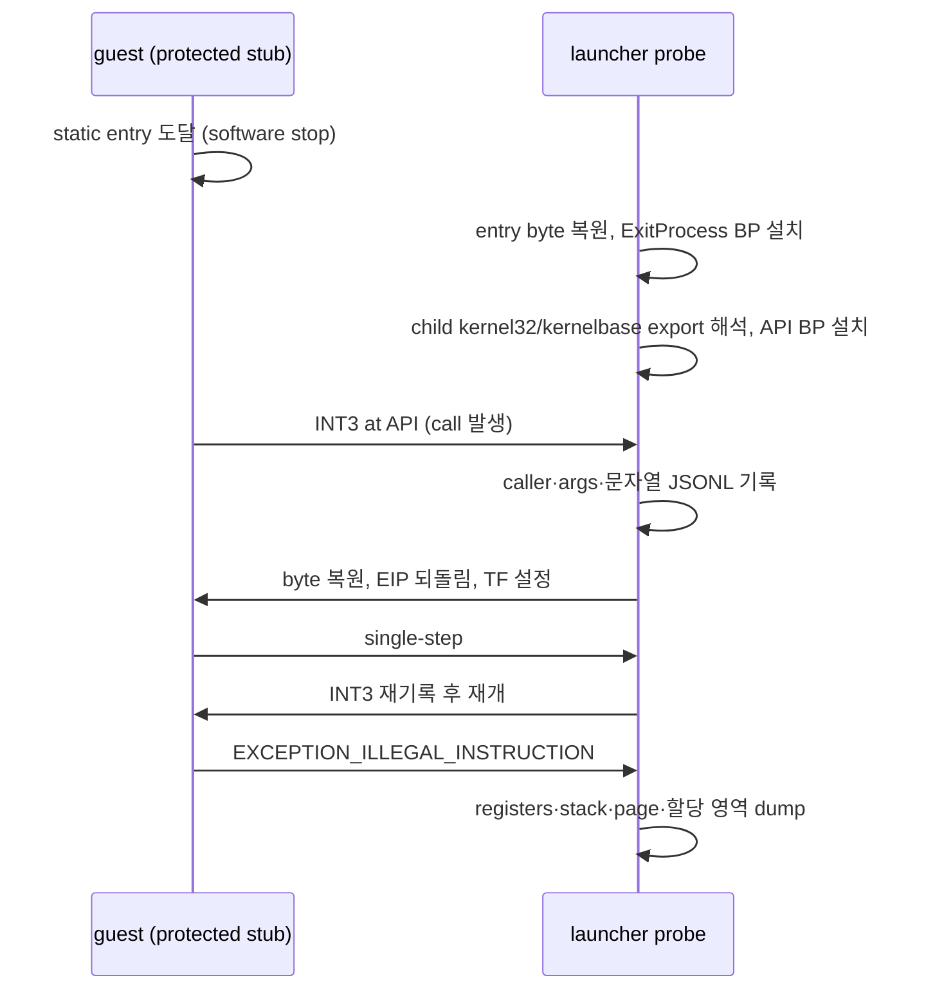

# 보호 stub API 관찰 trace

관련 작업 지시: [보호 stub API 관찰 trace 작업 지시](../work-orders/20260823-042-protected-api-observation-trace.md)

## 목적

protected `ez2dj.exe`가 static entry 이후 호출하는 Win32 API와 그 caller return address를 관찰하고, illegal-instruction fault 시점의 register·stack·할당 영역 컨텍스트를 강화한다. 이전 관찰(20260823-038~041)로 fault target이 실행마다 달라지는 private RW page라는 것과 memory 어디에도 exact target 값이 저장되어 있지 않다는 것은 확인됐지만, control을 넘긴 guest caller는 식별되지 않았다. instruction single-step은 debugger overhead 때문에 fault에 도달하지 못했으므로, 더 침습적이지 않은 관찰점인 **API 진입 breakpoint**와 **fault 시점 정지 상태 dump**를 검증한다.

## 설계

### 옵션과 추적 경로

launcher probe에 `--api-trace`를 추가한다. 기존 `--break-exit-process` 경로를 재사용한다. software entry stop에서 원래 byte를 복원한 뒤, native `ExitProcess`에 software breakpoint를 두고, 그 외 exception은 guest에 넘긴다(`DBG_EXCEPTION_NOT_HANDLED`). runtime 주입은 하지 않는다.

### 자식 모듈 export 해석

API breakpoint 주소는 launcher가 추측하지 않고 child memory에서 읽는다. `LOAD_DLL_DEBUG_EVENT`의 file path에서 `kernel32.dll`과 `kernelbase.dll`의 base를 기록하고, 새 헬퍼 `remote_module_exports`가 child process memory에서 PE32 export directory를 직접 해석해 함수 이름을 VA로 바꾼다.

forwarded export(function RVA가 export directory 범위 안에 있으면 문자열 forwarding)는 코드가 아니므로 건너뛴다. 같은 이름이 두 모듈에서 실제 코드로 존재하면 양쪽을 모두 관찰한다. 현대 Windows에서 loader는 forwarder chain을 최종 대상 주소로 binding하므로 kernelbase 구현을 빠뜨리면 호출을 놓칠 수 있기 때문이다.

### 관찰 대상 API

fault 전 보호 검증 흐름과 관련된 kernel32 표면으로 한정한다.

| API | 관찰 근거 |
| --- | --- |
| `LoadLibraryA`, `LoadLibraryW`, `GetProcAddress`, `FreeLibrary` | Winsock DLL 동적 적재·해제가 fault 직전에 관찰됨 |
| `VirtualAlloc`, `VirtualProtect`, `VirtualFree` | fault page가 private 할당(0x00200000) 안에 있음 |
| `GetVersion`, `GetVersionExA` | Windows 9x 시대 보호기의 환경 검사 후보 |
| `CreateFileA` | 자기 파일 재판독 검사 후보 |

### breakpoint 삼키기와 재무장

INT3 hit에서 launcher는 JSONL 기록을 남긴 뒤 원래 byte를 복원하고 EIP를 API 선두로 되돌리며 TF를 설정해 한 instruction을 실행시킨다. 이어지는 single-step에서 INT3를 다시 써서 재무장한다. pending re-arm은 thread별로 추적한다. 이 방식은 호출을 guest에 노출하지 않고도 반복 호출을 계속 관찰한다.

### fault 컨텍스트 강화

first-chance `EXCEPTION_ILLEGAL_INSTRUCTION`에서 child를 계속하기 전에 다음을 기록한다. 이 dump는 `--api-trace` 없이 `--break-exit-process`만으로도 동작한다.

1. full GP register(EAX~EDI, EBP, ESP, EIP, EFLAGS)
2. ESP 기준 64 dword stack dump와, main image 범위에 드는 word의 section 분류
3. fault address의 page-aligned base에서 128 byte hex dump
4. fault page의 allocation base부터 region을 순회하며 base·size·protect·state·type 기록

### 확장: 언로드 종반 single-step 포착

1차 관찰 결과, fault는 `FreeLibrary`가 guest로 돌아오기 전인 `LdrUnloadDll` 종반 시스템 경로 안에서 발생했다. 따라서 `--api-trace`는 다음을 추가로 수행한다.

1. `CreateFileA`의 첫 번째 인자 ANSI 문자열을 디코딩한다(`\\.\TDSD.VXD` 같은 device 경로 확인 목적).
2. entry 이후 동적으로 적재된 모듈의 `UNLOAD_DLL_DEBUG_EVENT`에서 primary thread에 TF를 설정하고, illegal instruction 또는 상한까지 instruction 주소와 바이트를 ring buffer에 수집한다. fault 도달 시 history를 JSONL에 남긴다.
3. 수집 중 watched API INT3는 기존 규칙대로 삼키고 재무장한다.

이 확장은 전체 instruction trace와 달리 언로드 종반의 짧은 구간만 추적하므로 debugger overhead를 피한다.

### 기록 형식

모든 관찰은 기존 JSONL 진단 로그에 추가된다. API hit은 `api_call`(name, address, caller, args, 가능한 ANSI 문자열), 해석 결과는 `api_watch`(해석 성공·forwarder·미발견), fault dump는 `fault_registers`, `fault_stack`, `fault_stack_image_reference`, `fault_page_dump`, `fault_allocation_region` event로 남긴다.

## 해석 경계

API hit 기록은 해당 호출과 caller가 실제로 존재했다는 confirmed observation이며, 그 호출이 invalid branch의 원인이라는 증명이 아니다. register와 stack 값은 target-producing storage 후보일 뿐이다. 관찰된 API 집합이 비었다고 해서 ntdll 직접 호출이나 PEB walk를 배제할 수 없으며, 그 경우 다음 단계에서 관찰 범위를 넓힌다. 모든 결론은 confirmed observation과 inferred candidate로 구분해 기록한다.

## 검증

Windows x86 Debug build와 CTest를 실행한다. canonical `ez2dj.exe`를 `--api-trace`로 실행해 `api_watch` 해석 기록, `api_call` 기록, `0xC000001D` fault의 강화된 컨텍스트 dump가 생성되는지 확인한다. fault에 도달하지 못하면 그 사실 자체를 timing perturbation 증거로 기록한다.

---

# Protected Stub API Observation Trace

Related work order: [Protected Stub API Observation Trace Work Order](../work-orders/20260823-042-protected-api-observation-trace.md)

## Purpose

Observe the Win32 APIs that protected `ez2dj.exe` calls after static entry together with their caller return addresses, and enrich the fault context (registers, stack, allocation regions) at the illegal-instruction fault. Prior observations (20260823-038~041) established that the fault target is a run-varying private RW page and that no memory location stores the exact target value, but not the guest caller that transferred control. Instruction single-stepping could not reach the fault due to debugger overhead, so this validates less intrusive observation points: **API entry breakpoints** and a **stopped-state dump at the fault**.

## Design

### Option and trace path

Add `--api-trace` to the launcher probe. It reuses the existing `--break-exit-process` path: restore the original entry byte at the software entry stop, place a software breakpoint on native `ExitProcess`, and pass other exceptions to the guest (`DBG_EXCEPTION_NOT_HANDLED`). No runtime injection occurs.

### Child module export resolution

The launcher does not guess API breakpoint addresses; it reads them from child memory. It records the `kernel32.dll` and `kernelbase.dll` bases from `LOAD_DLL_DEBUG_EVENT` file paths, and a new helper, `remote_module_exports`, parses the PE32 export directory directly from child process memory to map function names to VAs.

Forwarded exports (a function RVA inside the export-directory range means string forwarding) are skipped because they are not code. When the same name exists as real code in both modules, both are watched: on modern Windows the loader binds forwarder chains to the final target address, so missing the kernelbase implementation would miss calls.

### Watched APIs

The watch list is limited to the kernel32 surface plausibly involved in the pre-fault protection flow.

| API | Reason to observe |
| --- | --- |
| `LoadLibraryA`, `LoadLibraryW`, `GetProcAddress`, `FreeLibrary` | Winsock DLL dynamic load/unload observed right before the fault |
| `VirtualAlloc`, `VirtualProtect`, `VirtualFree` | The fault page lies inside a private allocation (0x00200000) |
| `GetVersion`, `GetVersionExA` | Candidate environment checks by a Windows 9x-era protector |
| `CreateFileA` | Candidate self-read integrity check |

### Swallowing and rearming breakpoints

On an INT3 hit the launcher records a JSONL entry, restores the original byte, rewinds EIP to the API start, sets TF to execute one instruction, and on the following single step rewrites the INT3 to rearm. Pending rearms are tracked per thread. This keeps observing repeated calls without exposing the breakpoint to the guest.

### Fault context enrichment

Before continuing the child on a first-chance `EXCEPTION_ILLEGAL_INSTRUCTION`, record:

1. Full GP registers (EAX–EDI, EBP, ESP, EIP, EFLAGS).
2. A 64-dword stack dump from ESP plus section classification for words inside the main image.
3. A 128-byte hex dump at the page-aligned fault-address base.
4. A region walk starting at the fault page's allocation base recording base, size, protect, state, and type.

This dump also runs with plain `--break-exit-process`, without `--api-trace`.

### Extension: unload-tail single-step capture

The first observation showed the fault occurs inside the `LdrUnloadDll` tail path, before `FreeLibrary` returns to the guest. Therefore `--api-trace` additionally:

1. Decodes the first ANSI argument of `CreateFileA` to confirm device paths such as `\\.\TDSD.VXD`.
2. On an `UNLOAD_DLL_DEBUG_EVENT` for a module loaded dynamically after entry, sets TF on the primary thread and collects instruction addresses and bytes in a ring buffer until the illegal instruction or a cap, flushing the history to JSONL at the fault.
3. While collecting, watched-API INT3 hits keep following the existing swallow-and-rearm rule.

Unlike the full instruction trace, this follows only the short unload tail and so avoids debugger overhead.

### Record format

All observations go into the existing JSONL diagnostic log. API hits are recorded as `api_call` (name, address, caller, args, ANSI string when available), resolutions as `api_watch` (resolved, forwarded, or missing), the fault dumps as `fault_registers`, `fault_stack`, `fault_stack_image_reference`, `fault_page_dump`, and `fault_allocation_region` events, and the unload-tail capture as an `instruction_trace` history like the existing full trace.

## Interpretation boundary

An API-hit record is a confirmed observation that the call and its caller existed; it does not prove that the call caused the invalid branch. Register and stack values are target-producing storage candidates only. An empty API set cannot exclude direct ntdll calls or PEB walks; if so, later steps widen the observation surface. Record all conclusions separately as confirmed observations and inferred candidates.

## Verification

Run the Windows x86 Debug build and CTest. Run canonical `ez2dj.exe` with `--api-trace` and verify `api_watch` resolution records, `api_call` records, and the enriched context dumps at the `0xC000001D` fault. If the fault is not reached, record that fact itself as timing-perturbation evidence.
