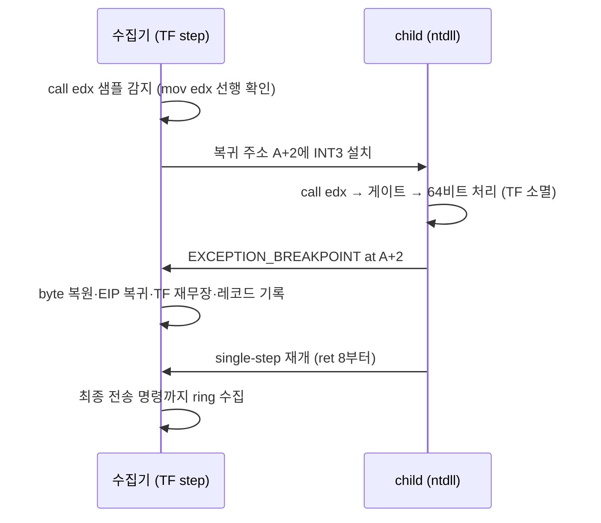

# 게이트 이후 복귀 추적

관련 작업 지시: [게이트 이후 복귀 추적 작업 지시](../work-orders/20260823-045-post-gate-resume-trace.md)

## 목적

protected `ez2dj.exe`의 종료 경로에서 TF가 WOW64 게이트를 살아남지 못하기 때문에, `ZwSetEvent` 스텁이 64비트 모드로 들어가고 돌아온 뒤 32비트 코드에서 일으킬 것으로 추정되는 최종 전송 명령이 아직 관찰되지 않았다([작업 로그 20260823-044](../work-logs/20260823-044-protected-fault-path-precision.md)). 이 작업은 그 최종 명령과 피연산자를 포착하는 것을 목표로 한다.

## 설계

### 방법 선택

후보는 두 가지였다.

1. **DR0 하드웨어 breakpoint**를 스텁 복귀 주소에 거는 방법. 메모리를 바꾸지 않지만, 32비트 디버거의 `CONTEXT` 디버그 레지스터 필드가 wow64 마샬링을 통해 실제 DR에 어떻게 적용되는지 검증 비용이 있고, DR6 판별 로직이 추가된다.
2. **software breakpoint(INT3)** 를 스텁 복귀 주소에 거는 방법. 기존 watched API·ExitProcess breakpoint와 같은 swallow-and-rearm 기계를 재사용하고, child 전용 copy-on-write 페이지라 시스템 모듈 원본은 변하지 않는다. 64비트 처리가 그 주소를 건드릴 이유도 없다.

2번을 채택한다. 근거: 같은 기계가 이미 kernelbase/kernel32 코드 페이지에서 안정 동작한다(작업 로그 042~044).

### 설치 조건

수집기가 샘플을 기록할 때 다음을 모두 만족하면 그 자리를 `call edx` 스텁으로 인정하고 복귀 주소에 INT3를 설치한다. 설치는 수집 1회당 최초 한 번이다.

1. 현재 샘플 바이트 선두가 `ff d2`(`call edx`).
2. 직전 샘플 주소가 현재 주소 − 5이고 선두 바이트가 `ba`(`mov edx, imm32`). 즉 표준 syscall 스탠자 `mov eax,#; mov edx,&thunk; call edx`의 꼬리임이 주소 연속성으로 확인된다.

복귀 주소는 `현재 주소 + 2`다. 조건이 우연히 다른 지점에 맞아도 결과는 관찰 기록 하나로 남고 추적은 계속되므로 위험하지 않다.

### 복귀 hit 처리

`EXCEPTION_BREAKPOINT`에서 예외 주소가 복귀 주소와 일치하면 watched API와 무관하게 먼저 처리한다. 원래 byte를 복원하고, EIP를 복귀 주소로 되돌리고, TF를 설정한 뒤 `DBG_CONTINUE`로 재개한다. 이 시점의 GP 레지스터와 stack 상단 word 몇 개를 `syscall_resume_hit` event로 기록한다. 이후 single-step이 정상 샘플링으로 돌아와 ring buffer가 최종 구간을 담는다. hit은 1회만 처리한다.

### 해석 경계

복귀 hit 기록은 해당 주소로 실제 복귀했다는 confirmed observation이다. 최종 전송 명령의 해석은 샘플 바이트와 레지스터 트레일에 근거하며, 32비트 해석인지 64비트 해석인지는 보고 세그먼트(CS)와 함께 명시한다. 게이트 내부의 64비트 실행 자체는 이 방법으로도 관찰되지 않는다.

## 검증

Windows x86 build·CTest 후 canonical `ez2dj.exe`를 `--api-trace`로 실행한다. 성공 기준: `syscall_resume_hit` 기록이 존재하고, 그 이후 샘플이 이어지며, ring buffer 말미가 private RW page로의 전송 명령(또는 그 직전 상태)을 담는다.

---

# Post-Gate Resume Trace Work Order

Related design: [Post-Gate Resume Trace](../design/20260823-045-post-gate-resume-trace.md)

## Purpose

Because the trap flag dies at the WOW64 gate, the final transferring instruction after the ZwSetEvent stub remains unobserved. Capture that instruction and its operands.

## Design

Choose a software INT3 at the stub return address over DR0: it reuses the proven swallow-and-rearm machinery, touches only the child's copy-on-write page, and avoids wow64 debug-register marshaling uncertainty.

Arming condition during unload-tail sampling, once per collection: the sample begins with `ff d2` (`call edx`) and the previous sample sits five bytes earlier beginning with `ba` (`mov edx, imm32`), confirming the standard syscall stanza tail by address continuity. The return address is the sample address plus two. A coincidental match is harmless: it yields one extra observation and tracing continues.

On `EXCEPTION_BREAKPOINT` at the return address — checked before watched-API lookup — restore the byte, rewind EIP, set TF, record a `syscall_resume_hit` event with registers and top stack words, continue with `DBG_CONTINUE`, and mark the hit consumed. Sampling then resumes normally and the ring buffer carries the final stretch.

## Interpretation boundary

The resume hit proves only the return to that address. Decode the final samples against the reported segment selector alongside, and note that the 64-bit side itself stays unobserved.

## Verification

Build, run CTest, run canonical `ez2dj.exe` with `--api-trace`. Success criteria: a `syscall_resume_hit` record exists, sampling continues past it, and the ring tail contains the transfer toward the private RW page or its immediate predecessor.
