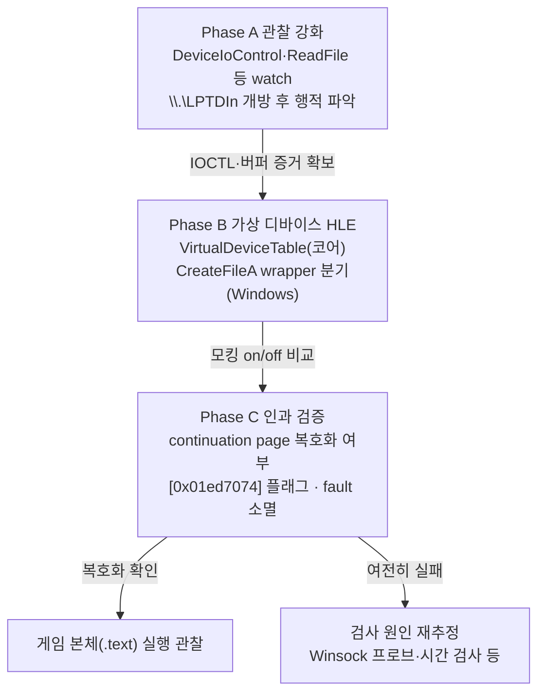

# 병렬포트 디바이스 검사 HLE 계획

관련 작업 지시: [병렬포트 디바이스 검사 HLE 계획 작업 지시](../work-orders/20260823-047-lptdi-device-hle-plan.md)

## 목적

보호 스텁은 진입 직후 `\\.\LPTDI1` 병렬포트 디바이스를 열고, 이 호스트에서는 그 개방이 실패한 뒤 continuation buffer를 복호화하지 않은 채 점프해 사망한다([작업 로그 20260823-046](../work-logs/20260823-046-teardown-attribution.md)). Win32 파일 API 경계(HLE)에서 아케이드 디바이스 경로를 에뮬레이션해 정상 복귀 경로를 확보하는 방법을 계획한다.

## 근거가 되는 확인 사실

* `CreateFileA("\\.\LPTDI1", GENERIC_READ, FILE_SHARE_READ, …)` — caller `0x01ed41f1`, 포트 숫자는 실행 중 변조되어 스캔으로 보인다.
* `.gdata`에 `"\\.\TDSD.VXD"`, `"\\.\LPTDI0"` 문자열과 해시성 blob.
* 보호 빌드 import에 `DeviceIoControl`, `_lopen`/`_lread`/`_lclose`, `OpenFile`이 있다. 런타임 관찰 watch list에는 아직 없다.
* 실패 경로의 끝은 continuation page(힙)로의 `ret`이고 페이지는 복호화되지 않았다. **개방 실패 → 복호화 생략의 인과는 아직 추정**이다.

## 설계 원칙

1. 게스트 코드 수정 없음. 경계는 기존처럼 import thunk(주입 runtime의 file API wrapper)다.
2. 플랫폼 중립 코어가 디바이스 정책을 소유하고, Windows backend가 wrapper 연결만 담당한다.
3. 모킹은 끌 수 있어야 한다. 개방 실패 재현과 성공 비교가 같은 도구에서 되어야 인과를 검증할 수 있다.
4. 실제 하드웨어 응답 값을 흉내 내는 것이 아니라, 관찰된 요청에 대한 최소 응답부터 시작해 필요 범위를 늘린다.

## 단계 계획

### Phase A — 관찰 강화 (probe)

launcher probe의 watch list에 `DeviceIoControl`, `ReadFile`, `WriteFile`, `CloseHandle`을 추가한다. `DeviceIoControl`의 두 번째 stack 인자가 IOCTL 코드라서 기존 4-인자 기록 형식으로도 코드가 수집된다. 목표는 개방 성공·실패 각각에서 스텁이 디바이스 핸들로 무엇을 하는지(읽기 크기, IOCTL 번호, 반복 횟수, 닫는 시점) 확보하는 것이다.

### Phase B — 가상 디바이스 HLE

구성 배치 제안(구현 시점에 실제 트리에 맞춰 확정):

| 구성 요소 | 위치 | 역할 |
| --- | --- | --- |
| 디바이스 정책 | target profile(`re2dj/target`) 확장 | `lptdi` 포트 목록, 응답 모드(pass/fail/canned), `tdsd-vxd` 허용 여부 |
| 가상 디바이스 테이블 | storage 계층(`re2dj/storage`, VFS와 같은 층) | `\\.\` 경로 판별, 가상 핸들 상태, 요청별 응답 |
| wrapper 분기 | Windows 주입 runtime(`injected_runtime.cpp`) | `CreateFileA`가 디바이스 경로면 host 파일계 대신 테이블로, `ReadFile`/`DeviceIoControl`/`CloseHandle`도 가상 핸들을 처리 |

게스트 입장에서는 실제 핸들과 구분되지 않는 dword 핸들을 받고, 이후 요청이 테이블의 응답 정책을 따른다. 초기 응답 정책은 "개방 성공, 읽기/컨트롤은 관찰된 요청에 0 바이트 또는 지정 값"이다.

### Phase C — 인과 검증

같은 빌드로 모킹 on/off 비교 실행을 하고 다음을 대조한다.

1. continuation page 덤프 변화 — 코드가 채워지는가.
2. `[0x01ed7074]` 플래그 값 변화.
3. illegal instruction 소멸 여부와 이후 실행 위치(원본 `.text` 진입까지).

복호화가 시작되면 Phase B 응답이 충분하다는 뜻이고, 여전히 실패하면 Winsock 프로브나 다른 검사가 공범이라는 뜻으로 Phase A 관찰을 넓힌다.

## 리스크와 대안

* **챌린지-응답**: 디바이스 읽기/컨트롤이 동글 데이터를 기대하면 고정 응답으로 부족하다. Phase A에서 버퍼 크기·IOCTL을 먼저 확인하고, 필요하면 blob(`.gdata` 해시성 데이터)과의 대응을 역설계한다.
* **검사 중첩**: 병렬포트 외에 시간·버전 검사가 있으면 모킹으로도 통과하지 못한다. Phase C의 실패가 곧 다음 관찰 대상 지정이다.
* **포트 스캔**: 스텁이 `LPTDI0..n`을 돌며 시도하므로 테이블은 접두사 기반(`\\.\LPTDI*`)으로 처리하고 특정 숫자에 묶이지 않는다.

## 해석 경계

개방 실패가 복호화 생략의 원인이라는 것은 현재 추정이다. Phase C 비교 실행이 유일한 확정 수단이며, 그 전까지 이 계획의 인과 서술은 전부 추정으로 표기한다.

## 검증

Phase A는 canonical 실행 로그에 새 API 기록이 나타나는 것으로, Phase B는 모킹 on/off 실행 차이로, Phase C는 위 세 대조 항목으로 각각 판정한다.

## 구현 결과 (작업 48)

Phase B의 최소 개방 모킹과 Phase C의 on/off 비교가 완료되었다. mock-off 두 실행은 실행별 주소가 다른 private RW page의 `#UD`로 끝났고, mock-on 두 실행은 synthetic handle `0xFEED0001`로 IOCTL `0x9c406410`·`0x9c406414`를 호출한 뒤 원본 entry `0x0043a640`에 도달했다. 성공 경로는 continuation page를 채워 실행하지 않고 `.gtide`에서 원본 entry로 직접 넘어갔다. 따라서 LPTDI 개방 실패가 기존 실패 경로의 원인이라는 인과는 확인됐지만, "복호화 생략"이라는 내부 메커니즘은 확인되지 않았다. 상세 증거는 [작업 로그 048](../work-logs/20260824-048-lptdi-mock-open.md)에 있다.

---

# Parallel-Port Device Check HLE Plan Work Order

Related design: [Parallel-Port Device Check HLE Plan](../design/20260823-047-lptdi-device-hle-plan.md)

## Goal

Plan how the Win32 file-API HLE boundary emulates the arcade parallel-port device path so the protection stub's planned return path can complete on modern hosts without modifying guest code.

## Phases

1. **Phase A (first implementation unit)** — extend the launcher probe watch list with `DeviceIoControl`, `ReadFile`, `WriteFile`, and `CloseHandle`; capture what the stub does with a device handle after open/failure, including IOCTL codes from existing four-argument logging.
2. **Phase B** — introduce a platform-neutral virtual-device table beside the VFS storage layer driven by target-profile policy (`lptdi` ports, response mode), branch in the Windows injected-runtime wrappers for `\\.\` paths across `CreateFileA`, `ReadFile`, `DeviceIoControl`, and `CloseHandle`.
3. **Phase C** — run matched mocking on/off comparisons against three checks: continuation-page contents, flag `[0x01ed7074]`, and disappearance of the illegal instruction with execution reaching original `.text`.

Risks tracked in the design: challenge-response depth, overlapping checks, prefix-based port scanning. Until Phase C confirms it, all causality between the failed open and skipped decryption stays marked as inferred.

## Implementation result (task 48)

The minimal Phase B open mock and Phase C on/off comparison are complete. Two mock-off runs ended in #UD on run-varying private RW pages; two mock-on runs issued IOCTLs `0x9c406410` and `0x9c406414` with synthetic handle `0xFEED0001`, then reached original entry `0x0043a640`. The success path bypassed the continuation page and transferred directly from `.gtide` to the original entry. This confirms failed LPTDI open as the cause selecting the old failure path, but does not confirm "skipped decryption" as the internal mechanism. See [work log 048](../work-logs/20260824-048-lptdi-mock-open.md).
