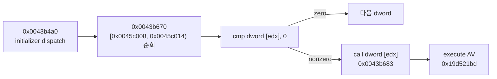

# 원본 초기화 간접 호출 AV 귀속 설계

관련 작업 지시: [원본 초기화 간접 호출 AV 귀속 작업 지시](../work-orders/20260824-049-original-init-av-attribution.md)

## 목적

LPTDI mock 성공 뒤 원본 entry `0x0043a640`에 도달한 canonical `ez2dj.exe`가 `0x19d521bd` 실행 access violation으로 종료되는 원인을 guest 명령과 데이터 구조에 귀속한다. 수정이나 우회보다 먼저 fault 시 레지스터·접근 종류·간접 호출 테이블을 실행 증거로 확보한다.

## 현재 근거

* 두 mock-on 실행에서 fault EIP `0x19d521bd`, ESP `0x001afee4`, stack `{0x0043b688, 0x001afef8, 0x0043b4c1, 0x0045c008}`가 동일했다.
* 동형 비보호 빌드 `ez2dj1.exe` 정적 디스어셈블에서 `0x0043b683`은 `call dword ptr [edx]`, `0x0043b688`은 다음 명령이다. 함수 `0x0043b670`은 `[0x0045c008, 0x0045c014)`를 4바이트씩 순회해 nonzero dword를 호출한다.
* 비보호 파일의 해당 배열은 `{0, 0x0043c600, 0x0044e710, 0}`이다. 보호 파일의 같은 raw 범위는 암호화되어 있어 정적 값으로 런타임 정상 여부를 판정할 수 없다.

## 진단 설계

기존 `--api-trace` first-chance access-violation 처리에 다음을 추가한다.

1. exception information의 접근 종류(read/write/execute)와 대상 주소를 기록한다.
2. fault thread의 전체 32비트 정수·제어 레지스터를 기록한다.
3. 각 레지스터가 main image 안을 가리키면 그 주소를 기준으로 경계 있는 dword window를 기록한다.
4. stack 상위 return/caller 주소 주변의 실행 바이트를 기록한다.
5. 같은 mock-on 실행을 반복해 `EDX=0x0045c008`, `[EDX]=0x19d521bd` 가설과 배열 나머지 값을 확인한다.

## 판정

* `EDX=0x0045c008`이고 `[EDX]=fault EIP`이면 AV를 손상된 첫 initializer sentinel의 간접 호출로 확정한다.
* 배열이 원본 entry 진입 시점부터 잘못됐다면 보호 해제의 `.data` 복원 문제다. fault 직전에만 바뀐다면 원본 초기화 중 overwrite를 추적한다.
* 레지스터가 다른 구조를 가리키면 정적 stack 해석을 철회하고 실제 구조를 기준으로 후속 watch 지점을 정한다.

## 검증

Windows x86 Debug 빌드와 CTest를 통과하고, canonical mock-on 로그에서 접근 종류·전체 레지스터·main-image pointer window가 함께 기록되는지 확인한다. 원본 자산이나 raw dump는 저장소에 추가하지 않는다.

## 결과

두 실행 모두 execute AV `0x19d521bd`에서 `EAX=ECX=EDX=0x0045c008`을 기록했고, `[EDX]=0x19d521bd`였다. return site `0x0043b688` 주변 실행 바이트는 비보호 빌드의 `call dword [edx]` 직후 코드와 일치했다. 따라서 손상된 첫 initializer sentinel의 간접 호출로 귀속을 확정했다. `.data` window 8 dword는 두 실행에서 동일했지만 비보호 빌드의 정상 배열과 전부 달랐다. 제한된 `.text` 호출 코드는 정상 복원된 반면 initializer `.data`는 복원되지 않았다는 사실까지 확인했다. IOCTL 실패가 직접 원인인지는 다음 작업으로 남긴다. 상세 증거는 [작업 로그 049](../work-logs/20260824-049-original-init-av-attribution.md)에 있다.

---

# Original-Initialization Indirect-Call AV Attribution Design

Related work order: [Original-Initialization Indirect-Call AV Attribution Work Order](../work-orders/20260824-049-original-init-av-attribution.md)

## Goal

Attribute the execute access violation at `0x19d521bd`, reached after the LPTDI mock lets canonical `ez2dj.exe` enter original code at `0x0043a640`, to a guest instruction and data structure. Capture runtime evidence before considering a fix or bypass.

## Current evidence

Both mock-on runs share fault EIP `0x19d521bd`, ESP `0x001afee4`, and stack `{0x0043b688, 0x001afef8, 0x0043b4c1, 0x0045c008}`. Static disassembly of sibling unprotected `ez2dj1.exe` identifies `0x0043b683` as `call dword ptr [edx]`; function `0x0043b670` walks `[0x0045c008, 0x0045c014)` and calls each nonzero dword. The unprotected file's array is `{0, 0x0043c600, 0x0044e710, 0}`. The protected file's corresponding raw range is encrypted and cannot establish runtime correctness.

## Diagnostic design

Extend first-chance access-violation handling under `--api-trace` to record access kind/address, full x86 integer/control registers, bounded dword windows for registers pointing into the main image, and instruction bytes around stack return/caller addresses. Repeat mock-on to test `EDX=0x0045c008` and `[EDX]=0x19d521bd` directly.

## Decision

If EDX identifies the first initializer slot and its dword equals fault EIP, attribute the AV to a corrupted sentinel called by `0x0043b683`. A bad array already at original entry indicates incomplete `.data` restoration; a late mutation requires an overwrite watch. Contradicting registers supersede the static inference.

## Verification

Pass the Windows x86 Debug build and CTest, then confirm a canonical mock-on log carries access metadata, full registers, and main-image pointer windows. No original asset or raw dump is added to the repository.

## Result

Both runs recorded execute AV `0x19d521bd` with `EAX=ECX=EDX=0x0045c008` and `[EDX]=0x19d521bd`. Code bytes around return site `0x0043b688` match the unprotected build immediately after `call dword [edx]`. The corrupt first initializer sentinel attribution is confirmed. All eight dwords in the `.data` window were stable across runs yet differed from the unprotected build's normal array. The limited `.text` call site is restored while initializer `.data` is not; whether failed IOCTLs directly cause that incomplete restoration remains follow-up work. See [work log 049](../work-logs/20260824-049-original-init-av-attribution.md).
