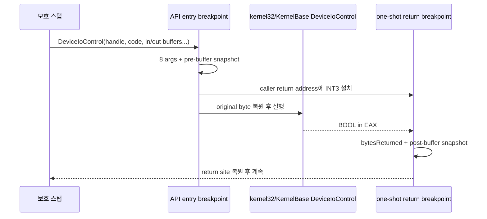

# LPTDI DeviceIoControl 반환 추적 설계

관련 작업 지시: [LPTDI DeviceIoControl 반환 추적 작업 지시](../work-orders/20260824-050-device-io-control-return-trace.md)

## 목적

synthetic LPTDI handle로 호출되는 `DeviceIoControl` 두 건의 8개 인자, 입력·출력 buffer 전후, 반환 EAX와 bytes-returned를 확보한다. host 실패가 `.data` initializer 불완전 복원과 연결되는지 판단할 다음 증거를 만든다.

## 설계

기존 `--api-trace` kernel32/kernelbase entry breakpoint를 유지한다. `DeviceIoControl` 진입 시 stack의 return address와 8개 인자를 읽고 bounded buffer snapshot을 기록한다. 같은 thread의 return address에 일회성 software breakpoint를 설치한다. API entry breakpoint는 기존처럼 원래 byte를 복원하고 한 instruction 뒤 재무장한다.

return breakpoint에서는 다음을 수행한다.

1. EAX를 Win32 BOOL 결과로 기록한다.
2. `lpBytesReturned`가 non-null이면 dword를 기록한다.
3. output buffer를 진입 전과 같은 상한으로 다시 읽어 변화 여부를 기록한다.
4. return site 원래 byte와 EIP를 복원하고 guest 실행을 계속한다.

## 안전과 경계

* buffer read는 최대 64바이트이며 `ReadProcessMemory` 실패를 관찰 누락으로 처리한다.
* return breakpoint는 thread당 하나만 허용한다. 겹치는 호출이 나타나면 덮어쓰지 않고 diagnostic 오류로 판정한다.
* API 반환값, last error, buffer, guest code는 수정하지 않는다. breakpoint byte만 일시 변경하고 즉시 복원한다.
* IOCTL 결과와 `.data` 손상의 상관은 확인할 수 있지만, 응답 값을 합성하는 것은 별도 설계·작업이다.

## 검증

Windows x86 Debug build와 CTest를 통과하고 mock-on을 2회 실행한다. 두 IOCTL 각각에서 동일한 8개 인자, EAX, bytes-returned, buffer 전후가 기록되는지 비교한다.

## 결과

두 실행 모두 IOCTL `0x9c406410`과 `0x9c406414`가 `EAX=FALSE`를 반환했고 input/output/bytes-returned를 변경하지 않았다. 첫 호출은 4바이트 동적 입력과 8바이트 출력, 두 번째는 24바이트 동적 입력과 104바이트 출력을 사용한다. 입력 challenge는 실행마다 달랐고 output의 호출 전 내용은 동일했다. 두 번째 bytes-returned의 초기·최종값 `0x01ed49d9`는 stack 잔존 코드 주소로, API가 쓰지 않았음을 보여준다. 고정 canned 응답보다 challenge-response 가능성이 확인됐으며, 다음 실험은 TRUE/0-byte만 합성해 BOOL 성공 여부와 output data 필요성을 분리한다. 상세 증거는 [작업 로그 050](../work-logs/20260824-050-device-io-control-return-trace.md)에 있다.

---

# LPTDI DeviceIoControl Return Trace Design

Related work order: [LPTDI DeviceIoControl Return Trace Work Order](../work-orders/20260824-050-device-io-control-return-trace.md)

## Goal

Capture all eight arguments, input/output buffers before and after, return EAX, and bytes-returned for the two `DeviceIoControl` calls made with the synthetic LPTDI handle. This supplies the next evidence for relating host failure to incomplete `.data` initializer restoration.

## Design

Keep the existing kernel32/kernelbase entry breakpoint. At DeviceIoControl entry, read the return address and eight stack arguments, record bounded buffer snapshots, and plant a one-shot breakpoint at that thread's return address. The existing one-instruction rearm restores the API entry breakpoint. At return, record EAX, bytes-returned, and the post-call output buffer, restore the caller byte/EIP, and continue without changing API results or guest data.

## Safety and boundary

Reads are capped at 64 bytes. Only one pending return is allowed per thread. The trace changes only temporary breakpoint bytes. It observes correlation but does not synthesize an IOCTL response; response HLE is a separate task.

## Verification

Pass the Windows x86 Debug build and CTest, then run mock-on twice and compare the complete entry/return record for both IOCTLs.

## Result

In both runs, IOCTLs `0x9c406410` and `0x9c406414` returned `EAX=FALSE` without changing input, output, or bytes-returned. The first uses a dynamic four-byte input and eight-byte output; the second uses a dynamic 24-byte input and 104-byte output. Challenge input changes per run while pre-call output is stable. The second bytes-returned value remained stack-residual code address `0x01ed49d9`, proving the API did not write it. The observations support a challenge-response protocol rather than a fixed canned value. The next experiment synthesizes TRUE with zero returned bytes to separate the success BOOL from required output data. See [work log 050](../work-logs/20260824-050-device-io-control-return-trace.md).
