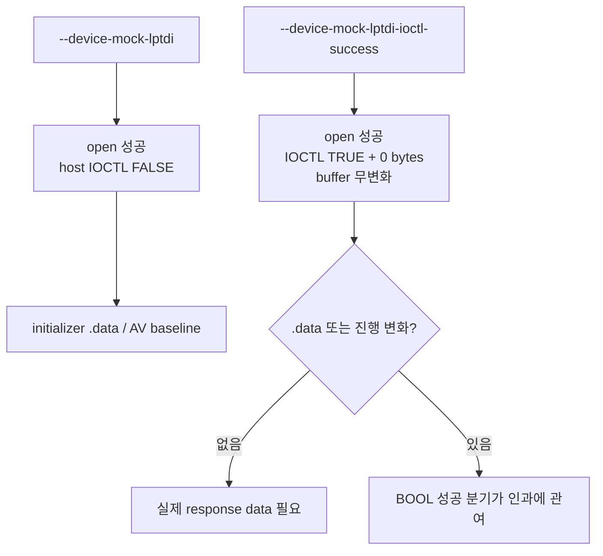

# LPTDI IOCTL 0바이트 성공 응답 실험 설계

관련 작업 지시: [LPTDI IOCTL 0바이트 성공 응답 실험 작업 지시](../work-orders/20260824-051-lptdi-ioctl-zero-success.md)

## 목적

LPTDI IOCTL host 실패와 `.data` initializer 불완전 복원의 인과를 한 단계 좁힌다. 두 IOCTL에 output buffer를 바꾸지 않고 `TRUE`, bytes-returned 0만 반환해 BOOL 성공 분기만 필요한지 실제 response data가 필요한지 분리한다.

## 설계

기존 `--device-mock-lptdi`는 open 성공 + 실제 DeviceIoControl 실패 baseline으로 유지한다. 새 옵션 `--device-mock-lptdi-ioctl-success`는 기존 옵션을 포함하고 canonical IAT의 `DeviceIoControl`만 주입 runtime wrapper로 교체한다.

wrapper 정책:

* synthetic handle이면 output buffer를 변경하지 않는다.
* `lpBytesReturned`가 non-null이면 0을 쓴다.
* `SetLastError(ERROR_SUCCESS)`와 `TRUE`를 반환한다.
* 다른 handle은 host `DeviceIoControl`로 전달한다.

## 검증

runtime probe에서 synthetic handle의 TRUE/0-byte/buffer-preserving 계약을 검증한다. Windows x86 build·CTest 후 새 옵션을 최소 2회 실행해 original entry 이후 `.data` 8-dword window, AV 주소, API 진행을 baseline과 비교한다.

## 해석 경계

변화가 없으면 output data가 필요하다는 결론까지만 가능하다. 올바른 challenge response 값이나 알고리즘을 뜻하지 않는다. 변화가 있어도 완전한 정상 복원이 아니라면 BOOL과 output이 모두 필요할 수 있다.

## 결과

runtime probe의 TRUE/0-byte/buffer-preserving 계약과 Windows x86 CTest 2건이 통과했다. canonical API trace 2회는 기존 initializer execute AV `0x19d521bd`와 원본 entry 이후 API를 모두 재현하지 않았다. 대신 WSOCK32 해제 뒤 보호 스텁의 기존 private-page 종료 경로로 돌아가 실행별 `0x002d6004`, `0x00209004`에서 #UD가 발생했다. `--break-exit-process` 실행도 별도 private page `0x0038b004`에서 종료 코드 `0xc000001d`를 확인했다.

따라서 IOCTL BOOL은 제어 흐름에 인과적으로 관여하지만, `TRUE`만으로는 정상 성공 경로를 만들지 못한다. 올바른 output data가 있어야 원본 entry와 `.data` 복원을 함께 진행할 수 있다는 방향이 확인됐다. 정확한 challenge-response 값과 알고리즘은 여전히 미확정이다.

---

# LPTDI IOCTL Zero-Byte Success Experiment Design

Related work order: [LPTDI IOCTL Zero-Byte Success Experiment Work Order](../work-orders/20260824-051-lptdi-ioctl-zero-success.md)

## Goal

Separate success-BOOL branching from response-data requirements by returning TRUE and zero bytes for both LPTDI IOCTLs without modifying output buffers.

## Design

Preserve `--device-mock-lptdi` as the open-success/host-IOCTL-failure baseline. New option `--device-mock-lptdi-ioctl-success` includes it and replaces only the canonical DeviceIoControl IAT slot with an injected-runtime wrapper. Synthetic handles receive TRUE, bytes-returned zero, unchanged output, and ERROR_SUCCESS; other handles forward to the host API.

## Verification

Verify the wrapper contract in the runtime probe, pass the Windows x86 build and CTest, then run the new option at least twice and compare the `.data` eight-dword window, AV, and API progress with baseline.

## Interpretation boundary

No change establishes only that response data is required, not its value or algorithm. Partial change may mean both the success BOOL and output are required.

## Result

The runtime probe's TRUE/zero-byte/buffer-preserving contract and both Windows x86 CTest cases passed. Two canonical API-trace runs no longer reproduced either the later initializer execute AV at 0x19d521bd or post-entry APIs. Instead, after WSOCK32 unload, the protected stub returned to its existing private-page teardown path and raised #UD at per-run addresses 0x002d6004 and 0x00209004. A separate `--break-exit-process` run ended with code 0xc000001d at private page 0x0038b004.

The IOCTL BOOL therefore causally affects control flow, but TRUE alone does not produce the valid success path. Correct response data is required to combine original-entry progress with `.data` restoration. The challenge-response values and algorithm remain unresolved.
