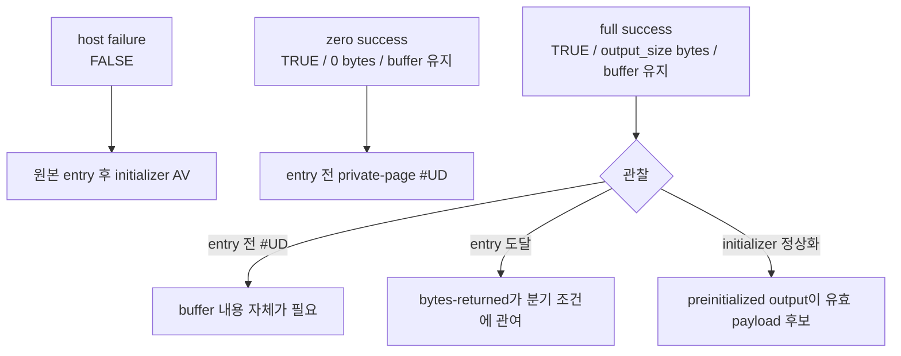

# LPTDI/HASP 응답 계약 탐색 설계

관련 작업 지시: [LPTDI/HASP 응답 계약 탐색 작업 지시](../work-orders/20260824-052-lptdi-hasp-response-contract.md)

## 근거

프로젝트에서 확인한 첫 LPTDI IOCTL은 4바이트 input과 8바이트 output을 사용한다. 공개 HASP4 API의 Service 2 `HaspCode`도 seed를 받고 네 개의 16비트 code, 총 8바이트를 반환한다. 이는 HASP 후보를 강하게 지지하지만, `LPTDI` 자체는 Aladdin의 공개 driver 이름과 일치하지 않고 다른 동글 보호 셸에서도 관찰된 이름이므로 vendor protocol로 확정하지 않는다.

두 IOCTL의 호출 전 output은 실행마다 동일하고 이미 nonzero 구조를 포함한다. 작업 51은 `TRUE`와 bytes-returned 0만 반환해 이 preinitialized output을 유지했지만 실패 경로를 선택했다. Win32 계약상 bytes-returned는 실제 output 길이이므로, 다음 최소 변수는 buffer를 유지한 채 bytes-returned만 output buffer 크기로 바꾸는 것이다.

## 설계

기존 zero-byte 옵션을 보존하고 새 `--device-mock-lptdi-ioctl-full-success`를 추가한다. runtime의 IOCTL mock mode를 export 상태로 분리한다.

정책 값은 1=zero success, 2=full-size preserving success로 제한한다. synthetic handle만 이 정책을 받고 다른 handle은 host API로 전달한다. full-size mode는 output pointer가 null이면 0, 아니면 `output_size`를 bytes-returned에 기록하며 output bytes는 바꾸지 않는다.

## 검증

runtime probe에서 두 mode의 반환값, last-error, bytes-returned, buffer 불변을 검증한다. Windows x86 build와 CTest 후 canonical API trace를 최소 두 번 실행해 원본 entry, private-page #UD, initializer AV와 `.data` window를 비교한다.

## 해석 경계

full-size mode가 진전하더라도 preinitialized buffer가 실제 HASP response였다고 바로 확정하지 않는다. 실패하면 response payload가 필요하다는 결론까지만 내리고, HASP password나 return code를 공개 자료만으로 발명하지 않는다.

## 결과

runtime probe에서 zero/full-size mode의 TRUE, last-error, bytes-returned, buffer 불변 계약이 모두 통과했다. canonical full-size API trace 두 실행은 host `DeviceIoControl`에 도달하지 않았고 원본 entry 이후 API나 `0x19d521bd` initializer AV도 만들지 않았다. 대신 zero-byte mode와 같은 WSOCK32 unload 후 private-page 실패 경로를 선택해 `0x00310004`, `0x00237004`에서 #UD가 발생했다.

따라서 guest는 full output 길이만으로 성공을 인정하지 않는다. 호출 전 buffer의 고정 nonzero 내용도 그대로는 유효 응답이 아니며, driver가 실제로 쓰는 payload가 필요하다. 공개 HASP4 shape와 4→8바이트 일치는 계속 유력한 단서지만, classic HASP의 공개 `\\.\HASP`/28-byte packet 경로와 LPTDI의 4/24-byte input·8/104-byte output은 직접 일치하지 않는다. 다음 구현은 보호 스텁의 output 소비를 추적하고 response profile을 외부 입력으로 주입하는 방향이어야 한다.

---

# LPTDI/HASP Response-Contract Exploration Design

Related work order: [LPTDI/HASP Response-Contract Exploration Work Order](../work-orders/20260824-052-lptdi-hasp-response-contract.md)

## Evidence

The first observed LPTDI IOCTL uses a four-byte input and an eight-byte output. Public HASP4 Service 2, HaspCode, likewise takes a seed and returns four 16-bit codes, totaling eight bytes. This strongly supports HASP as a candidate but does not identify LPTDI as an Aladdin driver protocol: the name differs from published Aladdin driver names and appears in another dongle protection shell.

Both IOCTL output buffers are stable and nonzero before the call. Task 51 preserved those bytes but returned TRUE with zero bytes, selecting the failure path. Since Win32 defines bytes-returned as the actual output length, the next minimal variable is to preserve the buffer while reporting its full size.

## Design

Preserve the zero-byte option and add `--device-mock-lptdi-ioctl-full-success`. Export runtime IOCTL policy state with modes 1 for zero success and 2 for full-size preserving success. Synthetic handles receive the selected policy; all other handles forward to the host. Full-size mode writes output_size when output is non-null, otherwise zero, without modifying output bytes.

## Verification

Probe both modes for return value, last error, bytes returned, and unchanged output. Pass the Windows x86 build and CTest, then run the canonical API trace at least twice and compare original-entry progress, private-page #UD, initializer AV, and the `.data` window.

## Interpretation boundary

Progress does not by itself prove that the preinitialized bytes are a genuine HASP response. Failure establishes only that response payload is required; public documentation is not enough to invent passwords or return codes.

## Result

The runtime probe passed TRUE, last-error, bytes-returned, and unchanged-buffer contracts for both zero and full-size modes. Two canonical full-size API traces never reached host DeviceIoControl, post-original-entry APIs, or the initializer AV at 0x19d521bd. They selected the same post-WSOCK32-unload private-page failure path as zero-byte mode and raised #UD at 0x00310004 and 0x00237004.

The guest therefore does not accept the full output length alone. The stable nonzero pre-call buffer is not a valid response unchanged; driver-written payload is required. The public HASP4 four-to-eight-byte shape remains a strong clue, but classic HASP's documented `\\.\HASP` / 28-byte packet path does not directly match LPTDI's 4/24-byte inputs and 8/104-byte outputs. The next implementation should trace output consumption and inject response profiles from external input.
