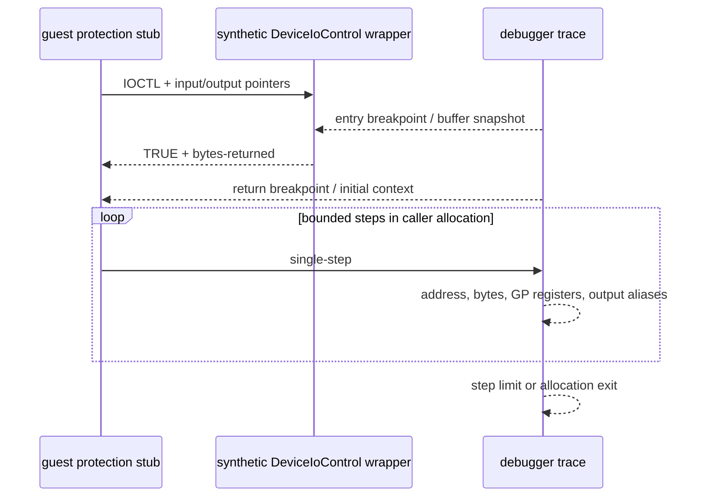

# LPTDI IOCTL 복귀 후 소비 추적 설계

관련 작업 지시: [LPTDI IOCTL 복귀 후 소비 추적 작업 지시](../work-orders/20260824-053-lptdi-post-ioctl-trace.md)

## 근거

작업 52에서 합성 LPTDI `DeviceIoControl`은 `TRUE`와 전체 output 길이를 반환했지만, 호출 전 output을 그대로 둔 경우 보호 스텁은 원본 entry 전에 private-page 실패 경로를 선택했다. 따라서 다음 단계는 응답값을 더 추측하는 것이 아니라 guest가 복귀 직후 output과 반환값을 어떻게 소비하는지 확인하는 것이다.

현재 API trace는 host `DeviceIoControl` 진입과 guest return address를 감시하지만, IAT가 injected runtime의 합성 래퍼로 교체된 경우에는 래퍼 진입을 보지 못한다. runtime export도 동일한 API watch로 등록하면 기존 argument snapshot과 one-shot return breakpoint를 재사용할 수 있다.

## 설계

launcher에 `--lptdi-post-ioctl-trace <max-steps>`를 추가한다. 이 옵션은 API trace를 활성화하고 합성 `DeviceIoControl` export를 watched API로 등록한다. 합성 handle 호출의 복귀 breakpoint에서 현재 명령을 먼저 기록한 뒤 trap flag로 같은 private allocation 안의 후속 명령만 제한적으로 수집한다.

각 sample은 IOCTL code, 순번, instruction address와 최대 16바이트, 8개 범용 레지스터를 기록한다. 레지스터 값이 output buffer 범위 안을 가리키면 이름을 별도로 기록한다. instruction decoder를 새 의존성으로 도입하지 않으며, 수집된 byte stream과 register trail을 근거로 후속 response profile의 필드 위치를 결정한다.

추적은 호출별·thread별 상태로 분리하고, 지정한 step 수 또는 return address와 다른 allocation으로 제어가 이동하면 종료한다. host API나 다른 module 내부를 장시간 단일 스텝하지 않는다. 기존 zero/full-size IOCTL 정책과 일반 API trace 동작은 보존한다.

## 검증

Windows x86 build와 CTest를 통과시킨 뒤 full-size preserving mode에서 canonical 실행을 최소 두 번 수행한다. 실제로 도달한 IOCTL의 entry/return event가 잡히는지, output pointer alias와 최초 비교·분기 instruction이 반복 실행에서 일치하는지 확인한다. 이번 작업에서는 관찰된 필드 외의 HASP response 값을 만들거나 하드코딩하지 않는다.

## 결과

합성 래퍼 entry/return과 외부 call 복귀를 추적했다. full-size preserving 경로에서 `0x9c406410`은 세 번 반복됐으며, 각 복귀 뒤 `0x01ed4253`이 output 첫 DWORD를 0과 비교했다. 세 번째 시도 뒤 `0x01ed4279`가 첫 DWORD를 EAX로 반환했고 두 상위 caller도 nonzero 여부를 검사했다. 두 512-step 관찰 실행은 호출별 112, 112, 394개의 동일한 address/byte trail을 보였다. 최종 128-step canonical 두 실행은 여전히 initializer access violation에 도달하지 않고 private-page #UD로 끝났다.

따라서 다음 response profile은 최소한 첫 DWORD를 명시적으로 제어할 수 있어야 한다. 다만 이 추적은 첫 DWORD의 nonzero 소비만 확인했으며 나머지 4바이트와 두 번째 IOCTL의 의미, 정상 HASP response 값은 확정하지 않는다.

---

# LPTDI Post-IOCTL Consumption Trace Design

Related work order: [LPTDI Post-IOCTL Consumption Trace Work Order](../work-orders/20260824-053-lptdi-post-ioctl-trace.md)

## Evidence

Task 52 showed that synthetic LPTDI DeviceIoControl returning TRUE and the full output length still selected a private-page failure path before the original entry when the pre-call output was preserved. The next step is therefore to observe how the guest consumes the return value and output rather than guess another response.

The existing API trace watches host DeviceIoControl entry and its guest return address, but misses the injected synthetic wrapper after the IAT is replaced. Registering that runtime export as the same watched API lets the launcher reuse argument snapshots and the one-shot return breakpoint.

## Design

Add `--lptdi-post-ioctl-trace <max-steps>`. It enables API tracing, registers the synthetic DeviceIoControl export as a watched API, records the instruction at the synthetic-handle return breakpoint, and then uses the trap flag to collect a bounded sequence within the caller's private allocation.

Each sample records the IOCTL code, sequence, instruction address, up to 16 instruction bytes, and eight general-purpose registers. Register values inside the output-buffer range are named separately. No instruction-decoder dependency is introduced; the collected bytes and register trail will determine fields for a later external response profile.

Trace state is per call and thread and ends at the requested step count or when control leaves the return allocation. This avoids prolonged stepping through host APIs or unrelated modules. Existing zero/full-size policy and ordinary API tracing remain unchanged.

## Verification

Pass the Windows x86 build and CTest, then perform at least two canonical full-size-preserving runs. Confirm entry/return events for every IOCTL reached on that path and verify that output aliases and the first comparison/branch instructions repeat. Do not invent or hard-code unobserved HASP response values in this task.

## Result

The trace captured synthetic-wrapper entry/return and resumed after external calls. On the full-size-preserving path, 0x9c406410 repeated three times and 0x01ed4253 compared the first output DWORD with zero after each return. After the third attempt, 0x01ed4279 returned that DWORD in EAX and two callers tested it for nonzero. Two 512-step observation runs produced identical per-call address/byte trails of 112, 112, and 394 samples. Two final 128-step canonical runs still avoided the initializer access violation and ended in private-page #UD.

A later response profile must therefore control at least the first DWORD explicitly. This trace establishes only its nonzero consumption; the remaining four bytes, the second IOCTL, and a valid HASP response remain unresolved.
