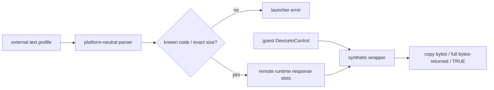

# LPTDI 외부 응답 profile 설계

관련 작업 지시: [LPTDI 외부 응답 profile 작업 지시](../work-orders/20260824-054-lptdi-external-response-profile.md)

## 근거

작업 53은 첫 IOCTL `0x9c406410`의 8바이트 output 중 첫 DWORD가 보호 스텁의 zero/nonzero 분기값으로 소비됨을 확인했다. 그러나 정상 response 값과 계산식은 확인되지 않았다. 따라서 특정 HASP code를 구현에 넣지 않고, 사용자가 제공한 실험 응답을 외부 profile로 주입해 값별 제어 흐름을 비교해야 한다.

## profile 형식

UTF-8/ASCII text 파일의 첫 유효 줄은 `re2dj-lptdi-response-v1`이다. 이후 줄은 `IOCTL_CODE=HEX_BYTES`이며 빈 줄과 `#` 주석을 허용한다.

```text
re2dj-lptdi-response-v1
0x9c406410=0100000000000000
0x9c406414=...
```

현재 launcher는 바이너리에서 확인한 두 code만 허용하고 각각 정확히 8바이트, 104바이트를 요구한다. 같은 code의 중복, 잘못된 hex, 알 수 없는 code, 길이 불일치는 실행 전에 오류로 처리한다. profile은 원본 자산이나 실제 동글 dump가 아니며 저장소에는 예시 response를 추가하지 않는다.

## 실행 구조



parser는 공용 core에 두고 filesystem과 표준 C++만 사용한다. launcher는 `--device-mock-lptdi-response-profile <path>`로 profile을 읽고 runtime의 code별 고정 크기 export buffer와 활성 길이에 복사한다. injected runtime은 synthetic handle과 일치하는 code에만 profile bytes를 쓰며, profile에 없는 code는 `ERROR_INVALID_FUNCTION`과 `FALSE`를 반환한다. 다른 handle은 host `DeviceIoControl`로 전달한다.

## 검증 전략

parser 단위 테스트에서 정상 profile, 주석/공백, 중복, 잘못된 hex와 길이 검증 기반을 확인한다. runtime probe는 알려진 byte pattern의 copy, bytes-returned, missing-code failure와 host 분리를 검증한다. Windows x86 build/CTest 후 첫 DWORD가 0인 profile과 1인 profile을 각각 최소 두 번 canonical 실행해 IOCTL 호출 수, 두 번째 IOCTL 도달, 원본 entry, initializer access violation, private-page #UD를 비교한다.

## 해석 경계

0/1은 protocol 후보가 아니라 branch 분리용 synthetic 값이다. 어느 값이 더 진행하더라도 올바른 HASP response로 부르지 않는다. 실제 challenge 파생 관계가 확인되기 전까지 profile은 분석 도구다.

## 결과

공용 parser와 runtime profile mode가 build/CTest를 통과했다. 첫 DWORD 0 profile의 두 실행은 첫 IOCTL을 한 번 호출하고 두 번째 `0x9c406414`에 도달했다. 두 번째 항목이 없는 명시적 `FALSE` 뒤 원본 `.text`로 진행했지만, 두 실행 모두 기존 initializer execute AV `0x19d521bd`와 동일한 손상 `.data` window를 재현했다. 첫 DWORD 1 profile의 두 실행은 첫 IOCTL을 세 번 반복하고 두 번째 IOCTL 없이 private-page #UD로 끝났다.

따라서 0은 첫 단계 통과값으로 확인됐지만 정상 HASP response라고 볼 수는 없다. 다음 profile 실험은 두 번째 104바이트 output 소비 위치와 통과 필드를 먼저 추적한 뒤 수행한다.

---

# LPTDI External Response Profile Design

Related work order: [LPTDI External Response Profile Work Order](../work-orders/20260824-054-lptdi-external-response-profile.md)

## Evidence

Task 53 confirmed that the first DWORD of the first IOCTL's eight-byte output is consumed as a zero/nonzero branch value, but did not establish a valid response or algorithm. The runtime therefore needs externally supplied experimental responses instead of a hard-coded HASP code.

## Profile format

The first effective line of an ASCII/UTF-8 text file is `re2dj-lptdi-response-v1`. Following lines use `IOCTL_CODE=HEX_BYTES`; blank lines and `#` comments are accepted. The launcher currently accepts only the two binary-confirmed codes and requires exactly 8 and 104 bytes. Duplicate codes, malformed hex, unknown codes, and size mismatches fail before launch. No example response or dongle dump is added to the repository.

## Runtime structure

A platform-neutral standard-C++ parser reads the profile. `--device-mock-lptdi-response-profile <path>` copies validated entries into fixed-size exported runtime response slots. The injected wrapper copies bytes and returns their full length and TRUE only for a matching synthetic-handle code. Missing codes return FALSE with `ERROR_INVALID_FUNCTION`; non-synthetic handles forward to the host.

## Verification

Unit tests cover valid profiles, comments/whitespace, duplicates, malformed hex, and validation inputs. The runtime probe covers byte copying, bytes returned, missing-code failure, and host separation. After the Windows x86 build and CTest, run first-DWORD-zero and first-DWORD-one profiles at least twice each and compare IOCTL count, second-IOCTL reachability, original entry, initializer access violation, and private-page #UD.

## Interpretation boundary

Zero and one are synthetic branch-separation values, not protocol candidates. Progress does not identify either as a valid HASP response. The profile remains an analysis mechanism until a challenge-derived relationship is confirmed.

## Result

The shared parser and runtime profile mode passed the build and CTest. Two first-DWORD-zero runs called the first IOCTL once and reached 0x9c406414. After the deliberately missing second entry returned FALSE, original `.text` ran but reproduced the known initializer execute AV at 0x19d521bd and the same corrupt `.data` window in both runs. Two first-DWORD-one runs repeated the first IOCTL three times and ended in private-page #UD without reaching the second IOCTL.

Zero is therefore confirmed as the first-stage advance value, not as a valid HASP response. The next profile experiment must first trace consumption and pass fields of the second 104-byte output.
