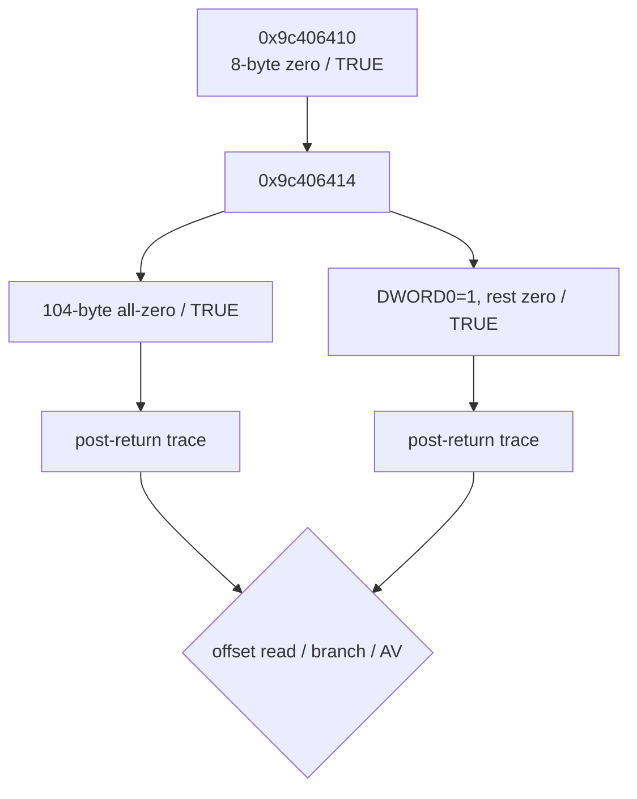

# LPTDI 두 번째 응답 소비 탐색 설계

관련 작업 지시: [LPTDI 두 번째 응답 소비 탐색 작업 지시](../work-orders/20260824-055-lptdi-second-response-consumption.md)

## 근거

작업 54에서 첫 IOCTL `0x9c406410`의 8바이트 output 첫 DWORD를 0으로 주입하면 두 번째 `0x9c406414`에 도달했다. 그러나 profile에 두 번째 항목이 없어 `FALSE`가 반환됐고, 복귀 코드는 `0x01ed4dc6`에서 BOOL만 검사한 뒤 output을 읽지 않았다. 따라서 104바이트 output의 소비 위치는 두 번째 IOCTL이 `TRUE`일 때만 관찰할 수 있다.

## 실험 설계

첫 response는 확인된 첫 단계 통과값인 8바이트 zero로 고정한다. 두 번째 response는 protocol 후보가 아닌 branch-separation 값 두 개를 사용한다.

1. 104바이트 all-zero
2. 첫 DWORD만 little-endian 1이고 나머지는 zero

각 profile을 최소 두 번 실행한다. 기존 `--lptdi-post-ioctl-trace`로 복귀 직후 instruction bytes와 registers를 수집하고, Capstone은 저장소 의존성이 아닌 일회성 분석 도구로만 사용해 memory operand의 effective address가 output `[base, base+104)`에 들어오는 sample을 찾는다. 두 trace의 최초 분기 차이, 두 번째 IOCTL 반복 횟수, 원본 entry, initializer AV와 private-page #UD를 비교한다.

## 구현 판단

기존 versioned profile과 bounded tracer가 필요한 기능을 이미 제공하므로, 우선 코드 변경 없이 실행·분석한다. output memory reference가 간접 주소 계산 때문에 식별되지 않을 때만 diagnostic을 보강한다. synthetic 0/1은 실제 HASP response로 해석하지 않는다.

## 완료 조건

두 번째 IOCTL 성공 경로에서 output을 읽는 최초 offset 또는 output을 읽지 않는 더 상위 계약을 반복 증거로 확인하고, access violation의 주소·register·`.data` window 변화를 분류한다.

## 결과

기존 tracer만으로 완료 조건을 충족했다. 두 번째 response의 첫 DWORD가 0이면 `0x01ed4dd5`에서 통과한 뒤 output offset 4~11을 순서대로 읽는다. 각 바이트는 두 번째 IOCTL input seed를 두 번 변환해 얻은 8바이트 mask와 XOR되고, `[0x01ed7bf4]`가 가리키는 8바이트 상태에 기록된다. 첫 DWORD가 1이면 이 loop를 건너뛰고 private-page #UD 경로를 선택한다.

all-zero 두 번째 response는 기존의 고정 initializer AV `0x19d521bd`를 실행별 `0xd3e72bdf`, `0x0c5c6c3c`로 바꾸었다. 이는 offset 4~11이 `.data` 복원 결과에 인과적으로 관여함을 확인하지만, synthetic zero가 올바른 동글 응답이라는 뜻은 아니다. 이 경로에서 104바이트 중 관찰된 소비 범위는 offset 0과 4~11뿐이다.

---

# LPTDI Second-Response Consumption Design

Related work order: [LPTDI Second-Response Consumption Work Order](../work-orders/20260824-055-lptdi-second-response-consumption.md)

## Evidence

Task 54 reached 0x9c406414 by supplying an eight-byte zero first response. Because the second profile entry was absent, the wrapper returned FALSE and the guest checked only the BOOL at 0x01ed4dc6 without reading the 104-byte output. Output consumption can therefore be observed only with a successful second IOCTL.

## Experiment

Hold the first response at the confirmed eight-byte zero advance value. Compare a 104-byte all-zero second response with a response whose first DWORD is little-endian one and whose remaining bytes are zero. These are branch-separation values, not protocol candidates.

Run each profile at least twice. Use the existing bounded post-return trace and an analysis-only local Capstone installation to identify samples whose effective memory operands fall inside the 104-byte output. Compare the first differing branch, retry count, original entry, initializer AV, and private-page #UD.

## Implementation decision

The versioned profile and bounded tracer already provide the required mechanism, so begin without code changes. Extend diagnostics only if indirect address formation prevents identification. Never interpret synthetic zero or one as a real HASP response.

## Completion criteria

Produce repeatable evidence for the first consumed second-output offset, or for a higher-level contract that does not read output, and classify changes to access-violation address, registers, and `.data` window.

## Result

The existing tracer satisfied the completion criteria. A zero first DWORD in the second response passes the check at 0x01ed4dd5, after which the guest reads output offsets 4 through 11 in order. Each byte is XORed with an eight-byte mask obtained by transforming the second-IOCTL input seed twice and written into the eight-byte state addressed through [0x01ed7bf4]. A first DWORD of one skips this loop and selects the private-page #UD path.

An all-zero second response changed the previously stable initializer AV at 0x19d521bd to per-run addresses 0xd3e72bdf and 0x0c5c6c3c. This confirms that offsets 4 through 11 causally affect `.data` restoration; it does not make synthetic zero a valid dongle response. Of the 104 supplied bytes, only offsets 0 and 4 through 11 were observed being consumed on this path.
